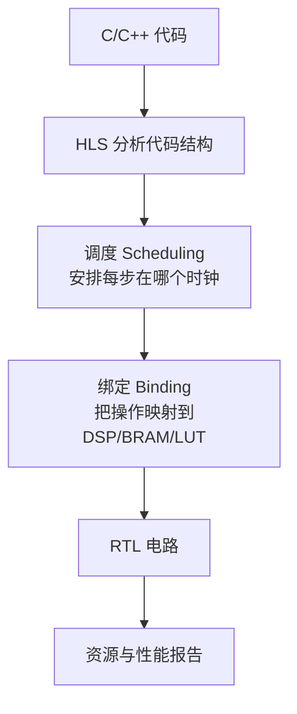
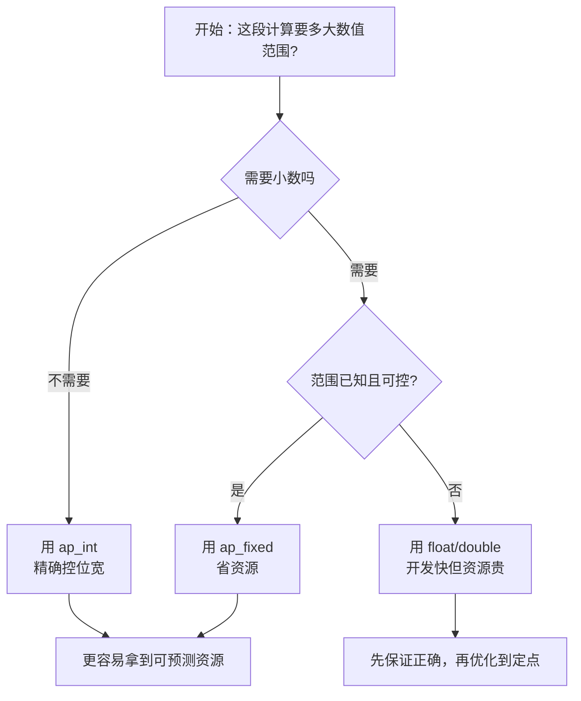
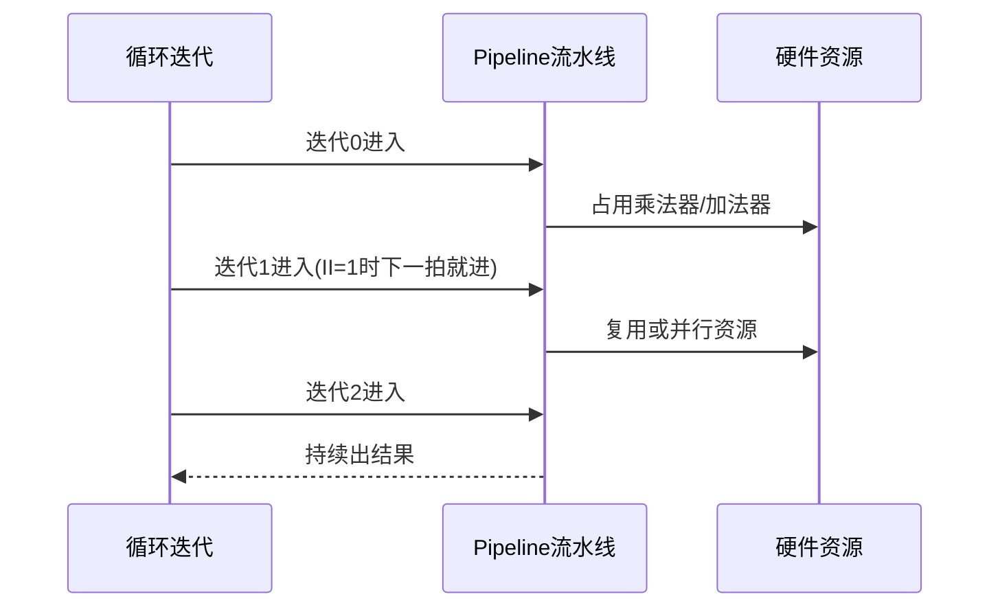
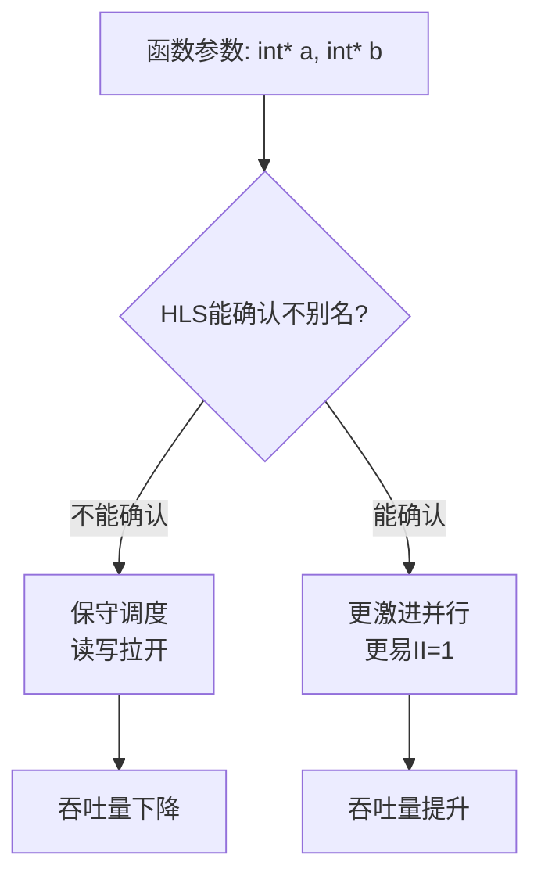
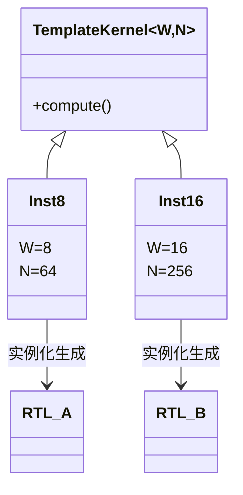
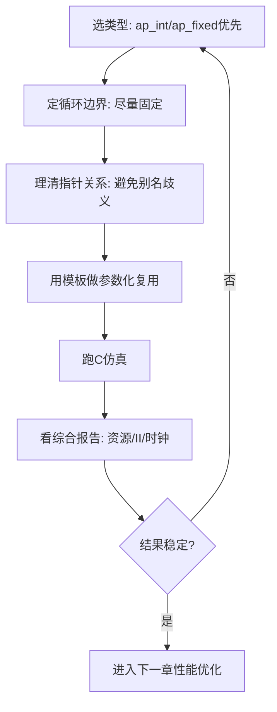

# 第 4 章：容易综合出好硬件的编码模式

上一章我们讲了“数据怎么进出内核”。  
这一章我们讲“**内核内部代码怎么写，HLS（高层次综合：把 C/C++ 自动翻译成硬件电路）才不容易跑偏**”。

你可以把它想成做饭：  
食材一样（算法一样），但刀工和火候（编码风格）不同，最后菜品差别会非常大（时序、资源、吞吐量差很多）。

---

## 4.1 先建立总心智：代码不是“执行”，而是“搭电路”

**可预测硬件结构**，意思是：你大概能提前猜到会生成多少乘法器、多少寄存器、每拍能吞几笔数据。  
Imagine 你在搭乐高，不是写小说。每一行代码都像在加砖块。

这张图可以这样读：  
你写的 C++ 先被“看结构”，再被“排时间表”，再被“分配硬件零件”，最后才变成 RTL（寄存器传输级电路描述）。  
所以写法越规整，结果越稳定。

---

## 4.2 类型（Type）选择：先定“容器尺寸”，再算数据

**类型**就是数据容器的规格。  
Think of it as 快递箱子大小：箱子太大浪费空间（资源），太小会装不下（溢出）。

第一次出现的几个常见术语：

- **位宽（bit-width）**：一个数用多少二进制位表示，比如 16 位、32 位。
- **`ap_int<N>`**：任意精度整数，`N` 位，由你精确指定。
- **`ap_fixed<W,I>`**：定点数，总位宽 `W`，其中整数位 `I`，适合可控范围的小数计算。
- **DSP**：FPGA 上专门做乘加的“计算发动机”。

走读一下：  
如果你像做前端性能优化一样，先“量体裁衣”，HLS 更容易给你稳定结果。  
这有点像 React 里你先把 state 结构设计好，再谈渲染性能。

---

## 4.3 循环（Loop）写法：像装配线，不像 while 黑盒

**循环边界（loop bound）**就是循环最多跑几次。  
如果边界是编译时可知（比如 `for i=0..1023`），HLS 就像工厂经理拿到明确订单，能提前排产。  
如果边界全是运行时变量，工具会保守估计，结果通常更“重”。

这里的 **II（Initiation Interval，启动间隔）** 是“每隔几拍能接收一个新迭代”。  
II=1 就是最理想的“每拍来一件”。  
你可以 picture 它像快递分拣线：每秒都能放一个新包裹，吞吐量就高。

---

## 4.4 指针（Pointer）与别名（Aliasing）：地址要像快递单一样清楚

**指针**是“内存地址标签”。  
**别名（aliasing）**是“两个标签可能指向同一个箱子”。  
如果 HLS 不确定会不会指向同一地址，它会保守串行，防止写乱数据。

走读：  
这就像数据库事务。  
如果系统不确定两条 SQL 是否改同一行，就会加更重的锁。  
在 HLS 里也是同理：信息越明确，并行越敢开。

---

## 4.5 模板（Template）：像 TypeScript 泛型，但会“长成硬件副本”

**模板**是编译期参数化机制。  
简单说：你写一套“模具”，编译时按参数生成多个版本。  
Think of it as 同一套乐高图纸，8 位做一版，16 位再做一版。

这张图的重点：  
模板参数在“编译期”就定了，不是运行时变量。  
所以它很像 Next.js build 阶段生成静态页面：运行时不再付额外开销。  
在 HLS 里，这常常意味着“零运行时开销抽象”。

---

## 4.6 把四个模式组合成“稳定配方”

最后给你一个实战检查流。  
Imagine 每次写 kernel 前先走一遍，就像上线前跑 CI 清单。

走读：  
这不是“写完再祈祷”的流程。  
这是“边写边对齐硬件结构”的流程。  
你会发现综合报告更可解释，调优也更快。

---

## 4.7 本章对应示例（`coding_modeling`）

- 类型：`using_arbitrary_precision_arith`、`using_fixed_point`
- 循环：`variable_bound_loops`
- 指针：`Pointers/basic_arithmetic`
- 模板：`using_C++_templates`、`using_C++_templates_for_multiple_instances`

建议做法：每次只改一个维度。  
比如先只改类型，不改循环。这样你能清楚看到“哪个改动导致了哪个硬件变化”。

---

下一章我们会在这个基础上进入第 5 章：  
**如何进一步榨出并行度和性能（pipeline / unroll / dataflow / memory parallelism）**。