# Chapter 3：数据如何进出一个 Kernel（内核）

上一章我们学了“去哪里找例子”。  
这一章我们讲“数据怎么走路”。

想象你开了一家厨房：

- **厨师** = `kernel`（内核，也就是被综合成硬件电路的顶层函数）
- **点菜单** = 控制寄存器（告诉厨师“做什么、做多少”）
- **仓库搬运车** = 内存映射 AXI（按地址去 DDR/HBM 搬很多原料）
- **传送带** = AXI4-Stream（连续一口一口喂数据）

接口选错，就像让外卖小哥一勺一勺搬米：能做，但慢到崩溃。

---

## 3.1 先建立全局地图：Kernel 边界有三条路

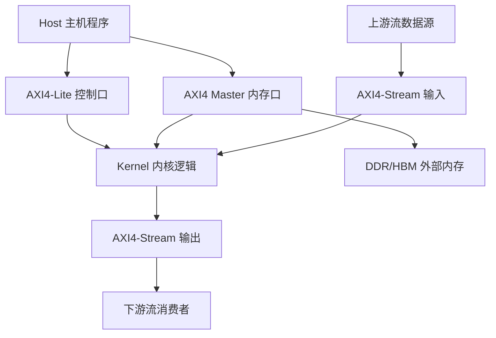

这张图可以这样读：  
想象一个工厂车间，**控制口**像前台按钮，**内存口**像叉车通道，**流接口**像流水线。三条路都连到同一个车间（内核逻辑），但每条路的“交通规则”不同。

---

## 3.2 概念关系图：三种接口到底各管什么

> 第一次出现术语解释：  
> **AXI**（Advanced eXtensible Interface）可以理解成 FPGA 世界里非常标准的“物流协议”。  
> **AXI4-Lite** 适合小量配置。  
> **AXI4 Master（m_axi）** 适合按地址批量搬数据。  
> **AXI4-Stream（axis）** 适合连续数据流，不带地址。

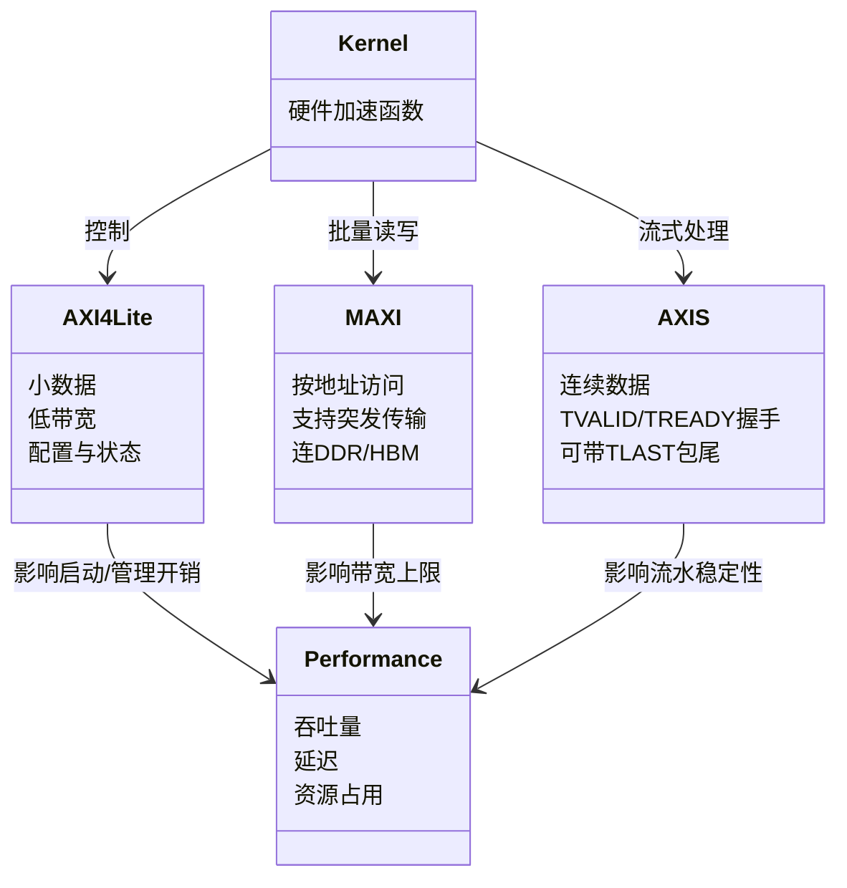

你可以把它想成 React 项目里的三类状态来源：  
- `AXI4-Lite` 像 `props` 里的配置参数（小、明确）  
- `m_axi` 像去数据库批量查数据  
- `axis` 像 WebSocket 持续推流

---

## 3.3 控制寄存器（AXI4-Lite）：告诉 Kernel 什么时候干活

**控制寄存器**就是一组“可读可写的小格子”，主机往里写数字，硬件据此行动。  
想象微波炉面板：`时间`、`火力`、`开始键` 都是寄存器风格。

### 控制流程

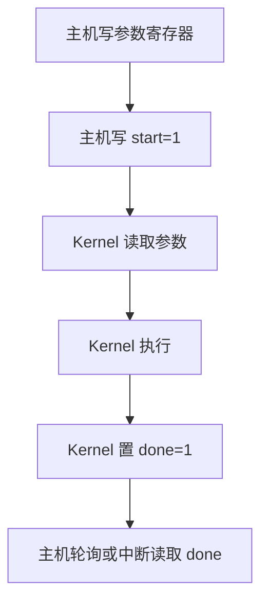

这就是最常见的“下单-做菜-取餐”流程。  
在 `interface_design/using_axi_lite` 里，你会看到这种模式的最基础写法。

### 交互时序（request trace）

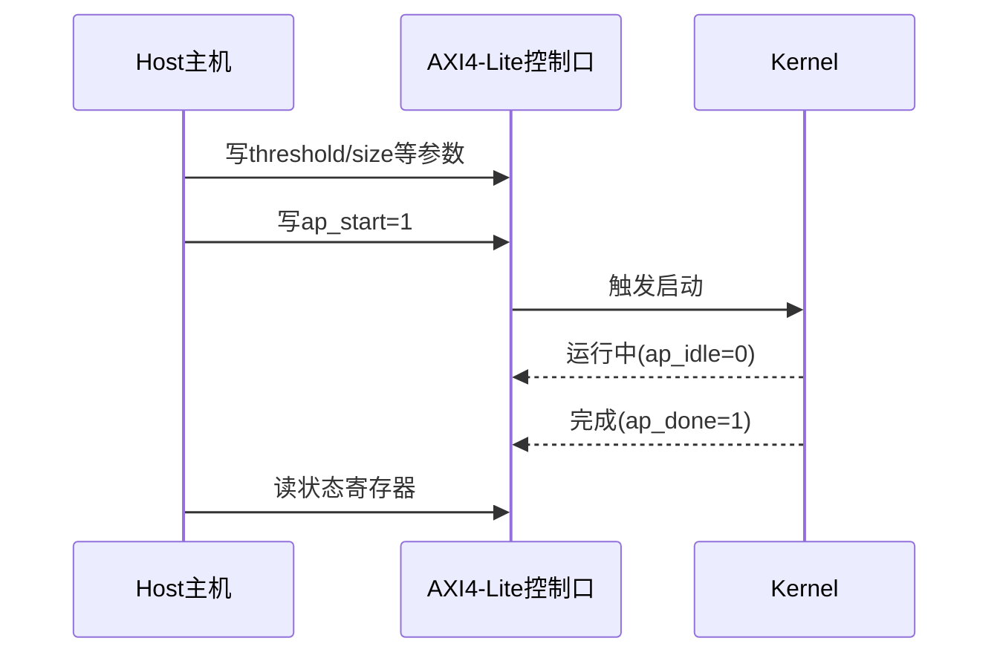

这个时序可以理解为：主机像项目经理，先发 Jira 任务（写参数），再点“开始”，最后查状态。

---

## 3.4 内存映射 AXI（m_axi）：按地址搬大批数据

**内存映射**（memory-mapped）意思是：硬件把外部内存看成“有门牌号的仓库货架”，通过地址去拿货。  
`m_axi` 是“我主动去内存读写”的主设备接口，所以叫 **master**（主发起方）。

### 架构图：m_axi 在系统中的位置

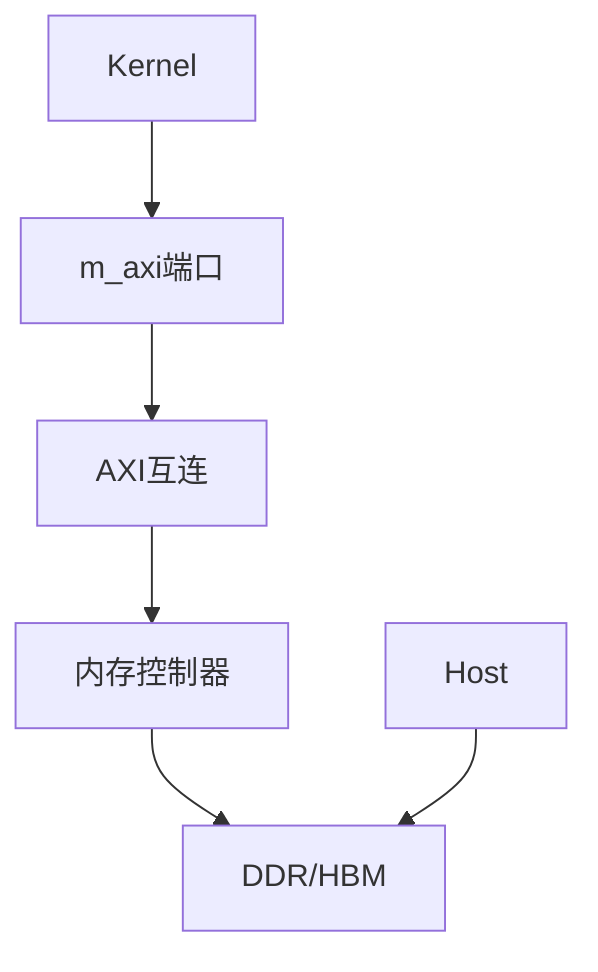

想象：Kernel 不是直接碰 DDR，而是先过“高速路收费站”（AXI 互连和内存控制器）。

### 为什么“突发传输（burst）”很关键

**突发传输**就是“一次报地址，连续搬多拍数据”，像快递员一次搬一整箱，而不是每次只拿一件再重新登记。

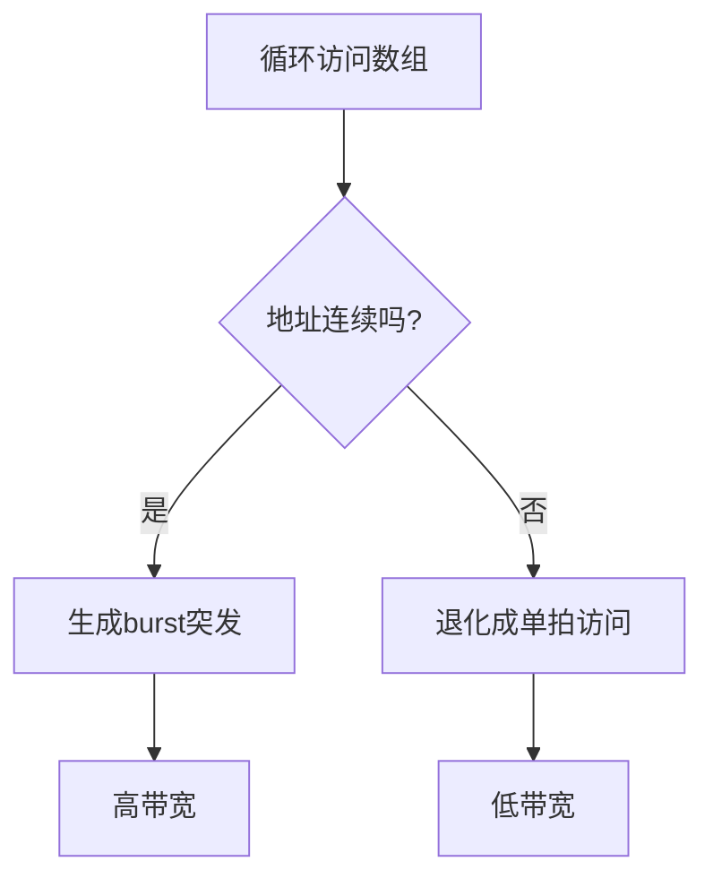

这也是 `manual_burst_*` 示例要教你的核心：  
代码里多一个不合适的 `if`，就可能让“整箱搬运”退化成“单件搬运”。

---

## 3.5 AXI4-Stream：像传送带一样连续喂数据

**流接口**（streaming interface）没有地址，只有“这一拍有没有数据”。  
它靠握手信号工作：

- `TVALID`：发送方说“我这拍有货”
- `TREADY`：接收方说“我这拍接得住”
- 两者同时为 1 才真正传输

### 握手时序图

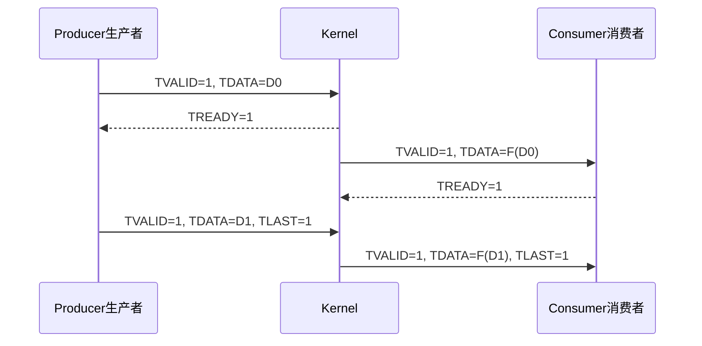

`TLAST` 可以理解成“这一包的最后一件货”，常见于视频帧、网络包结尾。  
这正是 `using_axi_stream_with_side_channel` 在讲的点。

### 背压（back-pressure）直观图

**背压**就是下游太慢时，反过来让上游“先别发”。

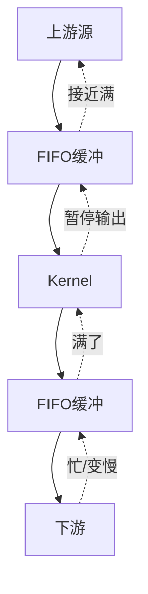

你可以把它想成地铁站限流：后面站台满了，前面闸机会暂时关小，避免系统崩掉。

---

## 3.6 接口选择如何改变性能（最实用）

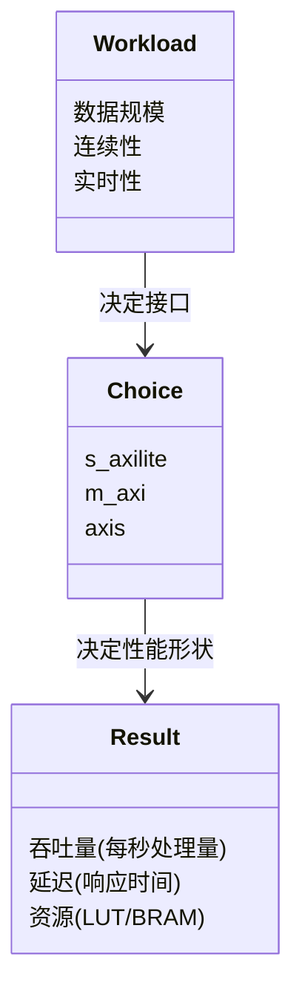

一句话：**接口不是“语法偏好”，而是性能开关**。

- 控制参数：`s_axilite`
- 大数组进出 DDR：`m_axi`
- 连续实时数据：`axis`

### 快速决策流程

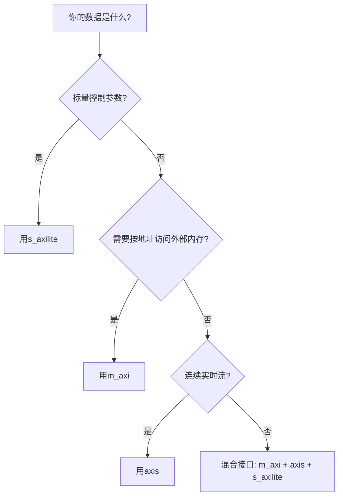

实际项目里最常见是 **混合接口**：  
`s_axilite` 负责“控制台”，`m_axi` 负责“仓库”，`axis` 负责“传送带”。

---

## 3.7 对照仓库示例：这章该先跑哪些目录

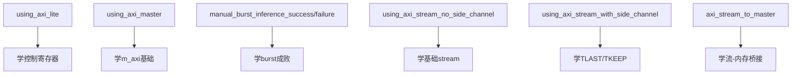

建议你按图顺序跑。  
这像先学“方向盘”，再学“高速超车”，最后学“拖挂车倒库”。

---

## 本章小结（你现在应该掌握）

1. `kernel` 边界有三条主路：控制、内存、流。  
2. `s_axilite` 管“小而关键”的控制信号。  
3. `m_axi` 管“大批量、有地址”的数据，`burst` 决定带宽上限。  
4. `axis` 管“连续实时”数据，握手和背压决定是否稳定满速。  
5. 接口选择直接塑造吞吐量、延迟和资源占用。

下一章我们进内核内部，看“同样的数据，怎么在硬件里并行处理”。