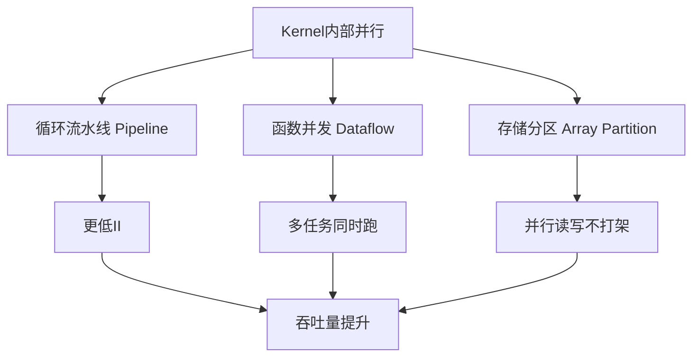
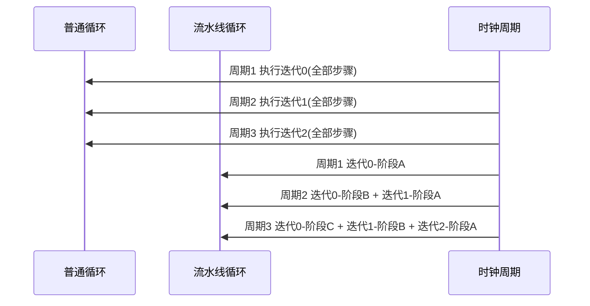
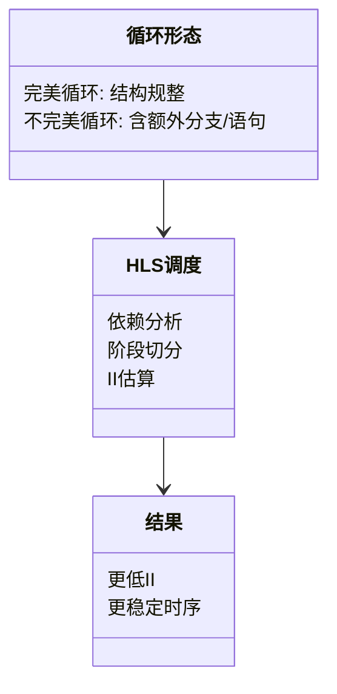
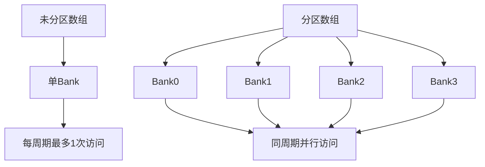
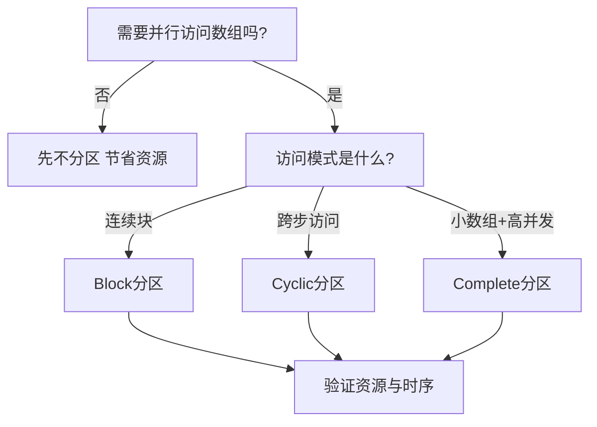
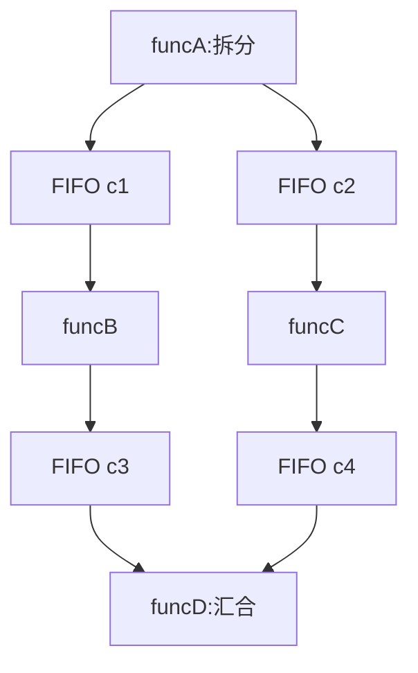
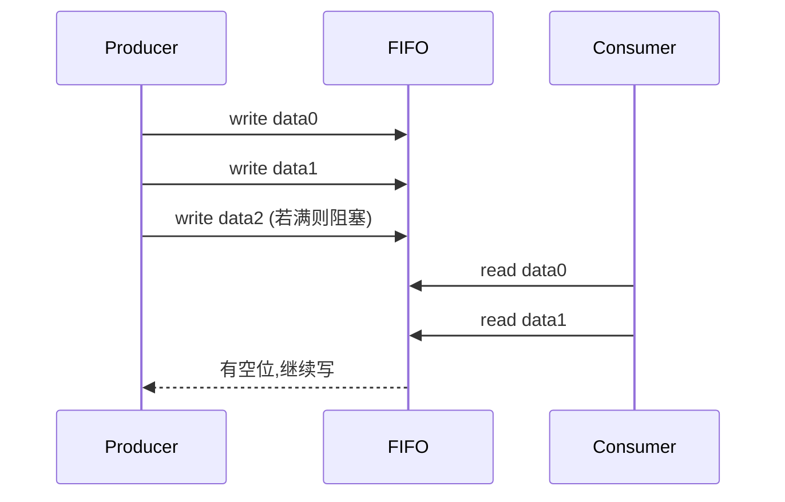
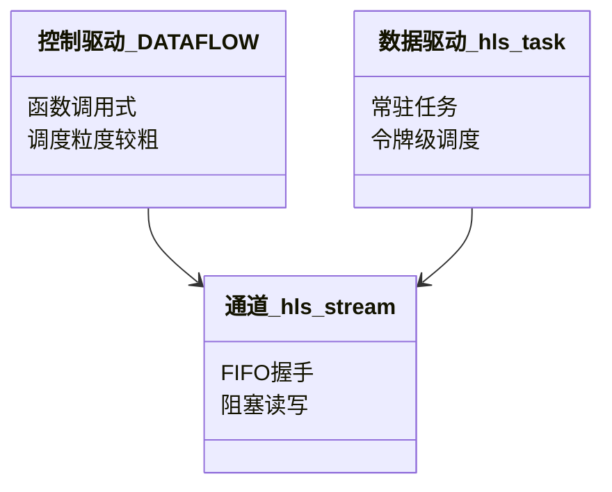
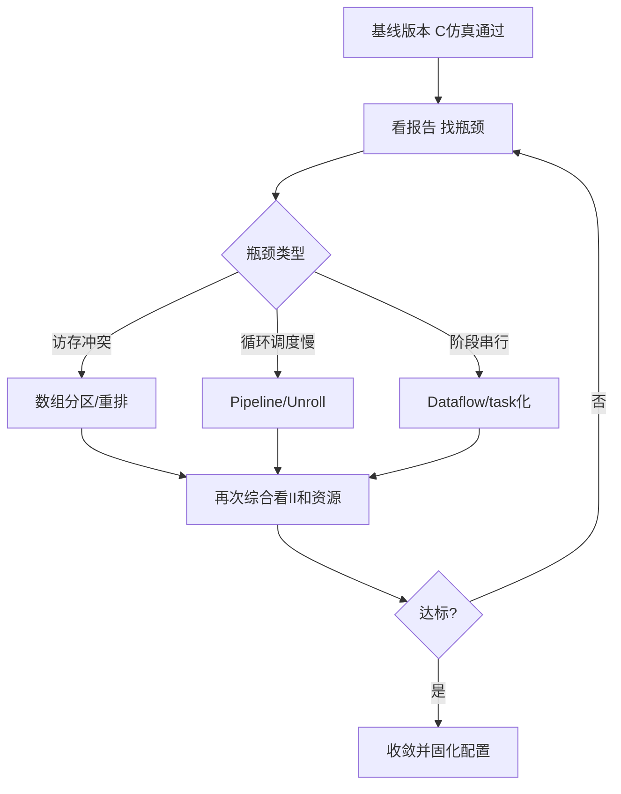

# Chapter 4：数据在 Kernel 内部如何并行处理

在第 3 章我们讲了“门口怎么进出货”（AXI、Stream、控制寄存器）。  
这一章我们走进“工厂车间内部”，看货物怎么被**并行加工**。

---

## 4.1 先有一个总心智模型：一条路变成立交桥

**Imagine** 你在经营一家外卖厨房。  
如果只有一个灶台，订单只能排队。  
FPGA + HLS 的目标，就是把一个灶台变成“多灶台 + 传送带 + 分区冰箱”。

- **吞吐量（Throughput）**：单位时间做完多少份菜。  
- **延迟（Latency）**：一份菜从下单到出餐要多久。  
- **启动间隔（Initiation Interval, II）**：两份菜“开始制作”的时间间隔（按时钟周期算）。II=1 最理想，表示每拍都能开新工单。

这张图可以理解成“并行性能三件套”。  
`Pipeline` 像装配线，`Dataflow` 像多工位协作，`Array Partition` 像把一个大仓库拆成多个小仓库，避免大家抢同一个门。

---

## 4.2 循环如何变成流水线（Pipeline）

**Think of it as** 汽车工厂。  
不是一辆车做完再做下一辆，而是 A 工位焊接时，B 工位同时给上一辆喷漆。

上面左边是“串行做完整个迭代”，右边是“阶段重叠”。  
当管线灌满后，你会看到几乎每个周期都有新结果在推进，这就是 II 降低带来的吞吐收益。

---

## 4.3 为什么“完美循环”更容易跑快

**完美循环（Perfect Loop）** 用白话说，就是循环结构很规整，像整齐的货架。  
没有多余分支、没有乱跳逻辑，HLS 更容易排产。

你可以把它类比成 SQL 查询优化。  
规则、可预测的查询（像完美循环）更容易被数据库做高效执行计划。  
不规则的分支（像不完美循环）也能跑，但优化空间会变窄。

---

## 4.4 内存墙：数组分区（Array Partition）怎么破

**Array Partition（数组分区）** 是把一个数组拆成多个“bank（存储分片）”。  
**Imagine** 一个超市只有一个收银台，队伍必堵。分成 8 个收银台后，结账速度暴涨。

这张图表示：  
不分区时，循环即使想并行，也会卡在“同一时刻只能读一个元素”。  
分区后，多个计算单元可以同拍拿不同数据，像多车道高速。

这就是一个实战决策树。  
`Complete` 像“人人一把专属钥匙”，最快但最费资源。  
`Block/Cyclic` 像“合理分组排队”，性能和资源更平衡。

---

## 4.5 函数如何并发：DATAFLOW 像多服务微架构

`#pragma HLS DATAFLOW` 可以理解成：  
把一个大函数拆成多个常驻小工位，用 FIFO（先进先出队列）传数据。

这很像 Node.js + 消息队列，或者像 Kafka 流处理：上游产出、下游消费，彼此解耦。

这是经典“菱形（diamond）”拓扑。  
`funcB` 和 `funcC` 没依赖，所以能并发跑。  
`funcD` 像网关服务，等两路结果齐了再合并输出。

这个时序图展示了**反压（Backpressure）**：  
下游慢了，上游会被 FIFO“顶住”。  
反压不是 bug，而是硬件里很重要的自动限流机制。

---

## 4.6 数据驱动任务：`hls::task` 像常驻后台 Worker

`hls::task` 可以看作硬件里的“后台线程”，一直在线处理。  
**You can picture this as** 前端里的 Web Worker：主流程不卡，任务异步并发。

简单说：  
传统 DATAFLOW 像“按批次发车”。  
`hls::task` 像“地铁到站即走”，更适合持续流数据（视频流、包流）。

---

## 4.7 组合拳：怎么把 II 压下去

不要只开一个 pragma。  
高性能通常是“存储 + 流水 + 任务”三者配合。

这条流程像调接口性能。  
先 profiling，再对症下药，不要“盲目 all-in 优化”。

---

## 4.8 本章小结（你现在应该会什么）

你现在应该建立了这套直觉：

1. **Pipeline**：让循环像装配线重叠执行，目标是 II 更小。  
2. **Array Partition**：让内存像多收银台，减少抢端口。  
3. **Dataflow / task**：让函数像微服务并发，用 FIFO 解耦。  
4. 三者组合，才能把 Kernel 内部从“单车道”升级成“立体交通网”。

下一章我们会讲：  
同样是 C++，为什么有些写法“天生好综合”，有些写法会把资源和时序拖垮。