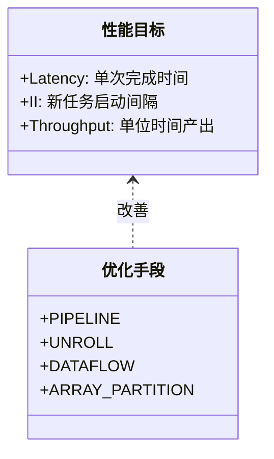
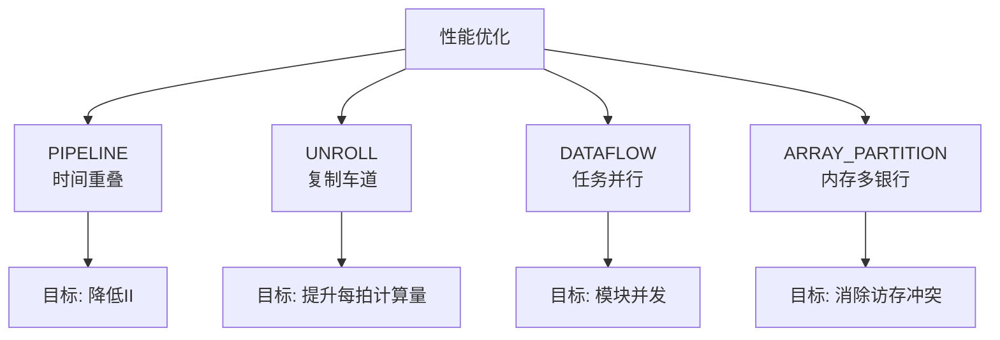
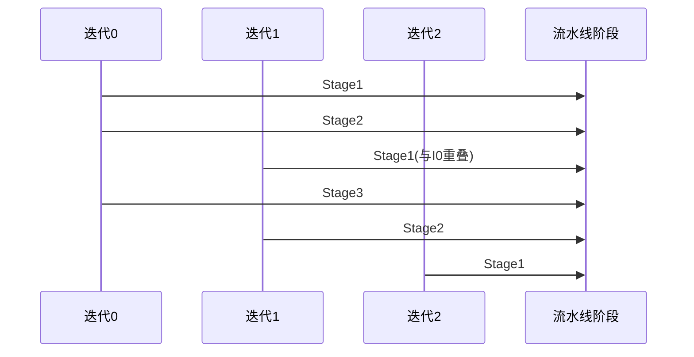
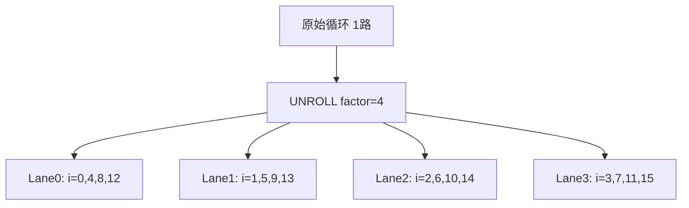
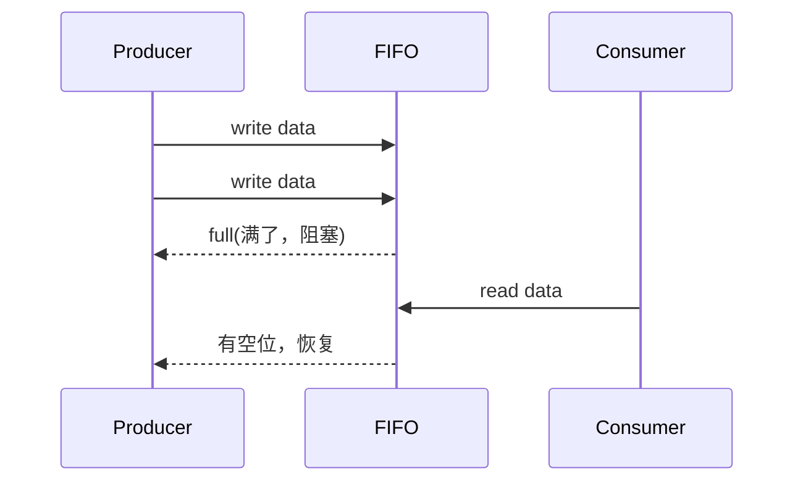
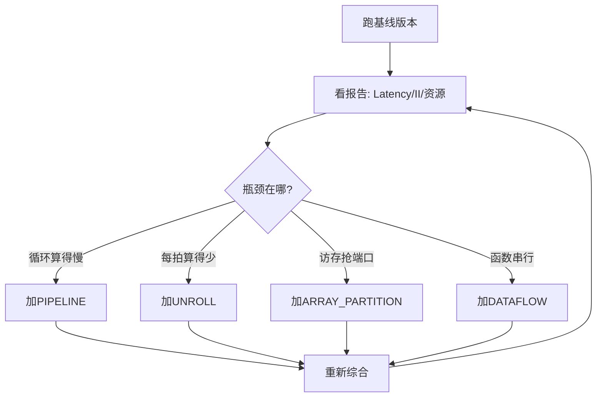

# 第 5 章：提取并行性与性能（Extracting parallelism and performance）

到这里，你已经会“写得能综合”。  
这一章我们要升级成“写得跑得快”。

想象你在经营一家奶茶店：  
前四章是“你会做奶茶了”，这一章是“你怎么做到高峰期也不排队”。

---

## 5.1 先有性能“仪表盘”：Latency 和 II 是什么？

**Latency（延迟）**，先用大白话解释：一份数据从“进门”到“出门”花了多久。  
想象外卖下单到送达，用时就是延迟。

**II（Initiation Interval，启动间隔）**，先用大白话解释：流水线每隔多少拍可以“再开一单”。  
想象奶茶店每隔几秒能开始做下一杯，而不是等上一杯完全做完。



这张图可以这样看：  
性能目标像 KPI 面板，`PIPELINE`、`UNROLL`、`DATAFLOW`、`ARRAY_PARTITION` 像四个调优旋钮。  
你不是盲目加 pragma，而是看 KPI 选旋钮。

---

## 5.2 四把“加速扳手”总览

你可以把这四种优化想成游戏里的四种技能树：时间并行、空间并行、任务并行、内存并行。



这就像修高速路：  
`PIPELINE` 是让车“前后跟车更紧”；`UNROLL` 是“加车道”；`DATAFLOW` 是“分段施工同时干”；`ARRAY_PARTITION` 是“多收费站并行放行”。

---

## 5.3 `PIPELINE`：让时间重叠起来

**PIPELINE（流水线）**第一次出现，先用白话：把一个大步骤拆成多个小工位，让不同数据在不同工位同时进行。  
很像 CPU 里的取指/译码/执行，也像洗衣机流水线：洗、漂、烘可以错开批次。

常见写法：

```cpp
for (int i=0; i<N; i++) {
#pragma HLS PIPELINE II=1
  out[i] = a[i] * k + b[i];
}
```



这张时序图说明：  
不是“做完迭代0才开始迭代1”，而是像工厂装配线那样交叠推进。  
当 II=1 时，理想状态是每个时钟周期都能启动一个新迭代。

---

## 5.4 `UNROLL`：复制计算单元，换吞吐

**UNROLL（循环展开）**第一次出现，先用白话：把一个循环体复制多份，同时算多个元素。  
想象从“一口锅炒一份”升级为“四口锅同时炒”。

```cpp
for (int i=0; i<16; i++) {
#pragma HLS UNROLL factor=4
  y[i] = x[i] + w[i];
}
```



图里四个 Lane（车道）就是四个并行计算单元。  
但注意：车道多了，喂数据也要跟上，不然就像四个厨师抢一个水龙头。

---

## 5.5 `ARRAY_PARTITION`：内存也要“多车道”

**ARRAY_PARTITION（数组分区）**第一次出现，先用白话：把一个大数组拆成多个小存储块，让同一拍能并行访问多个元素。  
这就像把一个超市收银台拆成多个结账窗口。

```cpp
int buf[16];
#pragma HLS ARRAY_PARTITION variable=buf cyclic factor=4 dim=1
```

```mermaid
graph TD
A[buf[16]] --> B[bank0]
A --> C[bank1]
A --> D[bank2]
A --> E[bank3]
F[并行读取4个元素] --> B
F --> C
F --> D
F --> E
```

这张图的重点：  
`UNROLL` 负责“多厨师”，`ARRAY_PARTITION` 负责“多水龙头”。  
两者经常要配套，不然会出现 **bank conflict（存储体冲突）**——白话就是“大家挤同一个窗口”。

---

## 5.6 `DATAFLOW`：函数级并行，像微服务流水线

**DATAFLOW（数据流）**第一次出现，先用白话：把一个大函数拆成多个子任务，通过 FIFO（先进先出队列）边传边算。  
很像 Node.js 的流式管道，也像视频平台的“解码 -> 滤镜 -> 编码”三段并行。

```cpp
#pragma HLS DATAFLOW
load(in, local);
compute(local, tmp);
store(tmp, out);
```


图里的每个方块像独立工位。  
`load` 不必等 `compute` 完全结束才继续，三段可以重叠。  
这就是任务级并行：不是加快一个人，而是多人协作同时干。

---

## 5.7 反压（Backpressure）和死锁（Deadlock）：并行系统的“交通堵塞”

**Backpressure（反压）**第一次出现，先用白话：下游太慢，上游被迫停。  
像高速出口堵住后，后面的车一路刹停。

**Deadlock（死锁）**第一次出现，先用白话：大家互相等，谁都不动。  
像四辆车在十字路口都礼让，结果全卡住。



这个时序图说明了反压机制。  
它是好事也是风险：好在系统自动限流，风险是 FIFO 深度太小会频繁停顿。

---

## 5.8 把它们组合起来：实战思路（非常重要）

你可以把调优流程想成玩《原神》配队：先定主 C（瓶颈），再配辅助（pragma），最后看实战数据（报告）。



这张图就是你的日常闭环。  
不要一次加十个 pragma。  
像调咖啡配方一样，一次改一个变量，观察结果最稳。

---

## 5.9 在 `Vitis-HLS-Introductory-Examples` 里怎么练？

建议练习顺序（从易到难）：

1. `Pipelining/Loops/*`：先把 II 概念练熟。  
2. `Array/array_partition_*`：理解“计算并行”和“内存并行”要配套。  
3. `Task_level_Parallelism/Control_driven/*`：练 `DATAFLOW` 和 FIFO 深度。  
4. `Task_level_Parallelism/Data_driven/*`：再看 `hls::task` 的更细粒度并行。

---

## 5.10 本章小结

想象你在搭一条自动化工厂线：

- `PIPELINE`：让同一条线不空转。  
- `UNROLL`：多开几条并行工位。  
- `ARRAY_PARTITION`：给工位足够的原料通道。  
- `DATAFLOW`：把工厂拆成可并行协作的车间。

最终目标永远是同一个：  
**更低延迟（Latency）、更小 II、更高吞吐，同时资源别爆。**

下一章我们会进入第 6 章：怎么在不同 HLS 流程（TCL/CFG/Unified）之间迁移这些优化，不推倒重来。