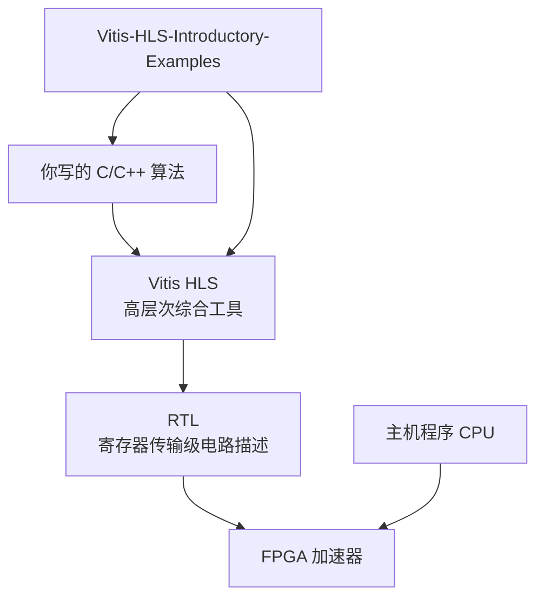
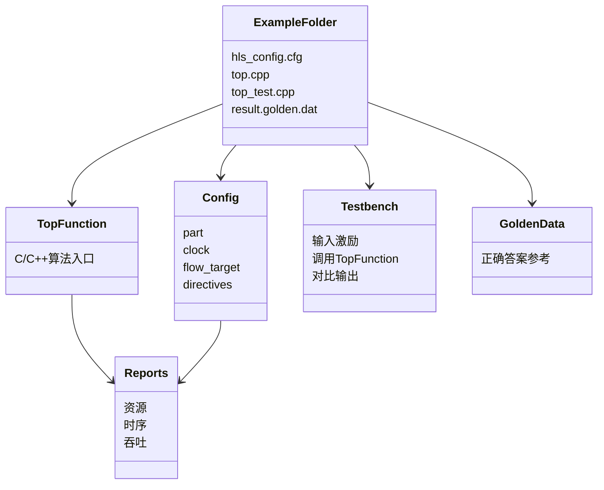
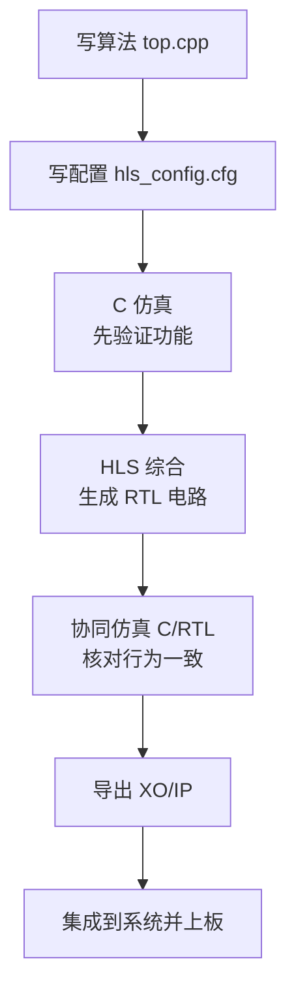
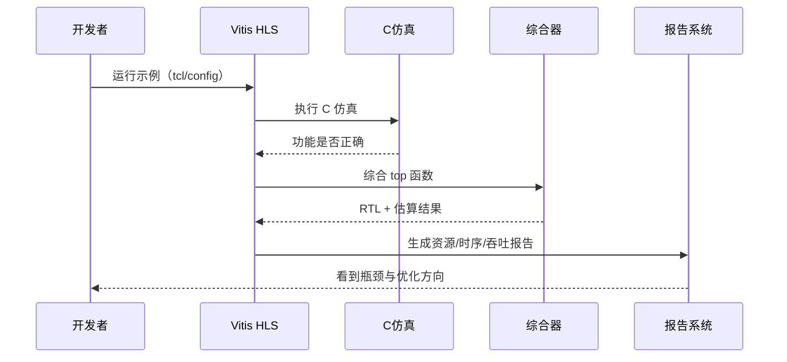
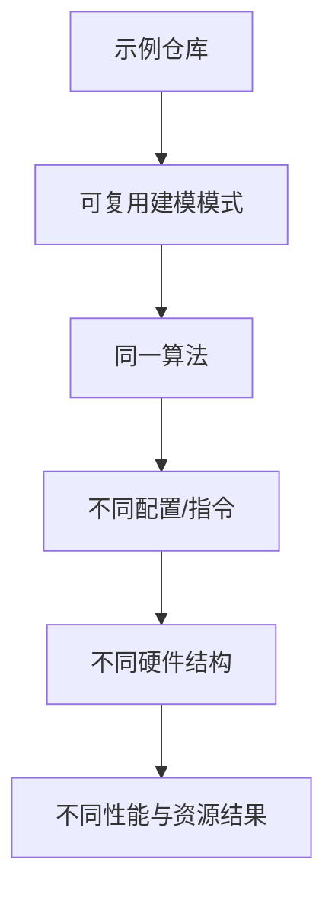

# Chapter 1：这个项目到底是干什么的

先说一句最重要的话：**`Vitis-HLS-Introductory-Examples` 不是一个“应用项目”，而是一个“翻译训练营”**。  
它训练你把 **C/C++ 算法代码**，翻译成 **FPGA 加速电路**。

想象你平时写 C++，像是在写“菜谱文字”。  
而 FPGA（可编程硬件芯片）真正吃的是“厨房流水线机器”。  
**Vitis HLS**（High-Level Synthesis，高层次综合工具）就是那个“自动把菜谱变成厨房流水线”的总厨。

---

## 1) 这个项目在整条链路里的位置

你可以把它想成：  
- React 教你写组件，  
- Express 教你组织路由，  
- 而这个仓库教你“写出能变硬件的 C++ 模式”。

这张图的意思很直接：  
仓库里的示例不是终点，它是“训练样本”。你通过它学会如何把 C/C++ 交给 Vitis HLS，得到可跑在 FPGA 上的加速器（专门加速某类计算的硬件模块）。

---

## 2) 为什么它不是“普通 C++ 教程”

**Kernel（内核）** 这个词先解释一下：在这里它不是 Linux 内核。  
它指的是“一个被单独做成硬件的计算函数”，像“独立的小机器”。

想象一个示例目录像一个乐高小套装：每块都有固定作用。

怎么读这张图：  
- `hls_config.cfg` 像相机参数面板，控制“拍出来的硬件风格”。  
- `top.cpp` 是算法本体。  
- `top_test.cpp` 是考试卷。  
- `result.golden.dat` 是标准答案。  
- 最后生成 `Reports`（报告），告诉你速度、资源、频率能不能过关。

---

## 3) C/C++ 是怎么一步步变成硬件的

**Synthesis（综合）** 先解释：它不是“编译成可执行文件”，而是“编译成电路结构”。  
你可以把它想成 Babel 把 ES6 转 ES5，但这里更激进：是把软件逻辑转成硬件连线。

流程要点：  
先保证“算得对”，再追求“跑得快”。  
这和你在后端开发里“先让 API 正确返回，再做缓存和并发优化”很像。

---

## 4) 你按一次运行，背后发生了什么对话

**Testbench（测试平台）** 就是“自动喂输入、收输出、判分”的脚本。  
**RTL** 是接近硬件电路的文本描述（通常 Verilog/VHDL）。

你可以把这个过程想成 CI 流水线：  
提交代码后，自动跑单测、构建、产出质量报告。  
区别是这里的“构建产物”不是二进制程序，而是硬件加速器描述。

---

## 5) Chapter 1 最核心的心智模型（记住这 4 句话）

这张图就是本章精华：  
1. **同一段 C++，能综合出完全不同的硬件。**  
2. 决定差异的关键是：代码写法 + `hls_config.cfg` + 指令（pragma/directive）。  
3. 这个仓库的价值不在“答案唯一”，而在“给你可复用模式”。  
4. 你学会的是“硬件思维模板”，不是某个 demo 本身。

---

## 本章小结

想象你刚拿到一台“代码变电路”的机器。  
`Vitis-HLS-Introductory-Examples` 就是这台机器的“新手驾校”。

你现在应该已经建立了第一层认知：  
- Vitis HLS 在做“软件到硬件”的翻译。  
- 示例目录是最小可运行模板。  
- 评判标准不是只看功能，还要看资源、时序、吞吐。  

下一章我们会进入实战地图：**这个仓库到底怎么分区，遇到问题该先看哪一类示例。**