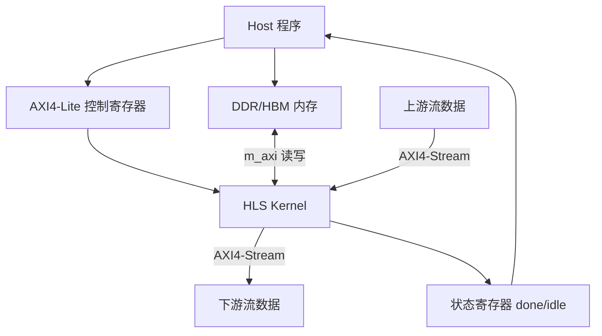
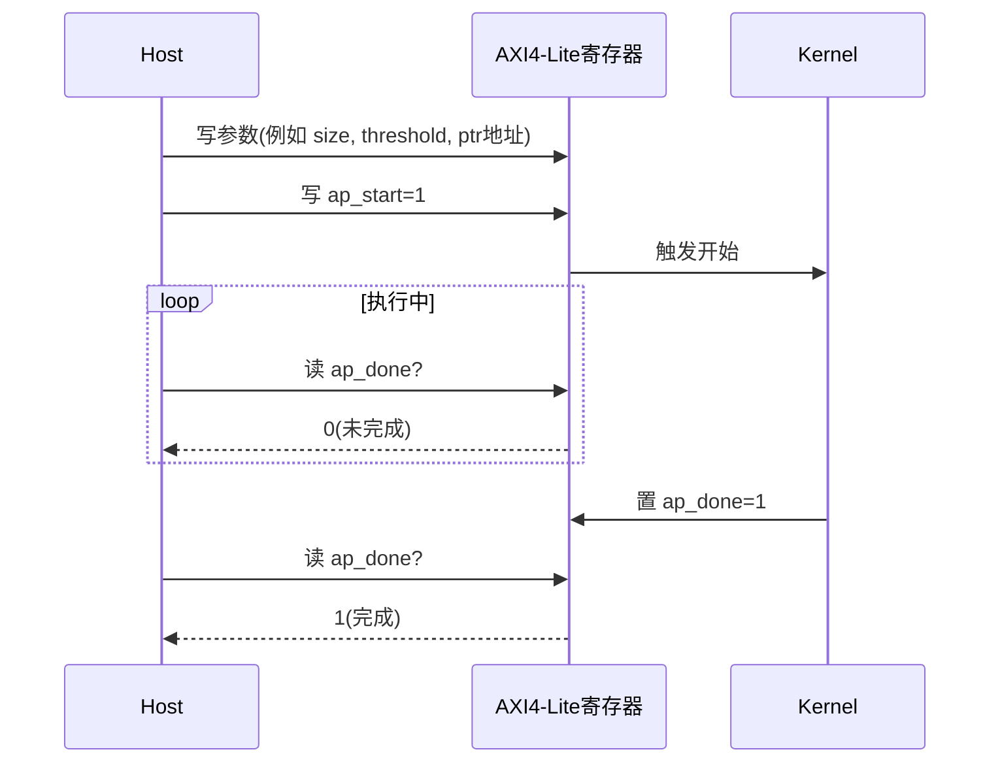
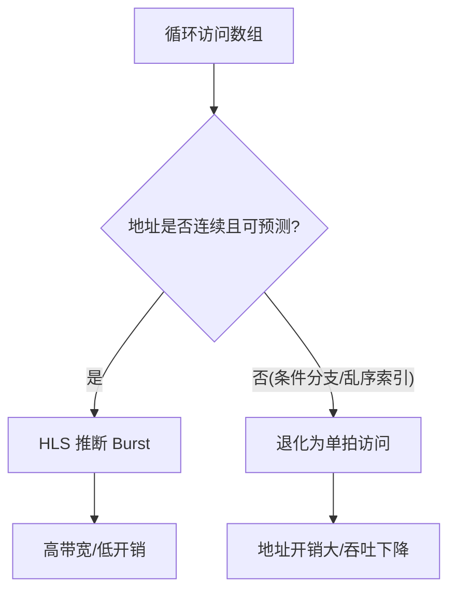
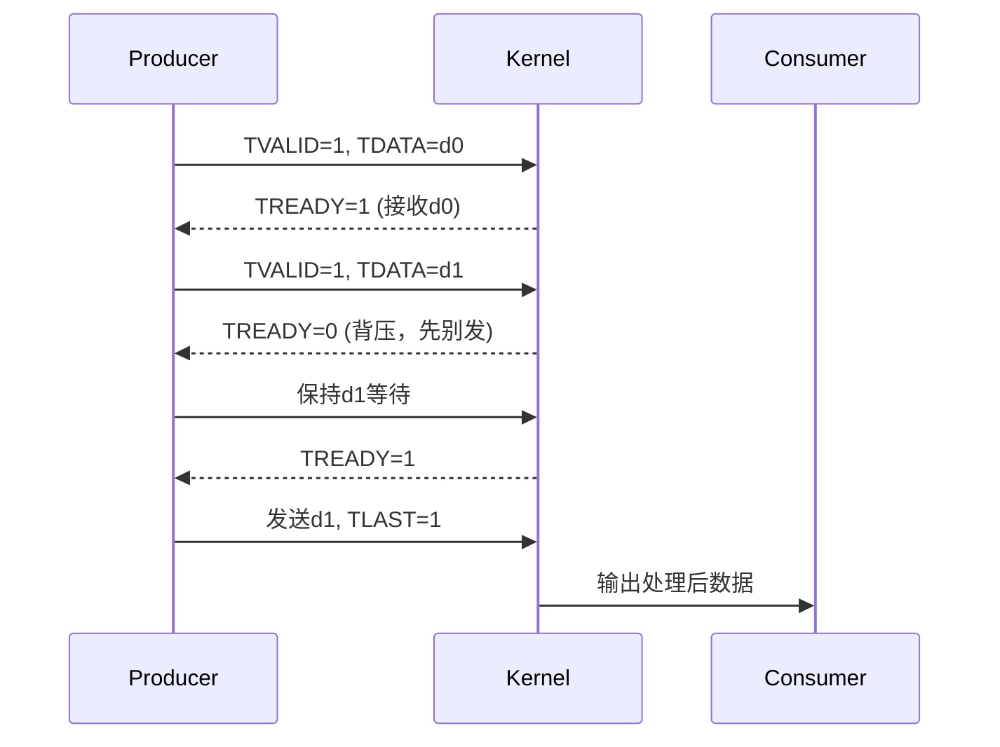
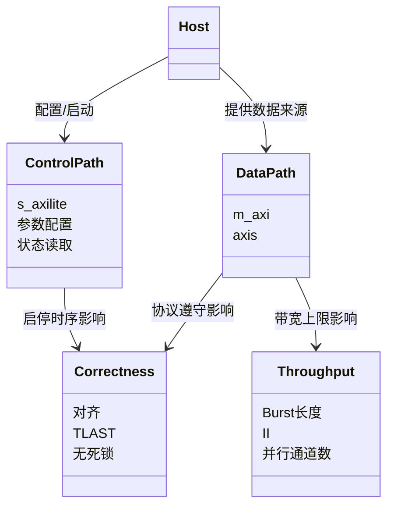
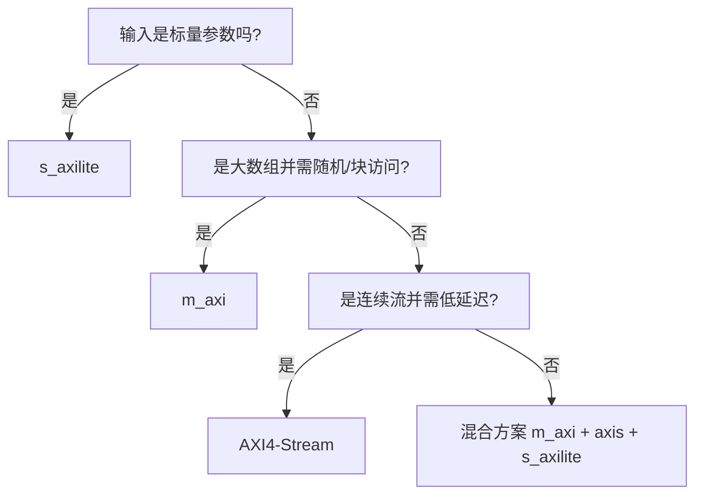

# 第 3 章：HLS 内核里的数据是怎么流动的

在前两章里，你已经知道这个仓库“有哪些示例、放在哪里”。

这一章我们做一件更关键的事：**看懂一笔数据从主机到 FPGA，再回到主机的完整旅程**。

Imagine 你在看一个外卖系统：

- 主机（Host）像手机 App 下单端  
- 控制寄存器像“订单备注和开始按钮”  
- 内存接口像“仓库货车通道”  
- 流接口像“流水线传送带”  

接口选错，就像让货车走人行道：能跑，但慢、堵、还容易出错。

---

## 3.1 先建立全景：四条“车道”

先解释几个词（第一次出现）：

- **Host（主机）**：跑在 CPU 上的 C++/Python 程序，负责分配内存、启动内核、读回结果。  
- **Kernel（内核）**：你写的 HLS 顶层函数，综合后变成 FPGA 里的硬件电路。  
- **AXI4-Lite（轻量寄存器总线）**：低带宽控制通道，适合“写参数、按开始”。  
- **m_axi（AXI4 Master 内存接口）**：高带宽内存通道，适合搬大数组。  
- **AXI4-Stream（axis 流接口）**：无地址、按拍传输的数据流，像连续传送带。  

这张图可以理解成“厨房 + 前台”：

- AXI4-Lite 是前台点单。  
- m_axi 是仓库搬货。  
- AXI4-Stream 是厨房传菜口。  
- 状态寄存器是“是否出餐完成”的提示灯。  

---

## 3.2 一次调用到底发生了什么

Think of it as 一次标准 API 请求生命周期，类似你在 Express.js 里从 `req` 到 `res` 的完整链路。

这一步里最重要的认知是：**控制路径和数据路径是分开的**。

You can picture this as：

- 控制路径 = 发指令（“做 1024 个元素”）  
- 数据路径 = 真正搬货和加工（1024 个元素本体）  

这和前端里“state 变化触发渲染”有点像：按钮点击（控制）很轻，但渲染列表（数据）很重。

---

## 3.3 控制寄存器（s_axilite）：像遥控器按钮

**s_axilite** 是“慢速但清晰”的通道。它不负责搬大数据，只负责参数和状态。

这个过程像微波炉：

- 先设时间和火力（参数寄存器）  
- 按开始（`ap_start`）  
- 看“叮”的状态（`ap_done`）  

---

## 3.4 内存接口（m_axi）：像高速货运通道

**m_axi** 是内核主动访问外部内存的接口。`m` 是 master，意思是内核像主动发起请求的“司机”。

### 为什么 burst（突发传输）很关键？

**Burst（突发）**：一次给出起始地址，连续搬多拍数据。  
Imagine 快递员一次搬一整箱，而不是每次只搬一支笔再回去登记。

实战含义非常直接：

- 代码越“线性”，越像 `for i++` 连续访问，越容易出 burst。  
- 代码里太多 `if`、随机索引、指针别名，常让 burst 失败。  

---

## 3.5 流接口（AXI4-Stream）：像传送带握手

AXI4-Stream 的核心是握手信号：

- **TVALID**：发送方说“我这拍有货”。  
- **TREADY**：接收方说“我这拍接得住”。  
- 两者同时为 1，才真的传输。  
- **TLAST**：这一包的最后一拍。  

**背压（back-pressure）** 就像地铁闸机临时限流：不是丢人，而是让系统不崩。

---

## 3.6 一张“概念关系图”：接口怎么影响正确性和吞吐

读图要点：

- **正确性（Correctness）**：先保证“结果对”。例如 TLAST 丢了，DMA 可能一直等包尾。  
- **吞吐（Throughput）**：再追求“跑得快”。例如 burst 长度短，带宽上不去。  

Think of it as 先让网站功能可用，再做性能优化；顺序不能反。

---

## 3.7 你该怎么选接口（初学者速查）

一句话记忆：

- 配置参数走 **s_axilite**  
- 大块内存走 **m_axi**  
- 连续管道走 **axis**  
- 复杂系统通常三者组合  

---

## 本章小结

你现在应该有一个稳定心智模型：

1. Host 通过 s_axilite 下命令。  
2. Kernel 通过 m_axi/axis 搬运和处理数据。  
3. 状态寄存器回报完成。  
4. 接口选择直接决定“能不能对、能不能快”。  

下一章我们会进入代码层：**哪些 C/C++ 写法更容易综合成你想要的硬件结构**。