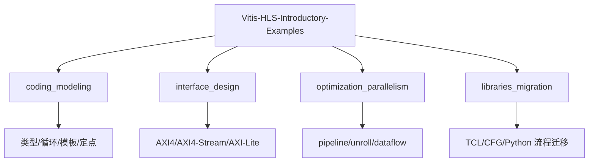
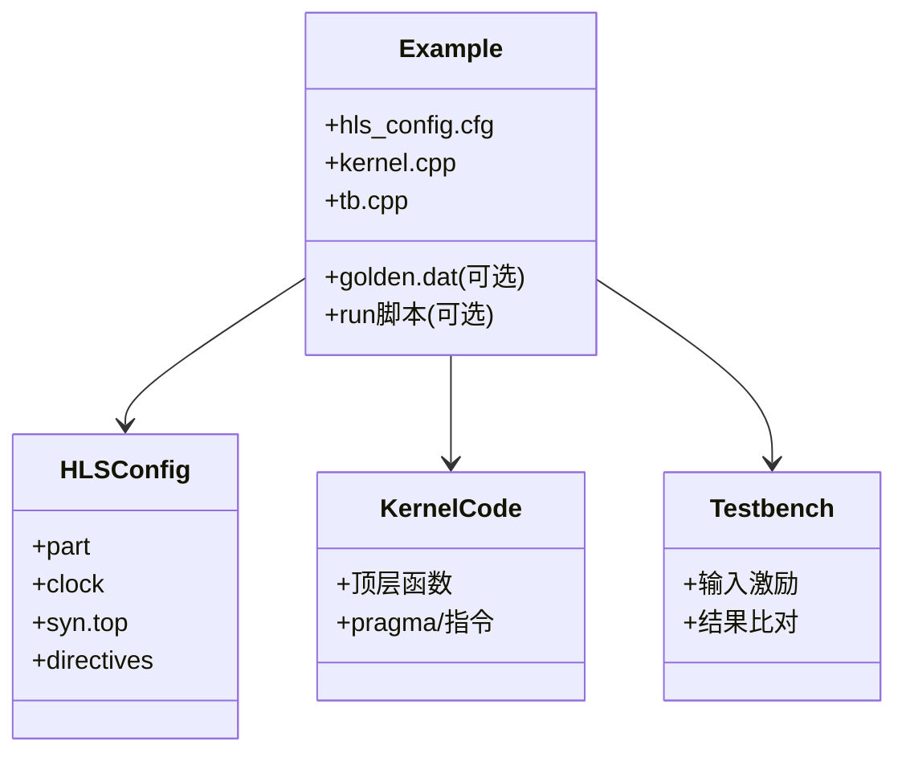
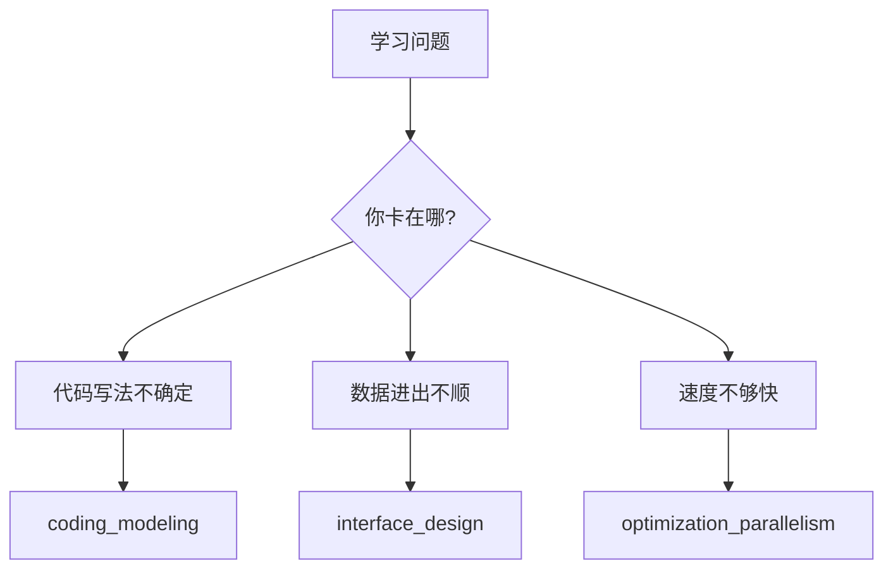
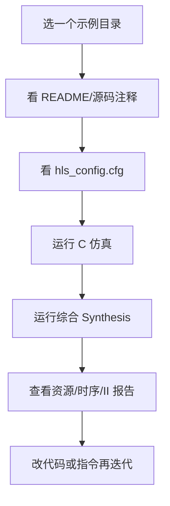
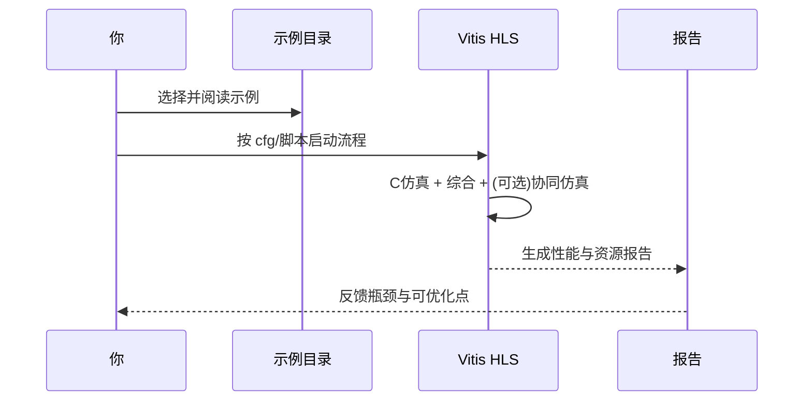
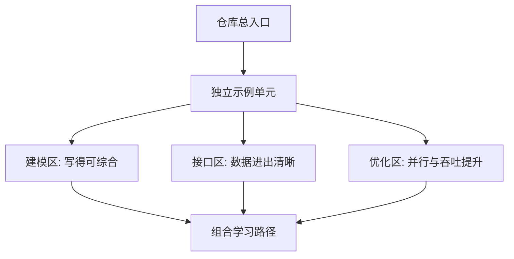

# 第 2 章：示例集合是怎么组织起来的

在第 1 章里，我们把这个仓库看成“从 C/C++ 走向 FPGA 硬件”的训练场。  
这一章你要学会的，是**怎么看懂这座训练场的地图**：哪些示例是建模类，哪些是接口类，哪些是性能优化类，以及它们为什么彼此独立。

---

## 2.1 先看全景：仓库像一个“主题商场”

这里先解释两个词：

- **仓库（repository）**：就是一个代码总目录，你可以把它想成 GitHub 上的一整个“项目文件夹”。
- **内核式示例（kernel-style example）**：`kernel` 在这里不是操作系统内核，而是“一个可以被单独综合成硬件模块的顶层函数”。你可以把它想成一个可插拔的小电器，每个都能独立通电测试。

这个图可以这样理解：  
想象你走进一个大型商场，`coding_modeling` 像“基础厨艺区”，教你刀工和火候；`interface_design` 像“上菜窗口设计区”，教你盘子怎么接菜（接口）；`optimization_parallelism` 像“后厨提速区”，教你怎么并行出菜；`libraries_migration` 像“旧店翻新区”，教你把旧流程迁到新工具链。

---

## 2.2 每个示例都是“独立小套件”，不是一团大工程

这里先解释一个词：

- **自包含（self-contained）**：意思是“自己带齐必需品，不依赖外部复杂上下文”。就像露营套装，一包打开就能用。

你可以把一个示例想成一个最小可运行 Demo，和你熟悉的前端脚手架很像：  
有“配置文件”（像 `vite.config`）、有“业务代码”（`kernel.cpp`）、有“测试代码”（`tb.cpp`）。  
所以你改坏一个示例，不会把整个仓库搞崩——这就是它“适合初学者试错”的关键。

---

## 2.3 三大主学习区：建模、接口、优化

这里先解释三个核心术语：

- **建模（modeling）**：把算法写成 HLS 易理解、易变硬件的 C/C++ 结构。想象成“先画施工图”。
- **接口（interface）**：数据怎么进出硬件模块。想象成“门和传送带怎么设计”。
- **优化并行（optimization/parallelism）**：让硬件同时做更多事。想象成“单车道改多车道”。

这个分组方式很像 Express.js 项目里的分层：  
如果你在“业务逻辑”卡住，就看 modeling；在“路由/请求协议”卡住，就看 interface；在“性能瓶颈”卡住，就看 optimization。  
它不是按难度乱排，而是按**你真实会遇到的问题类型**来排。

---

## 2.4 一个示例从“打开”到“看报告”的流程

流程就像做菜试味：  
先选菜谱（示例），看配方（cfg），先小火试吃（C 仿真），再上大灶（综合），最后看“成本+出菜速度”（资源/性能报告），不满意就回锅调整。  
重点是：每个示例都遵循类似节奏，所以你学会一个，基本就会逛完整个仓库。

---

## 2.5 你和工具、示例之间的“交互轨迹”

这里先解释两个词：

- **综合（synthesis）**：把 C/C++ 描述转换成 RTL 硬件电路。  
- **RTL**：寄存器传输级描述，可以理解为“电路级蓝图文本”。

你可以把这段交互想成健身 App：  
你选择训练课（示例），App 带你跑一遍动作（流程），最后给体测报告（时序、LUT、DSP、II），你再决定下一轮该练哪里。  
所以这个仓库不只是“代码集合”，更像“带反馈闭环的训练系统”。

---

## 2.6 本章小结：你现在应有的地图感

现在你可以把仓库想成“乐高城市”：

- 每个示例是一块独立积木（可单独跑、可单独学）。
- 三大主题是三种积木颜色（建模/接口/优化）。
- 你可以先按问题选颜色，再挑具体积木练手。

下一章我们会把镜头拉近，专门看：**数据到底怎么穿过一个 HLS kernel（主机、内存、流、控制寄存器）**。