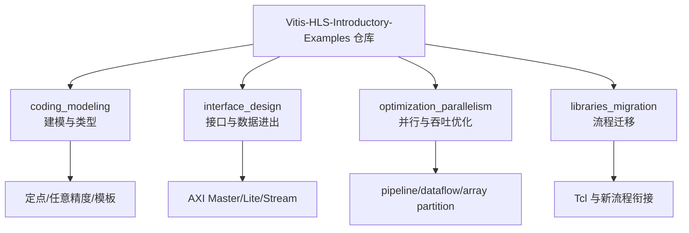
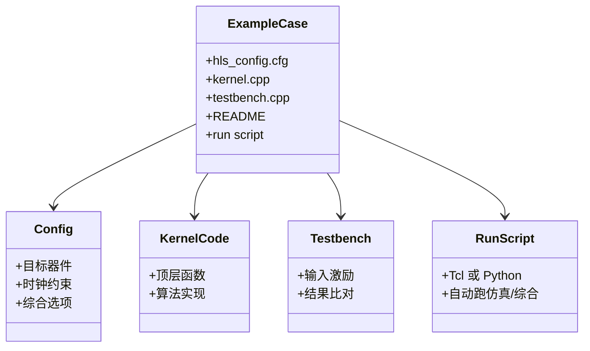
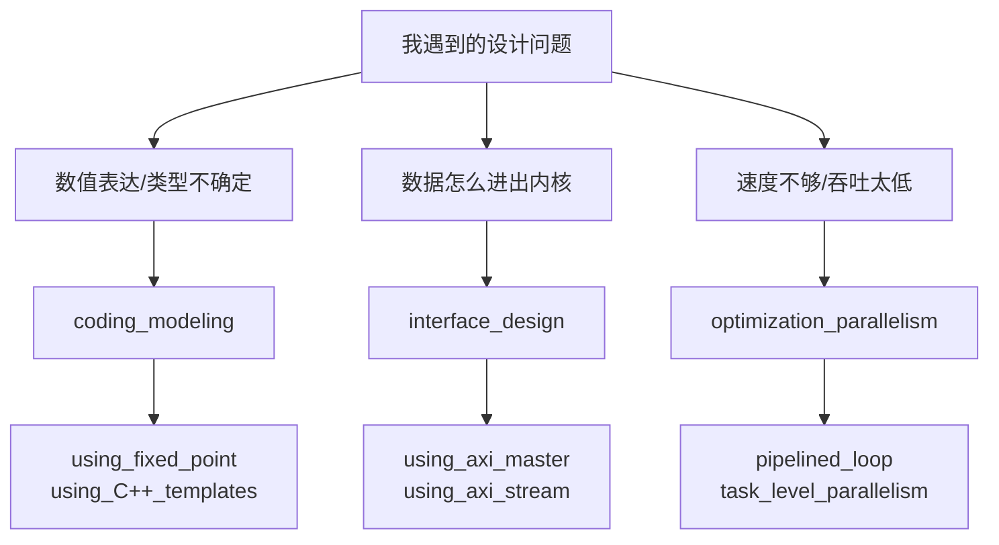
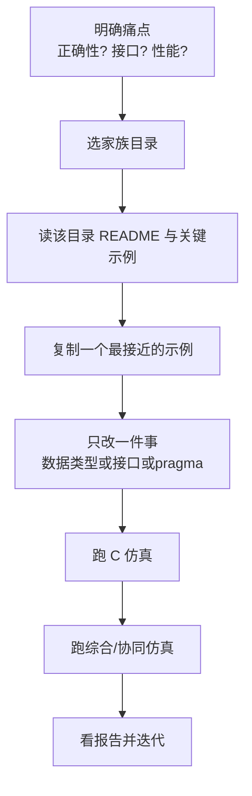
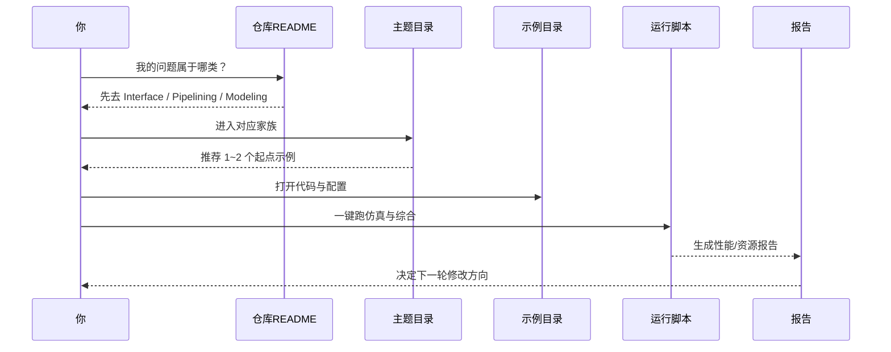

## Chapter 2：这些示例到底是怎么分门别类的？

在上一章你已经知道：这个仓库会把 C/C++ 代码“翻译”成硬件。  
这一章我们只做一件事：**学会快速找例子**。

想象一下（Imagine …），你第一次进一个超市。  
如果没有“生鲜区、日用品区、收银区”的分区，你会一直乱走。  
这个仓库也是一样：它不是一堆散文件，而是按主题分区的“样例超市”。

---

## 1) 先看全景：仓库不是一棵树，是一张“地铁图”

这里先解释两个词：

- **仓库（repository）**：就是一个总文件柜，里面放了这个项目所有目录和代码。
- **模块（module）**：就是同一主题的一组示例目录，像超市里“饮料区”这种分区。

Think of it as React 项目里的 `pages/`, `components/`, `hooks/` 分层：  
不是为了好看，而是为了让你**遇到问题时直接定位**。

**图解走读：**  
你可以把这张图看成城市地铁图。  
`coding_modeling` 是“语法和表达”的线，`interface_design` 是“进出站口”的线，`optimization_parallelism` 是“提速快线”。  
每条线都能独立学习，也能在一个真实设计里组合换乘。

---

## 2) 每个示例都是“独立小套餐”，不是半成品

这里先解释一个词：

- **自包含（self-contained）**：就是一个目录里，做完“写代码、跑验证、看结果”需要的东西基本齐全。

You can picture this as 乐高小盒装：盒子里有图纸、积木、验收图，不需要去别处找零件。

**图解走读：**  
一个示例目录就像一次“完整烹饪包”。  
`hls_config.cfg` 是菜谱参数，`kernel.cpp` 是做菜步骤，`testbench.cpp` 是试吃检查，脚本是“一键开火”。

---

## 3) 三大家族各管什么问题？先按“问题”找，不按“名字”找

先解释三个常见术语：

- **接口（interface）**：数据进出硬件的“门和道路规则”。
- **并行（parallelism）**：多条计算路径同时干活。
- **流水线（pipeline）**：像工厂装配线，每拍推进一格，不用等整件做完。

这就像 Express.js 的 Router：你不是先背所有文件名，而是先问“我这个请求该走哪条路由”。

**图解走读：**  
先从“问题类型”出发，再跳到模块。  
这样你不会在几百个目录里盲找。  
比如“带宽不够”，大概率先去 `interface_design`；“II 下不去（每隔几拍才能发起一次新迭代）”，先去 `optimization_parallelism`。

---

## 4) 新手最快检索流程（照这个走，基本不迷路）

**图解走读：**  
这条流程像“先学一道基础菜，再换一个调料”。  
不要一次改三件事（比如同时改接口、位宽、流水线），不然你很难判断到底哪一步导致结果变化。

---

## 5) 一次真实“找例子”交互轨迹

**图解走读：**  
这是一个闭环，不是一次性动作。  
你每轮都像在调相机参数：改一点，拍一张，看效果，再微调。

---

## 本章小结

这个仓库的组织方式，核心就一句话：  
**按“设计问题类型”分家族，按“可独立运行”做示例。**

你接下来只要记住这张心智地图：

1. `coding_modeling`：先把“表达”写对。  
2. `interface_design`：再把“数据通路”接对。  
3. `optimization_parallelism`：最后把“速度”拉起来。  

下一章我们会沿着第二条线深入：**数据到底怎么进出 kernel（内核，指 FPGA 上执行的硬件函数）**。