# 第四章：把你的加速器接入世界——接口设计

> **本章学习目标**：理解 HLS 如何将 C/C++ 函数参数映射到 FPGA 的物理协议（AXI4-Full、AXI4-Stream、AXI4-Lite），以及为什么选错接口会彻底毁掉性能。

---

## 4.1 为什么"接口"是 FPGA 设计中最重要的决策？

想象你开了一家餐厅，厨师的厨艺（算法）很棒，但如果上菜方式一团糟——外卖用堂食的速度、大批量的订单走单份配送——客人会饿到崩溃，厨师也会忙到瘫痪。

**接口设计**就是餐厅的"服务模式"。再好的 FPGA 算法，如果接口选错，数据就传不进来，结果也送不出去，整个系统会卡死在"等待"上。

在 Vitis HLS 里，每一个 C/C++ 函数参数都必须对应到一种物理协议。HLS 有三种主要的"上菜方式"：

| 接口类型 | 类比 | 适合什么数据 |
|----------|------|-------------|
| **AXI4-Lite**（`s_axilite`） | 餐厅的点餐单——少量文字，控制信息 | 标量参数、控制寄存器 |
| **AXI4-Full**（`m_axi`） | 冷链货车——大批量食材，需要地址导航 | 数组、指针、大块内存 |
| **AXI4-Stream**（`axis`） | 传送带——食物连续流动，不用管地址 | 流式数据、视频帧、网络包 |

本章将逐一解剖这三种协议，并通过 `interface_design` 模块中的真实示例，揭示每种选择背后的代价与收益。

---

## 4.2 三层映射模型：从 C++ 到硅片的旅程

在深入具体协议之前，先建立一个"三层思维框架"。理解这个框架，你就能看穿任何接口设计问题的本质。

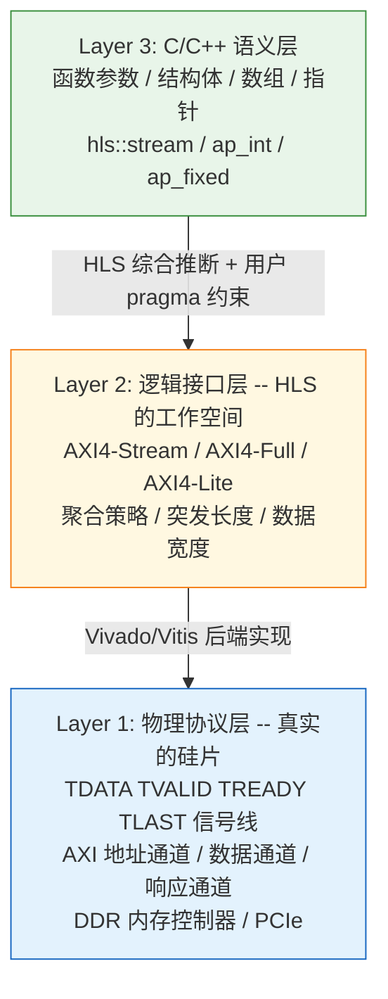

**逐层解读**：

**Layer 3（C++ 语义层）** 是你写代码的地方。`int* data`、`hls::stream<int>& stream`、`struct Packet pkt` ——这些都是软件概念。

**Layer 2（逻辑接口层）** 是 HLS 工具的"翻译室"。它读取你的 C++ 代码和 pragma 指令，决定把 `int* data` 翻译成"每次读一个字的慢速访问"，还是"一次性搬运 512 字节的突发传输"。这是最关键、最容易出错的一层。

**Layer 1（物理协议层）** 是最终落到硅片上的电线和握手信号。`TVALID`、`TREADY`、`AWADDR` 这些信号你无需手写，Vitis HLS 自动生成。

> **关键洞察**：`interface_design` 模块中的每一个 `.cfg` 配置文件，本质上都是在向 HLS 描述如何执行 Layer 3 → Layer 2 的映射。理解了这个，你就理解了整个模块的灵魂。

---

## 4.3 接口家族总览：`interface_design` 模块的地图

在动手之前，先看一眼这个模块里有哪些"地图标记"：

```mermaid
graph TD
    ROOT["interface_design 模块"]

    ROOT --> AGG["聚合与解聚\nAggregation / Disaggregation\n处理结构体如何打包到总线"]
    ROOT --> MEM["内存接口\nAXI4-Full m_axi\n访问片外 DDR/HBM"]
    ROOT --> REG["寄存器接口\nAXI4-Lite s_axilite\n传递标量和控制信号"]
    ROOT --> STR["流式接口\nAXI4-Stream axis\n连续无地址的数据流"]

    AGG --> A1["aggregation_of_struct"]
    AGG --> A2["aggregation_of_nested_structs"]
    AGG --> A3["aggregation_of_m_axi_ports"]
    AGG --> A4["auto_disaggregation_of_struct"]
    AGG --> A5["struct_ii_issue"]

    MEM --> M1["using_axi_master"]
    MEM --> M2["manual_burst_inference_success"]
    MEM --> M3["auto_burst_inference_failure"]
    MEM --> M4["max_widen_port_width"]

    REG --> R1["using_axi_lite"]
    REG --> R2["using_axi_lite_with_user_defined_offset"]

    STR --> S1["using_axi_stream_no_side_channel"]
    STR --> S2["using_axi_stream_with_side_channel"]
    STR --> S3["using_axi_stream_with_struct"]
    STR --> S4["using_array_of_streams"]
    STR --> S5["axi_stream_to_master"]

    style ROOT fill:#f3e5f5,stroke:#7b1fa2
    style AGG fill:#fff3e0,stroke:#e65100
    style MEM fill:#e8f5e9,stroke:#2e7d32
    style REG fill:#e3f2fd,stroke:#1565c0
    style STR fill:#fce4ec,stroke:#c62828
```

接下来，我们按照从简到繁的顺序，逐类展开。

---

## 4.4 AXI4-Lite：给控制信号用的"点餐单"

### 4.4.1 什么是 AXI4-Lite？

想象饭店里服务员递给你的那张小纸单——它不是用来运送食物的（那是货车的事），而是用来传达"我要一碗面条，少辣"这类**控制指令**的。

**AXI4-Lite**（在 HLS 里写作 `s_axilite`）就是这张点餐单。它专门用来传递：
- 标量参数（`int threshold`、`float gain`）
- 开关控制（`bool enable`）
- 内核启停信号（HLS 自动生成的 `ap_start`、`ap_done`）

它的特点：**信息量小，但必不可少**。你的 CPU 通过 AXI4-Lite 告诉 FPGA"开始处理，门限值是 128"，然后 FPGA 通过同一通道告诉 CPU"我处理完了"。

### 4.4.2 示例：`using_axi_lite`

```cpp
// 最简单的 AXI4-Lite 用法
void example(int* data, int threshold, int* result) {
    #pragma HLS interface m_axi port=data      // 数据走"货车"
    #pragma HLS interface m_axi port=result    // 结果走"货车"
    #pragma HLS interface s_axilite port=threshold  // 门限走"点餐单"
    #pragma HLS interface s_axilite port=return     // 控制信号也走"点餐单"

    // ... 处理逻辑 ...
    *result = (*data > threshold) ? *data : 0;
}
```

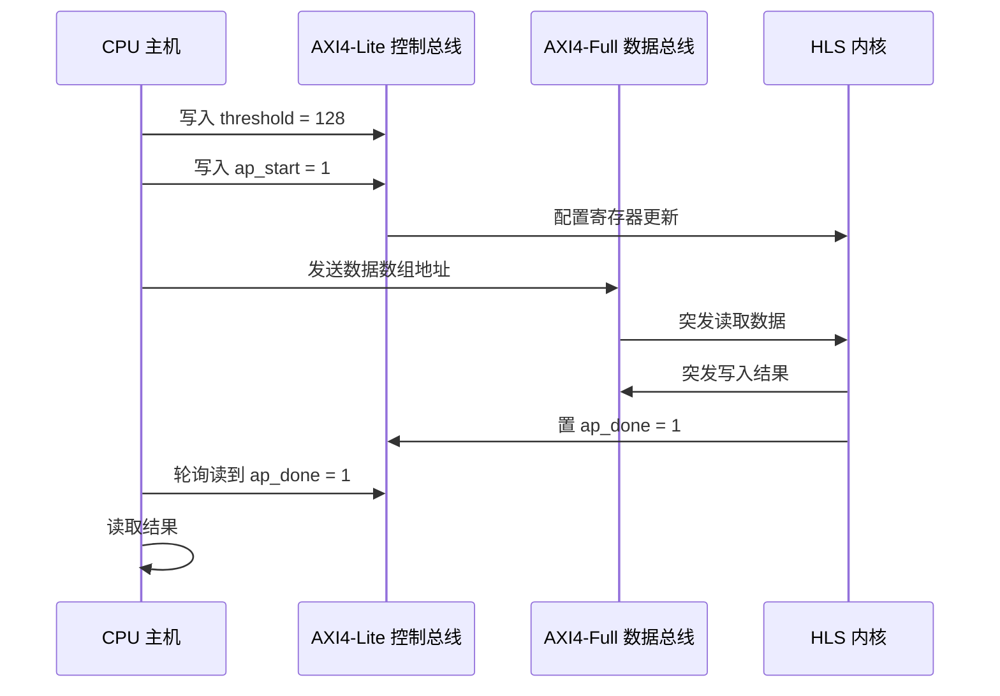

这张序列图说明了一个关键规律：**控制路径（AXI4-Lite）和数据路径（AXI4-Full）是完全独立的两条高速公路**。CPU 在查询"处理完了没"的同时，数据总线丝毫不受影响，仍在高速运转。这就是"控制与数据分离"的精髓。

### 4.4.3 进阶：用户自定义寄存器偏移

通常，HLS 会自动给每个参数分配一个 AXI4-Lite 地址（比如 `threshold` 放在偏移 `0x10`，某个状态寄存器放在 `0x18`）。但有时你需要**精确控制**这个地址——比如你在替换一个遗留 IP 核，不能改动驱动代码里写死的寄存器地址。

这就是 `using_axi_lite_with_user_defined_offset` 示例的用武之地：

```cpp
void example(int threshold, int mode) {
    #pragma HLS interface s_axilite port=threshold offset=0x20  // 我说了算
    #pragma HLS interface s_axilite port=mode      offset=0x28
}
```

> **类比**：就像你搬进新家，硬要把沙发放在和老家一模一样的位置，这样你闭着眼睛都知道遥控器在哪里。

---

## 4.5 AXI4-Full：给大块数据用的"冷链货车"

### 4.5.1 什么是 AXI4-Full？

AXI4-Lite 是轻量级的点餐单，无法承载大量数据。要把几兆字节的图像、几千个浮点数的矩阵送进 FPGA，需要**冷链货车**——AXI4-Full，即 `m_axi`（`m` 代表 Master，FPGA 是主动方，去内存里"取货"或"送货"）。

**AXI4-Full 的核心优势：突发传输（Burst Transfer）**。

想象一趟货车能一次运 256 箱苹果，而不是每次只运 1 箱。突发传输就是这个道理：发送一次地址请求，然后连续传输 256 个数据"节拍（beat）"。这比发送 256 次单独请求要高效得多。

### 4.5.2 基础用法：`using_axi_master`

```cpp
void dut(int* input, int* output, int n) {
    #pragma HLS interface m_axi port=input  depth=1024
    #pragma HLS interface m_axi port=output depth=1024
    #pragma HLS interface s_axilite port=n
    #pragma HLS interface s_axilite port=return

    for (int i = 0; i < n; i++) {
        output[i] = input[i] * 2;
    }
}
```

这段代码看起来简单，但背后隐藏着一个问题：**HLS 能自动推断出"突发传输"吗？**

### 4.5.3 突发传输：性能的生死线

这是 AXI4-Full 接口最关键，也最容易踩坑的地方。我们通过三个对比示例来说清楚。

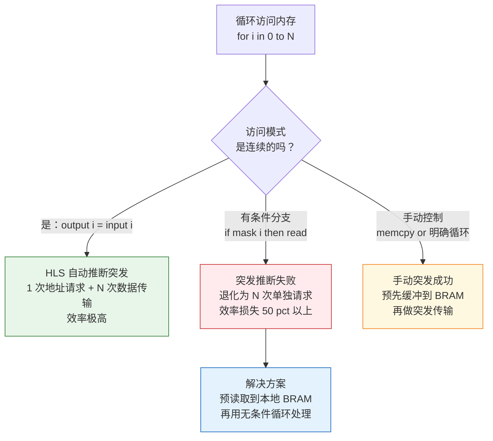

**场景一：`manual_burst_inference_success`（成功）**

```cpp
// HLS 能识别出这是连续访问，自动生成突发
void good_burst(int* input, int* output, int n) {
    #pragma HLS interface m_axi port=input
    #pragma HLS interface m_axi port=output

    for (int i = 0; i < n; i++) {
        #pragma HLS pipeline II=1
        output[i] = input[i];  // 简单、连续、无条件
    }
}
```

**场景二：`auto_burst_inference_failure`（失败）**

```cpp
// 条件分支让 HLS 无法判断访问是否连续，突发失败
void bad_burst(int* input, int* output, int* mask, int n) {
    #pragma HLS interface m_axi port=input
    #pragma HLS interface m_axi port=output

    for (int i = 0; i < n; i++) {
        if (mask[i]) {           // 这个 if 是"拦路虎"
            output[i] = input[i];
        }
    }
    // 结果：每次访问都单独发地址请求，带宽暴跌
}
```

**场景三：`manual_burst_with_conditionals`（解决方案）**

```cpp
// 先无条件预读取到 BRAM，再在本地处理条件
void fixed_burst(int* input, int* output, int* mask, int n) {
    int local_buf[1024];       // 片内 BRAM 缓冲区
    #pragma HLS interface m_axi port=input
    #pragma HLS interface m_axi port=output

    // 第一步：无条件突发读取（HLS 能推断出来）
    memcpy(local_buf, input, n * sizeof(int));

    // 第二步：在本地处理条件逻辑（不影响外部突发）
    for (int i = 0; i < n; i++) {
        if (mask[i]) {
            local_buf[i] *= 2;
        }
    }

    // 第三步：无条件突发写回
    memcpy(output, local_buf, n * sizeof(int));
}
```

> **性能数字让你清醒**：假设 N=1024，突发失败时你需要 1024 次地址请求 + 1024 次数据传输；突发成功时只需要 1 次地址请求 + 1024 次数据传输。在实际 FPGA 上，这可能意味着 10 倍的带宽差距。

### 4.5.4 拓宽数据位宽：`max_widen_port_width`

除了突发长度，数据宽度也是影响带宽的关键旋钮。

$$
带宽 = 数据宽度 \times 时钟频率 \times 利用率
$$

把数据宽度从 64 位提升到 512 位，理论带宽可以涨 8 倍。`max_widen_port_width` 示例展示了如何通过配置文件来控制这个参数：

```ini
# hls_config.cfg 中的配置
syn.interface.m_axi_alignment_byte_size=64
syn.interface.m_axi_max_widen_bitwidth=256
```

- `m_axi_alignment_byte_size=64`：告诉 HLS "我保证数据总是 64 字节对齐的"，HLS 就可以生成更宽的突发指令。
- `m_axi_max_widen_bitwidth=256`：允许 HLS 把 8 个连续的 32 位 `int` 访问合并成一个 256 位的宽总线传输。

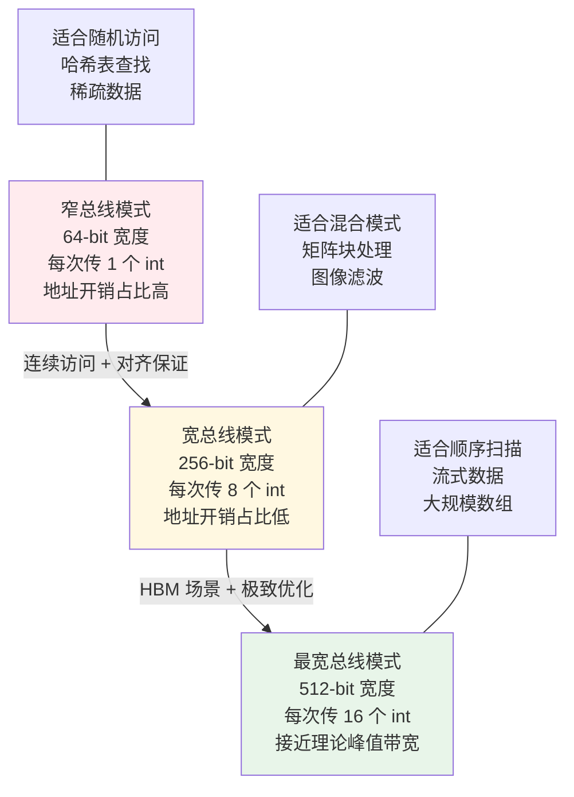

**权衡提醒**：宽总线不是免费的。512 位总线需要更多的 LUT 和 FF 来实现数据路由逻辑，时序收敛也更难。选 256 位而非 512 位，往往是在"够用就好"和"极致榨干带宽"之间的务实折中。

### 4.5.5 多指针共享接口：`aggregation_of_m_axi_ports`

Alveo 加速卡通常只有 2-4 个物理 DDR 内存通道。如果每个指针参数都独占一个 `m_axi` 端口，很快就会把物理接口耗尽。

**解决方案：使用 `bundle` 把多个指针绑到同一个 AXI4-Full 端口：**

```cpp
void dut(int* a, int* b, int* c) {
    #pragma HLS interface m_axi port=a bundle=gmem0  // a 和 b 共享一个端口
    #pragma HLS interface m_axi port=b bundle=gmem0  // 节省了一个物理通道
    #pragma HLS interface m_axi port=c bundle=gmem1  // c 独占另一个端口
}
```

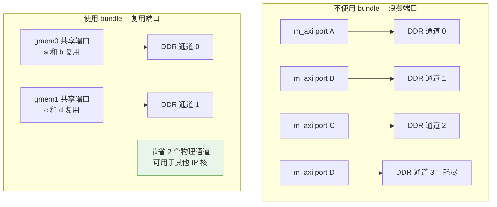

**注意陷阱**：共享接口意味着 `a` 和 `b` 的访问会相互等待（串行化）。如果你的算法需要同时读 `a` 和 `b`（比如在 DATAFLOW 的两个并行阶段里），共享端口会直接破坏并行性，反而降低性能。**在并行性和资源节省之间，你必须做出选择。**

---

## 4.6 AXI4-Stream：给连续数据用的"传送带"

### 4.6.1 什么是 AXI4-Stream？

AXI4-Full 像货车，需要"地址"来导航——你得告诉它"去内存 0x1000 取数据"。

**AXI4-Stream 则像工厂里的传送带**——数据一个接一个地滚过来，你不需要知道下一个零件是从哪个货架取的，只管接住就好。没有地址，没有寻址开销，数据连续流动。

这种模式完美适合：视频帧、音频采样、网络数据包、传感器连续读数——任何"源源不断涌来"的数据。

### 4.6.2 握手协议：三根线控制世界

AXI4-Stream 的核心是三根信号线（最简形式）：

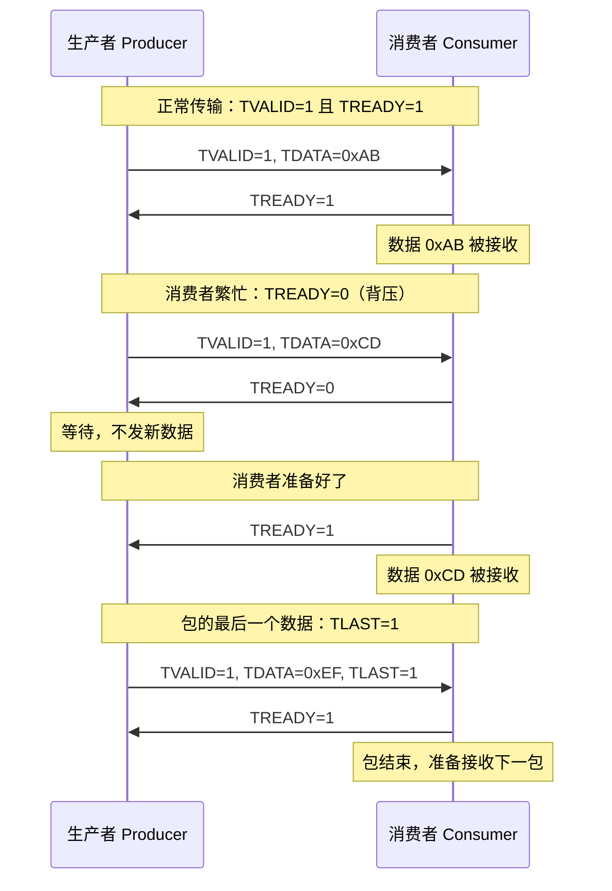

- **TVALID**：生产者说"我有数据，是真的"
- **TREADY**：消费者说"我准备好接收了"
- **TLAST**：生产者说"这是这个数据包的最后一个字节"

只有当 `TVALID` 和 `TREADY` 同时为高，数据才真正被传输。这种"握手"机制让传送带可以自动减速（背压），防止数据溢出。

### 4.6.3 纯数据流：`using_axi_stream_no_side_channel`

```cpp
// hls::stream 是 HLS 中流的基本类型
void dut(hls::stream<int>& in, hls::stream<int>& out) {
    #pragma HLS interface axis port=in   // 映射到 AXI4-Stream
    #pragma HLS interface axis port=out
    #pragma HLS pipeline II=1

    while (!in.empty()) {
        int data = in.read();   // 从传送带上取一个
        out.write(data * 2);    // 放到输出传送带
    }
}
```

这是最干净的流式接口——只有数据，没有任何附加信息。适合你只关心"数据值"，不关心"包边界"或"字节有效性"的场景。

### 4.6.4 带边带数据：`using_axi_stream_with_side_channel`

现实世界的数据往往不是光秃秃的数值流。网络数据包需要标记"一帧结束了"，视频流需要标记"这一行的某些像素无效"。

AXI4-Stream 提供了**边带信号（Side-channel Signals）**来携带这些元信息：

| 信号 | 作用 | 类比 |
|------|------|------|
| `TLAST` | 标记数据包的最后一拍 | 传送带上的"包裹结束"标签 |
| `TKEEP` | 字节有效掩码（哪些字节是真数据） | 标记传送带上哪些格子有货 |
| `TSTRB` | 字节类型掩码（数据字节 vs 位置字节） | 区分"正式货物"和"填充泡沫" |
| `TUSER` | 用户自定义元数据 | 快递单上的备注栏 |

在 HLS 中，使用 `ap_axis` 结构体来携带这些信号：

```cpp
#include "ap_axi_sdata.h"

// ap_axis<数据位宽, TUSER位宽, TID位宽, TDEST位宽>
typedef ap_axis<32, 1, 1, 1> axis_pkt;

void dut(hls::stream<axis_pkt>& in, hls::stream<axis_pkt>& out) {
    #pragma HLS interface axis port=in
    #pragma HLS interface axis port=out

    axis_pkt pkt;
    do {
        in.read(pkt);
        pkt.data = pkt.data + 1;  // 处理数据
        // pkt.last、pkt.keep 等边带信号自动透传
        out.write(pkt);
    } while (!pkt.last);  // 读到 TLAST 为止
}
```

> **危险警告**：忘记处理 `TLAST` 是流式接口最常见的 bug。下游的 DMA 控制器（如 Xilinx AXI DMA IP）会一直等待 `TLAST` 来触发中断。如果你的 HLS 核忘记输出 `TLAST`，整个系统会永远挂在那里等待——没有报错，只有沉默。

### 4.6.5 结构体与流：`using_axi_stream_with_struct`

很多时候，你的数据包不是单个 `int`，而是一个包含多个字段的自定义结构体。比如视频像素点有 RGB 三个分量，雷达数据有距离和强度两个维度。

```cpp
struct Pixel {
    unsigned char r;
    unsigned char g;
    unsigned char b;
};

void dut(hls::stream<Pixel>& in_stream, hls::stream<Pixel>& out_stream) {
    #pragma HLS interface axis port=in_stream
    #pragma HLS interface axis port=out_stream
    #pragma HLS aggregate variable=in_stream  // 把结构体打包成单个宽数据字

    Pixel px = in_stream.read();
    px.r = px.r / 2;  // 降低红色亮度
    out_stream.write(px);
}
```

`#pragma HLS aggregate` 告诉 HLS：把 `r`（8位）、`g`（8位）、`b`（8位）打包成一个 24 位的数据字，一次性在 AXI4-Stream 上传输，而不是分三次传。

### 4.6.6 多路并行流：`using_array_of_streams`

有时你需要同时处理多个并行的数据流——比如 8 路传感器、4 路视频通道。`hls::stream` 数组让这变得自然：

```cpp
void dut(hls::stream<int> in[4], hls::stream<int> out[4]) {
    #pragma HLS interface axis port=in
    #pragma HLS interface axis port=out
    #pragma HLS array_partition variable=in  complete  // 每个流有独立的硬件 FIFO
    #pragma HLS array_partition variable=out complete

    for (int i = 0; i < 4; i++) {
        #pragma HLS unroll  // 4 个通道完全并行
        int data = in[i].read();
        out[i].write(data * 2);
    }
}
```

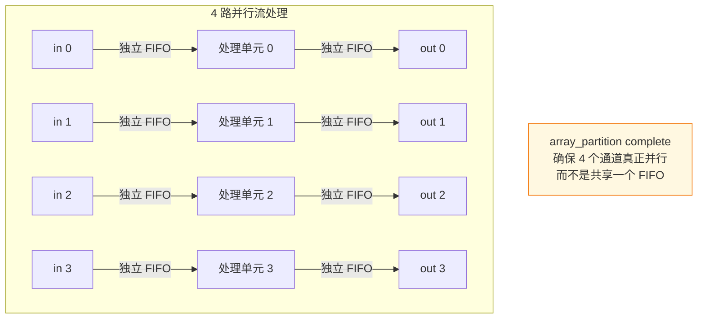

**关键点**：`array_partition complete` 是必须的。没有它，HLS 可能把 4 个流合并成一个共享的内存结构，变成串行访问，彻底破坏并行性。

### 4.6.7 流转内存：`axi_stream_to_master`

最后一个流式接口模式，也是最有挑战性的：**把高速 AXI4-Stream 的数据存入 DDR 内存**。

想象高速公路（AXI4-Stream）上的车流要停进停车场（DDR 内存）。停车场有自己的节奏——找车位、倒车入库都需要时间。如果没有"等候区"（缓冲区），高速公路上的车就会堵死。

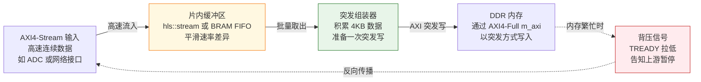

这个设计中有两个关键决策：

1. **缓冲区深度**：必须足够大，能吸收 DDR 内存响应慢的延迟（DDR 刷新、仲裁等）。通常需要至少 4KB 以上的缓冲。

2. **突发组装阈值**：积累多少数据才触发一次突发写？阈值太小（频繁小突发），地址通道开销大；阈值太大（等待时间长），延迟高，缓冲区可能溢出。

---

## 4.7 结构体的聚合与解聚：最容易踩坑的地方

### 4.7.1 聚合（Aggregation）：把结构体"压扁"成总线数据

当你的 C++ 函数参数是一个结构体时，HLS 需要决定如何把这个结构体的多个字段塞进 AXI 总线的一个数据字里。这个过程叫**聚合（Aggregation）**。

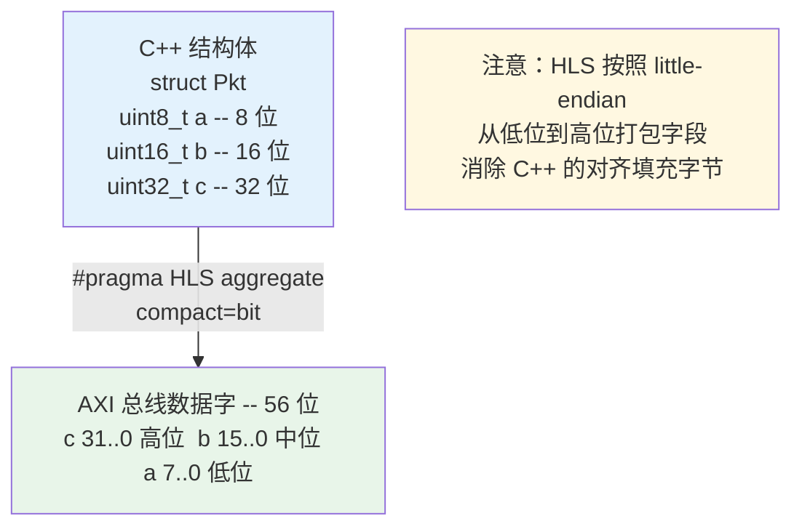

**`aggregation_of_struct` 示例**展示了最基本的聚合：

```cpp
struct MyStruct {
    uint8_t  flag;    // 8 bits
    uint16_t value;   // 16 bits
    uint32_t data;    // 32 bits
    // 总共 56 bits，不是 64 bits（因为消除了填充）
};

void dut(MyStruct* input) {
    #pragma HLS interface m_axi port=input
    #pragma HLS aggregate variable=input compact=bit  // 紧密打包，无填充
}
```

**`aggregation_of_nested_structs` 示例**则展示了嵌套结构体的递归聚合：

```cpp
struct Inner { uint8_t a; uint16_t b; };   // 24 bits
struct Outer { Inner inner; uint32_t c; };  // 24 + 32 = 56 bits

// HLS 会递归地展平 Outer，最终生成一个 56 位的扁平位向量
```

### 4.7.2 解聚（Disaggregation）：把总线数据"拆开"给各字段

有时方向是反的——你收到一个宽总线数据，想把它的各个位段直接暴露为独立的硬件信号。`auto_disaggregation_of_struct` 展示了这种模式，适合结构体字段需要被下游逻辑独立访问的场景。

### 4.7.3 结构体导致的 II 问题：`struct_ii_issue`

这是一个经典的性能陷阱。想象你想让循环每个时钟周期处理一个数据（II=1），但结构体的字段之间存在依赖关系，HLS 无法流水线化：

```cpp
// 问题代码
struct State { int x; int y; };

void dut(State* s, int n) {
    for (int i = 0; i < n; i++) {
        #pragma HLS pipeline II=1  // 这里可能失败！
        s->x = s->y + 1;  // 读 y，写 x
        s->y = s->x + 2;  // 读 x（上一行刚写的！）
    }
}
```

第二行读 `s->x` 依赖于第一行写 `s->x`，这是一个"读后写依赖（RAW）"。HLS 无法在同一时钟周期内完成这个依赖链，II 就会被强制增大。

**解决方案**：使用局部变量打破依赖链：

```cpp
void dut(State* s, int n) {
    int local_x = s->x;
    int local_y = s->y;

    for (int i = 0; i < n; i++) {
        #pragma HLS pipeline II=1  // 现在可以成功了
        int new_x = local_y + 1;
        int new_y = new_x + 2;
        local_x = new_x;
        local_y = new_y;
    }
    s->x = local_x;
    s->y = local_y;
}
```

---

## 4.8 接口选择决策树

面对一个实际设计任务，如何快速选择正确的接口？

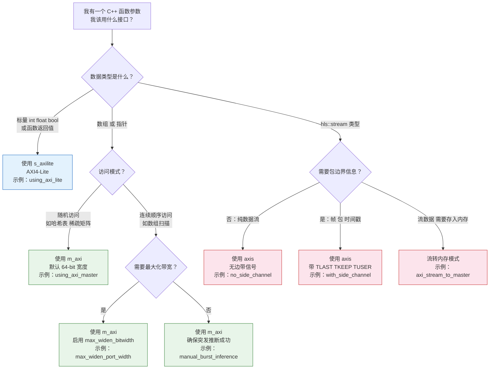

---

## 4.9 Vitis 流程 vs Vivado 流程：选哪条路？

`interface_design` 模块中，你会注意到不同示例的 `hls_config.cfg` 里有不同的 `flow_target` 设置：

```ini
# Vitis 流程
flow_target=vitis
package.output.format=xo    # 输出 .xo 内核文件

# Vivado 流程
flow_target=vivado
package.output.format=ip_catalog  # 输出 IP 封装
```

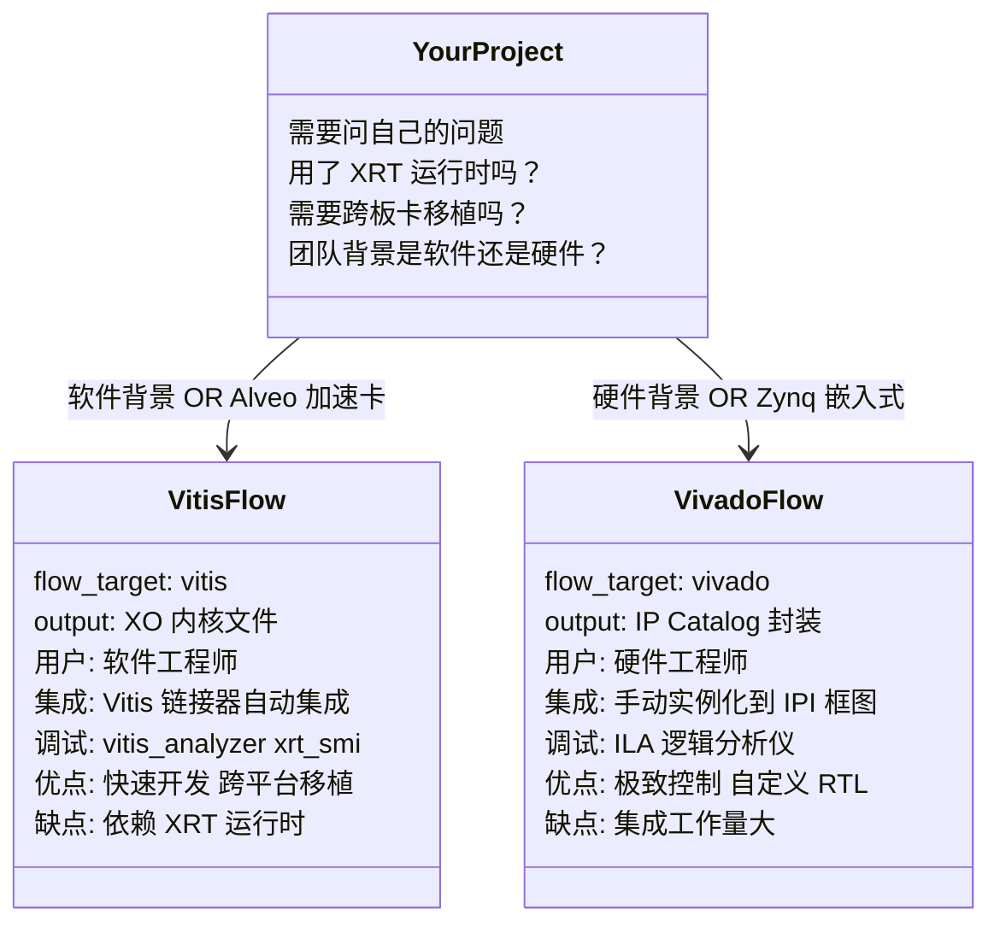

**简单判断法则**：
- 如果你的项目运行在 **Alveo 加速卡** 上，或者团队主要是软件背景 → 选 **Vitis 流程**
- 如果你的项目运行在 **Zynq SoC** 上，或者需要跟手工 RTL 紧密集成 → 选 **Vivado 流程**

---

## 4.10 最容易犯的三大错误

### 错误一：忘记 `TLAST`，导致 DMA 永久挂起

**症状**：硬件测试时程序卡死，没有报错，只是没有响应。

**根因**：Xilinx 的 AXI DMA IP 核依靠 `TLAST` 信号来知道"一帧数据传完了"，从而触发中断通知 CPU。你的 HLS 核忘记输出 `TLAST`，DMA 会一直等待，永不完成。

**修复**：使用 `ap_axis` 结构体，确保在数据包最后一拍设置 `.last = 1`：

```cpp
axis_pkt out_pkt;
out_pkt.data = result;
out_pkt.last = (i == N - 1) ? 1 : 0;  // 最后一拍标记 TLAST
out_pkt.keep = -1;                      // 所有字节有效
out_stream.write(out_pkt);
```

### 错误二：指针别名导致并行性丧失

**症状**：综合报告显示 II 远大于 1，无论怎么加 pipeline pragma 都无效。

**根因**：HLS 默认假设两个指针参数可能指向同一块内存（别名）。为了安全，它不得不串行化所有内存访问。

**修复**：用 C99 的 `restrict` 关键字明确告诉 HLS"这两个指针绝对不重叠"：

```cpp
// 改变前：HLS 假设 a 和 b 可能重叠
void bad(int* a, int* b, int n) { ... }

// 改变后：告诉 HLS 放心并行
void good(int* __restrict a, int* __restrict b, int n) { ... }
```

### 错误三：非对齐访问破坏宽总线优化

**症状**：配置了 `max_widen_bitwidth=256`，但实际硬件带宽并没有提升。

**根因**：宽总线优化要求数据在内存中按特定字节数对齐。如果主机代码使用普通 `malloc` 分配内存，可能不满足 64 字节对齐的要求，HLS 悄悄回退到窄总线模式。

**修复**：在主机代码中使用对齐的内存分配：

```cpp
// 主机代码（Host C++ 代码）
int* buf;
posix_memalign((void**)&buf, 64, N * sizeof(int));  // 64 字节对齐

// 或者在 Vitis 平台使用 XRT 的对齐分配
auto buf = xrt::bo(device, N * sizeof(int), xrt::bo::flags::normal, kernel.group_id(0));
```

---

## 4.11 本章小结

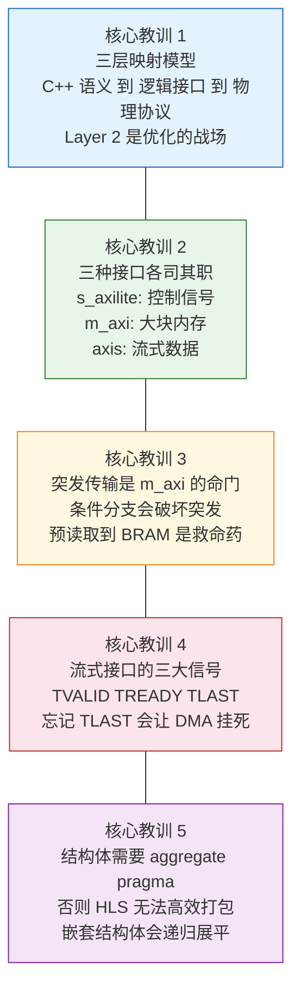

接口设计是 HLS 开发中最"牵一发而动全身"的决策。一个错误的接口选择——比如把大块数组映射到 AXI4-Lite，或者忽略突发传输——可以让一个理论上有 10 倍加速比的 FPGA 内核，实际表现比 CPU 还慢。

**记住这三个问题**，在每次设计接口时问自己：

1. 这个参数传的是"指令"还是"数据"？（决定 AXI4-Lite vs AXI4-Full/Stream）
2. 数据是"批量到来"还是"连续流动"？（决定 AXI4-Full vs AXI4-Stream）
3. 数据访问是"顺序的"还是"随机的"？（决定是否能利用突发传输）

下一章，我们将进入**并行性与优化**的世界——当接口选对了，如何通过流水线、数据流、数组分区等技术，把 FPGA 的并行潜力榨干。