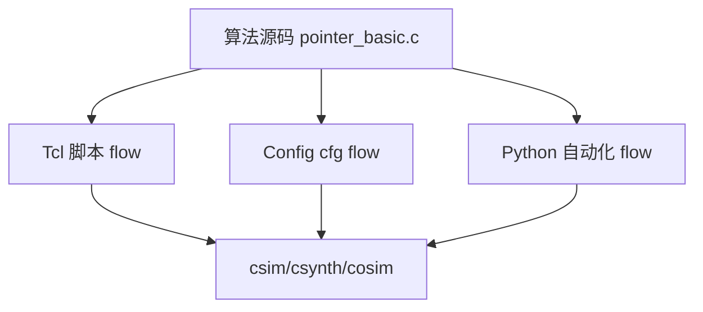
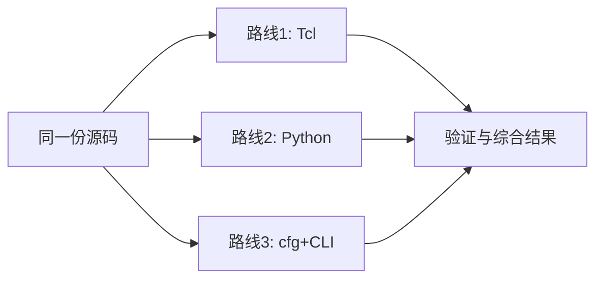
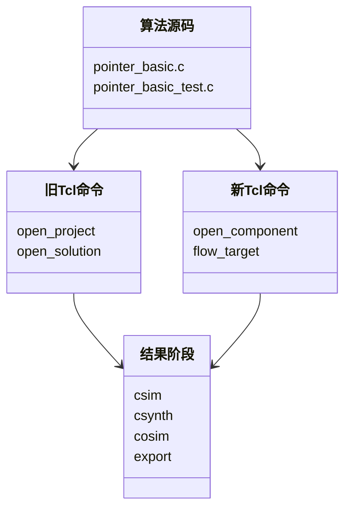
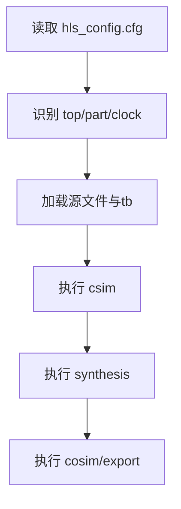
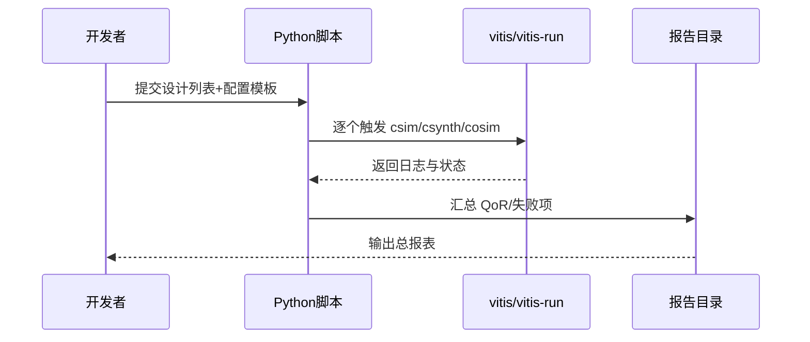
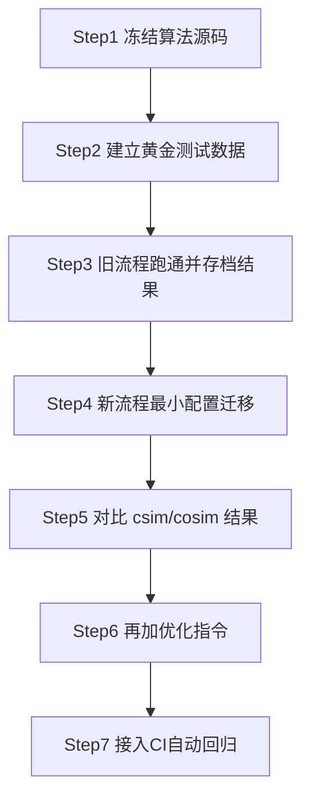
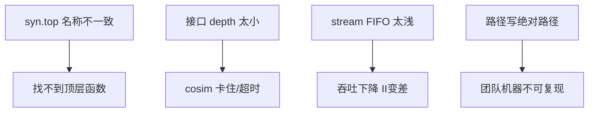

# Chapter 6：迁移流程，不重写设计（Migrating flows without rewriting your design）

在前 5 章里，我们一直在打磨“菜谱本身”——也就是算法 C/C++ 代码。  
这一章我们换个角度：不改菜谱，只换厨房和烹饪流程。

---

## 6.1 先建立一个核心心智：**算法是“乐谱”，流程是“播放器”**

Imagine 你写了一首歌（算法代码），可以用手机、电脑、音响播放（不同 HLS 流程）。  
歌不需要重写，换的是播放方式。

这里有两个关键词，先用大白话解释：

- **Legacy Flow（旧流程）**：Think of it as 老款播放器，常见是 Vivado HLS + Tcl 脚本。
- **Unified Flow（统一新流程）**：Think of it as 新款流媒体播放器，常见是 Vitis Unified CLI + cfg/Python。

这张图的重点很简单：  
**中间换路，左边算法不动，右边结果类型仍然一致。**  
就像同一首歌，换 App 播放，旋律还是那首歌。

---

## 6.2 三条迁移路径：像“同一目的地的三条导航路线”

Think of it as 你要去公司，有地铁、打车、骑行三种方式。  
在仓库 `Migration/README.md` 里，也是三条推荐路线：

1. Tcl 脚本路线  
2. Unified Python 路线  
3. Unified 命令行 + cfg 路线

这张图表达的是：  
你不用在“改算法”和“改流程”之间二选一。  
正确做法是：**算法固定，流程可替换**。

---

## 6.3 Tcl 到 Unified Tcl：最小改动迁移（“换插头，不换电器”）

Imagine 你从国标插座换到英标插座，电饭煲没变，只是插头适配变了。  
在 Tcl 迁移里，一个关键变化是：

- `open_project/open_solution`（旧概念）  
- 变成 `open_component`（新概念）

`component（组件）` 用大白话说，就是“可复用的构建单元”，  
有点像前端里的 React Component：打包边界更统一，不只服务单一工具。

这张类图（概念关系图）想传达：  
旧命令和新命令都在驱动同一源码，输出阶段仍是那些阶段。  
所以迁移重点是“驱动层映射”，不是“算法重写”。

---

## 6.4 cfg 声明式配置：从“操作步骤”变成“需求清单”

**声明式（Declarative）**先解释一下：  
Think of it as 点外卖时你写“要什么”（少辣、加饭），  
而不是写“厨师先热锅再下油”的过程细节。

Tcl 更像“流程脚本”；cfg 更像“配置清单”。  
这点和 Docker 很像：  
- shell 脚本像你手动敲命令  
- config 文件像 Docker Compose 统一描述服务

图里的顺序说明：  
虽然 cfg 是“静态清单”，工具仍会按标准流程执行。  
你写“要什么”，工具负责“怎么跑”。

---

## 6.5 Python 自动化：把“单次编译”升级成“批处理工厂”

Imagine 你原来手洗一件衣服（单个设计手工跑）。  
Python 脚本像洗衣机程序：一次洗很多件（批量设计、批量参数）。

这里的 **automation（自动化）** 用大白话讲，就是“把重复动作交给程序循环做”。  
它和你熟悉的 CI（持续集成）非常像：  
比如 GitHub Actions 每次提交自动跑测试。

这张时序图表示交互顺序：  
人不再盯着每个命令，而是盯“总报告”。  
这就是迁移后最大的工程收益：**省人力 + 降重复错误**。

---

## 6.6 一套“稳迁移”实战步骤（推荐你照着做）

逐步解释：

- **Step1 冻结源码**：像拍毕业照，先定格一个可工作的版本。  
- **Step2 黄金数据**：`golden` 就是“标准答案”，像单元测试断言。  
- **Step3 旧流程留档**：作为迁移前基线（baseline），方便回退。  
- **Step4 最小迁移**：先跑通，再优化，别一上来就改 20 个参数。  
- **Step5 对比结果**：先保正确，再追性能。  
- **Step6 加 directive**：`directive` 是“优化提示条”，像告诉导航“尽量走高速”。  
- **Step7 上 CI**：保证以后每次改动都自动复测，不再靠记忆。

---

## 6.7 常见坑（你大概率会踩的）

快速记忆版：

- `syn.top` 必须和函数名完全一致（大小写也算）。  
- AXI/stream 深度太小，会像单车道堵车。  
- 配置尽量用相对路径，像项目里的 `package.json` 不写你本机盘符。  
- 不要把生成目录当源码提交，保持仓库干净。

---

## 6.8 本章小结：迁移不是“重写”，而是“解耦”

Think of it as 把“菜谱”与“厨房流程”分层。  
你真正要保护的是算法资产，不是某个年代的脚本语法。

**一句话收尾：**  
> 用同一份 C/C++ 算法，挂多种构建外壳（Tcl/cfg/Python），就能在工具演进里持续前进，而不是被迫重写。

如果你愿意，我下一步可以给你一份“Vivado HLS Tcl → Vitis cfg”**对照模板**（可直接复制改名使用）。