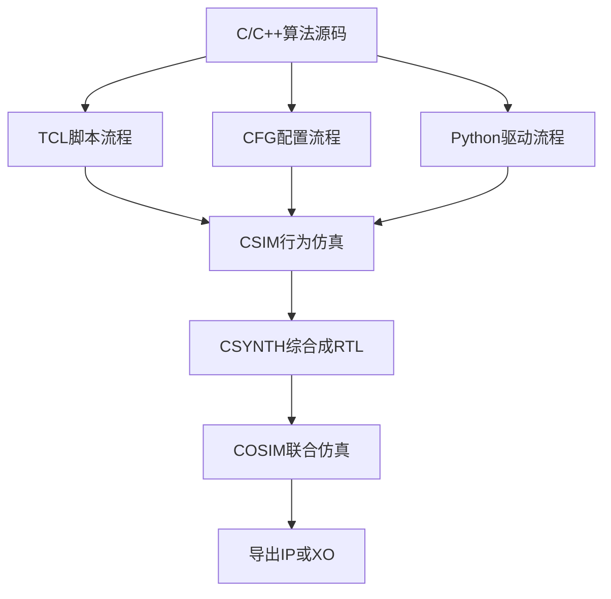
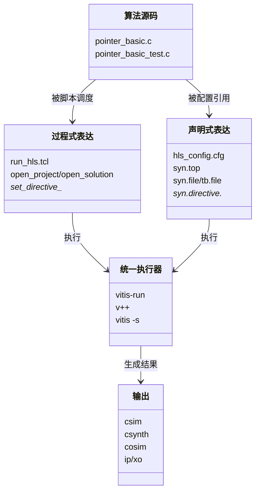
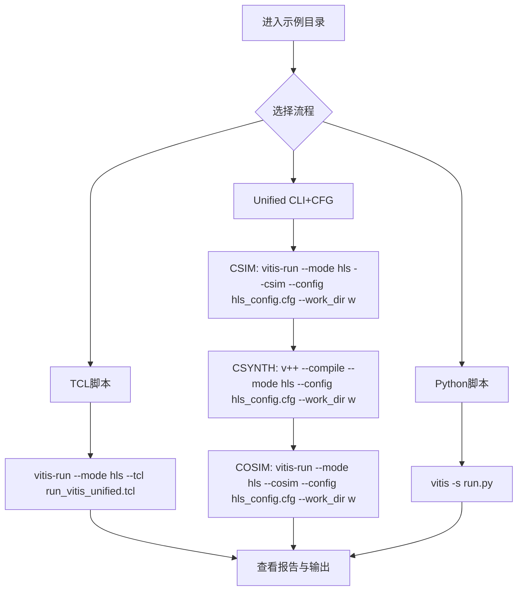
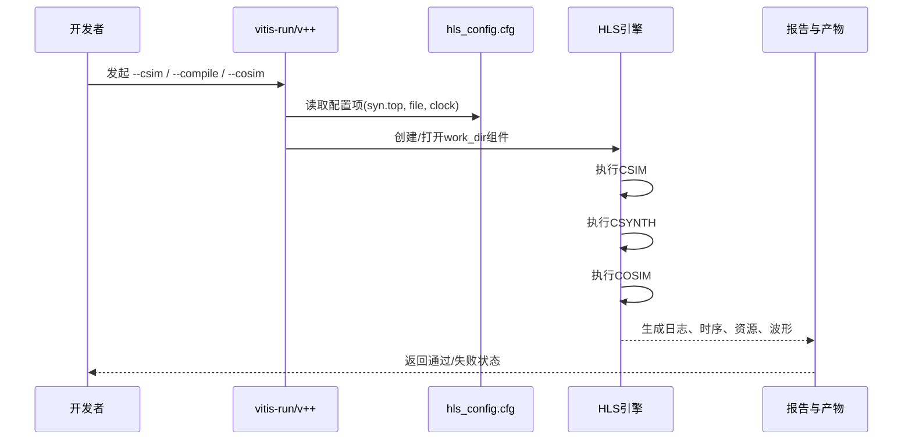
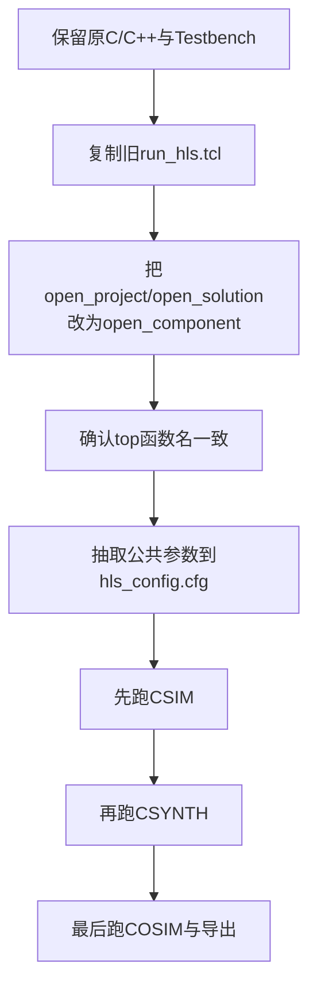
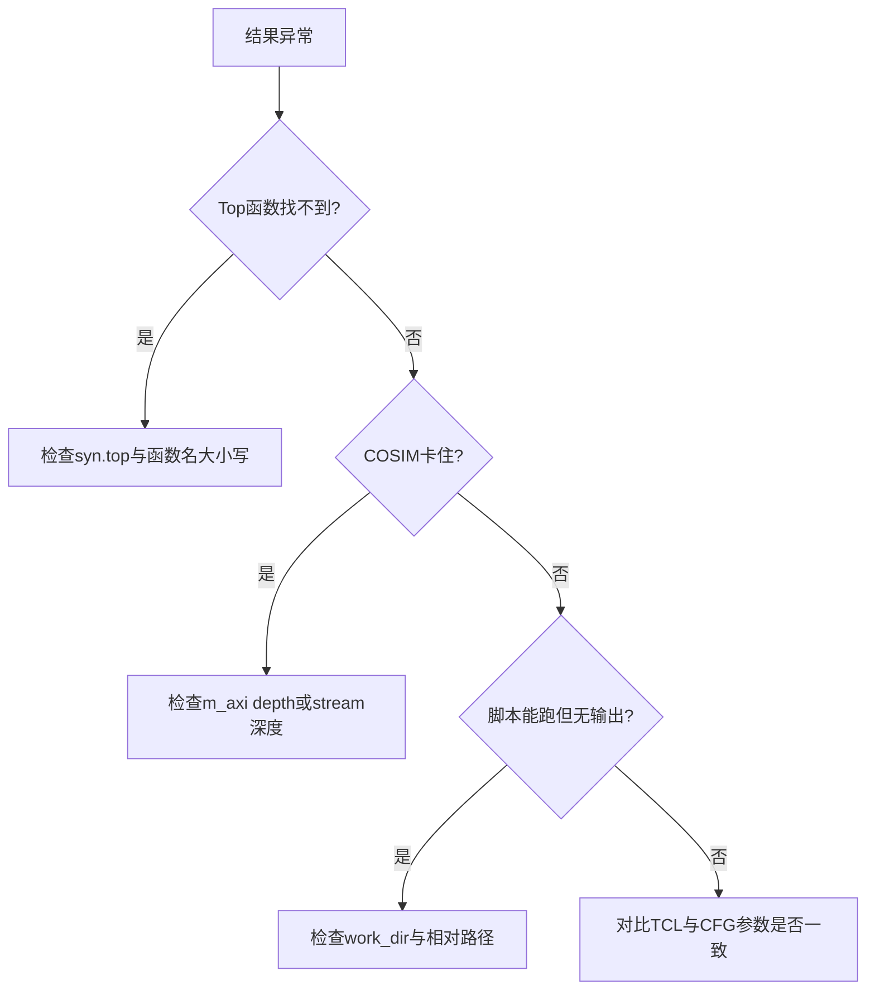

# 第 6 章：跨 HLS 流程迁移与运行（Migrating and running across HLS flows）

这一章是收官章。

前 5 章你已经会写“能综合、能并行、能跑快”的内核了。

现在你要学的是另一种能力：**不改算法源码，也能在不同工具流程里跑起来**。  
Imagine 你有一份菜谱（C/C++ 算法），但厨房有三种灶台（TCL、CFG、Python/Unified）。你不想重写菜谱，只想换灶台。

---

## 6.1 为什么会有多种流程：一份算法，三种“导航方式”

**TCL**（Tool Command Language）先解释一下：它是一种脚本语言，像“逐步导航”，你一句一句告诉工具先做什么再做什么。

**CFG**（配置文件，通常是 INI 格式）先解释一下：它是“静态配置清单”，像外卖下单页，你只填“我要什么参数”，不写执行过程。

**Unified CLI**（统一命令行）先解释一下：它是 Vitis 新流程的入口，像把过去分散的按钮收进一个总控制台。

这张图可以这样看：  
同一份源码像同一个“剧本”，TCL/CFG/Python 只是三位“导演”。导演风格不同，但目标都一样：先验证行为（CSIM），再生成硬件（CSYNTH），再做软硬一致性检查（COSIM），最后导出可集成产物（IP/XO）。

---

## 6.2 TCL、CFG、Unified：它们到底等价在哪

Think of it as 从 `Makefile` 迁移到 `package.json scripts`：写法变了，任务本质没变。

这张关系图的重点是：  
“表达方式”与“算法内容”是分层的。你把算法放在稳定层，把流程放在可替换层，就像前后端分离。这样工具升级时，你只改流程层，不动算法层。

---

## 6.3 三条常用运行路径（你今天就能跑）

你可以把这三条路想成三种出行方式：  
TCL 像“手动挡”，控制细；CFG+CLI 像“自动挡”，结构清晰；Python 像“车队调度系统”，适合批量自动化。

---

## 6.4 一次 Unified CLI 的真实交互时序

**sequenceDiagram** 可以理解为“聊天记录回放”，把谁在什么时候说了什么按时间展开。

这段时序告诉你：  
CLI 不是“编译器本体”，更像“前台接待”。真正干活的是 HLS 引擎。CFG 就是接待台上的“需求单”。

---

## 6.5 迁移最小改动法：从老 TCL 到新 Unified

Imagine 你在给老房子换电闸，不拆整栋楼。

这条迁移线的核心原则：  
先“跑通”，再“优雅”。先保证结果一致，再慢慢把 Tcl 指令迁到 cfg。像把单体应用拆微服务，先做兼容层最稳。

---

## 6.6 常见坑位速查（迁移时最容易踩）

把这张图当作“急诊分诊台”：  
先看是不是 top 名称问题，再看接口深度，再看路径和工作目录。90% 的迁移问题都在这几类。

---

## 章节小结

你现在已经掌握了跨流程复用的核心心法：

- **算法源码是资产，流程文件是适配器**。  
- **TCL 是过程式导航，CFG 是声明式清单，Python 是自动化编排**。  
- **先最小迁移跑通，再做配置收敛**。  

Think of it as：你的 HLS 设计已经从“只能在一台机器上跑的脚本”，升级成“可移植、可自动化、可持续维护”的工程资产。

恭喜，你完成了这本入门指南的第 6/6 章。  
你已经具备把示例库变成你自己项目模板库的能力了。