# 第五章：让它飞起来——并行性与优化技术

> **学习目标：** 探索硬件并行性的四个维度——流水线（Pipelining）、数据流（Dataflow）、数组分区（Array Partitioning）和任务级并行（Task-level Parallelism）——并了解 HLS pragma 如何引导编译器生成高吞吐量的 RTL 电路。

---

## 5.1 从单车道到立交桥：为什么需要并行？

想象一条只有一个收费站的高速公路入口。无论有多少辆车在排队，每次只能通过一辆。这就是 CPU 的工作方式——指令一条接一条地执行，像是永远只开着一个收费窗口。

FPGA 的使命，就是把这个收费站变成一座拥有几十个并行车道、甚至多层立交桥的现代交通枢纽。数据不再需要排队等待，而是在不同的"车道"上同时流动。

`optimization_parallelism` 模块，就是这座"交通枢纽设计手册"。它展示了从串行思维到硬件并行思维的完整转换路径。

---

## 5.2 四个并行维度的全景地图

在深入每种技术之前，先看看整体架构：

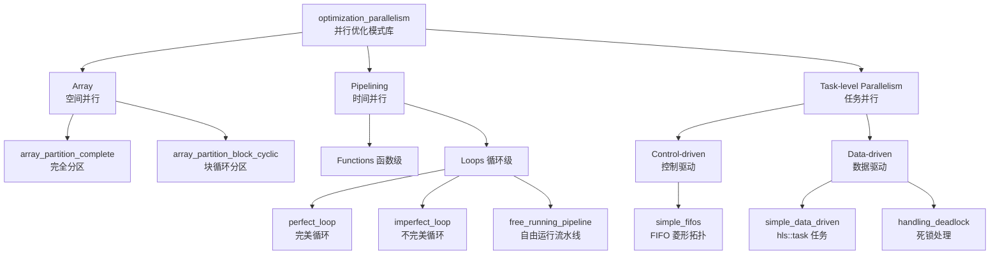

这张地图展示了三个正交（互相独立）的并行维度：

- **Array（空间并行）**：把数据分散到多个存储单元，让读写可以同时进行。就像把一个大书架拆成很多个小书架，多人可以同时取书。
- **Pipelining（时间并行）**：让操作在时间上重叠执行。就像工厂流水线，每个工位同时在处理不同的零件。
- **Task-level Parallelism（任务并行）**：让多个独立的功能模块同时运行。就像一个车间里，焊接组、喷漆组、装配组同时工作。

这三个维度可以**叠加组合**，共同实现极致的硬件吞吐量。

---

## 5.3 第一维度：数组分区——打破内存墙

### 5.3.1 什么是"内存墙"？

想象一个矩阵乘法计算器。CPU 可以每个时钟周期执行一次乘法，但矩阵里的数据全都挤在一个"单门储物间"（单端口 BRAM）里——每次只能开门拿一个数。即使计算速度再快，也只能干等着数据一个个送过来。

这就是**内存墙**（Memory Wall）——计算单元的速度远超内存带宽，导致大部分时间在空等。

**数组分区（Array Partitioning）** 的解法，就是把这个"单门储物间"拆成若干个"多门储物柜"，让多个数据可以同时被取出来。

### 5.3.2 三种分区策略

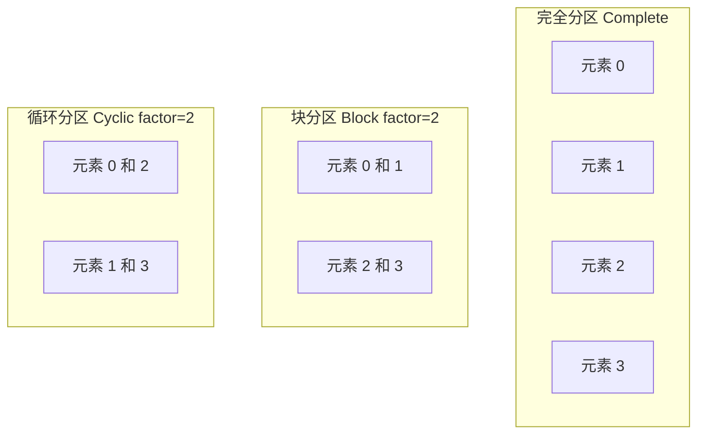

- **Complete（完全分区）**：每个元素都有自己独立的寄存器，任意元素可在同一时钟周期被并行访问。适合**小数组**（通常 32 个元素以内），性能最高但资源消耗也最大。
- **Block（块分区）**：把数组按连续块切分，适合按块顺序访问的算法（如分块矩阵乘法）。
- **Cyclic（循环分区）**：元素轮流分配到不同存储体，适合跨步访问（如 FFT 蝶形运算）。

### 5.3.3 矩阵乘法中的实战决策

来看 `matmul_partition` 的核心代码：

```cpp
void matmul_partition(int* in1, int* in2, int* out_r, int size) {
    int A[MAX_SIZE][MAX_SIZE];
    int B[MAX_SIZE][MAX_SIZE];
    int C[MAX_SIZE][MAX_SIZE];

    // 关键：只分区矩阵 B 的第二维（列方向）
    #pragma HLS ARRAY_PARTITION variable=B dim=2 complete
    #pragma HLS ARRAY_PARTITION variable=C dim=2 complete
}
```

**为什么分区矩阵 B 的第 2 维，而不是第 1 维？**

矩阵乘法的核心操作是：

$$C[i][j] = \sum_{k} A[i][k] \times B[k][j]$$

对于固定的 `j`，我们需要同时读取 `B[0][j]`, `B[1][j]`, ..., `B[N-1][j]`——这是**列访问**。但 C/C++ 二维数组默认按行存储，列访问意味着每个元素都在不同的行，单端口 BRAM 每周期只能给一个。

通过 `dim=2 complete`（第二维完全分区），矩阵 B 的每一列被展开到独立的寄存器。这样，一个时钟周期内就能并行读取整列所有元素。

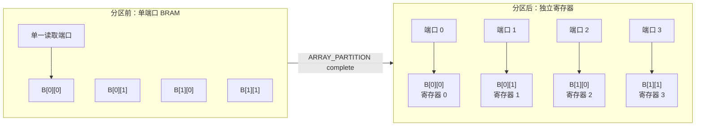

分区前，读取一列需要 N 个周期；分区后，只需 1 个周期。这就是空间并行的威力。

**而矩阵 A 为什么不分区？**

对于固定的 `i` 和变化的 `k`，访问 `A[i][0]`, `A[i][1]`, ..., `A[i][N-1]` 是**行访问**——元素在内存中连续排列，单端口 BRAM 可以流水线式顺序读取，不存在带宽瓶颈。分区 A 不会带来收益，反而浪费资源。

> 💡 **核心原则**：分区策略必须匹配访问模式。列访问→分区列维度；行访问→不需要分区。

---

### 5.3.4 分区陷阱：资源爆炸

数组分区是把双刃剑。看这个例子：

```cpp
int BigMatrix[1024][1024];
#pragma HLS ARRAY_PARTITION variable=BigMatrix dim=2 complete
// 危险！这会创建 1024 个独立存储体，每个 1024 个整数
// 总计 1,048,576 个寄存器 ← 大概率耗尽 FPGA 全部资源
```

**安全使用准则：**

| 数组大小 | 推荐策略 | 原因 |
|---------|---------|------|
| 小于 32 元素 | `complete` | 资源可控，访问最灵活 |
| 32 ~ 256 元素 | `cyclic/block factor=4~8` | 平衡带宽与资源 |
| 超过 256 元素 | `block` 小 factor，或保持默认 | 避免资源爆炸 |

---

## 5.4 第二维度：流水线——让时间重叠起来

### 5.4.1 工厂流水线类比

想象一个汽车工厂，完整组装一辆车需要 4 个步骤：车身焊接（2小时）→ 喷漆（1小时）→ 安装内饰（1小时）→ 质检（1小时），总共 5 小时。

**没有流水线**：完成第一辆车需要 5 小时，然后才开始第二辆。每辆车 5 小时。

**有流水线**：第一辆车焊接完毕进入喷漆时，第二辆车**同时**开始焊接。达到稳态后，每隔 2 小时（最长步骤的时间）就能完成一辆车。

这个"每隔多久启动下一次迭代"的时间，在 HLS 里叫做 **II（Initiation Interval，启动间隔）**。我们的目标通常是 **II = 1**，即每个时钟周期都启动一次新的迭代处理。

### 5.4.2 循环流水线：最常见的优化

```cpp
void dot_product(int A[N], int B[N], int* result) {
    int sum = 0;
    
LOOP_DP:
    for (int i = 0; i < N; i++) {
        #pragma HLS PIPELINE II=1   // 告诉编译器：每周期启动一次迭代
        sum += A[i] * B[i];
    }
    *result = sum;
}
```

加了 `#pragma HLS PIPELINE II=1` 之后，编译器会自动在循环的不同阶段之间插入寄存器，让多次迭代的不同阶段在时间上重叠。

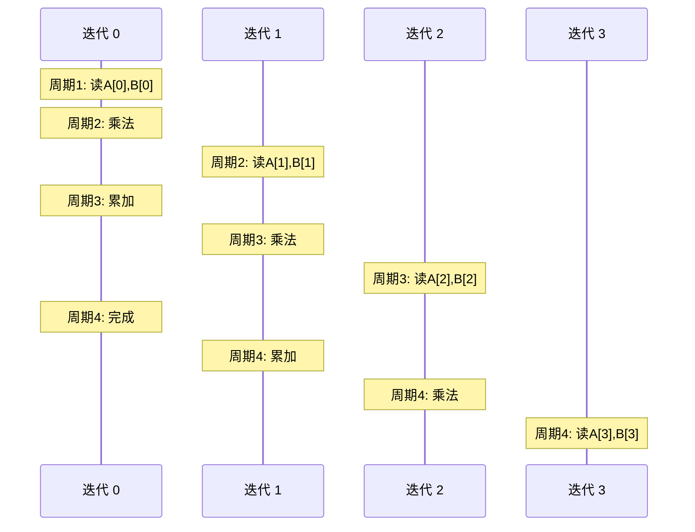

可以看到，从第 3 个周期开始，同一时刻有 3 个迭代在不同阶段同时运行——这就是时间并行。

### 5.4.3 完美循环 vs 不完美循环

**完美循环（Perfect Loop）**：内层循环边界固定，循环体内没有打破嵌套的条件分支。

```cpp
// 完美嵌套循环 — HLS 可以将其展平再流水
for (int i = 0; i < N; i++) {
    for (int j = 0; j < N; j++) {
        B[j] = A[j];        // 纯粹的循环体，无条件分支
    }
}
```

**不完美循环（Imperfect Loop）**：存在打破嵌套的条件分支。

```cpp
// 不完美循环 — 条件分支破坏了完美嵌套
for (int i = 0; i < N; i++) {
    for (int j = 0; j < N; j++) {
        B[j] = A[j];
    }
    // 这里的条件操作让循环"不完美"
    if (i % 2 == 0)
        C[i] = B[i];
    else
        C[i] = B[i] + 1;
}
```

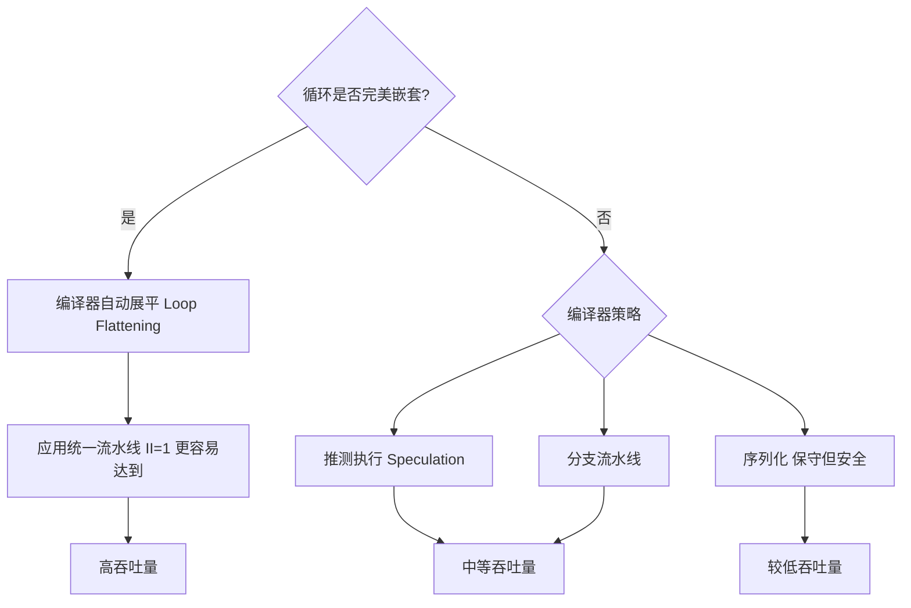

对于完美循环，HLS 编译器会把多层嵌套**展平**为单层循环，再应用流水线，更容易达到 II=1。

> 💡 **实战建议**：尽量把循环体内的条件操作移到循环外，或者重构成完美嵌套，可以显著提升流水线效率。

---

### 5.4.4 进阶模式：自由运行流水线（Free-Running Pipeline）

传统流水线有一个"全局指挥官"——集中式的有限状态机（FSM）控制每个迭代何时启动。就像工厂里有一个调度员，要亲自通知每个工位开工。

**自由运行流水线（FRP, Free-Running Pipeline）** 更像是"每个工位自己决定"：只要上游的输入 FIFO 不空、下游的输出 FIFO 不满，就自动处理数据。没有全局指挥，只有局部握手信号。

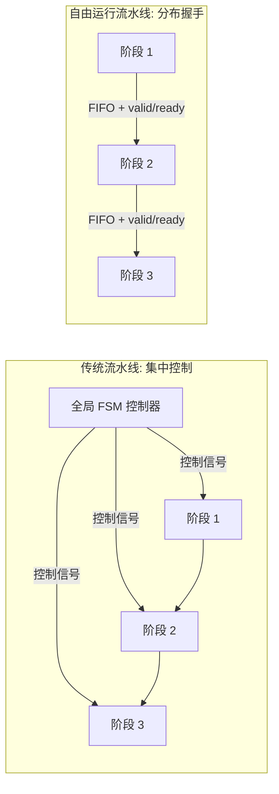

启用 FRP 只需在配置文件里加一行：

```ini
# hls_config.cfg
syn.compile.pipeline_style=frp
syn.dataflow.default_channel=fifo
syn.dataflow.fifo_depth=16
```

**FRP 的优势：**

| 特性 | 传统流水线 | 自由运行流水线 |
|------|-----------|--------------|
| 控制方式 | 集中式 FSM | 分布式握手 |
| 时序友好度 | 全局控制信号扇出大 | 局部连接，时序更好 |
| 适用场景 | 规则循环，固定数据率 | 高速流式处理 |
| 时钟频率潜力 | 中等 | 更高（更容易 200MHz+） |

> 💡 `fifo_depth=16` 是个"甜点值"：深度太浅（如 2）则频繁堵车；太深（如 64）则浪费 BRAM 且增加延迟。16 可以吸收大多数场景的突发速率差异。

---

## 5.5 第三维度：数据流（Dataflow）——让任务并肩而行

### 5.5.1 控制驱动模式：菱形并行拓扑

在讲任务级并行之前，先认识一个经典的数据流拓扑——**菱形（Diamond）模式**：

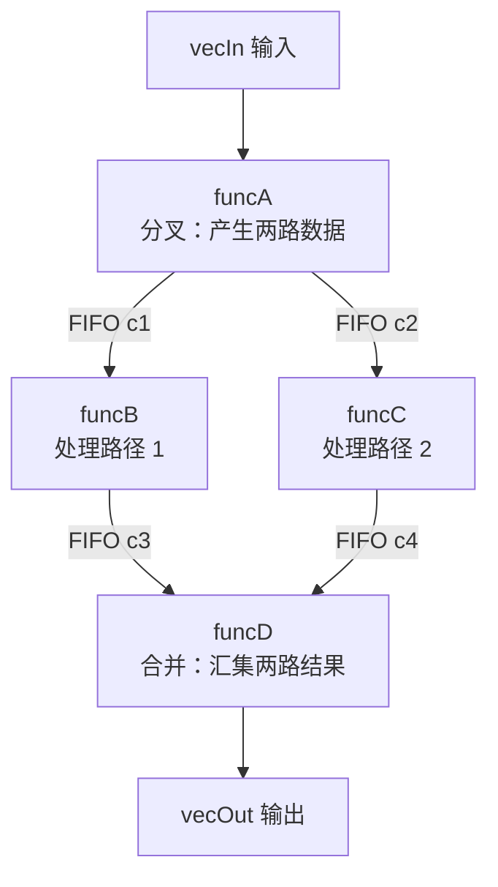

这个结构的关键代码：

```cpp
void diamond(data_t vecIn[N], data_t vecOut[N]) {
    data_t c1[N], c2[N], c3[N], c4[N];
    
    #pragma HLS DATAFLOW   // 告诉编译器：把这些函数并行化
    
    funcA(vecIn, c1, c2);  // 分叉：产生两路
    funcB(c1, c3);          // 路径 1（与 funcC 并行！）
    funcC(c2, c4);          // 路径 2（与 funcB 并行！）
    funcD(c3, c4, vecOut);  // 合并：消费两路
}
```

`#pragma HLS DATAFLOW` 这一行的魔力在于：它告诉 HLS 编译器，把函数调用之间的数组变量（`c1`、`c2`、`c3`、`c4`）变成 **FIFO 通道**，让 `funcB` 和 `funcC` 可以**真正并行运行**，而不是像顺序代码那样一个接一个地执行。

> 思考：如果不加 `#pragma HLS DATAFLOW`，这四个函数会串行执行，总延迟是 funcA + funcB + funcC + funcD。加上之后，总延迟变成 funcA + max(funcB, funcC) + funcD——大幅缩短！

### 5.5.2 数据在菱形拓扑中如何流动

让我们追踪一个数据元素从输入到输出的完整旅程：

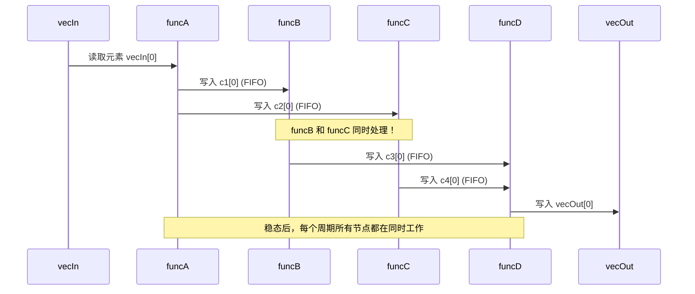

### 5.5.3 反压机制：FIFO 的自我保护

当下游（如 funcD）处理慢于上游（如 funcC）时，FIFO 会填满。这时 funcC 的写操作会**自动阻塞**，等 funcD 消费了数据腾出空间。这个机制叫做**反压（Back-pressure）**。

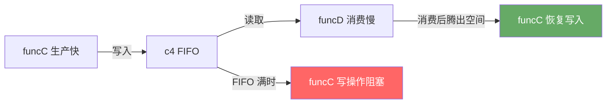

反压是数据流系统的自限流机制——它自动把"快"节点减速到"慢"节点的速率，保证系统不会崩溃，只是吞吐量受制于最慢的那一级（即**瓶颈节点**）。

---

## 5.6 第四维度：hls::task——从任务调用到常驻任务

### 5.6.1 两种执行哲学

到目前为止，`#pragma HLS DATAFLOW` 使用的是**控制驱动**模式——有一个隐式的"指挥官"决定何时调用哪个函数，处理完一批数据后函数退出，等待下次调用。

Vitis HLS 2021.2 引入了 `hls::task`，代表完全不同的**数据驱动**哲学：任务永不退出，只要数据可用就一直运行。

用餐厅来类比：
- **控制驱动（DATAFLOW）**：服务员接到一桌订单，叫厨师做完这桌的菜，上完菜，然后等下一桌。
- **数据驱动（hls::task）**：厨师是一台永不停机的机器，只要食材送来就立刻加工，加工完就送出去，从不等待"开桌"指令。

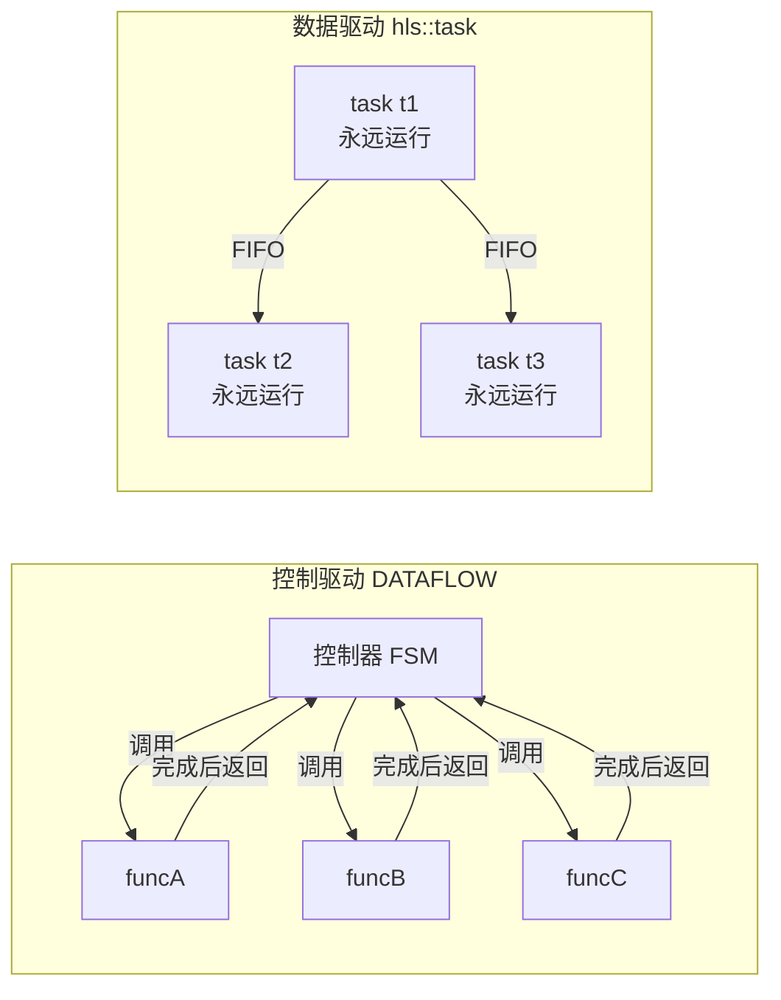

### 5.6.2 hls::task 实战：奇偶分流器

```cpp
void odds_and_evens(hls::stream<int>& in,
                    hls::stream<int>& out1,
                    hls::stream<int>& out2) {
    
    // 内部 FIFO 通道，深度 = N/2
    hls_thread_local hls::stream<int, N/2> s1;
    hls_thread_local hls::stream<int, N/2> s2;

    // 三个常驻任务，并行永续运行
    hls_thread_local hls::task t1(splitter, in, s1, s2);  // 分流
    hls_thread_local hls::task t2(odds,    s1, out1);     // 处理奇数
    hls_thread_local hls::task t3(evens,   s2, out2);     // 处理偶数
}
```

这段代码的硬件拓扑：

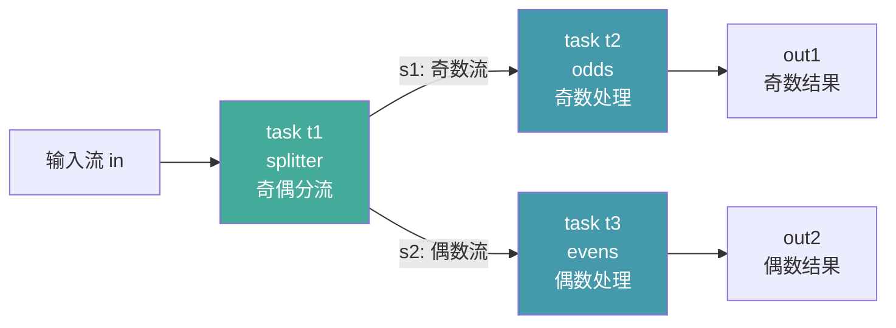

**关键细节解读：**

- **`hls_thread_local`**：这个存储类关键字告诉编译器"这些对象是线程局部的"，每个实例化上下文都有独立的副本，避免多实例之间的状态冲突。
- **`hls::stream<int, N/2>`**：固定深度 N/2 的 FIFO。因为 `splitter` 产生的奇数和偶数各占一半，N/2 的深度足以吸收短暂的速率差异。
- **三个任务真正并行**：`t1`、`t2`、`t3` 在硬件里是三个独立的有限状态机，同时运行，通过 FIFO 传递数据。

### 5.6.3 控制驱动 vs 数据驱动：如何选择？

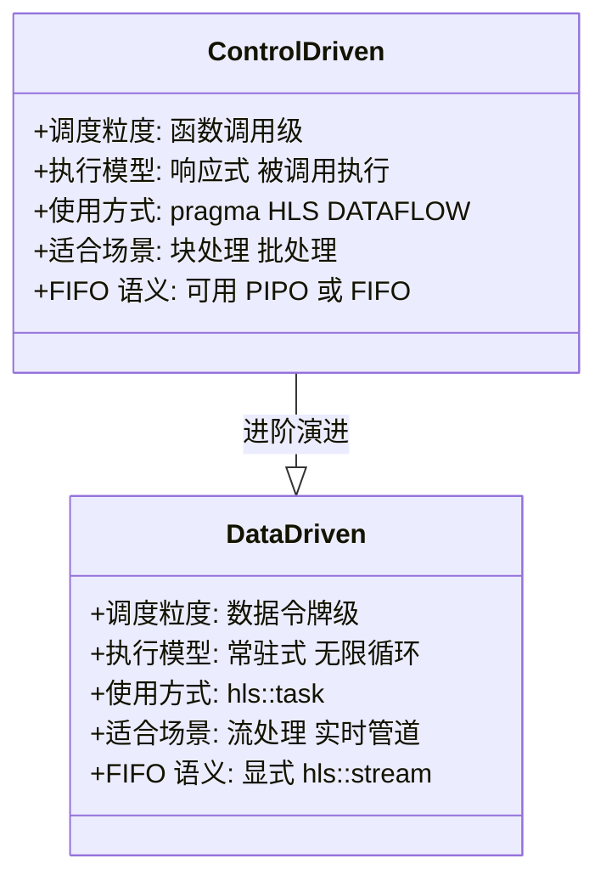

**简单选择原则：**

- 处理固定大小的数据块？→ `#pragma HLS DATAFLOW`
- 处理持续到来的数据流（如视频像素、网络包）？→ `hls::task`
- 需要更细粒度的并行控制？→ `hls::task`

---

## 5.7 把它们组合起来：综合优化策略

真正的高性能设计往往同时使用多个维度的优化。下面以矩阵乘法为例，展示三种优化的协同效果：

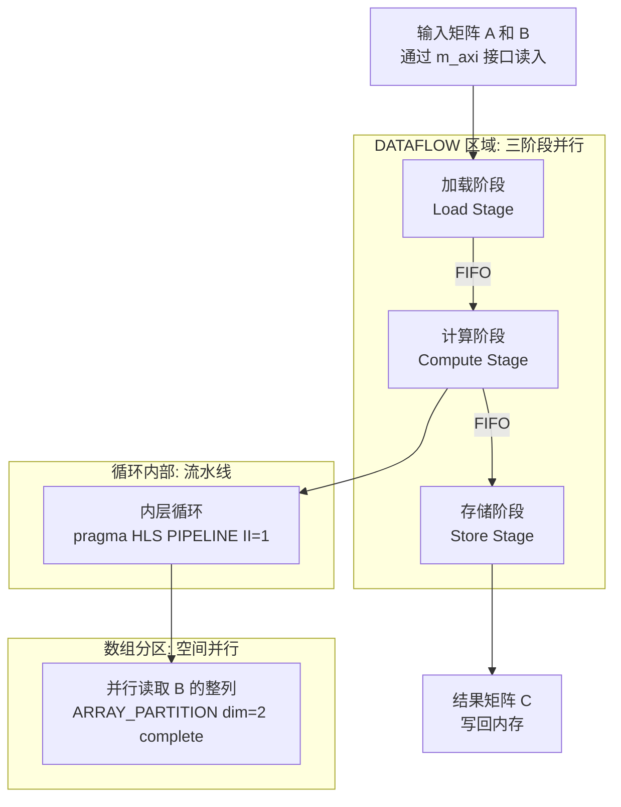

三层优化的作用层次：

1. **DATAFLOW（任务层）**：加载、计算、存储三个阶段**同时进行**。在计算第 N 批数据时，加载第 N+1 批，存储第 N-1 批。
2. **PIPELINE（循环层）**：每个时钟周期启动一次内积迭代，让乘法和累加重叠执行。
3. **ARRAY_PARTITION（存储层）**：一个周期内并行读取矩阵 B 的整列，消除内存带宽瓶颈。

---

## 5.8 死锁陷阱：数据流设计最危险的问题

数据流设计中最隐蔽的 Bug 就是**死锁（Deadlock）**。

想象两个任务：

- 任务 A 在等任务 B 的输出才能继续
- 任务 B 在等任务 A 的输出才能继续

两个都在等，没有一个能动——这就是死锁。就像两辆车在单车道窄桥上头对头相遇，谁都不肯退。


**避免死锁的三条铁律：**

1. **通道方向性**：每个 `hls::stream` 必须有**唯一的生产者**和**唯一的消费者**，不能多写多读。
2. **任务图无环**：任务之间的数据依赖必须构成一个**有向无环图（DAG）**，不能有循环依赖。
3. **调试工具**：发生疑似死锁时，使用 `cosim.trace_level=all` 配置开启波形追踪，观察各 FIFO 的填充深度，找到永远满（或永远空）的那个 FIFO，它就是死锁节点。

---

## 5.9 配置文件详解：优化的开关板

所有这些优化，除了在 C++ 代码里用 pragma 声明，还可以通过 `.cfg` 配置文件集中控制：

```ini
# hls_config.cfg — 优化控制中心

# 目标芯片和时钟
part=xcvu9p-flga2104-2-i
[hls]
clock=10                        # 10ns = 100MHz，越小越激进

# 综合目标
flow_target=vivado              # 使用 Vivado 流程（生成 IP 核）
                                # 或 vitis（生成 .xo 内核对象）

# 数据流通道配置
syn.dataflow.default_channel=fifo   # 通道类型：fifo 或 pipo
syn.dataflow.fifo_depth=16          # FIFO 缓冲深度

# 流水线风格
syn.compile.pipeline_style=frp      # frp=自由运行，classic=传统

# 输出格式
package.output.format=ip_catalog    # 打包为 Vivado IP 目录格式
```

**关键参数的权衡：**

| 参数 | 较小值 | 较大值 |
|------|--------|--------|
| `clock` | 时序约束更严格，挑战高频 | 约束宽松，更容易综合 |
| `fifo_depth` | 节省 BRAM，但容易堵塞 | 容忍速率差异，但耗 BRAM |
| `pipeline_style` | `classic`：简单，调试容易 | `frp`：高性能，适合流式 |

---

## 5.10 本章知识地图

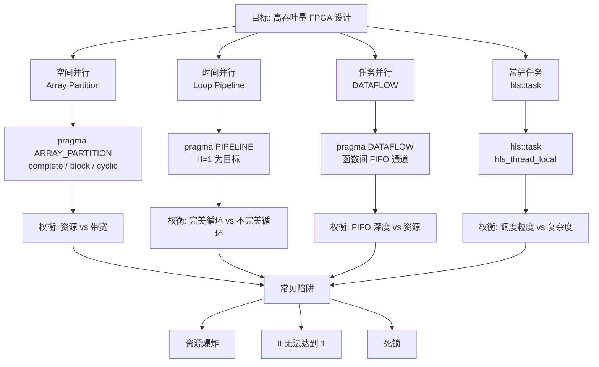

---

## 5.11 快速参考手册

### Pragma 速查表

| Pragma | 作用 | 典型用法 |
|--------|------|---------|
| `#pragma HLS ARRAY_PARTITION variable=X dim=N complete` | 把数组第 N 维完全展开为寄存器 | 小数组，需并行访问 |
| `#pragma HLS ARRAY_PARTITION variable=X cyclic factor=K` | 轮询分区为 K 个存储体 | FFT，跨步访问 |
| `#pragma HLS PIPELINE II=1` | 循环/函数流水线，目标 II=1 | 内层循环加速 |
| `#pragma HLS DATAFLOW` | 函数间任务级流水线 | 多阶段并行处理 |
| `#pragma HLS UNROLL` | 完全展开循环体，复制硬件 | 小循环，追求极致并行 |

### 调试决策树

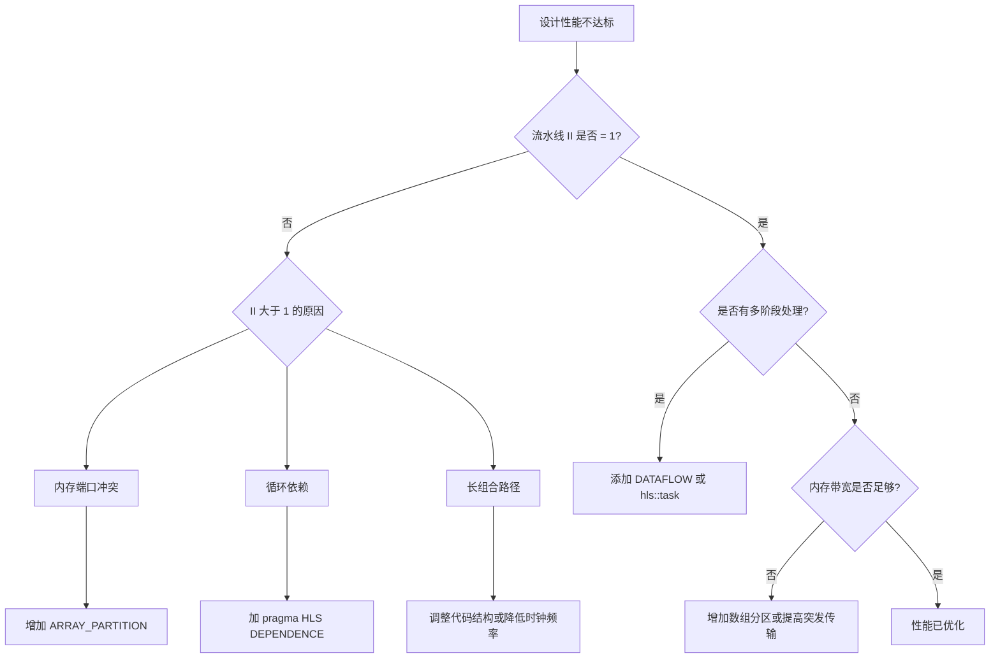

---

## 5.12 章节总结

我们在这一章探索了硬件并行性的四个维度：

1. **数组分区（Array Partitioning）**：把"单门储物间"变成"多门储物柜"，解决内存带宽瓶颈。关键是匹配分区策略与访问模式（列访问→分区列维度）。

2. **循环流水线（Loop Pipelining）**：让循环的不同迭代在时间上重叠，目标是 II=1（每周期处理一个新数据）。完美嵌套循环更容易流水。

3. **数据流（Dataflow）**：用 `#pragma HLS DATAFLOW` 把多个函数变成并行的流水线阶段，通过 FIFO 通道连接。菱形拓扑是经典的分叉-合并模式。

4. **常驻任务（hls::task）**：用 `hls::task` 创建永不退出的并行任务，适合处理持续流式数据。是 DATAFLOW 的进化版本，调度粒度更细。

这四个维度可以自由组合，形成多层次的并行体系。掌握它们，你就掌握了把 FPGA 变成真正高性能计算引擎的核心武器。

---

> **下一章预告**：第六章将探讨工具链迁移——如何把现有的 TCL 脚本、INI 配置文件，乃至整个 HLS 项目平滑迁移到 Vitis Unified 统一平台，无需从零重写。