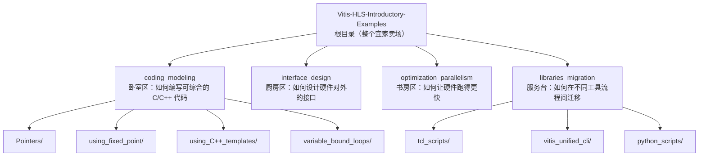
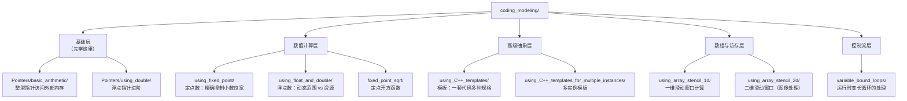
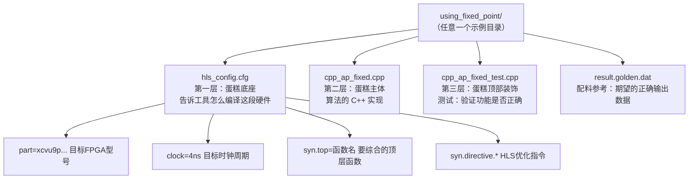
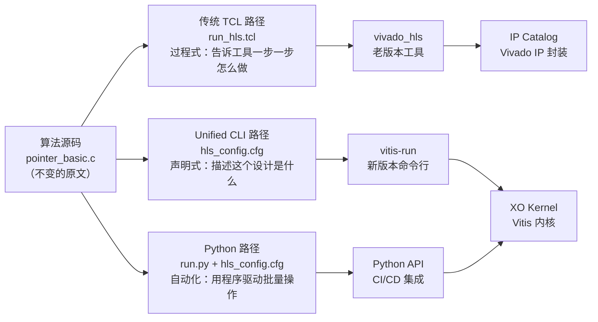
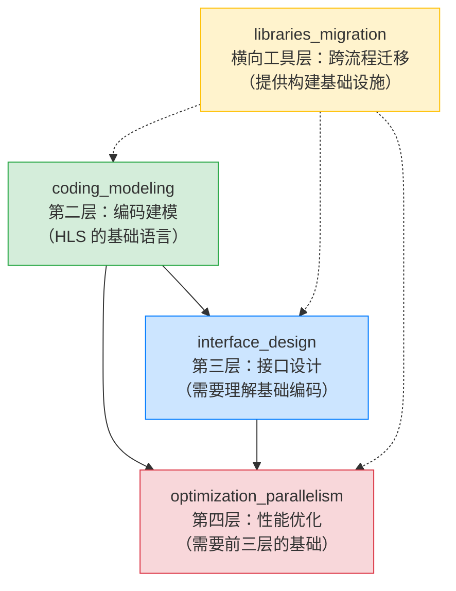
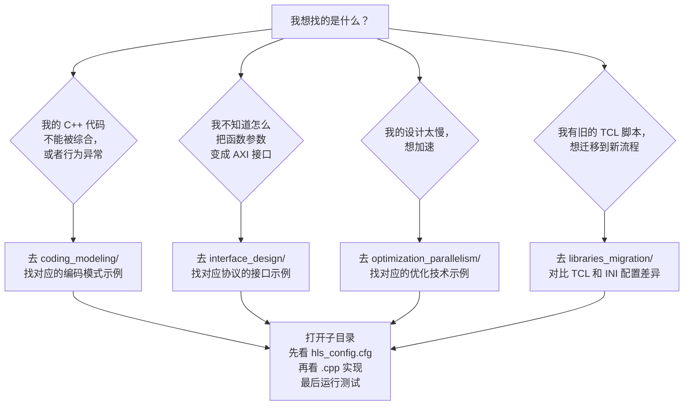
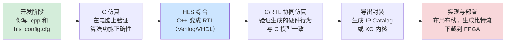

# 第二章：项目是怎么组织的？一份代码库地图

> **本章目标：** 理解项目的"平铺式、一例一目录"结构，搞清楚每个顶层模块负责什么，学会在代码库里不迷路。

---

## 2.1 先给整个项目画一张"全景地图"

想象你走进一家大型宜家（IKEA）卖场。它不是按照"所有木材放一区、所有螺丝放一区"来组织货架的，而是按照**使用场景**来划分：卧室区、厨房区、书房区……每个区域都是一个完整的"生活方式样板间"，你能直接看到实物效果。

`Vitis-HLS-Introductory-Examples` 的组织方式和宜家一模一样。它不是把所有 `.cpp` 文件堆在一起，也不是按照文件类型（接口文件、算法文件、测试文件）分类，而是按照**HLS 开发的关键议题**分成四个顶层模块：



这张图告诉你：**四个顶层目录，四个不同主题**。每个目录内部，再进一步按具体技术点细分成子目录。

---

## 2.2 每个顶层模块是"什么样板间"？

让我们逐一逛逛这四个"样板间"，了解各自的定位。

### 样板间一：`coding_modeling` —— 写出"对硬件友好"的 C++ 代码

这是整个项目的**基础训练营**。它回答的核心问题是：

> 我会写 C++ 代码，但为什么同样的写法在 FPGA 上跑不起来，或者效率奇差？

就像一位厨师刚开始学习西餐，他可能熟悉炒菜，但不了解烤箱的特性，同样的食材用错了方法就做不出好菜。`coding_modeling` 展示了一系列"HLS 厨艺技巧"：怎么用指针访问外部内存、怎么使用精确位宽的数据类型、怎么写 C++ 模板让代码自动生成不同规格的硬件……

### 样板间二：`interface_design` —— 让硬件与外界"握手"

一个 FPGA 内核（Kernel）再强大，如果没有合适的接口与外界交换数据，也是孤岛。这个模块展示的是**硬件的"插座和插头"**——AXI4、AXI4-Stream、AXI4-Lite 等工业标准协议，以及如何通过 HLS 配置让你的 C++ 函数参数自动变成这些标准接口。

### 样板间三：`optimization_parallelism` —— 把硬件的速度潜力榨干

这是"进阶区"，专门讲如何让你的 FPGA 设计又快又高效。流水线（Pipeline）、数据流（Dataflow）、循环展开（Loop Unroll）、数组分区（Array Partition）……这些都是 FPGA 独有的"加速魔法"，这里都有示例展示怎么用。

### 样板间四：`libraries_migration` —— 在不同工具版本间"换语言"

这个模块有点特殊——它不是讲算法本身，而是讲**如何表达同一个算法**。Xilinx 的 HLS 工具经历了从 Vivado HLS 到 Vitis HLS 再到 Vitis Unified 的演变，每个版本的"指令语言"略有不同。这里就像一本**方言词典**，教你把同一段意思从旧方言翻译成新方言。

---

## 2.3 深入理解：`coding_modeling` 的内部地图

`coding_modeling` 是最基础也最重要的模块，我们来详细看看它的内部结构。



这张图揭示了一个重要规律：**每个子目录对应一个独立的技术知识点**。它们之间没有强制的前后顺序依赖（每个都是独立的"完整菜谱"），但从学习角度建议按"基础层 → 数值计算层 → 高级抽象层"的顺序逐步推进。

---

## 2.4 每个示例目录的内部结构：三层蛋糕

无论你打开哪个子目录，你都会看到相同的文件组合。就像每家宜家样板间里都有床、灯和储物柜——布局不同，但构成要素是固定的。



让我们逐层看这三层蛋糕：

**第一层（蛋糕底座）：`hls_config.cfg`**
这是整个项目的**指挥官**。它不只是个配置文件，而是告诉 HLS 工具："你要针对哪块 FPGA 芯片、跑多快的时钟、把哪个 C++ 函数变成硬件电路、用什么方式优化"。类比摄影：这相当于相机的参数设置面板——快门速度（时钟频率）、对焦目标（顶层函数）、拍摄模式（流程目标）。

**第二层（蛋糕主体）：`.cpp` 算法文件**
这是真正的**算法逻辑**，用 C/C++ 写成。但要注意：这里的 C++ 不是随便写的，它需要遵循"对硬件友好"的编码规范（这正是 `coding_modeling` 模块要教的内容）。

**第三层（顶部装饰）：`_test.cpp` 测试文件**
这是**验证员**，负责给算法喂数据、检查输出是否正确。测试数据的期望答案存储在 `result.golden.dat` 文件里——就像一道数学题旁边附的"答案"，HLS 工具会自动对比实际输出和答案，确认设计正确。

---

## 2.5 深入理解：`libraries_migration` 的"方言词典"

`libraries_migration` 模块的组织方式与 `coding_modeling` 不同。它的核心思想是：**同一段算法，用三种不同的工具语言表达**。

想象同一首唐诗，被翻译成英文、法文、日文三个版本——原文是一样的，只是表达方式不同。



**走读这张图：** 最左边的算法源码 `pointer_basic.c` 保持不动。三条分支代表三种不同的"驾驶方式"开向同一个目的地。TCL 路径像手动档——你要一步步换挡；INI 路径像自动档——你只需声明目标；Python 路径像自动驾驶——程序自动批量处理。最终输出有两种形态：老流程产出 Vivado IP，新流程产出 Vitis XO 内核。

---

## 2.6 四大模块的关系：谁依赖谁？



**实线箭头**表示学习依赖——建议先掌握 `coding_modeling` 的基础，再去看 `interface_design`，最后研究 `optimization_parallelism`。

**虚线箭头**表示工具支持——`libraries_migration` 不是"上层应用"，而是**横向的工具层**，为其他三个模块提供"如何运行这些示例"的不同方式。不管你在看哪个模块的例子，都可能需要参考 `libraries_migration` 里的 TCL 脚本或配置文件格式。

---

## 2.7 实战：如何在代码库里找到你想要的东西

面对这么多目录，新来者最容易犯的错误是"打开根目录，然后迷失"。这里给你一张**快速导航卡**：



**黄金法则：每次打开一个新的示例子目录，先读 `hls_config.cfg`，再读 `.cpp`。** 配置文件就像菜谱的"原材料和烹饪说明"，代码才是"食材处理步骤"。顺序搞反了，看代码时会不知道"为什么要这样写"。

---

## 2.8 一个具体的导航实例：找"定点数"示例

假设你想学习如何在 FPGA 上使用定点数（fixed-point number，一种比浮点数省资源的数值表示方式），我们一步步走：

**第一步：** 确认这属于"编码建模"的问题 → 进入 `coding_modeling/`

**第二步：** 在子目录列表中找 `using_fixed_point/`

**第三步：** 打开后，按顺序阅读：

```
using_fixed_point/
├── hls_config.cfg          ← 第一步看这里
│     part=xcvu9p...
│     clock=4
│     syn.top=cpp_ap_fixed
│     syn.directive.pipeline=cpp_ap_fixed   ← "哦！这个函数要流水线处理"
│
├── cpp_ap_fixed.cpp        ← 第二步看这里
│     #include "ap_fixed.h"
│     ap_fixed<16,8> result = ...           ← "16位总宽，8位整数部分"
│
└── cpp_ap_fixed_test.cpp   ← 第三步看这里（可选）
      // 验证计算结果正确性
```

**第四步：** 如果你想实际运行这个例子，去看 `libraries_migration/` 里对应的运行脚本格式。

这个流程适用于 `coding_modeling` 里**任何一个**示例，方法完全通用。

---

## 2.9 整体数据流：从 C++ 到 FPGA 比特流的旅程

理解了目录结构之后，我们来看整体的"生产线"是怎么转的：



这条流水线中，`coding_modeling` 的示例主要覆盖"开发阶段"和"HLS 综合"这两个环节——也就是说，**学好 coding_modeling，相当于掌握了整条生产线最关键的原材料加工工艺**。

---

## 2.10 小结：三个带走的核心认知

读完这章，希望你记住三件事：

**第一：四个模块，四个主题，各司其职。**
`coding_modeling`（怎么写）→ `interface_design`（怎么连接）→ `optimization_parallelism`（怎么加速）→ `libraries_migration`（怎么迁移工具）。这是 HLS 开发的完整认知地图。

**第二：每个示例目录都是一个"完整的教学单元"。**
三层结构——`hls_config.cfg`（配置）+ `.cpp`（实现）+ `_test.cpp`（验证）——在整个代码库里保持一致。找到这个结构，你就找到了学习入口。

**第三：先看配置，再看代码。**
`hls_config.cfg` 是理解一个 HLS 示例的"上下文"，告诉你"为什么要这样写代码"。跳过配置文件直接看 `.cpp`，就像看厨师的动作却不知道他在做什么菜——动作能看懂，但不理解意图。

---

## 预告：下一章

现在你已经有了这份"建筑平面图"，下一章我们就走进 `coding_modeling` 里最核心的房间——**学习如何把普通的 C/C++ 改写成"硬件友好"的代码**：指针、结构体、模板、定点数，在 FPGA 的世界里它们分别意味着什么，又该如何正确使用。