# 第三章：写出能编译成硬件的 C/C++：核心编码模式

> **本章学习目标**：发现熟悉的软件构件——指针、结构体、模板、定点类型——在 FPGA 硬件中必须以不同方式编写，以 `coding_modeling` 示例作为"烹饪书"，掌握每一种核心编码模式。

---

## 3.1 从软件思维到硬件思维：一道鸿沟

想象你是一位厨师，过去一直在家里的厨房做饭——炉子是顺序的，你先炒菜，再煮汤，再蒸饭，一件事做完再做下一件。这就是 CPU 的工作方式：**一条指令接一条指令，顺序执行**。

现在你来到了一家大型餐厅的后厨，这里有十几个炉灶同时开火，每个炉灶负责一道菜，所有菜同时在做。这就是 FPGA 的工作方式：**所有逻辑同时运行，并行处理**。

问题来了：你过去写的"家庭食谱"（软件代码）直接拿到餐厅后厨用，很多步骤根本行不通。HLS（高层次综合）工具的任务，就是帮你把家庭食谱翻译成餐厅后厨的操作手册——但翻译的质量，**高度依赖于你最初写食谱的方式**。

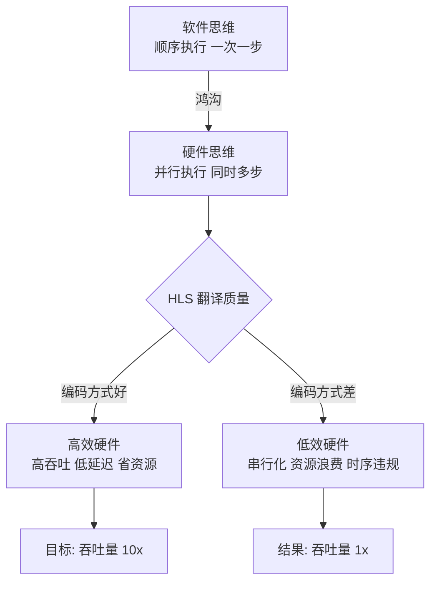

上图说明了一个关键事实：**同样的算法，不同的编码风格，可能导致吞吐量相差 10 倍、资源消耗相差 5 倍**。这就是为什么我们需要专门学习"硬件友好的编码模式"。

---

## 3.2 每个示例的三层结构：你的烹饪书格式

在深入具体模式之前，先理解 `coding_modeling` 中每个示例的统一结构。就像每本烹饪书都有固定的菜谱格式（食材、步骤、成品图），每个 HLS 示例也有三层：

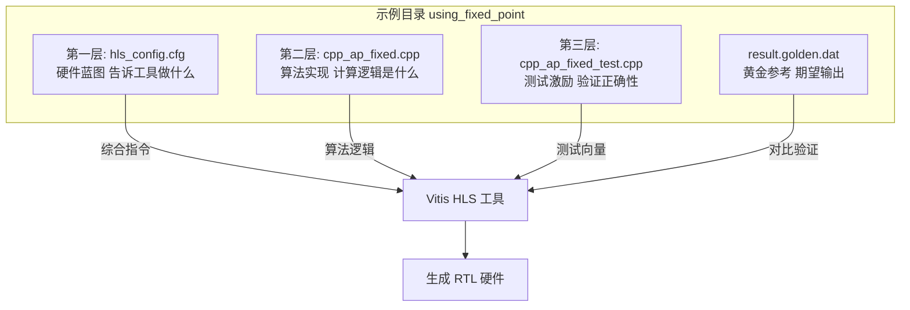

**第一层（`hls_config.cfg`）** 就像相机的参数设置面板——它告诉 HLS 工具目标芯片是什么、时钟频率是多少、用什么接口协议。这些配置直接决定生成的硬件架构。

**第二层（`.cpp` 实现文件）** 是你最熟悉的部分，但编写方式决定硬件质量。

**第三层（`_test.cpp` 和 `.dat`）** 是验证层，确保硬件行为和软件模型完全一致。

---

## 3.3 模式一：指针——从"随意访问内存"到"明确的硬件接口"

### 3.3.1 软件中的指针 vs. 硬件中的指针

在软件里，指针就像一张"地址便条"——你可以把它传给任何函数，函数拿着便条去内存里取数据，简单直接。

在硬件里，指针意味着**一条物理总线**。当你的 FPGA 内核需要通过指针访问外部 DDR 内存时，它必须通过 AXI4 Master 总线发出读写请求，等待内存控制器响应。这不是"取数据"，而是"发起一次网络请求"。

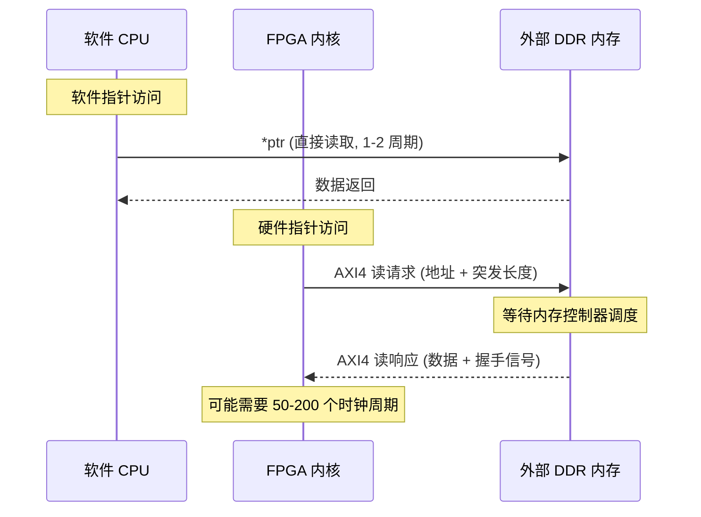

这个时序图揭示了一个重要差异：软件指针访问是"即时"的，而硬件指针访问需要经过完整的 AXI 协议握手，延迟可能高达数百个时钟周期。

### 3.3.2 `Pointers/basic_arithmetic` 示例解析

来看 `coding_modeling` 中的指针示例。这个例子展示了如何正确地在 HLS 中使用指针：

```cpp
// 典型的 HLS 指针使用模式
void cpp_ap_int_arith(dio_t *in1, dio_t *in2, dio_t *out1, dio_t *out2) {
    // HLS 会为这些指针生成 m_axi 接口
    static int acc = 0;  // 静态变量 -> 带使能信号的寄存器
    
    *out1 = *in1 + *in2;  // 加法运算
    acc  += *in1 * *in2;  // 累加器
    *out2 = acc;
}
```

对应的 `hls_config.cfg` 配置：

```ini
part=xcvu9p-flga2104-2-i
[hls]
clock=4
syn.file=cpp_ap_int_arith.cpp
syn.top=cpp_ap_int_arith
# 关键：为指针参数指定 AXI Master 接口
syn.directive.interface=cpp_ap_int_arith out1 mode=m_axi depth=1
syn.directive.interface=cpp_ap_int_arith out2 mode=m_axi depth=1
```

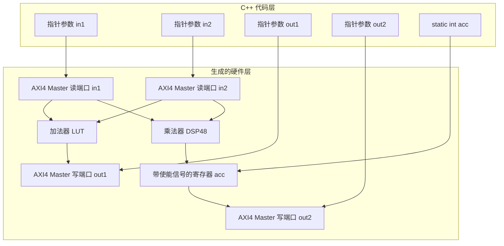

### 3.3.3 指针别名：最容易踩的陷阱

想象两个人同时指向同一个房间——如果你不告诉 HLS 工具"这两个指针绝对不会指向同一块内存"，工具会**保守地假设它们可能重叠**，从而强制串行化所有访问，彻底破坏流水线。

```cpp
// 危险：HLS 不知道 in 和 out 是否重叠
void bad_example(int *in, int *out, int n) {
    for (int i = 0; i < n; i++) {
        out[i] = in[i] * 2;  // HLS 假设 out[i] 可能影响 in[i+1]
    }
}

// 安全：使用 __restrict__ 告诉 HLS 指针不重叠
void good_example(int * __restrict__ in, int * __restrict__ out, int n) {
    for (int i = 0; i < n; i++) {
        #pragma HLS PIPELINE II=1
        out[i] = in[i] * 2;  // HLS 现在可以安全地流水线化
    }
}
```

> **关键原则**：在 HLS 中，每个指针参数都代表一条物理总线。用 `__restrict__` 声明无别名，用 `m_axi` 接口配置访问外部内存，用 `depth=` 参数告诉工具最大访问深度。

---

## 3.4 模式二：任意精度整数——精确控制每一个比特

### 3.4.1 为什么不能直接用 `int`？

在软件里，`int` 就是 32 位，没得商量。但在 FPGA 上，**每一个比特都对应真实的硬件资源**。如果你的算法只需要 12 位精度，却用了 32 位的 `int`，你就浪费了 20 个比特的 LUT 和连线资源——就像用一辆 40 吨的卡车运一个快递包裹。

HLS 提供了 `ap_int<N>` 类型，让你精确指定任意位宽：

```cpp
#include "ap_int.h"

// 精确控制位宽
ap_int<8>   pixel;      // 8 位有符号整数（图像像素）
ap_uint<12> adc_val;    // 12 位无符号整数（ADC 采样值）
ap_int<24>  audio;      // 24 位有符号整数（音频样本）
ap_uint<1>  flag;       // 1 位标志位（单个触发器）
```

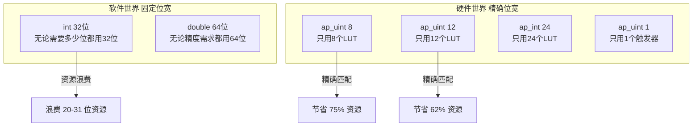

### 3.4.2 `using_arbitrary_precision_arith` 示例

这个示例展示了 `ap_int` 的典型用法：

```cpp
#include "ap_int.h"

typedef ap_int<8>  din_t;   // 8 位输入
typedef ap_int<13> dout_t;  // 13 位输出（防止溢出：8+8=16，但实际只需13位）
typedef ap_int<6>  dsel_t;  // 6 位选择信号

dout_t cpp_ap_int_arith(din_t in1, din_t in2, dsel_t sel) {
    dout_t out;
    if (sel[0])           // 直接访问单个比特！
        out = in1 + in2;  // 8位 + 8位 = 9位结果，自动扩展到13位
    else
        out = in1 - in2;  // 8位 - 8位 = 9位结果
    return out;
}
```

注意 `sel[0]` 这个写法——在软件里你需要位运算 `sel & 1`，但 `ap_int` 允许你**直接用下标访问单个比特**，就像访问数组元素一样直观。

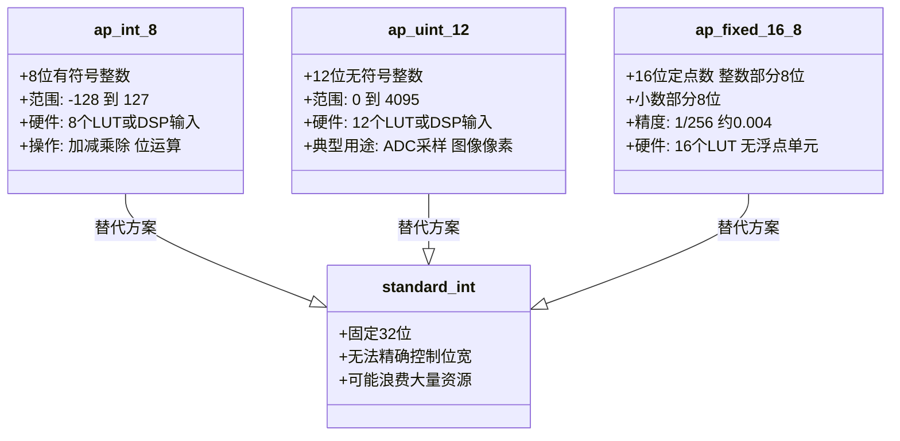

---

## 3.5 模式三：定点数——在精度和资源之间找到甜蜜点

### 3.5.1 浮点数的"奢侈税"

浮点数（`float`/`double`）在软件里用起来很方便，但在 FPGA 上，它们就像是"奢侈品"——一个单精度浮点乘法器需要消耗大量 LUT 和 DSP 资源，延迟也比整数运算高得多。

想象你要建一座桥：
- **浮点数** = 用钢铁建造，坚固无比，但造价昂贵、工期长
- **定点数** = 用预制混凝土建造，足够坚固，造价低廉、工期短

对于大多数信号处理应用，定点数完全够用，而且资源消耗只有浮点数的几分之一。

### 3.5.2 `ap_fixed` 的格式解读

`ap_fixed<W, I>` 中：
- `W` = 总位宽（Width）
- `I` = 整数部分位宽（Integer bits）
- 小数部分位宽 = `W - I`

$$\text{ap\_fixed}<16, 8> \Rightarrow \underbrace{8\text{ 位整数}}_{\text{范围: -128 到 127}}.\underbrace{8\text{ 位小数}}_{\text{精度: } 1/256 \approx 0.004}$$

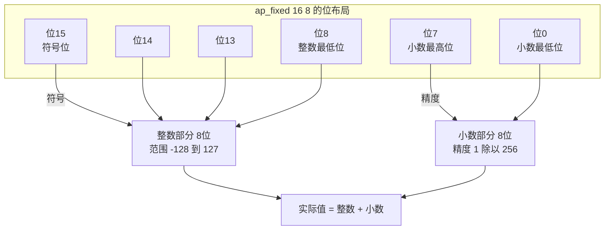

### 3.5.3 `using_fixed_point` 示例解析

```cpp
#include "ap_fixed.h"

typedef ap_fixed<16, 8>  fixed_t;   // 16位总宽，8位整数部分
typedef ap_fixed<32, 16> result_t;  // 32位总宽，16位整数部分（防止乘法溢出）

result_t cpp_ap_fixed(fixed_t in_val) {
    // 定点数运算：HLS 自动处理小数点对齐
    result_t result = in_val * in_val;  // 平方运算
    return result;
}
```

对应的配置文件关键部分：

```ini
[hls]
clock=4
syn.top=cpp_ap_fixed
# 为输入输出指定寄存器接口（AXI-Lite 控制）
syn.directive.interface=cpp_ap_fixed in_val register
syn.directive.interface=cpp_ap_fixed return register
# 启用函数级流水线
syn.directive.pipeline=cpp_ap_fixed
```

### 3.5.4 定点数 vs. 浮点数：资源对比

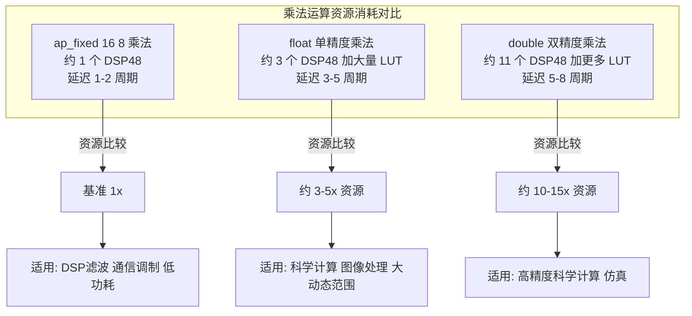

> **经验法则**：如果你的算法能接受 0.1% 的精度损失，用定点数替代浮点数，通常可以节省 3-10 倍的硬件资源，同时提高 2-3 倍的时钟频率。

### 3.5.5 `fixed_point_sqrt`：定点函数的实现技巧

开方运算（`sqrt`）在浮点数中有专用硬件单元，但在定点数中需要用迭代算法实现。`fixed_point_sqrt` 示例展示了如何用 HLS 实现高效的定点开方：

```cpp
#include "ap_fixed.h"

typedef ap_fixed<16, 8, AP_RND, AP_SAT> fxp_t;  // 带舍入和饱和的定点数

fxp_t fxp_sqrt_top(fxp_t in_val) {
    #pragma HLS PIPELINE  // 启用流水线
    
    // 使用 HLS 内置的定点开方函数
    return hls::sqrt(in_val);
}
```

注意 `ap_fixed<16, 8, AP_RND, AP_SAT>` 中的两个额外参数：
- `AP_RND`：舍入模式（Round），避免截断误差累积
- `AP_SAT`：饱和模式（Saturate），防止溢出时出现"绕回"错误

---

## 3.6 模式四：C++ 模板——编译期参数化的硬件工厂

### 3.6.1 模板在硬件中的魔力

在软件里，C++ 模板是"代码复用"的工具——写一次，用于多种类型。在硬件里，模板有更深刻的意义：**模板参数在编译期确定，HLS 为每个不同的参数组合生成专门的硬件电路**。

想象一个工厂的模具：
- 软件模板 = 一个通用模具，运行时根据参数调整
- 硬件模板 = 为每种参数**铸造一个专用模具**，零运行时开销

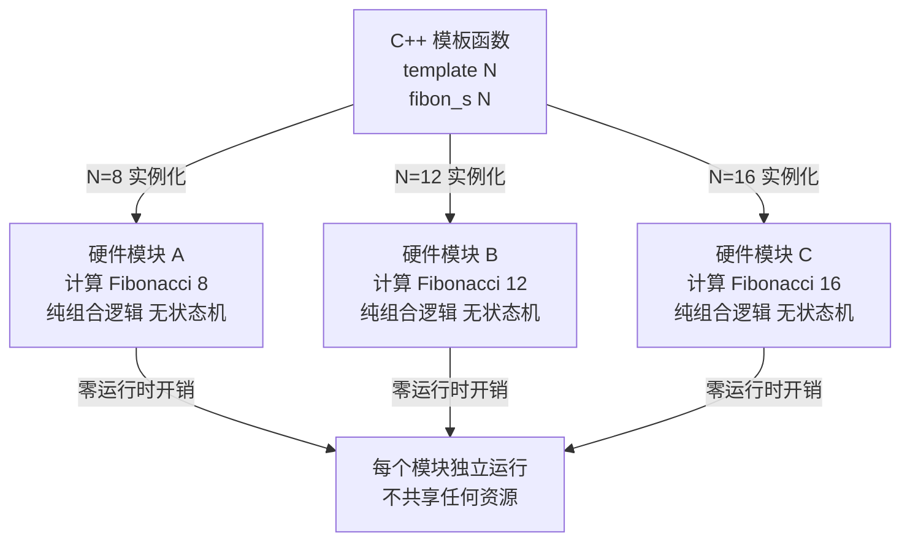

### 3.6.2 `using_C++_templates` 示例：递归模板展开

这个示例用模板元编程实现斐波那契数列计算，展示了 HLS 如何将递归模板**完全展开为纯组合逻辑**：

```cpp
#include "cpp_template.h"

// 通用模板：递归展开
template<int N>
struct fibon_s {
    static data_t fibon_f(data_t a, data_t b) {
        return fibon_s<N-1>::fibon_f(b, a + b);
    }
};

// 模板特化：递归终止条件
template<>
struct fibon_s<1> {
    static data_t fibon_f(data_t a, data_t b) {
        return b;  // 基础情况
    }
};

// 顶层函数：实例化模板
data_t cpp_template(data_t a, data_t b) {
    return fibon_s<FIB_N>::fibon_f(a, b);
}
```

当 `FIB_N = 8` 时，HLS 在编译期将递归完全展开，生成一条**纯组合逻辑链**：

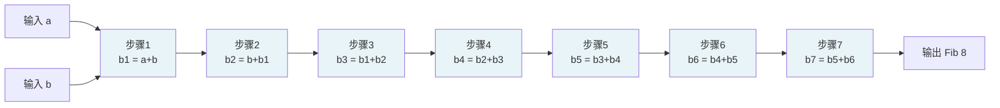

这条组合逻辑链没有任何寄存器、没有状态机、没有时钟控制——**输入进来，输出立刻出去**（在一个时钟周期内完成）。这就是"零运行时开销"的含义。

### 3.6.3 `using_C++_templates_for_multiple_instances`：一套代码，多套硬件

更强大的用法是用同一套模板代码，通过不同的配置文件，生成多个参数不同的硬件实例：

```cpp
// 同一个模板源文件
template<int W, int I>
ap_fixed<W*2, I*2> parameterized_multiply(
    ap_fixed<W, I> a, 
    ap_fixed<W, I> b
) {
    return a * b;
}
```

```ini
# 配置文件 A：生成 16 位版本
syn.top=multiply_16bit
# 配置文件 B：生成 32 位版本  
syn.top=multiply_32bit
```

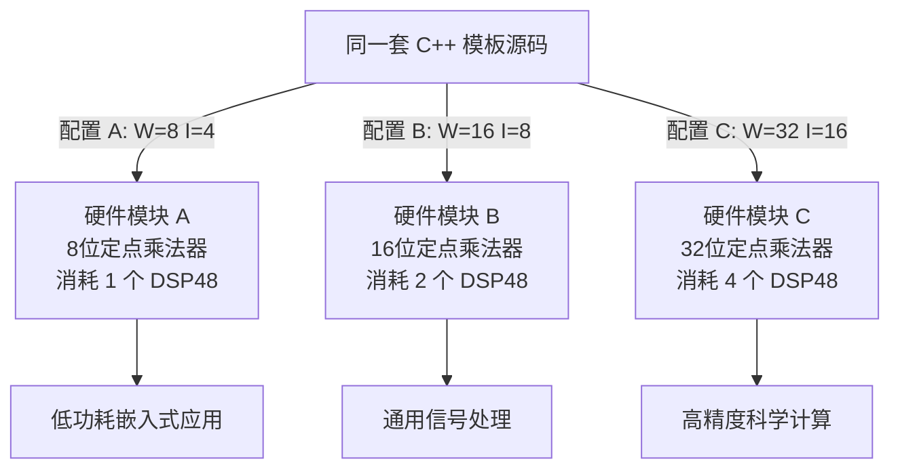

> **关键洞察**：C++ 模板在 HLS 中不是"运行时多态"，而是"编译期硬件工厂"。每个模板实例化都生成一个独立的、专用的硬件模块，彼此之间不共享任何资源。

---

## 3.7 模式五：数组 Stencil——硬件中的滑动窗口

### 3.7.1 什么是 Stencil 计算？

Stencil（模板）计算是一种常见的计算模式：对数组中的每个元素，用它和它的邻居元素做某种运算，产生输出。图像滤波、有限差分法、卷积神经网络都是 Stencil 计算的例子。

想象你在用一个放大镜扫描一张照片：放大镜每次覆盖 3×3 个像素，对这 9 个像素做加权平均，产生一个输出像素，然后移动到下一个位置。这就是 2D Stencil。

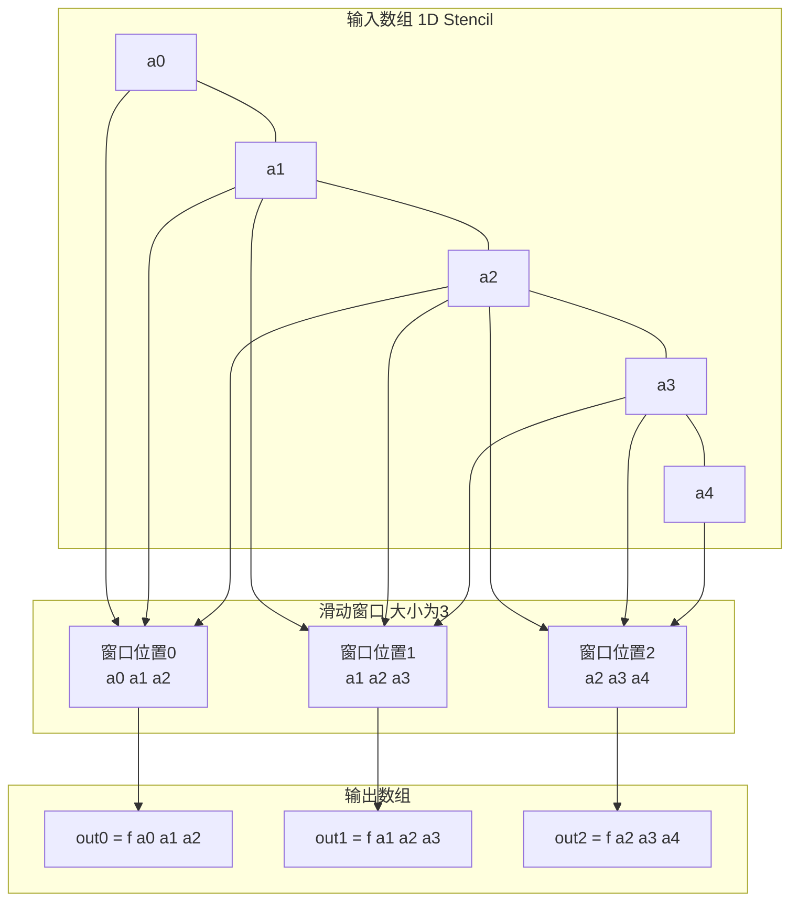

### 3.7.2 `using_array_stencil_1d` 示例

```cpp
#define N 8
#define KERNEL_SIZE 3

void array_stencil_1d(int in[N], int out[N - KERNEL_SIZE + 1]) {
    // 窗口缓冲：用移位寄存器保存当前窗口
    int window[KERNEL_SIZE];
    #pragma HLS ARRAY_PARTITION variable=window complete  // 完全分区，支持并行访问
    
    // 初始化窗口
    for (int i = 0; i < KERNEL_SIZE - 1; i++) {
        window[i] = in[i];
    }
    
    // 滑动窗口计算
    STENCIL_LOOP: for (int i = 0; i < N - KERNEL_SIZE + 1; i++) {
        #pragma HLS PIPELINE II=1  // 每个时钟周期处理一个输出
        
        // 移入新元素
        window[KERNEL_SIZE - 1] = in[i + KERNEL_SIZE - 1];
        
        // 计算输出（简单求和）
        int sum = 0;
        for (int k = 0; k < KERNEL_SIZE; k++) {
            sum += window[k];
        }
        out[i] = sum;
        
        // 移位窗口
        for (int k = 0; k < KERNEL_SIZE - 1; k++) {
            window[k] = window[k + 1];
        }
    }
}
```

### 3.7.3 为什么需要 `ARRAY_PARTITION`？

这是 Stencil 计算中最关键的优化。想象一个 BRAM（块 RAM）就像一个只有一个窗口的银行柜台——每次只能服务一个客户。如果你的 Stencil 需要同时访问 3 个元素，但 BRAM 每次只能给你一个，你就必须等 3 个时钟周期，流水线 II 变成 3。

`ARRAY_PARTITION` 就是把这个银行柜台**拆分成 3 个独立的柜台**，每个柜台服务一个客户，同时完成，II 降回 1。

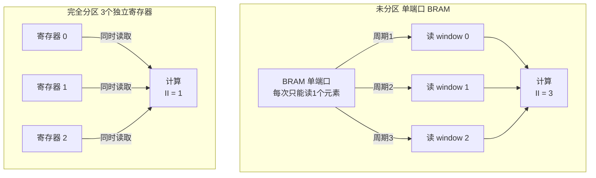

---

## 3.8 模式六：变量边界循环——告诉 HLS 最坏情况

### 3.8.1 固定边界 vs. 变量边界

HLS 工具在调度循环时，需要知道循环会执行多少次（Trip Count）。固定边界循环（`for (int i = 0; i < 1024; i++)`）让 HLS 可以精确计算资源需求和时序。

变量边界循环（`for (int i = 0; i < n; i++)`）就像告诉建筑师"这栋楼要能住 n 个人，但 n 我还不确定"——建筑师只能按最坏情况设计，可能导致资源过度分配。

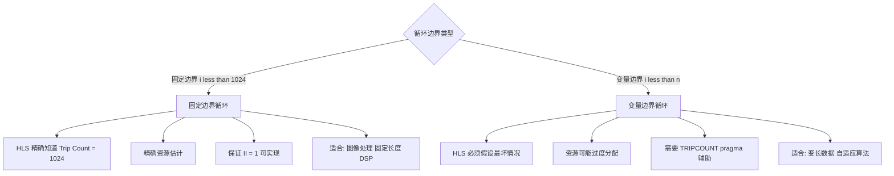

### 3.8.2 `variable_bound_loops` 示例

```cpp
void variable_bound_loops(int *in, int *out, int n) {
    // 告诉 HLS 循环的最小/最大/平均 trip count
    // 这不影响功能，只影响性能报告的准确性
    #pragma HLS LOOP_TRIPCOUNT min=1 max=1024 avg=512
    
    LOOP_X: for (int i = 0; i < n; i++) {
        #pragma HLS PIPELINE II=1
        out[i] = in[i] * 2;
    }
}
```

对应的配置文件：

```ini
[hls]
syn.directive.unroll=loop_var/LOOP_X
# 即使循环边界是变量，也尝试展开 LOOP_X
# HLS 会使用最大可能 trip count 进行资源分配
```

> **重要提示**：`LOOP_TRIPCOUNT` pragma 只影响**性能报告**中的估算数字，不影响实际生成的硬件逻辑。它就像告诉 GPS 导航"我通常以 60 公里/小时行驶"——导航会给你更准确的到达时间估计，但不会改变路线。

---

## 3.9 模式七：`hls_config.cfg` 的三段式结构

### 3.9.1 配置文件是硬件的"蓝图"

每个示例的 `hls_config.cfg` 都遵循三段式结构，就像建筑图纸分为"总平面图、平面图、详图"三个层次：

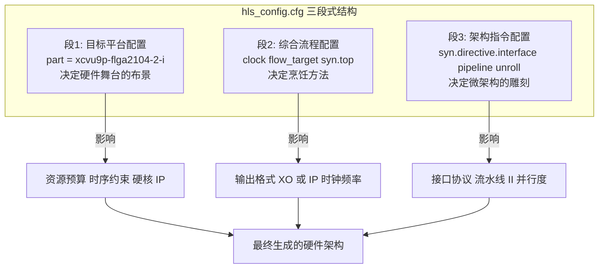

### 3.9.2 关键指令速查表

| 指令 | 作用 | 典型用法 | 硬件影响 |
|------|------|----------|----------|
| `syn.directive.interface` | 定义端口协议 | `mode=m_axi depth=1024` | 生成 AXI 总线逻辑 |
| `syn.directive.pipeline` | 启用流水线 | `fxp_sqrt_top` | 降低 II，提高吞吐量 |
| `syn.directive.unroll` | 展开循环 | `LOOP_X factor=4` | 复制硬件，提高并行度 |
| `syn.directive.array_partition` | 分区数组 | `type=complete` | 增加访问端口数 |

### 3.9.3 `flow_target` 的选择：Vitis vs. Vivado

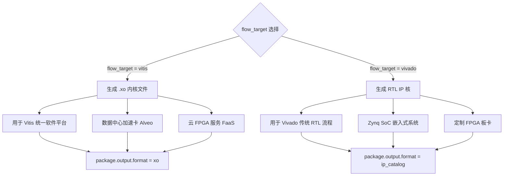

---

## 3.10 从 C++ 到比特流：完整的数据流旅程

现在让我们把所有模式串联起来，看一个完整的示例（`using_fixed_point`）从源代码到硬件的全过程：

```mermaid
flowchart TD
    DEV[开发者编写<br/>C++ 算法 + hls_config.cfg]
    
    DEV --> CSIM[C 仿真<br/>在 CPU 上验证算法正确性<br/>速度: 秒级]
    CSIM -->|功能正确| SYN[HLS 综合<br/>C++ 转换为 RTL 硬件描述]
    CSIM -->|功能错误| DEV
    
    SYN --> RPT[综合报告<br/>资源估计 LUT FF DSP BRAM<br/>性能估计 II 延迟 频率]
    RPT -->|满足要求| COSIM[C/RTL 协同仿真<br/>验证 RTL 行为与 C 模型一致<br/>速度: 分钟到小时级]
    RPT -->|不满足要求| OPT[优化迭代<br/>调整 hls_config.cfg 指令<br/>修改 C++ 编码风格]
    OPT --> SYN
    
    COSIM -->|验证通过| EXPORT[导出内核<br/>Vitis: .xo 文件<br/>Vivado: IP Catalog]
    COSIM -->|验证失败| DEV
    
    EXPORT --> IMPL[Vivado 实现<br/>布局布线 生成比特流]
    IMPL --> FPGA[部署到 FPGA<br/>运行硬件加速器]
    
    style DEV fill:#fff3cd
    style CSIM fill:#d4edda
    style SYN fill:#cce5ff
    style COSIM fill:#d4edda
    style EXPORT fill:#f8d7da
    style FPGA fill:#d1ecf1
```

这个流程图展示了 HLS 开发的迭代本质：**写代码 → 仿真验证 → 综合 → 检查报告 → 优化 → 再综合**，直到满足所有要求。

---

## 3.11 常见陷阱与最佳实践

### 3.11.1 五大常见陷阱

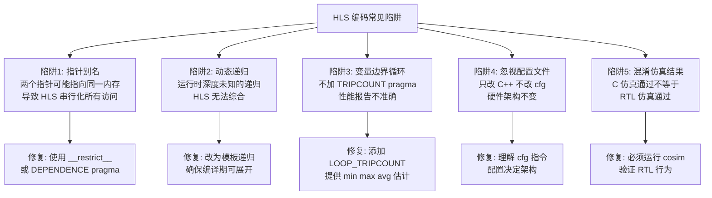

### 3.11.2 编码风格对比：好 vs. 差

**指针使用**：
```cpp
// 差：可能有别名，HLS 保守串行化
void bad(int *a, int *b) { *b = *a + 1; }

// 好：明确无别名，HLS 可以流水线化
void good(int * __restrict__ a, int * __restrict__ b) { *b = *a + 1; }
```

**循环边界**：
```cpp
// 差：变量边界，HLS 无法精确调度
for (int i = 0; i < n; i++) { ... }

// 好：固定边界，HLS 精确调度
for (int i = 0; i < 1024; i++) { ... }

// 可接受：变量边界 + TRIPCOUNT 提示
#pragma HLS LOOP_TRIPCOUNT min=1 max=1024
for (int i = 0; i < n; i++) { ... }
```

**数据类型**：
```cpp
// 差：32位 int，浪费资源
int pixel = 128;

// 好：精确位宽，节省资源
ap_uint<8> pixel = 128;

// 差：double 浮点，资源消耗巨大
double coeff = 0.5;

// 好：定点数，资源节省 10 倍
ap_fixed<16, 8> coeff = 0.5;
```

---

## 3.12 本章总结：软件到硬件的编码心法

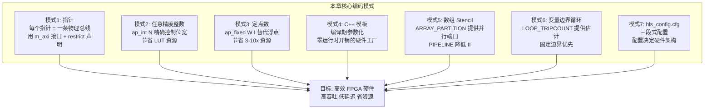

本章介绍了七种核心编码模式，每种模式都对应一个从"软件直觉"到"硬件现实"的思维转变：

1. **指针** → 不是内存地址，而是物理总线；用 `m_axi` 接口和 `__restrict__` 声明
2. **任意精度整数** → 用 `ap_int<N>` 精确控制位宽，避免资源浪费
3. **定点数** → 用 `ap_fixed<W,I>` 替代浮点数，节省 3-10 倍资源
4. **C++ 模板** → 编译期硬件工厂，每个实例化生成独立的专用电路
5. **数组 Stencil** → 用 `ARRAY_PARTITION` 提供并行访问端口，用 `PIPELINE` 降低 II
6. **变量边界循环** → 用 `LOOP_TRIPCOUNT` 提供估计，优先使用固定边界
7. **配置文件** → 三段式结构，配置决定硬件架构，与算法代码分离

---

## 3.13 下一步：接口设计

掌握了这些核心编码模式之后，你的 FPGA 内核已经能够正确地描述计算逻辑了。但还有一个关键问题没有解决：**数据怎么进出这个内核？**

下一章《连接你的内核到世界：接口设计》将深入探讨 HLS 如何将 C/C++ 函数参数映射到物理 FPGA 协议（AXI4-Full、AXI4-Stream、AXI4-Lite），以及为什么选错接口会彻底毁掉你精心优化的算法性能。

---

*本章示例均来自 `coding_modeling` 目录，建议在本地安装 Vitis HLS 后，亲手综合这些示例，观察综合报告中资源和性能数字的变化——这是建立硬件直觉最有效的方式。*