# 第六章：在工具链变迁中生存——HLS 流程迁移指南

> **本章学习目标**：理解同一个 HLS 设计如何用 TCL 脚本、INI 配置文件或 Python 驱动流程来表达，以及如何在不重写所有代码的前提下，把现有项目迁移到 Vitis Unified 平台。

---

## 6.1 为什么迁移是个大问题？

想象你是一位厨师，花了五年时间用一套老式燃气灶做菜，积累了几百份食谱。突然，餐厅换成了最新的电磁炉——火力调节方式变了，锅具要求变了，但菜单上的菜还是那些菜。

你面临的选择是：把所有食谱从头重写？还是找到一种方法，让老食谱在新灶台上也能用？

HLS 工具链的迁移就是这个处境。Xilinx（现在的 AMD）推出 Vitis Unified 平台后，原来的 Vivado HLS 流程（用 TCL 脚本驱动）需要迁移到新的流程（用 INI 配置文件或 Python API 驱动）。算法本身没变，但"告诉工具怎么编译"的语言变了。

`libraries_migration` 模块就是那本"食谱翻译词典"——它用同一个算法（`pointer_basic`），展示了三种不同的"烹饪方式"，让你能对照着把旧食谱翻译成新格式。

---

## 6.2 三条迁移路径总览

在深入细节之前，先看一张全局地图：

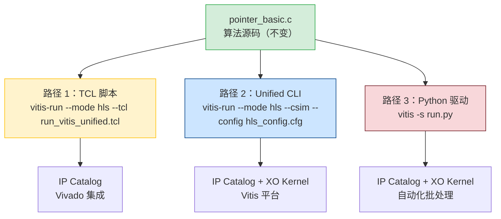

**图解**：三条路径共享同一份 C 源码（绿色），只是"驱动工具编译"的方式不同。TCL 路径（黄色）最接近旧流程；Unified CLI 路径（蓝色）是新的标准方式；Python 路径（红色）适合自动化场景。

---

## 6.3 理解"方言"的本质：过程式 vs 声明式

在学习具体语法之前，先理解两种根本不同的思维方式。

**过程式（TCL 的方式）**：就像给新员工写操作手册——"第一步打开项目，第二步添加文件，第三步设置时钟，第四步运行仿真……"每一步都明确写出来，按顺序执行。

**声明式（INI 的方式）**：就像填写一张表格——"项目名称：xxx，时钟：4ns，顶层函数：pointer_basic，需要运行：仿真+综合"。你描述的是"这个项目是什么样的"，而不是"怎么一步步做"。

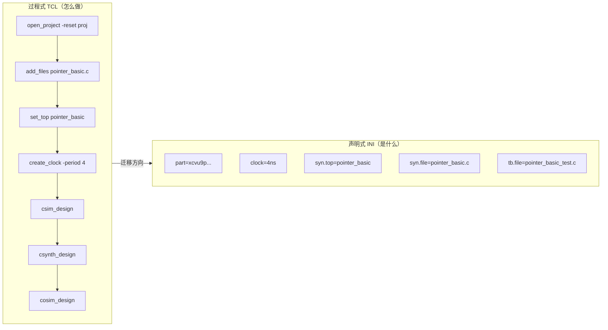

**图解**：TCL 是一个命令序列（从上到下执行），INI 是一组属性声明（没有顺序）。迁移的核心工作就是把"命令序列"翻译成"属性声明"。

---

## 6.4 路径一：TCL 脚本流程（传统路径）

### 6.4.1 旧版 TCL vs 新版 TCL：只差两个命令

好消息是：如果你已经有了 Vivado HLS 的 TCL 脚本，迁移到 Vitis Unified 的 TCL 流程**只需要改两个命令**。

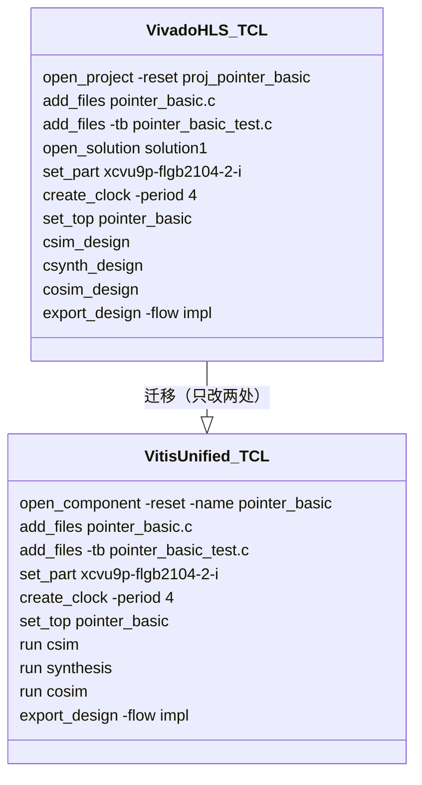

**两处关键变化**：

| 旧命令 | 新命令 | 为什么要改 |
|--------|--------|-----------|
| `open_project` | `open_component` | "Project"是 Vivado HLS 的概念；"Component"是 Vitis 平台的统一概念，可以复用于 HLS、AI Engine 等多种设计类型 |
| `open_solution` | （不再需要） | Vitis Unified 把 solution 的概念合并进了 component，简化了层级 |

想象一下：原来你的工作单位叫"项目组"，现在改叫"组件团队"——工作内容没变，只是名称和组织方式稍微调整了。

### 6.4.2 `hls_exec` 变量：精细控制执行阶段

TCL 脚本里有一个聪明的设计——用一个变量控制"跑到哪一步停下来"：

```tcl
# 设置这个数字来控制执行深度：
# 0 = 只跑 C 仿真
# 1 = C 仿真 + 综合
# 2 = C 仿真 + 综合 + 联合仿真
# 3 = 全部（包括导出 IP）
set hls_exec 1

# ... 添加文件、设置参数 ...

csim_design
if {$hls_exec >= 1} {
    csynth_design
}
if {$hls_exec >= 2} {
    cosim_design
}
if {$hls_exec >= 3} {
    export_design -flow impl
}
```

这就像汽车的档位——你可以选择只挂一档（只做仿真），或者一路挂到四档（完整流程）。调试时只需改一个数字，不用注释掉大段代码。

---

## 6.5 路径二：Unified CLI 流程（现代路径）

### 6.5.1 `hls_config.cfg` 文件解剖

这是 Vitis Unified 平台的核心配置文件，格式是标准的 INI（就像 Windows 的 `.ini` 文件，或者 Python 的 `setup.cfg`）。

```ini
# vitis_unified_cli/hls_config.cfg

[hls]
# 目标 FPGA 器件
part=xcvu9p-flgb2104-2-i

# 时钟约束（4纳秒 = 250MHz）
clock=4ns

# 流程目标：vivado（传统 IP）或 vitis（XO 内核）
flow_target=vivado

# 顶层函数名（必须与 C 代码中的函数名完全一致）
syn.top=pointer_basic

# 综合源文件（相对路径）
syn.file=../pointer_basic.c

# 测试平台文件
tb.file=../pointer_basic_test.c
tb.file=../result.golden.dat

# 优化指令（等价于 TCL 中的 set_directive_interface）
syn.directive.interface=pointer_basic mode=m_axi depth=1 d
```

每一行都是"这个项目有什么属性"，没有执行顺序的概念。

### 6.5.2 三条命令行：分阶段执行

有了配置文件，执行各个阶段的命令变得非常规整：

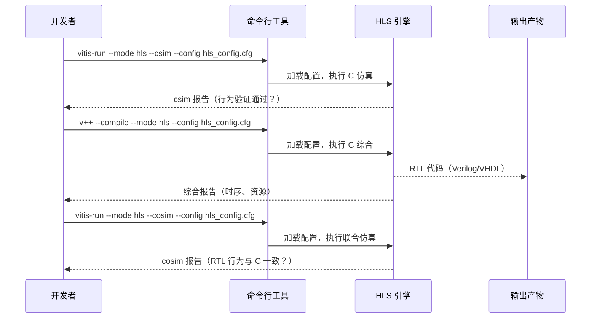

**图解**：三条命令对应三个阶段。注意综合用的是 `v++`（Vitis 编译器），而仿真用的是 `vitis-run`。这个区别很重要——`v++` 是 Vitis 平台的统一编译入口，未来还可以用它编译主机代码和链接整个系统。

### 6.5.3 TCL 指令到 INI 指令的对照表

这是迁移时最常用的"翻译词典"：

| TCL 命令 | INI 等价写法 | 说明 |
|----------|-------------|------|
| `set_part {xcvu9p-flgb2104-2-i}` | `part=xcvu9p-flgb2104-2-i` | 去掉花括号 |
| `create_clock -period 4` | `clock=4ns` | 单位变显式（ns），更清晰 |
| `set_top pointer_basic` | `syn.top=pointer_basic` | 加了命名空间前缀 `syn.` |
| `add_files pointer_basic.c` | `syn.file=pointer_basic.c` | 同上 |
| `add_files -tb pointer_basic_test.c` | `tb.file=pointer_basic_test.c` | `-tb` 变成了 `tb.` 前缀 |
| `set_directive_interface -mode m_axi pointer_basic d` | `syn.directive.interface=pointer_basic mode=m_axi depth=1 d` | 最复杂的翻译，见下文 |

**指令翻译的细节**：`set_directive_interface` 这条命令是最难翻译的，因为它有多个参数。INI 格式用空格分隔参数，约定如下：

```
syn.directive.interface=<函数名> mode=<接口模式> depth=<深度> <端口名>
```

这就像把一句话从"请把第三个抽屉里的红色文件夹拿出来"翻译成表格格式：`位置=第三个抽屉 颜色=红色 类型=文件夹 动作=取出`。

---

## 6.6 路径三：Python 驱动流程（自动化路径）

### 6.6.1 为什么需要 Python？

INI 配置文件很简洁，但它是静态的——你没法在里面写"如果仿真通过了再综合"，也没法写"对 10 种不同的时钟频率各跑一次综合"。

Python 就是那个"让配置文件动起来"的胶水层。想象 INI 文件是一张表格，Python 是那个会读表格、做决策、然后按需填写新表格的助手。

### 6.6.2 两种 Python 使用方式

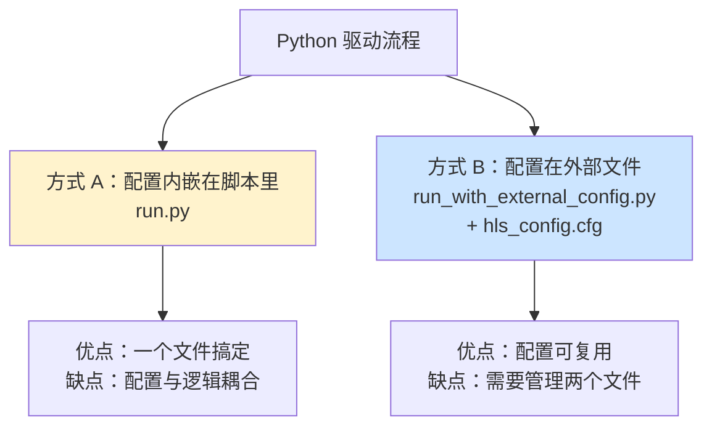

**方式 A：配置内嵌**（适合小项目或一次性脚本）

```python
# python_scripts/run.py（简化示意）
import vitis

# 创建客户端连接
client = vitis.create_client()
client.set_workspace("./workspace")

# 创建 HLS 组件（等价于 open_component）
comp = client.create_component(name="pointer_basic")

# 配置（等价于 hls_config.cfg 的内容）
comp.set_part("xcvu9p-flgb2104-2-i")
comp.set_clock("4ns")
comp.add_files(["../pointer_basic.c"])
comp.add_files(["../pointer_basic_test.c"], type="tb")
comp.set_top("pointer_basic")

# 执行各阶段
comp.run("C_SIMULATION")
comp.run("SYNTHESIS")
comp.run("CO_SIMULATION")
comp.run("EXPORT")

vitis.dispose()
```

**方式 B：外部配置文件**（适合团队协作和 CI/CD）

```python
# python_scripts/run_with_external_config.py（简化示意）
import vitis

client = vitis.create_client()
client.set_workspace("./workspace")

# 直接加载外部配置文件
comp = client.create_component(
    name="pointer_basic",
    cfg_file="./hls_config.cfg"  # 复用 INI 配置
)

# 执行（配置已经在文件里了）
comp.run("C_SIMULATION")
comp.run("SYNTHESIS")

vitis.dispose()
```

### 6.6.3 Python 的真正威力：参数扫描

Python 驱动流程最大的价值不是"替代 TCL"，而是**让批量自动化成为可能**。

想象你需要找到最优的时钟频率——不太快（时序违例）也不太慢（性能不够）。用 Python，你可以这样做：

```python
# 参数扫描示例（伪代码，展示思路）
import vitis

clock_periods = ["3ns", "4ns", "5ns", "6ns"]
results = []

for period in clock_periods:
    client = vitis.create_client()
    comp = client.create_component(name=f"pointer_basic_{period}")
    comp.set_part("xcvu9p-flgb2104-2-i")
    comp.set_clock(period)
    comp.add_files(["../pointer_basic.c"])
    comp.set_top("pointer_basic")
    
    comp.run("SYNTHESIS")
    
    # 读取综合报告，记录资源和时序
    report = comp.get_synthesis_report()
    results.append({
        "clock": period,
        "lut": report.lut_count,
        "timing_met": report.timing_met
    })
    
    vitis.dispose()

# 找到时序满足且资源最少的配置
best = min(
    [r for r in results if r["timing_met"]],
    key=lambda r: r["lut"]
)
print(f"最优配置：时钟 {best['clock']}，LUT 使用 {best['lut']}")
```

这就像让一个助手帮你同时试做四道菜，然后告诉你哪道最好——而不是你自己一道道试。

---

## 6.7 三条路径的完整对比

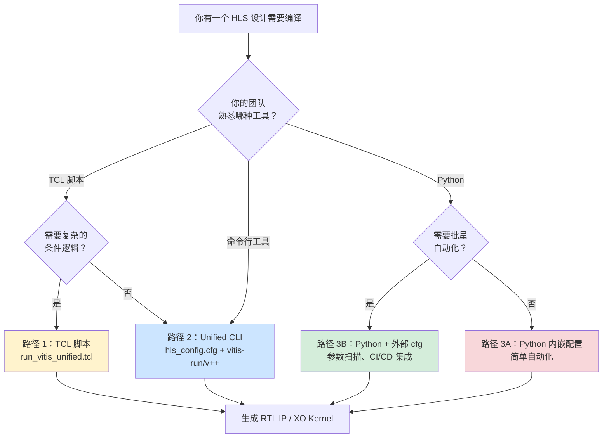

**图解**：选择哪条路径取决于你的团队背景和需求。没有绝对的"最好"，只有"最适合当前场景"。

| 维度 | TCL 脚本 | Unified CLI | Python 驱动 |
|------|----------|-------------|-------------|
| **学习曲线** | 低（如果已会 TCL） | 低（命令行即可） | 中（需要 Python） |
| **灵活性** | 高（可写任意逻辑） | 低（静态配置） | 高（可编程） |
| **可读性** | 中 | 高 | 高 |
| **CI/CD 集成** | 中 | 高 | 最高 |
| **批量自动化** | 中 | 低 | 最高 |
| **版本控制友好** | 中 | 高 | 高 |

---

## 6.8 深入案例：`pointer_basic` 的三种写法

让我们用同一个算法，完整对比三种写法的差异。`pointer_basic` 是一个简单的指针操作函数：

```c
// pointer_basic.c（三种流程共用，一字不改）
void pointer_basic(volatile int* d, volatile int* q) {
    int val = *d;  // 从内存读一个值
    *q = val;      // 写到另一个内存地址
}
```

这个函数就是"真理的源头"——无论用哪种流程，C 代码本身完全不变。

### 写法对比：设置 AXI 接口指令

这是三种流程中最能体现差异的地方——如何告诉 HLS 工具"把指针 `d` 和 `q` 映射到 AXI4-Full 接口"：

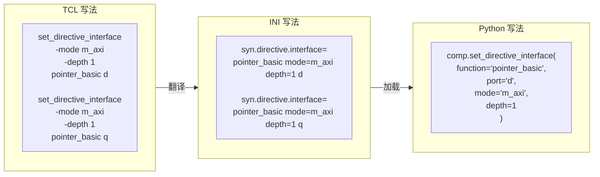

**图解**：三种写法表达的是完全相同的意思——把 `pointer_basic` 函数的 `d` 端口设置为 AXI4-Full 接口，深度为 1。只是语法不同。

---

## 6.9 超越基础：复杂 IP 的迁移挑战

### 6.9.1 FFT 库：数组接口 vs 流式接口

`libraries_migration` 模块还包含了 FFT（快速傅里叶变换）的示例，展示了同一个算法的两种接口设计。这是一个很好的例子，说明迁移不只是"改语法"，有时还需要重新思考接口设计。

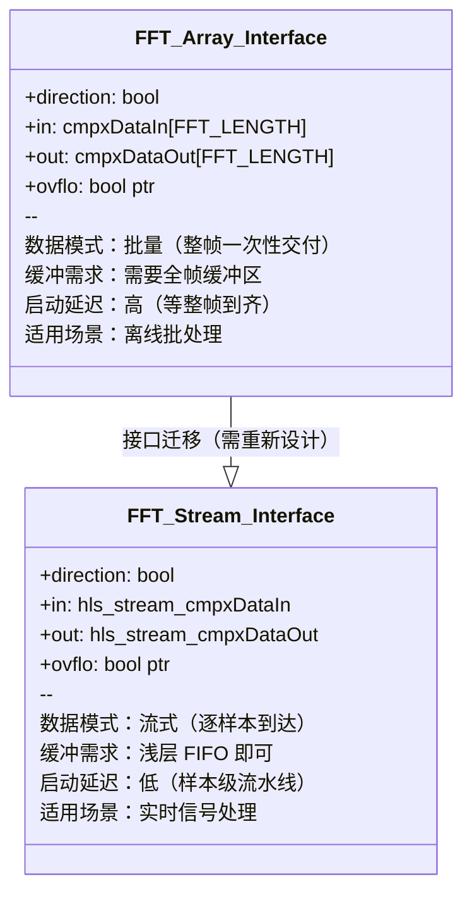

**关键洞察**：从数组接口迁移到流式接口，不只是改几行代码——它意味着整个数据流模型的转变。就像从"一次性送一整箱货"改成"用传送带一件件送"，效率提升了，但仓库管理方式也要跟着变。

### 6.9.2 DSP 内置库：高频设计的配置差异

DSP 示例（FIR 滤波器）展示了高频设计的特殊配置需求：

```ini
# DSP 示例的 hls_config.cfg（关键差异部分）
[hls]
# 注意：目标器件换成了 Versal Premium
part=xcvp1702-vsva2197-2MP-e-S

# 时钟更激进：800MHz（1.25纳秒）
clock=1.25ns

# 禁用代码分析器以加速编译迭代
csim.code_analyzer=0
```

`csim.code_analyzer=0` 这个选项值得特别解释。代码分析器就像一个"安全检查员"，在 C 仿真前检查潜在的数组越界、空指针等问题。对于 DSP 内核这类**边界条件已经手工验证过**的设计，可以关掉这个检查员来加快编译速度。这是一个典型的"信任换速度"的权衡。

---

## 6.10 两个特殊案例：硬件的边界

### 6.10.1 `malloc_removed`：动态内存在硬件里为什么不行

这是一个很多软件工程师第一次接触 HLS 时会踩的坑。

想象 FPGA 的内存就像一栋楼的房间——在楼建好（比特流加载）的那一刻，每个房间的大小和位置就固定了，不能在楼建好之后再加盖或拆除。

而 `malloc` 就是"在楼建好之后动态加盖房间"——在 FPGA 上根本做不到。

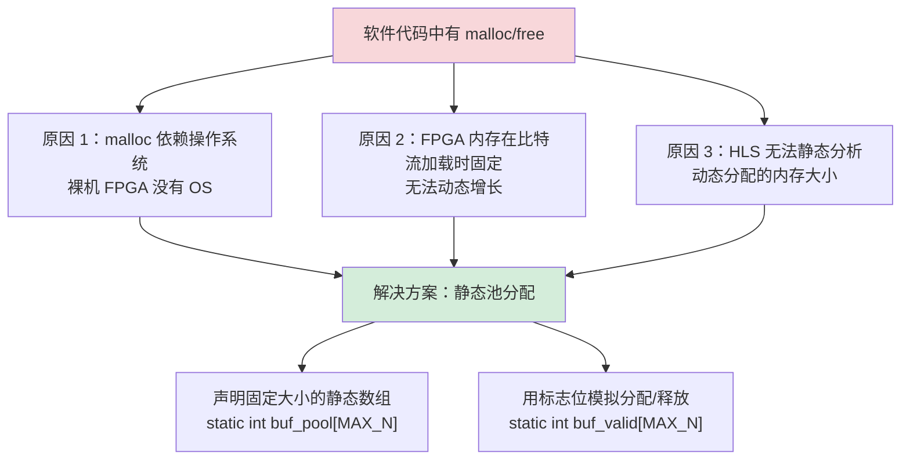

**迁移策略**：把所有 `malloc(N * sizeof(T))` 改成 `static T buf[MAX_N]`，用一个 `valid[]` 数组追踪哪些槽位被占用。这就像把"按需租房"改成"提前买好一排房子，用标签记录哪间有人住"。

### 6.10.2 `rtl_as_blackbox`：当 HLS 生成的代码不够好

有时候，某个关键模块已经被手工优化到极致的 Verilog/VHDL 代码，HLS 生成的 RTL 无论如何都达不到同样的性能。这时候，你需要"黑盒"机制。

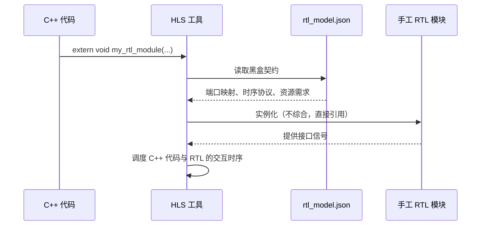

**图解**：黑盒机制就像在 C++ 代码里"预留一个插槽"，告诉 HLS 工具："这个函数的实现不在 C 代码里，去找那个 Verilog 文件。" `rtl_model.json` 是连接两个世界的"适配器说明书"，描述了 C 函数参数如何对应到 RTL 端口信号。

---

## 6.11 迁移实战：避开常见陷阱

### 陷阱一：函数名大小写不匹配

这是最常见的迁移错误，症状是 HLS 报告"Top function not found"。

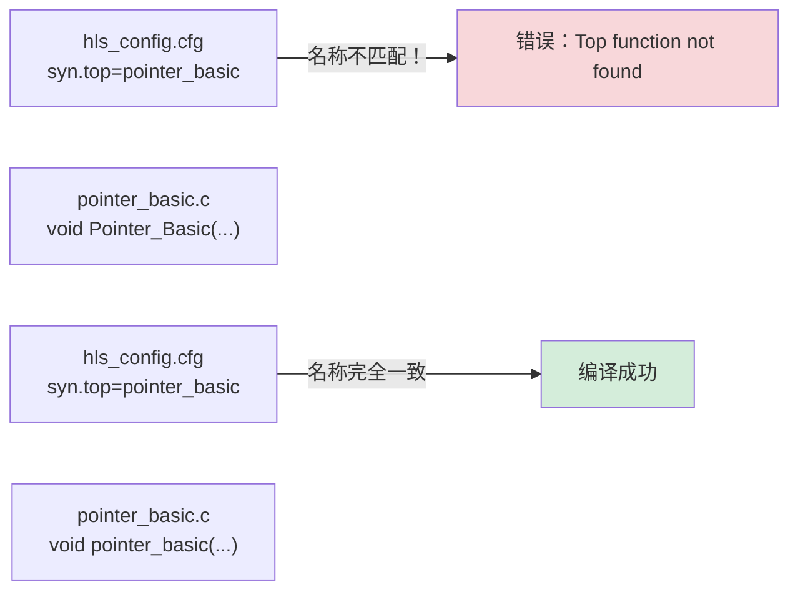

**修复**：确保 `syn.top` 的值与 C 代码中的函数名**完全一致**，包括大小写。建议在 C 代码里用全小写+下划线的命名风格，避免混淆。

### 陷阱二：AXI 接口 `depth` 过小导致死锁

`depth=1` 意味着接口同时只能处理一个未完成的事务。如果你的设计尝试在收到响应之前发出新请求，就会永远等待——就像一个只有一个窗口的银行，前一个客户没办完就不让下一个进来，但前一个客户又在等你给他开门。

**修复**：把 `depth` 增加到 16 或更大，或者重构代码确保请求和响应严格配对。

### 陷阱三：流式 FIFO 深度不足

`hls::stream` 默认的 FIFO 深度可能只有 2，如果上游生产速度比下游消费速度快，FIFO 很快就满了，整个流水线就会停顿。

**修复**：

```cpp
// 在 C++ 代码中显式指定 FIFO 深度
#pragma HLS stream variable=my_stream depth=16
```

或者在 INI 配置中：

```ini
syn.directive.stream=my_stream depth=16
```

### 最佳实践清单

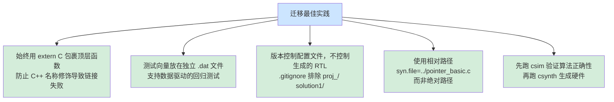

---

## 6.12 完整迁移流程：从旧项目到新平台

把所有内容串起来，这是一个完整的迁移工作流：

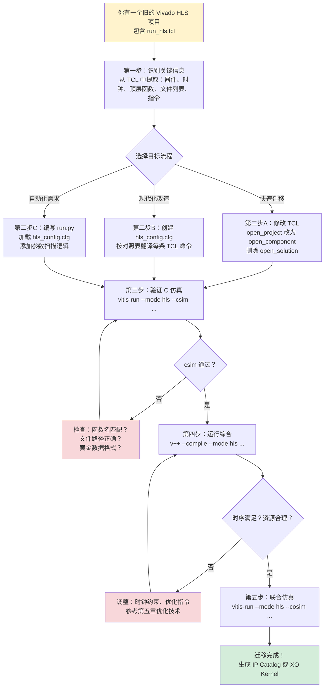

**图解**：迁移不是一次性的跳跃，而是一个有验证节点的渐进过程。每个阶段都有检查点——如果 csim 失败，先修配置再继续；如果时序不满足，先优化再导出。

---

## 6.13 章节总结：你现在掌握了什么

恭喜你读完了这本入门指南的最后一章！让我们回顾一下本章的核心收获：

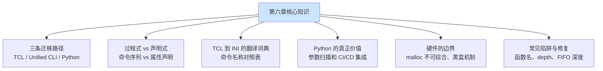

**最重要的一个洞察**：无论工具链怎么变，**算法的 C/C++ 源码是不变的**。TCL、INI、Python——这些都只是"告诉工具怎么编译"的不同语言。掌握了这个本质，任何工具链的变化都不再令人恐惧。

---

## 6.14 全书回顾：你的 HLS 学习地图

走过六章，你已经建立了一套完整的 HLS 思维框架：


从"什么是 HLS"到"如何迁移工具链"，你已经走完了一个 HLS 开发者的完整成长路径。接下来，最好的学习方式就是：**打开 `libraries_migration` 目录，选一个示例，亲手跑一遍三种流程**。

代码不会说谎，工具不会骗人——动手是最好的老师。

---

*本章对应代码：`libraries_migration/` 目录*  
*官方迁移文档：[Migrating-from-Vitis-HLS-to-the-Vitis-Unified-IDE](https://docs.amd.com/r/en-US/ug1399-vitis-hls/Migrating-from-Vitis-HLS-to-the-Vitis-Unified-IDE)*  
*TCL 到 INI 完整对照表：[Tcl-to-Config-File-Command-Map](https://docs.amd.com/r/en-US/ug1399-vitis-hls/Tcl-to-Config-File-Command-Map)*