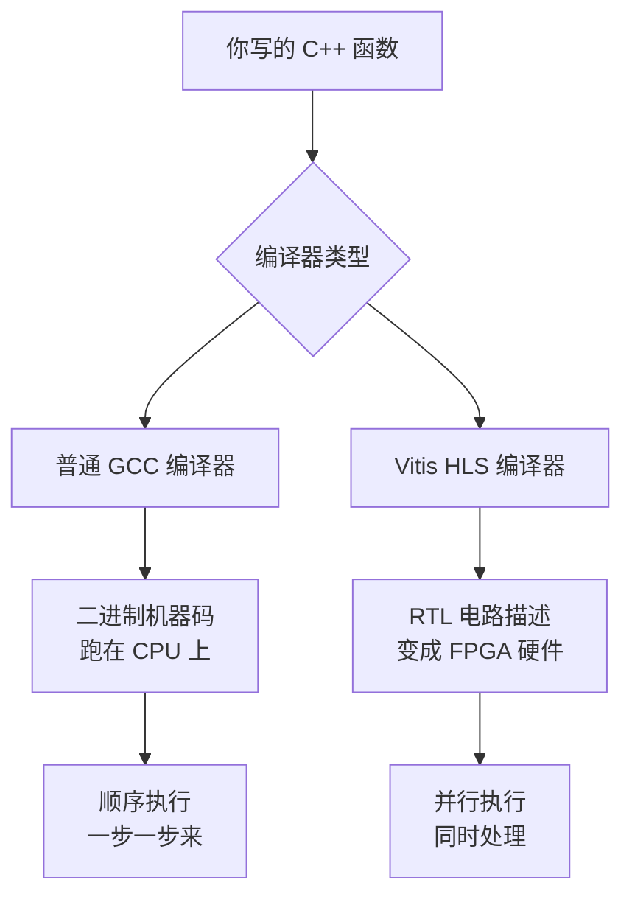
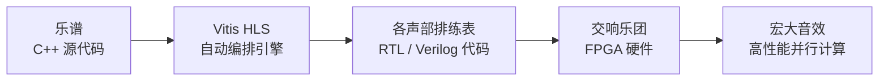
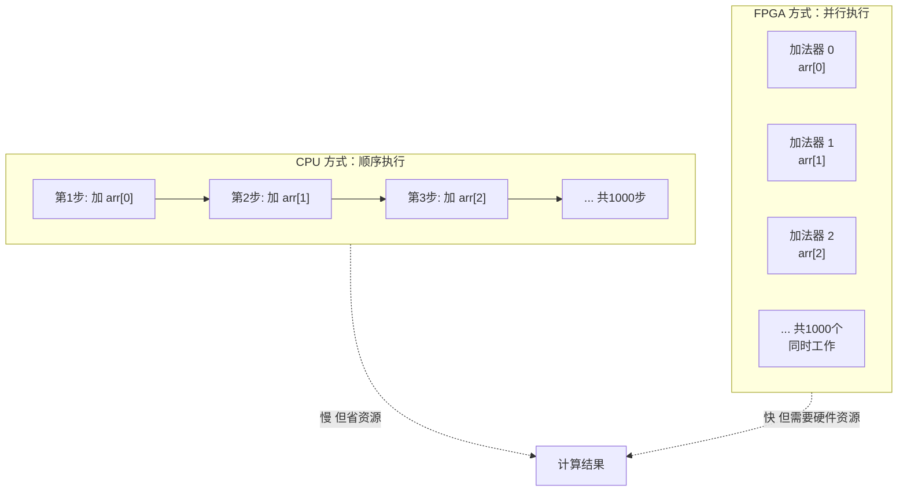
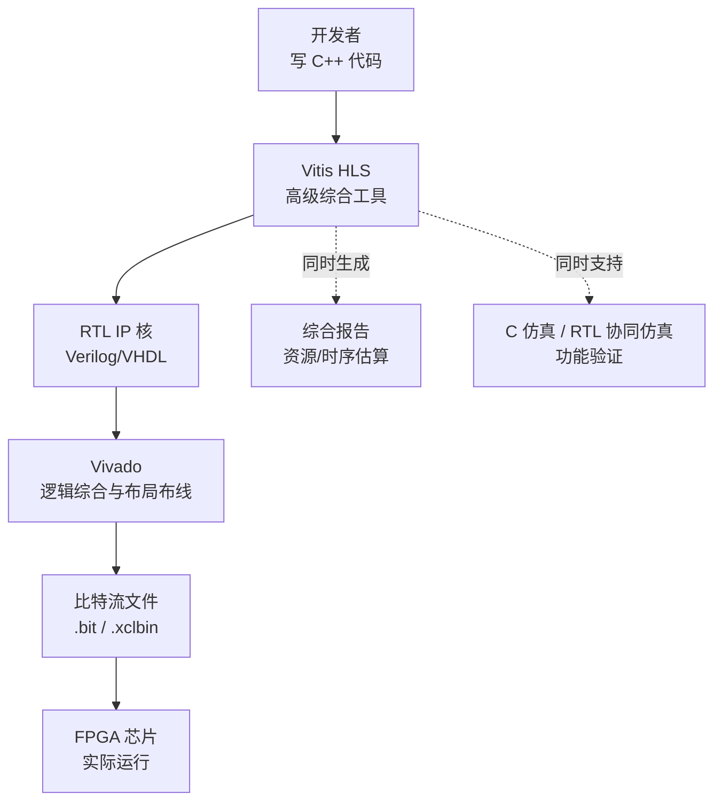
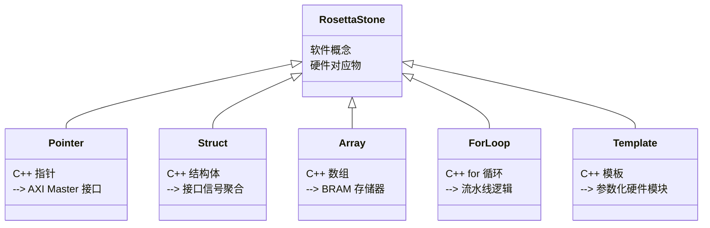
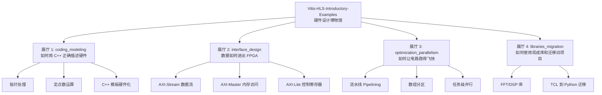
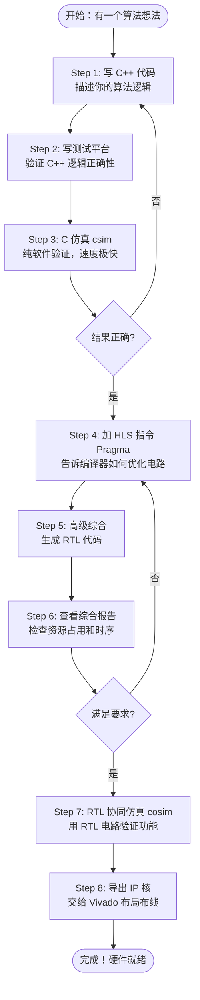
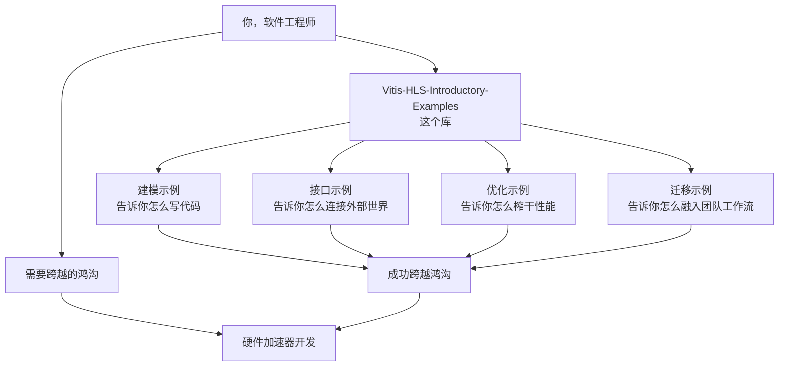

# 第一章：什么是 Vitis HLS？它为什么存在？

> **本章学习目标**：理解什么是高级综合（High-Level Synthesis），它为什么对 FPGA 开发至关重要，以及这个示例库如何充当"罗塞塔石碑"，帮助你把软件思维翻译成硬件逻辑。

---

## 1.1 从一个问题开始：为什么 FPGA 这么难用？

想象你是一位经验丰富的厨师，已经能用 Python、C++ 这些"现代厨具"做出各种美食。现在有人告诉你："我们有一口能同时炒一百道菜的神奇大锅（FPGA），但你必须用这套古老的象形文字菜谱（RTL/Verilog/VHDL）来操控它。"

这就是传统 FPGA 开发的困境。FPGA（Field-Programmable Gate Array，现场可编程门阵列）是一种可以被重新"编程"成任意电路的芯片。它的并行计算能力极其强大——不像 CPU 那样一次只能做一件事，FPGA 可以让成千上万个逻辑单元**同时**工作。但代价是：你必须用描述"电路连线"的语言（如 Verilog 或 VHDL）来编程，就像要你用电路图而不是代码来写程序一样。

**Vitis HLS 的出现，就是为了打破这道墙。**

---

## 1.2 什么是高级综合（HLS）？

HLS（High-Level Synthesis，高级综合）是一种**自动翻译技术**。它能把你用 C/C++ 写的算法，自动"翻译"成描述硬件电路的 RTL 代码（如 Verilog）。

你可以把它理解为一个**超级编译器**：

- 普通编译器：C++ 代码 → 机器码（在 CPU 上运行）
- HLS 编译器：C++ 代码 → 电路描述（在 FPGA 上运行）

上图展示了两条路线的本质区别：同样一份 C++ 代码，经过普通编译器就变成在 CPU 上顺序执行的程序；经过 Vitis HLS 编译器，它就变成了在 FPGA 芯片上可以并行运转的物理电路。这就是 HLS 的魔力所在。

---

## 1.3 一个让你秒懂的类比：乐谱 vs. 乐队排练表

想象你是一位作曲家，写了一段音乐乐谱（C++ 代码）。

- **CPU 的执行方式**：就像一个人独自演奏所有乐器，先拉小提琴，再吹长笛，再敲鼓。速度受限于"一个人同时只能演奏一种乐器"。
- **FPGA 的执行方式**：就像一支完整的交响乐团，小提琴手、长笛手、鼓手**同时演奏**，产生宏大的音效。

**HLS 做的事情**：就是把你的乐谱（C++ 代码），自动生成一份"乐队排练表"，告诉每个乐手（硬件逻辑单元）应该在什么时候演奏什么音符。你不需要手动给每个乐手写排练表（手写 Verilog），HLS 帮你自动完成这件事。

从乐谱到宏大音效，中间的关键角色就是 Vitis HLS。它让你只需专注于"写什么音乐"（算法逻辑），而不必操心"怎么分配乐手"（电路布线）。

---

## 1.4 FPGA 到底好在哪里？

在我们深入 HLS 之前，先理解 FPGA 为什么值得这么折腾。

FPGA 的核心优势是**可重构的并行性**。举个例子：如果你要对一个 1000 个元素的数组每个元素做加法，CPU 需要循环 1000 次，一次加一个；而 FPGA 可以同时实例化 1000 个加法器，**一个时钟周期内全部完成**。

当然，FPGA 也有局限：它的时钟频率比 CPU 低得多（通常 200-500 MHz，而 CPU 可以到 4 GHz），编程难度更高，开发周期更长。但对于**固定算法的高吞吐量计算**（图像处理、网络包处理、AI 推理、金融风控），FPGA 的并行优势往往压倒一切。

---

## 1.5 Vitis HLS 是什么？它的位置在哪里？

Vitis HLS 是 AMD（Xilinx）公司出品的高级综合工具，是整个 Vitis 开发平台中负责"C++ 到硬件"翻译的核心组件。

你可以把整个 Vitis 平台想象成一个**汽车工厂的生产线**：

- **Vitis HLS**：设计图纸转换器（C++ → RTL）
- **Vivado**：电路板工厂（RTL → 芯片配置文件）
- **Vitis Platform**：整车组装线（硬件 + 软件 → 完整系统）

这条流水线中，Vitis HLS 是最前端、对软件工程师最友好的环节。它把程序员熟悉的 C++ 世界和硬件工程师的 RTL 世界连接起来。

---

## 1.6 这个示例库是什么？它是你的"罗塞塔石碑"

现在说回我们的主角：`Vitis-HLS-Introductory-Examples` 这个代码库。

1799 年，拿破仑的军队在埃及罗塞塔发现了一块石碑，上面同一段文字用三种语言写成（古埃及象形文字、世俗体文字、古希腊文）。正是这块石碑，让学者们终于能"翻译"出失传千年的古埃及文。

这个示例库扮演的角色完全一样：**它用 C++ 和硬件概念两种"语言"同时表达同一件事**，帮助你在软件思维和硬件思维之间建立翻译词典。

上图展示了这个"翻译词典"的核心内容：每一个你熟悉的 C++ 概念，在硬件世界里都有对应的物理实体。这个库里的每个例子，都是在教你做这种翻译。

---

## 1.7 库的四大区域：像一座分区明确的博物馆

这个库被组织成四个功能区，就像一座博物馆的四个展厅，每个展厅聚焦于一个主题：

**展厅 1 — coding_modeling（建模展厅）**：这是你的第一站。它解决"怎么写 C++ 代码才能被正确翻译成硬件"的问题。就像学书法，你不能随便拿笔乱写，笔法要符合规范。

**展厅 2 — interface_design（接口展厅）**：数据必须通过特定的"插口"才能进入 FPGA。这个展厅告诉你有哪些插口（AXI 协议族），每种插口适合什么场景，以及如何在 C++ 代码里声明它们。

**展厅 3 — optimization_parallelism（性能展厅）**：硬件能跑多快，取决于你怎么优化电路结构。这个展厅展示了各种让电路提速的技巧——就像赛车调校一样。

**展厅 4 — libraries_migration（工具展厅）**：如何使用现成的 FFT、DSP 库，以及如何把老旧的项目迁移到新版工具链。

---

## 1.8 HLS 开发流程：一次完整的旅程

了解了这些概念，让我们看看一个完整的 HLS 开发流程是什么样的：

这个流程和软件开发有很多相似之处——写代码、测试、调优、发布。最大的不同在于第 4 步：你需要通过 HLS 专用的"指令"（Pragma）来指导编译器生成更好的电路。这些指令是 HLS 独有的语言，本指南的后续章节将深入讲解它们。

---

## 1.9 关键概念速查：五个你必须知道的词

在深入这个库之前，有五个术语你必须心中有数。把它们想象成五个你将在整趟旅程中反复遇到的"路标"：

| 术语 | 生活类比 | 一句话解释 |
|------|----------|------------|
| **内核（Kernel）** | 一台专门的机器 | 在 FPGA 上运行的一个功能单元，由一个 C++ 顶层函数定义 |
| **RTL** | 电路图 | 描述硬件电路连接关系的低级语言（如 Verilog），是 HLS 的输出 |
| **AXI** | 数据高速公路的规格标准 | FPGA 内部和外部数据传输的标准接口协议族 |
| **流水线（Pipeline）** | 工厂流水线 | 让硬件能同时处理多个数据的不同阶段，提升吞吐量 |
| **Pragma（HLS 指令）** | 给编译器的便利贴 | 嵌入 C++ 代码中的特殊注释，指导 HLS 如何优化电路结构 |

---

## 1.10 为什么选择这个示例库作为学习起点？

市面上有不少 FPGA 和 HLS 的学习资源，但这个库有其独特价值：

**它是官方级别的真实案例集**。每个例子都对应一个具体的工程问题，不是玩具代码，而是可以直接参考到生产项目中的设计模式。

**它覆盖了从入门到进阶的完整知识图谱**。从最基础的"如何写一个 HLS 内核"，到进阶的"如何在多个函数之间实现任务级并行"，层层递进。

**它同时展示了多种工具链风格**。有些例子用 TCL 脚本驱动，有些用 INI 配置文件，有些用 Python 脚本——这意味着无论你的团队使用哪种工作流，都能找到对应的参考。

这张图说明了本指南的使命：以这个库为桥梁，帮助你从软件工程师的思维方式，平稳过渡到能够设计高效硬件加速器的状态。

---

## 1.11 本章小结：你现在知道了什么

读完本章，你应该已经建立起以下认知框架：

- **FPGA** 是一种可以被"塑造"成任意电路的可编程芯片，其核心优势是大规模并行计算能力。
- **HLS（高级综合）** 是一种把 C/C++ 代码自动翻译成硬件电路的技术，大幅降低了 FPGA 开发门槛。
- **Vitis HLS** 是 AMD 提供的 HLS 工具，是整个 Vitis 硬件开发平台的前端。
- **这个示例库**是你的"罗塞塔石碑"，它用具体的代码例子展示了如何在软件概念和硬件实现之间进行翻译。
- 库分为四个展厅：**编码建模、接口设计、优化并行、库与迁移**，覆盖 HLS 开发的完整知识版图。

---

## 下一步：进入博物馆参观

现在你知道了这座博物馆是做什么的，是时候推开大门，走进去看看了。**第二章**将带你了解这个库的完整目录结构，帮你建立一张"导览地图"，让你在几百个例子中快速找到自己需要的那一个。

> **动手试试**：在继续阅读之前，可以先克隆这个仓库，随便打开一个 `coding_modeling` 下的子目录，看看里面有哪些文件（`.cpp`、`.h`、`run_hls.tcl` 或 `config.cfg`）。不需要理解里面的代码，只是感受一下每个例子的"体积"——你会发现它们都非常小巧，这正是这个库设计精髓所在：每个例子只教一件事。