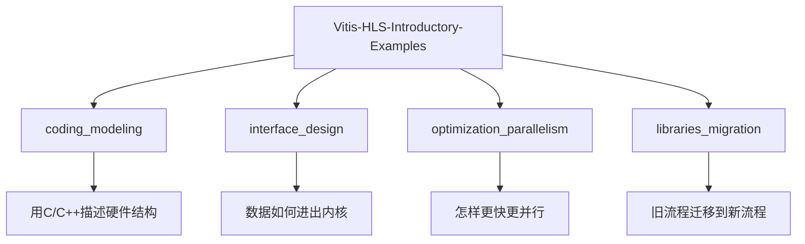
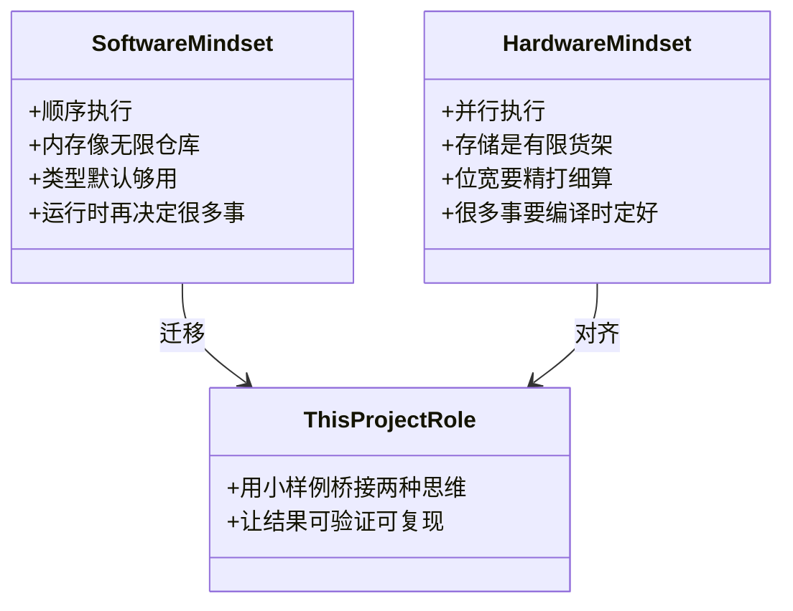
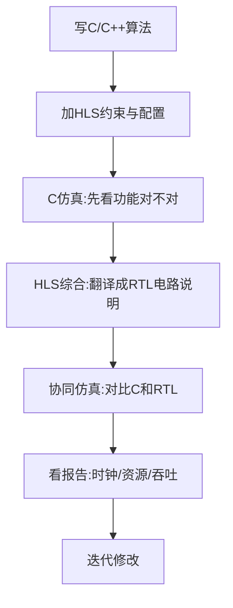
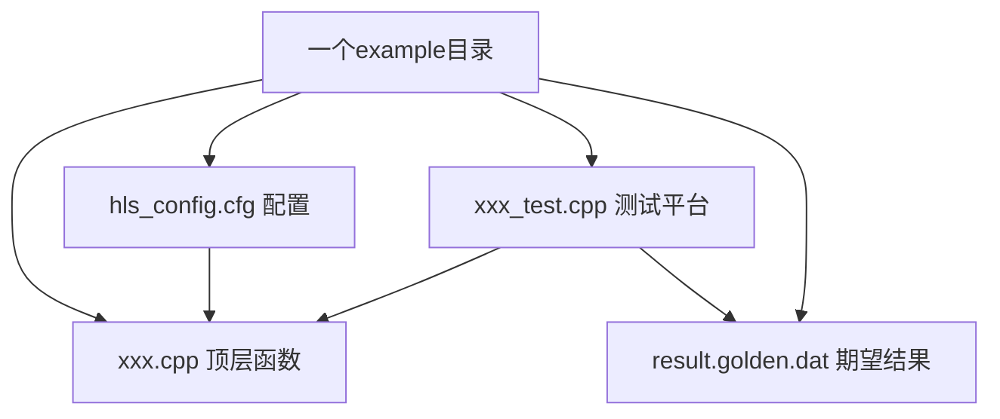
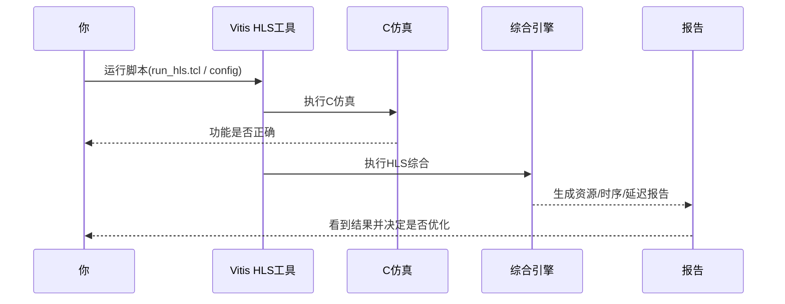
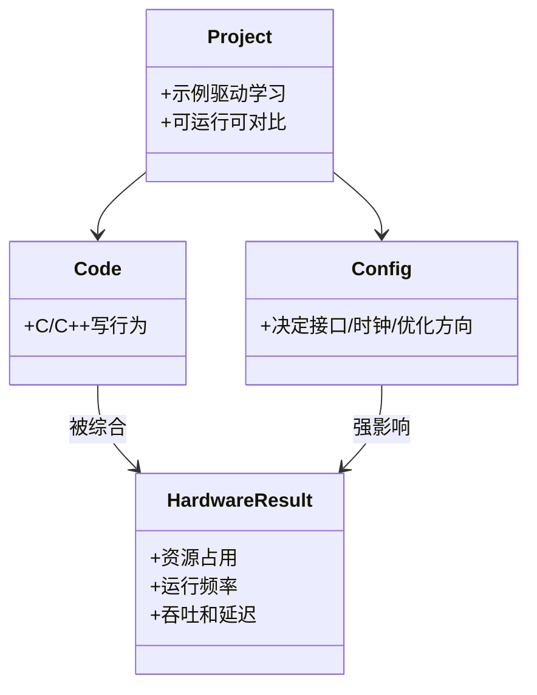

# 第 1 章：这个项目是什么，为什么它存在

## 先用一句人话说清楚

`Vitis-HLS-Introductory-Examples` 是一个“示例仓库（example repository，意思是装了很多可运行小样例的代码库）”，它专门教你：**怎么把 C/C++ 软件代码，变成 FPGA 上能跑的硬件电路**。

想象一下，它像“驾校练车场”，不是让你直接上高速，而是先在一个个标准科目里学会起步、转弯、倒车。这里的每个 example 就是一节“科目训练”。

---

## 1) 这个项目到底是什么

**Vitis HLS**（High-Level Synthesis，高层次综合）可以理解成“翻译器”：把你写的 C/C++，翻译成硬件描述代码（RTL，寄存器传输级代码，也就是电路连接说明书）。

**FPGA**（现场可编程门阵列）可以理解成“可反复改装的芯片乐高板”：你不是在上面装 App，而是在上面“搭电路”。

这个图可以这样看：整个仓库像一个“前端全家桶教程”，但这里教的不是 React/Vue，而是硬件设计。  
本章聚焦 `coding_modeling`，因为它是“地基层”——先学会怎么写“可综合（synthesizable，能被翻译成电路）”的 C/C++。

---

## 2) 为什么会有这个项目：它在填一条“思维鸿沟”

很多同学会写 C++，但一到 FPGA 就卡住。原因不是语法，而是思维方式不同。

想象一下：写普通软件像“点外卖”——你只关心菜到了没；写 FPGA 像“自己开后厨”——你要关心灶台数量、火候、并行工位。

这个图表达的是：项目不是“再讲一遍 C++”，而是帮你从“程序员直觉”过渡到“硬件工程直觉”。  
你可以把它类比成 `Express.js` 的官方 examples：不是讲 Node 基础，而是讲“在真实场景里该怎么写”。

---

## 3) 核心心智模型：这是一座“代码到电路”的桥

你可以把每个 example 想成一个“最小实验单元”：改一点代码或配置，然后观察硬件结果怎么变。

这条流程很像机器学习同学熟悉的循环：  
“写模型 -> 训练 -> 看指标 -> 调参 -> 再训练”。  
这里只是换成了：  
“写代码 -> 综合 -> 看时序/资源 -> 调代码和指令 -> 再综合”。

---

## 4) 每个 example 的基本结构（你会反复看到）

在 `coding_modeling` 里，一个示例通常是三件套：  
1) 算法代码，2) 配置文件，3) 测试代码（加黄金结果）。

把它想成“烘焙配方”最容易懂：  
- `xxx.cpp` 是菜谱步骤；  
- `hls_config.cfg` 是烤箱温度和模式；  
- `xxx_test.cpp` 是试吃流程；  
- `golden.dat` 是“标准口味”。

同一道菜（同一算法）在不同温度（不同配置）下，成品会非常不同——这就是 HLS 的关键学习点。

---

## 5) 你第一次跑 example 时，系统里发生了什么

你可以把这段交互想成 CI 流水线（比如 GitHub Actions）：  
提交后自动跑检查，再给你报告。  
区别是这里检查的不只是“能不能跑”，还检查“电路贵不贵、快不快、能不能达到目标时钟”。

---

## 6) 本章最重要的结论（先建立这个脑图）

这张图就是你接下来 6 章都要反复用的“总地图”：  
**硬件结果 = 代码写法 + 配置策略**。  
不是只看算法对不对，还要看“生成的电路形状好不好”。

---

## 本章小结

想象你刚拿到一套乐高机械组。  
这个仓库不是直接给你“成品城堡”，而是给你一盒盒“标准拼法”。  
你会从 `coding_modeling` 开始，先学会每一块怎么拼，之后再去学接口、并行优化、迁移流程。

下一章我们就做一件事：**把这个仓库的目录结构看成一张“学习地图”**，知道先走哪条路最稳。