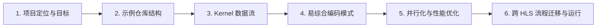

# Vitis-HLS-Introductory-Examples 新手导读

欢迎来到这份面向初学者的路线图！如果你是软件工程师、FPGA 初学者，或刚开始接触 Vitis HLS 的同学，这份指南会很适合你。它不会假设你一开始就懂硬件实现细节，而是从“怎么理解这些示例”出发，帮你建立从 C/C++ 代码到可综合硬件设计的直觉。

读完这套章节后，你会知道：这个示例仓库为什么存在、目录应该怎么读、数据在 HLS kernel 里怎么流动、哪些代码模式更容易综合出稳定硬件，以及如何通过并行化与 pragma 提升性能。最后你还会掌握如何在不同 HLS 流程间迁移与复用示例，减少工具链切换成本。

## 章节导航

1. **[What this project is and why it exists](guide-beginners-guide-what-this-project-is-and-why-it-exists.md)**  
   先建立全局心智模型：这些示例不是零散代码片段，而是连接软件思维与 FPGA 硬件设计模式的“桥梁”。读完后你会更清楚“为什么要这样学”。

2. **[How the example collection is structured](guide-beginners-guide-how-the-example-collection-is-structured.md)**  
   了解仓库组织方式：示例以相对独立的 kernel 风格组织，并按建模、接口和性能优化主题分组。这样你可以快速定位自己当前最需要的示例。

3. **[How data moves through an HLS kernel](guide-beginners-guide-how-data-moves-through-an-hls-kernel.md)**  
   搞清楚 host、内存、stream、控制寄存器之间的数据路径。你会看到接口选择如何直接影响功能正确性与吞吐表现。

4. **[Coding patterns that synthesize well](guide-beginners-guide-coding-patterns-that-synthesize-well.md)**  
   聚焦“写得出、也综合得好”的 C/C++ 模式：类型、循环、指针、模板等如何映射成可预测硬件结构。适合用来建立稳定编码习惯。

5. **[Extracting parallelism and performance](guide-beginners-guide-extracting-parallelism-and-performance.md)**  
   深入理解 pragma 与代码结构如何驱动 pipeline、unroll、dataflow 和存储并行。这是从“能跑”走向“跑得快”的关键一章。

6. **[Migrating and running across HLS flows](guide-beginners-guide-migrating-and-running-across-hls-flows.md)**  
   学会在 TCL、CFG 和更新的统一流程之间表达等价设计。帮助你在现代工具链中复用旧示例，减少重写工作量。