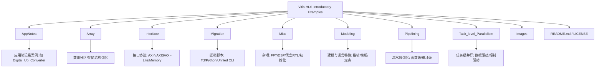
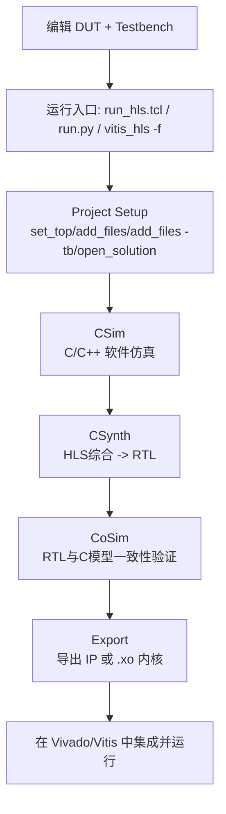
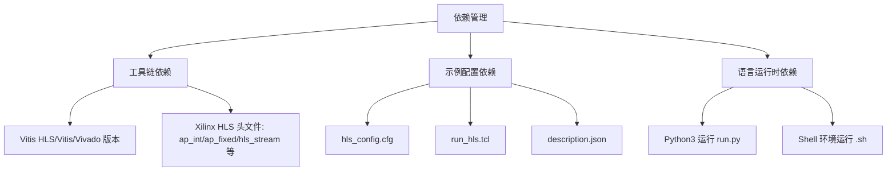
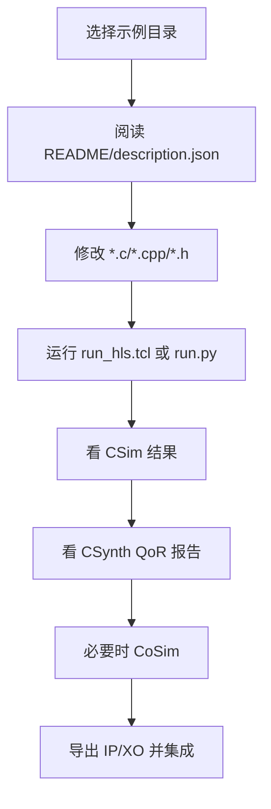

# Vitis-HLS-Introductory-Examples：Build & Code Organization 分析

> 面向：想快速理解“怎么构建、代码怎么组织、依赖怎么管”的开发者。  
> 结论先行：这是一个**按示例目录自治**的 Vitis HLS 教学仓库，而不是单一可执行程序工程；构建入口主要是 `run_hls.tcl` / `run.py` / `run_vitis_commandline.sh`，而不是顶层 Make/CMake。

---

## 1) 项目目录结构（Project Directory Structure）

该仓库以“主题 -> 示例”分层，每个示例基本自带最小构建脚本与测试文件（`*_test.c/cpp`）。



### 结构职责总结
- **示例目录是最小构建单元**：通常包含  
  - DUT 源码：`*.c` / `*.cpp` / `*.h`  
  - Testbench：`*_test.c` / `*_test.cpp`  
  - 构建脚本：`run_hls.tcl`（核心）、有些有 `run.py` 或 `.sh`  
  - 配置文件：`hls_config.cfg`、`description.json`
- 顶层没有统一的 `CMakeLists.txt` / `Makefile`：意味着**不走传统 C/C++ 工程构建**，而走 HLS 工具流。

---

## 2) 构建/编译流水线（Build / Compilation Pipeline）

### 2.1 标准 HLS 路径（从源码到可运行/可集成产物）



### 2.2 关于 Make/CMake（按你的 C/C++ 构建检查要求）
仓库中没有给出统一 `Makefile` / `CMakeLists.txt`（至少在提供的目录清单中未出现）。因此：

- **目标（targets）**：由 Tcl 中的流程命令隐式定义（`csim_design`、`csynth_design`、`cosim_design`、`export_design`）
- **编译选项**：通常在 `hls_config.cfg`、Tcl 脚本参数、或工具默认配置中定义
- **链接依赖**：CSim 阶段主要链接 testbench + DUT；RTL 阶段由 HLS 自动处理
- **跨平台**：
  - `run.py`：跨平台更好（Windows/Linux）
  - `run_vitis_commandline.sh`：偏 Linux/WSL
  - Tcl (`vitis_hls -f run_hls.tcl`)：最通用（取决于工具安装）

### 2.3 头文件/源文件组织与 C++ 模板编译模型
- 常见组织：`xxx.h`（接口/类型/模板声明） + `xxx.cpp`（实现） + `xxx_test.cpp`
- 模板示例（如 `using_C++_templates`）通常把模板定义放在头文件或同编译单元可见位置，以满足实例化要求。
- HLS 入口函数（top function）由 Tcl `set_top` 指定；并非 `main()` 驱动。

---

## 3) 依赖管理（Dependency Management）

该项目采用“**工具链依赖 + 示例局部配置**”模式，而非 `vcpkg/conan/pip lock` 这类统一包管理。



### 3.1 外部依赖如何声明
- **硬依赖**：Xilinx 工具安装与环境变量（`PATH`、`XILINX_*`）  
- **示例级声明**：  
  - `hls_config.cfg`：时钟、器件、flow 参数等  
  - `run_hls.tcl`：文件列表、top、solution、运行阶段  
  - `description.json`：示例元信息（常用于自动化/索引）

### 3.2 版本锁定现状
- **无统一 lockfile**（如 `requirements.txt` / `conan.lock` / `CMakePresets`）
- 实际“锁定”依赖于：
  1. 你使用的 Vitis/Vivado 版本（最关键）
  2. 示例目录里的配置文件
- 建议团队做法：在 CI 或文档中明确固定工具版本（例如 2023.2/2024.1）以避免 QoR 和语法行为漂移。

---

## 4) 多语言协作（Multi-Language Collaboration）

该仓库是典型的多语言协作工程：**C/C++ 做算法与 testbench，Tcl 编排 HLS，Python/Shell 做批处理，少量 Verilog 做 RTL 黑盒**。

```mermaid
flowchart TD
    Cpp[C/C++ DUT + Testbench] --> Tcl[Tcl: run_hls.tcl]
    Tcl --> HLS[Vitis HLS]
    Py[Python: run.py] --> Tcl
    Sh[Shell: run_vitis_commandline.sh] --> HLS
    RTL[Verilog: rtl_model.v (blackbox)] --> HLS
    HLS --> Out[RTL/IP/XO + 报告]
```

### 协作模式说明
- `Misc/rtl_as_blackbox` 展示了 C++ 顶层与外部 RTL 模块协同综合
- `Migration` 目录展示 Tcl 脚本流向 Python/Unified CLI 的迁移路径
- 大部分例子都保持“**语言边界清晰**”：算法代码与流程控制脚本解耦，便于教学和替换

---

## 5) 开发工作流（Development Workflow）

推荐按“单示例闭环”开发：修改 DUT → CSim → CSynth → CoSim → 导出。



### 常用命令示例

#### 5.1 直接跑 Tcl（最通用）
```bash
cd Modeling/fixed_point_sqrt
vitis_hls -f run_hls.tcl
```

#### 5.2 跑 Python 封装
```bash
cd Array/array_partition_complete
python3 run.py
```

#### 5.3 跑命令行脚本
```bash
cd Modeling/using_ap_float_accumulator
bash run_vitis_commandline.sh
```

### 日常开发建议
- 优先看每个示例目录下的 `README` 与 `run_hls.tcl`
- 先过 `csim` 再追求 `csynth` 性能
- 对比 `hls_config.cfg` 的器件/时钟配置，避免横向比较失真
- 若做团队协作，统一工具版本并把运行命令写入 CI 脚本

---

## 补充结论（工程化视角）

1. 这是一个**示例集合仓库**，不是单体软件项目。  
2. 构建系统核心是 **Vitis HLS Tcl Flow**，而非 CMake/Make。  
3. 依赖管理以 **EDA 工具版本 + 每例配置文件** 为主。  
4. 多语言协作成熟，适合教学、迁移和自动化批跑。