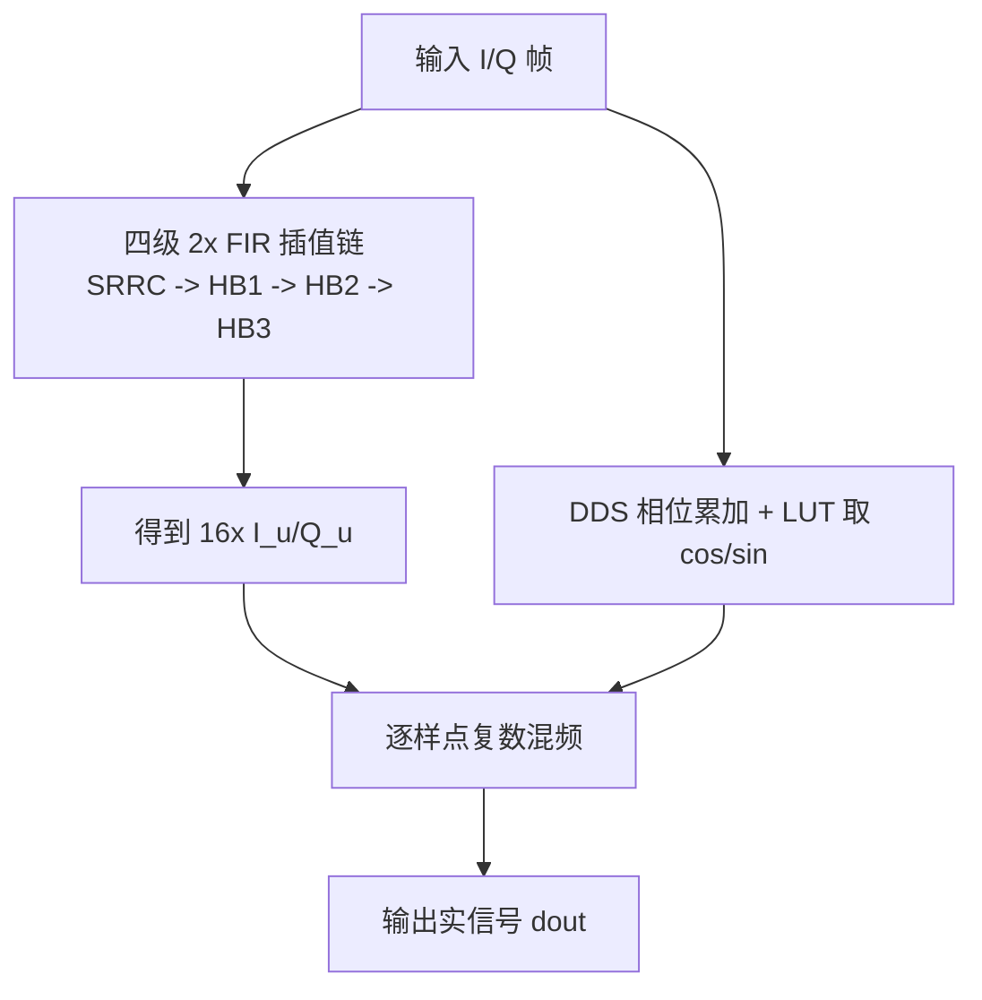
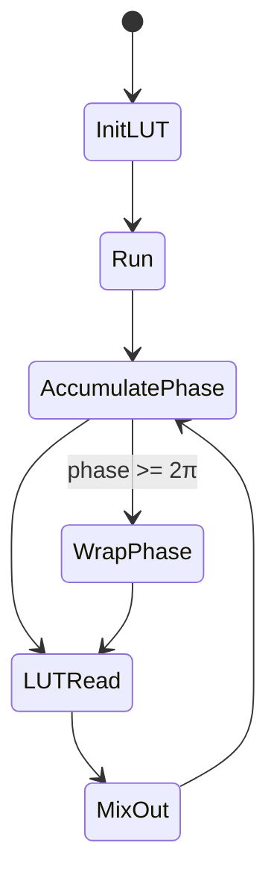

# Digital Up-Converter（DDS + FIR 插值 + 混频）算法深度解析（Vitis HLS 示例）

## 1. 问题陈述（Problem Statement）

给定复基带离散序列
$$
x[n] = I[n] + jQ[n],\quad n=0,\dots,N-1
$$
需要在 FPGA/HLS 中实现一个数字上变频器（DUC），完成以下任务：

1. **采样率提升**：将输入采样率提升 $R=16$ 倍（本例为四级 $2\times$ 插值级联）。
2. **频谱整形**：使用 SRRC/半带 FIR 级联抑制镜像并满足带外指标。
3. **载波搬移**：通过 DDS 产生数控本振（cos/sin），将复基带搬移到中频/射频附近。
4. **工程约束**：在 Vitis HLS 下满足高吞吐（II 目标）、可综合、可时序收敛（示例目标 400 MHz 量级）。

---

## 2. 直觉（Intuition）

朴素方法会失败的原因：

- **直接零插值 + 单级长 FIR**：计算量与时钟压力过高，尤其在高插值比下。
- **运行时 `sin/cos` 计算**：代价高，不适合高频实时硬件流水。
- **串行“先全滤波后混频”**：无法充分利用 HLS `dataflow` 并行。

本设计的关键洞察是：

- 用**多级 $2\times$ 插值 FIR**替代单级高倍率滤波，降低每级复杂度与布线压力（经典多速率思想，见 Crochiere-Rabiner）。
- 用**LUT 型 DDS + 相位累加器**替代实时三角函数计算（经典 NCO/DDS 架构）。
- 用 `#pragma HLS dataflow` 在“插值链 / DDS / 混频”间形成任务级并行。

---

## 3. 形式化定义（Formal Definition）

设总插值率 $R=16=2^4$，四级滤波器为 $h_k[m], k=0,1,2,3$。定义：

- 第 $k$ 级输入为 $u_k[n]$，其中 $u_0[n]=x[n]$；
- 每级执行 $2\times$ 上采样与 FIR：
$$
u_{k+1}[n] = \sum_{m} h_k[m]\cdot \left(\uparrow 2\,u_k\right)[n-m]
$$
最终得到 $u_4[n] = I_u[n] + jQ_u[n]$，长度为 $16N$。

DDS 相位递推：
$$
\theta[t+1] = (\theta[t] + \Delta)\bmod 2\pi
$$
并生成
$$
c[t]=\cos\theta[t],\quad s[t]=\sin\theta[t].
$$

理想实数上变频输出：
$$
y[t] = \Re\{u_4[t]e^{j\theta[t]}\}
     = I_u[t]\cdot c[t] - Q_u[t]\cdot s[t]
$$
（符号正负取决于具体混频实现约定）。

---

## 4. 算法（Algorithm）

### 4.1 伪代码

```pseudocode
Algorithm DUC_Frame(din_i[0..N-1], din_q[0..N-1], incr):
    # Stage A: 16x interpolation for I/Q
    (up_i[0..16N-1], up_q[0..16N-1]) <- MultiStageInterp2x4(din_i, din_q)

    # Stage B: DDS generation
    for t in 0..16N-1:
        theta <- (theta + incr) mod 2π
        cos_t <- COS_LUT(theta)
        sin_t <- SIN_LUT(theta)

        # Stage C: Complex-to-real upconversion
        dout[t] <- up_i[t] * cos_t - up_q[t] * sin_t

    return dout
```

### 4.2 对应实现（节选）

```cpp
void duc(DATA_T din_i[L_INPUT], DATA_T din_q[L_INPUT], DATA_T dout[L_OUTPUT],
         incr_t incr) {
#pragma HLS dataflow
    static filterStageClassTwoChan<L_INPUT> f0;
    static dds_class<L_OUTPUT, dds_t, DATA_T> dds_0;

    DATA_T dout_i[L_OUTPUT], dout_q[L_OUTPUT];
    dds_t dds_cos[L_OUTPUT], dds_sin[L_OUTPUT];

    f0.process(din_i, dout_i, din_q, dout_q);         // 16x FIR chain
    dds_0.process_frame(incr, dds_cos, dds_sin);      // DDS
    dds_0.mix(dds_cos, dds_sin, dout_i, dout_q, dout);// mixing
}
```

```cpp
void process_frame(DATA_T din[l_INPUT], DATA_T dout[2 * l_INPUT]) {
L_process_frame:
    for (int i = 0; i < l_INPUT; i++) {
#pragma HLS pipeline II = II_GOAL rewind
        process(din[i], &dout0, &dout1); // 2x interpolator core
        dout[2 * i] = dout0;
        dout[2 * i + 1] = dout1;
    }
}
```

```cpp
cos_double = cos(2 * M_PI * (0.5 + (double)i) / (4 * LUTSIZE)); // MIDPOINT
```

### 4.3 执行流程图（Mermaid flowchart）



### 4.4 状态转移图（DDS/NCO）



### 4.5 数据结构关系图（Mermaid graph）

```mermaid
graph LR
    DI[din_i[N]] --> F0
    DQ[din_q[N]] --> F0
    F0 --> UI[dout_i[16N]]
    F0 --> UQ[dout_q[16N]]
    INC[incr] --> DDS
    DDS --> COS[dds_cos[16N]]
    DDS --> SIN[dds_sin[16N]]
    UI --> MIX
    UQ --> MIX
    COS --> MIX
    SIN --> MIX
    MIX --> DO[dout[16N]]
```

---

## 5. 复杂度分析（Complexity Analysis）

设输入帧长为 $N$，输出长 $L=16N$。

- 四级插值链、DDS 生成、混频均为逐样点线性处理，因此总时间复杂度
$$
T(N)=\Theta(N).
$$
- 若记第 $k$ 级每输入样点常数代价为 $\alpha_k$，DDS 与混频单位代价为 $\beta,\gamma$，则
$$
T(N)\approx \sum_{k=0}^{3}\alpha_k\,2^kN + (\beta+\gamma)\,16N.
$$
- 空间复杂度（帧缓存风格实现）约为
$$
S(N)=\Theta(16N)
$$
（中间数组 `srrc_dout/hb1_dout/hb2_dout/...`）。

由于该算法无数据相关分支，**最好/最坏/平均**复杂度一致，均为线性量级。

---

## 6. 实现注记（Implementation Notes）

1. **理论与工程的偏离**  
   理论上可写成无限精度实数系统；实现中使用 `DATA_T/dds_t`（通常为定点）以满足资源与频率目标。

2. **DDS LUT 细节**  
   `dds.h` 中可选 `MIDPOINT`：
   - 普通采样：$\cos\left(2\pi i/(4L)\right)$
   - 中点采样：$\cos\left(2\pi (i+0.5)/(4L)\right)$  
   中点采样常用于改善量化误差分布与杂散特性（SFDR）。

3. **HLS 并行化策略**  
   - 顶层 `#pragma HLS dataflow`：任务级并行。
   - FIR 帧循环 `#pragma HLS pipeline II = II_GOAL rewind`：追求稳定吞吐。

4. **静态对象**  
   `static filterStageClassTwoChan` 与 `static dds_class` 保留状态（如滤波延迟线、相位累加器），这在连续流处理里是工程常态。

---

## 7. 对比分析（Comparison）

### 7.1 与经典实现路线对比

- **DDS 路线**：  
  本例是 LUT-NCO 体系（经典 DDS）。  
  替代方案：CORDIC-NCO（省 ROM、增迭代延迟）或多项式逼近（折中方案）。
- **插值路线**：  
  本例是多级 $2\times$（SRRC + Half-band）级联，符合多速率 DSP 经典结论：比单级 $16\times$ 长 FIR 更易实现高频与低功耗。
- **系统级组织**：  
  本例充分利用 HLS dataflow；传统 RTL 手写可更极致，但开发成本更高、可维护性更差。

### 7.2 实践意义

该实现不是“数学最短代码”，而是“可综合、可并行、可收敛”的工程折中：在 FPGA 设计中，这是比纯算法最优更重要的目标函数。