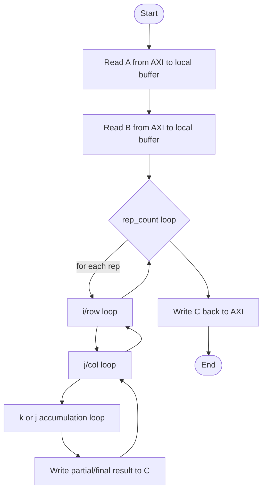
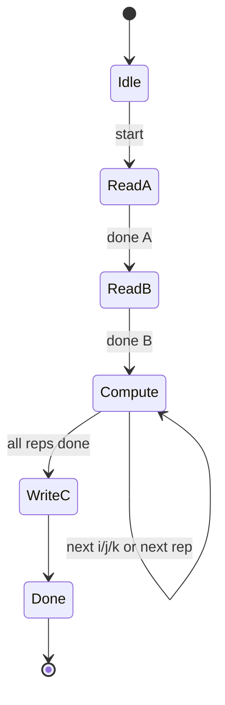
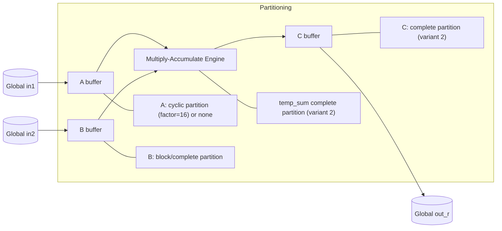

# Blocked/Partitioned Matrix Multiplication（Vitis HLS 示例）深度解析

## 1. 问题陈述（Problem Statement）

给定两个方阵输入 $A,B \in \mathbb{Z}^{n\times n}$，目标是计算：

$$
C = A \times B,\quad C_{ij}=\sum_{k=0}^{n-1}A_{ik}B_{kj}
$$

并将结果写回外部存储器。  
在本示例中，算法面向 **FPGA 上的 HLS 实现**，核心目标并非仅仅是算术正确性，而是通过数组分区（array partition）提升并行访问能力，从而提高吞吐率。

源码包含两个变体：

1. `array_partition_block_cyclic/matmul_partition.cpp`：对一维展平数组使用 **cyclic + block 分区**。  
2. `array_partition_complete/matmul_partition.cpp`：对二维数组使用 **complete 分区**。

---

## 2. 直觉（Intuition）

朴素三重循环矩阵乘法在 FPGA 上常见瓶颈是：  
- 同一周期需要多次访问数组，但 BRAM 端口有限（通常双端口），导致访存冲突。  
- 即使计算单元可流水，访存端也会“卡住”II（Initiation Interval）。

关键洞察是：  
- **分区把一个大数组拆成多个 bank**，使并行访问成为可能。  
- `A` 需要高效行访问，`B` 需要高效列访问；因此采用不同分区策略（cyclic / block / complete）以匹配访问模式。  
- 在 HLS 中，正确的数据布局 + 分区往往比“纯算法层面”的循环重排更关键。

---

## 3. 形式化定义（Formal Definition）

设硬件上限参数分别为 `MAX_DIM` 或 `MAX_SIZE`，实际输入维度为 $n$（代码中 `dim` 或 `size`），且 $n\le M$，其中 $M$ 代表硬件上限。

### 3.1 展平存储模型（block/cyclic 版本）

局部数组采用一维展平：
$$
\text{idx}(i,j)=i\cdot M + j
$$

计算形式为（源码实际）：
$$
C_{ij}=\sum_{k=0}^{M-1} A_{ik}B_{kj}
$$
其中 $i,j\in[0,n-1]$。  
注意：若 $M>n$，则理论上应保证越界维度数据为零，否则会引入额外项。

### 3.2 二维存储模型（complete 版本）

二维数组版本计算流程等价于：
$$
C_{rj}=\sum_{c=0}^{n-1} A_{rc}B_{cj},\quad r,j\in[0,n-1]
$$

实现中用 `temp_sum[j]` 对列方向做累加缓存，属于一种循环重排/累加器化写法。

---

## 4. 算法（Algorithm）

下面给出与实现对应的抽象伪代码。

### 4.1 Block+Cyclic 分区版本伪代码

```pseudocode
Algorithm MatMul_BlockCyclic(in1, in2, dim, rep_count, M):
    Allocate local A[M*M], B[M*M], C[M*M]
    Partition A cyclic factor=16 (dim=1)
    Partition B block  factor=16 (dim=1)

    # burst read
    for itr in [0 .. dim*dim-1]:
        (i, j) <- row-major index from itr
        A[i*M + j] <- in1[itr]

    for itr in [0 .. dim*dim-1]:
        (i, j) <- row-major index from itr
        B[i*M + j] <- in2[itr]

    repeat rep_count times:
        for i in [0 .. dim-1]:
            for j in [0 .. dim-1]:
                result <- 0
                for k in [0 .. M-1]:   # 注意：源码用 M 而非 dim
                    result <- result + A[i*M+k] * B[k*M+j]
                C[i*M+j] <- result

    # burst write
    for itr in [0 .. dim*dim-1]:
        (i, j) <- row-major index from itr
        out[itr] <- C[i*M+j]
```

### 4.2 Complete 分区版本伪代码

```pseudocode
Algorithm MatMul_CompletePartition(in1, in2, size, rep_count, M):
    Allocate A[M][M], B[M][M], C[M][M], temp_sum[M]
    Partition B dim=2 complete
    Partition C dim=2 complete
    Partition temp_sum dim=1 complete

    Read A and B from global memory (row-major, only size*size valid)

    repeat rep_count times:
        for row in [0 .. size-1]:
            for col in [0 .. size-1]:
                for j in [0 .. M-1]:   # 源码上限为 M
                    result <- (col == 0) ? 0 : temp_sum[j]
                    result <- result + A[row][col] * B[col][j]
                    temp_sum[j] <- result
                    if col == size-1:
                        C[row][j] <- result

    Write C[0:size, 0:size] back to global memory
```

### 4.3 执行流程图（flowchart）



### 4.4 状态图（stateDiagram-v2）



### 4.5 数据结构关系图（graph）



---

## 5. 复杂度分析（Complexity Analysis）

令 $n$ 为实际矩阵维度，$M$ 为编译期上限（`MAX_DIM`/`MAX_SIZE`），$r=\text{rep\_count}$。

### 5.1 时间复杂度

- 读入：$\Theta(n^2)$
- 写回：$\Theta(n^2)$

#### 变体一（block/cyclic）
核心计算：
$$
T_{\text{comp}} = \Theta(r\cdot n^2\cdot M)
$$
若 $M=n$，退化为经典 $\Theta(rn^3)$；若 $M>n$，会有“上限维度”额外开销。

#### 变体二（complete）
三层循环为 `row(size) * col(size) * j(M)`：
$$
T_{\text{comp}} = \Theta(r\cdot n^2\cdot M)
$$
同理，当 $M=n$ 时是 $\Theta(rn^3)$。

> 最好/最坏/平均：在该确定性内核中三者同阶，均为上述复杂度（无数据相关分支导致的数量级变化）。

### 5.2 空间复杂度

- 变体一：$A,B,C$ 各 $M^2$，总 $\Theta(M^2)$（常数约 3 倍）。
- 变体二：$A,B,C$ 各 $M^2$ + `temp_sum[M]`，总 $\Theta(M^2)$。

但硬件资源层面，**complete partition** 会显著增加寄存器/LUT/BRAM bank 消耗，空间“常数”非常大。

---

## 6. 实现注记（Implementation Notes）

1. **理论与实现的偏差：内层循环上界使用 `MAX_*` 而非 `size/dim`**  
   - 两个版本都有该特征。  
   - 若未初始化 padding 区域，数学上可能引入未定义贡献；工程上常依赖测试配置使 `size==MAX_*` 或数据已清零。

2. **`LOOP_TRIPCOUNT` 仅用于 HLS 估计，不改变语义**  
   它帮助综合器做性能报告推断，不是功能逻辑。

3. **分区策略与访问模式耦合**  
   - `A` cyclic：适配跨步访问；  
   - `B` block/complete：适配列并行读取；  
   - `temp_sum` complete：为全并行累加创造条件。

4. **`rep_count` 常用于性能测量**  
   通过重复计算放大内核计算占比，减小一次性传输开销对统计的影响。

5. **自动 pipeline + 低层循环展开依赖分区**  
   没有足够 bank 时，unroll 只会造成端口冲突，无法兑现吞吐。

---

## 7. 对比分析（Comparison）

### 7.1 与经典 CPU 三重循环

- 经典实现关注 cache locality（如 i-k-j 重排、cache blocking）。  
- HLS/FPGA 实现更关注 **存储体并行端口** 与 **流水线 II**。  
- 本示例即使算术复杂度同为 $O(n^3)$，但通过分区可显著提升并行度。

### 7.2 与文献中的分块 GEMM / Systolic Array

- 经典分块 GEMM（如 GotoBLAS 思路）强调分层缓存复用。  
- FPGA 常见更激进做法是 systolic array（二维 PE 阵列，数据流化）。  
- 本示例属于“入门级本地缓冲 + 分区并行”，结构简单、可读性高，但在峰值性能上通常不及专用 systolic 设计。

### 7.3 两个示例版本之间

- **block+cyclic 版本**：分区因子固定（16），资源更可控，适合中等并行度。  
- **complete 版本**：并行潜力更大，但资源成本高，规模扩大时可综合性更敏感。  

---

总体上，这两个内核展示了一个核心结论：在 HLS 矩阵乘法中，性能上限往往由“数据可并行供给能力”决定，而这正是数组分区（blocked/cyclic/complete）所直接解决的问题。