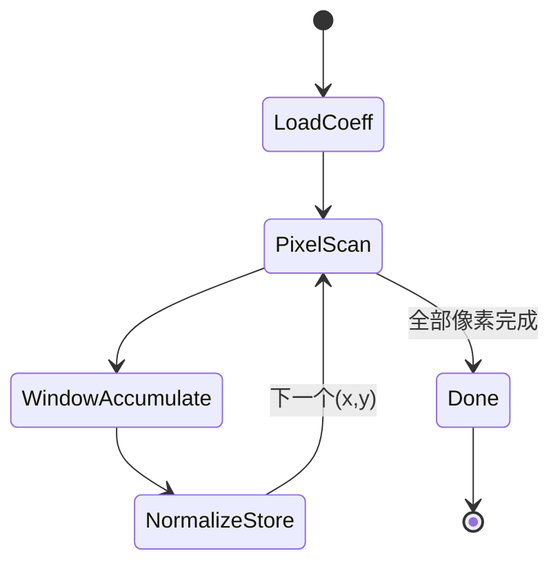

# 2D Stencil Convolution（图像滤波）算法深度解析（Vitis HLS 示例）

## 1. 问题陈述（Problem Statement）

给定输入灰度图像 $I \in [0,255]^{H \times W}$ 与卷积核（滤波系数）$K \in \mathbb{Z}^{R \times C}$，目标是为每个像素位置 $(y,x)$ 计算局部邻域加权和，并进行线性缩放与饱和截断，输出图像 $O \in [0,255]^{H \times W}$。该问题是典型的 **2D stencil 计算**，广泛用于平滑、锐化、边缘检测等场景。

在本示例中，硬件核函数 `Filter2DKernel` 使用 HLS pragma（尤其是 `array_stencil` 与 `PIPELINE`）将该计算映射到可流水化硬件结构。

---

## 2. 直觉（Intuition）

### 2.1 为什么朴素方法在硬件上不理想
CPU 朴素实现按像素串行扫描，每个输出像素需访问 $R\times C$ 个输入像素。若直接“原样”综合到硬件，会出现：

- 访存压力大（重复读取重叠邻域）；
- 难以达到每拍输出一个像素（II=1）；
- 边界判断引入控制开销。

### 2.2 核心洞见
Stencil 计算的邻域在空间上高度重叠。HLS 的 `array_stencil` 可帮助编译器识别这种模式，结合流水线调度，在理想情况下让外层像素循环达到 $\text{II}=1$，即每个时钟周期启动一个新像素的计算（吞吐上接近流式处理）。

---

## 3. 形式化定义（Formal Definition）

设卷积核中心为 $(\lfloor C/2 \rfloor, \lfloor R/2 \rfloor)$，零填充边界条件。则：

$$
S(y,x)=\sum_{r=0}^{R-1}\sum_{c=0}^{C-1}
\tilde I\big(y+r-\lfloor R/2 \rfloor,\;x+c-\lfloor C/2 \rfloor\big)\cdot K(r,c),
$$

其中

$$
\tilde I(u,v)=
\begin{cases}
I(u,v), & 0\le u < H,\;0\le v < W\\
0, & \text{otherwise}
\end{cases}
$$

输出像素：

$$
O(y,x)=\operatorname{sat}_{[0,255]}\left(\left\lfloor \alpha\cdot S(y,x)\right\rfloor + \beta\right),
$$

其中本例中 $\alpha=\frac{1}{RC}$，$\beta=0$，$\operatorname{sat}_{[0,255]}(z)=\min(\max(z,0),255)$。

---

## 4. 算法（Algorithm）

### 4.1 伪代码

```pseudocode
Algorithm Filter2DStencil(I, K, H, W, R, C, α, β):
    for y in [0, H-1]:
        for x in [0, W-1]:
            sum ← 0
            for r in [0, R-1]:
                for c in [0, C-1]:
                    yy ← y + r - floor(R/2)
                    xx ← x + c - floor(C/2)
                    if yy < 0 or yy ≥ H or xx < 0 or xx ≥ W:
                        pixel ← 0
                    else:
                        pixel ← I[yy][xx]
                    sum ← sum + pixel * K[r][c]
            out ← floor(α * sum) + β
            O[y][x] ← clamp(out, 0, 255)
    return O
```

### 4.2 对应实现（节选）

```cpp
#pragma HLS pipeline II=1
#pragma HLS array_stencil variable=src
for(int y=0; y<30; ++y){
  for(int x=0; x<1000; ++x){
    int sum = 0;
    for(int row=0; row<FILTER_V_SIZE; row++){
      for(int col=0; col<FILTER_H_SIZE; col++){
        ...
        sum += pixel*coeffs[row][col];
      }
    }
    dst[y][x] = MIN(MAX((int(factor * sum)+bias), 0), 255);
  }
}
```

### 4.3 执行流程图（Mermaid flowchart）

```mermaid
flowchart TD
    A[开始] --> B[加载coeff到局部coeffs]
    B --> C[遍历y]
    C --> D[遍历x]
    D --> E[sum=0]
    E --> F[遍历row,col邻域]
    F --> G{邻域坐标越界?}
    G -- 是 --> H[pixel=0]
    G -- 否 --> I[pixel=src[yoffset][xoffset]]
    H --> J[sum += pixel*coeff]
    I --> J
    J --> K{邻域遍历结束?}
    K -- 否 --> F
    K -- 是 --> L[归一化+偏置+饱和]
    L --> M[写dst[y][x]]
    M --> N{x循环结束?}
    N -- 否 --> D
    N -- 是 --> O{y循环结束?}
    O -- 否 --> C
    O -- 是 --> P[结束]
```

### 4.4 状态机图（Mermaid stateDiagram-v2）



### 4.5 数据结构关系图（Mermaid graph）

```mermaid
graph LR
    COEFF_IN[coeff[256] 外部存储] --> COEFF_LOCAL[coeffs[R][C] 局部数组]
    SRC[src[H][W] 输入图像] --> STENCIL[Stencil窗口访问]
    COEFF_LOCAL --> MAC[乘加单元 sum]
    STENCIL --> MAC
    MAC --> NORM[factor/bias + clamp]
    NORM --> DST[dst[H][W] 输出图像]
```

---

## 5. 复杂度分析（Complexity Analysis）

设图像尺寸为 $H\times W$，核尺寸为 $R\times C$。

- 时间复杂度（软件语义）：
  $$
  T(H,W,R,C)=\Theta(HWRC)
  $$
- 空间复杂度（额外）：
  $$
  S=\Theta(RC)
  $$
  （局部系数存储；不计输入输出图像本身）

### Best / Worst / Average
由于每个像素都执行固定邻域遍历，理论上三者同阶：

$$
T_{\text{best}}=T_{\text{avg}}=T_{\text{worst}}=\Theta(HWRC)
$$

差异主要来自边界分支命中率与硬件调度细节，不改变量级。

### HLS 吞吐视角
若外层像素循环可维持 $\text{II}=1$，则吞吐可接近每拍一像素启动；总周期近似：

$$
\text{Cycles} \approx HW + \text{pipeline\_fill/drain} + \text{memory stalls}
$$

但能否达到此理想值取决于访存端口、BRAM/URAM 映射、时序约束与 pragma 生效情况。

---

## 6. 实现注记（Implementation Notes）

该示例与“理论最规范版本”有若干工程性偏差：

1. **硬编码尺寸**  
   `Filter2DKernel` 中固定遍历 `y<30, x<1000`，而软件参考版使用 `width/height` 参数。  
   - 优点：便于示例演示与综合稳定。  
   - 代价：可复用性和通用性降低。

2. **系数加载疑似简化/瑕疵**  
   代码为 `coeffs[i][j] = coeff[i];`，未使用 `j`。严格来说应是扁平索引 `coeff[i*C + j]`。  
   这会导致每行系数重复，偏离标准 2D kernel 语义（除非输入本就如此编码）。

3. **接口策略**  
   `src/coeff/dst` 共用 `bundle=gmem1`，可能造成端口仲裁竞争；高性能设计常将读写分离到不同 bundle。

4. **数值类型选择**  
   累加器用 `int`，输入像素 `unsigned char`，系数 `char`。在大核或大系数场景需验证溢出裕量；工业实现常做位宽静态证明（例如 `ap_int` 精确位宽）。

5. **边界处理为零填充**  
   与 OpenCV 常见 `replicate/reflect` 边界策略不同，会影响视觉结果与频谱特性。

---

## 7. 对比（Comparison）

### 7.1 与经典 CPU 实现
- **相同点**：数学定义一致，均为离散卷积（带边界策略和截断）。
- **不同点**：HLS 实现强调吞吐和流水，关注 II、访存并行度、片上缓存复用，而不只是指令级效率。

### 7.2 与分离卷积（Separable Filter）
若核可分离 $K = a b^\top$，复杂度可由 $\Theta(HWRC)$ 降为：

$$
\Theta\big(HW(R+C)\big)
$$

这在高斯模糊等场景显著更优。本例是通用非分离核路径，适用性强但算量更高。

### 7.3 与 FFT 卷积
大核情况下（例如 $R,C$ 很大），频域卷积可达更优渐近复杂度；但小核图像滤波（如 $3\times3,5\times5$）通常直接 stencil 更高效、延迟更低，也更适合 FPGA 流式流水线。

---

**结论**：  
该示例展示了 2D stencil 在 Vitis HLS 中的核心建模方式：局部窗口乘加 + 外层流水线 + `array_stencil` 语义提示。它是从“正确性导向的朴素卷积”迈向“吞吐导向的硬件卷积”的入门模板，但在参数化、系数映射与接口带宽隔离方面仍有可工程化增强空间。