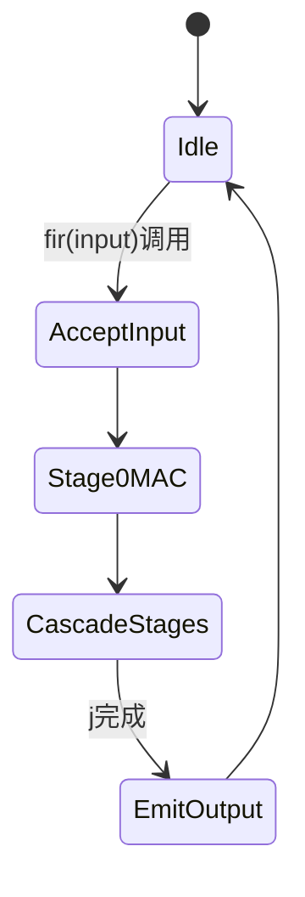

# Systolic FIR Filtering（Vitis-HLS-Introductory-Examples）算法深度解析

## 1. 问题陈述（Problem Statement）

给定长度为 $N$ 的 FIR（Finite Impulse Response）滤波器系数向量 $\mathbf{h}=[h_0,\dots,h_{N-1}]$、输入离散时间序列 $x[n]$ 与偏置项 $b$，目标是在高频 FPGA 平台上实现**高吞吐、可流水化**的滤波计算，输出：

$$
y[n] = b + \sum_{k=0}^{N-1} h_k\,x[n-k].
$$

在 Vitis HLS 的 `systolic_fir.cpp` 中，问题被进一步约束为：  
- 通过 DSP intrinsic 的 `cascade` 结构构建 tap 链；  
- 使用 `#pragma HLS unroll` 将 tap 级联静态展开；  
- 以最小控制开销实现每采样周期（理想）一个输出的流式计算。

---

## 2. 直觉（Intuition）

朴素 FIR 实现通常采用“移位寄存器 + for 循环累加”，在软件上是自然的，但在高频 HLS 中会遇到两类瓶颈：

1. **关键路径过长**：串行 MAC 链难以满足高时钟；
2. **调度/访存冲突**：若延迟线与累加共享资源，II（initiation interval）难降到 1。

关键洞见是：将 FIR 映射为**systolic（脉动）级联结构**，让每个 tap 对应一个独立 PE（Processing Element, 常由 DSP48 承载），数据与部分和沿级联通道传播。这样：
- 计算拓扑固定；
- 局部连线短；
- 易于插入寄存器并实现深流水。

这与经典的 Kung-Leiserson 脉动阵列思想一致：以规则数据流换取高并行与可时序收敛性。

---

## 3. 形式化定义（Formal Definition）

设第 $j$ 个 PE 的输入为 $(b_{j-1}, p_{j-1})$，输出为 $(b_j, p_j)$。定义递推：

$$
\begin{aligned}
b_0 &= x[n], \\
p_0 &= h_0 b_0 + b, \\
b_j &= b_{j-1}, \quad j=1,\dots,N-1,\\
p_j &= h_j b_{j-1} + p_{j-1}, \quad j=1,\dots,N-1,\\
y[n] &= p_{N-1}.
\end{aligned}
$$

若将内部寄存器（`REG_A1/REG_B1/REG_B2/REG_M/REG_P`）建模为固定延迟算子 $\mathcal{D}$，则每个 PE 形式为：

$$
(b_j, p_j) = \mathcal{D}_j\big(h_j, b_{j-1}, p_{j-1}\big),
$$

整体形成线性 pipeline，吞吐率由最慢级和握手协议决定。

---

## 4. 算法（Algorithm）

### 4.1 伪代码

```pseudocode
Input: coeff[0..N-1], bias, input_sample
State: dsp0, dsp_full[0..N-2]  // each PE has internal pipeline registers

function FIR_STEP(input_sample):
    out = dsp0.mul_add(coeff[0], input_sample, bias)
    for j from 1 to N-1 do in parallel-unrolled form:
        out = dsp_full[j-1].mul_add(coeff[j], out.bcout, out.pcout)
    return out.pcout
```

### 4.2 实际实现（节选）

```cpp
class FIR{
 private:
   const long* coeff_;
   long bias_;
   cascade<REG_A1|REG_B1|       REG_M|REG_P > dsp0;
   cascade<REG_A1|REG_B1|REG_B2|REG_M|REG_P > dsp_full[size - 1];
 public:
   FIR(const long* coeff, long bias) : coeff_(coeff), bias_(bias) {
#pragma HLS ARRAY_PARTITION variable=dsp_full complete dim=1
   };

   long fir(B_t input){
     auto out = dsp0.mul_add(coeff_[0], input, bias_);
     for(int j=1; j < size ; j++){
#pragma HLS unroll
       out = dsp_full[j - 1].mul_add(coeff_[j], out.bcout, out.pcout);
     }
     return out.pcout;
   };
};
```

### 4.3 执行流程（flowchart）

```mermaid
flowchart TD
    A[输入 sample x[n]] --> B[PE0: mul_add(h0, x[n], bias)]
    B --> C{j = 1..N-1}
    C --> D[PEj: mul_add(hj, bcout, pcout)]
    D --> C
    C -->|完成| E[输出 y[n] = pcout]
```

### 4.4 状态转移（stateDiagram-v2）



### 4.5 数据结构关系（graph）

```mermaid
graph LR
    COEFF[coeff_[]] --> PE0[dsp0]
    BIAS[bias_] --> PE0
    PE0 -->|bcout, pcout| PE1[dsp_full[0]]
    PE1 -->|bcout, pcout| PE2[dsp_full[1]]
    PE2 -->|...| PEN[dsp_full[N-2]]
    PEN --> OUT[return pcout]
```

---

## 5. 复杂度分析（Complexity Analysis）

令 tap 数为 $N$。

### 软件语义（按一次 `fir()` 调用计）
- 时间复杂度：  
  $$
  T(N)=\Theta(N)
  $$
- 空间复杂度（显式存储，不含系数表）：  
  $$
  S(N)=\Theta(N)
  $$
  （`dsp_full` 为长度 $N-1$ 的级联对象数组）

### 硬件映射语义（HLS 展开后）
- 乘法器数量（DSP 数）约为 $N$；
- 组合路径由局部 PE + 级间寄存器决定，非线性累积被寄存器切断；
- 在足够流水下，可达：
  $$
  \text{II} \approx 1
  $$
- 首输出延迟（latency）近似随级数线性增长：
  $$
  L(N)\approx L_0 + \sum_{j=1}^{N-1} L_j = \Theta(N)
  $$
  但吞吐率可保持常数级（每周期一采样）。

**Best/Worst/Average**：该结构为确定性数据通路，无分支数据相关性，三者在渐近复杂度上基本一致。

---

## 6. 实现说明（Implementation Notes）

1. **理论与代码的差异**  
   理论 FIR 常显式写出 $x[n-k]$ 延迟线；此实现不直接维护软件移位数组，而通过 `cascade` 对象内部寄存与 `bcout/pcout` 传播实现时序对齐。

2. **`#pragma HLS unroll` 的作用**  
   循环被完全展开，形成静态 PE 链，而非单 MAC 复用。换言之，以面积换吞吐/频率。

3. **`ARRAY_PARTITION complete` 的作用**  
   保证 `dsp_full` 每个元素独立可并发访问，避免数组端口限制阻碍展开。

4. **寄存器配置不对称**  
   `dsp0` 与 `dsp_full` 的 `REG_B2` 配置不同，通常用于级间延迟配平与时序收敛（工程化折中，而非纯数学需求）。

---

## 7. 对比分析（Comparison）

| 方案 | 结构 | 吞吐潜力 | 资源开销 | 高频可达性 |
|---|---|---:|---:|---:|
| 朴素串行 FIR | 单 MAC 循环复用 | 低（常需 $N$ 周期/样本） | 低 | 中 |
| 对称系数 FIR（线性相位） | 预加 + MAC | 中-高 | 中 | 中-高 |
| **本例 Systolic FIR** | 全展开 DSP 级联 | **高（II≈1）** | **高（约 N DSP）** | **高** |
| FFT 分块卷积 | 频域乘法 | 大 $N$ 时高 | 高（控制/缓存复杂） | 取决于系统 |

与经典 Direct Form 相比，本例更接近**硬件友好的 Transposed/Systolic 映射**：牺牲面积，换取规则数据流与高时钟下稳定吞吐。这正是 FPGA DSP 密集内核在工程中最常见的优化路线。