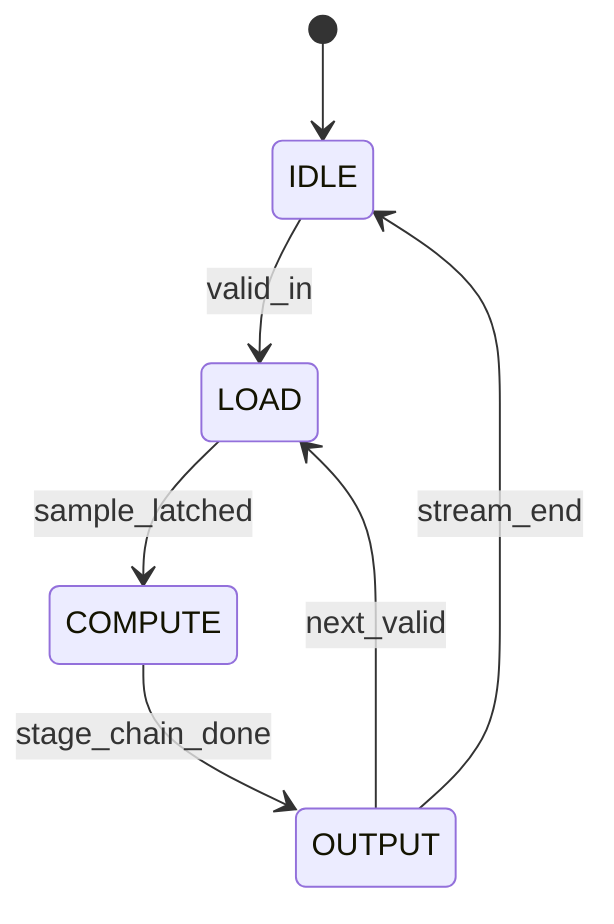

# Transposed-Form FIR Filtering（Vitis HLS 示例）算法深度解析

## 1. 问题定义（Problem Statement）

我们关注的是**有限冲激响应（FIR）滤波**在 FPGA/HLS 场景中的高频实现问题。  
给定输入离散序列 $x[n]$ 与长度为 $M$ 的系数序列 $h[0],h[1],\dots,h[M-1]$，目标是计算：

$$
y[n] = \sum_{k=0}^{M-1} h[k]\,x[n-k]
$$

并满足硬件实现约束：

- 高吞吐（理想情况下每周期 1 个样本）
- 高时钟频率（通过 DSP 级联与寄存器切分关键路径）
- 可综合（HLS 到 RTL）

在 `transposed_fir.cpp` 中，核心原语是单级乘加：

```cpp
C_t one_stage_mult_add(A_t a, B_t b, C_t in) {
    cascade<REG_A1 | REG_B1 | REG_M | REG_P> cas;
    R_t res = cas.mul_add(a, b, in);
    return res.pcout;
}
```

该函数是转置结构 FIR 的“一级”构件。

---

## 2. 直觉（Intuition）

### 为什么朴素实现不理想？
经典直接型 FIR 若按串行累加实现，单样本路径是 $M$ 次乘法 + $M-1$ 次加法，关键路径长、频率低。  
即使完全并行，直接型的“加法树 + 延迟线”在映射到 DSP 时仍可能遇到布线/时序瓶颈。

### 关键洞察
**转置型 FIR（Transposed Form）**将结构重排为“每级乘加 + 级间寄存器/级联”，天然适配 FPGA DSP slice 的 MACC/CASCADE 通道。  
`one_stage_mult_add` 恰好对应一个 DSP 级：  
- $a \cdot b$（乘法）  
- 与 `in` 累加  
- 从 `pcout` 向下一级输出

这使得设计更容易达到高 Fmax 与 II=1。

---

## 3. 形式化定义（Formal Definition）

设 $M$ 阶转置型 FIR 的级间状态为 $r_i[n]$（$i=0,\dots,M-1$），定义：

$$
r_{M-1}[n] = h[M-1]\cdot x[n]
$$

$$
r_i[n] = h[i]\cdot x[n] + r_{i+1}[n-1],\quad i=M-2,\dots,0
$$

$$
y[n]=r_0[n]
$$

其与标准卷积形式等价。  
在硬件上，每个 $r_i$ 对应一级 `mul_add` 与寄存器化级联。

---

## 4. 算法（Algorithm）

### 4.1 抽象伪代码（单样本）

```pseudocode
function TRANSPOSED_FIR_SAMPLE(x_n, h[0..M-1], delay[1..M-1]):
    # delay[i] 表示来自下一阶段的上一拍部分和
    for i from M-1 downto 0:
        if i == M-1:
            stage_out[i] = h[i] * x_n
        else:
            stage_out[i] = h[i] * x_n + delay[i+1]
    y_n = stage_out[0]

    # 更新跨拍寄存器
    for i from 1 to M-1:
        delay[i] = stage_out[i]

    return y_n
```

### 4.2 对应实现原语（代码）

```cpp
C_t one_stage_mult_add(A_t a, B_t b, C_t in) {
    cascade<REG_A1 | REG_B1 | REG_M | REG_P> cas;
    R_t res = cas.mul_add(a, b, in);
    return res.pcout;
}
```

> 解释：`REG_A1 | REG_B1 | REG_M | REG_P` 显式启用 A/B 输入、乘法器、累加器路径寄存器，是典型的“以寄存器换频率”策略。

---

### 4.3 执行流程图（flowchart）

```mermaid
flowchart TD
    A[读入新样本 x[n]] --> B[广播 x[n] 到所有 FIR stage]
    B --> C[stage i 执行 mul_add: h[i]*x[n] + partial_in]
    C --> D[通过 pcout 级联到前一stage]
    D --> E[stage0 输出 y[n]]
    E --> F[更新各级寄存器/延迟状态]
    F --> G{还有样本?}
    G -- 是 --> A
    G -- 否 --> H[结束]
```

### 4.4 状态机（stateDiagram-v2）



### 4.5 数据关系图（graph）

```mermaid
graph LR
    X[x[n]] --> S0
    X --> S1
    X --> S2
    HM1[h[M-1]] --> S2
    H1[h[1]] --> S1
    H0[h[0]] --> S0
    S2[one_stage_mult_add] -->|pcout| S1
    S1[one_stage_mult_add] -->|pcout| S0
    S0[one_stage_mult_add] --> Y[y[n]]
```

---

## 5. 复杂度分析（Complexity Analysis）

设滤波器长度为 $M$，输入长度为 $N$。

### 运算复杂度
- 每样本：$M$ 次乘法 + $M-1$ 次加法  
- 总计：$\Theta(NM)$

### 时间复杂度（软件视角）
$$
T(N,M)=\Theta(NM)
$$

### 硬件流水线视角
- 吞吐（稳态）：若 II=1，则每周期 1 样本
- 延迟：约为流水线深度 + 级联级数（与寄存器配置相关）

### 空间复杂度
- 状态寄存器：$\Theta(M)$  
- 系数存储：$\Theta(M)$

### Best / Worst / Average
对于固定长度 FIR，三者同阶，均为：
$$
\Theta(NM)
$$
区别主要体现在硬件停顿（背压、接口阻塞）而非算法分支。

---

## 6. 实现备注（Implementation Notes）

1. **理论 vs 代码粒度差异**  
   理论上描述整个 $M$ 级 FIR；当前源码片段只给出**单级原语** `one_stage_mult_add`。完整 FIR 由该原语级联构建（依赖图也表明 `transposed_fir` 调用此函数）。

2. **`pcout` 的工程意义**  
   返回 `res.pcout` 而非普通和输出，说明实现优先利用 DSP 级联端口，减少通用布线延迟。

3. **寄存器选项是关键工程折中**  
   `REG_A1 | REG_B1 | REG_M | REG_P` 提升时序裕量，但会增加级内延迟（pipeline latency）。这是高频设计的典型 trade-off。

4. **类型系统 (`A_t/B_t/C_t/R_t`)**  
   宽度、符号位、截断/舍入策略未在片段中展示；实际工程需严格约束定点位宽，避免溢出或量化噪声劣化。

---

## 7. 对比分析（Comparison）

### 与直接型 FIR（Direct Form）对比
- **直接型**：输入延迟线明显，累加路径可能更难跑高频。  
- **转置型**：更贴近 DSP slice 的 MACC + CASCADE 结构，通常更利于高 Fmax/高吞吐。

### 与经典文献/实现范式
在多速率/并行 DSP 设计文献中，转置结构长期被视为适配硬件流水线的重要形式（与 Oppenheim/Vaidyanathan 系列教材中的结构变换思想一致）。  
Vitis 示例的特色在于：将该结构进一步“原语化”为 DSP intrinsic 调用，直接约束寄存器与级联行为，比纯 C 算法描述更接近底层硬件时序模型。

---

**结论**：  
`transposed_fir.cpp` 中的 `one_stage_mult_add` 不是一个普通乘加函数，而是面向 FPGA DSP 级联通路的结构化硬件原语。其价值在于把转置型 FIR 的数学等价变换落实为可综合、可高频、可流水的工程实现单元。