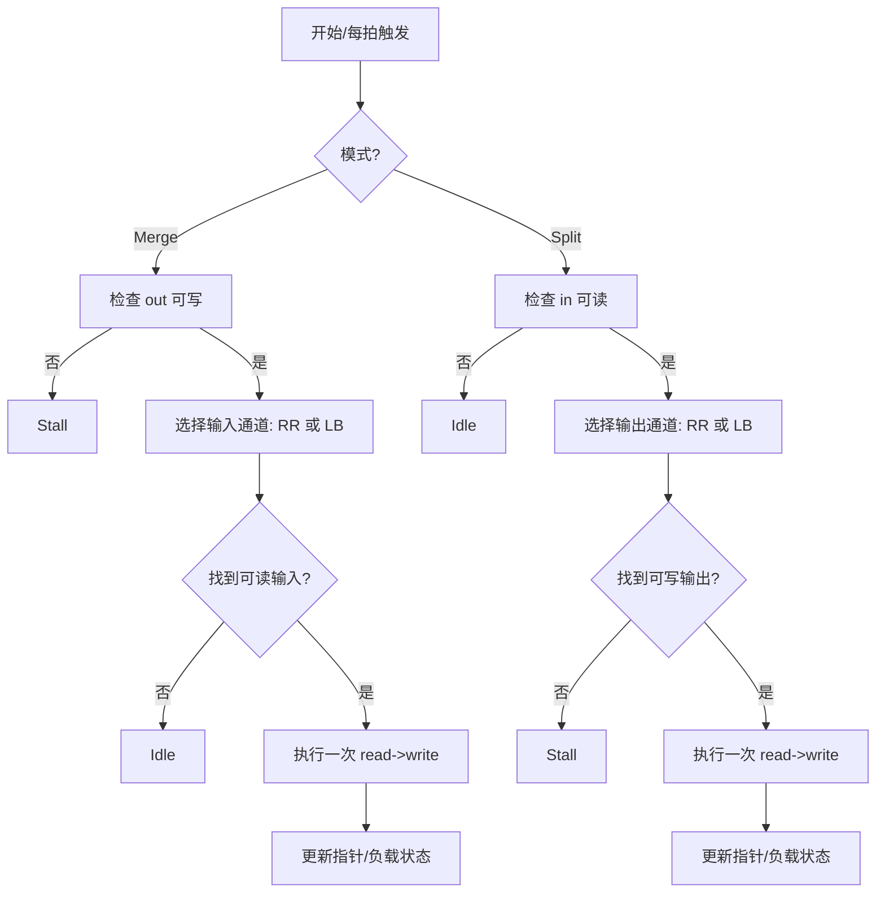
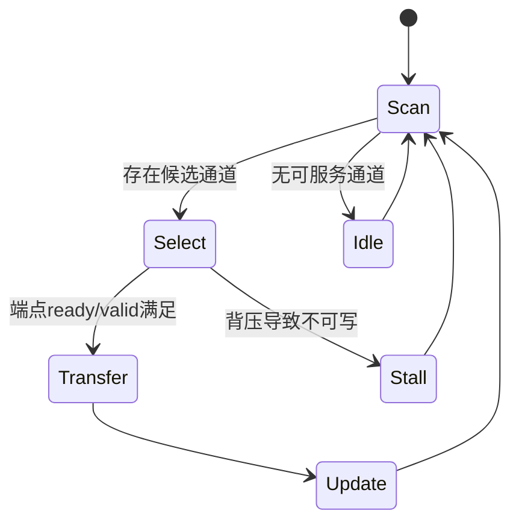

# Multi-Channel Merge/Split Scheduling（Load-Balance 与 Round-Robin）算法深度解析（Vitis HLS）

## 1. 问题陈述（Problem Statement）

在流式硬件系统中，常见两类调度问题：

1. **多输入合并（Merge）**：给定 $N$ 个输入流 $\{I_0,\dots,I_{N-1}\}$，将数据汇聚到单一输出流 $O$。  
2. **单输入分发（Split）**：给定单一输入流 $I$，将数据分发到 $N$ 个输出流 $\{O_0,\dots,O_{N-1}\}$。

目标通常不是“仅可行”，而是同时满足：

- **吞吐最大化**（尽量每拍完成一次传输）；
- **公平性**（不让某通道长期饥饿）；
- **背压鲁棒性**（某通道阻塞时系统仍能前进）；
- **硬件可综合性**（有限状态、有限资源、固定时序）。

在示例中，这些目标由四种策略实例化：

- `hls::merge::load_balance<T,N,...>`
- `hls::merge::round_robin<T,N,...>`
- `hls::split::load_balance<T,N,...>`
- `hls::split::round_robin<T,N,...>`

---

## 2. 直觉（Intuition）

**朴素方案失败点**：

- 固定优先级（如总是先看通道 0）会导致**头部通道垄断**和尾部通道饥饿；
- 串行轮询若不考虑“就绪/可写状态”，会在空/满通道上浪费周期；
- 合并与分发在存在背压时会出现**全局停顿**（head-of-line blocking）。

**关键洞察**：

- `round_robin` 通过旋转优先级实现可证明的长期公平；
- `load_balance` 通过“选择当前负载更轻/更可服务”的通道减少局部拥塞；
- 在 HLS 中，调度器作为数据流图中的独立进程，与 producer/consumer 并行执行（`#pragma HLS dataflow`），从而把算法公平性转化为**硬件时序上的稳定吞吐**。

---

## 3. 形式化定义（Formal Definition）

设离散时间 $t=0,1,2,\dots$。

### 3.1 Merge

输入队列长度为 $q_i(t)$，输出可写指示为 $w_O(t)\in\{0,1\}$。  
调度决策变量 $x_i(t)\in\{0,1\}$，且 $\sum_i x_i(t)\le 1$。

传输约束：
$$
x_i(t) \le \mathbf{1}[q_i(t)>0]\cdot w_O(t)
$$

队列演化（忽略外部到达细节）：
$$
q_i(t+1)=q_i(t)+a_i(t)-x_i(t)
$$

优化目标可写为（示意）：
$$
\max \sum_t \sum_i x_i(t)
\quad \text{s.t. fairness/backpressure constraints}
$$

- **RR 合并**：按循环序列选择第一个可服务输入。
- **LB 合并**：选择“最应优先服务”的输入（常见为更拥塞、更等待久或最早可用）。

### 3.2 Split

输入可读 $r_I(t)$，输出 $j$ 可写为 $w_j(t)$，决策 $y_j(t)\in\{0,1\}$，$\sum_j y_j(t)\le 1$：

$$
y_j(t) \le r_I(t)\cdot w_j(t)
$$

目标：
$$
\max \sum_t \sum_j y_j(t)
$$

并控制输出不均衡，例如最小化
$$
\max_j Q_j(t)-\min_j Q_j(t)
$$
其中 $Q_j(t)$ 为输出侧积压。

---

## 4. 算法（Algorithm）

> 注：以下伪代码是对库行为的抽象化描述；具体模板参数（如 `20,5,100,6,2`）在示例中未展开实现细节，通常与 FIFO 深度/窗口/轮询步长/保护阈值等工程参数相关。

### 4.1 Round-Robin Merge（抽象）

```pseudocode
state ptr := 0
loop every cycle:
    if out is writable:
        served := false
        for k in 0..N-1:
            i := (ptr + k) mod N
            if in[i] is readable:
                out.write(in[i].read())
                ptr := (i + 1) mod N
                served := true
                break
        if not served:
            idle
    else:
        stall
```

### 4.2 Load-Balance Split（抽象）

```pseudocode
loop every cycle:
    if in is readable:
        C := { j | out[j] is writable }
        if C is not empty:
            j* := argmin_j score(j)   // 负载最轻或最优可服务
            out[j*].write(in.read())
        else:
            stall
```

### 4.3 与示例代码对应（真实调用）

```cpp
#pragma HLS dataflow
hls::merge::round_robin<int, 4, 5, 100> s;
producer1(s.in[0], out1); ... producer4(s.in[3], out4);
consumer1(s.out, in1);
```

---

### 4.4 执行流程图（flowchart）



### 4.5 状态图（stateDiagram-v2）



### 4.6 数据关系图（graph）

```mermaid
graph LR
    subgraph Merge
      P0[producer0] --> I0[s.in[0]]
      P1[producer1] --> I1[s.in[1]]
      P2[producer2] --> I2[s.in[2]]
      P3[producer3] --> I3[s.in[3]]
      I0 --> M[merge scheduler]
      I1 --> M
      I2 --> M
      I3 --> M
      M --> O[s.out]
      O --> C[consumer]
    end

    subgraph Split
      Pin[producer] --> Sin[s.in]
      Sin --> S[split scheduler]
      S --> O0[s.out[0]] --> C0[consumer0]
      S --> O1[s.out[1]] --> C1[consumer1]
      S --> O2[s.out[2]] --> C2[consumer2]
      S --> O3[s.out[3]] --> C3[consumer3]
    end
```

---

## 5. 复杂度分析（Complexity Analysis）

设通道数为 $N$，处理 token 总数为 $M$。

- **每次仲裁开销**：  
  - 线性扫描实现：$O(N)$  
  - 若 $N$ 编译期常量且做全展开，时延近似常数（硬件并行比较），但面积增加。
- **总时间（以调度步骤计）**：
  $$
  T(M)=O(M\cdot N)\quad (\text{线性扫描模型})
  $$
- **空间**：主要为通道 FIFO 与状态寄存器：
  $$
  S=O\!\left(\sum_{i=0}^{N-1} D_i\right)+O(N)
  $$
  其中 $D_i$ 为 FIFO 深度（模板参数之一通常控制此量级）。

**Best case**：每拍都有可服务端点，吞吐 $\approx 1$ token/cycle。  
**Worst case**：长期背压或空队列导致 stall，吞吐降至 0。  
**Average case**：取决于输入到达率与输出可写概率；RR 通常给出更稳定的长期公平，LB 通常在非均匀负载下吞吐更优。

---

## 6. 实现说明（Implementation Notes）

1. `#pragma HLS dataflow` 将 producer / scheduler / consumer 变为并发进程，这是性能关键。  
2. 示例 `dut` 仅展示连接拓扑，**调度核心在 HLS 库组件内部**，并非用户手写循环。  
3. 模板参数（如 `<int,4,5,100>`）体现工程化折中：缓冲深度、仲裁窗口、保护阈值等；具体语义依版本文档。  
4. 理论模型常假设“原子一步仲裁+传输”，实际 RTL 中会受 ready/valid、FIFO full/empty、II 约束影响。  
5. 测试连接中 `out1..out4`/`in1` 既承担功能接口，也常用于 testbench 观测与驱动，属于教学示例常见写法。

---

## 7. 对比（Comparison）

| 方案 | 公平性 | 吞吐（非均匀负载） | 实现复杂度 | 典型问题 |
|---|---:|---:|---:|---|
| 固定优先级 | 低 | 中/低 | 低 | 饥饿 |
| Round-Robin | 高 | 中 | 低/中 | 对突发热点适应一般 |
| Load-Balance | 中/高（取决于策略） | 高 | 中 | 需额外负载状态 |
| WFQ/Deficit RR（经典网络调度） | 很高 | 高 | 高 | 硬件代价较大 |

**与经典文献脉络**：  
- RR 属于最基础的公平队列思想（网络交换与操作系统调度广泛使用）；  
- LB 更接近交换机仲裁中的“队列感知”调度（如最大权重匹配的简化硬件版本）；  
- Vitis 示例可视为将这些策略封装为可综合数据流组件，在 FPGA 语境下优先平衡**可预测时序与资源成本**，而非追求最优理论调度。