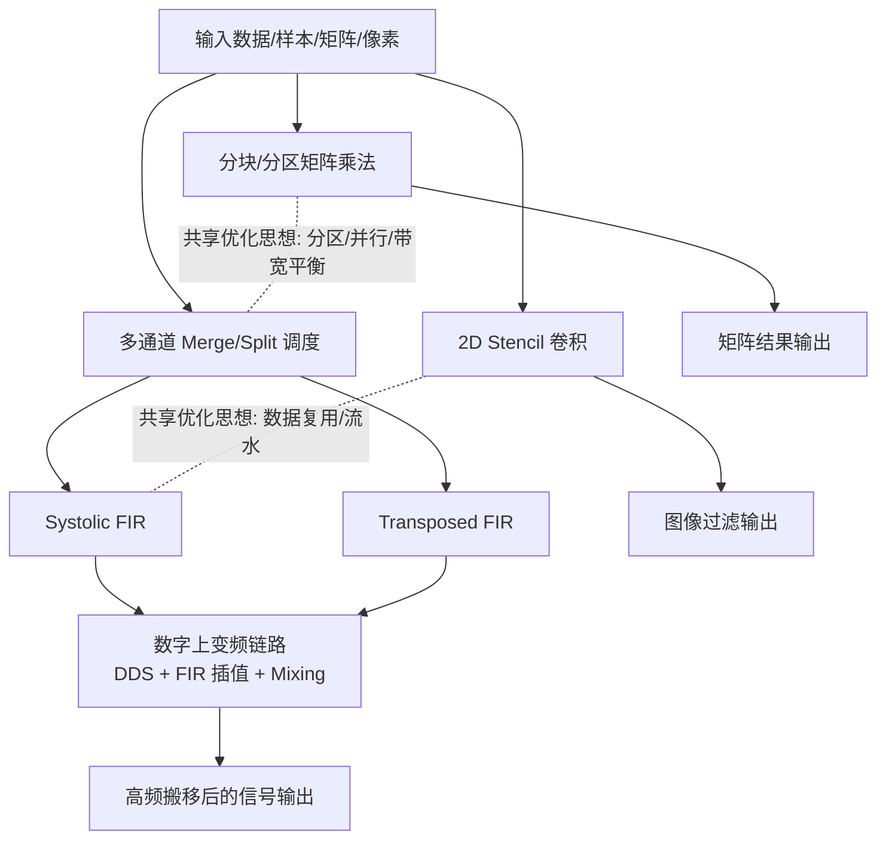

# Core Algorithms（核心算法总览）

`Vitis-HLS-Introductory-Examples` 的核心价值，在于把“可综合的高层算法描述”落到真实硬件执行模型上：并行、流水、片上存储层次、以及流式任务编排。本节聚焦项目里最具代表性的计算内核，覆盖了 DSP 信号链、矩阵计算、图像卷积与任务级调度等典型场景，帮助你从“算法功能正确”走向“硬件实现高效”。

这些算法并不是彼此孤立的示例。它们共享一组关键设计思想：数据复用（如窗口/缓存/分块）、并行展开（如数组分区、tap 级并行）、流式连接（如 dataflow、通道仲裁/分发）、以及时序友好的结构化算子（如 systolic、transposed）。因此，你可以把本节看作一个“模式库”：先理解每个算法的计算本质，再迁移其优化手法到自己的 HLS 设计中。

从系统视角看，DSP 链路（DDS/FIR/混频）体现端到端信号处理流水；矩阵乘与 2D stencil 代表访存与计算密集型内核；多通道 merge/split 则承担任务级并行中的“交通调度器”角色，将多个生产者/消费者高效耦合。下图给出这些核心算法之间的关系与数据流位置。

---

## 算法关系与数据流（Mermaid）

---

## 核心算法目录

### 1) Digital Up-Converter（DDS + FIR Interpolation + Mixing）
数字上变频（DUC）示例实现了完整的信号上变频链路：先由 DDS 产生数控振荡载波，再通过 FIR 插值提升基带采样率，最后与载波混频将频谱搬移到更高频段。它是“多级 DSP 模块串接 + 流水化实现”的代表，适合学习如何将多个子核整合为稳定高吞吐的数据通路。  
**链接：** [guide-core-algorithms-digital-up-conversion-pipeline.md](guide-core-algorithms-digital-up-conversion-pipeline.md)

### 2) Blocked/Partitioned Matrix Multiplication
该示例围绕稠密矩阵乘法，比较分块计算与数组分区（block-cyclic、complete）等策略对并行度、访存带宽与资源占用的影响。它展示了 HLS 中最核心的性能杠杆之一：通过重构数据布局与局部性，显著提升计算单元利用率并减少存储瓶颈。  
**链接：** [guide-core-algorithms-matrix-multiplication-with-array-partitioning.md](guide-core-algorithms-matrix-multiplication-with-array-partitioning.md)

### 3) 2D Stencil Convolution（Image Filter）
2D stencil 卷积示例通过滑动窗口在图像像素上执行卷积式滤波，显式处理边界条件与窗口更新，并针对硬件实现强调行缓冲/窗口缓冲的数据复用。该算法是“规则邻域计算 + 持续流输入”场景的经典模板，适用于图像预处理、边缘检测等应用。  
**链接：** [guide-core-algorithms-stencil-2d-convolution-filter.md](guide-core-algorithms-stencil-2d-convolution-filter.md)

### 4) Systolic FIR Filtering
Systolic FIR 采用脉动阵列式的数据流结构，把 FIR 的乘加 tap 组织成可流水推进的级联阶段，实现高吞吐、稳定时序的流式滤波。其重点在于通过结构化级联降低全局数据移动压力，使每级仅处理局部数据与部分和，适合长 tap 或高采样率场景。  
**链接：** [guide-core-algorithms-streaming-fir-systolic-architecture.md](guide-core-algorithms-streaming-fir-systolic-architecture.md)

### 5) Transposed-Form FIR Filtering
Transposed 结构将 FIR 变换为每个 tap 局部执行乘加累积的形式，通常可缩短关键路径并更高效映射到 DSP 资源。该示例有助于理解“同一算法的不同硬件结构化表达”如何影响频率、延迟与资源分布，是 FIR 架构选型中的重要对照。  
**链接：** [guide-core-algorithms-streaming-fir-transposed-architecture.md](guide-core-algorithms-streaming-fir-transposed-architecture.md)

### 6) Multi-Channel Merge/Split Scheduling（Load-Balance and Round-Robin）
该示例实现多通道流的合并与分发调度，支持负载均衡与轮询（round-robin）策略，用于协调多个生产者/消费者在 task-level 并行下的有序协作。它是系统级 dataflow 设计中的关键组件，可显著改善吞吐稳定性与通道利用率。  
**链接：** [guide-core-algorithms-task-channel-merge-split-scheduling.md](guide-core-algorithms-task-channel-merge-split-scheduling.md)