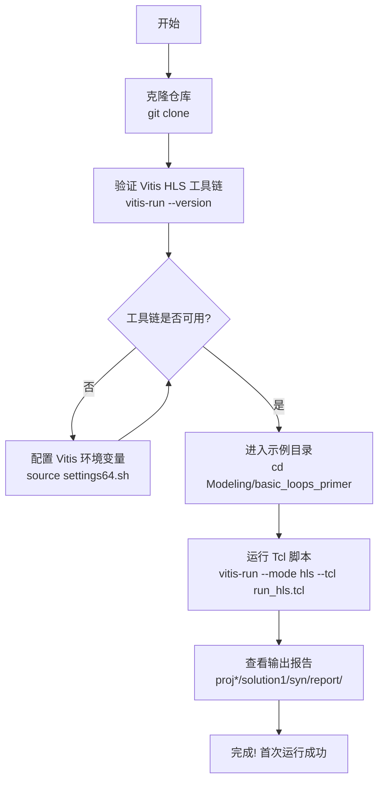
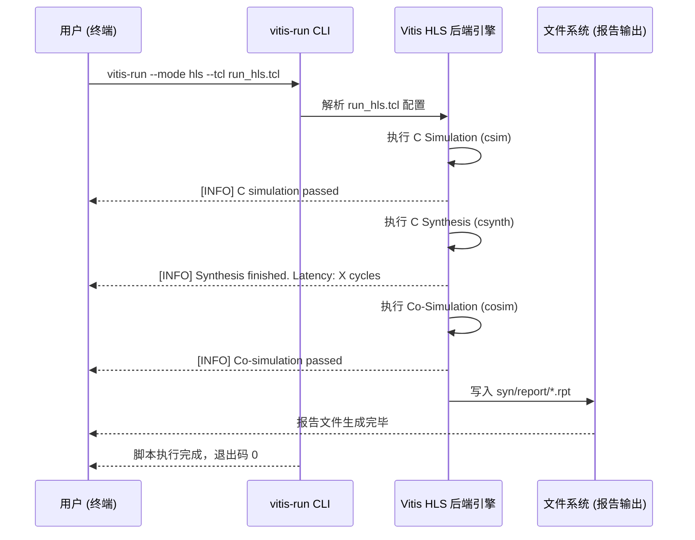

# 快速入门指南：Vitis-HLS-Introductory-Examples

> **目标**：在 15 分钟内完成环境配置并成功运行第一个 HLS 示例。

---

## 安装流程总览



---

## 首次运行交互时序图



---

## 1. 前置条件（Prerequisites）

在开始之前，请确认以下工具和环境已准备就绪：

### 1.1 必须安装的工具

| 工具 | 最低版本 | 说明 |
|------|----------|------|
| **Vitis HLS / Vitis Unified IDE** | 2023.1 | AMD/Xilinx 官方 HLS 工具，必须已安装并获得有效 License |
| **Git** | 2.x+ | 用于克隆仓库 |
| **Bash / Tcsh** | 任意现代版本 | 用于执行环境初始化脚本 |
| **Python 3** | 3.6+ | 可选，用于运行 `run.py` 脚本 |

> **⚠️ 重要提示**：Vitis HLS 需要有效的 **AMD/Xilinx License**。请前往 [AMD License 管理中心](https://www.xilinx.com/getlicense) 获取许可证，并配置 `LM_LICENSE_FILE` 环境变量。

### 1.2 操作系统要求

- **推荐**：Red Hat Enterprise Linux 8.x / Ubuntu 20.04 LTS 或更高版本（64 位）
- **不支持**：Windows 原生环境（请使用 WSL2 或 Linux 虚拟机）

### 1.3 硬件要求

- RAM：最低 8 GB，推荐 16 GB（Co-Simulation 阶段消耗较大）
- 磁盘：最低 5 GB 可用空间

### 1.4 环境变量

| 变量名 | 是否必须 | 说明 |
|--------|----------|------|
| `LM_LICENSE_FILE` | **是** | 指向 Xilinx License 服务器或 `.lic` 文件路径 |
| `XILINX_VITIS` | 自动设置 | Vitis 安装根目录，执行 `settings64.sh` 后自动导出 |
| `XILINX_HLS` | 自动设置 | HLS 工具根目录，执行 `settings64.sh` 后自动导出 |
| `PATH` | 自动设置 | 执行 `settings64.sh` 后自动将 `vitis-run` 加入 PATH |

---

## 2. 安装（Installation）

### 步骤 1：初始化 Vitis 工具链环境

**命令：**
```bash
# 将路径替换为你的 Vitis 实际安装位置，例如 /tools/Xilinx/Vitis/2023.1
source /opt/Xilinx/Vitis/2023.1/settings64.sh
```

**预期输出：**
```
# 无输出或仅输出版本提示，命令提示符正常返回
```

**验证工具链可用：**
```bash
vitis-run --version
```

**预期输出：**
```
vitis-run version 2023.1 (build xxxxxxxx)
```

> **此步骤最常见错误**：`bash: vitis-run: command not found`  
> **修复方法**：确认 `settings64.sh` 路径正确，或检查 `/opt/Xilinx/Vitis/` 目录下是否存在对应版本文件夹。

---

### 步骤 2：克隆仓库

**命令：**
```bash
git clone https://github.com/Xilinx/Vitis-HLS-Introductory-Examples.git
```

**预期输出：**
```
Cloning into 'Vitis-HLS-Introductory-Examples'...
remote: Enumerating objects: 2500, done.
remote: Counting objects: 100% (2500/2500), done.
Receiving objects: 100% (2500/2500), 15.23 MiB | 8.00 MiB/s, done.
```

> **此步骤最常见错误**：`fatal: unable to access ... Could not resolve host: github.com`  
> **修复方法**：检查网络连接，或配置 Git 代理：`git config --global http.proxy http://your-proxy:port`

---

### 步骤 3：进入仓库根目录并验证结构

**命令：**
```bash
cd Vitis-HLS-Introductory-Examples
ls
```

**预期输出：**
```
AppNotes   Array   Images   Interface   Misc   Modeling
Pipelining   README.md   Task_level_Parallelism
```

> **此步骤最常见错误**：目录结构不完整（部分文件缺失）  
> **修复方法**：重新克隆，或运行 `git status` 检查是否有未完成的下载。

---

## 3. 首次运行（First Run）

我们选择 **`Modeling/basic_loops_primer`** 作为第一个示例。该示例演示 HLS 中最基础的循环建模，结构简单、运行快速，非常适合入门验证。

### 步骤 1：进入示例目录

**命令：**
```bash
cd Modeling/basic_loops_primer
ls
```

**预期输出：**
```
basic_loops.cpp   basic_loops.h   basic_loops_test.cpp
run_hls.tcl   run.py   README.md
```

> **此步骤最常见错误**：`No such file or directory`  
> **修复方法**：确认你在仓库根目录下执行了 `cd`，运行 `pwd` 检查当前路径。

---

### 步骤 2：运行 Tcl 脚本（推荐方式）

**命令：**
```bash
vitis-run --mode hls --tcl run_hls.tcl
```

**预期输出（节选关键部分）：**
```
****** Vitis HLS - High-Level Synthesis from C, C++ and OpenCL v2023.1
  ** Copyright 1986-2023 Xilinx, Inc. All Rights Reserved.

INFO: [HLS 200-10] Running '/opt/Xilinx/Vitis/2023.1/bin/vitis_hls'
INFO: [SIM 2] *************** CSIM start ***************
INFO: [SIM 2] *************** CSIM end ***************
INFO: [HLS 200-111] Finished C simulation.
INFO: [CSYNTH 205-301] Finished architecture analysis.
INFO: [HLS 200-111] Finished C synthesis.
INFO: [COSIM 212-306] *************** C/RTL Co-simulation start ***************
INFO: [COSIM 212-1000] *** C/RTL Co-simulation PASSED ***
INFO: [HLS 200-111] Finished C/RTL Co-simulation.
```

> **此步骤最常见错误**：`ERROR: [HLS 200-1507] License check failed`  
> **修复方法**：设置 License 路径：`export LM_LICENSE_FILE=2100@your-license-server` 然后重试。

---

### 步骤 3：（可选）使用 Python 脚本运行

**命令：**
```bash
vitis -s run.py
```

**预期输出：**
```
Running C Simulation...
C Simulation: PASSED
Running C Synthesis...
C Synthesis: DONE
Running Co-Simulation...
Co-Simulation: PASSED
Workspace created: ./w
```

---

### 步骤 4：查看综合报告

**命令：**
```bash
# 查找生成的综合报告
find . -name "*.rpt" | head -10
```

**预期输出：**
```
./proj_basic_loops_primer/solution1/syn/report/basic_loops_csynth.rpt
./proj_basic_loops_primer/solution1/sim/report/basic_loops_cosim.rpt
```

**查看关键性能指标：**
```bash
grep -A 10 "== Performance Estimates" \
  proj_basic_loops_primer/solution1/syn/report/basic_loops_csynth.rpt
```

**预期输出（示例）：**
```
== Performance Estimates
+--------+------+------+
| Latency (clock cycles) |
+--------+------+------+
|  min   |  max |  II  |
+--------+------+------+
|    10  |   10 |   1  |
+--------+------+------+
```

> **成功标志**：看到 `Co-Simulation: PASSED` 并且报告文件生成在 `proj_*/solution1/` 目录下。

---

### 步骤 5：在 Vitis Unified IDE 中打开项目（可选）

运行 Tcl 脚本后，可用 GUI 打开：
```bash
# 使用 Tcl 脚本生成的项目
vitis -w proj_basic_loops_primer

# 使用 Python 脚本生成的工作空间
vitis -w w
```

**预期结果**：Vitis Unified IDE 窗口打开，左侧显示 HLS 组件树，包含 C Simulation、C Synthesis、Co-Simulation 结果节点。

---

## 4. 配置说明（Configuration）

每个示例通过 `run_hls.tcl` 或 `hls_config.cfg` 进行配置。以下是关键配置项说明：

### 4.1 Tcl 脚本关键配置项

| 配置项 | 是否必须 | 默认值 | 说明 |
|--------|----------|--------|------|
| `open_project` | **是** | — | 指定 HLS 项目名称（输出目录名） |
| `set_top` | **是** | — | 指定顶层函数名（C++ 中的硬件入口函数） |
| `add_files` | **是** | — | 添加 C++ 源文件到项目 |
| `add_files -tb` | 否 | — | 添加 Testbench 文件（仅用于仿真，不参与综合） |
| `open_solution` | **是** | `solution1` | 创建或打开一个综合方案 |
| `set_part` | **是** | — | 指定目标 FPGA 型号，例如 `xcvu9p-flga2104-2-i` |
| `create_clock -period` | **是** | `10` (ns) | 设置目标时钟周期（单位 ns），决定目标频率 |
| `csim_design` | 否 | 不执行 | 执行 C 仿真（C Simulation） |
| `csynth_design` | 否 | 不执行 | 执行 C 综合（C Synthesis），生成 RTL |
| `cosim_design` | 否 | 不执行 | 执行 C/RTL 协同仿真（Co-Simulation） |
| `export_design` | 否 | 不执行 | 导出 IP 核或 XO 内核文件 |

### 4.2 配置示例（典型 `run_hls.tcl` 结构）

```tcl
# 创建项目
open_project proj_basic_loops_primer

# 设置顶层函数
set_top basic_loops

# 添加源文件和 Testbench
add_files basic_loops.cpp
add_files -tb basic_loops_test.cpp

# 打开综合方案，设置目标器件和时钟
open_solution solution1
set_part {xcvu9p-flga2104-2-i}
create_clock -period 10 -name default

# 执行流程
csim_design
csynth_design
cosim_design
```

---

## 5. 常见错误与修复（Common Errors）

### 错误 1：License 检查失败

```
ERROR: [HLS 200-1507] License check failed for feature 'Synthesis'
```

**原因**：未配置 Xilinx License 或 License 服务器不可达。  
**修复**：
```bash
export LM_LICENSE_FILE=2100@your-license-server.company.com
# 或指向本地 .lic 文件
export LM_LICENSE_FILE=/home/user/xilinx.lic
```

---

### 错误 2：`vitis-run` 命令未找到

```
bash: vitis-run: command not found
```

**原因**：Vitis 工具链环境未初始化，`PATH` 中没有 Vitis bin 目录。  
**修复**：
```bash
source /opt/Xilinx/Vitis/2023.1/settings64.sh
```

---

### 错误 3：目标器件部件号无效

```
ERROR: [HLS 214-168] Part 'xcXXXXX' is not supported
```

**原因**：`run_hls.tcl` 中 `set_part` 指定的器件型号拼写错误或当前 Vitis 版本不支持该器件。  
**修复**：将 `set_part` 改为已知支持的器件，例如：
```tcl
set_part {xcvu9p-flga2104-2-i}
# 或 Kintex UltraScale
set_part {xcku040-ffva1156-2-e}
```

---

### 错误 4：Co-Simulation 失败（输出不匹配）

```
ERROR: [COSIM 212-345] C/RTL Co-simulation FAILED
```

**原因**：修改了源文件后未重新运行 C Simulation，或 Testbench 中有浮点精度问题。  
**修复**：
```bash
# 先单独运行 C Simulation 确认算法正确性
vitis-run --mode hls --tcl run_hls.tcl
# 检查 csim 输出，确保无 FAILED 字样后再运行完整流程
```

---

### 错误 5：Python 脚本执行失败

```
Error: 'vitis' executable not found in PATH
# 或
ModuleNotFoundError: No module named 'vitis'
```

**原因**：Python 脚本 `run.py` 需要调用 Vitis Python API，必须通过 `vitis -s run.py` 启动，而非直接 `python3 run.py`。  
**修复**：
```bash
# 错误方式
python3 run.py

# 正确方式
vitis -s run.py
```

---

## 6. 下一步（Next Steps）

恭喜你完成了首次运行！以下资源可以帮助你深入学习：

### 推荐阅读顺序

| 文档 | 适合场景 | 链接 |
|------|----------|------|
| **初学者指南 (Beginner's Guide)** | 系统学习 HLS 开发思维与完整流程 | [guide-beginners-guide.md](guide-beginners-guide.md) |
| **构建与代码组织 (Build & Code Organization)** | 理解仓库结构、多示例管理与工程规范 | [guide-build-and-organization.md](guide-build-and-organization.md) |
| **核心模块文档 (Module Docs)** | 按需深入特定技术领域 | 见下表 |

### 核心模块文档导航

| 模块 | 描述 | 推荐入门示例 |
|------|------|-------------|
| **建模 (Modeling)** | 硬件友好型数据类型、循环与向量操作 | `Modeling/basic_loops_primer` |
| **接口 (Interface)** | AXI4-Lite、AXI4-Stream、AXI4-Full 配置 | `Interface/Register/using_axi_lite` |
| **流水线与优化 (Pipelining)** | 循环流水线、函数层次化、数组分区 | `Pipelining/Loops/pipelined_loop` |
| **任务级并行 (Task-Level Parallelism)** | Dataflow、`hls::task`、Stream of Blocks | `Task_level_Parallelism/Data_driven/unique_task_regions` |
| **应用笔记 (AppNotes)** | 完整 DSP 设计参考（DUC、FFT） | `Misc/fft/interface_stream` |

### 官方文档

- 📖 [Vitis HLS 用户指南 UG1399](https://docs.amd.com/r/en-US/ug1399-vitis-hls) — 最权威的 HLS 参考手册
- 🔧 [AMD License 管理中心](https://www.xilinx.com/getlicense) — 获取或管理工具 License

---

> **提示**：每个示例目录下都有独立的 `README.md`，包含该示例的设计说明、性能指标和运行命令。建议在探索新示例前先阅读其 README。