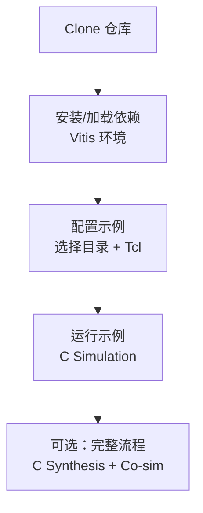
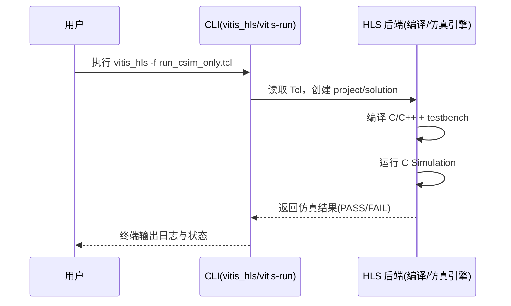

# Vitis-HLS-Introductory-Examples：15 分钟快速上手（Getting Started）

> 目标读者：刚发现这个仓库、希望**本地快速跑通一个示例**的开发者。  
> 语言：中文；流程以 Linux 终端为例。

---

## 0) 先看整体流程





---

## 1) 前置条件（Prerequisites）

### 1.1 需要的软件与版本

| 项目 | 是否必须 | 建议版本 | 说明 |
|---|---|---|---|
| AMD Vitis / Vitis HLS | 是 | **2023.1+**（示例文档明确测试过 2023.1） | 运行 HLS 脚本 |
| Git | 是 | 任意新版本 | 克隆仓库 |
| Bash Shell | 是 | Linux/macOS 常见 shell | 执行命令 |
| Python | 否 | 3.8+ | 仅当你跑 `run.py` |
| API Key | 否 | 无 | 本仓库不需要云端 API Key |

### 1.2 环境变量

- 必需：加载 Vitis 环境脚本（通常是 `settings64.sh`）
- 常见变量：`XILINX_VITIS`, `PATH`, `LD_LIBRARY_PATH`
- 本仓库**不需要额外 token / key**

---

### 步骤 1：检查 Git

**命令**
```bash
git --version
```

**期望输出**
```text
git version 2.x.x
```

**最可能错误 & 修复**
- 错误：`git: command not found`
- 修复：安装 Git（Ubuntu: `sudo apt-get install -y git`）

---

### 步骤 2：加载 Vitis 环境

> 把路径改成你的实际安装目录。

**命令**
```bash
source /tools/Xilinx/Vitis/2023.2/settings64.sh
echo $XILINX_VITIS
```

**期望输出**
```text
/tools/Xilinx/Vitis/2023.2
```
（第一条 `source` 通常无输出）

**最可能错误 & 修复**
- 错误：`No such file or directory`
- 修复：确认安装路径，`find /tools -name settings64.sh 2>/dev/null`

---

### 步骤 3：检查 Vitis HLS 命令可用

**命令**
```bash
vitis_hls -version
```

**期望输出**
```text
Vitis HLS <version>
```

**最可能错误 & 修复**
- 错误：`vitis_hls: command not found`
- 修复：回到步骤 2，重新 `source settings64.sh`

---

## 2) 安装（Installation）

### 步骤 1：克隆仓库

**命令**
```bash
git clone https://github.com/Xilinx/Vitis-HLS-Introductory-Examples.git
cd Vitis-HLS-Introductory-Examples
```

**期望输出**
```text
Cloning into 'Vitis-HLS-Introductory-Examples'...
...
```

**最可能错误 & 修复**
- 错误：网络超时 / TLS 错误
- 修复：重试；必要时切换网络或配置代理

---

### 步骤 2：进入一个稳定示例目录（FFT stream）

**命令**
```bash
cd Misc/fft/interface_stream
ls
```

**期望输出（示例）**
```text
data  fft_tb.cpp  fft_top.cpp  fft_top.h  run_hls.tcl  run.py  README
```

**最可能错误 & 修复**
- 错误：`No such file or directory`
- 修复：确认你在仓库根目录后再 `cd Misc/fft/interface_stream`

---

### 步骤 3：确认脚本文件存在

**命令**
```bash
ls run_hls.tcl run.py fft_top.cpp fft_tb.cpp
```

**期望输出**
```text
run_hls.tcl
run.py
fft_top.cpp
fft_tb.cpp
```

**最可能错误 & 修复**
- 错误：`cannot access ...`
- 修复：检查目录是否正确、仓库是否完整克隆

---

## 3) 首次运行（First Run：可在 15 分钟内完成）

> 为了快速成功，我们先跑 **C Simulation only**（最快）。  
> 完整流程（综合/协同仿真）放在后面“可选步骤”。

### 步骤 1：创建最小 Tcl（只跑 C 仿真）

**命令**
```bash
cat > run_csim_only.tcl <<'EOF'
open_project -reset proj_qs
set_top fft_top
add_files fft_top.cpp
add_files -tb fft_tb.cpp
open_solution -reset solution1
set_part {xcvu9p-flga2104-2-i}
create_clock -period 3.3 -name default
csim_design
exit
EOF
```

**期望输出**
- 无输出（成功返回 shell）

**最可能错误 & 修复**
- 错误：权限问题（只读目录）
- 修复：切换到可写目录，或检查 `pwd` 后重试

---

### 步骤 2：运行 C 仿真

**命令**
```bash
vitis_hls -f run_csim_only.tcl | tee csim.log
```

**期望输出（关键片段，版本间会略有差异）**
```text
INFO: [HLS ...] Opening project 'proj_qs'
INFO: [HLS ...] Running C simulation ...
...
CSim done with 0 errors.
```

**最可能错误 & 修复**
- 错误：`vitis_hls: command not found`
- 修复：重新 `source .../settings64.sh`

---

### 步骤 3：快速验证结果

**命令**
```bash
grep -Ei "CSim done|error|fail|pass" csim.log | tail -n 10
```

**期望输出（示例）**
```text
CSim done with 0 errors.
```

**最可能错误 & 修复**
- 错误：`csim.log: No such file or directory`
- 修复：确认上一步是否执行成功；检查当前目录

---

### （可选）步骤 4：跑仓库原生完整脚本（更慢）

**命令**
```bash
vitis-run --mode hls --tcl run_hls.tcl
```

**期望输出**
- 依次看到 C Simulation / C Synthesis / Co-Simulation 阶段日志  
- 最终状态为成功（无 ERROR）

**最可能错误 & 修复**
- 错误：License checkout 失败 / cosim 太慢
- 修复：先只跑 C 仿真；确认许可证与仿真器环境后再跑完整流程

---

## 4) 配置说明（Configuration）

> 该仓库示例主要通过 Tcl 或 Python 脚本配置。常见关键项如下：

| 名称 | 必填 | 默认值（示例） | 说明 |
|---|---|---|---|
| `set_top` | 是 | `fft_top` | 顶层待综合函数名 |
| `set_part` | 是 | `xcvu9p-flga2104-2-i` | 目标 FPGA 器件 |
| `create_clock -period` | 是 | `3.3` (ns) | 目标时钟周期 |
| `open_project -reset` | 建议 | `proj_qs` | 工程目录名（`-reset` 会清理旧工程） |
| `open_solution -reset` | 建议 | `solution1` | 解决方案目录名 |
| `csim_design` | 否（但推荐） | 开启 | C 级功能仿真 |
| `csynth_design` | 否 | 关闭（在 quickstart 中） | C 综合（耗时增加） |
| `cosim_design` | 否 | 关闭（在 quickstart 中） | C/RTL 协同仿真（更耗时） |

### 步骤：查看当前 Tcl 关键配置

**命令**
```bash
grep -E "set_top|set_part|create_clock|csim_design|csynth_design|cosim_design" run_csim_only.tcl
```

**期望输出**
```text
set_top fft_top
set_part {xcvu9p-flga2104-2-i}
create_clock -period 3.3 -name default
csim_design
```

**最可能错误 & 修复**
- 错误：`run_csim_only.tcl` 不存在
- 修复：回到“首次运行-步骤1”重新创建

---

## 5) 新手最常见错误（Common Errors）

1. **`vitis_hls: command not found`**  
   修复：重新执行 `source <Vitis>/settings64.sh`。

2. **在错误目录执行脚本（找不到 `fft_tb.cpp` / `data`）**  
   修复：先 `cd Misc/fft/interface_stream` 再运行。

3. **器件名无效（`set_part` 报错）**  
   修复：替换为你安装版本支持的器件；可先用示例默认值。

4. **完整流程耗时太长，不到 15 分钟跑不完**  
   修复：先跑 `csim_design`（本指南的 quickstart），再逐步加 `csynth`/`cosim`。

5. **许可证相关报错（综合/协同仿真阶段）**  
   修复：确认 License 服务可用；先用 C 仿真验证代码正确性。

---

## 6) 下一步（Next Steps）

- **Beginner's Guide**：[`guide-beginners-guide.md`](guide-beginners-guide.md)
- **Build & Code Organization**：[`guide-build-and-organization.md`](guide-build-and-organization.md)
- **模块文档（MODULE docs）**  
  - [`coding_modeling.md`](coding_modeling.md)  
  - [`interface_design.md`](interface_design.md)  
  - [`optimization_parallelism.md`](optimization_parallelism.md)  
  - [`libraries_migration.md`](libraries_migration.md)
- 官方参考：Vitis HLS 用户指南 UG1399  
  https://docs.amd.com/r/en-US/ug1399-vitis-hls

> 如果你愿意，我可以在下一条消息里再给你一个“**只改 3 行 Tcl 就能从 csim 升级到 csynth**”的最小增量版本。