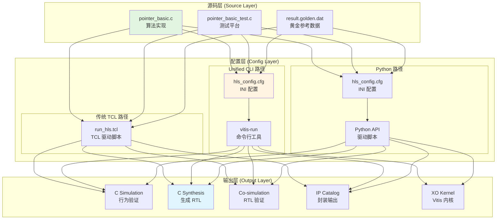

# libraries_migration 模块深度解析

## 一句话概括

`libraries_migration` 是 HLS（高层次综合）工具链的**方言翻译器**——它将同一个算法设计用多种不同的 HLS 流程语言（TCL 脚本、INI 配置文件、C++ 头文件）表达出来，让开发者能够在 Vivado HLS 传统流程、Vitis Unified CLI 新流程、以及 Python 驱动流程之间无缝迁移。

---

## 问题空间：为什么需要这个模块？

想象你是一位 FPGA 算法工程师，你的团队在过去五年积累了几百个 HLS 设计，全部使用 Vivado HLS 的 TCL 脚本（`run_hls.tcl`）进行编译。突然，Xilinx 推出了 Vitis Unified 平台，宣称新流程更快、更灵活，但要求你使用 INI 格式的配置文件（`hls_config.cfg`）。

你面临的选择是：

1. **重写所有脚本**：几百个 TCL 文件手工转成 INI，耗时数月，极易出错。
2. **维护两套代码**：任何算法改动需要在两个地方同步更新，维护噩梦。
3. **彻底放弃旧流程**：但客户可能还在用旧版 Vivado，你必须兼容。

`libraries_migration` 提供了第四条路：**用一套 C/C++ 源码，搭配多套构建配置**。它展示了同一个 `pointer_basic` 算法，如何被三种不同的 HLS 流程（TCL、Unified CLI INI、Python 驱动 INI）编译。开发者可以参照这些示例，为自己的设计快速创建迁移配置。

---

## 心智模型：把 HLS 编译想象成**多语言翻译**

理解这个模块的最佳比喻是**罗塞塔石碑**——古埃及的同一篇诏书用三种文字刻写，让现代学者得以破译象形文字。

在这个模型中：

- **算法源码**是"真理的源头"，用 C/C++ 描述数学运算。
- **TCL/INI 配置文件**是"方言"，告诉 HLS 工具如何编译源码。
- **模块的目录结构**（`tcl_scripts/`、`vitis_unified_cli/`、`python_scripts/`）就是"词典"，组织不同方言的示例。

理解了这个模型，你就能快速定位：如果你想把旧 TCL 流程迁移到新 Unified 流程，应该对比 `run_hls.tcl` 和 `hls_config.cfg` 中同一算法的配置差异。

---

## 架构全景：数据如何流经这个模块



### 关键路径解析

#### 路径 1：传统 TCL 流程（Legacy Path）
```
pointer_basic.c ──► run_hls.tcl ──► vivado_hls ──► [csim] ──► [csynth] ──► [cosim] ──► IP
```

这是 Vivado HLS 的经典工作流。TCL 脚本以**过程式**风格描述整个编译流程：先打开项目，添加文件，设置顶层，然后按顺序执行各个阶段。这种风格的好处是**显式控制**——你可以在任意两个步骤之间插入自定义命令；坏处是**冗长且难以复用**——每个项目都要复制一份相似的 TCL 代码。

#### 路径 2：Unified CLI 流程（Modern Path）
```
pointer_basic.c ──► hls_config.cfg ──► vitis-run ──► [csim/synth/cosim/export]
```

Vitis Unified 平台引入了**声明式**配置。你不再写"先做这个再做那个"，而是写"这是一个 HLS 组件，有这些属性"。`hls_config.cfg` 文件用 INI 格式声明：

- `[hls]` 节：时钟、流程目标、顶层函数
- `syn.file`：综合源文件
- `tb.file`：测试平台文件
- `syn.directive.*`：优化指令

这种声明式风格的优点是**简洁、可读、易于版本控制**；缺点是**灵活性受限**——如果你需要复杂的条件逻辑（"只在仿真通过后综合"），就必须在外层用 Python 或 shell 脚本包装。

#### 路径 3：Python 驱动流程（Automation Path）

Python 路径与 Unified CLI 共享相同的 `hls_config.cfg` 格式，但调用方式不同：

```python
# 伪代码示例
from vitis_hls import HLSComponent

comp = HLSComponent("pointer_basic")
comp.load_config("hls_config.cfg")
comp.run_csim()
comp.run_csynth()
comp.run_cosim()
```

这条路径的价值在于**可编程自动化**。当你需要批量处理几十个设计、执行参数扫描、或集成到 CI/CD 流水线时，Python API 比手工编辑配置文件高效得多。

---

## 核心组件深度解析

### 1. `run_hls.tcl` —— 传统 TCL 流程的完整蓝图

**设计意图**：这个脚本是一份**完整的 HLS 工作流文档**。它不只是一个"脚本"，而是 Xilinx 官方推荐的 Vivado HLS 标准流程的**可执行规范**。

**关键设计选择**：

| 元素 | 目的 | 隐含假设 |
|------|------|----------|
| `open_project -reset` | 强制干净构建 | 磁盘上的旧结果不可信 |
| `set hls_exec` 变量 | 阶段化执行控制 | 调试时需要部分重跑 |
| `set_directive_interface -mode m_axi` | 将指针映射到 AXI4-Full | 设计要访问片外 DRAM |
| `cosim_design -trace_level all` | 生成 VCD 波形 | RTL 调试需要信号级可见性 |

**为什么用 `hls_exec` 而不是函数或循环？**

TCL 的 `if/elseif` 链看起来笨拙，但它是**有意为之的显式控制**。在 HLS 开发中，你可能今天只想跑 C 仿真（`hls_exec=0`），明天想合成（`hls_exec=1`），后天要做联合仿真（`hls_exec=2`）。用变量+条件分支，你只需要改一个数字，而不需要注释/取消注释大段代码。

### 2. `run_vitis_unified.tcl` —— 新流程的过渡桥梁

与 `run_hls.tcl` 相比，只有两个关键差异：

| 旧命令 | 新命令 | 语义差异 |
|--------|--------|----------|
| `open_project` | `open_component` | "Project" 是 Vivado HLS 的概念；"Component" 是 Vitis 平台的统一概念，可复用于 HLS、AI Engine 等 |
| `-flow_target vivado` | `-flow_target vivado` | 显式声明目标流程，为未来支持其他后端（如 `versal`）预留扩展 |

**设计意图**：这个文件是**迁移路径的明确标记**。它告诉用户："如果你的团队正在从 Vivado HLS 向 Vitis 迁移，这是你需要的最小改动——只需改两个命令，其余逻辑完全兼容。

### 3. `hls_config.cfg` —— 声明式配置的崛起

与 TCL 脚本对比，这个配置文件的**信息量密度**显著提升：

| 概念 | TCL 表达 | INI 表达 | 优势 |
|------|----------|----------|------|
| FPGA 器件 | `set_part {xcvu9p...}` | `part=xcvu9p...` | 更简洁，无花括号语法噪音 |
| 时钟约束 | `create_clock -period 4` | `clock=4ns` | 单位显式（ns），自文档化 |
| 优化指令 | `set_directive_interface -mode m_axi ...` | `syn.directive.interface=...` | 层级命名空间（`syn.directive`），易于扩展 |
| 流程目标 | `-flow_target vivado` 命令行参数 | `flow_target=vivado` | 配置与执行分离，同一配置可被不同工具消费 |

**设计意图**：`hls_config.cfg` 代表了**构建配置的范式转移**——从"怎么做"（过程式 TCL）到"是什么"（声明式 INI）。这个转变背后是硬件开发流程的软件工程化趋势：

- **版本控制友好**：INI 的 diffs 可读性强于 TCL（想想 `set hls_exec 2` 改成 `set hls_exec 3` 在 diff 中的上下文）。
- **工具链无关**：同一份 `hls_config.cfg` 可以被 `vitis-run` 命令行工具消费，也可以被 Python API 加载，无需修改。
- **生成与模板**：INI 结构简单，易于用 Jinja2 或 Go 模板生成，适合大规模参数扫描或 CI/CD 集成。

**关键设计细节**：注意 `syn.directive.interface=pointer_basic mode=m_axi depth=1 d` 这一行。它将原本需要多行 TCL 表达的指令压缩成单行，但通过**约定式空格分隔**（`mode=m_axi`、`depth=1`、`d` 分别对应模式、深度、参数名）保持了可读性。这是一种务实的简化——INI 格式不支持 TCL 的嵌套列表，但通过规范的命名约定，仍然可以表达复杂的多参数指令。

### 4. DSP 与 FFT 示例 —— 复杂 IP 的集成模式

#### DSP Intrinsic Library（FIR 滤波器）

**关键差异点**：

| 属性 | pointer_basic 示例 | systolic_fir 示例 | 设计意图 |
|------|-------------------|-------------------|----------|
| FPGA 器件 | `xcvu9p` (Virtex UltraScale+) | `xcvp1702` (Versal Premium) | 展示新架构支持 |
| 时钟 | 4ns (250 MHz) | 800MHz (1.25ns) | 展示高频设计约束 |
| 流程目标 | `vitis` / `vivado` | `vivado` | 根据目标平台选择 |
| 特殊选项 | 无 | `csim.code_analyzer=0` | 禁用代码分析以加速编译 |

**`csim.code_analyzer=0` 的隐含假设**：这个选项禁用 Vitis HLS 的静态代码分析器，该分析器会在 C 仿真前检查潜在的未定义行为（如数组越界、空指针解引用）。在 DSP 内核这类**计算密集型、边界条件已知**的设计中，开发者可能已经通过手工验证或形式化方法确保了安全性，因此可以安全地禁用分析器以换取更快的编译迭代速度。这是一个**性能与安全性权衡**的典型示例——选择信任开发者的验证工作，而非工具的自动化检查。

#### FFT 实现：数组 vs 流式接口的对比

```cpp
// interface_array/fft_top.h
void fft_top(bool direction, cmpxDataIn in[FFT_LENGTH],
             cmpxDataOut out[FFT_LENGTH], bool* ovflo);

// interface_stream/fft_top.h  
void fft_top(bool direction, hls::stream<cmpxDataIn>& in,
             hls::stream<cmpxDataOut>& out, bool* ovflo);
```

**设计意图**：这两个头文件展示了**同一算法（FFT）的两种硬件接口契约**。选择哪种接口不是审美偏好，而是**系统架构决策**：

| 维度 | 数组接口 (`cmpxDataIn in[]`) | 流式接口 (`hls::stream<>`) |
|------|------------------------------|---------------------------|
| **数据生产模式** | 批量（Burst）：一次性交付整个帧 | 流式（Streaming）：逐个样本到达 |
| **缓冲区需求** | 需要片外或片内全帧缓冲 | 仅需浅层 FIFO 缓冲 |
| **延迟特征** | 启动延迟高（等待整帧），吞吐量大 | 启动延迟低（样本级流水线），吞吐量受流水线深度限制 |
| **适用场景** | 离线批处理（如医学成像重建） | 实时信号处理（如 5G 基带处理） |
| **HLS 综合约束** | 需要显式 `m_axi` 接口声明，Burst 长度优化关键 | 需要 `hls::stream` 模板，FIFO 深度配置关键 |

**关键的隐含契约**：

1. **数组接口的 `restrict` 假设**：在数组版本中，如果 `in` 和 `out` 指向重叠内存，硬件行为将是未定义的。HLS 工具默认假设指针不别名（no-alias），除非显式标记 `restrict` 或 `#pragma HLS DEPENDENCE`。这是 C 语言软件语义与硬件并行执行之间的**语义鸿沟**——在软件中，重叠数组只是性能问题；在硬件中，它意味着竞争条件和错误结果。

2. **流式接口的阻塞语义**：`hls::stream` 的 `read()` 和 `write()` 是**阻塞操作**——如果 FIFO 为空时读，或为满时写，硬件线程将停顿（stall）。这与软件线程的阻塞不同：在硬件中，这是一个**时钟级精确的流水线气泡**，会影响整个数据通路的吞吐量。设计者必须通过 FIFO 深度配置和流量控制（back-pressure）分析，确保上下游生产消费速率的匹配。

---

## 杂项示例的设计意图

### `malloc_removed` —— 硬件可综合性的边界

**核心问题**：标准 C 的 `malloc/free` 在 FPGA 硬件中是**不可综合的**。原因：

1. **动态内存分配需要操作系统支持**：`malloc` 依赖 Linux 的 `brk`/`mmap` 系统调用或嵌入式 RTOS 的堆管理器，而裸机 FPGA 逻辑没有这些。
2. **硬件内存是静态分区的**：FPGA 上的 BRAM/URAM 在比特流加载时即固定分配，无法像软件堆那样动态增长或收缩。
3. **指针分析的不可判定性**：HLS 工具无法静态确定 `malloc` 返回的指针指向多大的内存块，因此无法进行地址生成、冲突分析和流水线调度。

**解决方案**：这个示例展示了如何将 `malloc` 模式改写为**静态数组 + 索引管理器**：

```c
// 不可综合的动态分配
int* buf = malloc(N * sizeof(int));
buf[i] = data;
free(buf);

// 可综合的静态池分配
static int buf_pool[MAX_N];
static int buf_valid[MAX_N] = {0};  // 分配标记

int idx = find_free_slot(buf_valid, MAX_N);
buf_pool[idx] = data;
buf_valid[idx] = 1;  // 标记占用
// ... 使用完毕后 ...
buf_valid[idx] = 0;  // 释放回池
```

**关键洞察**：`malloc_removed` 这个名字不是描述"我们移除了 malloc"，而是**强调一个负向约束**——在这个设计的可综合版本中，`malloc` 必须被移除。这是一个典型的**硬件-软件语义鸿沟**：同样的算法概念（动态缓冲区）在软件中用一种抽象表达（`malloc`），在硬件中必须用完全不同的抽象（静态池 + 自由列表）表达。

### `rtl_as_blackbox` —— 异构集成的契约

**核心场景**：你的团队有一个关键的时序敏感模块，已经用 Verilog/VHDL 手工优化到极致，HLS 生成的 RTL 无法达到同样的性能。你需要在 HLS 设计中**实例化这个手工 RTL 模块**。

**解决方案**：Vitis HLS 的**黑盒（Black Box）**机制允许你在 C++ 代码中声明一个函数，但告诉 HLS 工具："这个函数的实现不在 C 代码中，而在指定的 RTL 文件中。"

```cpp
// example.cpp 中的黑盒声明
extern "C" void my_rtl_module(int* in, int* out, int n);

void example(int* in, int* out, int n) {
    // ... 一些 HLS 代码 ...
    my_rtl_module(in, out, n);  // 实例化黑盒
    // ... 更多 HLS 代码 ...
}
```

**`rtl_model.json` 的契约内容**：

这个 JSON 文件是**C 声明与 RTL 实现之间的形式化契约**，包含：

1. **端口映射**：C 函数的参数名、数据类型、方向（输入/输出）如何对应到 RTL 模块的端口名和位宽。
2. **时序协议**：RTL 模块期望的握手信号（`ap_start`, `ap_done`, `ap_idle`）和时序约束。
3. **资源需求**：BRAM、DSP、LUT 的预估消耗，用于 HLS 的整体资源规划。
4. **流水线行为**：如果 RTL 内部有流水线，需要声明启动间隔（II）和延迟，让 HLS 调度器能正确安排调用时机。

**关键洞察**：`rtl_as_blackbox` 不是简单的"导入外部代码"，而是**在异构抽象层之间建立严格的形式化契约**。C/C++ 是顺序执行的软件抽象，RTL 是并行时钟驱动的硬件抽象，两者的语义鸿沟比 C 与汇编之间的鸿沟更深。黑盒机制通过 JSON 契约强制要求开发者显式声明所有时序、资源、协议细节，避免 HLS 工具对 RTL 内部行为做出错误假设。

---

## 设计权衡与决策记录

### 决策 1：TCL vs INI —— 过程式与声明式的哲学分歧

**选择**：同时支持两种格式，但示例代码展示从 TCL 向 INI 迁移。

**权衡分析**：

| 维度 | TCL 过程式 | INI 声明式 | 模块的选择 |
|------|-----------|-----------|-----------|
| **表达力** | 高：条件、循环、函数 | 低：静态键值对 | 保留 TCL 用于复杂场景 |
| **可读性** | 中：命令序列需理解 | 高：结构一目了然 | 推广 INI 用于标准场景 |
| **工具支持** | 弱：需 TCL 解释器 | 强：标准解析库 | INI 更易集成现代工具链 |
| **版本控制** | 中：diff 可读 | 高：diff 非常清晰 | INI 更友好 |
| **调试** | 难：需跟踪执行 | 易：静态检查 | INI 错误更易定位 |

**为何不完全放弃 TCL？**

某些高级场景仍需过程式控制：
- 参数扫描：对 N 个不同时钟周期自动运行综合。
- 条件执行：只有在上一步通过后，才执行联合仿真。
- 动态文件生成：根据运行时的环境变量生成临时约束文件。

---

## 新贡献者必读：陷阱与最佳实践

### 陷阱 1：`syn.top` 名称不匹配

**症状**：HLS 报告 "Top function not found" 或链接错误。

**根因**：`hls_config.cfg` 中的 `syn.top=pointer_basic` 与 C 文件中的函数签名不一致（如 `void Pointer_Basic(...)` 大小写不同，或 `int pointer_basic(...)` 返回类型不同）。

**修复**：确保完全一致，包括大小写。建议用 `nm` 或 `objdump` 检查编译后的符号表。

### 陷阱 2：AXI 接口 `depth` 过小导致死锁

**症状**：联合仿真挂起，或硬件测试时 DMA 超时。

**根因**：`depth=1` 意味着接口只能有一个未完成事务。如果设计尝试在收到前一个响应前发出新请求，就会被卡住。

**修复**：增加到 `depth=16` 或更大，或重构代码确保请求-响应配对。

### 陷阱 3：流式 FIFO 深度不足

**症状**：流水线吞吐量低于理论值，II 被意外增加。

**根因**：`hls::stream` 默认深度可能小于上下游的生产消费速率差，导致频繁阻塞。

**修复**：显式指定深度 `#pragma HLS stream variable=my_stream depth=16`，并根据数据流分析调整。

### 最佳实践清单

1. **始终使用 `extern "C"`**：即使是 C++ 设计，顶层函数也应用 `extern "C"` 包裹，防止名称修饰导致链接失败。

2. **分离黄金数据**：测试向量（input/output）应放在独立的 `.dat` 文件中，而不是硬编码在测试平台代码里。这支持数据驱动的回归测试。

3. **版本控制配置，不控制生成的 RTL**：`.gitignore` 应排除 `proj_*/`、`solution1/` 等生成目录，但保留 `.tcl` 和 `.cfg` 源文件。

4. **使用相对路径**：`syn.file=../pointer_basic.c` 比绝对路径更利于团队协作和 CI/CD 移植。

---

## 延伸阅读与参考链接

- [coding_modeling](coding_modeling.md) —— 相邻模块，更多 HLS 建模模式
- [interface_design](interface_design.md) —— 深入 AXI/Stream 接口设计
- [optimization_parallelism](optimization_parallelism.md) —— 并行优化策略

---

*文档版本：v1.0*  
*最后更新：基于 Vitis HLS / Vivado HLS 2023.x 版本*
