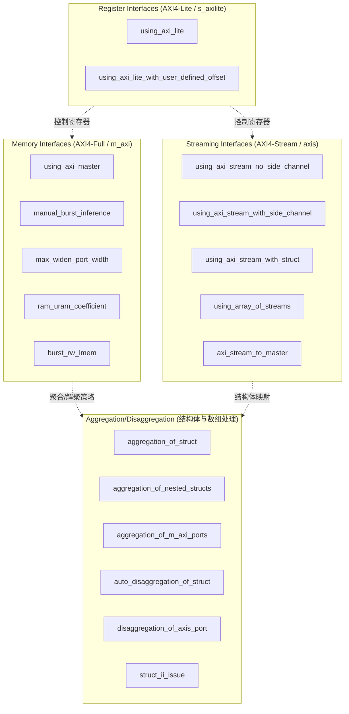

# Interface Design 模块技术深度解析

## 概述：为什么需要这个模块？

想象你正在设计一座连接两个城市的桥梁——一边是软件世界（C/C++ 算法），另一边是硬件世界（FPGA 硅片）。这座桥梁必须能够处理不同类型的"交通"：大批量数据流、随机访问的内存请求、以及控制寄存器的配置命令。

**Interface Design 模块**正是这座桥梁的设计蓝图库。它解决的核心问题是：*如何将高级综合（HLS）生成的 C/C++ 函数，高效地映射到 FPGA 的物理接口协议上？*

在没有这些示例的情况下，开发者往往会在以下陷阱中挣扎：
- **协议不匹配**：将流式数据错误地映射到随机访问的 AXI4-Full 接口，导致性能灾难
- **聚合粒度不当**：结构体的字段排列方式导致 HLS 无法推断出高效的突发传输（burst）
- **控制路径混杂**：将标量控制信号与数据路径绑定，造成不必要的流水线停顿
- **II（Initiation Interval）违规**：数据依赖导致无法达到预期的吞吐率

这个模块通过**大量可运行的配置示例**，展示了从简单到复杂的各种接口设计模式，涵盖 AXI4-Stream、AXI4-Full（Master/Slave）、AXI4-Lite 以及它们之间的组合与转换。

---

## 架构全景：数据如何在模块中流动

### 核心抽象：三层映射模型

在理解这个模块之前，你需要建立以下**心智模型**：

```
┌─────────────────────────────────────────────────────────────┐
│  Layer 3: C/C++ 语义层                                       │
│  - 函数参数、结构体、数组、指针                                │
│  - 流式数据 (hls::stream)、ap_int/ap_fixed                   │
└─────────────────────────────────────────────────────────────┘
                              ↓  HLS 综合推断 / 用户显式约束
┌─────────────────────────────────────────────────────────────┐
│  Layer 2: 逻辑接口层 (HLS IR)                                │
│  - AXI4-Stream (axis), AXI4-Full (m_axi/s_axi)               │
│  - 突发长度、数据宽度、对齐方式                                │
│  - 聚合/解聚策略 (Aggregation/Disaggregation)                │
└─────────────────────────────────────────────────────────────┘
                              ↓ Vivado/Vitis 后端实现
┌─────────────────────────────────────────────────────────────┐
│  Layer 1: 物理协议层 (FPGA 硬核)                              │
│  - AXI4-Stream wires (TDATA, TVALID, TREADY, TLAST)          │
│  - AXI4-Full 地址/数据/响应通道                               │
│  - DDR/HBM 内存控制器、PCIe 集成                              │
└─────────────────────────────────────────────────────────────┘
```

**关键洞察**：Layer 2 是这个模块的核心关注点。它既不是纯粹的软件（C++ 语法），也不是纯粹的硬件（Verilog 网表），而是 HLS 工具用来**桥接两者的中间表示（IR）**。这个模块中的每一个 `hls_config.cfg` 文件，本质上都是在向 HLS 编译器描述如何将 Layer 3 的 C++ 结构映射到 Layer 2 的逻辑接口。

### 组件分类与数据流拓扑

模块内的组件可以按照**接口协议类型**和**数据流动模式**进行组织：



**数据流动模式分析**：

1. **C++ 结构体 → AXI 接口（Aggregation）**：
   - 输入：C++ 结构体（包含多个字段，可能是嵌套的）
   - 处理：HLS 推断如何将结构体字段打包到 AXI 数据总线
   - 输出：单个 AXI4-Stream 或 AXI4-Full 接口，数据宽度可能是 32/64/128/256/512 位
   - **关键决策点**：字段排列顺序、对齐填充、是否启用自动解聚（auto-disaggregation）

2. **AXI 接口 → C++ 结构体（Disaggregation）**：
   - 输入：原始 AXI 数据流
   - 处理：根据数据宽度将总线拆分为独立的变量/结构体
   - 输出：C++ 代码中可直接使用的独立变量
   - **关键决策点**：解聚粒度（按字节、按字、按结构体字段）、边带数据（side-channel data）处理

3. **内存访问模式（Memory Interfaces）**：
   - 输入：指针参数（如 `int* data`）
   - 处理：HLS 推断突发传输长度、数据宽度扩展（widen）、对齐约束
   - 输出：AXI4-Full (m_axi) 接口，带有 AR/AW/R/W/B 通道
   - **关键决策点**：手动突发 vs 自动推断、最大位宽扩展、条件分支对突发的影响

4. **流式数据转换（Streaming to Memory）**：
   - 输入：AXI4-Stream（无地址，仅数据流）
   - 处理：内部缓冲、突发组装（burst assembly）、地址生成
   - 输出：AXI4-Full（面向内存的突发传输）
   - **关键决策点**：缓冲深度、突发阈值、背压（back-pressure）处理

---

## 核心组件深度解析

### 1. 聚合与解聚（Aggregation/Disaggregation）

这一组配置示例处理**复合数据类型（结构体、数组）**如何映射到物理接口上。这是 HLS 设计中最容易出错也最关键的部分。

#### 1.1 `aggregation_of_struct` —— 结构体聚合基础

**核心问题**：当 C++ 函数参数是一个结构体时，HLS 如何将其打包到 AXI 数据总线上？

**配置要点**（推断自模式）：
- `flow_target`: vivado / vitis（决定了生成的接口是 IP Catalog 格式还是 XO 内核格式）
- `syn.top`: 顶层函数名（如 `dut`）
- 关键 HLS 指令（在 `example.cpp` 中，不在 cfg 中）：
  ```cpp
  #pragma HLS aggregate variable=arg1 compact=bit
  ```

**设计原理**：
- **Bit-level packing**: HLS 将结构体的各个字段紧密打包，消除 C++ 通常插入的填充字节（padding）。这允许 8 位、16 位、32 位字段混合的结构体被高效地装入 64 位或 128 位 AXI 总线。
- **Endianness**: 默认使用 little-endian 打包，与 x86/ARM 处理器兼容。

**权衡（Tradeoffs）**:
- **Compact vs. Access efficiency**: 紧密打包节省了总线带宽，但可能增加内部逻辑复杂度（需要移位和掩码操作来提取字段）。如果结构体字段在函数内部被频繁随机访问，解聚（disaggregation）成独立端口可能更高效。

#### 1.2 `aggregation_of_nested_structs` —— 嵌套结构体的递归聚合

**核心问题**：当结构体内部嵌套另一个结构体时，HLS 如何递归地展平（flatten）并打包？

**关键洞察**：
- HLS 的聚合是**递归的**。`#pragma HLS aggregate` 会深度遍历结构体的所有成员，包括嵌套的结构体实例。
- 最终生成的硬件接口是一个**扁平的位向量**（flat bit-vector），其宽度等于所有叶子字段宽度的总和。

**数据流示例**：
```
C++: struct Inner { uint8_t a; uint16_t b; };  // 24 bits
     struct Outer { Inner inner; uint32_t c; }; // 24 + 32 = 56 bits

Hardware AXI Stream: [c(32 bits) | b(16 bits) | a(8 bits)] = 56 bits total
                     (Note: actual packing order depends on endianness and pragma)
```

#### 1.3 `aggregation_of_m_axi_ports` —— 内存接口聚合

**核心问题**：如何将多个逻辑上的内存指针（如 `int* a`, `int* b`）聚合到单一的物理 AXI4-Full 接口上，以节省 FPGA IO 资源？

**设计原理**：
- 在典型的加速卡（如 Alveo）上，物理 DDR 内存通道数量有限（如 2-4 个）。如果每个指针都映射到独立的 `m_axi` 端口，很快会耗尽资源。
- HLS 支持**接口共享（interface sharing）**或**聚合（aggregation）**，通过 `bundle` 关键字将多个指针绑定到同一个 AXI4-Full 接口。

**关键配置**（在 C++ 代码中）：
```cpp
void dut(int* a, int* b, int* c) {
    #pragma HLS interface m_axi port=a bundle=gmem0
    #pragma HLS interface m_axi port=b bundle=gmem0  // 共享端口
    #pragma HLS interface m_axi port=c bundle=gmem1  // 独立端口
    // ...
}
```

**权衡**：
- **资源 vs 并行性**：共享接口减少资源，但创建访问瓶颈。如果 `a` 和 `b` 的访问在函数内是并行的（如在不同的 DATAFLOW 阶段），共享同一个 `m_axi` 端口会导致串行化，损害吞吐量。
- **地址空间复杂性**：共享接口意味着多个指针共享同一个地址空间，需要确保它们不会访问重叠的内存区域（除非故意设计如此）。

#### 1.4 `auto_disaggregation_of_struct` —— 自动解聚

**核心问题**：与聚合相反，有时我们需要将一个宽总线结构体**拆分**成独立的信号，以便下游逻辑可以直接访问各个字段而不需要移位操作。

**设计原理**：
- 当结构体作为**返回值**或通过 `ap_none`/`ap_stable` 接口传递时，解聚可以将各个字段映射到独立的引脚。
- `auto_disaggregation` 是 HLS 的一种推断行为，或者可以通过 `disaggregate` pragma 显式控制。

#### 1.5 `struct_ii_issue` —— 结构体引发的 II 问题

**核心问题**：结构体访问模式如何导致无法达到 II=1（每个周期启动一次迭代）？

**设计原理**：
- 如果结构体包含多个字段，且循环体内对这些字段的访问存在**读后写（RAW）**或**写后读（WAR）**依赖，HLS 无法流水线化到 II=1。
- 例如：
  ```cpp
  for (int i = 0; i < N; i++) {
      #pragma HLS PIPELINE II=1  // 可能失败
      s.x = s.y + 1;  // 读 s.y，写 s.x —— 如果 s.x 和 s.y 是同一资源的别名？
  }
  ```
- 解决方案可能包括：将结构体拆分为独立数组、使用 `hls::vector`、或添加 `dependence` pragma 告知 HLS 无真实依赖。

---

### 2. 内存接口（Memory Interfaces）

这一组配置专注于 **AXI4-Full (m_axi)** 接口的优化，这是 FPGA 与外部 DDR/HBM 内存通信的主要方式。

#### 2.1 `using_axi_master` —— 基础 AXI Master 配置

**核心目的**：展示最基本的 `m_axi` 接口配置。

**关键概念**：
- **突发传输（Burst Transfer）**：AXI 协议允许在一次地址请求后传输多个数据 beat。这比每次传输都发送地址要高效得多（减少了地址通道开销）。
- **数据宽度**：通常是 32、64、128、256、512 位。更宽的数据宽度意味着每个时钟周期可以传输更多数据。

**配置示例**（从代码片段推断）：
```cfg
flow_target=vitis
clock=200MHz
```
- Vitis 流程通常意味着生成 XO 内核文件，用于 Vitis 统一软件平台。
- 200MHz 是常见的目标频率，平衡了性能和布线难度。

#### 2.2 `manual_burst` 系列 —— 手动控制突发传输

这一系列示例（`manual_burst_inference_success`, `auto_burst_inference_failure`, `manual_burst_with_conditionals`）揭示了 HLS 中**最关键且最容易出错的优化之一：突发传输推断**。

**问题背景**：
- 理想情况下，当你写一个循环访问连续内存时，HLS 应该自动生成高效的 AXI 突发传输：
  ```cpp
  for (int i = 0; i < 1024; i++) {
      buf[i] = input[i];  // 期望：1次地址请求 + 1024个数据beat
  }
  ```
- 然而，**任何条件分支、非线性地址计算、或指针别名都可能破坏突发推断**。

**三个对比示例**：

1. **`manual_burst_inference_success`**：
   - 展示**成功的**手动控制。
   - 可能使用了 `memcpy` 或 `ap_int<>` 的块传输，或者确保循环体足够简单，让 HLS 能够识别出线性访问模式。
   - **关键技术**：`#pragma HLS pipeline` 配合简单的索引计算。

2. **`auto_burst_inference_failure`**：
   - 展示**失败场景**：同样的代码结构，可能因为某些微妙的因素（如条件判断、指针别名假设）导致 HLS 退化为**单次访问模式（single-beat transfers）**。
   - 性能后果：原本 1 个地址周期 + N 个数据周期，变成 N 个地址周期 + N 个数据周期，有效带宽可能下降 50% 以上。
   - **诊断方法**：查看 HLS 综合报告中的 "Burst" 分析部分。

3. **`manual_burst_with_conditionals`**：
   - 展示**带条件的突发访问**——更现实的场景。
   - 核心挑战：如果循环内有 `if (mask[i]) { ... }`，HLS 无法保证所有地址都被连续访问，因此可能拒绝生成突发。
   - **解决方案模式**：
     - 使用**预加载（preloading）**：先将数据读入本地 BRAM，然后在本地处理（牺牲一些 BRAM 资源换取突发效率）。
     - 使用**部分突发（partial bursts）**：手动控制地址指针，确保即使有条件判断，地址计算仍然是可预测的。

**设计权衡（Manual Burst Tradeoffs）**：

| 策略 | 优点 | 缺点 | 适用场景 |
|------|------|------|----------|
| **自动推断** | 代码简洁，可移植性好 | 容易受代码细节影响而失败 | 简单的连续内存访问模式 |
| **手动 memcpy** | 保证突发传输，性能可预测 | 需要额外的缓冲区（BRAM/URAM） | 复杂条件判断，需要预加载 |
| **ap_int<> 宽总线** | 最大化数据吞吐量 | 增加了数据对齐和打包复杂度 | 高带宽要求的内核 |

#### 2.3 `max_widen_port_width` —— 端口位宽扩展

**核心问题**：AXI 数据宽度对带宽的影响。

**数学关系**：
$$
Bandwidth = DataWidth \times Frequency \times Utilization
$$

- 如果数据宽度从 64 位提升到 512 位，在相同时钟频率下，理论带宽提升 8 倍。
- 然而，**位宽扩展要求数据在内存中是连续且对齐的**。

**配置细节**（从代码片段）：
```cfg
syn.interface.m_axi_alignment_byte_size=64
syn.interface.m_axi_max_widen_bitwidth=256
```

- `m_axi_alignment_byte_size=64`：要求内存访问按 64 字节（512 位）对齐。这是启用宽总线的前提。
- `m_axi_max_widen_bitwidth=256`：限制最大扩展位宽为 256 位。这是一个**折中**——可能是为了避免过宽的 AXI 总线消耗过多的 FPGA 路由资源，或者因为下游内存控制器不支持 512 位。

**设计权衡**：
- **宽总线（512-bit）**：最大化带宽，但需要严格的对齐和连续访问模式。如果访问模式是随机的（如哈希表查找），宽总线反而浪费（读出的很多字节不被使用）。
- **窄总线（64-bit）**：适应随机访问，带宽较低但资源消耗小，时序收敛更容易。
- **可配置位宽**：通过 `max_widen_bitwidth` 参数，允许开发者在带宽和资源/时序之间做权衡。

---

### 3. 寄存器接口（Register Interfaces）

这一组配置专注于 **AXI4-Lite (s_axilite)** 接口，用于**标量参数**和**控制寄存器**。

#### 3.1 `using_axi_lite` —— 基础寄存器接口

**核心目的**：展示如何使用 AXI4-Lite 接口传递标量参数（如 `int threshold`, `bool enable`）。

**关键概念**：
- **标量 vs 向量**：`s_axilite` 适用于标量（单个 int、float、指针地址本身）。数组或流应该使用 `m_axi` 或 `axis`。
- **控制路径分离**：AXI4-Lite 有独立的地址和数据通道，**不占用主数据路径的带宽**。这意味着你可以在计算进行的同时，通过 AXI4-Lite 读取状态寄存器或更新配置，而不会影响数据流的吞吐率。

**配置示例**：
```cpp
void example(int* data, int threshold) {
    #pragma HLS interface s_axilite port=threshold
    #pragma HLS interface m_axi port=data
    // ...
}
```

#### 3.2 `using_axi_lite_with_user_defined_offset` —— 用户自定义偏移

**核心问题**：在某些系统级设计中，你可能希望 HLS 生成的 IP 核的寄存器映射（register map）与系统中的其他 IP 核保持兼容，或者预留某些地址空间给其他用途。

**设计原理**：
- 默认情况下，HLS 自动为每个 `s_axilite` 参数分配偏移地址（通常从 0x10 或 0x20 开始，预留前几个给控制/状态寄存器）。
- 通过 `offset` 选项，你可以显式指定参数在 AXI4-Lite 地址空间中的位置。

**使用场景**：
- **IP 集成**：替换一个遗留 IP 核，必须保持寄存器地址不变，以免修改上层驱动软件。
- **多核通信**：多个 HLS 核共享一个 AXI4-Lite 互联，需要手动划分地址空间避免冲突。

---

### 4. 流式接口（Streaming Interfaces）

这一组配置是模块中**最丰富**的部分，专注于 **AXI4-Stream (axis)** 接口。这是 FPGA 数据处理的核心模式——连续、无地址的数据流。

#### 4.1 `using_axi_stream_no_side_channel` —— 纯数据流

**核心概念**：最简单的 AXI4-Stream 接口，只包含 `TDATA`、`TVALID`、`TREADY`。

**数据流分析**：
- **握手协议**：数据在 `TVALID && TREADY` 为高时传输。生产者用 `TVALID` 表示数据有效，消费者用 `TREADY` 表示可以接收。
- **无缓冲风险**：如果生产者速率和消费者速率不匹配，且没有 `hls::stream` 或 FIFO 缓冲，会导致死锁或数据丢失。

**HLS 实现细节**：
```cpp
void example(hls::stream<int>& in, hls::stream<int>& out) {
    #pragma HLS interface axis port=in
    #pragma HLS interface axis port=out
    #pragma HLS pipeline II=1
    
    while (!in.empty()) {
        int data = in.read();
        out.write(data * 2);
    }
}
```

#### 4.2 `using_axi_stream_with_side_channel` —— 带边带数据

**核心概念**：AXI4-Stream 协议支持**边带信号（side-channel signals）**：`TLAST`、`TKEEP`、`TSTRB`、`TUSER`。

**各信号意义**：
- **TLAST**: 标记数据包的最后一个字节。用于帧/包边界检测。
- **TKEEP/TSTRB**: 字节有效掩码。用于表示 `TDATA` 中哪些字节是有效的（用于非对齐传输或稀疏数据）。
- **TUSER**: 用户自定义的边带信息，如错误标志、时间戳、流 ID 等。

**设计模式**：
- **Packet processing**: 使用 `TLAST` 来识别数据包边界，对每个数据包应用不同的处理逻辑（如校验和计算）。
- **Byte masking**: 当数据宽度为 512 位（64 字节），但实际有效数据可能是任意长度时，使用 `TKEEP` 来标记最后一个有效字节。

#### 4.3 `using_axi_stream_with_struct` —— 结构体与流

**核心问题**：如何将自定义结构体（如包含多个字段的数据包）通过 AXI4-Stream 传输？

**设计模式**：
- **整体打包**：将整个结构体作为一个数据字（如果宽度允许）或连续多个数据字发送。
- **字段拆分**：将结构体字段映射到 `TDATA` 的不同位段，同时可能使用 `TUSER` 传输元数据。

**与 Aggregation 的关系**：
- 这个示例实际上结合了 **Aggregation**（结构体打包成宽总线）和 **Streaming**（通过 AXI4-Stream 传输）。

#### 4.4 `using_array_of_streams` —— 流数组

**核心概念**：创建 `hls::stream` 的数组，实现**多通道数据并行**。

**应用场景**：
- **多天线处理**：MIMO 系统中，每个天线接收的数据流独立处理。
- **多通道滤波器**：并行处理多个传感器的数据流。

**实现细节**：
```cpp
void dut(hls::stream<int> in[8], hls::stream<int> out[8]) {
    #pragma HLS interface axis port=in
    #pragma HLS interface axis port=out
    #pragma HLS array_partition variable=in complete
    #pragma HLS array_partition variable=out complete
    
    for (int i = 0; i < 8; i++) {
        #pragma HLS unroll
        process_stream(in[i], out[i]);
    }
}
```

**关键点**：
- `array_partition complete` 确保每个流通道有独立的硬件 FIFO，而不是共享存储。
- `unroll` 展开循环，创建 8 个并行的处理单元。

#### 4.5 `axi_stream_to_master` —— 流到内存的转换

**核心模式**：这是一个**数据格式转换器**，将 AXI4-Stream（适合流式处理）转换为 AXI4-Full（适合内存存储）。

**架构角色**：
- **输入**：高速、连续的 AXI4-Stream 数据（如来自 ADC、网络接口）。
- **内部**：使用 `hls::stream` 或 ping-pong buffer 进行缓冲。
- **输出**：面向 DDR 的 AXI4-Full 突发写操作。

**关键设计决策**：
- **突发组装（Burst Assembly）**：必须积累足够的数据（如 4KB 页对齐的突发）才能发起一次高效的 AXI 写操作。
- **背压处理（Back-pressure）**：当内存子系统繁忙时，AXI4-Full 的写响应通道会施加背压，必须通过 `hls::stream` 的 `full()` 检查或 AXI Stream 的 `TREADY` 来处理，避免数据丢失。

---

## 依赖关系与数据契约

### 向上依赖（谁调用这个模块？）

这个模块本质上是**示例代码库**，因此"调用者"不是运行时概念，而是：

1. **Vitis HLS 工具链**：
   - 每个 `hls_config.cfg` 文件是一个**综合配置脚本**。
   - 运行 `vitis_hls -f hls_config.cfg` 会读取这些配置，调用 HLS 前端解析对应的 `example.cpp`。

2. **开发者/CI 系统**：
   - 开发者将这些配置作为**参考设计（reference designs）**。
   - CI 系统运行这些配置来**回归测试** HLS 工具的新版本，确保示例仍然能综合出预期的接口。

### 向下依赖（这个模块调用谁？）

1. **外部 RTL/IP 核**（通过 Vivado/IP Integrator）：
   - 当 `flow_target=vivado` 且 `package.output.format=ip_catalog` 时，生成的 IP 核被实例化到 Vivado 设计中。
   - 它依赖于 Vivado 提供的 AXI Interconnect、DDR 控制器、PCIe DMA 等基础设施。

2. **Vitis 运行时（XRT）**（当 `flow_target=vitis`）：
   - 生成的 `.xo` 文件被 Vitis 链接器 (`v++ -l`) 集成到 XCLBIN 中。
   - 运行时，XRT（Xilinx Runtime）通过 `mmap` 将主机内存映射到 FPGA 的 AXI4-Full 接口，或通过 `xclWrite/Read` 访问 AXI4-Lite 寄存器。

### 数据契约（Interface Contracts）

每个示例都隐式定义了一组**契约**：

1. **协议契约**：
   - AXI4-Stream：必须遵守 `TVALID/TREADY` 握手，`TLAST` 标记包尾。
   - AXI4-Full：必须遵守地址/数据/响应通道的时序，突发长度不能超过 AXI 协议限制（通常 256 beats）。

2. **对齐契约**：
   - 当使用 `max_widen_bitwidth` 时，数据缓冲区必须在内存中按指定字节数对齐（如 64 字节），否则 HLS 无法生成高效的宽突发。

3. **生命周期契约**：
   - 当 `flow_target=vitis` 时，主机（Host）必须保证在 FPGA 内核执行期间，传递给 `m_axi` 指针的内存缓冲区保持有效（不被释放或重新分配）。

---

## 关键设计决策与权衡

### 1. Vivado vs Vitis 流程选择

**观察到的模式**：
- 大多数 Streaming 和 Aggregation 示例使用 `flow_target=vitis`，输出 `package.output.format=xo`。
- 部分 Memory 和 Register 示例使用 `flow_target=vivado`，输出 `package.output.format=ip_catalog`。

**权衡分析**：

| 维度 | Vitis Flow (`vitis`, `xo`) | Vivado Flow (`vivado`, `ip_catalog`) |
|------|---------------------------|-------------------------------------|
| **目标用户** | 软件开发者（使用 C++/OpenCL） | 硬件工程师（使用 RTL/Block Design） |
| **集成方式** | 通过 Vitis 链接器自动集成到 XCLBIN | 手动实例化到 Vivado IPI 框图中 |
| **接口假设** | 假设存在 XRT 运行时和特定 AXI 互联 | 灵活适应自定义 RTL 环境 |
| **调试工具** | xrt-smi, vitis_analyzer | ILA (Integrated Logic Analyzer), Vivado Simulator |
| **控制接口** | 自动生成 AXI4-Lite 用于 XRT 控制 | 用户显式指定 `s_axilite` 或自定义 RTL |

**决策洞察**：
- 选择 **Vitis** 意味着拥抱**平台化开发**：你接受 XRT 的抽象，换取更快的开发和跨平台可移植性（同样的 XO 文件可以在不同板卡上运行，只要它们支持 Vitis 平台）。
- 选择 **Vivado** 意味着追求**极致控制和优化**：你可以手动调整每个 AXI 端口的参数（如 QoS、时钟域跨越），集成自定义 RTL IP，或者针对没有 XRT 支持的小型 Zynq 项目进行开发。

### 2. 数据对齐与突发宽度（Alignment vs Burst Efficiency）

**观察到的配置**：
```cfg
syn.interface.m_axi_alignment_byte_size=64
syn.interface.m_axi_max_widen_bitwidth=256
```

**技术原理**：
- **对齐（Alignment）**：当 HLS 生成 AXI 地址时，如果它知道数据总是从 64 字节边界开始，它就可以**省略地址计算中的低 6 位**，并生成更宽的突发（burst）指令。
- **位宽扩展（Widening）**：当 `max_widen_bitwidth=256` 时，即使 C++ 代码中是 `int`（32 位）访问，HLS 会尝试**合并 8 个连续的 int 访问**成一个 256 位的 AXI 传输。

**权衡分析**：

| 策略 | 硬件资源 | 带宽效率 | 适用访问模式 | 风险 |
|------|---------|---------|--------------|------|
| **窄总线 (64-bit)** | 低（较少的 LUT/FF） | 低（地址开销占比高） | 随机访问，稀疏数据 | 突发利用率低 |
| **宽总线 (512-bit) + 强制对齐** | 高（宽数据通路，大 FIFO） | 极高（接近理论峰值） | 顺序扫描，矩阵块 | 如果数据未对齐，会触发错误或使用窄回退模式 |
| **可扩展位宽 (256-bit)** | 中等 | 中等（合并 8 个 int） | 混合模式 | 复杂的地址对齐逻辑 |

**决策洞察**：
- 选择 **64 字节对齐 + 256 位扩展** 是一种**保守的高性能策略**：它假设数据在内存中是结构化的（如数组 of structs），但不想承担 512 位带来的极端资源消耗和时序收敛难度。
- 如果目标平台是 HBM（高带宽内存），512 位甚至 1024 位可能是必须的，因为 HBM 的物理位宽就是 256 位/伪通道，需要并行访问多个伪通道来喂饱 HBM 带宽。

### 3. 流式处理中的背压与缓冲（Back-pressure vs Buffering）

**涉及的组件**：`using_axi_stream_with_side_channel`, `axi_stream_to_master`, `using_array_of_streams`

**技术原理**：
- **背压（Back-pressure）**：当生产者速度快于消费者时，如果不加以控制，数据会丢失。AXI4-Stream 使用 `TREADY` 信号实现背压——当消费者来不及处理时，拉低 `TREADY`，生产者检测到 `TREADY` 为低后停止发送 `TVALID`。
- **缓冲（Buffering）**：使用 `hls::stream` 或显式的 FIFO 来解耦生产者和消费者。即使消费者暂时停顿，生产者可以继续写入 FIFO（直到 FIFO 满），从而平滑速率波动。

**权衡分析**：

| 策略 | 延迟 | 吞吐量 | 资源消耗 | 复杂度 |
|------|------|--------|----------|--------|
| **无缓冲 (直通)** | 最低（组合逻辑延迟） | 受限于最慢阶段（同步锁步） | 极低（无 FIFO） | 低（无握手逻辑） |
| **浅缓冲 (深度 2-4)** | 低 | 允许短暂速率不匹配 | 低（小 FIFO） | 中等（握手逻辑） |
| **深缓冲 (深度 16-512)** | 较高（排队延迟） | 可容忍长停顿（如 DRAM 刷新） | 高（大 BRAM/URAM） | 高（流量控制、死锁避免） |

**决策洞察**：
- `using_array_of_streams` 选择**多通道 + 浅缓冲**：适合处理多路并行的低速数据流（如多传感器输入），避免一个通道的阻塞影响其他通道。
- `axi_stream_to_master` 选择**深缓冲 + 突发组装**：必须积累足够的数据（如 4KB）才能发起一次高效的 DRAM 突发写，因此需要深度 FIFO 来缓冲高速输入流，同时处理 DRAM 的背压。

---

## 新贡献者必读：陷阱、契约与调试技巧

### 1. 隐式契约：HLS 综合的"假设"

**最危险的假设：指针别名（Pointer Aliasing）**
- **问题**：在 C/C++ 中，两个指针 `a` 和 `b` 可能指向同一块内存。HLS 必须假设最坏情况（它们可能别名），这会导致严重的序列化（serialization）。
- **示例**：
  ```cpp
  void bad(int* a, int* b) {
      #pragma HLS interface m_axi port=a
      #pragma HLS interface m_axi port=b
      // HLS 假设 a 和 b 可能重叠，因此不能并行访问！
      a[0] = b[0] + 1;
      a[1] = b[1] + 1;
  }
  ```
- **解决方案**：
  - 使用 `restrict` 关键字（C99）：`void good(int* restrict a, int* restrict b)`
  - 使用 `#pragma HLS dependence variable=a inter false` 显式告知无依赖

**对齐假设（Alignment Assumptions）**
- 当配置 `m_axi_alignment_byte_size=64` 时，HLS 生成的地址计算逻辑**假设所有指针都是 64 字节对齐的**。
- **违反后果**：如果主机程序传递了一个非对齐指针，HLS 核可能读取/写入错误的内存地址，导致**静默的数据损坏**（而非崩溃）。
- **检查方法**：在主机代码中使用 `posix_memalign` 或 `aligned_alloc` 分配对齐内存，并在 HLS 核中添加 `assert(((size_t)ptr & 0x3F) == 0)`（仅在仿真时有效）。

### 2. 常见陷阱（Gotchas）

**陷阱 1：DATAFLOW 与 m_axi 的死锁**
- **症状**：仿真挂起，或硬件上没有任何输出。
- **原因**：在 `DATAFLOW` 区域内，如果一个函数写入 `m_axi`（内存），而下一个函数从同一个 `m_axi` 端口读取，HLS 无法确定读写依赖关系，可能生成错误的调度，导致死锁。
- **解决**：
  - 使用 `hls::stream` 在 DATAFLOW 阶段之间传递数据，而不是通过内存。
  - 如果必须使用内存，确保读写是严格顺序的（先完全写完，再开始读），并使用 `syn.dataflow.task_level_parallelism=false`（如果适用）。

**陷阱 2：AXI4-Stream 的 TLAST 信号丢失**
- **症状**：数据流在硬件上正常传输，但接收端（如 DMA IP 核）报告帧错误（frame error）。
- **原因**：许多 DMA 控制器（如 Xilinx AXI DMA IP）依赖 `TLAST` 信号来标识一个数据包（packet/beat）的结束，从而触发中断或更新状态寄存器。如果 HLS 核生成的 AXI4-Stream 没有正确断言 `TLAST`，DMA 会无限期等待。
- **解决**：
  - 使用 `hls::stream` 的 `write_last()` 方法，或使用 `ap_axis` 结构体（包含 `last` 字段）。
  - 确保在 C++ 测试平台（testbench）中也检查 `TLAST`，因为 HLS 仿真会验证它。

**陷阱 3：条件分支导致的突发传输失败**
- **症状**：综合报告显示突发长度为 1（即没有突发），内存带宽远低于理论值。
- **原因**：在 `manual_burst` 系列示例中提到，任何 `if` 语句都可能破坏突发推断。例如：
  ```cpp
  for (int i = 0; i < N; i++) {
      if (i < valid_count) {  // 条件分支！
          buf[i] = input[i];
      }
  }
  ```
  HLS 无法保证 `input` 的访问是连续的（因为 `i` 可能被条件截断），因此退化为单次访问。
- **解决**：
  - **预读取（Prefetch）**：先无条件地将数据读入本地 BRAM，然后在本地进行条件处理。
  - **分裂循环**：将循环分裂为地址生成循环和数据处理循环，确保地址生成循环是无条件的。

### 3. 调试技巧与工具

**使用 HLS 分析报告（Analysis Perspective）**
- **Schedule Viewer**：检查 PIPELINE 的 II 是否达成，查看哪条操作（如内存加载）限制了启动间隔。
- **Dataflow Viewer**：检查 DATAFLOW 区域内的通道深度（channel depth），识别死锁或瓶颈。
- **Interface Report**：验证每个 C++ 参数映射到了哪种 AXI 协议（axis/m_axi/s_axilite），数据宽度是否正确。

**C/RTL 协同仿真（Co-simulation）**
- **陷阱**：在 C 仿真中工作正常的代码，在 RTL 仿真中可能失败，因为硬件时序暴露了并发问题（如竞争条件）。
- **策略**：
  - 在 testbench 中使用 `hls::stream` 的 `empty()` 和 `full()` 检查，验证流量控制逻辑。
  - 使用 `ap_wait_n(1)` 在 testbench 中插入显式时钟延迟，模拟硬件的流水行为。

**硬件调试（ILA - Integrated Logic Analyzer）**
- **信号抓取**：在实际硬件上，使用 Vivado 的 ILA IP 核抓取 AXI 接口的信号（如 `AWADDR`, `WDATA`, `ARVALID`），验证突发传输是否按预期发生。
- **关键检查点**：
  - 检查 `AWLEN`（突发长度）是否为预期值（如 15 表示 16-beat 突发）。
  - 检查 `AWSIZE` 和 `AWBURST` 是否为 INCR（增量突发）模式。

---

## 总结：何时使用何种模式？

作为新加入团队的开发者，面对一个具体的设计问题时，可以参考以下**决策树**：

```
1. 数据是标量/控制信号，还是数组/流？
   ├─ 标量/控制 → 使用 s_axilite (using_axi_lite)
   └─ 数组/流 → 继续判断

2. 访问模式是随机的（如 hash[index]）还是连续的（如 stream[i++]）？
   ├─ 随机访问 → 使用 m_axi (using_axi_master)
   │   └─ 是否需要最大化带宽？
   │       ├─ 是 → 启用 max_widen_bitwidth (max_widen_port_width)
   │       └─ 否 → 默认 64-bit 接口
   └─ 连续访问 → 继续判断

3. 是否需要跨时钟域或包边界处理？
   ├─ 是（如网络包、视频帧）→ 使用 axis + TLAST (using_axi_stream_with_side_channel)
   └─ 否 → 使用纯 axis (using_axi_stream_no_side_channel)

4. 数据结构是简单类型还是复杂结构体？
   ├─ 结构体 → 使用 aggregation/disaggregation 系列
   │   └─ 结构体是否嵌套？
   │       ├─ 是 → aggregation_of_nested_structs
   │       └─ 否 → aggregation_of_struct
   └─ 简单类型 → 已完成选择

5. 是否需要将流数据写入内存（或反向）？
   └─ 是 → axi_stream_to_master（流 ↔ 内存转换）
```

通过理解这些模式背后的**设计原理**（而不仅仅是复制粘贴配置），你将能够针对具体的应用需求做出明智的权衡，设计出既满足性能要求又资源高效的 FPGA 加速内核。
