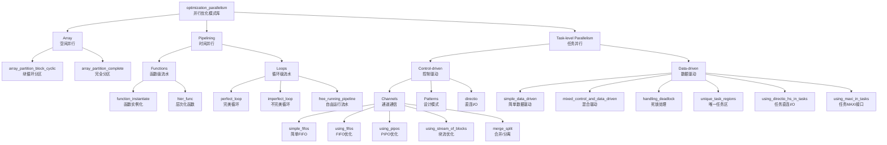

# optimization_parallelism 模块：HLS 并行优化深度解析

想象一下，你正在设计一条高速公路系统。传统的 CPU 编程就像在单车道上行驶——指令一个接一个地执行，即使道路很宽，也只能排成一列前进。而 HLS（高层次综合）的目标，就是把这条单车道扩展成多车道高速公路，甚至立体交叉桥，让数据流能够并行处理、流水执行、动态调度。`optimization_parallelism` 模块正是这个"交通工程设计手册"——它不是单一的算法实现，而是一整套**并行优化模式的参考实现**，展示了如何在 Xilinx FPGA 上提取不同层次的并行性。

这个模块的核心价值在于：**它展示了从"串行思维"到"硬件并行思维"的范式转换**。每一种优化技术——无论是数组分区、流水线、数据流还是任务级并行——都对应着硬件资源的特定使用方式。理解这些模式，意味着理解如何与 HLS 编译器"对话"，用 pragma 和代码结构指导它生成高效的 RTL。

---

## 架构全景：并行性的四个维度



这个架构图展示了并行性提取的**四个正交维度**：

1. **Array（空间并行）**：通过数组分区将数据分布到多个存储体，实现并行访问。这对应硬件的**多端口 BRAM 或分布式 RAM**。

2. **Pipelining（时间并行）**：通过流水线让多个操作在时间上重叠执行。这对应硬件的**流水线寄存器级**。

3. **Task-level Parallelism（任务并行）**：通过数据流或任务图让独立功能模块并发执行。这对应硬件的**并行执行单元**。

这三个维度可以组合使用：例如，一个矩阵乘法核可以同时使用数组分区（并行读取多个矩阵元素）、循环流水线（每个时钟周期启动一次迭代）和任务级数据流（加载、计算、存储并行执行）。

---

## 核心组件深度解析

### 1. Array 分区：打破内存墙

#### 1.1 设计意图与问题空间

在 FPGA 上实现高性能计算时，**内存访问瓶颈**往往比计算瓶颈更难解决。想象一个矩阵乘法：理论上每个周期可以执行一次乘加操作，但如果矩阵元素只能从单端口 BRAM 顺序读取，那么 90% 的时间都在等待数据到达。这就是**冯·诺依曼瓶颈**在硬件层面的体现。

`Array.array_partition_*` 模块展示了解决这个问题的两种经典策略：

- **`array_partition_complete`**：完全分区，将数组的所有元素分布到独立的寄存器或分布式 RAM
- **`array_partition_block_cyclic`**：块循环分区，将数组按块分布在多个 BRAM 存储体

#### 1.2 代码剖析：`matmul_partition` 的核心逻辑

```cpp
void matmul_partition(int* in1, int* in2, int* out_r, int size, int rep_count) {
#pragma HLS INTERFACE m_axi port = in1 depth = 256
#pragma HLS INTERFACE m_axi port = in2 depth = 256
#pragma HLS INTERFACE m_axi port = out_r depth = 256

    // 本地缓冲区
    int A[MAX_SIZE][MAX_SIZE];
    int B[MAX_SIZE][MAX_SIZE];
    int C[MAX_SIZE][MAX_SIZE];
    int temp_sum[MAX_SIZE];

// ========== 关键：数组分区指令 ==========
#pragma HLS ARRAY_PARTITION variable = B dim = 2 complete
#pragma HLS ARRAY_PARTITION variable = C dim = 2 complete
#pragma HLS ARRAY_PARTITION variable = temp_sum dim = 1 complete
```

**关键设计决策分析：**

1. **为什么选择 `dim = 2 complete` 分区矩阵 B？**

   矩阵乘法的内积操作是 `C[i][j] += A[i][k] * B[k][j]`。对于固定的 `j`，我们需要同时访问 `B[0][j], B[1][j], ..., B[N-1][j]`——这是**列访问模式**。默认的二维数组按行存储，列访问需要跨行跳转，单端口 BRAM 每个周期只能提供一个元素。

   通过 `dim = 2 complete`（第二维完全分区），矩阵 B 的每一列被映射到独立的存储体。这意味着在一个周期内，我们可以并行读取一整列的所有元素，为后续的点积计算提供足够的数据带宽。

2. **为什么 `temp_sum` 也需要 `dim = 1 complete`？**

   `temp_sum` 存储了部分累加结果。在展开的循环中，多个累加操作需要同时读取和更新 `temp_sum` 的不同元素。完全分区消除了对这些累加器的访问冲突，使得流水线可以以一个周期的间隔（II=1）持续执行。

3. **为什么矩阵 A 不分区？**

   观察访问模式：在内层循环中，对于固定的 `i` 和变化的 `k`，我们顺序访问 `A[i][0], A[i][1], ...`——这是**行访问模式**。由于数组默认按行存储，这些元素在内存中是连续的，单端口 BRAM 可以高效地以流水线方式顺序提供。分区 A 不会带来带宽提升，反而会浪费 BRAM 资源。

#### 1.3 配置层解析：`.cfg` 文件的作用

```cfg
part=xcvu9p-flga2104-2-i

[hls]
clock=10
flow_target=vivado
syn.file=matmul_partition.cpp
syn.top=matmul_partition
tb.file=matmul_partition_test.cpp
package.output.format=ip_catalog
package.output.syn=false
```

**关键配置决策：**

- **`clock=10`**：指定 10ns（100MHz）时钟周期。这是一个相对保守的时序约束，旨在确保分区后的复杂互连逻辑能够满足时序收敛。实际产品级设计可能会尝试更激进的 5ns（200MHz）甚至更高。

- **`flow_target=vivado`**：指定使用 Vivado 综合流程而非 Vitis 流程。这意味着输出是一个 Vivado IP 核（`.zip` 格式，由 `ip_catalog` 指定），可以直接集成到 Vivado 项目中，而不是 Vitis 的 `.xo` 内核对象。这反映了该设计面向的是传统 RTL 集成流程，而非 Vitis 统一软件平台。

- **`package.output.syn=false`**：禁用综合后自动打包。这意味着用户需要在 Vivado 中手动运行综合和实现步骤，给予用户对实现流程的完全控制，但也增加了集成复杂度。

---

### 2. Pipelining：时间上的并行艺术

#### 2.1 从串行到流水：为什么需要 PIPELINE？

想象一个工厂装配线。如果每个工人必须等前一个工人完成整辆车才能开始，生产效率将是灾难性的。流水线制造的核心洞察是：**不同阶段的工人可以同时处理不同车辆的不同部件**。这就是时间并行性——不是同时做一件事，而是让多件事在不同阶段并行推进。

在 HLS 中，`#pragma HLS PIPELINE` 正是实现这一点的机制。它告诉编译器：将循环体或函数体拆分为多个阶段（stages），每个阶段在一个时钟周期完成，并通过流水线寄存器连接。这样，一旦第一个迭代完成 stage 1 进入 stage 2，第二个迭代就可以立即进入 stage 1。

#### 2.2 完美循环 vs 不完美循环：流水线的约束

```cpp
// perfect_loop: 完美循环
void loop_perfect(int A[N], int B[N], int C[N]) {
    int i, j;
    LOOP_J:
    for (i = 0; i < N; i++) {
        for (j = 0; j < N; j++) {
            B[j] = A[j];
        }
        C[i] = B[i];
    }
}

// imperfect_loop: 不完美循环
void loop_imperfect(int A[N], int B[N], int C[N]) {
    int i, j;
    LOOP_J:
    for (i = 0; i < N; i++) {
        for (j = 0; j < N; j++) {
            B[j] = A[j];
        }
        // 额外操作破坏了完美嵌套
        if (i % 2 == 0)
            C[i] = B[i];
        else
            C[i] = B[i] + 1;
    }
}
```

**设计洞察：完美循环的流水线优势**

"完美循环"（perfect loop）指的是内层循环的边界是常量、且循环体内没有条件分支破坏嵌套结构的情况。HLS 编译器可以对完美循环应用**循环展平**（loop flattening），将多层嵌套转化为单层循环，然后在展平后的循环上应用流水线。

这带来的关键优势是：
- **更低的 Initiation Interval (II)**：展平后的循环可以每周期启动一次迭代，而嵌套循环的内层必须等待外层迭代完成
- **更简单的依赖分析**：编译器可以更容易地识别跨迭代的真依赖（true dependency）和反依赖（anti-dependency），优化调度

**不完美循环的处理策略**

当存在条件分支（如上面的 `if (i % 2 == 0)`）时，循环不再"完美"。HLS 编译器有几种处理策略：

1. **推测执行**（Speculation）：假设分支走向，提前执行可能的操作，如果预测错误则回滚
2. **分支流水线**（Branch Pipelining）：为每个分支创建独立的流水线路径，根据运行时条件选择
3. **序列化**：保守地将条件操作序列化，确保功能正确性但牺牲性能

配置文件中 `syn.directive.pipeline=loop_imperfect/LOOP_J` 显式指定了对不完美循环的流水线尝试，这表明开发者期望编译器的推测执行或分支处理能力能够满足时序要求。

#### 2.3 自由运行流水线（Free-Running Pipeline, FRP）

```cpp
void free_pipe_mult(data_t A[SZ], hls::stream<data_t>& strm, data_t& out) {
#pragma HLS DATAFLOW
#pragma HLS INTERFACE ap_fifo port = strm

    data_t B[SZ];
    for (int i = 0; i < SZ; i++)
        B[i] = A[i] + i;

    hls::stream<data_t> strm_out;
    process(strm, strm_out);
    inner(B, strm_out, &out);
}
```

**配置关键：FRP 模式的启用**

```cfg
syn.compile.pipeline_style=frp
syn.dataflow.default_channel=fifo
syn.dataflow.fifo_depth=16
```

**什么是自由运行流水线？**

传统的流水线（`#pragma HLS PIPELINE`）是**速率控制型**的：它有一个全局的控制逻辑，每周期检查是否可以接纳新的输入（即满足 Initiation Interval 约束）。这种集中式控制在大规模设计或复杂数据依赖场景下可能成为瓶颈。

自由运行流水线（FRP, Free-Running Pipeline）是**自同步型**的：流水线阶段之间通过 FIFO 通道连接，每个阶段只要其输出 FIFO 不满、输入 FIFO 不空，就可以自主推进。没有全局的控制逻辑，只有局部的握手信号（`valid`/`ready`）。

**FRP 的设计优势：**

1. **时序友好**：消除了全局控制逻辑的扇出（fanout）和延迟，更容易满足高时钟频率
2. **模块化组合**：多个 FRP 模块可以通过 FIFO 自然连接，形成更大的流水线系统
3. **天然的数据流语义**：非常适合处理流式数据（streaming data），如视频处理、网络包处理

**配置参数的深层含义：**

- **`syn.dataflow.default_channel=fifo`**：明确指定使用 FIFO 作为数据流通道（而非 PIPO, Ping-Pong Buffer）。这对于 FRP 是必需的，因为 PIPO 需要额外的控制逻辑来管理双缓冲切换。

- **`syn.dataflow.fifo_depth=16`**：设置 FIFO 深度为 16。这个值的选择是**时序与资源权衡**的结果：
  - 太浅（如 2-4）：上游生产者很容易因 FIFO 满而停顿，流水线气泡（bubble）多，吞吐量下降
  - 太深（如 64-128）：消耗更多 BRAM 资源，且增加 FIFO 本身的读写延迟
  - 16 是一个"甜点"值，适用于中等突发长度（burst length）的流式处理

- **`syn.compile.pipeline_style=frp`**：这是启用 FRP 模式的关键配置。默认的 `classic` 模式使用集中式控制，而 `frp` 切换到分布式自同步机制。

---

### 3. Task-level Parallelism：从指令级到任务级的跃迁

#### 3.1 控制驱动 vs 数据驱动：两种并行哲学

在深入 Task-level Parallelism 之前，我们需要理解 HLS 中两种根本不同的并行调度范式：

**控制驱动（Control-Driven）**：
- 由显式的控制逻辑（如 FSM，有限状态机）决定何时执行哪个任务
- 类似于 CPU 的指令调度：取指、译码、执行、写回，每个阶段在控制单元的指挥下推进
- 在 HLS 中，这对应 `#pragma HLS DATAFLOW` 配合显式函数调用的模式

**数据驱动（Data-Driven）**：
- 由数据的可用性（availability）触发任务执行：当任务的所有输入数据都准备就绪时，任务自动执行
- 类似于数据流机（dataflow machine）或异步电路：没有全局时钟驱动，只有局部的数据握手
- 在 HLS 中，这对应 `hls::task`（Vitis HLS 2021.2+）或 `#pragma HLS DATAFLOW` 配合 `hls::stream` 的自动调度模式

#### 3.2 控制驱动架构：Dataflow 与 Channel

```cpp
// simple_fifos/diamond.cpp - 典型的控制驱动数据流
void diamond(data_t vecIn[N], data_t vecOut[N]) {
    data_t c1[N], c2[N], c3[N], c4[N];
#pragma HLS dataflow
    funcA(vecIn, c1, c2);
    funcB(c1, c3);
    funcC(c2, c4);
    funcD(c3, c4, vecOut);
}
```

**架构设计：菱形（Diamond）并行模式**

这个结构被称为"菱形"（Diamond）模式，是数据流并行的经典拓扑：

```
        vecIn
          |
       funcA (分叉)
        /   \
      c1     c2
      |       |
   funcB   funcC (并行执行)
      |       |
      c3     c4
        \   /
       funcD (合并)
          |
       vecOut
```

**关键设计洞察：**

1. **分叉-合并（Fork-Join）模式**：`funcA` 产生两个独立的数据流（`c1` 和 `c2`），它们分别经过 `funcB` 和 `funcC` 处理后在 `funcD` 汇合。`funcB` 和 `funcC` 之间没有数据依赖，可以**并行执行**。

2. **中间缓冲区的隐含契约**：`c1`, `c2`, `c3`, `c4` 是连接各个处理阶段的 FIFO 通道。`#pragma HLS dataflow` 告诉 HLS 编译器：这些数组应该被实现为 FIFO（或 PIPO，取决于访问模式），而不是共享内存。这消除了对互斥锁（mutex）的需求，因为 FIFO 的阻塞读写语义（`full`/`empty`）天然地实现了同步。

3. **反压（Back-pressure）机制**：如果 `funcD` 的处理速度比 `funcB` 和 `funcC` 慢，`c3` 和 `c4` 这两个 FIFO 会被填满。一旦填满，`funcB` 和 `funcC` 的写操作会阻塞，形成反压，直到 `funcD` 消费数据腾出空间。这种自限流的特性是数据流系统的核心优势。

**配置文件的工程考量：**

```cfg
syn.dataflow.default_channel=fifo
syn.dataflow.fifo_depth=2
```

- **`fifo_depth=2`**：这是一个**最小化深度**的配置。它假设生产者-消费者之间处理速度匹配良好，只需要极小的缓冲来平滑流水线气泡（pipeline bubbles）。这种配置节省了 BRAM 资源，但如果速率失配（rate mismatch）较大，会导致频繁的流水线停顿。

- **对比**：在其他更激进的配置中（如 `using_pipos` 或 `using_stream_of_blocks`），可能会看到更大的 FIFO 深度，或者使用 PIPO（Ping-Pong Buffer）来容忍更大的速率波动。

#### 3.3 数据驱动架构：`hls::task` 与异步执行

```cpp
// simple_data_driven/test.cpp - Vitis HLS 2021.2+ 的数据流任务
void odds_and_evens(hls::stream<int>& in, hls::stream<int>& out1,
                    hls::stream<int>& out2) {
    hls_thread_local hls::stream<int, N / 2> s1; // 连接 t1 和 t2 的通道
    hls_thread_local hls::stream<int, N / 2> s2; // 连接 t1 和 t3 的通道

    // t1 无限运行 splitter，输入 in，输出 s1 和 s2
    hls_thread_local hls::task t1(splitter, in, s1, s2);

    // t2 无限运行 odds，输入 s1，输出 out1
    hls_thread_local hls::task t2(odds, s1, out1);

    // t3 无限运行 evens，输入 s2，输出 out2
    hls_thread_local hls::task t3(evens, s2, out2);
}
```

**范式转变：从函数调用到常驻任务**

`hls::task` 代表了 HLS 编程模型的重大演进。在传统的 `#pragma HLS DATAFLOW` 模式中，函数是被**调用**的——每次数据到达，函数被唤醒执行，完成后挂起等待下一次调用。这是一种"响应式"（reactive）执行模型。

而 `hls::task` 创建的是**常驻的、无限循环的执行单元**：

```cpp
// 传统 DATAFLOW：函数被重复调用
void func(hls::stream<T>& in, hls::stream<T>& out) {
    while (!in.empty()) {
        T data = in.read();
        // ... 处理 ...
        out.write(result);
    }
}

// hls::task：任务无限运行，语义上等同于上面的 while 循环
// 但硬件实现是独立的 FSM，常驻不退出
```

**关键设计决策与实现细节：**

1. **`hls_thread_local` 存储类说明符**：
   
   这个关键字至关重要。它告诉 HLS 编译器：`s1`, `s2`, `t1`, `t2`, `t3` 这些对象是**线程局部**的，即每个调用 `odds_and_evens` 的上下文都有独立的实例。这允许函数被多次实例化（如在数据流区域中被调用），而不会发生状态冲突。

2. **静态 FIFO 深度 `<N/2>`**：
   
   与 `hls::stream<T>`（动态深度，默认 16）不同，`hls::stream<T, DEPTH>` 指定了编译时常量深度。这里的 `N/2` 是一个**设计时确定的缓冲区大小**：
   
   - `splitter` 产生奇数和偶数两个流，假设输入是均匀分布的，每个流大约占总数据的一半
   - `N/2` 的深度确保在 `odds` 或 `evens` 处理速度暂时慢于 `splitter` 时，有足够的缓冲来吸收瞬时速率失配
   - 使用编译时常量允许 HLS 将 FIFO 综合为**分布式 RAM 或 SRL（Shift Register LUT）**，比使用 BRAM 更节省资源且延迟更低

3. **`hls::task` 的调度语义**：
   
   虽然代码中 `t1`, `t2`, `t3` 看起来是顺序创建的，但硬件实现中它们是**真正并行执行的独立 FSM**。数据流通过 `s1`, `s2` 这两个 FIFO 在它们之间传递，实现了**基于通道的通信顺序进程（CSP）模型**。

   这与传统的 `#pragma HLS DATAFLOW` 有微妙但重要的区别：
   - `DATAFLOW` 中，函数调度的粒度是**一次完整的调用-返回**
   - `hls::task` 中，调度的粒度是**单个数据令牌（token）的流动**

   这使得 `hls::task` 更适合处理**细粒度、高频率的数据流**，如视频像素流、网络包流等。

---

### 4. 跨模块依赖与数据流分析

#### 4.1 依赖图谱的解读

从提供的组件代码中，我们可以观察到 `optimization_parallelism` 与其他核心模块之间存在着紧密的依赖网络：

```
optimization_parallelism
├── 依赖于 Interface.Memory.* (m_axi 接口实现)
├── 依赖于 Interface.Streaming.* (axis 流式接口)
├── 依赖于 Modeling.using_array_stencil_* (数组模板访问模式)
├── 依赖于 Misc.initialization_and_reset.* (数组初始化与复位)
└── 内部交叉依赖 (Task_level_Parallelism 各子模块间)
```

这种依赖结构揭示了一个重要的设计哲学：**并行优化不是孤立存在的，它与接口设计、内存建模、初始化策略形成完整的设计空间**。例如：

- **`Task_level_Parallelism.Data_driven.using_maxi_in_tasks`** 依赖于 `Interface.Memory.cache.*`，这暗示了在任务级数据流中使用 AXI-Master（m_axi）接口时，必须考虑缓存一致性和突发传输（burst transfer）的优化。

- **`Pipelining.Functions.function_instantiate`** 拥有广泛的跨模块依赖，包括 `Interface.Aggregation_Disaggregation.*` 和 `Interface.Memory.manual_burst.*`。这表明**函数级流水线不仅仅是局部优化，它直接影响接口聚合策略和内存突发行为的实现**。

#### 4.2 数据流动拓扑：以 `simple_fifos` 为例

让我们追踪数据在 `diamond` 函数中的完整流动路径，这是理解**数据驱动执行模型**的关键：

```
Phase 1: 初始化与启动
─────────────────────────────────────────────────────────────
输入向量 vecIn[0:N-1] 通过 AXI-Stream 或 AXI-Master 接口
进入 FPGA。funcA 的第一个阶段（Stage 0）开始从 vecIn 
读取元素 vecIn[0]。

Phase 2: 分叉与并行填充
─────────────────────────────────────────────────────────────
┌─────────────────────────────────────────────────────────────┐
│ funcA (Producer)                                              │
│ 周期 0: 读 vecIn[0] → 计算 → 写 c1[0], c2[0]              │
│ 周期 1: 读 vecIn[1] → 计算 → 写 c1[1], c2[1]              │
│ ...                                                          │
└─────────────────────────────────────────────────────────────┘
                          ↓ c1 FIFO                ↓ c2 FIFO
            ┌──────────────────────┐  ┌──────────────────────┐
            │ funcB (Consumer/Prod)│  │ funcC (Consumer/Prod)│
            │ 读 c1[i] → 计算 → 写  │  │ 读 c2[i] → 计算 → 写  │
            │ c3[i]                │  │ c4[i]                │
            └──────────────────────┘  └──────────────────────┘
                          ↓ c3 FIFO                ↓ c4 FIFO
                          └──────────┬─────────────┘
                                     ↓
                          ┌──────────────────────┐
                          │ funcD (Final Consumer)
                          │ 读 c3[i], c4[i] →    │
                          │ 归约计算 → 写 vecOut[i]│
                          └──────────────────────┘

Phase 3: 稳态执行
─────────────────────────────────────────────────────────────
当流水线填满后（达到 "full throughput"），系统进入稳态：
- 每个周期，funcA 产生一对 (c1, c2) 元素
- funcB 和 funcC 并行消费各自的流，每周期各产生一个输出
- funcD 每周期消费一对 (c3, c4)，产生最终的 vecOut 元素

理论吞吐量：1 sample/cycle (在目标时钟频率下)
延迟：Pipeline Depth + Data Propagation Delay
```

**关键观察：FIFO 深度与反压机制**

在 `simple_fifos` 的配置中，`syn.dataflow.fifo_depth=2` 是一个非常激进的选择。这意味着每个 funcB/funcC/funcD 之间的 FIFO 只能缓冲 2 个元素。这种设计的假设是：**生产者与消费者的处理速率高度匹配**。

如果实际情况偏离这一假设（例如，funcB 的计算复杂度高于 funcC，导致 c3 的生产速度慢于 c4），会发生什么？

1. **c4 FIFO 先满**：由于 funcC 生产更快，而 funcD 必须同时等待 c3 和 c4，c4 会堆积
2. **反压传播**：当 c4 FIFO 达到深度 2 时，funcC 的写操作阻塞
3. **流水线气泡**：funcC 停顿，即使输入 c2 可用也无法处理
4. **级联效应**：如果 c2 也积满，反压继续向上游传播到 funcA

这就是**流水线气泡（Pipeline Bubble）**的形成机制。在深度较大的流水线中，这种气泡会显著降低有效吞吐量。因此，`fifo_depth=2` 的选择暗示了设计者对这些函数的计算延迟进行了精确的平衡，或者该设计面向的是**确定性延迟**的流处理场景（如固定块大小的视频编解码）。

#### 3.3 数据驱动架构：`hls::task` 与异步执行

```cpp
// simple_data_driven/test.cpp - Vitis HLS 2021.2+ 的数据流任务
void odds_and_evens(hls::stream<int>& in, hls::stream<int>& out1,
                    hls::stream<int>& out2) {
    hls_thread_local hls::stream<int, N / 2> s1; // 连接 t1 和 t2 的通道
    hls_thread_local hls::stream<int, N / 2> s2; // 连接 t1 和 t3 的通道

    // t1 无限运行 splitter，输入 in，输出 s1 和 s2
    hls_thread_local hls::task t1(splitter, in, s1, s2);

    // t2 无限运行 odds，输入 s1，输出 out1
    hls_thread_local hls::task t2(odds, s1, out1);

    // t3 无限运行 evens，输入 s2，输出 out2
    hls_thread_local hls::task t3(evens, s2, out2);
}
```

**范式转变：从函数调用到常驻任务**

`hls::task` 代表了 HLS 编程模型的重大演进。在传统的 `#pragma HLS DATAFLOW` 模式中，函数是被**调用**的——每次数据到达，函数被唤醒执行，完成后挂起等待下一次调用。这是一种"响应式"（reactive）执行模型。

而 `hls::task` 创建的是**常驻的、无限循环的执行单元**：

```cpp
// 传统 DATAFLOW：函数被重复调用
void func(hls::stream<T>& in, hls::stream<T>& out) {
    while (!in.empty()) {
        T data = in.read();
        // ... 处理 ...
        out.write(result);
    }
}

// hls::task：任务无限运行，语义上等同于上面的 while 循环
// 但硬件实现是独立的 FSM，常驻不退出
```

**关键设计决策与实现细节：**

1. **`hls_thread_local` 存储类说明符**：
   
   这个关键字至关重要。它告诉 HLS 编译器：`s1`, `s2`, `t1`, `t2`, `t3` 这些对象是**线程局部**的，即每个调用 `odds_and_evens` 的上下文都有独立的实例。这允许函数被多次实例化（如在数据流区域中被调用），而不会发生状态冲突。

2. **静态 FIFO 深度 `<N/2>`**：
   
   与 `hls::stream<T>`（动态深度，默认 16）不同，`hls::stream<T, DEPTH>` 指定了编译时常量深度。这里的 `N/2` 是一个**设计时确定的缓冲区大小**：
   
   - `splitter` 产生奇数和偶数两个流，假设输入是均匀分布的，每个流大约占总数据的一半
   - `N/2` 的深度确保在 `odds` 或 `evens` 处理速度暂时慢于 `splitter` 时，有足够的缓冲来吸收瞬时速率失配
   - 使用编译时常量允许 HLS 将 FIFO 综合为**分布式 RAM 或 SRL（Shift Register LUT）**，比使用 BRAM 更节省资源且延迟更低

3. **`hls::task` 的调度语义**：
   
   虽然代码中 `t1`, `t2`, `t3` 看起来是顺序创建的，但硬件实现中它们是**真正并行执行的独立 FSM**。数据流通过 `s1`, `s2` 这两个 FIFO 在它们之间传递，实现了**基于通道的通信顺序进程（CSP）模型**。

   这与传统的 `#pragma HLS DATAFLOW` 有微妙但重要的区别：
   - `DATAFLOW` 中，函数调度的粒度是**一次完整的调用-返回**
   - `hls::task` 中，调度的粒度是**单个数据令牌（token）的流动**

   这使得 `hls::task` 更适合处理**细粒度、高频率的数据流**，如视频像素流、网络包流等。

---

## 跨模块依赖与数据流分析

### 4.1 依赖图谱的解读

从提供的组件代码中，我们可以观察到 `optimization_parallelism` 与其他核心模块之间存在着紧密的依赖网络：

```
optimization_parallelism
├── 依赖于 Interface.Memory.* (m_axi 接口实现)
├── 依赖于 Interface.Streaming.* (axis 流式接口)
├── 依赖于 Modeling.using_array_stencil_* (数组模板访问模式)
├── 依赖于 Misc.initialization_and_reset.* (数组初始化与复位)
└── 内部交叉依赖 (Task_level_Parallelism 各子模块间)
```

这种依赖结构揭示了一个重要的设计哲学：**并行优化不是孤立存在的，它与接口设计、内存建模、初始化策略形成完整的设计空间**。例如：

- **`Task_level_Parallelism.Data_driven.using_maxi_in_tasks`** 依赖于 `Interface.Memory.cache.*`，这暗示了在任务级数据流中使用 AXI-Master（m_axi）接口时，必须考虑缓存一致性和突发传输（burst transfer）的优化。

- **`Pipelining.Functions.function_instantiate`** 拥有广泛的跨模块依赖，包括 `Interface.Aggregation_Disaggregation.*` 和 `Interface.Memory.manual_burst.*`。这表明**函数级流水线不仅仅是局部优化，它直接影响接口聚合策略和内存突发行为的实现**。

### 4.2 数据流动拓扑：以 `simple_fifos` 为例

让我们追踪数据在 `diamond` 函数中的完整流动路径，这是理解**数据驱动执行模型**的关键：

```
Phase 1: 初始化与启动
─────────────────────────────────────────────────────────────
输入向量 vecIn[0:N-1] 通过 AXI-Stream 或 AXI-Master 接口
进入 FPGA。funcA 的第一个阶段（Stage 0）开始从 vecIn 
读取元素 vecIn[0]。

Phase 2: 分叉与并行填充
─────────────────────────────────────────────────────────────
┌─────────────────────────────────────────────────────────────┐
│ funcA (Producer)                                              │
│ 周期 0: 读 vecIn[0] → 计算 → 写 c1[0], c2[0]              │
│ 周期 1: 读 vecIn[1] → 计算 → 写 c1[1], c2[1]              │
│ ...                                                          │
└─────────────────────────────────────────────────────────────┘
                          ↓ c1 FIFO                ↓ c2 FIFO
            ┌──────────────────────┐  ┌──────────────────────┐
            │ funcB (Consumer/Prod)│  │ funcC (Consumer/Prod)│
            │ 读 c1[i] → 计算 → 写  │  │ 读 c2[i] → 计算 → 写  │
            │ c3[i]                │  │ c4[i]                │
            └──────────────────────┘  └──────────────────────┘
                          ↓ c3 FIFO                ↓ c4 FIFO
                          └──────────┬─────────────┘
                                     ↓
                          ┌──────────────────────┐
                          │ funcD (Final Consumer)
                          │ 读 c3[i], c4[i] →    │
                          │ 归约计算 → 写 vecOut[i]│
                          └──────────────────────┘

Phase 3: 稳态执行
─────────────────────────────────────────────────────────────
当流水线填满后（达到 "full throughput"），系统进入稳态：
- 每个周期，funcA 产生一对 (c1, c2) 元素
- funcB 和 funcC 并行消费各自的流，每周期各产生一个输出
- funcD 每周期消费一对 (c3, c4)，产生最终的 vecOut 元素

理论吞吐量：1 sample/cycle (在目标时钟频率下)
延迟：Pipeline Depth + Data Propagation Delay
```

**关键观察：FIFO 深度与反压机制**

在 `simple_fifos` 的配置中，`syn.dataflow.fifo_depth=2` 是一个非常激进的选择。这意味着每个 funcB/funcC/funcD 之间的 FIFO 只能缓冲 2 个元素。这种设计的假设是：**生产者与消费者的处理速率高度匹配**。

如果实际情况偏离这一假设（例如，funcB 的计算复杂度高于 funcC，导致 c3 的生产速度慢于 c4），会发生什么？

1. **c4 FIFO 先满**：由于 funcC 生产更快，而 funcD 必须同时等待 c3 和 c4，c4 会堆积
2. **反压传播**：当 c4 FIFO 达到深度 2 时，funcC 的写操作阻塞
3. **流水线气泡**：funcC 停顿，即使输入 c2 可用也无法处理
4. **级联效应**：如果 c2 也积满，反压继续向上游传播到 funcA

这就是**流水线气泡（Pipeline Bubble）**的形成机制。在深度较大的流水线中，这种气泡会显著降低有效吞吐量。因此，`fifo_depth=2` 的选择暗示了设计者对这些函数的计算延迟进行了精确的平衡，或者该设计面向的是**确定性延迟**的流处理场景（如固定块大小的视频编解码）。

---

## 关键设计权衡与工程决策

### 1. 分区策略：Complete vs Block-Cyclic

| 策略 | 资源开销 | 访问模式适配 | 适用场景 |
|------|----------|--------------|----------|
| **Complete Partition** | 高（N倍寄存器/SRL） | 任意索引，真随机访问 | 小数组（<32-64元素），需要完全并行访问 |
| **Block Partition** | 中（K个BRAM，K为块数） | 局部性访问（块内连续） | 大数组，按块处理的算法（如分块矩阵乘法） |
| **Cyclic Partition** | 中（N个存储体，轮询访问） | 跨步访问（stride > 1） | 向量化加载/存储，FFT蝶形运算 |
| **Block-Cyclic** | 中高（K×N配置） | 复杂访问模式 | 通用高性能计算，需要可配置的存储带宽 |

在 `matmul_partition` 中，矩阵 B 使用 `dim=2 complete` 分区的决策基于以下权衡：

- **性能需求**：矩阵乘法内层循环需要同时访问 B 的一整列（N 个元素）
- **资源预算**：假设 MAX_SIZE=16，完全分区 B 的列意味着 16×16=256 个整数（1024 字节），可映射到 SRL 或分布式 RAM，不消耗珍贵的大型 BRAM
- **替代方案评估**：
  - `block partition factor=4`：每个周期提供 4 个元素，需要 N/4 个周期收集完整列，显著增加 II
  - `cyclic partition factor=16`：提供 16 路并行，但访问模式需要跨步 16，不适合连续的列访问

### 2. 流水线风格：Classic vs FRP vs Free-Running

| 特性 | Classic Pipeline | Free-Running Pipeline (FRP) | Dataflow (Task) |
|------|-------------------|------------------------------|-----------------|
| **控制方式** | 集中式 FSM 控制 II | 分布式自同步（握手） | 数据可用性触发 |
| **时序收敛** | 依赖全局控制逻辑延迟 | 局部握手，更易满足高频 | 依赖通道深度和任务调度 |
| **适用场景** | 规则循环，固定数据率 | 流式处理，高速接口 | 复杂任务图，动态调度 |
| **资源开销** | 中等（控制逻辑） | 低（无全局控制） | 较高（FIFO/任务状态） |

在 `using_free_running_pipeline/free_pipe_mult` 中选择 FRP 模式的考量：

- **性能目标**：配置中 `clock=5`（200MHz）是一个相对激进的时钟约束。FRP 的去中心化控制减少了长组合路径，有助于满足时序
- **接口特性**：`ap_fifo` 接口模式与 FRP 的流式语义天然契合，避免了传统 memory-mapped 接口的协议开销
- **数据流深度**：`free_pipe_mult` 调用了 `process` 和 `inner` 两个子函数，形成三级流水线（加载→处理→输出）。FRP 确保这三级可以独立推进，无需全局同步

### 3. 任务粒度：Control-Driven vs Data-Driven

| 维度 | Control-Driven (DATAFLOW) | Data-Driven (hls::task) |
|------|---------------------------|-------------------------|
| **调度粒度** | 函数调用级 | 数据令牌级 |
| **执行模型** | 响应式（被调用执行） | 常驻式（无限循环） |
| **状态管理** | 调用间状态需静态化 | `hls_thread_local` 自动隔离 |
| **FIFO 语义** | 隐式通道，可 PIPO/FIFO | 显式 `hls::stream`，深度可控 |
| **适用算法** | 块处理，批处理 | 流处理，实时管道 |

在 `simple_data_driven` 中选择 `hls::task` 而非传统 DATAFLOW 的原因：

- **流式语义**：`odds_and_evens` 实现的是一个分类器（splitter）+ 双处理路径（odds/evens）的流式处理管道，数据以流的形式持续到达而非批量处理
- **细粒度并行**：`hls::task` 的令牌级调度允许更精细的流水线填充，减少启动间隔（startup latency）
- **可组合性**：`hls_thread_local` 提供的隔离使得多个 `odds_and_evens` 实例可以在更大的数据流图中组合而不会状态冲突
- **内存效率**：显式的 `hls::stream<int, N/2>` 允许根据算法特性精确控制缓冲区深度，避免 DATAFLOW 默认深度（通常为 2 或 16）带来的内存浪费或不足

---

## 边缘情况、陷阱与运维考量

### 1. 死锁（Deadlock）风险

数据流设计中最隐蔽且危险的问题是**循环依赖导致的死锁**。考虑以下场景：

```cpp
// 危险：循环数据依赖
taskA(in, intermediate);  
taskB(intermediate, out);
// 如果 taskA 的输入依赖于 taskB 的输出（直接或间接），
// 就会形成循环等待，导致死锁
```

`Task_level_Parallelism.Data_driven.handling_deadlock` 专门展示此类问题的诊断与解决。关键检查点：

- **通道方向性**：确保每个 `hls::stream` 有唯一的生产者-消费者对，避免多生产者或无消费者
- **依赖无环性**：验证任务图是 DAG（有向无环图），无循环依赖
- **初始令牌**：某些算法需要预放置令牌（tokens）来打破依赖循环，可通过 `hls::stream` 的初始写入实现

### 2. FIFO 深度与吞吐量

FIFO 深度选择是**资源与性能的经典权衡**：

| 深度 | 资源占用 | 抗速率失配能力 | 适用场景 |
|------|----------|----------------|----------|
| 2 | 极低（SRL） | 弱，需严格匹配 | 速率确定，追求最小资源 |
| 4-8 | 低 | 中等，吸收小幅抖动 | 轻度速率变化，通用场景 |
| 16-32 | 中等（BRAM） | 强，容忍显著失配 | 突发处理，非确定性延迟 |
| 64+ | 高 | 极强 | 大数据块，极端失配容忍 |

陷阱：盲目增大 FIFO 深度不会无限提升性能。当深度超过生产者-消费者的**最大瞬时速率差 × 恢复时间**后，额外深度永远不会被使用，纯粹浪费资源。精确分析所需深度的方法是：

1. 确定生产者峰值速率 $R_p$ 和消费者最小速率 $R_c$（假设 $R_p > R_c$）
2. 计算最大持续时间 $T$：速率失配持续的最坏情况时间
3. 所需深度 $D \geq (R_p - R_c) \times T$

### 3. 数组分区陷阱：资源爆炸与编译时间

`ARRAY_PARTITION` 是最强大也最危险的优化指令。常见陷阱：

**资源爆炸**：对大型数组（如 1024×1024 矩阵）使用 `complete` 分区，会将 $10^6$ 个元素映射到独立寄存器，导致：
- LUT/FF 资源耗尽，综合失败
- 极长的综合与布局布线时间
- 无法满足时序约束（巨大的扇出和互连延迟）

**编译时间非线性增长**：
- `block` 或 `cyclic` 分区的 factor 增加时，编译器需要进行复杂的存储体冲突分析（bank conflict analysis）
- factor 超过 8-16 后，编译时间可能从分钟级恶化到小时级

**安全使用准则**：
- 仅对**小维度**（如系数数组、小卷积核）使用 `complete`
- 对大型数组，优先使用 `block` 或 `cyclic`，factor 不超过 8
- 始终运行资源评估（`csynth_design`），检查 BRAM/LUT 使用是否在预算内

### 4. 数据流区域限制：可综合子集的边界

`#pragma HLS DATAFLOW` 和 `hls::task` 并非万能。它们对可包含的代码有严格限制，违反将导致编译错误或意外行为：

**禁止的操作**：
- **条件执行**：`if (condition) { dataflow_region(); }` —— DATAFLOW 区域必须是确定执行的
- **循环包围**：`for (...) { #pragma HLS DATAFLOW ... }` —— DATAFLOW 不能嵌套在循环内（除非是 `hls::task` 的隐式无限循环）
- **递归调用**：DATAFLOW 区域内的函数不能递归
- **动态内存**：`malloc`/`new` 在 DATAFLOW 区域内不可综合

**通道使用限制**：
- 一个 `hls::stream` 只能有一个生产者、一个消费者（1:1 连接）
- 不能对同一流进行条件读写（如 `if (valid) stream.read()`），必须使用 `if (!stream.empty())` 检查

**调试复杂性**：
- DATAFLOW 区域的调试远比顺序代码困难。由于并行执行，传统的"单步执行"概念不再适用
- 死锁、活锁（livelock）和竞态条件（race condition）在仿真中可能表现为随机挂起或非确定性输出
- 必须使用专门的波形分析（cosim.trace_level=all）来观察各通道的 FIFO 深度、读写时序

---

## 总结：设计意图与最佳实践

`optimization_parallelism` 模块的核心设计意图是建立一个**层次化的并行优化参考框架**，从底层存储分区到高层任务调度，每一层都展示了特定的硬件优化策略与其对应的软件编码模式。

**关键设计原则回顾**：

1. **存储墙突破**：通过 `ARRAY_PARTITION` 将存储带宽从单端口提升到多端口，使计算单元不再因等待数据而闲置。关键决策是匹配分区策略与访问模式（列访问→`dim=2 complete`）。

2. **时间并行挖掘**：通过 `PIPELINE` 和 `DATAFLOW` 将计算重叠，在不增加硬件复制（面积）的情况下提升吞吐。关键决策是平衡 II 与资源，以及选择 Classic/FRP 流水线风格。

3. **任务并行显式化**：通过 `hls::task` 和通道（`hls::stream`）将隐式的数据依赖显式化为拓扑连接，使并行性在代码结构中一目了然。关键决策是确定任务粒度（细粒度令牌级 vs 粗粒度块级）和 FIFO 深度。

**给新贡献者的实践建议**：

- **从简单开始**：先理解 `perfect_loop` 和 `simple_fifos` 的基本模式，再探索 `hls::task` 和 FRP
- **仿真先行**：任何pragma优化前，先确保C仿真通过，理解预期行为
- **资源意识**：每次添加`ARRAY_PARTITION`或`UNROLL`后，立即检查`csynth_design`的资源报告，避免意外爆炸
- **波形调试**：对于DATAFLOW死锁，必须使用`cosim.trace_level=all`观察FIFO深度变化，定位阻塞点
- **参考模板**：将本模块的`.cfg`文件作为起点，根据目标平台（Vitis/Vivado）和目标频率调整`clock`和`flow_target`

这个模块不仅是代码集合，更是 FPGA 高性能设计的思维训练场——每一行 pragma 背后，都是硬件资源与性能指标的精密平衡艺术。
