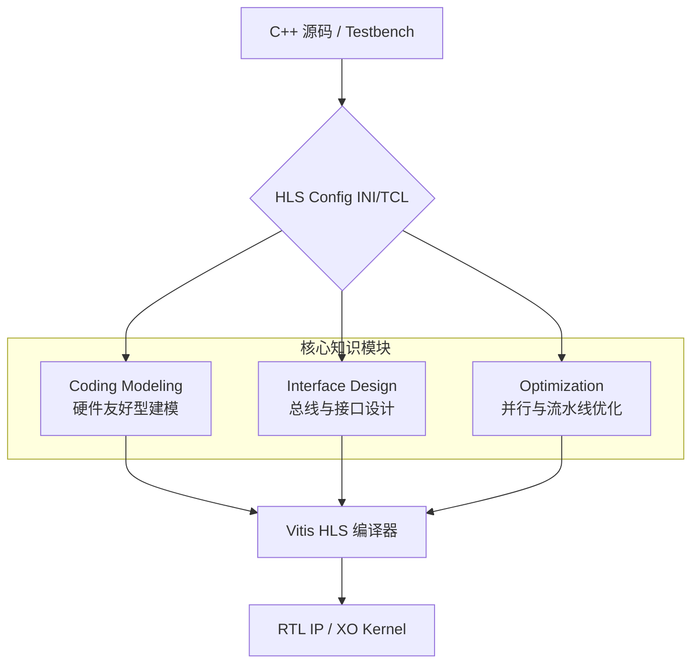

# 欢迎来到 Vitis HLS 入门示例库 (Vitis-HLS-Introductory-Examples)

作为一名开发者，你可能习惯了在 CPU 上编写顺序执行的代码。但当你踏入 FPGA 的世界，你的思维需要从"一行接一行"转变为"全方位并行"。

## 文档导览（Documentation Guide）

在深入阅读本库的技术细节之前，建议先根据你的需求选择合适的入门路径：

- **[Get Started](guide-getting-started.md)**  
  面向"先跑通再深入"的读者，提供环境安装、示例执行与结果验证的最短路径。适合第一次接触本仓库时快速建立成功体验。

- **[Beginner's Guide](guide-beginners-guide.md)**  
  这是一份循序渐进的多章节入门手册，从基础概念到实践流程逐步展开。适合希望系统掌握 HLS 开发思维与常见操作的初学者。

- **[Build & Code Organization](guide-build-and-organization.md)**  
  聚焦工程构建流程与代码组织方式，帮助你理解仓库如何编译、链接与管理模块。对团队协作、二次开发和工程规范化非常有帮助。

- **[Core Algorithms](guide-core-algorithms.md)**  
  深入解析核心算法及其硬件映射关系，强调"算法原理—实现方式—性能影响"的联动理解。适合需要做性能优化或正确性分析的进阶读者。

---

**本库的作用一言以蔽之：它是将 C++ 算法逻辑转化为高效硬件电路的"设计蓝图集"。**

它不仅教你如何编写代码，更展示了如何通过简单的配置指令，将一段平凡的 C++ 函数变成拥有多路并行通道、流水线作业能力和极高内存带宽的硬件内核。无论你是想解决数据计算的延迟问题，还是想构建复杂的片上系统（SoC）接口，这里都有开箱即用的参考方案。

---

## 1. 架构全景：从源码到内核

在 Vitis HLS 的设计流中，我们不再仅仅编写代码，而是管理"数据流"与"硬件资源"的映射关系。以下是本项目的逻辑架构：

### 架构流转说明
1.  **输入层**：开发者提供 C++ 源码描述逻辑，并通过声明式的 `.cfg` 配置文件定义硬件属性。
2.  **核心建模层**：这是本库的核心，分为三个维度：
    *   **建模 (Coding)**：解决"数据怎么表示"和"基本逻辑怎么写"。
    *   **接口 (Interface)**：解决"数据怎么进出 FPGA"。
    *   **优化 (Optimization)**：解决"电路怎么跑得快"。
3.  **编译输出层**：经过 HLS 编译器，最终生成的硬件内核（.xo）或 IP 核，可以直接集成到 Vivado 或 Vitis 平台。

---

## 2. 关键设计决策：为什么这么架构？

本项目的示例遵循了三个核心设计原则，以确保其作为生产级参考的价值：

*   **声明式配置 (Declarative Configuration)**：我们选择了"代码与指令分离"的模式。你会在示例中发现，C++ 源码尽可能保持纯粹，而复杂的硬件约束（如接口类型、时钟频率）都放在 `hls_config.cfg` 配置文件中。这种**分层架构**方便你快速迭代硬件架构，而无需频繁改动算法逻辑。
*   **单一职责模块化**：每个示例只专注于解决一个具体的技术点（例如：单维 Stencil 计算或 AXI Master 的突发传输）。这种**原子化设计**让你可以像搭积木一样，将不同的技术点组合到自己的复杂项目中。
*   **多流并存 (Polyglot Flow)**：考虑到行业从 Vivado HLS 向 Vitis Unified 的迁移，架构上兼容了 TCL 脚本与 INI 配置。这是一种**适配器模式**的设计，确保无论你处于哪种工具链环境下，都能找到对应的实现参考。

---

## 3. 模块导读

为了帮助你快速定位，我们将库划分为四个主要技术领域：

*   **[基础建模模块 (Coding Modeling)](coding_modeling.md)**：这是你的第一站。它介绍了如何使用硬件友好的数据类型（如 `ap_fixed` 定点数）以及如何处理 C++ 模板和指针，确保你的 C++ 描述能够被正确地翻译成物理电路。
*   **[接口设计模块 (Interface Design)](interface_design.md)**：这个模块是连接软件与硬件的桥梁。它详细演示了如何配置 AXI4-Lite 寄存器、AXI4-Stream 高速流和 AXI4-Full 内存接口，解决数据搬运的瓶颈问题。
*   **[并行优化模块 (Optimization & Parallelism)](optimization_parallelism.md)**：当你需要榨干 FPGA 性能时，请参考此模块。它涵盖了数组分区（Array Partition）、循环流水线（Loop Pipelining）以及最新的任务级并行（`hls::task`），带你突破冯·诺依曼瓶颈。
*   **[流转迁移模块 (Libraries Migration)](libraries_migration.md)**：专门为需要维护旧项目或追求自动化的团队准备。它演示了如何将老旧的 TCL 流程平滑过渡到 Vitis Unified 命令行环境，实现研发工具链的现代化。

---

## 4. 典型端到端工作流

### 场景 A：从数学算法到高效 IP 核
1.  **定义建模**：在 [Coding Modeling](coding_modeling.md) 中选择合适的数据位宽和 Stencil 模式，编写 C++ 逻辑。
2.  **配置接口**：在 [Interface Design](interface_design.md) 中决定数据是通过 DDR（m_axi）还是流（axis）进入内核。
3.  **应用优化**：在 [Optimization](optimization_parallelism.md) 中添加 `#pragma HLS PIPELINE` 提升吞吐量。
4.  **导出验证**：运行 `vitis-run` 进行 C/RTL 协同仿真，确保硬件逻辑与原始 C++ 输出完全一致。

### 场景 B：旧有项目自动化改造
1.  **识别旧脚本**：找到现有的 `run_hls.tcl`。
2.  **方言转换**：参考 [Libraries Migration](libraries_migration.md) 模块，将其中的指令映射到新版的 `hls_config.cfg`。
3.  **集成 Python**：利用项目展示的 Python API 编写脚本，实现多组参数（位宽、频率）的并行综合扫描，寻找最优硬件 Pareto 点。

---
**准备好了吗？** 建议从 `coding_modeling` 目录下的基础示例开始你的 HLS 探索之旅。