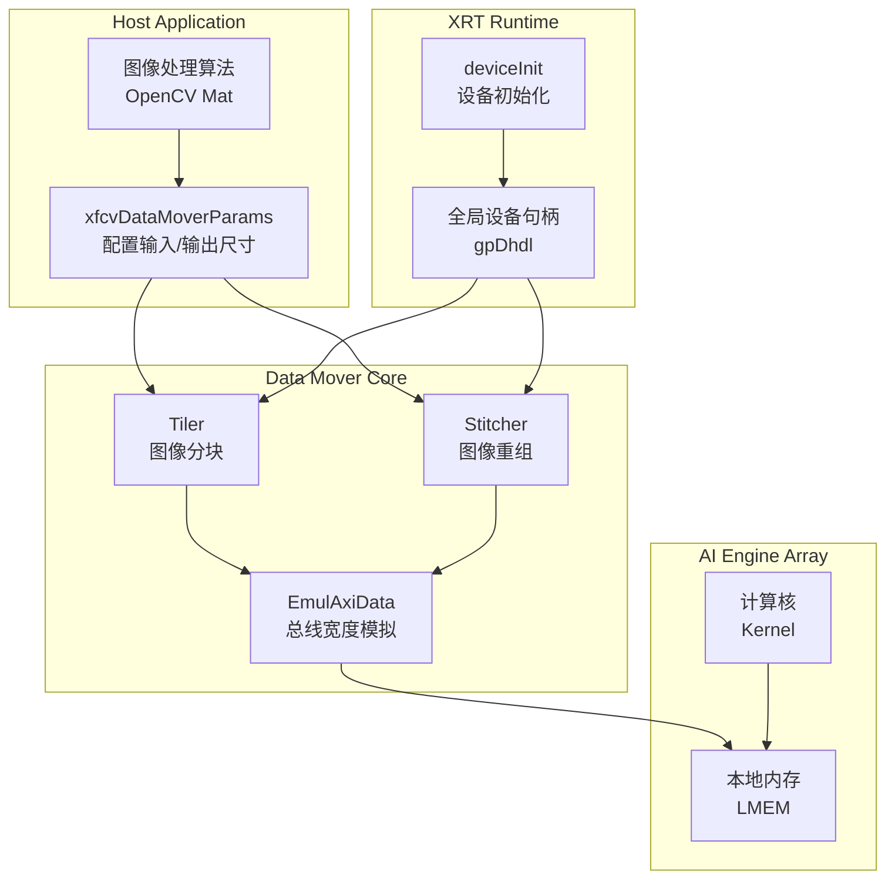
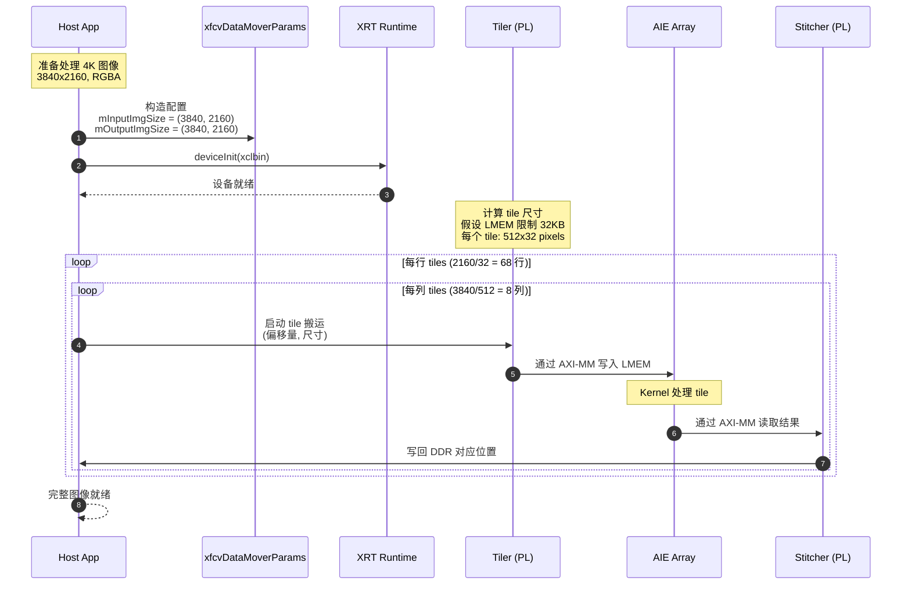
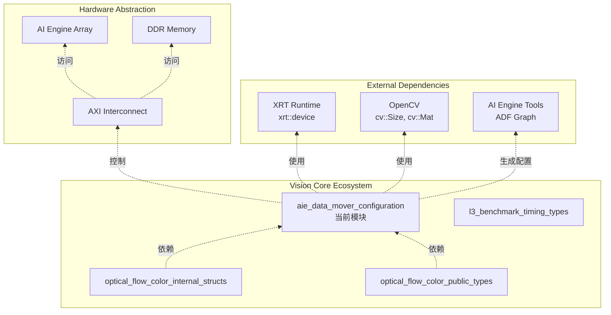

# AI Engine Data Mover Configuration 模块深度解析

## 开篇：打破图像处理的内存墙

想象你正在处理一张 4K 分辨率的图像——约 1200 万像素，每个像素 3 字节，单帧就需要约 34MB 的内存。现在你要在 Xilinx 的 AI Engine（AIE）阵列上实时处理视频流，但 AIE 的本地内存只有几十 KB。你不可能把整个图像塞进 AIE 的本地存储，就像不可能把一头大象塞进一个冰箱。

这就是 `aie_data_mover_configuration` 模块要解决的问题：**如何在有限的 AIE 本地内存和庞大的外部 DDR 之间，高效地搬运图像数据**。它实现了一套完整的"分块-搬运-重组"（Tile-Fetch-Process-Stitch）流水线，让开发者可以用高级抽象的 `cv::Size` 来配置底层复杂的 DMA 搬运参数。

## 架构全景：数据搬运的指挥中枢



### 核心抽象层

#### 1. Tiler 与 Stitcher：分而治之的智慧

这个模块的核心洞见是：**任何大图像处理都可以分解为小块的独立处理**。`DataMoverKind` 枚举定义了两种数据搬运器：

- **TILER**：将大图像从 DDR 切割成适合 AIE 本地内存的小块（tiles），并推送到 AIE 阵列
- **STITCHER**：将 AIE 处理完的小块从 AIE 本地内存收集回 DDR，重组成完整图像

这就像是拼图游戏：Tiler 负责把完整的图案切成小片发给大家，每个人处理自己的那片，然后 Stitcher 把处理好的碎片拼回完整的图画。

#### 2. xfcvDataMoverParams：配置即契约

`xfcvDataMoverParams` 结构体是主机端与数据搬运器之间的契约。它封装了三个层次的尺寸信息：

```cpp
struct xfcvDataMoverParams {
    cv::Size mInputImgSize;   // 输入图像尺寸
    cv::Size mOutputImgSize;  // 输出图像尺寸（可能经过缩放/裁剪）
    
    // 三种构造模式对应三种使用场景：
    // 1. 默认构造：延迟初始化，尺寸待定
    // 2. 单尺寸构造：输入输出尺寸相同（纯处理，无几何变换）
    // 3. 双尺寸构造：输入输出尺寸不同（涉及缩放、裁剪、填充）
};
```

这种设计的精妙之处在于**延迟绑定**：调用者可以在构造对象时不指定尺寸（用于容器存储），也可以在构造时一次性指定（用于立即初始化），还可以在后续通过成员变量直接修改（用于动态调整）。

## 核心组件深度剖析

### 1. EmulAxiData：总线宽度的编译时抽象

```cpp
template <int BITWIDTH>
class EmulAxiData {
    static constexpr int BYTEWIDTH = BITWIDTH / 8;
   public:
    char data[BYTEWIDTH];  // 原始字节数组，无类型擦除
    
    template <typename T>
    EmulAxiData(T m);     // 从任意类型构造，带溢出保护
    
    template <typename T>
    EmulAxiData& operator=(const EmulAxiData& mc);  // 深拷贝语义
};
```

**设计意图与约束**

`EmulAxiData` 是一个**编译时多态**的类型擦除容器，用于模拟 AXI 总线的物理宽度（如 AXI4-512 就是 512 位）。它的核心约束是：**类型信息在编译期确定，运行期只有原始字节**。

这种设计的三重考量：

1. **硬件对齐**：AXI 总线要求严格的数据宽度对齐。`BYTEWIDTH` 是编译期常量，确保数组大小在编译时确定，可以放在栈上或静态存储区，无需堆分配
2. **类型擦除与恢复**：`char data[]` 允许存储任意类型的原始字节，模板构造函数和类型转换操作符允许在编译期恢复类型信息
3. **零开销抽象**：没有虚函数，没有运行期类型信息（RTTI），所有操作内联，生成的代码与手写 C 结构体一样高效

**内存布局与生命周期**

```cpp
// 假设 BITWIDTH = 512，则 BYTEWIDTH = 64
EmulAxiData<512> buffer;  // 64 字节栈分配，无堆分配

// 构造：从 int 写入（仅前 4 字节有效，其余清零）
EmulAxiData<512> data(42);  // data[0..3] = 42 的字节表示，data[4..63] = 0

// 拷贝：深拷贝 64 字节
EmulAxiData<512> copy = data;  // 逐字节复制，无共享所有权

// 赋值：自我赋值保护 + 逐字节拷贝
buffer = data;  // 检查 this != &mc，然后 memcpy 风格拷贝
```

**重要约束与风险**：

- **无动态内存管理**：`data` 是固定大小的数组，不能容纳超过 `BYTEWIDTH` 的数据。`assert(sizeof(T) <= BYTEWIDTH)` 在调试期检查，发布版无检查，溢出是未定义行为
- **字节序依赖**：`char* tmp = (char*)&m` 然后逐字节拷贝，这意味着数据以小端序（x86）或大端序（ARM）的方式存储在 `data` 中。如果这部分数据要发送到 FPGA（通常是独立字节序），需要额外的字节序转换层
- **无类型安全**：`data` 是 `char[]`，编译器不会阻止你把它当 `float` 读取即使存入的是 `int`。类型转换是调用者的责任

### 2. CtypeToCVMatType：编译时类型映射

```cpp
template <typename T>
class CtypeToCVMatType {
   public:
    static constexpr uchar type =
        (std::is_same<T, float>::value)         ? CV_32F :
        (std::is_same<T, double>::value)        ? CV_64F :
        (std::is_same<T, int32_t>::value)       ? CV_32S :
        (std::is_same<T, int16_t>::value)       ? CV_16S :
        (std::is_same<T, uint16_t>::value)      ? CV_16U :
        (std::is_same<T, int8_t>::value)        ? CV_8S  :
        (std::is_same<T, uint8_t>::value)       ? CV_8U  :
        (std::is_same<T, signed char>::value)   ? CV_8S  : CV_8U;
};
```

**设计意图**

这是一个**类型特征萃取器（Type Trait）**，用于桥接 C++ 原生类型和 OpenCV 的 `cv::Mat` 类型系统。OpenCV 使用整数常量（`CV_8U`、`CV_32F` 等）来标识矩阵元素的深度和通道数，而 C++ 模板代码通常使用原生类型（`uint8_t`、`float` 等）。

这个类模板允许编译期将 C++ 类型映射到 OpenCV 类型，使得可以写出类型安全的泛型代码。

## 设计权衡与决策分析

### 1. 全局状态 vs. 依赖注入

**选择的方案**：使用全局静态变量（`gpDhdl`、`gnTilerInstCount` 等）管理设备和实例状态。

**考虑的替代方案**：
- **依赖注入**：将设备句柄作为参数传递给每个需要它的函数/类
- **上下文对象**：创建一个 `XrtContext` 类封装所有 XRT 状态，显式传递

**选择全局状态的理由**：
1. **简化 API**：主机端代码通常是单设备、单 XCLBIN 场景，全局状态减少了每个函数签名中的重复参数
2. **与 XRT 设计一致**：XRT 本身使用全局设备和上下文管理，此设计与之对齐
3. **性能**：避免了上下文对象的指针解引用和传递开销

**付出的代价**：
- 测试困难：单元测试需要精心管理全局状态，避免测试间污染
- 多设备限制：不支持同一进程操作多个 FPGA 设备
- 线程安全：如前所述，需要外部同步

### 2. 编译时多态 vs. 运行期多态

**选择的方案**：`EmulAxiData` 和 `CtypeToCVMatType` 使用模板和 `static constexpr` 实现编译时计算。

**考虑的替代方案**：
- **虚函数**：基类定义接口，派生类实现特定总线宽度的行为
- **工厂模式**：根据运行期检测的总线宽度创建对应的对象

**选择编译时多态的理由**：
1. **零开销**：虚函数表和动态分派在嵌入式/FPGA 场景下是昂贵的。编译时多态生成的代码与手写 C 一样高效
2. **硬件特性**：AXI 总线宽度是硬件设计时固定的，不会在运行期改变。模板参数 `BITWIDTH` 作为编译期常量，允许编译器做激进的优化（如循环展开、常量传播）
3. **类型安全**：编译时捕获错误（如将 256 位总线数据赋给 512 位容器）是编译错误而非运行期异常

**付出的代价**：
- 代码膨胀：每个不同的 `BITWIDTH` 实例化都会生成独立的类定义和代码，可能增加二进制体积
- 编译时间：复杂的模板实例化增加了编译时间
- 灵活性：无法在运行期切换总线宽度（但这也是设计意图，因为硬件不支持）

### 3. OpenCV 集成 vs. 独立类型系统

**选择的方案**：`xfcvDataMoverParams` 使用 `cv::Size` 作为尺寸表示，与 OpenCV 深度集成。

**考虑的替代方案**：
- **自定义尺寸类型**：定义 `struct Size { int width; int height; };` 避免依赖 OpenCV
- **原始参数**：直接在构造函数中使用 `int width, int height`

**选择 OpenCV 集成的理由**：
1. **目标用户**：这是"vision"模块，目标用户已经在使用 OpenCV 进行图像处理。重用 `cv::Size` 减少了类型转换和概念摩擦
2. **生态系统**：`cv::Size` 已经与 `cv::Mat` 深度集成，可以直接从图像对象获取尺寸：`img.size()`
3. **功能复用**：`cv::Size` 提供了运算符重载（如 `+`、`-`、`*`、比较等），无需自己实现

**付出的代价**：
- 依赖耦合：强制所有用户引入 OpenCV 头文件和库，即使他们只使用数据搬运功能
- 构建复杂度：需要处理 OpenCV 的版本兼容性、链接配置等
- 可移植性：在不支持 OpenCV 的嵌入式环境中难以使用

## 数据流全景：从主机到 AIE 再返回

为了真正理解这个模块的运作，让我们追踪一个完整的图像处理周期：



### 关键数据转换点

1. **主机端抽象 → 硬件配置**：`xfcvDataMoverParams` 中的 `cv::Size` 被转换为具体的 DMA 描述符，包含行步长（line stride）、行数、每行字节数等硬件寄存器配置

2. **虚拟地址 → 物理地址**：主机使用的 `cv::Mat` 数据在虚拟内存中，XRT 负责将虚拟地址转换为 FPGA 能访问的物理地址（通过 IOMMU/SMMU）

3. **连续存储 → 分块访问**：虽然图像在 DDR 中是连续存储（或行连续），但 Tiler 将其切分为独立的 tile 访问模式，每个 tile 可能涉及地址跳跃（从 tile 末尾跳到下一 tile 开头）

4. **AXI 协议转换**：PL（可编程逻辑）端的 Tiler/Stitcher 将 AXI4-MM（内存映射）事务转换为 AIE 阵列使用的 AXI4-Stream（流式）接口，或直接使用 AXI4-MM 访问 AIE 的 LMEM

## 依赖关系与架构位置



### 上游依赖（本模块依赖谁）

| 依赖项 | 用途 | 耦合程度 |
|--------|------|----------|
| **XRT Runtime** (`xrt::device`, `xrt::uuid`) | 设备管理、XCLBIN 加载 | 高耦合。本模块核心功能依赖 XRT 的 C++ API，无法在不支持 XRT 的平台上运行 |
| **OpenCV** (`cv::Size`) | 图像尺寸表示 | 中等耦合。虽使用 OpenCV 类型，但仅用到 `cv::Size` 的轻量功能，理论上可替换为自定义类型 |
| **C++ STL** (`std::vector`, `std::string`, `std::is_same`) | 容器、字符串、类型特征 | 低耦合。标准库依赖，跨平台兼容 |

### 下游依赖（谁依赖本模块）

根据模块树，本模块位于 `vision_core_types_and_benchmarks` 下，同级的其他模块都依赖本模块提供的类型定义：

- **optical_flow_color_internal_structs**：光流算法的内部数据结构，需要 `EmulAxiData` 来对齐 AXI 总线宽度
- **optical_flow_color_public_types**：对外暴露的类型定义，需要 `xfcvDataMoverParams` 来配置数据搬运
- **l3_benchmark_timing_types**：基准测试框架，需要本模块的基础设施来测量数据传输时间

此外，整个 L1/L2/L3 的 vision 应用层都会通过本模块与底层 XRT 和硬件交互。

## 实战指南：正确使用与避坑

### 典型使用模式

```cpp
#include "xfcvDataMovers_common.h"
#include <opencv2/core.hpp>

int main() {
    // 1. 进程级初始化（只需一次）
    try {
        xF::deviceInit("/path/to/kernels.xclbin");
    } catch (const std::exception& e) {
        std::cerr << "Init failed: " << e.what() << std::endl;
        return -1;
    }
    
    // 2. 创建配置
    xF::xfcvDataMoverParams params(cv::Size(1920, 1080));
    
    // 3. 后续处理...
    return 0;
}
```

### 常见陷阱

| 陷阱 | 后果 | 解决方案 |
|------|------|----------|
| 多线程调用 `deviceInit` | 数据竞争，可能重复初始化 | 确保单线程初始化，或使用外部同步 |
| 未调用 `deviceInit` 直接使用 | 空指针访问，程序崩溃 | 始终检查 `gpDhdl` 有效性 |
| `EmulAxiData` 存储超过位宽的数据 | 溢出，未定义行为 | 使用 `assert` 检查大小，或静态断言 |
| 假设 `cv::Size` 行为 | 不同 OpenCV 版本可能有细微差异 | 限定支持的 OpenCV 版本 |

## 总结

`aie_data_mover_configuration` 模块是 Xilinx Vision 库与底层 AIE 硬件之间的关键适配层。它通过精心设计的抽象——`xfcvDataMoverParams` 的配置即契约、`EmulAxiData` 的编译时总线宽度抽象、`CtypeToCVMatType` 的类型桥接——实现了高层 OpenCV 接口到底层 DMA 搬运的高效映射。

理解这个模块的关键在于把握其设计哲学：**硬件约束驱动软件抽象**。AXI 总线的固定位宽、AIE LMEM 的有限容量、XRT 的设备管理模型——这些硬件约束不是需要隐藏的细节，而是软件设计的出发点。模块中的每个抽象都直接对应一个硬件概念，使得开发者可以在不牺牲性能的前提下，用高级概念思考和编程。

