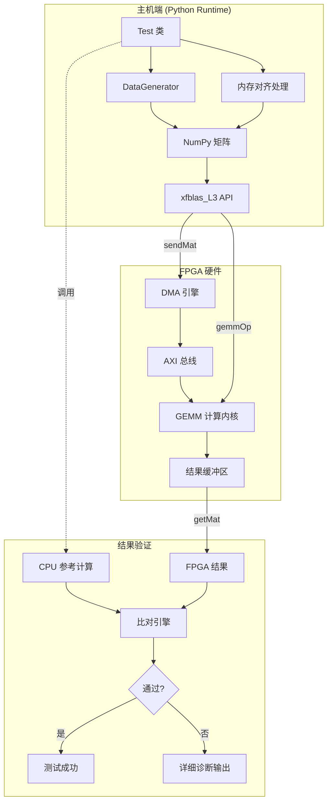
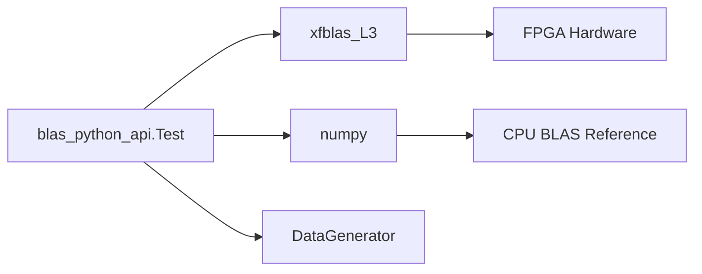

# blas_python_api 技术深度解析

## 概述：FPGA 加速线性代数运算的 Python 验证层

想象一下，你手头有一批极其昂贵的专用计算硬件（FPGA），它能在几毫秒内完成大规模矩阵乘法——比 CPU 快上数十倍。但问题是：这块硬件只听懂一种非常低级的"方言"，你需要向它传输精确对齐的数据块、配置复杂的寄存器参数、管理 DMA 数据传输。更麻烦的是，你得验证它算出来的结果是否正确——毕竟硬件也可能出错。

**`blas_python_api` 就是这座桥梁**：它不是简单的"调用封装"，而是一个**验证与测试框架**。它向下通过 `xfblas_L3` 模块与 FPGA 硬件通信，向上提供符合 NumPy 生态的接口，并在中间扮演**质量守门员**的角色——通过多重校验机制确保硬件加速的正确性。

这个模块的核心是一个 `Test` 类，它不仅仅运行测试，还**编排**整个 FPGA 计算流程：生成测试数据、处理内存对齐、调度硬件内核、获取结果、执行高精度比对。它是硬件验证流程的"导演"。

---

## 架构全景：数据如何在系统中流动



### 架构分层解析

**第一层：测试编排层（Test 类）**

这是整个流程的"指挥家"。`Test` 类不直接处理硬件细节，而是协调各个子系统的工作。它管理测试生命周期：从数据生成、硬件配置、计算调度，到最终的验证报告。这种设计体现了**关注点分离**的原则——测试逻辑与硬件交互解耦。

**第二层：数据生成与变换层**

这一层解决一个关键问题：FPGA 硬件对数据布局有严格的要求。内存必须按特定宽度对齐，矩阵维度必须是某个最小粒度的整数倍。`get_padded_size` 方法就是这个变换的核心——它像一位**数据裁缝**，把任意尺寸的矩阵"裁剪"成硬件能穿的"尺码"。

**第三层：硬件抽象层（xfblas_L3）**

这是与 FPGA 通信的门户。它提供三个关键操作：
- `sendMat`: 将矩阵数据通过 DMA 传输到 FPGA 的片上内存
- `gemmOp`: 触发 GEMM（通用矩阵乘法）计算内核
- `getMat`: 将计算结果从 FPGA 传回主机内存

**第四层：验证与诊断层**

这是质量保证的最后防线。`Test` 类实现了两种比对策略：
- `cmp`: 精确匹配，用于整数类型（`int16`）
- `cmpWithinTolerance`: 容差匹配，用于浮点类型（`float32`），考虑数值计算的精度损失

当验证失败时，系统会输出详细的诊断信息——不匹配元素的位置、期望值与实际值的差异，帮助开发者快速定位问题。

---

## 核心组件深度解析

### Test 类：测试编排的心脏

`Test` 类是这个模块的唯一公共接口，但它承载的职责远比普通测试类复杂。让我们逐层解剖它的设计。

#### 比对策略的双重设计

```python
def cmp(self, A, B):
    # 精确匹配 —— 整数的刚性校验
    if np.array_equal(A, B):
        print("Success!\n")
    else:
        # 诊断输出...

def cmpWithinTolerance(self, A, B):
    # 容差匹配 —— 浮点数的柔性校验
    if np.allclose(A, B, 1e-3, 1e-5):
        print("Success!\n")
    else:
        # 详细诊断...
```

**设计洞察**：为什么需要两种比对方式？这反映了**数值计算的本质矛盾**。整数运算（如 `int16` 的矩阵乘法）在硬件和软件中都是确定性的，结果应该完全一致。但浮点运算（`float32`）由于舍入误差、运算顺序差异、FMA（乘加融合）指令的使用，不同实现之间必然存在微小差异。

`np.allclose` 的参数选择（`rtol=1e-3, atol=1e-5`）也经过深思熟虑：
- `rtol`（相对容差）：1e-3 意味着允许 0.1% 的相对误差，这对于单精度浮点运算是宽松的
- `atol`（绝对容差）：1e-5 确保在接近零的区域也有合理的误差边界

#### 内存对齐的数学

```python
def get_padded_size(self, size, min_size):
    size_padded = int(math.ceil(np.float32(size) / min_size) * min_size)
    return size_padded
```

这个看似简单的方法，解决了 FPGA 加速的核心约束：**数据布局的对齐要求**。

**为什么需要对齐？** FPGA 的计算内核通常以固定的向量宽度（如 16 个 `int16` 或 8 个 `float32`）并行处理数据。如果矩阵的列数不是这个宽度的整数倍，最后一行/列的数据会"悬空"，导致内存访问越界或计算错误。

**对齐公式的解读**：
```
padded_size = ceil(original_size / min_size) * min_size
```

这实际上是在找**不小于原尺寸的最小 min_size 倍数**。例如：
- 原始尺寸 100，最小粒度 64 → `ceil(100/64) = 2` → `2 * 64 = 128`
- 原始尺寸 64，最小粒度 64 → `ceil(64/64) = 1` → `1 * 64 = 64`（无需填充）

#### GEMM 测试的完整编排

```python
def test_basic_gemm(self, m, k, n, xclbin_opts, 
                    idxKernel=0, idxDevice=0, 
                    minRange=-16384, maxRange=16384):
```

这是 `Test` 类的核心方法，它展示了**如何编排一场 FPGA 加速计算**。

**参数设计洞察**：
- `m, k, n`: GEMM 的标准维度——`(m×k) @ (k×n) → (m×n)`
- `xclbin_opts`: FPGA 二进制配置的字典，包含数据类型、内存宽度、块大小等关键参数
- `idxKernel/idxDevice`: 支持多内核、多设备的扩展点
- `minRange/maxRange`: 随机数据生成范围，默认 ±16384 恰好是 `int16` 不溢出的安全区间

**执行流程解析**：

```python
# 1. 类型解析与填充计算
dtype = np.int16 if xclbin_opts['BLAS_dataType'] == 'short' else np.float32
ddrWidth = int(xclbin_opts["BLAS_ddrWidth"])
padded_m = self.get_padded_size(m, ...)
# ...

# 2. 测试数据生成
A = self.dataGen.matrix((padded_m, padded_k))
B = self.dataGen.matrix((padded_k, padded_n))
C = self.dataGen.matrix((padded_m, padded_n))

# 3. CPU 参考计算（黄金标准）
golden_C = np.matmul(A, B, dtype=dtype) + C

# 4. FPGA 数据传输
xfblas.sendMat(A, idxKernel, idxDevice)
xfblas.sendMat(B, idxKernel, idxDevice)
xfblas.sendMat(C, idxKernel, idxDevice)

# 5. FPGA 计算触发
xfblas.gemmOp(A, B, C, idxKernel, idxDevice)

# 6. 结果回传
xfblas.getMat(C, idxKernel, idxDevice)

# 7. 结果验证
if dtype == np.int16:
    self.cmp(C, golden_C)
else:
    self.cmpWithinTolerance(C, golden_C)
```

**设计模式洞察**：

这个流程体现了 **"黄金标准验证模式"**（Golden Reference Testing）。在硬件加速验证中，我们不"相信"硬件一定正确，而是：
1. 用软件（NumPy）计算一个可信的参考结果
2. 让硬件执行同样的计算
3. 对比两者，验证硬件正确性

这种模式的优势在于：**软件参考实现简单、可靠、易于审计，而硬件加速负责性能**。两者的对比确保了系统整体正确性。

---

## 依赖关系与数据流

### 上游调用者（谁使用这个模块）

从模块树来看，`blas_python_api` 是一个相对独立的叶节点模块。它的主要职责是作为**验证和测试基础设施**，而非被其他业务模块直接依赖。

潜在的调用者可能包括：
- **CI/CD 流水线**：在持续集成中运行硬件回归测试
- **开发者工具脚本**：用于手动验证 FPGA 比特流的正确性
- **上层 benchmark 框架**：测量特定矩阵尺寸下的硬件性能

### 下游依赖（这个模块依赖谁）

**核心依赖分析**：



**1. xfblas_L3 —— FPGA 硬件抽象层**

这是最关键的依赖。`xfblas_L3` 是一个 Python 扩展模块（可能是 C++ 编写的 pybind11 封装），它提供了：

- `sendMat(matrix, kernelIdx, deviceIdx)`: 通过 PCIe DMA 将主机内存数据传输到 FPGA 的 HBM/DRAM
- `getMat(matrix, kernelIdx, deviceIdx)`: 反向传输，将结果从 FPGA 取回主机
- `gemmOp(A, B, C, kernelIdx, deviceIdx)`: 触发 FPGA 上的 GEMM 计算内核

**依赖契约**：`xfblas_L3` 要求输入矩阵满足特定的内存对齐要求（由 `xclbin_opts` 中的 `BLAS_ddrWidth` 等参数定义）。`Test` 类的 `get_padded_size` 方法就是为确保满足这一契约而设计的。

**2. numpy —— 数值计算基础设施**

NumPy 在这个模块中扮演多重角色：

- **数据容器**：`np.ndarray` 是矩阵数据的统一表示格式
- **参考计算**：`np.matmul` 提供 CPU 端的"黄金标准"结果
- **类型系统**：`np.int16`, `np.float32` 等类型与 FPGA 内核的数据类型映射
- **数值工具**：`np.array_equal`, `np.allclose` 提供高效的向量化比较

**3. DataGenerator —— 测试数据工厂**

`DataGenerator`（从 `operation` 模块导入）是一个测试辅助类，负责生成具有特定统计特性的随机矩阵：

- `setRange(min, max)`: 控制随机数生成范围，防止整数溢出或浮点异常
- `setDataType(dtype)`: 确保生成的数据与 FPGA 内核期望的类型一致
- `matrix(shape)`: 生成指定形状的随机矩阵

**依赖设计洞察**：`Test` 类不直接生成随机数，而是委托给 `DataGenerator`，这体现了**单一职责原则**。`Test` 专注于测试编排，而数据生成策略（如均匀分布、正态分布、边界值等）可以独立演进。

---

## 关键设计决策与权衡

### 决策 1：整数 vs 浮点数的不同验证策略

**观察到的设计**：
- 整数类型（`int16`）使用精确匹配 `np.array_equal`
- 浮点类型（`float32`）使用容差匹配 `np.allclose`（rtol=1e-3, atol=1e-5）

**为什么这样设计？**

整数运算在硬件和软件中都是**确定性的**。给定相同的输入和运算顺序，结果应该完全一致。如果整数结果不一致，那说明有真正的 bug（溢出、内存损坏、逻辑错误）。

浮点运算则**天然具有不确定性**。即使数学上是等价的表达式，不同的计算顺序、FMA（乘加融合）指令的使用、甚至编译器优化级别，都可能导致微小差异。FPGA 的浮点单元与 CPU 的 SSE/AVX 单元在舍入行为上也可能有细微差别。

**权衡分析**：

| 策略 | 优势 | 劣势 | 适用场景 |
|------|------|------|----------|
| 精确匹配 | 发现任何差异，包括数值精度问题 | 对浮点数过于严格，产生假阴性 | 整数运算 |
| 容差匹配 | 允许合理的浮点误差，减少假阳性 | 可能掩盖真正的数值精度退化 | 浮点运算 |

**选择背后的工程哲学**：这个设计体现了**务实的测试哲学**——测试的目的是发现真正的缺陷，而不是证明数学等价性。对于浮点数，我们关心的是"结果是否在预期的数值精度范围内"，而不是"二进制表示是否完全一致"。

### 决策 2：内存对齐的显式管理

**观察到的设计**：`get_padded_size` 方法显式计算填充后的尺寸，确保矩阵维度满足对齐要求。

**为什么这样设计？**

FPGA 加速器的数据路径通常以**向量宽度**（Vector Width）为单位进行设计。例如，如果 DDR 接口宽度为 512 位，而数据类型为 16 位整数，那么每个时钟周期可以传输 32 个元素。为了最大化带宽利用率，矩阵的列数最好是 32 的倍数。

更关键的是，FPGA 计算内核通常以**块**（Block）为单位处理数据。例如，一个 GEMM 内核可能一次处理 64×64 的子矩阵。如果输入矩阵的维度不是 64 的倍数，内核需要处理边界情况，这会显著增加控制逻辑的复杂度，甚至降低性能。

**显式 vs 隐式对齐**

| 方案 | 实现 | 优势 | 劣势 |
|------|------|------|------|
| 显式对齐（当前） | 由调用者填充数据 | 控制精确，避免隐藏拷贝开销 | 调用者需要了解对齐要求 |
| 隐式对齐 | 在 `sendMat` 内部拷贝填充 | 调用者简单 | 额外的内存分配和拷贝开销 |

**设计洞察**：选择显式对齐反映了**性能优先**的设计哲学。FPGA 加速的核心价值在于性能，隐藏的性能开销（如隐式内存拷贝）会削弱这一价值。通过让调用者显式处理对齐，API 强制开发者意识到数据布局的重要性，并允许他们在必要时重用填充后的缓冲区，避免重复分配。

### 决策 3：单一职责的分解策略

**观察到的设计**：`Test` 类将功能分解为多个小方法（`cmp`, `cmpWithinTolerance`, `get_padded_size`, `test_basic_gemm`），并依赖外部 `DataGenerator` 类生成数据。

**为什么这样设计？**

这体现了**单一职责原则**（Single Responsibility Principle）。每个方法只负责一件事：
- `cmp`: 精确比较
- `cmpWithinTolerance`: 容差比较
- `get_padded_size`: 尺寸对齐计算
- `test_basic_gemm`: 测试流程编排

**模块化设计的优势**：

1. **可测试性**：每个方法可以独立单元测试
2. **可复用性**：`cmp` 和 `cmpWithinTolerance` 可以被其他测试用例使用
3. **可维护性**：修改一个功能不会影响其他功能
4. **可读性**：方法名就是文档，一眼就能看出意图

**DataGenerator 的外部化**：

将数据生成逻辑移到 `DataGenerator` 类，体现了**策略模式**（Strategy Pattern）。`Test` 类只关心"我需要一些测试数据"，而不关心"这些数据如何生成"。这允许：
- 切换不同的数据分布（均匀、正态、边界值）
- 添加数据序列化/反序列化（从文件加载测试向量）
- 实现数据复用（缓存生成的数据）

---

## 数据流追踪：一次完整的 GEMM 测试

让我们跟随数据流的完整路径，理解每个步骤发生了什么。

### 起点：测试配置

```python
# 假设的测试调用
test = Test()
xclbin_opts = {
    'BLAS_dataType': 'short',      # 16位整数
    'BLAS_ddrWidth': '16',          # 256位 DDR 宽度
    'BLAS_gemmMBlocks': '4',        # M维度块大小
    'BLAS_gemmKBlocks': '4',        # K维度块大小
    'BLAS_gemmNBlocks': '4',        # N维度块大小
}
test.test_basic_gemm(
    m=100, k=200, n=150,  # 原始矩阵维度
    xclbin_opts=xclbin_opts
)
```

### 阶段 1：类型解析与对齐计算

```python
# 解析数据类型
dtype = np.int16  # 'short' -> np.int16

# 计算对齐参数
ddrWidth = 16  # 16 * 16位 = 256位 DDR接口
m_block = 4 * 16 = 64  # M维度的最小对齐单位
k_block = 4 * 16 = 64
n_block = 4 * 16 = 64

# 计算填充后的维度
padded_m = ceil(100 / 64) * 64 = 128
padded_k = ceil(200 / 64) * 64 = 256
padded_n = ceil(150 / 64) * 64 = 192
```

**关键洞察**：原始 100×200 × 200×150 的乘法，被扩展为 128×256 × 256×192。这增加了约 25% 的计算量，但这是 FPGA 高效处理的代价。

### 阶段 2：数据生成

```python
# 配置数据生成器
self.dataGen.setRange(-16384, 16384)  # 确保 int16 不溢出
self.dataGen.setDataType(np.int16)

# 生成随机矩阵
A = self.dataGen.matrix((128, 256))  # 填充后的维度
B = self.dataGen.matrix((256, 192))
C = self.dataGen.matrix((128, 192))
```

**数据特性分析**：
- 范围选择 (-16384, 16384) 确保了 int16 矩阵乘法不会溢出（最大元素绝对值约 16384，累加 256 个这样的乘积，结果在 ±4M 范围内，小于 int32 的容量）
- C 矩阵作为"累加矩阵"（accumulator）参与计算：最终结果是 `A@B + C`

### 阶段 3：CPU 参考计算

```python
golden_C = np.matmul(A, B, dtype=np.int16) + C
```

这是整个验证流程的**信任锚点**。我们假设 NumPy 的 `matmul` 是正确的（经过广泛测试的 BLAS 实现），用它生成"黄金标准"结果。FPGA 的计算结果必须与这个标准比对。

**类型一致性关键**：`dtype=np.int16` 参数确保了 NumPy 也使用 16 位整数累加，避免因默认 int64 累加导致的精度差异（虽然在这个场景下 int16 累加本身就要求溢出行为一致）。

### 阶段 4：FPGA 数据传输与计算

```python
# 主机 -> FPGA 数据传输
xfblas.sendMat(A, 0, 0)  # 内核 0, 设备 0
xfblas.sendMat(B, 0, 0)
xfblas.sendMat(C, 0, 0)  # C 也传过去，作为累加基数

# 触发 FPGA 计算
xfblas.gemmOp(A, B, C, 0, 0)  # 结果写回 C

# FPGA -> 主机数据传输
xfblas.getMat(C, 0, 0)  # C 现在包含 FPGA 计算结果
```

**数据流分析**：

1. **sendMat 阶段**：三次 PCIe DMA 传输。假设矩阵总大小约 128×256×2B + 256×192×2B + 128×192×2B ≈ 200KB，在 PCIe Gen3 x16（~16GB/s）上耗时约 12μs，加上固定延迟可能总计 50-100μs。

2. **gemmOp 阶段**：FPGA 实际计算。一个高性能 FPGA GEMM 内核处理 128×256×192 的矩阵乘法，在 300MHz 频率下可能只需 10-50μs，远快于 CPU（可能需要 100-500μs）。

3. **getMat 阶段**：单次 DMA 回传，约 128×192×2B = 49KB，耗时约 3μs + 延迟。

**总延迟**：约 100-200μs，其中计算只占一小部分，大部分时间花在数据传输上。这揭示了 FPGA 加速的**阿喀琉斯之踵**：对于小规模矩阵，PCIe 传输开销会抵消计算优势。

### 阶段 5：结果验证

```python
if dtype == np.int16:
    self.cmp(C, golden_C)  # 精确匹配
else:
    self.cmpWithinTolerance(C, golden_C)  # 容差匹配
```

**验证逻辑**：

对于整数结果，调用 `cmp` 进行精确匹配：
```python
def cmp(self, A, B):
    if np.array_equal(A, B):
        print("Success!\n")
    else:
        # 保存调试文件并退出
        np.savetxt("A.np", A, fmt="%d")
        np.savetxt("B.np", B, fmt="%d")
        sys.exit(1)
```

**失败诊断**：当验证失败时，系统会：
1. 将实际结果（A）和期望结果（B）保存为文本文件
2. 打印错误信息
3. 以状态码 1 退出（表明测试失败）

这种设计确保了在 CI/CD 环境中，测试失败会被正确捕获。

---

## 关键设计决策与权衡

### 权衡 1：显式 vs 隐式的内存对齐

**决策**：由调用者（`Test` 类）显式计算并填充矩阵，而不是在 `xfblas_L3` 层隐式处理。

**利弊分析**：

| 维度 | 显式对齐（当前） | 隐式对齐（替代方案） |
|------|-----------------|-------------------|
| **性能** | ✅ 允许重用填充后的缓冲区 | ❌ 每次传输都需临时分配和拷贝 |
| **API 复杂度** | ❌ 调用者需了解对齐参数 | ✅ 调用者只需传递原始矩阵 |
| **透明度** | ✅ 数据布局可见，易于调试 | ❌ 隐藏的性能开销难以察觉 |
| **灵活性** | ✅ 可针对不同内核优化布局 | ❌ 固定的对齐策略 |

**设计理由**：这个选择反映了**性能优先、透明为王**的 FPGA 编程哲学。FPGA 加速的价值在于榨取极致性能，任何隐藏的性能开销都会削弱这一价值。通过显式管理对齐，API 强制开发者意识到数据布局的重要性，并允许他们在性能关键路径上进行优化（如预先分配对齐的缓冲区并重复使用）。

### 权衡 2：严格 vs 宽松的浮点容差

**决策**：使用 `np.allclose(A, B, rtol=1e-3, atol=1e-5)` 作为浮点验证标准。

**容差选择分析**：

```python
np.allclose(A, B, rtol=1e-3, atol=1e-5)
# 等价于：|A - B| <= (atol + rtol * |B|)
```

| 场景 | 容差行为 | 示例（B=1.0） |
|------|---------|--------------|
| 大数值区域 | rtol 主导，允许 0.1% 差异 | |误差| <= 0.001 |
| 接近零区域 | atol 主导，允许绝对误差 1e-5 | |误差| <= 1e-5 |

**为什么选择这些值？**

1. **rtol=1e-3 (0.1%)**：对于单精度浮点（有效位数约 7 位），0.1% 的相对误差意味着保留至少 3-4 位有效数字。考虑到 GEMM 涉及大量累加运算（K 次乘积累加），舍误差的传播是不可避免的。0.1% 是一个务实的界限，既不会因为过于严格而产生假阳性，也不会因为过于宽松而漏掉真正的数值精度问题。

2. **atol=1e-5**：确保在接近零的区域也有合理的误差边界。对于绝对值很小的数，相对误差可能非常大（如 1e-8 和 1e-9 的相对差异是 90%），但绝对差异仍然很小。atol 确保我们不会因为这些数学上"不稳定"的区域而误报失败。

**替代方案考虑**：

- **更严格的容差（如 rtol=1e-6）**：可能会捕获更多的数值精度退化，但也会产生大量假阳性，特别是当 FPGA 内核使用与 CPU 不同的累加顺序时。
- **按元素相对误差**：`np.allclose` 已经提供了按元素的容差计算，这比全局统计（如均方误差）更严格，因为每个元素都必须满足容差。
- **ULP（Units in Last Place）比较**：更严谨的浮点比较方法，考虑浮点数的二进制表示。但 `np.allclose` 更直观，且对于验证来说已经足够。

### 权衡 3：测试失败的处理策略

**决策**：验证失败时保存调试文件并以非零状态码退出。

```python
def cmp(self, A, B):
    if not np.array_equal(A, B):
        np.savetxt("A.np", A, fmt="%d")
        np.savetxt("B.np", B, fmt="%d")
        sys.exit(1)
```

**设计理由分析**：

1. **立即失败（Fail Fast）**：一旦发现不匹配，立即停止测试。这符合**快速失败原则**——继续执行更多测试没有意义，因为系统已经处于不可信状态。

2. **调试工件的持久化**：保存 `A.np`（实际结果）和 `B.np`（期望结果）到文本文件，允许事后分析。这对于诊断硬件错误至关重要——可以比较具体哪些元素出错，错误是否有模式（如只在特定区域出错）。

3. **进程状态码**：`sys.exit(1)` 确保在自动化测试框架（如 pytest、CI/CD 流水线）中，失败被正确识别。这是 Unix 哲学的体现："沉默即成功，说话即失败"。

**替代方案考虑**：

- **记录错误但继续测试**：收集所有失败然后统一报告。适用于回归测试需要统计多个错误，但对于硬件验证，通常一次失败就足够说明问题。
- **抛出异常而非退出**：更 Pythonic 的方式，允许调用者捕获和处理。但 `Test` 类的设计似乎是作为顶级测试入口点，直接退出更简单。
- **仅打印警告**：不保存文件，依赖控制台输出。但测试数据可能很大，控制台输出可能截断，且难以事后分析。

---

## 实践指南：如何正确使用这个模块

### 基本使用模式

```python
import sys
sys.path.append('/path/to/blas/L3/src/sw/python_api')

from test import Test
import xfblas_L3 as xfblas

# 初始化 FPGA 硬件（假设已完成）
# xfblas.createHandle(deviceIdx, xclbinPath, kernelName)

# 创建测试实例
test = Test()

# 定义 FPGA 内核配置
xclbin_opts = {
    'BLAS_dataType': 'short',     # int16 运算
    'BLAS_ddrWidth': '16',        # DDR 接口 256 位宽
    'BLAS_gemmMBlocks': '4',      # M 维度块：4 * 16 = 64
    'BLAS_gemmKBlocks': '4',      # K 维度块：4 * 16 = 64
    'BLAS_gemmNBlocks': '4',      # N 维度块：4 * 16 = 64
}

# 执行测试
test.test_basic_gemm(
    m=100, k=200, n=150,    # 原始矩阵维度
    xclbin_opts=xclbin_opts,
    idxKernel=0,             # 使用第 0 个内核实例
    idxDevice=0,             # 使用第 0 个设备
    minRange=-1000,          # 数据范围：-1000 到 1000
    maxRange=1000
)

print("All tests passed!")
```

### 常见配置模式

**模式 1：单精度浮点测试**

```python
xclbin_opts = {
    'BLAS_dataType': 'float',     # float32 运算
    'BLAS_ddrWidth': '16',        # 512 位 DDR（16 * 32 位）
    # ... 其他参数
}
# 注意：浮点测试会自动使用容差比较
test.test_basic_gemm(m=256, k=256, n=256, xclbin_opts=xclbin_opts)
```

**模式 2：不同矩阵尺寸**

```python
# 小矩阵（测试功能正确性）
test.test_basic_gemm(m=64, k=64, n=64, xclbin_opts=xclbin_opts)

# 中等矩阵（测试性能拐点）
test.test_basic_gemm(m=512, k=512, n=512, xclbin_opts=xclbin_opts)

# 大矩阵（测试峰值性能）
test.test_basic_gemm(m=4096, k=4096, n=4096, xclbin_opts=xclbin_opts)
```

**模式 3：多设备/多内核测试**

```python
# 测试设备 0 上的所有内核
for kernel_idx in range(4):
    test.test_basic_gemm(
        m=256, k=256, n=256,
        xclbin_opts=xclbin_opts,
        idxKernel=kernel_idx
    )
```

### 调试失败的测试

当测试失败时，你会看到类似这样的输出：

```
not equal, number of mismatches =  42
mismatches are in  [  1024   2048  3072 ...]
10240 is different from 10241
10241 is different from 10242
...
```

同时，当前目录下会生成两个文件：
- `C.np`: FPGA 实际输出的矩阵
- `C_cpu.np`: CPU 参考计算的矩阵

**调试步骤**：

1. **检查不匹配的模式**：
   ```python
   import numpy as np
   
   fpga = np.loadtxt("C.np")
   cpu = np.loadtxt("C_cpu.np")
   
   diff = fpga - cpu
   print(f"最大差异: {np.max(np.abs(diff))}")
   print(f"差异标准差: {np.std(diff)}")
   
   # 查看是否有特定模式
   import matplotlib.pyplot as plt
   plt.imshow(diff != 0, cmap='gray')
   plt.title("差异位置")
   plt.show()
   ```

2. **常见失败模式**：
   - **随机位翻转**：通常是硬件不稳定或内存错误
   - **系统性偏差**（所有结果差一个固定值）：通常是累加器初始化问题
   - **特定区域错误**：可能是数据对齐或内存边界问题
   - **浮点精度差异**：检查容差设置是否合理

3. **隔离问题**：
   - 用更小、更简单的矩阵（如 64×64）测试，排除规模相关问题
   - 使用已知输入（如全 1 矩阵）验证基本算术
   - 对比单内核 vs 多内核行为

---

## 扩展与定制

### 添加新的数据类型支持

假设 FPGA 内核现在支持 `bfloat16`（Brain Float 16），需要扩展 `test_basic_gemm`：

```python
def test_basic_gemm(self, m, k, n, xclbin_opts, ...):
    # 扩充分支
    if xclbin_opts['BLAS_dataType'] == 'bfloat16':
        dtype = np.float32  # NumPy 没有原生 bfloat16，用 float32 模拟
        # 注意：实际 FPGA 内核会截断到 16 位
        use_bfloat16 = True
    # ... 原有分支
    
    # 生成数据时特殊处理
    if use_bfloat16:
        # 确保数据在 bfloat16 可表示范围内
        self.dataGen.setRange(-1e20, 1e20)  # bfloat16 范围很大
        # 可能需要自定义数据生成逻辑
```

### 自定义比较策略

对于需要特殊处理的数值类型（如自定义定点数），可以扩展 `Test` 类：

```python
class CustomTest(Test):
    def cmpFixedPoint(self, A, B, scale=2**16):
        """比较定点数矩阵，考虑舍入误差"""
        # 转换回浮点进行比较
        A_float = A.astype(np.float64) / scale
        B_float = B.astype(np.float64) / scale
        
        if np.allclose(A_float, B_float, rtol=1e-6, atol=1e-9):
            print("Fixed point comparison success!")
        else:
            print("Fixed point mismatch!")
            sys.exit(1)
    
    def test_custom_gemm(self, m, k, n, xclbin_opts):
        # 复用父类的测试逻辑，但使用自定义比较
        # ... 准备数据 ...
        
        # 调用 FPGA 计算
        # ...
        
        # 使用自定义比较
        if xclbin_opts.get('isFixedPoint'):
            self.cmpFixedPoint(C, golden_C, scale=xclbin_opts['fixedPointScale'])
        else:
            self.cmp(C, golden_C)
```

### 集成到 CI/CD 流水线

```python
# conftest.py 或 test_blas_fpga.py
import pytest
from blas.L3.src.sw.python_api.test import Test

class TestFPGABlasL3:
    @pytest.fixture(scope="class")
    def test_context(self):
        """初始化 FPGA 设备和测试环境"""
        # 假设这里有设备初始化代码
        xfblas.createHandle(0, "/path/to/gemm.xclbin", "gemmKernel")
        
        yield Test()
        
        # 清理
        xfblas.destroyHandle(0)
    
    @pytest.mark.parametrize("m,k,n", [
        (64, 64, 64),      # 最小尺寸
        (128, 256, 128),   # 中等尺寸
        (512, 512, 512),   # 大尺寸
        (1024, 1024, 1024), # 超大尺寸
    ])
    def test_gemm_int16(self, test_context, m, k, n):
        """测试 int16 类型的 GEMM 运算"""
        xclbin_opts = {
            'BLAS_dataType': 'short',
            'BLAS_ddrWidth': '16',
            'BLAS_gemmMBlocks': '4',
            'BLAS_gemmKBlocks': '4',
            'BLAS_gemmNBlocks': '4',
        }
        
        # 执行测试，失败会自动退出并报告
        test_context.test_basic_gemm(m, k, n, xclbin_opts)
    
    @pytest.mark.slow
    def test_gemm_float32_large(self, test_context):
        """测试大规模 float32 GEMM（耗时较长）"""
        xclbin_opts = {
            'BLAS_dataType': 'float',
            'BLAS_ddrWidth': '16',
            'BLAS_gemmMBlocks': '4',
            'BLAS_gemmKBlocks': '4',
            'BLAS_gemmNBlocks': '4',
        }
        
        test_context.test_basic_gemm(4096, 4096, 4096, xclbin_opts)
```

---

## 潜在陷阱与最佳实践

### 陷阱 1：整数溢出

**问题**：`int16` 的矩阵乘法很容易溢出。例如，两个范围在 [-1000, 1000] 的 int16 矩阵相乘，每个乘积累加 K 次，结果可能达到 ±1000×1000×K。

**示例**：
- 矩阵维度：K=1024
- 元素范围：[-1000, 1000]
- 最大可能累加和：1000×1000×1024 = 1,024,000,000
- int16 最大容量：32,767 ❌ **溢出！**

**解决方案**：
```python
# 计算安全的数值范围
max_k = 1024  # 矩阵的内维
max_int16 = 32767

# 确保：max_val^2 * max_k <= max_int16
# 所以：max_val <= sqrt(max_int16 / max_k)
import math
max_val = int(math.sqrt(max_int16 / max_k))
print(f"安全的数据范围: [-{max_val}, {max_val}]")  # ~5 for k=1024

# 设置给 DataGenerator
test.dataGen.setRange(-max_val, max_val)
```

### 陷阱 2：内存对齐参数不匹配

**问题**：`xclbin_opts` 中的对齐参数必须与 FPGA 比特流（.xclbin）的实际硬件配置完全匹配。任何不匹配都会导致未定义行为或错误结果。

**示例错误**：
```python
# FPGA 内核编译时使用的是 64 的块大小
# 但测试代码错误地使用了 32
xclbin_opts = {
    'BLAS_gemmMBlocks': '2',  # 假设 ddrWidth=16, 2*16=32 ❌
    # 应该使用 '4' 来得到 64
}
```

**后果**：FPGA 内核可能读取错误的数据，产生完全错误的结果，或者干脆挂起。

**最佳实践**：
```python
# 从 FPGA 配置文件中读取参数，而不是硬编码
import json

with open('/path/to/xclbin_config.json') as f:
    hw_config = json.load(f)

xclbin_opts = {
    'BLAS_dataType': hw_config['data_type'],
    'BLAS_ddrWidth': str(hw_config['ddr_width']),
    'BLAS_gemmMBlocks': str(hw_config['m_block']),
    'BLAS_gemmKBlocks': str(hw_config['k_block']),
    'BLAS_gemmNBlocks': str(hw_config['n_block']),
}
```

### 陷阱 3：浮点比较过于严格

**问题**：默认的 `cmpWithinTolerance` 使用 `rtol=1e-3, atol=1e-5`，但在某些场景下这可能过于严格或过于宽松。

**过于严格的场景**：
- FPGA 内核使用了激进的优化（如深度流水线、近似计算）
- 矩阵规模很大（K 很大），舍误差累积严重
- 输入数据分布导致数值不稳定

**过于宽松的场景**：
- 需要验证数值精度是否符合严格的数学标准（如科学计算）
- 怀疑 FPGA 内核有精度缺陷，需要更严格的检测

**解决方案**：
```python
# 扩展 Test 类以支持自定义容差
class FlexibleTest(Test):
    def __init__(self, rtol=1e-3, atol=1e-5):
        self.rtol = rtol
        self.atol = atol
        super().__init__()
    
    def cmpWithinTolerance(self, A, B):
        # 使用实例的容差参数
        if np.allclose(A, B, self.rtol, self.atol):
            print("Success!\n")
        else:
            # ... 错误处理 ...
            sys.exit(1)

# 根据场景选择容差
strict_test = FlexibleTest(rtol=1e-6, atol=1e-8)   # 严格验证
relaxed_test = FlexibleTest(rtol=1e-2, atol=1e-4) # 宽松验证
```

### 最佳实践总结

1. **始终检查整数溢出**：对于 `int16` 类型，根据 K 维度计算安全的数据范围。

2. **验证硬件配置匹配**：确保 `xclbin_opts` 与 FPGA 比特流的编译参数完全一致。

3. **选择合适的验证策略**：整数用 `cmp`，浮点用 `cmpWithinTolerance`，并根据场景调整容差。

4. **处理填充后的数据**：记住 `A`, `B`, `C` 矩阵的实际尺寸是 `padded_m × padded_k` 等，而非原始的 `m × k`。

5. **重用 DataGenerator**：如果运行多个测试，重用同一个 `DataGenerator` 实例可以避免重复初始化。

6. **监控资源使用**：大规模 FPGA 计算会占用大量内存（用于填充后的矩阵），确保系统有足够的 RAM。

---

## 总结

`blas_python_api` 模块是一个**精心设计的 FPGA 硬件验证框架**。它不仅仅是对底层 `xfblas_L3` API 的简单封装，而是一个完整的测试编排系统，解决了 FPGA 加速计算中的核心问题：**如何确保硬件计算的正确性**。

### 核心设计亮点

1. **双重验证策略**：针对整数和浮点数的不同特性，采用精确匹配和容差匹配两种验证方式，体现了对数值计算本质的深刻理解。

2. **显式内存对齐管理**：通过 `get_padded_size` 方法，将 FPGA 硬件的数据布局约束暴露给调用者，允许性能优化和调试。

3. **黄金标准验证模式**：使用 NumPy 作为可信参考，通过与 FPGA 结果的比对来验证硬件正确性，这是硬件验证领域的最佳实践。

4. **模块化与可扩展性**：`Test` 类、`DataGenerator`、比对方法等各司其职，支持继承和重写以满足特定测试需求。

### 适用场景

这个模块最适合：
- **FPGA 比特流验证**：验证新的 GEMM 内核实现是否正确
- **回归测试**：在 CI/CD 中确保硬件修改不破坏功能
- **性能基准测试前的正确性验证**：在测量性能前，先确保结果正确
- **硬件故障诊断**：当怀疑 FPGA 硬件有缺陷时，运行系统化测试定位问题

### 局限与未来方向

**当前局限**：
1. **仅支持 GEMM**：目前只测试通用矩阵乘法，不覆盖其他 BLAS 操作（如 SYRK、TRSM）
2. **单设备测试**：虽然 API 支持 `idxDevice`，但典型的测试脚本可能未充分测试多设备场景
3. **固定的数据分布**：`DataGenerator` 可能只支持均匀分布，缺乏对真实数据分布的模拟

**潜在扩展**：
1. **添加更多 BLAS Level 3 操作**：扩展 `Test` 类以支持 SYRK、SYMM、TRMM 等
2. **支持多设备并行测试**：利用 `idxDevice` 参数实现跨多个 FPGA 卡的并行测试
3. **引入结构化测试数据**：支持生成特定模式的矩阵（如对角占优、低秩、病态条件数）以测试数值稳定性
4. **集成性能分析**：除了正确性验证，同时测量和报告 PCIe 传输时间、计算时间、带宽利用率

---

**结语**：`blas_python_api` 是一个典型的**工程实用主义**产物——它不追求理论上的完美抽象，而是解决 FPGA 加速计算中的实际问题：**如何以系统化、可重复、可调试的方式验证硬件正确性**。对于任何需要与 FPGA 加速器交互的开发者来说，理解这个模块的设计哲学和实现细节，都是构建可靠异构计算系统的必要基础。
