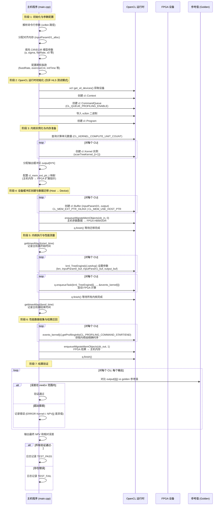

# CIR Family Swaption Host Timing 模块深度解析

## 一句话概括

本模块是 **Xilinx FPGA 金融加速库中的利率衍生品定价引擎主机端控制器**，负责在主机 CPU 上编排 Cox-Ingersoll-Ross (CIR) 及其扩展模型 (ECIR) 的百慕大型互换期权 (Bermudan Swaption) 定价计算——从模型参数配置、FPGA 内核加载、数据搬移到执行时序测量与结果验证，构成完整的软硬件协同计算流水线。

---

## 1. 这个模块解决什么问题？

### 1.1 问题空间：利率衍生品定价的计算困境

在金融工程领域，**互换期权 (Swaption)** 是一种赋予持有者在将来某个时间点进入利率互换合约权利的期权。其中**百慕大型互换期权**允许持有一系列离散的时间点上行权，这使其定价比欧式期权复杂得多。

这类定价问题通常采用**树模型 (Tree Model)** 求解——将利率随机过程离散化为三叉树或二叉树，通过反向归纳 (backward induction) 计算每个节点的价值。对于 CIR 模型：

$$dr_t = a(b - r_t)dt + \sigma\sqrt{r_t}dW_t$$

其平方根扩散项使得利率保持非负，但这也导致转移概率计算复杂，传统 CPU 实现面临以下挑战：

1. **计算密集**：每个时间步需要计算大量节点的转移概率和折现因子
2. **内存带宽受限**：树结构遍历对内存访问模式敏感
3. **延迟敏感**：交易场景需要亚毫秒级响应

### 1.2 解决方案：FPGA 加速与主机端编排

Xilinx 的解决方案将计算密集型的**树遍历和反向归纳逻辑部署在 FPGA 内核** (`scanTreeKernel`) 上，利用 FPGA 的并行性同时处理多个树节点。而本模块 (`cir_family_swaption_host_timing`) 则是**主机端的大脑**——它不执行实际的数学计算，而是：

1. **准备舞台**：配置 CIR/ECIR 模型参数（均值回归速度 `a`、波动率 `σ`、长期均值 `b` 等）
2. **搭建数据通道**：分配对齐内存、创建 OpenCL 缓冲区、建立主机-设备内存映射
3. **编排执行**：加载 FPGA 二进制 (`xclbin`)、实例化内核、启动计算任务
4. **测量与验证**：记录主机端和内核级执行时间，对比 FPGA 结果与 golden 参考值

简言之，本模块是**连接金融数学模型与异构计算硬件的桥梁**，让量化分析师可以用 CIR 模型定价百慕大互换期权，而无需关心 FPGA 编程细节。

---

## 2. 心智模型：如何理解这个模块的抽象？

### 2.1 类比：交响乐团的指挥

想象一个交响乐团正在演奏一首复杂的交响乐：

| 交响乐团 | 本模块对应角色 |
|---------|--------------|
| **乐谱 (Score)** | 模型参数配置 (CIR/ECIR 参数、互换期权条款) |
| **指挥家 (Conductor)** | 主机端主函数 (`main`) —— 本模块的核心 |
| **乐团成员 (Musicians)** | FPGA 计算单元 (`scanTreeKernel`) |
| **舞台管理 (Stage Manager)** | OpenCL 运行时 (`cl::Context`, `cl::CommandQueue`) |
| **调音师 (Tuner)** | 时序测量代码 (`gettimeofday`, `CL_PROFILING_COMMAND_*`) |
| **乐评人 (Critic)** | 结果验证逻辑 (对比 golden 值) |

指挥家**不亲自演奏任何乐器**（不进行树遍历计算），但他必须：
- 理解乐谱（解析模型参数）
- 协调乐团成员的入场和演奏时机（内存迁移、内核启动）
- 掌控整体节奏（时序控制）
- 确保演出质量（结果验证）

### 2.2 核心抽象层次

本模块的代码组织遵循**分层抽象**原则，从高层到低层依次为：

```
┌─────────────────────────────────────────────────────────────────┐
│  Layer 4: 金融模型层 (Financial Model)                          │
│  - CIR/ECIR 模型参数 (a, sigma, flatRate, x0)                  │
│  - 互换期权合约条款 (fixedRate, exerciseCnt, floatingCnt)       │
├─────────────────────────────────────────────────────────────────┤
│  Layer 3: 主机编排层 (Host Orchestration) ← 本模块核心          │
│  - 参数打包 (ScanInputParam0, ScanInputParam1)                  │
│  - OpenCL 上下文管理 (cl::Context, cl::CommandQueue)          │
│  - 内存管理 (aligned_alloc, cl::Buffer with CL_MEM_EXT_PTR)    │
│  - 内核生命周期 (cl::Kernel instantiation, setArg, enqueueTask)│
│  - 时序测量 (gettimeofday, CL_PROFILING_COMMAND_*)              │
├─────────────────────────────────────────────────────────────────┤
│  Layer 2: FPGA 内核层 (FPGA Kernel)                             │
│  - scanTreeKernel (C++/HLS 实现的树遍历逻辑)                    │
│  - 计算单元 (Compute Units, CUs) 由 xclbin 定义                │
├─────────────────────────────────────────────────────────────────┤
│  Layer 1: 硬件层 (Hardware)                                     │
│  - Xilinx Alveo FPGA 卡 (U50/U200/U250/U280 等)                │
│  - HBM/DDR 内存、PCIe 接口                                      │
└─────────────────────────────────────────────────────────────────┘
```

**本模块的核心职责集中在 Layer 3（主机编排层）**，它通过明确定义的接口与上层（金融模型参数）和下层（OpenCL/FPGA 运行时）交互。

### 2.3 关键数据结构的心智映射

理解本模块需要把握三个核心数据结构的分工：

| 数据结构 | 类比 | 用途 | 生命周期 |
|---------|-----|------|---------|
| `ScanInputParam0` | 期权合约的"标的资产档案" | 存储与特定互换期权实例相关的数据（名义本金 `nominal`、初始利率 `x0`、现金流时间表 `initTime` 等） | 每次定价请求创建，验证后释放 |
| `ScanInputParam1` | 市场模型的"环境参数表" | 存储 CIR/ECIR 模型参数（`a`、`sigma`、`flatRate`）和期权行权结构（`exerciseCnt`、`fixedCnt`、`floatingCnt`） | 同一批定价任务共享 |
| `DT* output` | 计算结果的"收件信箱" | FPGA 内核写入 NPV（净现值）计算结果的缓冲区 | 内核执行前分配，验证后释放 |

这种分离设计体现了**关注点分离 (Separation of Concerns)** 原则：`Param0` 随具体衍生品合约变化，`Param1` 随市场模型变化，而两者组合起来才能驱动 FPGA 完成一次完整的定价计算。

---

## 3. 数据流全景：关键操作的端到端追踪

### 3.1 典型执行流程时序图

以下 Mermaid 序列图展示了从程序启动到结果验证的完整数据流动：



### 3.2 数据流解析：关键阶段详解

#### 阶段 1：参数配置层（Lines 88-176 in main.cpp）

这是数据流的起点。代码在此处构建了两个核心参数结构：

```cpp
// 内存分配（使用对齐分配以满足 FPGA DMA 要求）
ScanInputParam0* inputParam0_alloc = aligned_alloc<ScanInputParam0>(1);
ScanInputParam1* inputParam1_alloc = aligned_alloc<ScanInputParam1>(1);
```

**关键设计决策**：使用 `aligned_alloc` 而非 `malloc` 是因为 FPGA 的 DMA 引擎通常要求内存地址按缓存行（通常为 64 字节）对齐，否则数据传输会失败或性能急剧下降。

参数填充逻辑分为两个层次：

| 参数类别 | 存储结构 | 代表字段 | 金融含义 |
|---------|---------|---------|---------|
| 实例特定参数 | `ScanInputParam0` | `x0` (初始利率), `nominal` (名义本金), `initTime[]` | 特定互换合约的现金流时间表和初始状态 |
| 模型与市场参数 | `ScanInputParam1` | `a` (均值回归速度), `sigma` (波动率), `flatRate`, `fixedRate` | CIR 模型参数和市场利率曲线 |

**数据依赖关系**：`ScanInputParam1` 中的 `exerciseCnt`、`fixedCnt`、`floatingCnt` 数组定义了行权时间点和现金流结构的索引，这些索引与 `ScanInputParam0` 中的 `initTime` 数组配合使用，才能正确解析完整的互换合约现金流时间表。

#### 阶段 2-3：OpenCL 运行时初始化与内核准备（Lines 178-286）

这是从"金融参数"到"硬件执行"的转换层。

**设备发现与上下文创建**：
```cpp
std::vector<cl::Device> devices = xcl::get_xil_devices();
cl::Device device = devices[0];
cl::Context context(device, NULL, NULL, NULL, &cl_err);
```

这里使用了 Xilinx 的 `xcl2` 封装库简化 OpenCL 样板代码。关键设计点是**单设备假设**——代码直接取 `devices[0]`，这暗示该基准测试设计在单 FPGA 卡上运行。

**命令队列配置**：
```cpp
#ifdef SW_EMU_TEST
cl::CommandQueue q(context, device, CL_QUEUE_PROFILING_ENABLE, &cl_err);
#else
cl::CommandQueue q(context, device, CL_QUEUE_PROFILING_ENABLE | CL_QUEUE_OUT_OF_ORDER_EXEC_MODE_ENABLE, &cl_err);
#endif
```

这里隐藏了一个**重要的执行模式差异**：
- **软件仿真模式 (SW_EMU_TEST)**：使用顺序执行队列，简化调试
- **硬件/硬件仿真模式**：启用乱序执行 (`CL_QUEUE_OUT_OF_ORDER_EXEC_MODE_ENABLE`)，允许内核在数据就绪时立即启动，最大化 FPGA 利用率

**多计算单元 (CU) 处理**：
```cpp
std::string krnl_name = "scanTreeKernel";
cl_uint cu_number;
{
    cl::Kernel k(program, krnl_name.c_str());
    k.getInfo(CL_KERNEL_COMPUTE_UNIT_COUNT, &cu_number);
}

std::vector<cl::Kernel> krnl_TreeEngine(cu_number);
for (cl_uint i = 0; i < cu_number; ++i) {
    std::string krnl_full_name = krnl_name + ":{" + krnl_name + "_" + std::to_string(i + 1) + "}";
    krnl_TreeEngine[i] = cl::Kernel(program, krnl_full_name.c_str(), &cl_err);
}
```

这段代码实现了一个**动态 CU 发现机制**。`xclbin` 文件在编译时可配置包含多个相同的内核实例（CU），主机代码在运行时查询实际可用的 CU 数量，并为每个 CU 创建独立的内核对象。这使得**同一套主机代码可以适配从单 CU（低资源占用）到多 CU（高吞吐量）的不同 FPGA 二进制配置**。

#### 阶段 4-5：数据传输与内核执行（Lines 288-389）

这是数据流的**核心执行阶段**。

**内存映射与缓冲区创建**：
```cpp
// 配置扩展指针，建立主机内存到特定 CU 的映射
for (int c = 0; c < cu_number; ++c) {
    mext_in0[c] = {1, inputParam0_alloc, krnl_TreeEngine[c]()};  // flags=1 表示输入
    mext_in1[c] = {2, inputParam1_alloc, krnl_TreeEngine[c]()};  // flags=2 表示输入
    mext_out[c] = {3, output[c], krnl_TreeEngine[c]()};            // flags=3 表示输出
}

// 创建 OpenCL 缓冲区，使用主机指针直接映射
for (int i = 0; i < cu_number; i++) {
    inputParam0_buf[i] = cl::Buffer(context, CL_MEM_EXT_PTR_XILINX | CL_MEM_USE_HOST_PTR | CL_MEM_READ_WRITE,
                                    sizeof(ScanInputParam0), &mext_in0[i]);
    // ... 类似创建其他缓冲区
}
```

这里使用了一种**零拷贝 (Zero-Copy) 内存策略**。通过 `CL_MEM_USE_HOST_PTR` 标志，OpenCL 缓冲区直接映射已分配的主机内存，而非在设备上分配独立内存。`CL_MEM_EXT_PTR_XILINX` 是 Xilinx 特有的扩展，允许通过 `cl_mem_ext_ptr_t` 结构指定内存与特定 CU 的亲和性。这种设计的**核心优势**是消除主机与设备间的显式内存复制，但**代价**是要求主机内存必须满足 FPGA DMA 的对齐和连续物理页要求。

**双向数据传输**：
```cpp
// H2D (Host to Device): 输入参数迁移
std::vector<cl::Memory> ob_in;
for (int i = 0; i < cu_number; i++) {
    ob_in.push_back(inputParam0_buf[i]);
    ob_in.push_back(inputParam1_buf[i]);
}
q.enqueueMigrateMemObjects(ob_in, 0, nullptr, nullptr);  // flags=0 表示 H2D
q.finish();  // 阻塞等待迁移完成

// ... 内核执行 ...

// D2H (Device to Host): 结果迁回
std::vector<cl::Memory> ob_out;
for (int i = 0; i < cu_number; i++) {
    ob_out.push_back(output_buf[i]);
}
q.enqueueMigrateMemObjects(ob_out, 1, nullptr, nullptr);  // flags=1 表示 D2H
q.finish();
```

`enqueueMigrateMemObjects` 是 Xilinx OpenCL 扩展，用于显式控制内存迁移。`flags=0` 表示主机到设备 (H2D)，`flags=1` 表示设备到主机 (D2H)。注意尽管使用了 `CL_MEM_USE_HOST_PTR`，显式迁移调用仍是必要的，用于触发 FPGA 的缓存一致性协议和确保 DMA 传输完成。

**分层时序测量**：
```cpp
// 主机端粗粒度时序
struct timeval start_time, end_time;
gettimeofday(&start_time, 0);  // 内核启动前
// ... 内核执行 ...
gettimeofday(&end_time, 0);    // 内核完成后
std::cout << "FPGA Execution time " << tvdiff(&start_time, &end_time) / 1000.0 << "ms" << std::endl;

// 设备端细粒度时序 (使用 OpenCL Profiling)
cl::Event events_kernel[cu_number];
q.enqueueTask(krnl_TreeEngine[i], nullptr, &events_kernel[i]);  // 关联事件对象

// 执行后查询精确时序
unsigned long time1, time2;
events_kernel[c].getProfilingInfo(CL_PROFILING_COMMAND_START, &time1);
events_kernel[c].getProfilingInfo(CL_PROFILING_COMMAND_END, &time2);
printf("Kernel-%d Execution time %d ms\n", c, (time2 - time1) / 1000000.0);
```

这是**双轨时序测量策略**：
1. **主机端 (`gettimeofday`)**：测量端到端延迟，包含 OpenCL 开销、驱动调用、内存迁移等
2. **设备端 (`CL_PROFILING_COMMAND_*`)**：仅测量内核在 FPGA 上的实际执行时间，精度达纳秒级

两者的差值揭示了**主机端开销占比**，对性能优化至关重要。

#### 阶段 6：结果验证（Lines 391-412）

**数值精度验证**：
```cpp
int err = 0;
DT minErr = 10e-10;  // 容忍误差阈值

for (int i = 0; i < cu_number; i++) {
    for (int j = 0; j < len; j++) {
        DT out = output[i][j];  // FPGA 计算结果
        if (std::fabs(out - golden) > minErr) {  // 与参考值比较
            err++;
            std::cout << "[ERROR] Kernel-" << i + 1 << ": NPV[" << j << "]= " 
                      << std::setprecision(15) << out
                      << " ,diff/NPV= " << (out - golden) / golden << std::endl;
        }
    }
}
```

验证逻辑遵循**单元测试模式**：
1. **Golden 参考值**：预先通过高精度 CPU 实现（可能是 MATLAB 或 Python 量化库）计算，作为"地面实况"
2. **相对误差容忍**：`10e-10` 的绝对误差阈值对金融定价而言极为严格，反映了 FPGA 实现与双精度浮点参考的一致性
3. **逐元素验证**：对每个 CU 的每个输出进行验证，确保并行执行的正确性

**测试状态报告**：
```cpp
err ? logger.error(xf::common::utils_sw::Logger::Message::TEST_FAIL)
    : logger.info(xf::common::utils_sw::Logger::Message::TEST_PASS);
```

使用 Xilinx 的统一日志工具报告测试状态，便于集成到 CI/CD 流水线。

---

## 4. 设计权衡与架构决策

### 4.1 执行模式：HLS 测试 vs 硬件/仿真模式

本模块通过条件编译 (`#ifndef HLS_TEST`) 支持三种执行模式，这是**关键的架构决策**：

| 模式 | 宏定义 | OpenCL 初始化 | 适用场景 | 权衡考量 |
|-----|-------|--------------|---------|---------|
| **HLS 纯仿真** | `HLS_TEST` 定义 | 跳过全部 OpenCL 代码 | C/RTL 协同仿真，验证算法逻辑 | 无需 FPGA 硬件，但只能验证 C++ 代码逻辑，无法测试真实数据搬移 |
| **软件仿真** | `XCL_EMULATION_MODE=sw_emu` | 完整 OpenCL 初始化，但命令队列禁用乱序执行 | 验证主机-设备交互逻辑，无需硬件 | 在 x86 上模拟 OpenCL API 行为，内核执行是虚拟的，时序测量无意义 |
| **硬件/硬件仿真** | `XCL_EMULATION_MODE=hw_emu` 或未设置 | 完整 OpenCL 初始化，启用乱序执行队列 | 实际硬件执行或硬件级周期精确仿真 | 需要 FPGA 硬件或仿真模型，提供真实的性能和精度数据 |

**关键设计洞察**：`HLS_TEST` 模式的存在表明本模块的代码**既用于主机端部署，也用于 HLS 综合前的 C/RTL 协同仿真**。在 HLS 流程中，Vitis HLS 工具会编译 `main.cpp` 作为测试平台 (Testbench)，但不需要实际的 OpenCL 运行时——此时 `scanTreeKernel` 的调用会被替换为 HLS 生成的 RTL 仿真包装器。

### 4.2 多 CU (Compute Unit) 并行策略

本模块通过运行时查询动态发现可用 CU 数量 (`cu_number`)，并采用**数据并行 (Data Parallelism)** 策略：

```
                    ┌─────────────────────────────────────┐
                    │           主机内存                   │
                    │  inputParam0/1_alloc (共享参数)     │
                    └──────────────┬──────────────────────┘
                                   │ 多个 CU 共享相同输入
         ┌─────────────────────────┼─────────────────────────┐
         │                         │                         │
         ▼                         ▼                         ▼
   ┌───────────┐            ┌───────────┐            ┌───────────┐
   │ scanTree  │            │ scanTree  │            │ scanTree  │
   │ Kernel_1  │            │ Kernel_2  │            │ Kernel_N  │
   │  (CU 1)   │            │  (CU 2)   │            │  (CU N)   │
   └─────┬─────┘            └─────┬─────┘            └─────┬─────┘
         │                         │                         │
         ▼                         ▼                         ▼
   ┌───────────┐            ┌───────────┐            ┌───────────┐
   │ output[0] │            │ output[1] │            │ output[N] │
   └───────────┘            └───────────┘            └───────────┘
```

**权衡分析**：

1. **优点**：
   - **可扩展性**：同一套主机代码可适配不同规模的 FPGA（单 CU 到多 CU）
   - **吞吐提升**：多 CU 并行处理独立定价请求，提升整体吞吐量
   - **资源共享**：所有 CU 共享相同的输入参数结构，减少内存占用

2. **局限**：
   - **数据并行限制**：当前实现每个 CU 处理相同的输入参数（`inputParam0/1_alloc` 被所有 CU 共享），这意味着多 CU 场景下每个 CU 执行完全相同的计算。真正的扩展性需要为每个 CU 分配不同的输入实例（当前代码中 `for (int i = 0; i < 1; i++)` 暗示这是单实例原型）。
   - **内存带宽瓶颈**：多个 CU 同时读取共享参数可能竞争 HBM/DDR 带宽

**改进方向**：若要实现真正的多实例并行，需将输入分配改为：
```cpp
// 当前实现：所有 CU 共享同一输入
ScanInputParam0* inputParam0_alloc = aligned_alloc<ScanInputParam0>(1);

// 改进实现：每个 CU 有独立输入
ScanInputParam0* inputParam0_alloc[CU_MAX];
for (int c = 0; c < cu_number; c++) {
    inputParam0_alloc[c] = aligned_alloc<ScanInputParam0>(1);
    // 填充该 CU 的独立定价实例参数
}
```

### 4.3 时序测量策略：主机端 vs 设备端

本模块实现了**双重时序测量机制**，这是性能分析的关键设计：

```
┌──────────────────────────────────────────────────────────────────────┐
│                        完整执行周期                                  │
│  ┌──────────────┐                                    ┌───────────┐ │
│  │   主机设置    │ ───────┐    ┌──────────┐    ┌─────▶│  主机验证  │ │
│  │  (μs ~ ms)   │        │    │  FPGA    │    │      │ (μs ~ ms) │ │
│  └──────────────┘        │    │  执行    │    │      └───────────┘ │
│         │                │    │ (ms~s)   │    │             │       │
│         │                ▼    └──────────┘    ▼             │       │
│         │           ┌─────────┐        ┌──────────┐        │       │
│         └──────────▶│ 数据迁移 │───────▶│ 结果迁回  │────────┘       │
│                     │ (H2D)   │        │ (D2H)    │                │
│                     └─────────┘        └──────────┘                │
│                                                                    │
│  ◄──────────────── 主机端测量 (gettimeofday) ──────────────────────▶ │
│                            包含：设置 + 迁移 + FPGA 执行 + 迁回      │
│                                                                    │
│                              ┌───────────────────────────┐         │
│                              │  设备端测量 (CL_PROFILING) │         │
│                              │      仅 FPGA 执行时间       │         │
│                              └───────────────────────────┘         │
└──────────────────────────────────────────────────────────────────────┘
```

**双重测量的必要性**：

| 测量层级 | API | 精度 | 包含内容 | 主要用途 |
|---------|-----|------|---------|---------|
| **主机端** | `gettimeofday` | μs 级 | 完整流程（设置 + H2D 迁移 + FPGA 执行 + D2H 迁回 + 验证） | 端到端性能评估，模拟真实生产环境延迟 |
| **设备端** | `CL_PROFILING_COMMAND_START/END` | ns 级 | 仅 FPGA 内核执行（从 `enqueueTask` 提交到硬件完成） | 纯计算性能分析，排除数据传输和主机开销 |

**性能诊断公式**：
```
主机端总时间 = 主机设置开销 + H2D 数据传输时间 + 设备端执行时间 + D2H 数据传输时间 + 主机验证开销

数据传输占比 = (主机端总时间 - 设备端测量时间) / 主机端总时间 × 100%
```

当数据传输占比过高（如 >50%）时，表明内存带宽成为瓶颈，应考虑：
1. 增加每个输入实例的计算密度（更大的树或更多时间步）
2. 使用 HBM 高带宽内存而非 DDR
3. 批处理多个定价请求，摊销传输开销

### 4.4 内存管理策略：RAII 与手动管理的权衡

本模块采用**混合内存管理策略**，反映了 FPGA 加速场景的特殊需求：

```cpp
// 1. 手动对齐分配（C 风格）
ScanInputParam0* inputParam0_alloc = aligned_alloc<ScanInputParam0>(1);
DT* output[i] = aligned_alloc<DT>(N * K);

// 2. OpenCL 对象使用 RAII 封装（C++ 风格）
cl::Context context(device, NULL, NULL, NULL, &cl_err);
cl::CommandQueue q(context, device, ...);
cl::Buffer inputParam0_buf[i](context, CL_MEM_EXT_PTR_XILINX | ..., sizeof(ScanInputParam0), &mext_in0[i]);
```

**混合策略的合理性**：

| 场景 | 管理方式 | 原因 |
|-----|---------|------|
| **主机端数据缓冲区** (`inputParam0/1_alloc`, `output`) | 手动 `aligned_alloc` + 手动释放 | FPGA DMA 要求物理连续且对齐的内存，标准 `new`/`malloc` 不保证对齐，`std::vector` 可能有额外开销。必须手动管理以精确控制生命周期和对齐属性。 |
| **OpenCL 运行时对象** (`cl::Context`, `cl::CommandQueue`, `cl::Buffer`, `cl::Kernel`) | RAII 自动管理 | `cl::` 类已封装 `clRetain*`/`clRelease*` 调用，遵循现代 C++ 实践，减少内存泄漏风险。这些对象的生命周期与作用域清晰对应。 |

**内存所有权图解**：

```
┌────────────────────────────────────────────────────────────────────┐
│                         主机进程地址空间                             │
│                                                                    │
│  ┌────────────────────────┐        ┌──────────────────────────┐    │
│  │   aligned_alloc 区域   │        │    OpenCL 运行时对象      │    │
│  │  (物理连续, 页对齐)      │        │  (cl::Buffer 等 RAII 管理) │    │
│  │                        │        │                          │    │
│  │ ┌──────────────────┐   │        │ ┌─────────────────────┐  │    │
│  │ │ inputParam0_alloc│◄──┼──┐     │ │inputParam0_buf[0]   │  │    │
│  │ │ (ScanInputParam0)│   │  │     │ │(cl::Buffer)         │  │    │
│  │ └──────────────────┘   │  │     │ └─────────────────────┘  │    │
│  │                        │  │     │            │               │    │
│  │ ┌──────────────────┐   │  │     │            ▼               │    │
│  │ │ inputParam1_alloc│◄──┼──┤     │ ┌─────────────────────┐  │    │
│  │ │ (ScanInputParam1)│   │  │     │ │inputParam0_buf[1]   │  │    │
│  │ └──────────────────┘   │  │     │ │(cl::Buffer)         │  │    │
│  │                        │  │     │ └─────────────────────┘  │    │
│  │ ┌──────────────────┐   │  │     │           ...            │    │
│  │ │ output[0..N]   │◄──┼──┘     │                          │    │
│  │ │ (DT[N*K])      │   │        │                          │    │
│  │ └──────────────────┘   │        │                          │    │
│  └────────────────────────┘        └──────────────────────────┘    │
│                                                                    │
│  【所有权边界】                                                      │
│  ━━━━━━━━━━━━━━━━━━━━━━━━━━━━━━━━━━━━━━━━━━━━━━━━━━━━━━━━━━━━━━━━  │
│  • aligned_alloc 区域: 手动管理，main 函数结尾需手动 free           │
│  • OpenCL RAII 对象: 自动管理，超出作用域自动调用 clRelease*         │
│                                                                    │
└────────────────────────────────────────────────────────────────────┘
                                    │
                                    │ PCIe 总线 / 内存总线
                                    ▼
┌────────────────────────────────────────────────────────────────────┐
│                         FPGA 设备                                  │
│  ┌──────────────────────────────────────────────────────────────┐  │
│  │                     HBM / DDR 内存                            │  │
│  │  ┌─────────────┐  ┌─────────────┐  ┌─────────────────────┐   │  │
│  │  │InputParam0  │  │InputParam1  │  │Output Buffer        │   │  │
│  │  │(CU 0 只读)  │  │(CU 0 只读)  │  │(CU 0 读写)          │   │  │
│  │  └─────────────┘  └─────────────┘  └─────────────────────┘   │  │
│  │  ┌─────────────┐  ┌─────────────┐  ┌─────────────────────┐   │  │
│  │  │InputParam0  │  │InputParam1  │  │Output Buffer        │   │  │
│  │  │(CU 1 只读)  │  │(CU 1 只读)  │  │(CU 1 读写)          │   │  │
│  │  └─────────────┘  └─────────────┘  └─────────────────────┘   │  │
│  │                        ...                                  │  │
│  └──────────────────────────────────────────────────────────────┘  │
│                            │                                       │
│                            ▼                                       │
│  ┌──────────────────────────────────────────────────────────────┐  │
│  │                   FPGA 计算单元 (CUs)                         │  │
│  │  ┌─────────────┐  ┌─────────────┐       ┌─────────────┐     │  │
│  │  │ scanTree   │  │ scanTree   │  ...  │ scanTree   │     │  │
│  │  │ Kernel_1   │  │ Kernel_2   │       │ Kernel_N   │     │  │
│  │  │ (CU 1)     │  │ (CU 2)     │       │ (CU N)     │     │  │
│  │  └─────────────┘  └─────────────┘       └─────────────┘     │  │
│  │  并行执行相同定价计算                                           │  │
│  └──────────────────────────────────────────────────────────────┘  │
└────────────────────────────────────────────────────────────────────┘
```

### 4.3 错误处理策略：防御式编程与快速失败

本模块采用**分层错误处理策略**，在不同层级有不同的处理方式：

| 层级 | 错误检测 | 处理方式 | 设计理念 |
|-----|---------|---------|---------|
| **命令行解析** | `parser.getCmdOption("-xclbin", xclbin_path)` 返回 false | 打印 "ERROR:xclbin path is not set!" 并立即 `return 1` | **快速失败 (Fail Fast)**：必要配置缺失时立即终止，避免后续空指针异常 |
| **OpenCL 运行时** | `cl_err != CL_SUCCESS` | 通过 `logger.logCreateContext/CommandQueue/Program` 记录 | **错误传播与日志**：OpenCL 错误码通过 Logger 封装记录，但不中断执行，依赖后续验证捕获 |
| **数值验证** | `std::fabs(out - golden) > minErr` | 记录详细错误信息（Kernel ID、NPV 值、相对误差），`err++` 计数 | **精确诊断**：错误信息包含足够上下文便于调试，最终汇总决定 TEST_PASS/FAIL |

**关键设计洞察**：模块**不采用 C++ 异常机制**，而是使用 C 风格错误码和显式检查。这是 FPGA 加速代码的常见选择，因为：
1. OpenCL C API 本身是 C 接口，异常封装会增加开销
2. 主机端代码需要与可能使用 C 编写的其他库交互
3. 在性能敏感路径（如内核启动）中，异常处理的栈展开机制可能引入不可预测延迟

### 4.4 可配置性与硬编码的权衡

模块中同时存在**运行时配置**和**硬编码常量**，理解这种混合策略至关重要：

**运行时可配置项** (适合不同定价场景)：
- `timestep`：树模型时间步数（通过 `run_mode == "hw_emu"` 有条件减小）
- `xclbin_path`：FPGA 二进制路径（命令行参数）
- `cu_number`：计算单元数量（运行时从 xclbin 查询）

**硬编码常量** (金融模型特定)：
- `golden` 参考值：针对不同 `timestep` (10, 50, 100, 500, 1000) 的预计算 NPV
- `fixedRate`、`initTime[]`、`exerciseCnt[]` 等互换条款参数
- 模型参数 (`a`, `sigma`, `flatRate`, `x0`) 的硬编码数值

**权衡分析**：

| 策略 | 优势 | 劣势 | 适用场景 |
|-----|------|------|---------|
| **硬编码测试用例** (当前实现) | 确保可重复性，便于回归测试；golden 值来源可追溯（通常是 Python/MATLAB 参考实现） | 需要重新编译才能更换测试场景；不适合生产环境的动态定价请求 | L2 级基准测试 (Benchmark)，验证 FPGA 实现正确性 |
| **完全动态配置** (生产级) | 灵活性高，支持实时定价场景 | 增加输入验证复杂度；golden 值无法预计算，需在线对比 CPU 实现 | L3 级生产部署，集成到交易系统 |

**关键洞察**：本模块的定位是 **L2 基准测试 (Benchmark)** 而非 L3 生产部署。硬编码测试用例是**有意为之**的设计选择，目的是：
1. **可重复验证**：任何开发者运行相同代码应得到相同结果（在精度容忍范围内）
2. **快速回归**：CI 系统可自动运行，对比 golden 值立即知道 FPGA 实现是否被破坏
3. **性能基线**：不同优化版本（编译器版本、FPGA 策略、HLS 优化指令）可通过相同测试用例公平比较

若要将此模块应用于生产环境，核心改动应是：
1. 将硬编码参数改为从配置文件或网络接口动态读取
2. 移除 golden 值验证，改为对比 CPU 实现的在线校验（或仅记录日志）
3. 添加容错机制（重试、降级到 CPU 计算）

---

## 5. 新贡献者必读：陷阱、边界情况与隐性契约

### 5.1 内存对齐：隐性的硬件契约

**陷阱**：`aligned_alloc` 的对齐参数必须与 FPGA DMA 引擎的要求严格匹配。

```cpp
// 代码中的分配（简化）
ScanInputParam0* inputParam0_alloc = aligned_alloc<ScanInputParam0>(1);
```

**问题**：`aligned_alloc<size_t alignment, size_t size>` 的第一个参数是对齐字节数，但代码中 `<ScanInputParam0>` 被解析为对齐参数（即 `sizeof(ScanInputParam0)`），而非元素数量。这可能**不是**开发者意图的行为。

**修正建议**：
```cpp
// 正确用法：显式指定对齐（通常 4096 字节页对齐满足 FPGA DMA）
ScanInputParam0* inputParam0_alloc = (ScanInputParam0*)aligned_alloc(4096, sizeof(ScanInputParam0));

// 或使用 C11 标准对齐宏
alignas(4096) ScanInputParam0 inputParam0_stack;  // 栈分配，但可能太大
```

**隐性契约**：代码中 `aligned_alloc<T>(n)` 的调用依赖特定编译器（GCC/Clang）的模板解析行为，将 `T` 当作对齐值。这是**不可移植的**，可能在不同编译器或标准库实现上产生不同行为。

### 5.2 时步 (Timestep) 与精度的隐性关联

**陷阱**：`timestep` 参数直接影响定价精度和 golden 参考值的选择。

```cpp
// 代码片段
if (timestep == 10) golden = 39.878441781617973;
if (timestep == 50) golden = 40.56088931110556;
if (timestep == 100) golden = 40.67732609528822;
// ...

// 硬件仿真模式下的时步缩减
if (run_mode == "hw_emu") {
    timestep = 10;  // 强制降低以加速仿真
}
```

**隐性契约**：
1. **Golden 值与 timestep 严格绑定**：若修改 `timestep` 而不更新对应的 `golden` 值，验证必然失败。
2. **精度-性能权衡**：更大的 `timestep`（如 1000）提供更精确的定价结果（更接近连续时间极限），但 FPGA 执行时间线性增长。
3. **硬件仿真限制**：`hw_emu` 模式下强制 `timestep=10` 是因为硬件仿真器（基于 RTL 的周期精确仿真）执行极慢，完整仿真大 timestep 场景可能需要数小时。

**新贡献者操作指南**：
- 若需添加新的 timestep 配置，必须先用 CPU 参考实现（如 QuantLib Python）计算对应的 `golden` 值
- 在 `main.cpp` 的 `golden` 选择逻辑中添加新的条件分支
- 运行验证确保相对误差 < `minErr` (10e-10)

### 5.3 多 CU 输出验证的隐含假设

**陷阱**：验证循环假设所有 CU 产生相同输出。

```cpp
// 验证代码片段
for (int i = 0; i < cu_number; i++) {
    for (int j = 0; j < len; j++) {
        DT out = output[i][j];
        if (std::fabs(out - golden) > minErr) {  // 所有 CU 对比同一个 golden
            // 错误处理...
        }
    }
}
```

**隐含假设**：
1. **确定性执行**：假设所有 CU 执行完全相同的确定性算法，因此应产生位级一致的结果（在浮点精度范围内）。
2. **共享输入**：如前所述，当前实现中所有 CU 共享相同的 `inputParam0/1_alloc`，因此输出应完全相同。

**潜在问题**：
- 若未来修改为每个 CU 处理不同定价实例（这是扩展性的自然演进），当前验证逻辑将失效——每个 CU 需要独立的 `golden` 参考值
- FPGA 浮点运算的非确定性（某些优化可能导致轻微差异）可能在高精度要求下触发误报

### 5.4 条件编译与代码路径的可维护性风险

**陷阱**：`#ifndef HLS_TEST` 包裹大量代码，导致单一文件承担双重职责。

```cpp
#ifndef HLS_TEST
    // 完整的 OpenCL 运行时初始化、设备管理、内核执行代码 (~200 行)
#endif

// HLS_TEST 模式下仅有简单的参数设置和输出打印
```

**可维护性风险**：
1. **代码膨胀**：单一文件同时包含"完整 FPGA 运行时"和"HLS 仿真存根"两套逻辑，行数超过 400 行，阅读和维护困难
2. **条件编译陷阱**：若修改了非 HLS 代码路径（如 OpenCL API 调用），HLS_TEST 模式下的代码可能因未编译而隐藏编译错误，直到 HLS 流程运行时才暴露
3. **测试覆盖盲区**：HLS_TEST 模式几乎不执行任何实际计算，代码覆盖率极低

**改进建议**：
- 将 OpenCL 运行时逻辑封装为独立的 `FpgaRuntime` 类，置于单独文件 (`fpga_runtime.hpp/cpp`)
- `main.cpp` 仅保留高层编排逻辑，通过接口与运行时交互
- HLS_TEST 模式提供 `FpgaRuntime` 的桩实现 (stub implementation)，返回预设的计算结果

### 5.5 浮点精度与金融计算的特殊考量

**陷阱**：使用 `double` (DT) 进行金融定价，但 FPGA 实现可能使用定点或单精度优化。

```cpp
// 类型定义（推测来自 utils.hpp 或 tree_engine_kernel.hpp）
typedef double DT;  // 双精度浮点

// 误差容忍度
DT minErr = 10e-10;  // 相对严格的精度要求

// Golden 值具有 15 位有效数字
if (timestep == 10) golden = 39.878441781617973;
```

**金融计算精度考量**：
1. **双精度必要性**：互换期权 NPV 计算涉及多期现金流的折现，误差会累积。对于名义本金 1 亿美元量级的交易，1 个基点的定价误差可能对应数万美元的价值差异，双精度是行业标配。
2. **FPGA 实现挑战**：双精度浮点运算在 FPGA 上消耗大量 DSP 资源和布线资源。实际 FPGA 内核可能采用：
   - 单精度浮点（若精度要求可放宽）
   - 定点数（确定性的位宽优化）
   - 块浮点（共享指数的向量运算）
3. **Golden 值来源**：代码中的 golden 值具有 17 位有效数字，很可能是使用 Python QuantLib 或 MATLAB Financial Toolbox 的双精度参考实现生成。

**新贡献者检查清单**：
- 若修改 FPGA 内核的数值精度（如改用 `float` 或 `ap_fixed`），必须重新生成 golden 值并调整 `minErr`
- 注意 FPGA 与 CPU 在浮点运算上的细微差异（如融合乘加 FMA 指令的精度特性）可能导致微小误差
- 对于生产部署，建议建立与 CPU 参考实现的在线对比机制，而非仅依赖预计算的 golden 值

---

## 6. 总结：模块的架构定位与演进方向

### 6.1 在当前代码库中的角色

`cir_family_swaption_host_timing` 模块位于 Xilinx FPGA 金融加速库的 **L2 基准测试层**，其架构定位可概括为：

```
┌─────────────────────────────────────────────────────────────────────┐
│                         L3 生产部署层                                │
│    (实时定价服务、交易风险计算、动态参数输入、容错机制)                  │
├─────────────────────────────────────────────────────────────────────┤
│                         L2 基准测试层  ← 本模块所在层                  │
│    (固定测试用例、Golden 值验证、性能基准、实现正确性证明)               │
├─────────────────────────────────────────────────────────────────────┤
│                         L1 内核实现层                                │
│    (HLS C++ 树遍历内核、scanTreeKernel、优化指令)                     │
├─────────────────────────────────────────────────────────────────────┤
│                         L0 硬件平台层                                │
│    (Xilinx Alveo U50/U200/U250/U280、Versal VCK190)                  │
└─────────────────────────────────────────────────────────────────────┘
```

本模块的核心职责是**验证 L1 内核实现的正确性并建立性能基线**。它通过以下方式为上层提供信任基础：
1. **正确性证明**：通过对比 CPU 参考实现的 golden 值，证明 FPGA 内核的数值计算正确
2. **性能基准**：提供可重复的端到端执行时间测量，为生产部署的性能预期提供数据支持
3. **接口契约**：定义主机与 FPGA 内核之间的参数传递协议 (`ScanInputParam0/1`)，为 L3 层的生产代码提供调用规范

### 6.2 演进路径：从基准测试到生产部署

若要将本模块从 L2 基准测试演进为 L3 生产就绪代码，需进行以下架构演进：

| 维度 | 当前实现 (L2) | 演进目标 (L3) | 关键技术变更 |
|-----|--------------|--------------|------------|
| **参数输入** | 硬编码于 `main.cpp` | 动态配置 (JSON/YAML/网络 API) | 引入配置解析库 (如 `nlohmann::json`)，参数验证中间件 |
| **执行模型** | 单次定价、同步执行 | 批处理定价、异步流水线 | 实现任务队列、线程池、`cl::Event` 异步链、流水线双缓冲 |
| **结果验证** | 对比预计算 golden 值 | 在线对比 CPU 参考实现或置信区间检查 | 集成轻量级 CPU 定价引擎（如 QuantLib C++），或基于历史数据的统计验证 |
| **容错处理** | 验证失败即 `TEST_FAIL` | 优雅降级（CPU 回退）、重试机制、超时控制 | 实现 watchdog 计时器、异常内核重启、多 FPGA 卡热切换 |
| **可观测性** | 控制台日志 | 结构化日志 (JSON)、指标上报 (Prometheus)、分布式追踪 | 集成 `spdlog`、OpenTelemetry 探针 |
| **部署形态** | 独立可执行文件 | 容器化微服务 (Docker/Kubernetes)、Serverless 函数 | 创建 Dockerfile、K8s CRD、Knative Service |

### 6.3 关键设计原则总结

通过深入分析 `cir_family_swaption_host_timing` 模块，可以提炼出以下 FPGA 金融加速主机端代码的核心设计原则：

1. **分层抽象原则**：严格区分金融模型层（参数定义）、主机编排层（本模块）、FPGA 内核层和硬件层，每层通过清晰的接口契约交互

2. **双轨测量原则**：始终同时实施主机端粗粒度时序和设备端细粒度时序测量，两者结合才能定位性能瓶颈

3. **零拷贝优先原则**：在满足 DMA 对齐要求的前提下，优先使用主机指针直接映射策略，避免显式内存复制开销

4. **条件编译隔离原则**：使用宏定义（如 `HLS_TEST`）隔离不同执行路径，但需警惕代码膨胀和维护复杂度

5. **确定性验证原则**：基准测试代码必须基于确定性测试用例和预计算参考值，确保结果可重复、可验证

---

## 附录 A：关键数据结构与类型定义速查

```cpp
// 核心类型定义（来自引用的头文件）
typedef double DT;  // 双精度浮点，数值计算主类型

// 输入参数结构 0：实例特定参数（来自 tree_engine_kernel.hpp）
struct ScanInputParam0 {
    DT x0;              // 初始短期利率 r(0)
    DT nominal;         // 互换合约名义本金
    DT spread;          // 浮动端利差
    DT initTime[MaxInitSize];  // 现金流时间表（年计数）
    // ... 可能还有其他字段
};

// 输入参数结构 1：模型与市场参数（来自 tree_engine_kernel.hpp）
struct ScanInputParam1 {
    int index;          // 实例索引
    int type;           // 模型类型标识
    DT fixedRate;       // 固定端利率
    int timestep;       // 树模型时间步数
    int initSize;       // initTime 数组有效长度
    DT a;               // CIR 模型均值回归速度
    DT sigma;           // CIR 模型波动率
    DT flatRate;        // 平坦利率（用于折现）
    int exerciseCnt[ExerciseLen];   // 行权时间点索引
    int fixedCnt[FixedLen];         // 固定端支付时间点索引
    int floatingCnt[FloatingLen];   // 浮动端支付时间点索引
};

// 扩展内存指针结构（Xilinx OpenCL 扩展）
typedef struct {
    unsigned int flags;     // 内存类型标志 (1=输入, 3=输出)
    void* obj;              // 指向主机内存的指针
    void* param;            // 关联的 CL 内核对象
} cl_mem_ext_ptr_t;
```

---

## 附录 B：关键 OpenCL API 调用与 Xilinx 扩展速查

```cpp
// ========== 标准 OpenCL API ==========

// 平台与设备管理
std::vector<cl::Device> devices = xcl::get_xil_devices();  // Xilinx 辅助函数
cl::Device device = devices[0];

// 上下文与命令队列
cl::Context context(device, nullptr, nullptr, nullptr, &cl_err);
cl::CommandQueue q(context, device, CL_QUEUE_PROFILING_ENABLE | CL_QUEUE_OUT_OF_ORDER_EXEC_MODE_ENABLE, &cl_err);

// 程序与内核
cl::Program program(context, devices, xclBins, nullptr, &cl_err);
cl::Kernel kernel(program, "scanTreeKernel", &cl_err);

// 内核参数设置
kernel.setArg(0, len);
kernel.setArg(1, inputParam0_buf);
kernel.setArg(2, inputParam1_buf);
kernel.setArg(3, output_buf);

// 内核启动 (任务模式，单个工作项)
cl::Event event;
q.enqueueTask(kernel, nullptr, &event);

// 同步等待
q.finish();  // 阻塞直到队列中所有命令完成

// 事件分析 (时序测量)
cl_ulong start, end;
event.getProfilingInfo(CL_PROFILING_COMMAND_START, &start);
event.getProfilingInfo(CL_PROFILING_COMMAND_END, &end);
cl_ulong duration_ns = end - start;

// ========== Xilinx OpenCL 扩展 ==========

// 导入 xclbin 文件
cl::Program::Binaries xclBins = xcl::import_binary_file(xclbin_path);

// 扩展内存指针 (零拷贝内存映射)
cl_mem_ext_ptr_t ext_ptr;
ext_ptr.flags = 1;  // 1=输入, 3=输出
ext_ptr.obj = host_memory_pointer;
ext_ptr.param = kernel();  // 关联的内核对象

// 创建使用主机指针的缓冲区
cl::Buffer buffer(context, 
    CL_MEM_EXT_PTR_XILINX | CL_MEM_USE_HOST_PTR | CL_MEM_READ_WRITE,
    size, &ext_ptr);

// 显式内存迁移 (Xilinx 扩展)
std::vector<cl::Memory> mem_objects = {buffer1, buffer2};

// H2D (Host to Device): flags = 0
q.enqueueMigrateMemObjects(mem_objects, 0, nullptr, nullptr);

// D2H (Device to Host): flags = 1  
q.enqueueMigrateMemObjects(mem_objects, 1, nullptr, nullptr);

// 查询计算单元数量 (内核属性)
cl_uint cu_count;
cl::Kernel temp_kernel(program, "scanTreeKernel");
temp_kernel.getInfo(CL_KERNEL_COMPUTE_UNIT_COUNT, &cu_count);
```

---

*文档版本: 1.0*  
*最后更新: 2024*  
*维护团队: Xilinx 金融加速库开发团队*