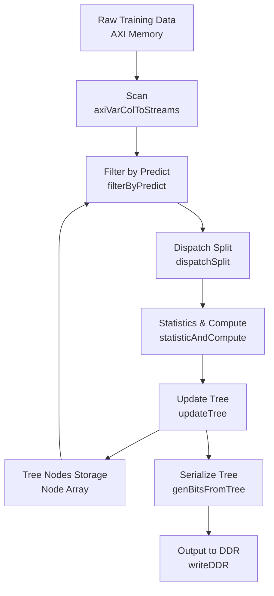

# Decision Tree Quantized Training Module

## Opening: What Problem Does This Module Solve?

Imagine you need to train a decision tree classifier on massive datasets — perhaps millions of customer records with hundreds of features each. On a CPU, this might take hours or days. This module solves that problem by implementing **hardware-accelerated decision tree training on FPGAs**, with a specific twist: **quantization-aware computation**.

The "quantize" in the name refers to the module's ability to work with quantized data representations — converting floating-point thresholds and values into compact integer representations that are dramatically more efficient for FPGA hardware. Rather than computing with expensive floating-point units, the FPGA uses fixed-point arithmetic, enabling higher throughput and lower power consumption while maintaining acceptable accuracy.

At its core, this module implements the **training phase** of a decision tree classifier. It ingests training data in batches, computes statistics to find optimal feature splits using information gain (or Gini impurity), builds the tree structure layer by layer, and serializes the final tree into a compact binary format suitable for deployment.

## Architecture and Data Flow

### Mental Model: An Assembly Line for Tree Construction

Think of this module as an **automated factory assembly line** for building decision trees. Raw material (training data) enters at one end, passes through specialized stations where different transformations occur, and a finished product (the trained tree) emerges at the other end.

Each "station" in this factory is a specialized functional block implemented as an HLS dataflow process:
- **Scan Station**: Reads raw data from memory and converts it into streams
- **Filter Station**: Routes samples to their appropriate tree nodes based on current predictions
- **Dispatch Station**: Extracts specific feature values needed for split evaluation
- **Statistics Station**: Computes histograms and calculates information gain for potential splits
- **Update Station**: Constructs new tree layers based on computed statistics

The assembly line operates on **windows of data** — the FPGA processes batches of samples through the pipeline, accumulating statistics, then makes decisions about tree structure before moving to the next batch or tree layer.



### Component Roles and Data Flow

**Scan Stage (`axiVarColToStreams`)**
The entry point reads training data from AXI memory. Data is organized in a columnar format where each sample consists of multiple feature values plus a class label. The scanner converts this memory-mapped data into streams of fixed-width data tokens (`hls::stream<ap_uint<WD>>`) that flow through subsequent pipeline stages.

**Filter by Predict (`filterByPredict`)**
This stage acts like a **postal sorter** — it determines which tree node each sample belongs to at the current layer, based on traversing the tree built so far. For each sample, it executes a prediction pass (the `predict` function) that walks down the current partial tree following feature thresholds until reaching a leaf at the current depth. Samples are tagged with their node IDs, and this routing information flows downstream.

**Dispatch Split (`dispatchSplit`)**
Once samples are routed to specific nodes, this stage acts as an **extractor**. For each potential split being evaluated (there may be multiple candidate features and thresholds per node), it extracts the specific feature values needed from the sample streams. The output is a set of parallel streams, one per potential split, containing the feature values and associated metadata needed for statistical computation.

**Statistics and Compute (`statisticAndCompute`)**
This is the **analytical engine** of the module. For each potential split, it maintains histograms counting how many samples of each class fall on each side of the threshold. Using these counts, it computes the information gain (or impurity reduction) that would result from making each potential split. The computation involves calculating entropy or Gini indices across the distribution of class labels. The module uses an 8-entry cache to exploit temporal locality — consecutive samples often belong to the same node/class combination, allowing histogram updates to be batched.

**Update Tree (`updateTree`)**
After statistics are computed, this stage makes **construction decisions**. For each node at the current layer, it selects the split (feature + threshold) that maximizes information gain, subject to constraints like minimum leaf size, maximum depth, and purity thresholds. It then updates the tree structure: internal nodes get their split criteria recorded, while leaf nodes are marked with their predicted class labels. New child nodes are allocated for the next layer, and the process repeats.

**Serialize and Write (`genBitsFromTree`, `writeDDR`)**
Once training completes, the tree exists as a 2D array of `Node` structures in FPGA memory. This final stage **flattens** the tree into a compact binary representation suitable for storage or inference deployment. It reorders nodes from a 2D layer-major format to a flat array, resolves relative node IDs to absolute addresses, converts floating-point thresholds to quantized integer representations, and packs everything into 512-bit AXI words for efficient DDR write transactions.

## Core Components Deep Dive

### The `Node` Structure — The Building Block

```cpp
struct Node {
    ap_uint<72> nodeInfo;    // 72-bit packed metadata
    ap_uint<64> threshold;   // 64-bit threshold value (quantized)
};
```

The `Node` structure is the fundamental unit of the decision tree. It's designed for **maximum density** — every bit serves a purpose, and the layout is optimized for FPGA resource usage rather than human readability.

The `nodeInfo` field packs multiple pieces of metadata into a single 72-bit word:
- **Bit 0**: Is this a leaf node? (1 = leaf, 0 = internal node)
- **Bits 8-15**: For leaves, the predicted class ID; for internal nodes, the feature ID to split on
- **Bits 32-71**: For internal nodes, the child node ID in the next layer (left child; right child is +1); for leaves during construction, INVALID_NODEID

The `threshold` field stores the split threshold value. During training, this holds a quantized integer index referencing a lookup table of actual floating-point thresholds. During inference (the `predict` function), this value is compared directly against the quantized feature values.

**Design Insight**: This packed representation minimizes FPGA BRAM usage and allows an entire node to be read in a single memory access. The tradeoff is that extracting fields requires bit manipulation (the `.range()` operations seen throughout the code), but this is cheap on FPGAs compared to memory bandwidth.

### The `predict` Function — Tree Traversal Engine

```cpp
template <typename MType, unsigned WD, unsigned MAX_FEAS, 
          unsigned MAX_TREE_DEPTH, unsigned dupnum>
void predict(ap_uint<WD> onesample[dupnum][MAX_FEAS],
             struct Node nodes[MAX_TREE_DEPTH][MAX_NODES_NUM],
             ap_uint<MAX_TREE_DEPTH> s_nodeid,
             ap_uint<MAX_TREE_DEPTH> e_nodeid,
             unsigned tree_dp,
             ap_uint<MAX_TREE_DEPTH>& node_id) {
    // Walk down the tree until reaching current depth
    for (unsigned i = 0; i < MAX_TREE_DEPTH; i++) {
        ap_uint<72> nodeInfo = nodes[i][node_id].nodeInfo;
        if (i < tree_dp && nodeInfo.range(71, 32) != INVALID_NODEID) {
            // Extract feature index and threshold
            ap_uint<8> feature_id = nodeInfo.range(8 + 15, 16);
            MType threshold = nodes[i][node_id].threshold.range(7, 0);
            
            // Compare and branch
            MType feature_val = onesample[i >> 1][feature_id];
            if (feature_val <= threshold) {
                node_id = nodeInfo.range(71, 32);      // Left child
            } else {
                node_id = nodeInfo.range(71, 32) + 1;  // Right child
            }
        }
    }
    // Validate node is in expected range
    if (count_layer != tree_dp || node_id < s_nodeid || node_id >= e_nodeid) 
        node_id = INVALID_NODEID;
}
```

The `predict` function implements **tree traversal** during the training process. Unlike inference-time prediction that walks a complete tree, this version is used during training to route samples to their appropriate nodes at the current depth being built.

**Key Design Elements**:

1. **Duplicated Sample Storage**: The `onesample` array has a "dupnum" dimension (calculated as `(MAX_TREE_DEPTH + 1) / 2`). This duplication allows the FPGA to access the same sample data multiple times across different tree layers without memory port contention, enabling pipelined execution where consecutive layers can overlap their operations.

2. **Bit-Packed Node Access**: Nodes are stored as a 2D array `[layer][node_id]`. The function extracts the `nodeInfo` field and checks if the node is valid (not `INVALID_NODEID`). For valid internal nodes, it extracts the feature ID from bits 16-23 and the child pointer from bits 32-71.

3. **Quantized Comparison**: The threshold is extracted as an 8-bit quantized value (`MType`), and the feature value is similarly quantized. The comparison `feature_val <= threshold` determines the branch direction. This quantized comparison is extremely cheap on FPGA hardware compared to floating-point comparison.

4. **Validation**: After traversal, the function validates that the traversal reached the expected depth (`count_layer == tree_dp`) and that the resulting node ID falls within the expected range (`[s_nodeid, e_nodeid)`). If validation fails, the node is marked as `INVALID_NODEID`, preventing corrupted statistics from polluting the training process.

**Tradeoff**: The traversal is iterative rather than recursive (which would be impossible in hardware anyway), and it processes one sample at a time. This sacrifices some potential parallelism for predictable resource usage and simple control flow.

### The `statisticAndCompute` Function — The Analytical Core

The `statisticAndCompute` function is the **computational heart** of the training process. It's where the actual "learning" happens — the module examines training samples, builds histograms of class distributions for potential splits, and calculates which splits would provide the most information gain.

**Key Architectural Elements**:

1. **Histogram Storage in URAM**: The main data structure is `num_in_cur_nfs_cat`, a 2D array sized `[MAX_SPLITS+1][MAX_PARAS]`. `MAX_SPLITS` is the maximum number of candidate thresholds across all features, and `MAX_PARAS = PARA_NUM * MAX_CAT_NUM` represents the total number of (node, class) combinations being tracked in parallel. This array is stored in FPGA UltraRAM (URAM), a high-density memory resource that provides the capacity needed for large histograms with single-cycle access.

2. **Temporal Locality Cache**: An 8-entry fully associative cache (`cache_nid_cid` and `cache_elem`) exploits the fact that consecutive samples often belong to the same node and class. When a cache hit occurs, the histogram update reads from and writes to local registers rather than URAM, dramatically reducing memory traffic. The cache uses LRU (Least Recently Used) replacement implemented via a shift-left operation that moves the most recently used entry to index 0.

3. **Histogram Update Logic**: For each sample, the function updates `MAX_SPLITS + 1` counters: one for the total sample count (index `MAX_SPLITS`), and one for each potential split threshold. For each split, it compares the sample's feature value against the threshold and increments the appropriate counter (left side if `feature_val <= threshold`, otherwise stay at current right side count).

4. **Gain Computation**: After all samples are processed, the function computes information gain for each potential split. The formula used is:
   $$
   \text{Gain} = \text{Total} - \left(\frac{\sum_{c} \text{left}_c^2}{\text{left}_{\text{total}}} + \frac{\sum_{c} \text{right}_c^2}{\text{right}_{\text{total}}}\right)
   $$
   
   This is derived from the Gini impurity (or equivalently, squared error in a regression context). Lower values indicate better splits. The implementation uses three URAM arrays to accumulate the squared sums (`clklogclk` for left children, `crklogcrk` for right children) and the totals (`num_in_cur_nfs_cat_sum`).

**Design Tradeoffs**:
- **Space vs. Accuracy**: The histograms use integer counters rather than floating-point probabilities. This saves hardware resources but means the implementation cannot use advanced techniques like gradient-based optimization or Laplace smoothing.
- **Parallelism vs. Memory**: The `PARA_NUM` parameter controls how many nodes are processed in parallel. Higher values increase throughput but require more URAM for histograms. The implementation uses time-multiplexing (different nodes at different times) rather than full spatial parallelism to balance resource usage.
- **Cache Size**: The 8-entry cache is small enough to fit in registers but large enough to capture the locality in typical datasets where samples are sorted or clustered by class. A larger cache would provide diminishing returns while consuming more LUT resources.

### Configuration and Setup (`readConfig`)

The `readConfig` function acts as the **initialization orchestrator** for the decision tree training process. It reads a structured configuration from AXI memory and populates all the parameters, lookup tables, and metadata needed by the training pipeline.

**Configuration Layout**:
The configuration is organized as a sequence of 512-bit words stored in AXI memory:
- **Word 0**: Global parameters
  - Bits 0-29: Number of training samples
  - Bits 32-39: Number of features
  - Bits 64-71: Number of classes
  - Bits 96-127: Total number of split thresholds
- **Word 1**: Training hyperparameters
  - Bits 0-31: Split criterion (0=Gini, 1=Entropy, etc.)
  - Bits 32-63: Maximum number of bins for discretization
  - Bits 64-95: Maximum tree depth
  - Bits 96-127: Minimum samples per leaf
  - Bits 128-159: Minimum information gain threshold (float bits)
  - Bits 160-191: Maximum category percentage per leaf (float bits)
- **Words 2 to 2+F**: Number of splits per feature (8 bits per feature)
- **Words S to S+T**: Split threshold values (quantized integers and floating-point representations)
- **Word 30+**: Feature subset masks (bitmaps indicating which features are active for each node)

**Key Processing Steps**:

1. **Global Parameter Extraction**: The function reads the first two 512-bit words and extracts scalar parameters like `samples_num`, `features_num`, `numClass`, and various hyperparameters. Floating-point values (like `min_info_gain`) are reconstructed from their IEEE 754 bit representations using a union cast (`f_cast<float>`).

2. **Per-Feature Split Counts**: For each feature, the function reads how many candidate split thresholds exist. This information is packed as 8-bit values, with 64 features per 512-bit word. These counts are stored in `numSplits[MAX_FEAS]` and used to index into the split value arrays.

3. **Split Value Processing**: The function reads both quantized and floating-point representations of each split threshold. The `splits_uint8` array stores the quantized integer values used during training, while `splits_float` stores the actual floating-point thresholds for final tree serialization. The `features_ids` array maps each split index to its source feature ID, enabling quick lookup during histogram computation.

4. **Feature Subset Loading**: Finally, the function calls `readFeaSubets` to load the feature subset masks. These are bitmasks where each bit indicates whether a feature is active for a particular node. This supports feature bagging (random subspace method), where each node only considers a random subset of features when searching for the best split.

**Design Tradeoffs**:
- **Memory vs. Flexibility**: The configuration is packed into a binary format rather than using a more readable structure. This saves memory bandwidth during initialization but requires careful documentation to ensure the host software generates the correct layout.
- **Fixed vs. Dynamic**: The configuration layout assumes maximum values for parameters like `MAX_FEAS` and `MAX_SPLITS`. This simplifies hardware implementation (fixed-size arrays) but means the compiled FPGA bitstream has hard limits that cannot be exceeded even if the actual problem is smaller.
- **Precomputation**: The configuration includes pre-quantized split thresholds, meaning the quantization algorithm runs on the host CPU. This keeps the FPGA logic simpler (it only works with quantized values) but requires the host to implement the same quantization logic consistently.

## Dependencies and Data Contracts

### What This Module Calls

**From `xf_data_analytics/classification/decision_tree_train.hpp`:**
- `Paras` struct: Configuration parameters for tree training (max depth, min leaf size, etc.)
- Training-related constants like `INVALID_NODEID` and `MAX_NODES_NUM`

**From `xf_data_analytics/classification/decision_tree_quantize.hpp`:**
- `Node` struct definition (packed node representation)
- Quantization-related type definitions

**From `xf_data_analytics/common/utils.hpp`:**
- `f_cast<T>` union type for type punning between float and integer representations
- Utility functions for data conversion

**From `xf_utils_hw/axi_to_stream.hpp`:**
- `axiToStream<>`: Converts AXI memory-mapped data to HLS streams

**From `xf::data_analytics::classification`:**
- `axiVarColToStreams<>`: Variable-column data stream conversion (for reading datasets with varying feature counts)

### What Calls This Module

**Host Software (via `DecisionTreeQT` top-level function):**
The module is invoked as an OpenCL/Vitis kernel through the `DecisionTreeQT` extern "C" function. The host application:
1. Allocates and populates the input `data` buffer with training samples and configuration
2. Allocates the output `tree` buffer for the trained model
3. Enqueues the kernel execution
4. Reads back the serialized tree for deployment

**Upstream System Integration:**
This module is typically integrated into larger machine learning pipelines:
- Part of the `tree_based_ml_quantized_models_l2` subsystem in the data analytics library
- May be combined with [classification_rf_trees_quantize](classification_rf_trees_quantize.md) (random forests) or [regression_rf_trees_quantize](regression_rf_trees_quantize.md) (regression trees)

### Data Contracts and Assumptions

**Input Data Layout (AXI Memory):**
The `data` buffer is organized in a specific format expected by `readConfig`:
- 512-bit words, little-endian byte order
- First 30 words contain configuration metadata
- Words 30+ contain feature subset masks
- Training samples follow the configuration region

**Output Tree Format:**
The `tree` buffer receives a compact serialized representation:
- 512-bit words containing packed Node structures
- First word contains total node count
- Subsequent words contain pairs of nodes (2 nodes per 512-bit word)
- Node IDs are remapped from layer-based to breadth-first traversal order

**Configuration Constraints:**
- `MAX_FEAS` (max features): Compile-time constant, typically 64-256
- `MAX_SPLITS` (max candidate thresholds): Compile-time constant, typically 128-512
- `MAX_TREE_DEPTH`: Compile-time constant, typically 16-32
- `PARA_NUM` (parallel nodes): Compile-time constant, typically 4-16
- `MAX_CAT_NUM` (max classes): Compile-time constant, typically 16-128

These are template parameters that must be set at synthesis time. The FPGA bitstream can only handle problems within these bounds.

**Quantization Contract:**
- Input features are expected to be pre-quantized to `WD`-bit unsigned integers (typically 8-64 bits)
- Split thresholds in configuration must use the same quantization scale
- The `MType` template parameter specifies the quantized arithmetic type
- The `TType` template parameter specifies the floating-point type for host-side calculations

## Design Decisions and Tradeoffs

### 1. Streaming Architecture vs. Batch Processing

**Decision**: Use HLS streams (`hls::stream<>`) for all inter-stage communication rather than shared memory buffers.

**Rationale**: Streams provide several advantages for FPGA implementation:
- Automatic backpressure handling when downstream stages are busy
- Compiler can synthesize them into FIFOs with appropriate depth
- Enforces producer-consumer synchronization without explicit locks
- Enables task-level parallelism via the `dataflow` directive

**Tradeoff**: Streams have finite depth (specified by `#pragma HLS stream depth=N`). If a producer gets too far ahead of a consumer, stalls occur. The module uses depths of 128 for most streams, which is sufficient for the intended batch sizes but could become a bottleneck with very small batches.

### 2. Quantized Integer Arithmetic vs. Floating-Point

**Decision**: Use fixed-point quantized integers for all feature comparisons and histogram accumulation, with floating-point only for final gain ratio calculations.

**Rationale**: FPGAs have limited floating-point units (DSP slices can do floating-point but it's expensive). Fixed-point operations use LUTs and can run at higher clock frequencies. The module uses 8-bit quantized thresholds (`MType = ap_uint<8>`) for feature comparisons.

**Tradeoff**: Quantization reduces precision and can affect accuracy. The module requires that the host pre-quantize data and splits consistently. If the quantization bins are too coarse, the tree may miss optimal splits. The design assumes quantization is done as a preprocessing step with knowledge of the data distribution.

### 3. URAM vs. BRAM for Histogram Storage

**Decision**: Use UltraRAM (URAM) for the main histogram array `num_in_cur_nfs_cat` and for the gain computation accumulators (`clklogclk`, `crklogcrk`).

**Rationale**: URAM provides much higher density than BRAM (typically 4x more bits per block). The histogram array needs `[MAX_SPLITS+1][PARA_NUM * MAX_CAT_NUM]` integers, which for typical parameters (128 splits, 4 parallel nodes, 16 classes) is ~8K entries. At 4 bytes each, this is 32KB per array, fitting comfortably in URAM but potentially consuming many BRAM blocks.

**Tradeoff**: URAM has slightly higher latency than BRAM (typically 2-3 cycles vs 1-2) and may have different clocking constraints. The module uses `#pragma HLS bind_storage` to explicitly map arrays to URAM, which makes the design portable across Xilinx devices with URAM (Ultrascale+ and newer) but would require modification for older devices.

### 4. Software Cache for Temporal Locality

**Decision**: Implement an 8-entry fully associative cache in registers to exploit temporal locality in histogram updates.

**Rationale**: When processing training samples, consecutive samples often belong to the same tree node and have the same class label (especially early in training when nodes are large). Without caching, each sample update would require a URAM read-modify-write cycle. With the cache, if the (node, class) combination matches a recent entry, the update happens in registers and is only written back to URAM when that entry is evicted.

**Tradeoff**: The cache is small (8 entries) to ensure it fits in FPGA registers without consuming excessive LUTs. This is sufficient for the expected access patterns but could be overwhelmed by pathological datasets where samples are perfectly interleaved across all nodes and classes. The cache is fully associative (any entry can hold any key) to maximize hit rate for the given size, but this requires comparing the current key against all 8 cached keys in parallel, consuming LUTs for comparators.

### 5. Layer-by-Layer Construction vs. Full Tree Building

**Decision**: Build the tree layer by layer, with each layer requiring a full pass over the training data.

**Rationale**: Decision trees have a fundamental dependency — the split at a parent node determines which samples reach its children, and thus what splits are possible at the child level. This makes depth-first or parallel tree construction difficult. The layer-by-layer approach respects this dependency while still enabling parallelism within a layer (across nodes via `PARA_NUM`).

**Tradeoff**: This approach requires multiple passes over the training data (one per tree layer), increasing memory bandwidth requirements. For deep trees (depth 16+), this could mean 16+ full dataset reads. The module mitigates this by processing data in streaming fashion (no storage of intermediate results) and by using high-bandwidth AXI interfaces (512-bit at high frequency). However, this design would be inefficient for extremely deep trees, suggesting the module targets moderate-depth trees (8-16 levels) typical in ensemble methods like random forests.

## Usage and Integration

### Top-Level API

The module exposes a single top-level function for kernel invocation:

```cpp
extern "C" void DecisionTreeQT(ap_uint<512> data[DATASIZE], 
                                ap_uint<512> tree[TREE_SIZE]);
```

**Parameters:**
- `data`: Input buffer containing configuration header + training samples
- `tree`: Output buffer receiving the serialized trained tree

**AXI Interface Attributes:**
- Both ports use AXI4 memory-mapped interfaces (`m_axi`)
- Latency: 64 cycles (allows for pipelined memory access)
- Outstanding transactions: 16 reads + 16 writes (high memory-level parallelism)
- Burst length: Up to 64 beats (512-bit words) for efficient DRAM utilization

### Host-Side Configuration

Before invoking the kernel, the host must prepare the configuration header:

```cpp
// Configuration layout (packed into ap_uint<512> words)
struct TreeConfig {
    // Word 0
    uint32_t samples_num;      // Number of training samples
    uint8_t  features_num;     // Number of features per sample
    uint8_t  numClass;         // Number of class labels
    int32_t  para_splits;      // Total number of candidate split thresholds
    
    // Word 1  
    float    cretiea;          // Split criterion (0=Gini, 1=Entropy)
    uint32_t maxBins;          // Maximum histogram bins
    uint32_t max_tree_depth;   // Maximum tree depth
    uint32_t min_leaf_size;    // Minimum samples in leaf node
    float    min_info_gain;    // Minimum information gain for split
    float    max_leaf_cat_per; // Maximum class proportion in leaf
    
    // Words 2+: numSplits per feature (8 bits each)
    uint8_t  numSplits[MAX_FEAS];
    
    // Subsequent words: split values (quantized + float)
    // Tight packing: multiple splits per 512-bit word
};
```

The host must:
1. Quantize feature values and split thresholds consistently
2. Pack split values efficiently (e.g., 64 8-bit splits per 512-bit word)
3. Generate feature subset masks if using random subspace method
4. Ensure all array dimensions stay within compiled `MAX_*` constants

### Integration Example

```cpp
// Host-side kernel invocation flow
void trainDecisionTree(Device& device, 
                       const TrainingData& data,
                       TreeModel& out_model) {
    // 1. Allocate device buffers
    Buffer<ap_uint<512>> data_buf(device, DATASIZE);
    Buffer<ap_uint<512>> tree_buf(device, TREE_SIZE);
    
    // 2. Prepare configuration header
    TreeConfig config;
    config.samples_num = data.num_samples;
    config.features_num = data.num_features;
    config.numClass = data.num_classes;
    // ... fill other fields ...
    
    // 3. Quantize and pack training data
    quantizeAndPackData(data, config, data_buf.map());
    data_buf.unmap();
    
    // 4. Run kernel
    Kernel kernel(device, "DecisionTreeQT");
    kernel.setArgs(data_buf, tree_buf);
    kernel.run();
    device.wait();
    
    // 5. Retrieve and deserialize tree
    tree_buf.map();
    deserializeTree(tree_buf.data(), out_model);
}
```

## Edge Cases, Gotchas, and Operational Considerations

### Memory and Resource Constraints

**URAM Capacity Limits**:
The histogram arrays (`num_in_cur_nfs_cat`, `clklogclk`, `crklogcrk`) consume significant URAM. If compilation fails with URAM over-utilization, consider:
- Reducing `MAX_SPLITS` (fewer candidate thresholds)
- Reducing `PARA_NUM` (fewer parallel nodes)
- Reducing `MAX_CAT_NUM` (fewer supported classes)

**BRAM for Stream Buffers**:
The `hls::stream` objects with `depth=128` consume BRAM or LUTRAM. For very deep pipelines with many streams, this can exhaust memory resources. Consider reducing stream depths if the target platform has limited BRAM.

### Numerical Stability and Precision

**Quantization Artifacts**:
Using 8-bit quantized thresholds means only 256 distinct split values are possible per feature. For features with high dynamic range or fine-grained structure, this can lead to:
- Suboptimal splits (missing the true best threshold)
- Ties (multiple thresholds producing identical splits)
- Saturation (values clipping at quantization bounds)

**Mitigation**: Ensure the host-side quantization uses appropriate scaling (e.g., percentile-based binning rather than uniform linear mapping).

**Integer Overflow in Histograms**:
The histogram counters are 32-bit signed integers (`int`). With millions of samples and many nodes, these can overflow. The module assumes:
- `MAX_CAT_NUM * PARA_NUM` nodes processed in parallel, each seeing a fraction of samples
- Worst case: `samples_num` up to ~500M before overflow

**Mitigation**: For very large datasets, consider subsampling or reducing `PARA_NUM` to spread samples across more sequential iterations.

### Timing and Convergence

**Maximum Tree Depth Stopping**:
The `mainloop` continues while `layer_nodes_num[tree_dp] > 0`. In degenerate cases (e.g., all samples identical), the tree may grow to `MAX_TREE_DEPTH` with no actual splits. The code does not explicitly prevent this waste of computation.

**Early Stopping Not Implemented**:
The module does not support common optimizations like:
- Early stopping based on validation set performance
- Pruning of overfitted branches
- Minimum impurity decrease thresholds (though `min_info_gain` exists, it's applied per-split rather than globally)

**Layer Synchronization Overhead**:
Each tree layer requires a full pass over the training data. For deep trees (depth > 16), this results in 16+ complete dataset reads from DRAM. The bandwidth can become the bottleneck, especially if the dataset does not fit in FPGA-attached HBM/BRAM.

### Debugging and Development

**HLS Co-simulation Limitations**:
The code uses `__SYNTHESIS__` guards to disable `printf` statements during actual synthesis, but enable them in simulation. However, the volume of output from `statisticAndCompute` can overwhelm simulators or make debugging difficult due to sheer volume.

**Pipeline Stall Debugging**:
The HLS dataflow architecture can experience deadlocks if stream depths are insufficient or if there are mismatches in read/write rates. Debugging these requires:
- Understanding the expected token counts between stages
- Using HLS waveform viewers to track stream occupancy
- Potentially increasing stream depths or adding explicit `hls::stream::full()` checks

**Resource Utilization Reporting**:
The heavy use of pragmas like `#pragma HLS bind_storage` and `#pragma HLS array_partition` can lead to surprising resource usage. Designers should:
- Review the HLS synthesis report for BRAM/URAM/LUT utilization
- Check that `array_partition` does not create excessive copies
- Verify that `bind_storage type=ram_2p` actually maps to intended memory types

## References and Related Modules

### Parent and Sibling Modules

This module is part of the tree-based machine learning quantized models subsystem:
- **Parent**: [tree_based_ml_quantized_models_l2](tree_based_ml_quantized_models_l2.md)
- **Sibling**: [classification_rf_trees_quantize](classification_rf_trees_quantize.md) — Random forest variant using this module as a building block
- **Sibling**: [regression_rf_trees_quantize](regression_rf_trees_quantize.md) — Regression tree variant

### Upstream Dependencies

- **Data movement**: Uses [blas_python_api](blas_python_api.md) for matrix operations in preprocessing
- **Common utilities**: Relies on `xf_utils_hw` library for AXI-to-stream conversions
- **Common types**: Uses [data_mover_runtime](data_mover_runtime.md) for buffer management

### Downstream Consumers

The serialized tree output is consumed by:
- **Inference engines**: FPGA-based decision tree inference kernels
- **Model deployment**: Host-side model serialization for edge deployment
- **Ensemble methods**: Random forest and gradient boosting frameworks that use this module to train individual trees

## Summary: Key Takeaways for Contributors

1. **This is hardware, not software**: Every design choice prioritizes FPGA resource efficiency over code readability. Bit manipulation, packed structures, and explicit memory binding are intentional.

2. **Quantization is fundamental**: The module assumes quantized inputs and uses quantized arithmetic throughout. The host must handle quantization/dequantization consistently.

3. **Memory bandwidth is the bottleneck**: The layer-by-layer training approach requires multiple full passes over the dataset. Optimizations should focus on reducing memory traffic (hence the 8-entry cache and URAM usage).

4. **Template parameters are hard limits**: `MAX_FEAS`, `MAX_SPLITS`, `MAX_TREE_DEPTH`, etc. are not suggestions — they determine hardware resource allocation at synthesis time. Choose them based on expected problem sizes, knowing that smaller values save resources but limit flexibility.

5. **Dataflow architecture requires careful stream management**: The pipeline stages communicate only through HLS streams. Deadlocks can occur if stream depths are mismatched or if token production/consumption rates diverge. Use the HLS compiler's dataflow viewer to verify pipeline balance.