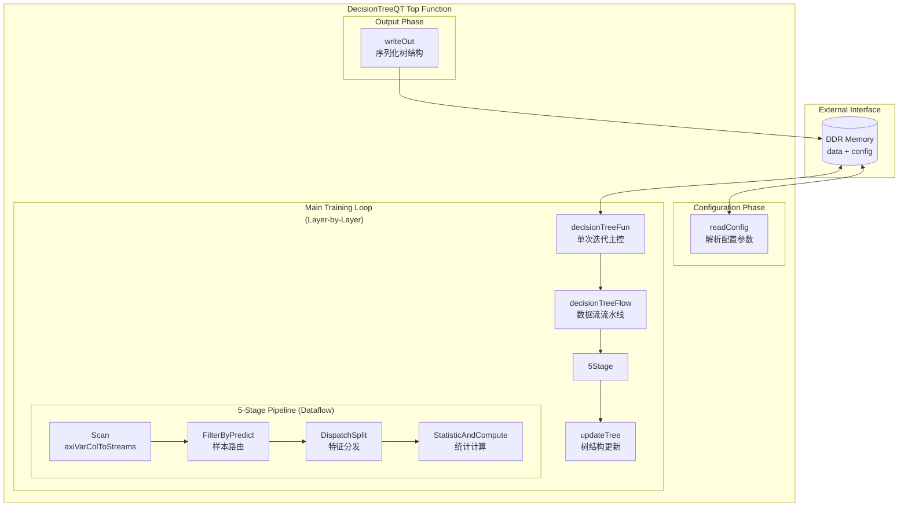

# classification_decision_tree_quantize 模块技术深度解析

## 一句话概括

这是一个为 FPGA 硬件加速优化的**量化决策树训练引擎**，它采用流水线化的数据流架构，通过高度并行化的统计计算和分裂选择，在保持数值精度的同时最大化硬件执行效率。

---

## 1. 这个模块解决什么问题？

### 1.1 背景：决策树训练的硬件挑战

决策树训练（特别是 CART 算法）本质上是**数据密集型计算**——需要反复扫描数据集、计算统计直方图、选择最优分裂点。当数据量达到百万级样本时，CPU 上的训练可能耗时数小时。

FPGA 加速看似是天然选择，但面临三个核心挑战：

| 挑战 | 具体问题 |
|------|----------|
| **内存带宽瓶颈** | 训练过程需要反复读取全量数据，DDR 带宽往往成为瓶颈 |
| **不规则访存模式** | 树深度增加后，样本被分散到不同节点，访存不连续 |
| **数值精度 vs 性能权衡** | 浮点运算资源消耗大，定点/量化运算需要小心处理精度损失 |

### 1.2 本模块的设计洞察

本模块采用**层序构建（Level-order Construction）+ 量化直方图统计**的策略：

1. **按层处理**：不像递归实现那样深度优先遍历，而是按树层级逐层构建。这样同一层所有节点可以**并行处理**，且只需要一次数据扫描。

2. **量化预处理**：数据在输入前被量化（通常 8-bit），所有统计计算基于量化后的整型值。这允许使用 FPGA 上的 DSP 硬核高效计算。

3. **流水线数据流**：整个训练过程被拆分为多个阶段（Scan → Filter → Dispatch → Count → Update），通过 HLS `dataflow` 实现流水线并行。

---

## 2. 核心心智模型：如何理解这个模块？

### 2.1 类比：自动化工厂的分拣流水线

想象一个高度自动化的**包裹分拣工厂**：

- **原料入口（Scan 阶段）**：包裹源源不断从传送带进入，每个包裹有多个属性标签（特征值）。
- **路线预判（Filter 阶段）**：根据当前已有分拣规则（已建部分树），预判这个包裹应该去往哪个分拣台（目标节点）。
- **属性抽取（Dispatch 阶段）**：从包裹上抽取特定的几个标签（候选分裂特征），准备进行统计。
- **计数统计（Count 阶段）**：在每个候选分拣台，统计不同目的地的包裹数量（直方图统计）。
- **规则更新（Update 阶段）**：根据统计结果，决定在每个分拣台如何进一步细分（选择最优分裂特征和阈值），更新分拣规则。

**关键洞察**：整个工厂是流水线作业——当第一批包裹完成"路线预判"进入"属性抽取"时，下一批包裹已经开始了"路线预判"。这最大化吞吐率。

### 2.2 核心抽象概念

| 概念 | 对应代码实体 | 含义 |
|------|--------------|------|
| **节点（Node）** | `struct Node` | 树中的一个节点，包含分裂信息（特征ID、阈值、左右子节点指针） |
| **层级（Layer）** | `tree_dp` | 当前处理的树深度，同一层节点并行处理 |
| **样本过滤（Filter）** | `filterByPredict` | 根据当前树结构，将样本路由到对应的目标节点 |
| **直方图统计** | `statisticAndCompute` | 统计每个候选分裂的分布情况，计算信息增益 |
| **并行度（PARA_NUM）** | 模板参数 | 同时处理的节点数，体现空间并行性 |

---

## 3. 架构与数据流

### 3.1 整体架构图



### 3.2 关键数据流详解

#### 阶段 1：配置读取（`readConfig`）

数据从 DDR 通过 AXI 总线读入，解析出：
- 样本数、特征数、类别数
- 超参数（最大深度、最小叶子样本数等）
- 每个特征的预计算分裂点（`splits_float` 和 `splits_uint8`）
- 特征子集掩码（用于随机森林式的特征采样）

**关键设计**：分裂点预先量化好，训练时只做整型比较。

#### 阶段 2：主训练循环（`decisionTreeFun`）

```cpp
while (layer_nodes_num[tree_dp] > 0) {
    // 并行处理当前层所有节点
    for (int j = 0; j < layer_nodes_num[tree_dp]; j += PARA_NUM_) {
        decisionTreeFlow(...); // 流水线处理 PARA_NUM 个节点
    }
    tree_dp++;
}
```

**关键设计**：
- **层序处理**：每轮迭代处理树的一层，确保同层节点可并行
- **批处理**：每批处理 `PARA_NUM` 个节点，平衡并行度与资源消耗
- **单轮数据扫描**：一批节点共享一次数据流遍历，最大化数据局部性

#### 阶段 3：五级流水线（`decisionTreeFlow`）

这是模块的核心，使用 HLS `dataflow` 指令实现任务级并行：

```cpp
#pragma HLS dataflow

// Stage 1: 扫描数据到流
axiVarColToStreams(data, ..., dstrm_batch, estrm_batch);

// Stage 2: 根据当前树结构过滤样本
filterByPredict(dstrm_batch, estrm_batch, nodes, ..., dstrm_batch_disp, nstrm_disp);

// Stage 3: 分发到候选分裂特征
DispatchSplit(dstrm_batch_disp, nstrm_disp, ..., dstrm, nstrm, estrm);

// Stage 4: 统计直方图并计算最优分裂
statisticAndCompute(dstrm, nstrm, estrm, ..., ifstop, max_classes, ...);
```

**流水线行为**：当 Stage 2 处理第 N 个数据批次时，Stage 1 正在读取第 N+1 批，形成吞吐率最大化的流水线。

#### 阶段 4：树更新（`updateTree`）

根据统计计算的结果，更新树结构：
- 对每个节点决定是否停止分裂（叶子节点）
- 非叶子节点记录最优分裂特征和阈值
- 分配新的子节点 ID，建立层级连接

#### 阶段 5：输出序列化（`writeOut`）

将树结构转换为紧凑的 AXI 流格式写入 DDR：
- 节点信息（子节点指针、特征 ID、阈值）打包为 512-bit AXI 事务
- 层级遍历信息用于重建树拓扑

---

## 4. 核心组件深度解析

### 4.1 Node 结构 —— 树的节点抽象

```cpp
struct Node {
    ap_uint<72> nodeInfo;   // 节点元信息（子节点指针、特征ID、叶子标记等）
    ap_uint<64> threshold;  // 分裂阈值（量化后的值）
};
```

**设计解读**：
- **紧凑打包**：所有信息压缩到 136 bits，可在单周期读取
- **量化友好**：`threshold` 存储量化后的整型值，比较时无需浮点运算
- **指针编码**：`nodeInfo` 的高位存储子节点索引，支持快速树遍历

### 4.2 predict 函数 —— 单样本树遍历

```cpp
template <typename MType, unsigned WD, unsigned MAX_FEAS, 
          unsigned MAX_TREE_DEPTH, unsigned dupnum>
void predict(ap_uint<WD> onesample[dupnum][MAX_FEAS],
             struct Node nodes[MAX_TREE_DEPTH][MAX_NODES_NUM],
             ap_uint<MAX_TREE_DEPTH> s_nodeid,
             ap_uint<MAX_TREE_DEPTH> e_nodeid,
             unsigned tree_dp,
             ap_uint<MAX_TREE_DEPTH>& node_id)
```

**核心逻辑**：
从根节点开始，逐层比较样本特征值与节点阈值，决定走左子树（`feature_val <= threshold`）还是右子树，直到到达叶子节点。

**关键优化**：
- **样本复制**：`onesample[dupnum][MAX_FEAS]` 将样本复制多份，避免内存冲突，支持并行访问
- **扁平化存储**：`nodes[MAX_TREE_DEPTH][MAX_NODES_NUM]` 按层存储，访问模式规律，利于 HLS 优化
- **提前终止**：当遇到无效节点（`INVALID_NODEID`）时立即停止遍历

### 4.3 statisticAndCompute —— 直方图统计与最优分裂计算

这是整个模块的**计算核心**，实现了决策树训练中最关键的部分：计算每个候选分裂的信息增益，选择最优分裂点。

**内部机制**：

#### 4.3.1 直方图统计（Histogram Accumulation）

核心数据结构：
```cpp
int num_in_cur_nfs_cat[MAX_SPLITS_1][MAX_PARAS];
```
这是一个巨大的二维数组：
- 第一维 `MAX_SPLITS_1 = MAX_SPLITS + 1`：候选分裂数 + 1（用于存储父节点总计）
- 第二维 `MAX_PARAS = PARA_NUM * MAX_CAT_NUM`：并行节点数 × 类别数

**统计逻辑**：
对于每个样本，根据其特征值与候选阈值的比较结果，决定是落入左子节点（`feature_val <= threshold`）还是右子节点。同时根据样本的类别标签，在对应类别的计数器上加 1。

#### 4.3.2 缓存优化（8-entry LRU）

代码中实现了一个 8-entry 的 LRU 缓存：
```cpp
ap_uint<MAX_TREE_DEPTH + MAX_CAT_NUM> cache_nid_cid[8];
unsigned cache_elem[8][MAX_SPLITS_1];
```

**为什么需要缓存？**
- 直方图数组存储在 URAM（UltraRAM），访问延迟相对较高
- 相邻样本很可能落入同一个节点（数据局部性）
- 通过缓存最近访问的节点统计信息，可以避免频繁的 URAM 访问

#### 4.3.3 信息增益计算（Gain Computation）

当所有样本统计完成后，进入计算阶段：

```cpp
// 计算 Gini 不纯度（或信息增益）
for each node:
    for each candidate split:
        // 左子节点分布
        clsum = num_in_cur_nfs_cat_sum[node][split]
        // 右子节点分布  
        crsum = total_samples - clsum
        
        // 计算加权 Gini
        cretia = total - (sum_sq_left/clsum + sum_sq_right/crsum)
```

**关键优化**：
- 使用 `clklogclk` 和 `crklogcrk` 数组预计算平方和，避免在循环中重复计算
- 采用流水线并行处理多个候选分裂点

---

## 5. 设计权衡与决策

### 5.1 量化 vs 精度

**权衡**：8-bit 量化 vs 浮点精度

**决策**：采用预量化数据，训练过程全整型运算
- **理由**：
  - FPGA 的 DSP48 硬核对整型运算极高效（单周期）
  - 决策树对数值精度不敏感，关键是样本相对顺序而非绝对值
  - 预量化允许主机端进行复杂的分位数计算（如基于直方图的量化）
- **代价**：量化误差可能导致最优分裂点略有偏差，但通常不影响最终模型性能

### 5.2 层序构建 vs 递归构建

**权衡**：层序（Level-order）vs 深度优先递归

**决策**：采用层序构建，每层一轮数据扫描
- **理由**：
  - 同层节点共享同一份数据扫描，最大化数据复用
  - 同层节点之间无依赖，可高度并行（`PARA_NUM` 并行度）
  - 更适合 FPGA 的数据流架构（流式处理 vs 递归栈）
- **代价**：需要缓存整层节点的统计信息，增加 URAM 使用

### 5.3 空间并行（PARA_NUM）vs 时间流水线

**权衡**：同时处理多节点（空间并行）vs 单节点深度流水线

**决策**：采用中等并行度（`PARA_NUM` = 2-8）+ 五级流水线
- **理由**：
  - 单纯增加 `PARA_NUM` 会导致 URAM 使用爆炸（每个节点需独立统计缓存）
  - 流水线数据流（`dataflow`）可隐藏数据读取延迟
  - 分层处理天然适合中等并行：每层节点数通常不会太大（指数增长受控于停止条件）
- **调参建议**：对于宽数据集（特征多），减小 `PARA_NUM` 避免 URAM 溢出；对于深树，增大 `MAX_TREE_DEPTH`

### 5.4 缓存策略（8-entry LRU）

**权衡**：直接访问 URAM vs 增加片上缓存

**决策**：增加 8-entry LRU 缓存层
- **理由**：
  - 直方图统计存在显著数据局部性：相邻样本大概率落入同一节点（排序后数据）
  - URAM 访问延迟较高（通常 2-3 周期），缓存可减少关键路径延迟
  - 8 entry 平衡了命中率与资源消耗（使用分布式 LUTRAM）
- **实现细节**：使用移位寄存器实现 LRU 替换策略，硬件友好

---

## 6. 新贡献者必读：陷阱与注意事项

### 6.1 HLS 编译相关

#### 6.1.1 pragma 是负载均衡的（Load-bearing）

代码中的每个 `#pragma HLS` 都有其存在理由，随意修改会导致：

| Pragma | 作用 | 修改风险 |
|--------|------|----------|
| `dataflow` | 启用任务级流水线 | 移除会导致串行执行，吞吐率暴跌 |
| `pipeline` | 启动循环流水线（II=1） | 不当修改会导致 II 增大，吞吐率下降 |
| `array_partition` | 数组分区以并行访问 | 分区因子不当会导致资源爆炸或访问冲突 |
| `bind_storage impl=uram` | 使用 URAM 存储大数组 | 改为 BRAM 可能导致容量不足 |

**建议**：修改 pragma 前，先使用 `hls::csim` 验证功能正确性，再用 `hls::cosim` 验证性能。

#### 6.1.2 Stream Depth 的死锁风险

代码中每个 `hls::stream` 都声明了 `depth`：
```cpp
#pragma HLS stream variable = dstrm_batch depth = 128
```

**规则**：
- `dataflow` 模式下，stream depth 决定了生产者和消费者之间的缓冲容量
- 如果生产者突发写入超过 `depth`，而消费者尚未读取，会导致**死锁（Deadlock）**

**调试建议**：
- 初始使用较大 depth（如 512 或 1024）确保功能正确
- 通过 `hls::dataflow_viewer` 分析实际最大缓冲需求，逐步减小 depth 以节省资源
- 注意循环边界条件：最后一个样本的处理可能需要额外 depth

#### 6.1.3 数据类型宽度匹配

代码中大量使用 `ap_uint<W>` 自定义宽度整数：
- `ap_uint<72>` 用于 `nodeInfo`
- `ap_uint<MAX_TREE_DEPTH>` 用于节点 ID
- `ap_uint<WD>` 用于样本特征值

**陷阱**：
- 位宽不匹配会导致静默截断或零扩展，调试极其困难
- 建议在所有类型转换处添加 `static_assert` 或注释说明位宽关系
- 特别注意 `MAX_TREE_DEPTH` 与 `ap_uint<MAX_TREE_DEPTH>` 的区别：后者是类型，前者是常量值

### 6.2 算法逻辑相关

#### 6.2.1 分裂点与特征 ID 的映射

代码中维护了两个关键数组：
- `splits[MAX_SPLITS]`：候选分裂阈值（量化后的值）
- `features_ids[MAX_SPLITS]`：每个分裂点对应的全局特征 ID

**关键洞察**：
- 不同特征可能有不同数量的候选分裂点（如特征 A 有 10 个分裂点，特征 B 有 5 个）
- `features_ids` 记录了这种"扁平化"映射：前 10 个条目可能是特征 A，接下来 5 个是特征 B
- 统计计算时，需要同时访问 `splits[i]` 和 `features_ids[i]` 来获取完整信息

**调试建议**：在 `__SYNTHESIS__` 未定义时，打印 `features_ids` 数组验证映射关系。

#### 6.2.2 停止条件与叶子节点判定

代码中通过多个条件决定节点是否停止分裂（成为叶子节点）：

```cpp
if (num_in_cur_node_cat_sum <= paras.min_leaf_size || 
    maxClass_count > maxPerNums ||
    max_gainratio >= (1 << 30) || 
    tree_dp >= paras.max_tree_depth) {
    ifstop[l] = true;
}
```

| 条件 | 含义 | 触发场景 |
|------|------|----------|
| `num_in_cur_node_cat_sum <= min_leaf_size` | 样本数不足 | 节点样本数少于最小叶子大小 |
| `maxClass_count > maxPerNums` | 类别纯度足够 | 某类别占比超过阈值（预剪枝） |
| `max_gainratio >= (1 << 30)` | 无有效分裂 | 所有候选分裂的信息增益无效（如 INF） |
| `tree_dp >= max_tree_depth` | 深度限制 | 达到最大树深度 |

**注意**：`max_gainratio` 被初始化为 `(1 << 30)`（一个很大的数），表示无效值。如果遍历完所有候选分裂后仍为该值，说明没有找到有效分裂。

#### 6.2.3 缓存一致性与写回策略

`statisticAndCompute` 中的缓存机制需要特别注意：

```cpp
// 读取
if (in_cache_id != 8) {
    for (int j = 0; j < MAX_SPLITS_1; j++) {
        elem[j] = cache_elem[in_cache_id][j];
    }
} else {
    for (int j = 0; j < MAX_SPLITS_1; j++) {
        elem[j] = num_in_cur_nfs_cat[j][n_cid];
    }
}

// ... 修改 nxt_elem ...

// 写回 URAM
for (int j = 0; j < MAX_SPLITS_1; j++) {
    num_in_cur_nfs_cat[j][n_cid] = nxt_elem[j];
}

// 同时更新缓存
for (int i = 7; i > 0; i--) {
    cache_nid_cid[i] = cache_nid_cid[i - 1];
    for (int j = 0; j < MAX_SPLITS_1; j++) {
        cache_elem[i][j] = cache_elem[i - 1][j];
    }
}
cache_nid_cid[0] = nid_cid;
for (int j = 0; j < MAX_SPLITS_1; j++) {
    cache_elem[0][j] = nxt_elem[j];
}
```

**一致性保证**：
- 采用**写直达（Write-through）**策略：数据同时更新到 URAM 和缓存
- 使用**最近最少使用（LRU）**替换策略：新数据插入队首，旧数据向后移动，队尾数据被淘汰
- **命中检测**：通过比较 `nid_cid`（节点 ID + 类别 ID 的复合键）判断是否命中缓存

---

## 7. 总结

`classification_decision_tree_quantize` 是一个高度优化的 FPGA 决策树训练引擎，其核心设计哲学是**通过量化降低计算复杂度，通过流水线提高吞吐率，通过层序处理实现并行化**。

对于新加入团队的工程师，理解以下几点至关重要：

1. **数据流思维**：这不是传统的控制流代码，而是数据驱动的流水线。理解数据如何在各个 stream 之间流动，比理解控制逻辑更重要。

2. **资源约束意识**：URAM、BRAM、DSP 都是有限资源。修改并行度（PARA_NUM）或缓存大小时，必须考虑资源上限。

3. **精度与性能权衡**：量化是性能的关键，但引入了近似。理解量化误差如何传播，以及何时需要更高精度（如 splits_float 用于输出）。

4. **HLS 工具链理解**：pragma 不是提示，是指令。stream depth、array partition、pipeline 等设置直接决定生成的 RTL 结构。

希望这份文档能帮助你快速理解这个复杂的 HLS 模块，并在未来的开发工作中做出明智的设计决策。
