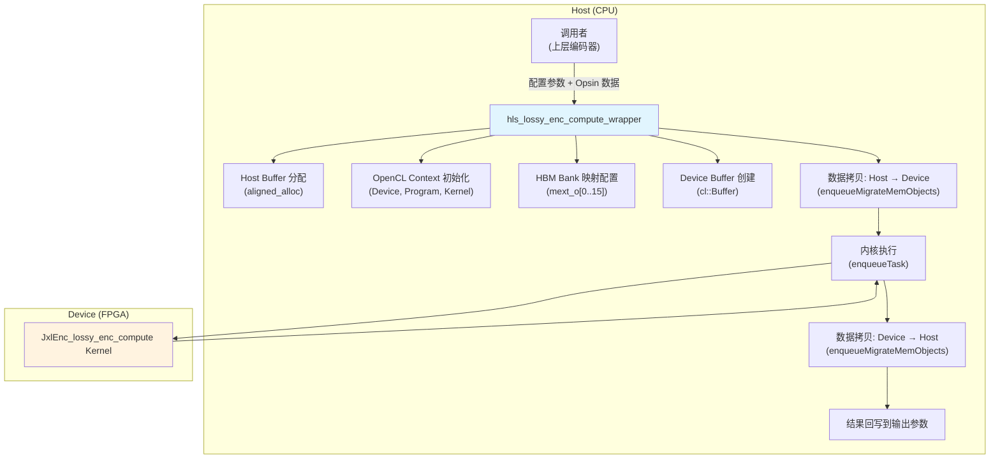

# lossy_encode_compute_host_timing 模块技术深度解析

## 一句话概述

本模块是 **JPEG XL (JXL) 有损编码器 FPGA 加速的 Host 端运行时核心**，负责将待编码的图像数据（经过色彩空间转换后的 Opsin 域数据、量化参数、掩码等）通过 OpenCL 接口提交给 FPGA 内核执行，并管理 Host-Device 之间的数据传输、内存分配和性能计时。可以把它想象成**管弦乐团的指挥**——它不演奏单个音符，而是协调何时、以何种顺序、通过哪条通道将数据（乐谱）传递给 FPGA（乐团），确保整个编码流程顺畅进行。

---

## 问题背景：为什么需要这个模块？

JPEG XL 是现代图像压缩标准，其编码过程计算密集，尤其是**有损编码路径**涉及：
- 自适应量化（Adaptive Quantization）
- 分块策略选择（Block Splitting Strategy）
- DCT 变换与系数计算
- DC 系数的多尺度处理（8x8, 16x16, 32x32）

在 CPU 上执行这些操作对高分辨率图像而言太慢。Xilinx FPGA 通过 HLS（高层次综合）实现了 `JxlEnc_lossy_enc_compute` 内核，可以并行处理这些数据。但 FPGA 内核本身没有自主调度能力——它需要 Host 端代码来：**分配物理内存（HBM/DRAM）、填充数据、启动内核、回收结果**。

本模块就是这一"胶水层"的实现。

---

## 架构概览与数据流



### 核心组件职责

| 组件 | 角色 | 关键操作 |
|------|------|----------|
| `hls_lossy_enc_compute_wrapper` | **主入口函数** | 协调整个 Host-Device 交互流程，是外部调用者的唯一接触点 |
| `aligned_alloc<T>()` | **内存分配器** | 使用 `posix_memalign` 分配 4KB 对齐的 Host 内存，满足 FPGA DMA 传输要求 |
| `mext_o[]` (HBM Bank Mapping) | **物理内存路由器** | 将逻辑缓冲区映射到 FPGA 的特定 HBM  bank (0-15)，控制数据在 FPGA 片外存储中的物理布局 |
| `cl::Buffer` | **OpenCL 内存对象** | 代表 Device 端的内存分配，与 Host 指针通过 `CL_MEM_USE_HOST_PTR` 零拷贝（zero-copy）关联 |
| OpenCL Command Queue | **异步执行调度器** | 管理数据传输（`enqueueMigrateMemObjects`）和内核执行（`enqueueTask`）的依赖顺序 |

---

## 深度代码解析

### 1. 内存分配策略：`aligned_alloc` 与零拷贝设计

```cpp
template <typename T>
T* aligned_alloc(std::size_t num) {
    void* ptr = NULL;
    if (posix_memalign(&ptr, 4096, num * sizeof(T))) throw std::bad_alloc();
    return reinterpret_cast<T*>(ptr);
}
```

**为什么需要 4KB 对齐？**

FPGA 的 DMA 引擎通常要求内存缓冲区满足特定的对齐粒度（这里是 4096 字节，即一个页大小）。未对齐的内存会导致 DMA 传输失败或性能骤降。这类似于文件系统要求磁盘 I/O 按扇区对齐。

**零拷贝（Zero-Copy）机制**

```cpp
cl::Buffer db_config(context, 
    CL_MEM_EXT_PTR_XILINX | CL_MEM_USE_HOST_PTR | CL_MEM_READ_WRITE,
    sizeof(int) * MAX_NUM_CONFIG, &mext_o[0]);
```

- `CL_MEM_USE_HOST_PTR` 告诉 OpenCL 运行时：**不要**在 Device 端分配新内存，而是复用 Host 已分配的 `hb_config` 内存
- 数据传输时，DMA 控制器直接访问这块 Host 内存，无需额外的 `memcpy` 到中间缓冲区
- 代价：Host 内存必须保持分配和有效，直到 Device 操作完成

### 2. HBM Bank 映射：物理内存的精准路由

```cpp
std::vector<cl_mem_ext_ptr_t> mext_o(33);
mext_o[0] = {(((unsigned int)(14)) | XCL_MEM_TOPOLOGY), hb_config, 0};
mext_o[1] = {(((unsigned int)(15)) | XCL_MEM_TOPOLOGY), hb_config_fl, 0};
mext_o[2] = {(((unsigned int)(0)) | XCL_MEM_TOPOLOGY), hb_hls_opsin_1, 0};
// ... 依此类推
```

**设计意图：并行访存最大化带宽**

FPGA 板卡（如 Alveo U50/U200/U280）配备 HBM（High Bandwidth Memory），被划分为多个独立的 bank（通常是 16 或 32 个）。每个 bank 有独立的控制器，可以并行访问。通过将不同的数据流映射到不同的 bank，可以实现内存带宽的聚合（aggregate bandwidth）。

**映射表解析**

| HBM Bank | 数据缓冲区 | 数据类型 | 方向 | 用途 |
|----------|-----------|----------|------|------|
| 0 | `hb_hls_opsin_1` | float[ALL_PIXEL] | Input | Opsin 通道 1 |
| 1 | `hb_hls_opsin_2` | float[ALL_PIXEL] | Input | Opsin 通道 2 |
| 2 | `hb_hls_opsin_3` | float[ALL_PIXEL] | Input | Opsin 通道 3 |
| 3 | `hb_hls_quant_field` | float[BLOCK8_H*BLOCK8_W] | Input | 量化域 |
| 4 | `hb_hls_masking_field` | float[BLOCK8_H*BLOCK8_W] | Input | 掩码域 |
| 5 | `hb_aq_map_f` | float[BLOCK8_H*BLOCK8_W] | Input | 自适应量化映射 |
| 6 | `hb_cmap_axi` | int8_t[TILE_W*TILE_H*2] | Output | 颜色映射表 |
| 7 | `hb_ac_coef_axiout` | int32_t[ALL_PIXEL] | Output | AC 系数 |
| 8 | `hb_strategy_all` | uint8_t[BLOCK8_W*BLOCK8_H] | Output | 分块策略 |
| 9 | `hb_raw_quant_field_i` | int32_t[BLOCK8_H*BLOCK8_W] | Output | 原始量化域 |
| 10 | `hb_hls_order` | uint32_t[MAX_ORDER] | Output | 扫描顺序 |
| 11 | `hb_hls_dc8x8` | float[ALL_PIXEL] | Output | DC 系数 (8x8) |
| 12 | `hb_hls_dc16x16` | float[ALL_PIXEL] | Output | DC 系数 (16x16) |
| 13 | `hb_hls_dc32x32` | float[ALL_PIXEL] | Output | DC 系数 (32x32) |
| 14 | `hb_config` | int32_t[MAX_NUM_CONFIG] | Input | 整数配置参数 |
| 15 | `hb_config_fl` | float[MAX_NUM_CONFIG] | Input | 浮点配置参数 |

### 3. 执行流程的三阶段管线

```cpp
// 阶段 1: 主机到设备的数据迁移（异步）
q.enqueueMigrateMemObjects(ob_in, 0, nullptr, &events_write[0]);

// 阶段 2: 内核执行（依赖阶段 1 完成）
q.enqueueTask(hls_lossy_enc_compute[0], &events_write, &events_kernel[0]);

// 阶段 3: 设备到主机的数据回传（依赖阶段 2 完成）
q.enqueueMigrateMemObjects(ob_out, 1, &events_kernel, &events_read[0]);

// 同步等待全部完成
q.finish();
```

**异步执行与事件依赖**

OpenCL 的命令队列支持异步执行。这三个阶段通过 `cl::Event` 对象建立依赖关系：
- `events_write[0]` 标记数据传输完成
- `events_kernel[0]` 标记内核执行完成
- `events_read[0]` 标记结果回传完成

这种设计允许 OpenCL 运行时在设备支持的情况下并行执行独立操作（例如，在计算当前 tile 的同时传输下一个 tile 的数据）。

### 4. 性能计时体系

本模块实现了多层级的性能监控，这对 FPGA 加速开发至关重要：

```cpp
// 层级 1: 端到端时间（包含所有开销）
struct timeval start_time, end_time;
gettimeofday(&start_time, 0);
// ... 执行全部操作 ...
gettimeofday(&end_time, 0);
unsigned long exec_timeE2E = diff(&end_time, &start_time);

// 层级 2: OpenCL 事件细粒度计时
unsigned long timeStart, timeEnd, exec_time0;
events_write[0].getProfilingInfo(CL_PROFILING_COMMAND_START, &timeStart);
events_write[0].getProfilingInfo(CL_PROFILING_COMMAND_END, &timeEnd);
exec_time0 = (timeEnd - timeStart) / 1000.0; // 转换为微秒
```

**计时数据的解读价值**

| 计时维度 | 涵盖范围 | 用途 |
|----------|----------|------|
| 端到端 (E2E) | `gettimeofday` 包围的全部代码 | 评估从调用者视角的总延迟 |
| 写传输 | `events_write` | 量化 PCIe 上行带宽瓶颈 |
| 内核执行 | `events_kernel` | 评估 FPGA 计算性能 |
| 读传输 | `events_read` | 量化 PCIe 下行带宽瓶颈 |

这种分层计时设计允许开发者快速定位性能瓶颈：如果 E2E 时间远大于内核执行时间，说明数据传输是瓶颈；如果内核执行时间过长，则需要优化 FPGA 逻辑。

---

## 依赖关系与上下游协作

### 上游调用者

本模块的上游是 **JPEG XL 编码器的主控逻辑**（不在本模块内），它会准备：
- `hls_opsin_1/2/3`: 经过色彩空间转换后的图像数据（XYB 色彩空间）
- `hls_quant_field`, `hls_masking_field`, `aq_map_f`: 量化与感知掩码参数
- `config`, `config_fl`: 图像维度、tile 大小等控制参数

### 下游被调用者

本模块通过 OpenCL API 间接调用 **Xilinx 运行时 (XRT)**，包括：
- `xcl::get_xil_devices()`: 枚举 FPGA 设备
- `cl::Program::Binaries`: 加载 `.xclbin` 比特流文件
- `cl::Kernel`: 创建内核对象
- `cl::CommandQueue`: 调度执行

### 横向依赖模块

| 模块 | 关系 | 说明 |
|------|------|------|
| `host_acceleration_timing_and_phase_profiling` (父模块) | 包含 | 本模块是其子组件，共享计时基础设施 |
| `histogram_acceleration_host_timing` | 兄弟 | 同属 JXL 编码加速套件，处理不同的编码阶段 |
| `phase3_histogram_host_timing` | 兄弟 | 处理编码第三阶段的直方图计算 |

---

## 设计决策与权衡

### 决策 1: 显式 HBM Bank 映射 vs 自动内存管理

**选择**: 通过 `cl_mem_ext_ptr_t` 和 `XCL_MEM_TOPOLOGY` 显式指定每个缓冲区映射到 HBM 的哪个 bank。

**权衡分析**:
- **优点**: 
  - 最大化内存并行度：不同数据流访问不同 bank，避免 bank 冲突
  - 可预测的性能：开发者明确知道数据物理位置
- **代价**:
  - 硬编码 bank 数量（16 banks），在不同 FPGA 平台（如 DDR-only 的卡）上可能无法直接运行
  - 增加了代码复杂度，需要手动维护映射表

**替代方案**: 使用 `CL_MEM_ALLOC_HOST_PTR` 让 XRT 自动选择内存类型，但会失去对 HBM 并行的精细控制。

### 决策 2: 同步执行模式 (`q.finish()`)

**选择**: 使用 `cl::CommandQueue` 的默认阻塞语义，通过 `q.finish()` 显式同步。

**权衡分析**:
- **优点**:
  - 简单可靠：避免复杂的异步回调或状态机
  - 适合 tile-based 编码：每个 tile 独立完成，tile 间无需并行
- **代价**:
  - 无法隐藏传输延迟：Host 等待 Device 完成，CPU 在此期间空闲
  - 对于大批量小 tile 场景，启动开销累积

**替代方案**: 实现双缓冲（double buffering）流水线，在 FPGA 计算当前 tile 时，CPU 准备下一个 tile 的数据。但这会显著增加代码复杂度。

### 决策 3: 宏开关 `HLS_TEST` 控制编译路径

**选择**: 通过 `#ifndef HLS_TEST` 在编译时选择走 OpenCL 路径还是纯软件仿真路径。

**权衡分析**:
- **优点**:
  - 单一文件支持两种模式：实际部署（连接 FPGA）和 CI/仿真（纯 C++ 函数调用）
  - 便于单元测试：无需实际硬件即可验证算法逻辑
- **代价**:
  - 条件编译使代码可读性降低，两个代码路径可能漂移（drift）
  - `#else` 分支中的 `hls_lossy_enc_compute()` 函数签名需要与 kernel 一致

**建议**: 在持续集成中确保两个路径都编译，防止语法错误累积。

---

## 使用指南与注意事项

### 典型调用模式

```cpp
// 1. 准备输入数据（由上层编码器完成）
float* opsin_1 = new float[ALL_PIXEL];
float* opsin_2 = new float[ALL_PIXEL];
float* opsin_3 = new float[ALL_PIXEL];
// ... 填充数据 ...

int config[MAX_NUM_CONFIG];
float config_fl[MAX_NUM_CONFIG];
// ... 设置图像维度、质量参数 ...

// 2. 准备输出缓冲区
int8_t* cmap_axi = new int8_t[TILE_W * TILE_H * 2];
int* ac_coef_axiout = new int[ALL_PIXEL];
// ... 其他输出缓冲区 ...

// 3. 调用 wrapper 执行 FPGA 加速
hls_lossy_enc_compute_wrapper(
    "path/to/kernel.xclbin",  // FPGA 比特流文件路径
    config, config_fl,
    opsin_1, opsin_2, opsin_3,
    quant_field, masking_field, aq_map_f,
    cmap_axi, ac_coef_axiout, strategy_all,
    raw_quant_field_i, hls_order,
    hls_dc8x8, hls_dc16x16, hls_dc32x32
);

// 4. 使用输出数据（由上层编码器继续后续步骤）
// ...

// 5. 清理（注意：wrapper 内部已经释放了 host 缓冲区 hb_*, 
//    但调用者分配的原始输入/输出缓冲区需要调用者自己管理）
delete[] opsin_1;
// ...
```

### 关键假设与前置条件

| 假设 | 说明 | 违反后果 |
|------|------|----------|
| `xclbinPath` 有效 | 指向的 `.xclbin` 文件存在且与当前 FPGA 兼容 | 运行时抛出异常或程序崩溃 |
| FPGA 已编程 | 设备上已加载兼容的比特流 | 内核执行失败或返回垃圾数据 |
| 输入数组已分配 | 所有指针参数非 null 且已分配足够空间 | 段错误或静默数据损坏 |
| 单线程调用 | 未设计为线程安全，多线程同时调用会导致资源竞争 | 未定义行为（崩溃或数据竞争） |

### 常见陷阱与调试建议

**陷阱 1: HBM Bank 冲突导致性能下降**

如果修改了 `mext_o` 的 bank 分配，将两个高带宽数据流映射到同一 bank，会导致串行访问，显著降低吞吐。

**调试**: 使用 Xilinx `xbutil` 工具检查 HBM 带宽利用率：
```bash
xbutil examine -d 0 --report memory
```

**陷阱 2: 未对齐内存导致 DMA 失败**

如果绕过 `aligned_alloc` 使用标准 `new/malloc`，缓冲区可能不对齐，导致 `enqueueMigrateMemObjects` 失败或数据损坏。

**调试**: 启用 XRT 详细日志：
```bash
export XRT_VERBOSITY=7
```

**陷阱 3: 输入/输出缓冲区生命周期管理混乱**

`wrapper` 内部使用 `aligned_alloc` 分配 `hb_*` 缓冲区，并在函数结束前 `free` 它们。但输入参数（如 `hls_opsin_1`）和输出参数（如 `cmap_axi`）的内存由调用者管理。

**关键规则**: 调用者必须确保：
- 输入缓冲区在 `wrapper` 执行期间保持有效（不被提前释放）
- 输出缓冲区已分配足够空间用于接收结果

---

## 与其他模块的关联

### 同层级模块（JXL 编码加速）

- **[histogram_acceleration_host_timing](host_acceleration_timing_and_phase_profiling-histogram_acceleration_host_timing.md)**: 处理编码早期的直方图计算加速，本模块处理后续的量化与系数计算
- **[phase3_histogram_host_timing](host_acceleration_timing_and_phase_profiling-phase3_histogram_host_timing.md)**: 处理第三阶段的直方图优化

### 父模块

- **[host_acceleration_timing_and_phase_profiling](host_acceleration_timing_and_phase_profiling.md)**: 定义了本模块所属的 JXL 编码器 Host 加速计时与阶段分析框架

### 下游硬件模块

- **FPGA Kernel `JxlEnc_lossy_enc_compute`**: 实际的编码计算在 FPGA 上执行，本模块是其 Host 端驱动

---

## 总结

`lossy_encode_compute_host_timing` 模块是连接高层 JPEG XL 编码算法与底层 FPGA 硬件的**关键适配层**。它解决了 Host-Device 内存管理、数据传输调度、HBM 物理布局优化等复杂问题，使得上层编码器可以透明地利用 FPGA 的并行计算能力。

理解本模块的关键在于把握：
1. **零拷贝内存模型** 如何消除不必要的数据复制
2. **HBM Bank 显式映射** 如何最大化内存带宽
3. **OpenCL 异步执行模型** 与 **同步点 (`q.finish()`)** 的配合
4. **多层计时体系** 如何辅助性能调优

这些设计模式不仅适用于 JXL 编码，也是所有 FPGA 加速应用 Host 端开发的通用最佳实践。
