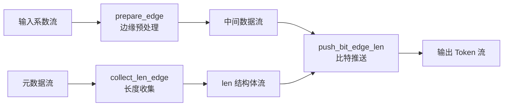

# edge_encoding_core 模块技术深度解析

## 开篇：这个模块是做什么的？

想象你正在设计一个高速图像压缩芯片，需要将 JPEG 图像编码成 Lepton 格式以获得更好的压缩率。在图像的每个 8x8 DCT 块周围，存在着被称为"边缘"（edges）的系数——它们连接着相邻块，承载着关键的上下文信息。

**`edge_encoding_core`** 就是这个压缩流水线中的"边缘系数序列化引擎"。它的核心职责是将这些边缘系数（包括水平边缘和垂直边缘）转换成一系列待编码的比特流（tokens），供下游的算术编码器使用。

这不是一个简单的内存拷贝操作。边缘编码涉及复杂的自适应逻辑：需要根据相邻块的非零系数数量动态调整编码策略，处理符号位、指数位和尾数位的分离编码，还要在水平和垂直边缘之间无缝切换。更重要的是，这一切必须在 FPGA 上以**每个时钟周期处理一个数据**（II=1）的速度持续运转。

## 架构全景：数据如何在模块中流动

这个模块采用典型的 **HLS Dataflow 架构**——将整个计算过程拆解为多个独立阶段，让它们像流水线一样并行工作。想象一个现代化的机场安检通道：不同的检查环节（身份验证、行李扫描、人身检查）同时进行，而不是等前一个旅客完全通过才让下一个进入。



### 核心组件职责

**1. `prepare_edge<true/false>`（边缘预处理）**

这是流水线的第一阶段，负责处理原始 DCT 系数，提取出边缘编码所需的各种中间表示。模板参数 `true` 表示处理水平边缘（Horizontal），`false` 表示处理垂直边缘（Vertical）。它会输出：

- `strm_length_exp`：系数的指数部分长度
- `strm_best_prior_exp_h`：最佳先验指数（用于上下文选择）
- `strm_abs_coef_nois_h`：绝对系数值（用于尾数编码）
- `strm_ctx_nois_h`：噪声上下文（用于概率表索引）

**2. `collect_len_edge`（长度元数据聚合）**

如果说 `prepare_edge` 是"数据平面"，那这个函数就是"控制平面"。它不处理实际的系数值，而是收集关于"有多少比特需要编码"的元数据。它维护着一个状态机，在水平边缘和垂直边缘之间交替处理，输出 `edge_len` 结构体流，其中包含：

- `lennz`：非零系数数量的编码比特数
- `lenexp`：指数部分的编码比特数  
- `lensign`：符号位是否需要编码
- `lenthr`：阈值以上部分的编码比特数
- `lennos`：噪声部分的编码比特数
- `is_h`：当前处理的是否为水平边缘

**3. `push_bit_edge_len`（比特流生成）**

这是真正产生输出比特的核心引擎。它消费 `collect_len_edge` 生成的 `edge_len` 元数据和 `prepare_edge` 生成的实际系数数据，通过复杂的嵌套循环和状态机，将每个系数拆解为一系列二进制决策（bits），输出到 `strm_sel_tab`（选择表）、`strm_cur_bit`（当前比特值）和多个地址流中。

关键设计在于它采用了**展平的状态机**：不是用传统的 switch-case 状态机，而是通过检查 `tmp_len` 结构体中的各个计数器（`lennz`, `lenexp`, `lensign` 等）是否非零来决定当前处于哪个编码阶段。这允许 HLS 工具更好地进行流水线优化。

## 依赖关系与数据契约

### 上游依赖（谁调用这个模块）

`edge_encoding_core` 位于 Lepton 编码流水线的中间层。它的直接调用者是 `hls_serialize_tokens_edges` 函数（模块的顶层封装），而这个函数又被上层的 Lepton 编码控制逻辑调用。

上游模块需要提供的输入包括：
- **系数流**：`strm_coef_h_here[8]` 和 `strm_coef_v_here[8]` 等，包含当前块及其邻居的 DCT 系数
- **上下文流**：`strm_h_nz_len`（水平非零系数数量）、`strm_v_nz_len`（垂直非零系数数量）
- **配置参数**：`min_nois_thld_x/y`（最小噪声阈值）、`idct_q_table_x/y`（量化表）

### 下游依赖（它调用谁）

模块内部调用的关键外部函数是 `prepare_edge`（定义在 `XAcc_edges.hpp` 中，虽然代码片段中未展示具体实现，但从调用方式可以看出其接口）。

下游消费者接收模块的输出流：
- `strm_sel_tab`：4-bit 选择表，指示当前 token 的类型（NZ_CNT, EXP_CNT, SIGN_CNT, THRE_CNT, NOIS_CNT）
- `strm_cur_bit`：实际的二进制值（0 或 1）
- `strm_addr1` 到 `strm_addr4`：用于概率表查找的上下文地址

这些流将被送到算术编码器（Arithmetic Coder）进行最终的熵编码。

### 数据契约与隐式假设

**关键契约 1：流深度与背压（Backpressure）**

代码中大量使用 `#pragma HLS stream depth=32` 声明中间流。这不是随意设置的——32 的深度足够覆盖流水线启动（pipeline startup）阶段的延迟，同时不会让 HLS 综合出过大的 FIFO 资源。调用者必须确保下游消费速率能够匹配上游生产速率，否则会出现背压导致流水线停顿。

**关键契约 2：II=1 的时序保证**

函数中大量使用 `#pragma HLS pipeline II = 1`，这意味着逻辑必须在单个时钟周期内完成一次迭代。这要求：
- 循环边界必须是可静态分析的（或至少具有确定的上界）
- 流读写必须是阻塞的（blocking），不能有条件分支导致的流访问不确定性
- 数组访问必须是无冲突的（代码中大量使用 `ap_uint` 而非数组索引来避免指针别名问题）

**关键契约 3：水平/垂直边缘的状态交替**

`collect_len_edge` 函数内部维护了一个复杂的状态机，在水平（is_h=true）和垂直（is_h=false）边缘处理之间切换。调用者必须保证输入流的顺序与状态机的期望一致：先是水平边缘的元数据，然后是垂直边缘的，且每个边缘内的系数数量必须与非零计数流（`strm_h_nz_len`）中声明的数量一致。任何不匹配都会导致状态机死锁或数据错位。

## 设计决策与权衡

### 1. 数据流架构 vs 控制流架构

**选择**：采用 HLS Dataflow 架构，将计算分解为 `prepare_edge`、`collect_len_edge` 和 `push_bit_edge_len` 三个并行阶段。

**权衡分析**：
- **优势**：最大化吞吐量。当 `push_bit_edge_len` 在处理第 N 个块的比特时，`collect_len_edge` 可以并行收集第 N+1 个块的长度元数据，`prepare_edge` 则可以预处理第 N+2 个块的系数。理论加速比接近 3x（实际受限于最慢阶段）。
- **代价**：增加了中间缓冲（intermediate buffering）需求。模块内部声明了大量深度为 32 的 `hls::stream`，消耗了 FPGA 的 LUTRAM/BRAM 资源。如果数据流不平衡（某个阶段显著慢于其他阶段），这些 FIFO 会填满导致背压，反而降低效率。
- **替代方案**：纯控制流（单线程顺序执行）会节省资源但性能极差；全展开（full unrolling）会消耗巨量逻辑资源。Dataflow 是资源与性能之间的甜点。

### 2. 展平状态机（Flat State Machine）

**选择**：在 `push_bit_edge_len` 中，不使用传统的 `switch(state)` 状态机，而是通过检查 `tmp_len` 结构体中的多个计数器（`lennz`, `lenexp`, `lensign`, `lenthr`, `lennos`）是否非零来决定当前行为。

**权衡分析**：
- **优势**：适合 HLS 的综合约束。每个 "if-else" 分支都可以被看作独立的执行路径，HLS 工具可以更好地进行调度和流水线优化。避免了状态机编码/解码的开销。
- **代价**：代码可读性下降。嵌套的 if-else 逻辑比清晰的状态机更难以跟踪。维护人员需要理解每个 `lenxxx` 字段的生命周期和递减逻辑。
- **关键洞察**：这种设计实际上是将 "状态" 编码到了数据（`edge_len` 结构体）中，而不是程序计数器中。这符合数据流编程的哲学：让数据携带上下文，减少全局状态。

### 3. 静态多态（Static Polymorphism） via Templates

**选择**：`prepare_edge` 使用模板参数 `<bool is_horizontal>` 来区分水平边缘和垂直边缘的处理，而不是通过运行时 `if (is_horizontal)` 分支或虚函数。

**权衡分析**：
- **优势**：零运行时开销。HLS 工具在编译时为 `true` 和 `false` 分别实例化两份代码，每份都是纯确定性的控制流，便于生成高效的硬件逻辑。避免了分支预测失误（branch misprediction）在硬件上的等效问题。
- **代价**：代码膨胀（code bloat）。生成了两份几乎相同的逻辑，消耗了更多的 FPGA LUTs。如果水平/垂直逻辑差异很小，这种代价可能不划算。
- **上下文适配**：在图像编码中，水平和垂直边缘的处理通常涉及不同的邻居访问模式（水平边缘看上方块，垂直边缘看左方块），模板化允许编译时优化这些访问模式。

### 4. 比特粒度 vs 字节粒度的数据流

**选择**：输出流 `strm_cur_bit` 是 `bool` 类型（1比特），而不是字节或字。地址流 `strm_addr1/2/3/4` 是 16-bit，但携带的是上下文索引而非内存地址。

**权衡分析**：
- **优势**：直接对接算术编码器（Arithmetic Coder）。熵编码的本质就是处理比特决策（0 或 1），每个比特伴随一个概率上下文（由 addr 流索引）。这种细粒度接口消除了下游模块的解析开销。
- **代价**：流数量爆炸。为了传递一个"token"，需要并行发送 `sel_tab`、`cur_bit` 和四个 `addr` 流，总共 6 个独立的 `hls::stream` 通道。这在 PCB 布线和 FPGA 路由上造成了压力。
- **替代考虑**：打包成一个宽总线（struct of streams）？那样会增加时序复杂度（需要同时采样所有字段），并且使得部分数据有效的情况难以处理。分离流允许每个通道独立的 valid/ready 握手（在 AXI-Stream 语义下）。

## 新手上路：关键陷阱与调试指南

### 1. 状态机死锁：水平/垂直切换的隐形契约

**症状**：仿真挂起，永远等不到 `strm_e`（结束信号）置高。

**根因**：`collect_len_edge` 内部的状态机严格依赖 `num_nonzeros_edge_h` 和 `num_nonzeros_edge_v` 的递减逻辑。如果你在上游模块中写入 `strm_h_nz_len` 的计数值，与实际通过 `strm_length_h` 发送的系数数量不匹配，状态机会在等待一个永远不会到来的递减时卡住。

**调试技巧**：
- 在 `collect_len_edge` 的循环体内添加 `printf`（或 HLS 的 `DEBUG` 宏），打印 `num_nonzeros_edge_h`、`num_nonzeros_edge_v` 和 `j` 的值。
- 检查 `tmp_len.is_h` 的切换逻辑。通常死锁发生在水平处理完毕应该切换到垂直处理时，但 `num_nonzeros_edge_v` 没有正确初始化。

### 2. II Violation：当流水线断裂时

**症状**：HLS 综合报告出现 "Violation: Target II not met"，或者仿真结果与预期不符（数据错位）。

**根因**：`push_bit_edge_len` 内部有复杂的嵌套条件分支和数据依赖。虽然代码中标记了 `#pragma HLS PIPELINE II = 1`，但如果编译器无法证明某个数组访问或流读取可以在一个周期内完成，它会自动增加 II。

**高危代码区**：
```cpp
// 这段逻辑在 push_bit_edge_len 中
if ((!tmp_len.lennz) && (!tmp_len.lenexp) && ... ) {
    // 复杂的分支读取 strm_len 或其他流
    tmp_len = strm_len.read();
}
```
如果在 `strm_len.read()` 之前有太多的组合逻辑延迟（例如计算复杂的条件），HLS 可能无法满足 II=1。

**修复策略**：
- **预读取（Prefetching）**：在进入 `while` 循环之前，先读取第一个 `tmp_len` 值，循环体内采用"先使用，后读取下一个"的模式（即 `do-while` 风格）。
- **拆分复杂条件**：将 `if ((!tmp_len.lennz) && ...)` 拆分为嵌套的 `if` 语句，减少单周期内的比较器数量。

### 3. 流深度（Stream Depth）与反压（Backpressure）

**症状**：吞吐量远低于理论值，或者数据在随机位置丢失。

**根因**：代码中大量使用了 `#pragma HLS stream depth=32`。如果下游模块的消费速度暂时慢于上游生产速度（例如算术编码器遇到复杂符号需要多个周期），32 深度的 FIFO 会被迅速填满，产生反压（Backpressure），导致上游流水线停顿。

**配置陷阱**：
- `depth=32` 是 HLS 的默认值，但不一定是最佳值。如果 `push_bit_edge` 产生的数据突发（burst）长度可能超过 32，就会溢出。
- 在 `hls_serialize_tokens_edges` 中，所有中间流都设置了 `depth=32`，但如果图像块（block）的尺寸很大，且边缘系数很多，这个深度可能不足。

**调优建议**：
- 通过仿真波形观察每个流的 `empty` 和 `full` 信号。如果某个流的 `full` 信号频繁置高，需要增加其 `depth`（以消耗更多 BRAM/LUTRAM 为代价）。
- 对于关键路径上的流（如 `strm_len`），考虑使用 `type=FIFO impl=LUTRAM`（代码中已设置），以保证快速访问。

### 4. 模板实例化与符号链接错误

**症状**：链接阶段报错，提示 `prepare_edge<true>` 或 `prepare_edge<false>` 未定义。

**根因**：`pre_serialize_tokens_edges` 和 `hls_serialize_tokens_edges` 都调用了 `prepare_edge`，但提供的代码片段中没有包含 `prepare_edge` 的定义。如果 `prepare_edge` 定义在头文件中但没有被正确包含，或者其定义位于某个没有被链接的 `.cpp` 文件中，就会出现链接错误。

**检查清单**：
- 确保 `XAcc_edges.hpp`（或类似的头文件）中包含了 `prepare_edge` 的完整定义（而不仅仅是声明），因为它是模板函数。
- 如果 `prepare_edge` 定义在另一个 `.cpp` 文件中，需要将其显式实例化（explicit instantiation）或者改为头文件内联定义。

### 5. 数值溢出：`encoded_so_far` 的截断逻辑

**症状**：在某些特定输入（如具有极大 DCT 系数的 JPEG 图像）下，压缩率突然下降，或者解压后图像出现细微噪声。

**根因**：在 `push_bit_edge_len` 中，`encoded_so_far` 用于跟踪当前正在编码的系数的尾数（mantissa）比特：

```cpp
encoded_so_far <<= 1;
if (cur_bit) {
    encoded_so_far.set(0, cur_bit);
}
if (encoded_so_far > 127) encoded_so_far = 127;
```

这里有一个显式的溢出保护：如果 `encoded_so_far` 超过 127（7-bit 最大值），就将其钳位到 127。

**设计意图**：注释中明确说明 "since we are not strict about rejecting jpegs with out of range coefs we just make those less efficient by reusing the same probability bucket"。这意味着：
- 输入的 JPEG 可能包含超出标准范围的 DCT 系数（虽然罕见但合法）。
- 为了简化硬件设计，不拒绝这些输入，而是将它们映射到概率表的最后一个桶（bucket 127）。
- 这保证了编码器永远不会崩溃，但压缩效率会略微下降（因为这些 out-of-range 系数无法获得精细的概率建模）。

**调试提示**：
- 如果遇到压缩质量问题，检查 `encoded_so_far > 127` 的触发频率。如果频繁触发，说明输入图像包含大量异常 DCT 系数，可能需要在前端进行预处理（如钳位到标准范围）以获得更好的压缩率。
- 注意 `encoded_so_far` 是 `ap_uint<8>` 类型，但逻辑上只使用 0-127 的范围（7-bit），最高位始终为 0。

## 总结：如何与这个模块协同工作

`edge_encoding_core` 是 Lepton 编码器中最复杂的模块之一，它将图像压缩中抽象的"上下文自适应编码"概念转化为具体的硬件流水线。

**如果你需要修改这个模块**：

1. **保持 Dataflow 完整性**：任何新增的阶段必须明确声明为独立的函数，并确保其输入流与上游的 FIFO 深度匹配。不要在一个函数内混合多个独立的计算逻辑——这会破坏 Dataflow 调度。

2. **尊重 II=1 的约束**：在修改 `push_bit_edge_len` 或 `collect_len_edge` 时，添加任何新的条件分支或数学运算后，务必重新运行 C Synthesis 检查 II。如果无法满足 II=1，考虑将逻辑拆分到新的流水线阶段，而非强行在一个周期内完成。

3. **模板实例化一致性**：`prepare_edge` 有两个实例（`<true>` 和 `<false>`）。修改模板参数列表或函数签名时，必须同时更新两个实例的调用点（在 `pre_serialize_tokens_edges` 和 `hls_serialize_tokens_edges` 中）。

4. **数值范围检查**：任何新的 `ap_uint` 或 `ap_int` 变量都要明确其位宽和取值范围。特别注意类似 `encoded_so_far` 的溢出处理逻辑——在硬件中，静默溢出会导致难以调试的压缩错误。

**如果你只是使用这个模块**：

- 确保输入流的数据顺序严格遵循 "水平边缘 -> 垂直边缘 -> 下一个块" 的交替模式。
- 监控中间流的深度（通过 HLS 的 Dataflow Viewer），确保没有因为下游消费慢导致的背压。
- 注意 `min_nois_thld` 参数的配置——它直接影响编码的激进程度（更低的阈值意味着更精细的建模但消耗更多比特）。

---

**参考链接**：
- 父模块：[platform_connectivity](codec-L2-demos-leptonEnc-platform_connectivity.md)（连接层与主机接口）
- 相邻模块：[lepton_encoder_demo](codec-L2-demos-leptonEnc.md)（Lepton 编码器顶层）
- 依赖的外部函数：`prepare_edge`（定义在 [XAcc_edges.hpp](codec-L2-demos-leptonEnc-kernel-XAcc_edges.hpp) 中，用于边缘系数预处理）
