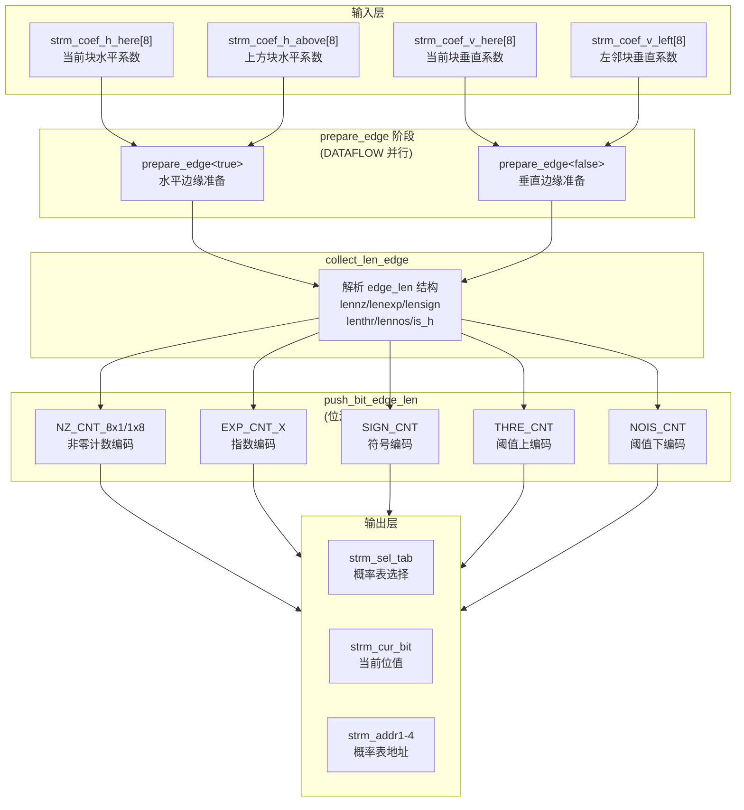
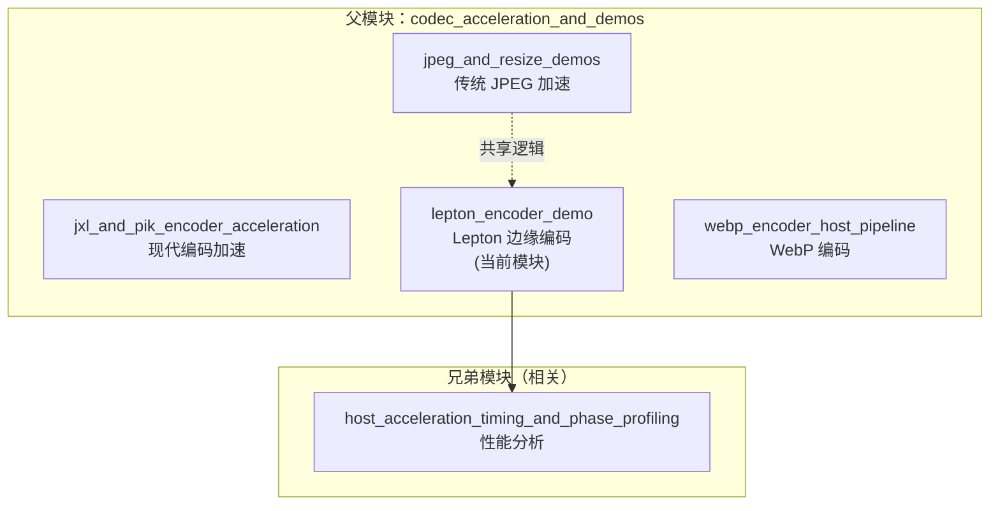

# Lepton Encoder Demo (lepton_encoder_demo)

## 一句话总结

这是一个基于 Xilinx FPGA 的 Lepton/JPEG 图像编码加速器，专门用于高效处理图像边缘系数的熵编码。它的核心设计思想是**将边缘区域（Edge）与非边缘区域（Non-edge）分别处理**，通过并行流水线实现 JPEG 压缩的高吞吐。

---

## 问题空间：为什么需要这个模块？

### JPEG 编码的瓶颈在哪里？

JPEG 压缩算法看似简单，但要在硬件上实现高吞吐面临着根本性矛盾：

1. **变长编码的串行依赖**：霍夫曼编码是变长的，每个符号的码长取决于熵模型的概率分布。你无法在不知道前一个符号长度的情况下，并行处理下一个符号。

2. **边缘 vs 非边缘的不对称性**：JPEG 的 8x8 块可以分为三类区域：
   - **DC 系数**：每个块只有一个，需要特殊处理
   - **边缘区域（Edge）**：8x8 块的边缘（第 0 行和第 0 列）与非边缘块相邻，熵模型依赖上下文
   - **非边缘区域（Non-edge/7x7）**：8x8 块的内部 7x7 区域，可以独立处理

3. **吞吐 vs 面积**的硬件权衡：如果你试图用一个通用的熵编码器处理所有情况，你需要大量的状态存储和复杂的控制逻辑。

### Lepton 格式是什么？

Lepton 是 Dropbox 开发的一种 JPEG 无损重压缩格式。它的核心思想是：
- **保留 JPEG 的量化系数**（保证无损）
- **使用更高效的熵编码**（用算术编码代替霍夫曼编码）
- **在边缘区域使用更激进的上下文建模**

这个模块 (`lepton_encoder_demo`) 正是实现 Lepton 编码器中**边缘系数熵编码**的硬件加速器部分。

---

## 核心抽象：把图像看成什么？

要理解这个模块，你需要建立以下**心智模型**：

### 1. 图像 = 流式系数块

想象图像不是一张静态图片，而是一条**无限长的流水线**，每个周期送进来一个 8x8 的系数块。每个系数块由 DCT（离散余弦变换）和量化后产生。

```
┌─────────────┐     ┌─────────────┐     ┌─────────────┐
│ Block 0     │ ──▶ │ Block 1     │ ──▶ │ Block 2     │ ──▶ ...
│ (8x8 coefs) │     │ (8x8 coefs) │     │ (8x8 coefs) │
└─────────────┘     └─────────────┘     └─────────────┘
```

### 2. 边缘 vs 非边缘 = 两条并行的流水线

每个 8x8 块可以拆成两部分：
- **7x7 内部区域**：64 - 15 = 49 个系数，可以按 zig-zag 顺序独立处理
- **边缘区域**：第 0 行（8 个系数）+ 第 0 列（8 个系数）- 重叠的 DC（1 个）= 15 个系数

关键是：**边缘系数需要上下文**。第 0 行的系数依赖上方块的第 7 行，第 0 列的系数依赖左方块的第 7 列。因此边缘处理必须按扫描顺序串行进行，而非边缘可以乱序或并行。

```
                    Block (i-1, j)
                         │
                         ▼
Block (i, j-1) ──▶   Block (i, j)   ──▶  Edge processing
    (左邻)              (当前)              needs both
```

### 3. 熵编码 = 概率表查询 + 位流组装

Lepton 使用算术编码的简化版。核心操作是：
1. 根据上下文（已编码的邻居信息）查概率表，确定当前位的概率
2. 根据概率更新编码区间（range）和偏移（offset）
3. 当区间足够小时，输出字节到码流

本模块**不负责完整的算术编码**，它只负责**生成待编码的符号序列**（token stream）。具体地，它输出：
- `sel_tab`: 选择哪个概率表（NZ_CNT, EXP_CNT, SIGN_CNT, THRE_CNT, NOIS_CNT）
- `cur_bit`: 当前要编码的位（0 或 1）
- `addr1-addr4`: 概率表查找地址（由上下文决定）

### 4. XAcc_edges = 边缘加速器

`XAcc_edges` 是 "Xilinx Accelerator for Edge processing" 的缩写。这个模块的核心职责是：
- 接收水平（Horizontal）和垂直（Vertical）边缘的系数流
- 对每种边缘进行扫描、游程编码、系数分解
- 输出规范化的熵编码符号流

---

## 架构图与数据流



### 数据流详解

1. **输入阶段**：水平边缘和垂直边缘分别来自不同的数据源
   - 水平边缘：当前块系数 + 上方块系数（上方邻居的底部行）
   - 垂直边缘：当前块系数 + 左邻块系数（左邻居的右列）

2. **prepare_edge 阶段**：两个模板函数实例并行执行
   - `prepare_edge<true>` 处理水平边缘
   - `prepare_edge<false>` 处理垂直边缘
   - 两者通过 `hls::stream` 解耦，形成流水线

3. **collect_len_edge 阶段**：核心状态机
   - 解析 `edge_len` 结构，决定每个边缘需要生成多少位
   - 管理水平和垂直边缘的切换逻辑

4. **push_bit_edge_len / push_bit_edge 阶段**：位流生成
   - 按类别生成熵编码符号
   - 每个周期输出一个 `taken_dat` 结构

---

## 关键设计决策

### 1. 为什么将水平和垂直边缘分开处理？

**选择的方案**：使用模板参数 `bool is_h` 将 `prepare_edge` 实例化为两个独立函数，通过 `DATAFLOW` 并行执行。

**替代方案**：用一个函数处理两种边缘，通过运行时分支选择。

**为什么选择当前方案**：
- **资源分离**：水平和垂直边缘可以同时推进，不需要等待对方完成
- **代码清晰**：模板特化允许编译器生成最优的控制逻辑
- **流水线友好**：`DATAFLOW`  pragma 要求函数边界清晰，模板实例化天然满足这一点

**代价**：
- 代码体积略增（两份几乎相同的逻辑）
- 需要仔细管理 `hls::stream` 的深度，防止死锁

### 2. 为什么使用 `edge_len` 结构进行中间表示？

**选择的方案**：定义一个包含 6 个字段的结构体来编码每个边缘的所有长度信息：
```cpp
struct edge_len {
    ap_uint<2> lennz;    // 非零计数位数
    ap_uint<4> lenexp;   // 指数位数
    ap_uint<1> lensign;  // 符号位存在？
    ap_uint<4> lenthr;   // 阈值上编码位数
    ap_uint<2> lennos;   // 阈值下编码位数
    bool is_h;           // 水平还是垂直边缘？
};
```

**替代方案**：直接将所有中间数据通过 stream 传递，不进行打包。

**为什么选择当前方案**：
- **带宽压缩**：`edge_len` 只有约 20 位，却能编码原本需要数百位传递的信息
- **确定性调度**：`collect_len_edge` 可以根据 `edge_len` 精确计算需要多少个周期，不需要动态分支预测
- **分离关注点**：打包/解包逻辑与位生成逻辑分离，便于调试

**代价**：
- 位宽计算复杂，容易出错
- 需要 `collect_len_edge` 和 `push_bit_edge` 严格同步，否则会出现错位

### 3. 为什么使用 `hls::stream` 而不是数组？

**选择的方案**：所有中间数据都通过 `hls::stream` 传递，使用 `DATAFLOW` pragma 实现流水线。

**替代方案**：使用数组/双缓冲存储中间结果，由主循环控制调度。

**为什么选择当前方案**：
- **FIFO 语义天然匹配**：图像编码是流式处理，每个块的输出是下一个块的输入（特别是边缘依赖）
- **死锁可检测**：Vitis HLS 可以对 `hls::stream` 进行静态分析，报告潜在的死锁
- **资源优化**：`hls::stream` 可以映射到 BRAM、LUTRAM 或寄存器，HLS 自动选择最优方案

**代价**：
- 深度配置困难：太浅会 stall，太深浪费资源
- 调试困难：无法像数组那样直接查看中间状态

### 4. 为什么选择 II=1 的激进流水线？

代码中大量出现 `#pragma HLS pipeline II = 1`。

**选择的方案**：几乎所有循环都尝试实现 Initiation Interval = 1（每个周期启动一次迭代）。

**替代方案**：放宽到 II=2 或更高，降低资源消耗。

**为什么选择当前方案**：
- **吞吐是首要目标**：图像编码是计算密集型任务，每周期处理一个系数可以最大化 FPS
- **内存带宽充足**：FPGA 的 HBM/DDR 带宽足以支撑每周期读写多个系数
- **算法特性**：JPEG 系数的处理相对规则，没有复杂的跨迭代依赖

**代价**：
- 资源消耗大：需要大量 DSP、BRAM 和寄存器
- 时序收敛困难：II=1 往往意味着关键路径很短，对时钟频率有要求

---

## 新贡献者必读：陷阱与注意事项

### 1. HLS 仿真与硬件不一致

**陷阱**：C 仿真通过不代表硬件正确。`hls::stream` 在仿真中是无限深度的 FIFO，但在硬件中是固定深度的 BRAM。

**对策**：
- 始终使用 `hls::stream depth=N` 显式指定深度
- 运行 Co-simulation（联合仿真）验证时序
- 如果出现死锁，检查是否存在读取-写入顺序不匹配（A 读 B 的流，同时 B 读 A 的流）

### 2. `edge_len` 的位宽对齐

**陷阱**：`edge_len` 结构体的总位宽必须是 8 的倍数，否则 HLS 会插入填充位，导致与软件端的数据布局不一致。

**对策**：
- 使用 `static_assert` 验证位宽：
```cpp
static_assert(sizeof(edge_len) * 8 == 20, "edge_len bit width mismatch");
```
- 如果需要跨平台兼容，使用 `__attribute__((packed))`，但要注意性能损失

### 3. `prepare_edge` 的模板实例化顺序

**陷阱**：`prepare_edge<true>` 和 `prepare_edge<false>` 是两个独立的函数实例。如果在 `DATAFLOW` 区域中先调用 `<false>` 再调用 `<true>`，HLS 可能无法正确识别为并行。

**对策**：
- 保持调用顺序一致：水平优先，垂直其次（或相反）
- 使用 `#pragma HLS DATAFLOW` 包裹两个调用，并确保它们之间只有 `hls::stream` 连接
- 如果 Co-simulation 报告死锁，尝试交换调用顺序或增加 stream 深度

### 4. 符号扩展与无符号运算

**陷阱**：代码中混合使用 `ap_uint`（无符号）和 `ap_int`（有符号）。当从 `ap_uint` 赋值给 `ap_int` 时，如果高位为 1，会导致负数。

**对策**：
- 在从 `ap_uint` 转换为 `ap_int` 之前，显式检查范围：
```cpp
ap_uint<11> abs_coef;  // 无符号
ap_int<11> signed_coef = abs_coef;  // 危险！
// 安全方式：
ap_int<11> signed_coef = (abs_coef < 1024) ? (int)abs_coef : -1;
```
- 使用 `ap_uint` 的 `.range()` 方法显式提取位域

### 5. 时序收敛与关键路径

**陷阱**：`push_bit_edge` 中的嵌套循环和复杂的位运算可能导致关键路径过长，无法达到目标频率（如 300MHz）。

**对策**：
- 使用 `#pragma HLS PIPELINE II=1` 强制 II=1，观察 HLS 报告中的关键路径延迟
- 如果关键路径超过 3.33ns（对于 300MHz），考虑：
  - 将复杂表达式拆分为多个周期（添加中间寄存器）
  - 使用 `#pragma HLS ALLOCATION` 限制某些运算器的数量
  - 降低目标频率或接受 II>1
- 对于 `while (i >= 0)` 循环，确保循环边界是编译时常量或可以被 HLS 展开的常数

---

## 与其他模块的关系



### 在系统中的定位

`lepton_encoder_demo` 是 **Xilinx Vitis Libraries** 中 **codec** 库的一部分，位于 L2（Level 2）层。这意味着：

- **L1（底层）**：提供基础的 HLS 原语（如 DCT、量化、Zig-zag 扫描）
- **L2（当前层）**：将 L1 的原语组合成功能完整的算法单元（如本模块的边缘熵编码）
- **L3（顶层）**：集成多个 L2 模块，提供完整的应用解决方案

本模块依赖上游提供的 **DCT 系数流**，并为下游的 **算术编码器** 生成标准化的符号流。

---

## 总结：给新贡献者的设计哲学

1. **流式处理是核心**：一切设计都围绕 `hls::stream` 展开。想象数据是流动的液体，而不是静止的固体。你的任务是设计管道的形状，而不是搬运桶。

2. **边缘是特殊的存在**：在图像编码中，边缘（边界）和内部的处理逻辑完全不同。不要试图用一个通用的循环处理所有系数——那会导致控制逻辑极其复杂。

3. **II=1 是目标，不是约束**：我们在设计时就假设每个周期必须输出一个结果。这迫使我们将算法拆解成细粒度的流水线阶段。如果某个操作太复杂，就拆成多个阶段，而不是妥协 II。

4. **HLS 是约束求解器，不是魔法**：不要把 HLS 当成黑盒。每一条 `pragma` 都是在告诉工具"我喜欢这个架构"。你需要理解硬件（BRAM、DSP、FF、LUT）的物理限制，才能写出能综合的代码。

5. **仿真通过只是开始**：C 仿真成功说明算法正确，Co-simulation 通过说明时序正确，上板运行成功说明系统正确。每一层都有新的陷阱等着你。

---

## 子模块文档

本模块的详细实现被拆分为以下子模块，涵盖平台集成与内核实现两个层面：

1. **[平台连接层 (platform_connectivity)](codec_acceleration_and_demos-lepton_encoder_demo-platform_connectivity.md)** —— U200 平台的内核连接配置，包括 DDR 内存映射、SLR 放置策略和 AXI 接口定义。

2. **[边缘编码核心 (edge_encoding_core)](codec-L2-demos-leptonEnc-kernel-XAcc_edges.md)** —— Lepton 边缘熵编码的 HLS 内核实现，包括 `edge_len` 与 `taken_dat` 数据结构、比特流生成逻辑和流水线优化策略。

---

*最后更新：基于 codec/L2/demos/leptonEnc 源码分析*
