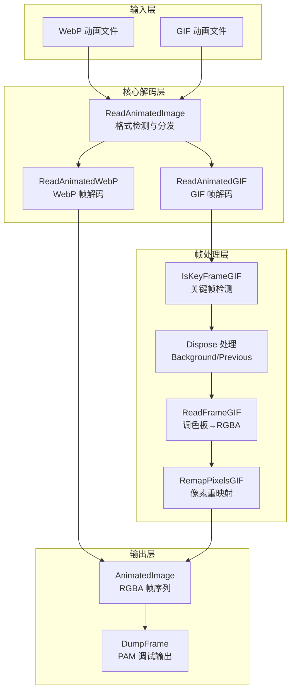

# animation_and_gif_frame_handling 模块深度解析

## 一句话总结

本模块是 WebP 编码器演示程序的**动画帧处理器**，它像一位专业的"动画胶片修复师"——能够读取 WebP 或 GIF 格式的动画文件，将每一帧解码为原始的 RGBA 像素数据，并正确处理 GIF 复杂的帧处置逻辑（disposal methods），最终输出可供后续编码或分析的标准化动画帧序列。

---

## 问题空间与设计动机

### 为什么需要这个模块？

在图像处理流水线中，动画格式（尤其是 GIF）是一把"双刃剑"：

1. **格式复杂性**：GIF 动画使用古老的 LZW 压缩和调色板索引，而 WebP 动画使用 VP8 编码——两者底层技术完全不同
2. **帧间依赖**：GIF 的帧不全是完整的独立图像，有些帧只包含变化区域，需要依赖前一帧的内容进行合成
3. **处置方法（Disposal Methods）**：GIF 规范定义了帧如何被"处置"（保留、清除为背景、恢复前一帧）——处理错误会导致画面撕裂或残影
4. **跨格式验证需求**：在开发 WebP 编码器时，需要将输出结果与 GIF 解码结果进行像素级对比（PSNR、最大差值等）

### 设计决策：为什么不直接使用现有库？

- **libgif** 只提供原始 GIF 帧数据，不处理帧间合成和处置逻辑
- **libwebp** 的解码 API 与 GIF 完全不同，需要统一抽象层
- 需要一个**中立的、像素级精确的**表示形式，作为跨格式比较的"黄金标准"

---

## 核心抽象与心智模型

### 关键数据结构

```c
// 单个解码后的帧
typedef struct {
    uint8_t* rgba;      // 解码并重建后的完整帧（RGBA 格式）
    int duration;       // 帧持续时间（毫秒）
    int is_key_frame;   // 是否为关键帧（GIF 处置分析用）
} DecodedFrame;

// 完整动画
typedef struct {
    uint32_t canvas_width;    // 画布宽度
    uint32_t canvas_height;   // 画布高度
    uint32_t bgcolor;         // 背景色（ARGB 格式）
    uint32_t loop_count;      // 循环次数（0 = 无限）
    DecodedFrame* frames;     // 帧数组
    uint32_t num_frames;      // 帧数量
    void* raw_mem;            // 帧像素数据的连续内存块
} AnimatedImage;
```

### 心智模型：动画胶片修复工作台

想象你是一位修复老动画胶片的技术人员：

1. **画布（Canvas）**：所有帧都在一个固定大小的"画布"上呈现，帧可能只覆盖画布的一部分
2. **帧（Frame）**：每帧是一个完整的 RGBA 图像，不再是压缩格式或调色板索引
3. **处置方法（Disposal Method）**：就像胶片修复中的"叠化"技术：
   - **None**：保留当前帧（下一帧直接叠加在上面）
   - **Background**：将帧区域清除为背景色（像用橡皮擦）
   - **Previous**：恢复到之前某帧的状态（像"撤销"操作）
4. **关键帧（Key Frame）**：能够独立解码、不依赖之前帧内容的帧——类似于视频编码中的 I 帧

---

## 数据流与依赖关系

### 架构图



### 关键函数调用链

#### 1. 主入口：`ReadAnimatedImage`

```c
int ReadAnimatedImage(const char filename[], 
                      AnimatedImage* const image, 
                      int dump_frames, 
                      const char dump_folder[])
```

**职责**：格式检测与分发

**流程**：
1. 读取文件内容为 `WebPData`
2. 调用 `IsWebP()` 检测是否为 WebP 格式
3. 调用 `IsGIF()` 检测是否为 GIF 格式
4. 根据检测结果分发到对应的专用解码器
5. 解码失败时调用 `ClearAnimatedImage()` 清理资源

#### 2. WebP 解码：`ReadAnimatedWebP`

```c
static int ReadAnimatedWebP(const char filename[],
                            const WebPData* const webp_data,
                            AnimatedImage* const image,
                            int dump_frames,
                            const char dump_folder[])
```

**职责**：将 WebP 动画解码为 RGBA 帧序列

**流程**：
1. 使用 `WebPAnimDecoderNew()` 创建动画解码器
2. 调用 `WebPAnimDecoderGetInfo()` 获取动画元数据（画布尺寸、帧数、循环次数）
3. 调用 `AllocateFrames()` 为所有帧分配连续的 RGBA 内存
4. 循环调用 `WebPAnimDecoderGetNext()` 逐帧解码：
   - 计算帧持续时间（当前时间戳 - 上一帧时间戳）
   - 将解码后的 RGBA 像素复制到对应帧的缓冲区
   - 调用 `CleanupTransparentPixels()` 规范化透明像素（便于后续比较）
   - 如启用调试，调用 `DumpFrame()` 保存为 PAM 文件

#### 3. GIF 解码：`ReadAnimatedGIF`

```c
static int ReadAnimatedGIF(const char filename[],
                           AnimatedImage* const image,
                           int dump_frames,
                           const char dump_folder[])
```

**职责**：解析 GIF 文件并重建完整的 RGBA 帧序列

**流程**：
1. 使用 `DGifOpenFileName()` 打开 GIF 文件
2. 调用 `DGifSlurp()` 将整个文件解析到内存结构
3. 提取动画元数据：
   - 画布尺寸 (`SWidth`, `SHeight`)
   - 循环次数 (`GetLoopCountGIF()` 解析 Netscape 扩展)
   - 背景色 (`GetBackgroundColorGIF()` 根据调色板解析)
4. 为每一帧执行**帧重建**：

##### 3.1 关键帧检测 (`IsKeyFrameGIF`)

```c
static int IsKeyFrameGIF(const GifImageDesc* prev_desc,
                         int prev_dispose,
                         const DecodedFrame* const prev_frame,
                         int canvas_width,
                         int canvas_height)
```

**逻辑**：
- 第一帧总是关键帧
- 如果前一帧的处置方法是 `DISPOSE_BACKGROUND` 且覆盖了完整画布 → 当前帧是关键帧
- 如果前一帧本身就是关键帧且处置方法为 `DISPOSE_BACKGROUND` → 当前帧是关键帧

##### 3.2 帧初始化与处置处理

对于每个非关键帧，需要先复制前一帧的像素，然后应用前一帧的"处置方法"：

```c
// 复制前一帧到当前帧
CopyCanvas(prev_rgba, curr_rgba, canvas_width, canvas_height);

// 根据处置方法处理前一帧区域
switch (prev_gcb.DisposalMode) {
    case DISPOSE_BACKGROUND:
        // 将前一帧区域清零（透明）
        ZeroFillFrameRect(curr_rgba, canvas_width_in_bytes, 
                         prev_desc->Left, prev_desc->Top,
                         prev_desc->Width, prev_desc->Height);
        break;
    case DISPOSE_PREVIOUS:
        // 恢复到更早的某帧状态（复杂回溯逻辑）
        // ... 向前查找直到找到非 DISPOSE_PREVIOUS 的帧
        break;
}
```

##### 3.3 解码当前帧 (`ReadFrameGIF`)

```c
static int ReadFrameGIF(const SavedImage* const gif_image,
                        const ColorMapObject* cmap,
                        int transparent_color,
                        int out_stride,
                        uint8_t* const dst)
```

**流程**：
1. 确定调色板（优先使用帧局部调色板，否则用全局调色板）
2. 遍历帧的像素数据（`RasterBits`），通过 `RemapPixelsGIF` 将调色板索引转换为 RGBA：
   - 如果像素值等于透明色索引 → 保持透明（RGBA = 0）
   - 否则从调色板获取 RGB，Alpha 设为 255（不透明）
3. 将转换后的 RGBA 像素写入目标缓冲区的正确位置（考虑帧偏移 `Left`, `Top`）

---

## 内存管理与资源生命周期

### 所有权模型

本模块采用**中心化内存管理**策略，由 `AnimatedImage` 结构统一管理所有资源：

```c
typedef struct {
    // ... 元数据字段 ...
    DecodedFrame* frames;    // 指向帧描述符数组（malloc 分配）
    void* raw_mem;           // 指向所有帧 RGBA 数据的连续内存块（malloc 分配）
} AnimatedImage;
```

**所有权规则**：

| 资源 | 分配者 | 所有者 | 释放者 | 说明 |
|------|--------|--------|--------|------|
| `AnimatedImage` 结构本身 | 调用者 | 调用者 | 调用者 | 通常在栈上，无需 free |
| `frames` 数组 | `AllocateFrames` | `AnimatedImage` | `ClearAnimatedImage` | 帧描述符数组 |
| `raw_mem` 连续像素缓冲区 | `AllocateFrames` | `AnimatedImage` | `ClearAnimatedImage` | 所有帧的 RGBA 数据 |
| `WebPAnimDecoder` | `WebPAnimDecoderNew` | 解码函数 | `WebPAnimDecoderDelete` | WebP 解码器实例 |
| `GifFileType` | `DGifOpenFileName` | 解码函数 | `DGifCloseFile` | GIF 文件句柄 |

### 分配策略

`AllocateFrames` 使用**两次 malloc**策略：

```c
static int AllocateFrames(AnimatedImage* const image, uint32_t num_frames) {
    const size_t rgba_size = image->canvas_width * kNumChannels * image->canvas_height;
    // 1. 为所有帧的 RGBA 像素分配连续内存
    uint8_t* const mem = (uint8_t*)malloc(num_frames * rgba_size * sizeof(*mem));
    // 2. 为帧描述符数组分配内存
    DecodedFrame* const frames = (DecodedFrame*)malloc(num_frames * sizeof(*frames));
    // ... 初始化逻辑 ...
    image->raw_mem = mem;    // 保存指针以便后续释放
    image->frames = frames;
}
```

**设计理由**：
- **连续性**：所有帧的像素数据是连续的，利于缓存友好性
- **简单性**：只有两处需要 free（`raw_mem` 和 `frames`），降低内存泄漏风险
- **局部性**：每帧的像素在 `rgba` 指针中，`raw_mem` 是底层存储，双重释放的风险较低（`ClearAnimatedImage` 只释放 `raw_mem` 和 `frames`）

### 错误处理与资源清理

```c
void ClearAnimatedImage(AnimatedImage* const image) {
    if (image != NULL) {
        free(image->raw_mem);   // 释放像素数据
        free(image->frames);      // 释放帧描述符
        image->num_frames = 0;
        image->frames = NULL;
        image->raw_mem = NULL;
    }
}
```

**清理契约**：
- 部分分配失败时，函数返回 0，但 `AnimatedImage` 可能处于**部分初始化状态**
- 调用者必须在失败时调用 `ClearAnimatedImage` 清理任何可能已分配的资源
- `ClearAnimatedImage` 是幂等的（多次调用安全）

---

## 关键算法与实现细节

### 1. GIF 关键帧检测算法

```c
static int IsKeyFrameGIF(const GifImageDesc* prev_desc,
                         int prev_dispose,
                         const DecodedFrame* const prev_frame,
                         int canvas_width,
                         int canvas_height) {
    if (prev_frame == NULL) return 1;  // 第一帧总是关键帧
    
    // 如果前一帧处置为背景且覆盖整个画布，当前帧不依赖之前状态
    if (prev_dispose == DISPOSE_BACKGROUND) {
        if (IsFullFrame(prev_desc->Width, prev_desc->Height, canvas_width, canvas_height)) {
            return 1;
        }
        // 前一帧本身是关键帧且被处置，当前帧可以重新开始
        if (prev_frame->is_key_frame) return 1;
    }
    return 0;
}
```

**算法逻辑**：关键帧是可以独立解码而不依赖之前任何帧的帧。这直接影响后续帧的重建策略：
- 非关键帧必须从前一帧复制像素作为起点
- 关键帧可以初始化为透明画布

### 2. GIF 帧处置（Dispose）实现

这是 GIF 解码中最复杂的部分。处置方法决定了当前帧结束后如何影响下一帧的起始状态：

```c
// 处置方法 0: 不处置，保留当前帧
// 处置方法 1: 不处置，保留当前帧（与 0 相同）
// 处置方法 2: 处置为背景色
// 处置方法 3: 恢复到前一帧状态
```

**DISPOSE_PREVIOUS 的复杂回溯**：

```c
case DISPOSE_PREVIOUS: {
    // 向前回溯，找到第一个非 DISPOSE_PREVIOUS 的帧
    int src_frame_num = i - 2;
    while (src_frame_num >= 0) {
        GraphicsControlBlock src_frame_gcb;
        DGifSavedExtensionToGCB(gif, src_frame_num, &src_frame_gcb);
        if (src_frame_gcb.DisposalMode != DISPOSE_PREVIOUS) break;
        --src_frame_num;
    }
    if (src_frame_num >= 0) {
        // 将该帧的对应区域像素复制到当前帧
        uint8_t* const src_frame_rgba = image->frames[src_frame_num].rgba;
        CopyFrameRectangle(src_frame_rgba, curr_rgba, canvas_width_in_bytes,
                          prev_desc->Left, prev_desc->Top,
                          prev_desc->Width, prev_desc->Height);
    } else {
        // 源帧不存在，清空为透明
        ZeroFillFrameRect(curr_rgba, canvas_width_in_bytes, 
                         prev_desc->Left, prev_desc->Top,
                         prev_desc->Width, prev_desc->Height);
    }
    break;
}
```

### 3. 像素重映射（调色板→RGBA）

```c
static void RemapPixelsGIF(
    const uint8_t* const src, 
    const ColorMapObject* const cmap, 
    int transparent_color, 
    int len, 
    uint8_t* dst) {
    int i;
    for (i = 0; i < len; ++i) {
        if (src[i] != transparent_color) {
            // 非透明像素：从调色板获取 RGB
            const GifColorType c = cmap->Colors[src[i]];
            dst[4 * i + 0] = c.Red;
            dst[4 * i + 1] = c.Green;
            dst[4 * i + 2] = c.Blue;
            dst[4 * i + 3] = 0xff;  // Alpha = 255（不透明）
        }
        // 透明像素：保持 dst 中的值（应为 0 或之前的内容）
    }
}
```

**关键细节**：透明像素在 `dst` 中**不被修改**，这允许：
- 在帧重建过程中，透明区域保留之前帧的内容（"看穿"效果）
- 如果像素索引等于透明色索引，该位置的 RGBA 保持原值（通常是透明黑色 0x00000000）

---

## 错误处理策略

### 错误传播机制

本模块采用**返回值错误码**策略（C 语言传统方式）：

| 函数 | 成功返回值 | 失败返回值 | 错误处理方式 |
|------|-----------|-----------|-------------|
| `ReadAnimatedImage` | 1 | 0 | 清理资源，返回 0 |
| `ReadAnimatedWebP` | 1 | 0 | 删除解码器，返回 0 |
| `ReadAnimatedGIF` | 1 | 0 | 关闭文件，返回 0 |
| `AllocateFrames` | 1 | 0 | 不修改传入对象，返回 0 |

### 资源清理契约

**关键模式**：部分失败时的清理责任

```c
int ReadAnimatedImage(...) {
    // ... 读取文件 ...
    
    if (IsWebP(&webp_data)) {
        ok = ReadAnimatedWebP(...);  // 内部已处理资源
    } else if (IsGIF(&webp_data)) {
        ok = ReadAnimatedGIF(...);   // 内部已处理资源
    }
    
    if (!ok) {
        // 重要：如果失败，清理任何可能已分配的资源
        ClearAnimatedImage(image);
    }
    WebPDataClear(&webp_data);
    return ok;
}
```

**契约规则**：
1. 失败时，函数必须确保不泄露资源
2. `AnimatedImage` 可能处于**部分初始化状态**，调用者必须调用 `ClearAnimatedImage` 清理
3. `ClearAnimatedImage` 是幂等的，可以安全地多次调用

---

## 设计权衡与决策分析

### 权衡 1：连续内存 vs. 分散分配

**决策**：所有帧的 RGBA 数据使用**单一连续内存块**（`raw_mem`），而非每帧单独 `malloc`。

**考量**：
- **性能优势**：连续内存对 CPU 缓存更友好，后续批量处理（如 PSNR 计算）可以利用预取
- **简化管理**：只有两处 `free`（`raw_mem` 和 `frames`），降低内存泄漏风险
- **内存碎片**：避免大量小内存分配导致的碎片问题

**代价**：
- 需要预先知道帧数量和画布尺寸，无法"流式"逐帧解码
- 所有帧同时驻留内存，对于超长动画可能占用大量内存

### 权衡 2：RGB vs. RGBA

**决策**：统一使用 **RGBA 32位**格式（每像素 4 字节，R/G/B/A 各 8 位）。

**考量**：
- **透明度支持**：GIF 和 WebP 都支持透明，需要 Alpha 通道
- **对齐优势**：32 位对齐便于 SIMD 优化（如 SSE/NEON）
- **简化处理**：统一的像素格式减少格式转换代码

**代价**：
- 对于完全不透明的图像，Alpha 通道浪费 25% 内存
- 某些旧版图像处理工具可能不支持 RGBA

### 权衡 3：静态链接 vs. 动态检测

**决策**：GIF 支持通过编译时宏 `WEBP_HAVE_GIF` 条件编译，而非运行时动态加载。

**代码体现**：
```c
#ifdef WEBP_HAVE_GIF
  // 完整的 GIF 解码实现
#else
  static int ReadAnimatedGIF(...) {
    fprintf(stderr, "GIF support not compiled...");
    return 0;
  }
#endif
```

**考量**：
- **简化构建**：不需要运行时检测 libgif 的复杂性
- **减少依赖**：如果不需要 GIF 支持，可以不链接 libgif
- **可预测性**：编译时就知道支持哪些格式，避免运行时惊喜

**代价**：
- 需要重新编译才能启用/禁用 GIF 支持
- 二进制文件无法动态适应不同的运行时环境

---

## 跨模块依赖关系

### 上游依赖（本模块依赖谁）

```
animation_and_gif_frame_handling
├── libwebp (WebP 编解码库)
│   ├── webp/decode.h      # WebP 解码 API
│   ├── webp/demux.h       # WebP 动画解复用
│   └── webp/format_constants.h  # 格式常量
├── libgif (GIF 解码库, 可选)
│   └── gif_lib.h          # GIFLIB API
├── example_util.h         # 文件读取工具
│   └── ExUtilReadFile     # 读取文件到内存
└── 标准 C 库
    ├── stdio.h, stdlib.h, string.h
    └── math.h (用于 PSNR 计算)
```

### 下游依赖（谁依赖本模块）

```
animation_and_gif_frame_handling
│
└── 上游调用者（在 webpEnc demo 中）
    ├── 动画编码测试工具
    ├── 跨格式图像比较工具（PSNR 计算）
    └── GIF→WebP 转换器
```

本模块在 WebP 编码器演示程序中扮演"输入处理器"角色，负责将各种动画格式统一转换为标准 RGBA 帧序列，供后续编码或分析使用。

---

## 使用指南与注意事项

### 典型使用模式

```c
#include "anim_util.h"

int main(int argc, char* argv[]) {
    AnimatedImage image;
    int ok;
    
    // 1. 读取动画文件（自动检测 WebP 或 GIF）
    ok = ReadAnimatedImage("input.gif", &image, 0, NULL);
    if (!ok) {
        fprintf(stderr, "Failed to read image\n");
        return 1;
    }
    
    // 2. 访问动画元数据
    printf("Canvas: %ux%u\n", image.canvas_width, image.canvas_height);
    printf("Frames: %u\n", image.num_frames);
    printf("Loop count: %u\n", image.loop_count);
    
    // 3. 遍历并处理每一帧
    for (uint32_t i = 0; i < image.num_frames; i++) {
        DecodedFrame* frame = &image.frames[i];
        printf("Frame %u: duration=%dms, keyframe=%d\n", 
               i, frame->duration, frame->is_key_frame);
        
        // frame->rgba 指向 RGBA 像素数据
        // 可以在此处进行像素处理或编码
        process_rgba_pixels(frame->rgba, image.canvas_width, image.canvas_height);
    }
    
    // 4. 清理资源（必须调用）
    ClearAnimatedImage(&image);
    return 0;
}
```

### 关键注意事项

#### 1. 内存管理陷阱

**陷阱**：忘记调用 `ClearAnimatedImage` 或多次调用导致双重释放

```c
// 正确：失败后清理
if (!ReadAnimatedImage("bad.gif", &image, 0, NULL)) {
    // 注意：此时 image 可能部分初始化，必须清理
    ClearAnimatedImage(&image);  // 安全，幂等操作
    return ERROR;
}

// 使用后清理
ClearAnimatedImage(&image);
```

**规则**：
- `ClearAnimatedImage` 是幂等的（多次调用安全）
- 即使 `ReadAnimatedImage` 返回失败，也必须调用 `ClearAnimatedImage` 清理可能部分分配的资源
- 不要手动 `free(image.frames)` 或 `free(image.raw_mem)`，统一使用 `ClearAnimatedImage`

#### 2. 部分帧更新的语义

**陷阱**：假设所有帧都是完整画布尺寸

```c
// GIF 帧可能只包含变化区域
const SavedImage* gif_frame = &gif->SavedImages[i];
// gif_frame->ImageDesc 包含 Left, Top, Width, Height
// 只有这个区域内的像素被更新，其余区域保留之前帧的内容
```

**规则**：
- 帧的 `rgba` 缓冲区始终是完整画布尺寸
- 关键帧（`is_key_frame == 1`）表示该帧不依赖之前帧，可以独立解码
- 非关键帧的像素数据是基于前一帧应用处置方法后再叠加当前帧得到的结果

#### 3. 透明像素的规范化

**陷阱**：透明像素的 RGB 通道可能包含任意值

```c
// 解码后调用 CleanupTransparentPixels
CleanupTransparentPixels((uint32_t*)curr_rgba, width, height);

// 该函数将 Alpha=0 的像素强制设为 RGBA=0（透明黑色）
// 便于像素级比较
```

**规则**：
- GIF 的透明像素在解码后 RGB 通道可能保留之前值
- `CleanupTransparentPixels` 将所有 Alpha=0 的像素规范化为 0x00000000
- 这是为了跨格式比较（WebP 解码器可能对透明像素做不同处理）

#### 4. 编译时可选依赖

**陷阱**：假设 GIF 支持总是可用

```c
#ifndef WEBP_HAVE_GIF
static int ReadAnimatedGIF(...) {
    fprintf(stderr, "GIF support not compiled...");
    return 0;
}
#endif
```

**规则**：
- 如果编译时没有定义 `WEBP_HAVE_GIF`，`ReadAnimatedGIF` 是一个返回错误的存根函数
- 运行时检查 `IsGIF()` 返回真，但后续调用 `ReadAnimatedGIF` 会失败并打印错误信息
- 部署时需要确认编译选项是否启用了目标格式支持

---

## 性能考量

### 时间复杂度

| 操作 | 复杂度 | 说明 |
|------|--------|------|
| WebP 解码 | O(F × W × H) | F=帧数, W=宽, H=高；每帧独立 VP8 解码 |
| GIF 解码 | O(F × W × H) | 但像素重映射是主要开销 |
| 帧重建 | O(F × W × H) | 复制和处置处理 |
| PSNR 计算 | O(F × W × H) | 逐像素比较 |

### 内存使用

- **WebP 解码器**：需要额外的解码器状态（约 100KB-几MB，取决于图像尺寸）
- **GIF 解码器**：`DGifSlurp` 将整个文件解析到内存，包括所有帧的压缩数据
- **帧存储**：`num_frames × canvas_width × canvas_height × 4` 字节
  - 例如：100 帧、640×480 动画 → 100 × 640 × 480 × 4 ≈ 117MB

### 优化建议

1. **批量处理**：如果需要处理多个文件，考虑使用流式解码而非一次性加载所有帧
2. **尺寸限制**：生产环境应设置画布尺寸上限，防止恶意文件导致 OOM
3. **并行解码**：WebP 帧之间独立，可考虑多线程并行解码（但 GIF 帧有依赖，只能串行）

---

## 扩展与定制

### 添加新格式支持

要添加对另一种动画格式（如 APNG）的支持：

```c
// 1. 在 anim_util.c 中添加格式检测函数
static int IsAPNG(const WebPData* const data) {
    // 检测 PNG 签名和 acTL 块
}

// 2. 实现专用解码器
static int ReadAnimatedAPNG(const char filename[],
                          AnimatedImage* const image,
                          int dump_frames,
                          const char dump_folder[]) {
    // 使用 libpng 解码 APNG
    // 填充 AnimatedImage 结构
}

// 3. 在 ReadAnimatedImage 中添加分发逻辑
int ReadAnimatedImage(...) {
    // ... 现有检测 ...
    if (IsAPNG(&webp_data)) {
        ok = ReadAnimatedAPNG(filename, &image, dump_frames, dump_folder);
    }
    // ...
}
```

### 自定义像素处理回调

要在解码过程中插入自定义处理：

```c
// 修改 ReadFrameGIF 或添加回调机制
int ReadFrameGIFWithCallback(
    const SavedImage* gif_image,
    const ColorMapObject* cmap,
    int transparent_color,
    int out_stride,
    uint8_t* dst,
    void (*pixel_callback)(uint8_t* rgba, int x, int y, void* user_data),
    void* user_data) {
    
    // ... 现有解码逻辑 ...
    
    // 解码每行后调用回调
    for (j = 0; j < image_desc->Height; ++j) {
        RemapPixelsGIF(...);
        if (pixel_callback) {
            for (int x = 0; x < image_desc->Width; x++) {
                uint8_t* pixel = out + (x * 4);
                pixel_callback(pixel, x, j, user_data);
            }
        }
        in += image_desc->Width;
        out += out_stride;
    }
    return 1;
}
```

---

## 总结

`animation_and_gif_frame_handling` 模块是 WebP 编码器演示程序中的**动画处理核心**，其设计体现了以下关键原则：

1. **统一抽象**：通过 `AnimatedImage` 结构屏蔽 WebP 和 GIF 的底层差异，提供统一的 RGBA 帧序列视图
2. **精确重建**：完整实现 GIF 的复杂处置逻辑（特别是 `DISPOSE_PREVIOUS` 的回溯），确保像素级精确的帧重建
3. **内存安全**：采用中心化内存管理，明确所有权边界，提供幂等的清理函数
4. **性能平衡**：使用连续内存布局优化缓存性能，牺牲流式处理能力换取简化的内存管理

理解本模块的关键在于把握**"画布-帧-处置"**这一核心心智模型：想象你正在修复老动画胶片，每一帧都是画在透明胶片上的图像，而"处置方法"决定了这帧胶片如何与下一帧叠加——有时保留，有时擦除，有时恢复到更早的状态。掌握这一模型，就能理解代码中复杂的帧重建逻辑为何如此设计。
