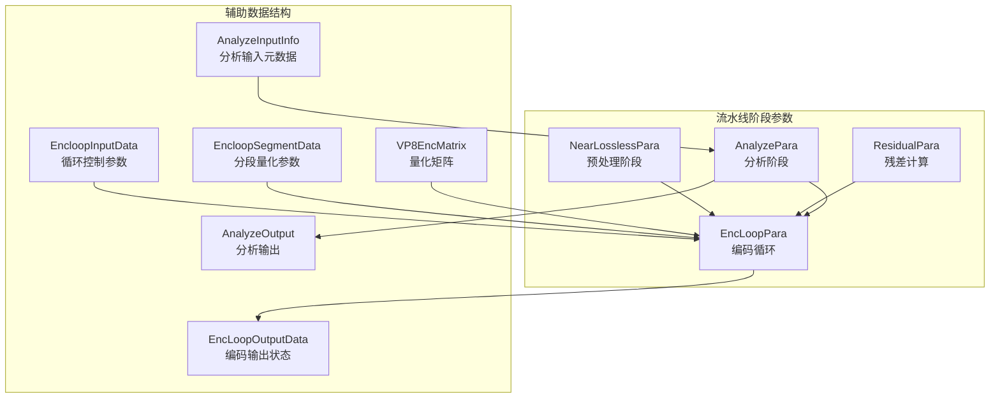
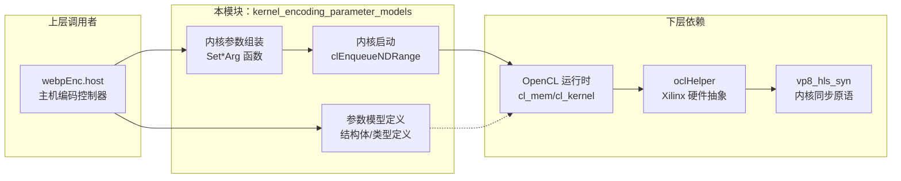
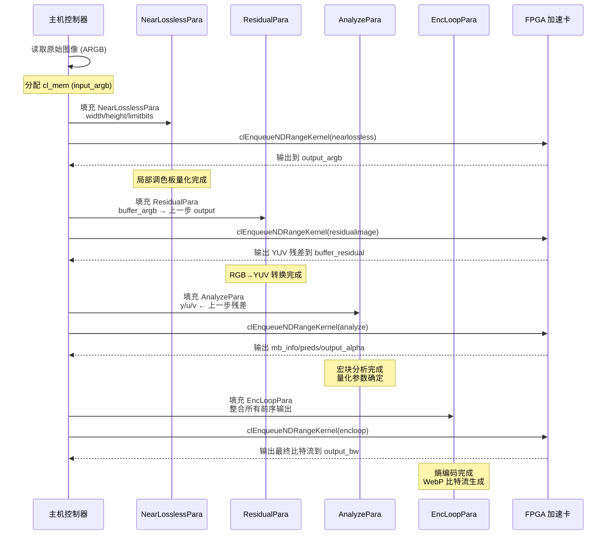

# kernel_encoding_parameter_models 技术深度解析

## 一句话概括

本模块是 WebP 编码器 FPGA 加速方案中**主机端与内核设备之间的参数契约层**——它定义了 OpenCL 内核所需的全部数据结构，将高层编码算法参数转换为硬件加速器可理解的内存布局，同时管理着 Host-Device 之间复杂的内存映射和生命周期协调。

---

## 一、问题空间：为什么需要这个模块？

### 1.1 WebP 编码的异构计算困境

WebP 编码是一个计算密集型的多阶段流水线，包含：
- **Near-Lossless 预处理**：局部调色板量化
- **残差计算**：RGB 到 YUV 转换及差分编码
- **分析阶段 (Analyze)**：宏块信息生成、预测模式选择
- **编码循环 (EncLoop)**：DCT、量化、熵编码、比特流生成

在纯软件实现中，这些阶段共享内存，通过函数调用直接传递指针。但在 **FPGA 异构加速** 场景下，出现了根本性的**阻抗不匹配**：

| 软件视角 | 硬件加速器视角 |
|---------|--------------|
| 虚拟内存指针 (`uint8_t*`) | 物理设备缓冲区 (`cl_mem`) |
| 按需分配/释放 | 需要预分配固定大小的设备内存 |
| 结构体自然对齐 | 需要严格的内存布局以匹配硬件总线宽度 |
| 单线程顺序执行 | 多内核并行，需要显式同步点 |

### 1.2 本模块的解决策略

`kernel_encoding_parameter_models` 模块通过以下设计解决上述困境：

1. **双世界映射**：为每个内核定义参数结构体，同时包含 `cl_mem`（设备侧）和 `uint8_t*`（主机侧）成员，实现无缝的 Host-Device 数据传输

2. **流水线阶段解耦**：每个编码阶段拥有独立的参数结构（`NearLosslessPara`, `ResidualPara`, `AnalyzePara`, `EncLoopPara`），阶段间通过显式的内存屏障和数据传递点解耦

3. **版本兼容性管理**：通过结构体中的 `No longer used` 注释可见，模块经历了多次内核迭代，新旧版本的数据布局在同一结构体中并存，支持渐进式迁移

---

## 二、核心抽象：心智模型

理解本模块的最佳方式是将其视为**硬件加速流水线的"调音台"**——就像音乐制作中调音台将各种音频信号路由到不同的效果处理器，本模块将编码数据的各个"声部"（Y/U/V通道、宏块信息、预测数据）路由到 FPGA 内核的不同计算单元。

### 2.1 核心抽象层次

```
┌─────────────────────────────────────────────────────────────┐
│                    编码流水线抽象层                           │
│   (WebP 算法逻辑：NearLossless → Residual → Analyze → Loop)  │
└─────────────────────────────────────────────────────────────┘
                              ↓
┌─────────────────────────────────────────────────────────────┐
│              参数模型层 (本模块所在层)                         │
│   (NearLosslessPara, ResidualPara, AnalyzePara, EncLoopPara) │
└─────────────────────────────────────────────────────────────┘
                              ↓
┌─────────────────────────────────────────────────────────────┐
│                    OpenCL 运行时层                          │
│           (cl_mem, clEnqueueNDRangeKernel, clWaitForEvents)   │
└─────────────────────────────────────────────────────────────┘
                              ↓
┌─────────────────────────────────────────────────────────────┐
│                    FPGA 硬件加速层                            │
│              (Xilinx Alveo/Versal 内核实现)                   │
└─────────────────────────────────────────────────────────────┘
```

### 2.2 关键数据流模式

本模块遵循**生产者-消费者队列**模式，每个参数结构体本质上是一个"数据包"，包含：

1. **输入缓冲区引用**（`cl_mem input_*`）：只读，内核从中读取源数据
2. **输出缓冲区引用**（`cl_mem output_*`）：只写，内核写入计算结果
3. **双向缓冲区引用**（`cl_mem y/u/v`）：读写，内核就地更新（如 EncLoop 中的迭代优化）
4. **标量控制参数**：宽度、高度、算法模式等配置

---

## 三、组件深度解析

### 3.1 结构体全景图



### 3.2 核心参数结构体详解

#### **NearLosslessPara** —— 近无损预处理参数

```c
typedef struct NearLosslessPara {
    cl_mem input_argb;    // 输入：原始 ARGB 图像（设备内存）
    cl_mem output_argb;   // 输出：量化后的 ARGB 图像（设备内存）
    cl_int width;         // 图像宽度（像素）
    cl_int height;        // 图像高度（像素）
    cl_int lwidth;        // 处理后的逻辑宽度（含填充）
    cl_int lheight;       // 处理后的逻辑高度（含填充）
    cl_int edgewidth;     // 边缘填充宽度（用于局部调色板溢出保护）
    cl_int limitbits;     // 量化强度限制（比特数，控制质量损失上限）
} NearLosslessPara;
```

**设计意图**：Near-Lossless 阶段通过局部调色板量化减少颜色数量，同时保证失真可控。`limitbits` 是质量控制的关键参数——值越小，允许的颜色差异越小，输出质量越高但压缩率越低。结构体中的 `lwidth/lheight` 和 `edgewidth` 体现了 FPGA 对齐要求（通常需要 16 或 32 字节对齐以匹配 DMA 传输宽度）。

---

#### **ResidualPara** —— 残差计算参数

```c
typedef struct ResidualPara {
    cl_mem buffer_argb;      // 输入：ARGB 图像（可能是 NearLossless 的输出）
    cl_mem buffer_residual;  // 输出：残差数据（YUV 转换后的差分编码结果）
    cl_int width;
    cl_int height;
    cl_int exact;            // 是否使用精确模式（影响舍入行为）
    int group_width;         // 工作组宽度（OpenCL 本地工作大小）
    int group_height;        // 工作组高度（OpenCL 本地工作大小）
    int residual_size;       // 预计算的残差缓冲区大小（字节）
} ResidualPara;
```

**设计意图**：残差计算阶段将 RGB 转换为 YUV 颜色空间并计算预测残差。`exact` 参数控制数值精度——在 FPGA 实现中，浮点运算通常被定点化，exact=1 要求更高的精度（可能使用更多 DSP 资源）。`group_width/group_height` 反映了 OpenCL 内核的并行粒度，需要根据 FPGA 计算单元数量调优以最大化吞吐量。

---

#### **AnalyzePara** —— 分析阶段参数

```c
typedef struct AnalyzePara {
    cl_mem mb_info;        // 输出：宏块信息（量化参数、分区决策等）
    cl_mem preds;          // 输出：预测模式选择结果
    cl_mem y;              // 输入：Y 通道数据
    cl_mem u;              // 输入：U 通道数据
    cl_mem v;              // 输入：V 通道数据
    cl_mem output_data;    // 输出：分析结果摘要
    cl_mem output_alpha;   // 输出：Y 通道的 alpha 量化参数
    cl_mem output_uvalpha; // 输出：UV 通道的 alpha 量化参数
    cl_mem alphas;         // 输入/输出：alpha 参数历史（用于自适应量化）
    cl_int method;         // 分析方法选择（0=快速, 1=高质量）
} AnalyzePara;
```

**设计意图**：分析阶段是 WebP 编码的"大脑"，决定每个宏块的量化强度、预测模式和分区策略。`method` 参数控制复杂度权衡——method=0 使用启发式快速决策（适合实时场景），method=1 执行更彻底的率失真优化（RDO，质量更高但计算更密集）。输出中的 `alpha` 相关字段是自适应量化的关键——alpha 值越大，该宏块的量化越精细，保存更多细节。

**与 AnalyzeInputInfo 的协作**：
`AnalyzeInputInfo` 提供了分析阶段需要的元数据（步长、缓冲区大小等），与 `AnalyzePara` 形成"配置-数据"分离：
- `AnalyzeInputInfo`：静态配置（图像维度、步长计算）
- `AnalyzePara`：动态数据引用（实际的 GPU 缓冲区指针）

---

#### **EncLoopPara** —— 编码循环参数（最复杂的结构体）

```c
typedef struct EncLoopPara {
    // === 输入/输出图像数据 ===
    cl_mem input;
    cl_mem y;       // input/output width * height
    cl_mem u;       // input/output (width + 1) / 2 * (height + 1) / 2
    cl_mem v;       // input/output (width + 1) / 2 * (height + 1) / 2
    
    // === 已废弃的传统缓冲区（保留用于兼容性）===
    cl_mem mb_info;      // No longer used
    cl_mem preds;        // No longer used
    cl_mem nz;           // No longer used
    cl_mem y_top;        // No longer used
    cl_mem uv_top;       // No longer used
    cl_mem quant_matrix; // No longer used
    cl_mem coeffs;       // No longer used
    cl_mem stats;        // No longer used
    cl_mem level_cost;   // No longer used
    cl_mem segment;      // No longer used
    cl_mem bw_buf;       // No longer used
    cl_mem sse;          // No longer used
    cl_mem block_count;  // No longer used
    cl_mem extra_info;   // No longer used
    cl_mem max_edge;     // No longer used
    cl_mem bit_count;    // No longer used
    cl_mem sse_count;    // No longer used
    cl_mem output_data;       // No longer used
    cl_mem output_tokens;     // No longer used
    
    // === 新内核架构的缓冲区（当前活跃）===
    cl_mem output;        // Output of new kernel-1, used by kernel-2
    cl_mem output_prob;   // Output of new kernel-1, prob table for kernel-2, enc->prob_.coeff_
    cl_mem output_bw;     // Output of kernel-2, used for AC
    cl_mem output_ret;    // Output of kernel-2, Intra-prediction return from kernel-1 (in pout_level)
    cl_mem output_pred;   // Output of kernel-2, Intra-prediction return from kernel-1 (in pout_level)
    
    // === CPU 端指针（用于数据传输）===
    uint8_t* inputcpu;
    uint8_t* ycpu;
    uint8_t* ucpu;
    uint8_t* vcpu;
    uint8_t* probcpu;
    uint8_t* predcpu;
    uint8_t* bwcpu;
    uint8_t* retcpu;
    
    // === 子采样缓冲区 ===
    cl_mem ysub;
    cl_mem usub;
    cl_mem vsub;
} EncLoopPara;
```

**设计意图的深度解读**：

`EncLoopPara` 是本模块最复杂的结构体，其设计反映了**FPGA 加速 WebP 编码的演进历史**。

**三层架构的历史痕迹**：

1. **废弃层（No longer used）**：早期内核版本使用分散的缓冲区（`mb_info`, `preds`, `nz`, `quant_matrix` 等），每个功能模块拥有独立的输入输出。这种设计导致内核间数据传输频繁，PCIe 带宽成为瓶颈。

2. **当前活跃层（new kernel-1/kernel-2）**：新的双内核架构将编码循环拆分为两个阶段：
   - **Kernel-1**：执行帧内预测 (Intra-prediction)、模式选择、概率表生成
   - **Kernel-2**：执行量化、AC 编码、比特流输出
   
   通过 `output_prob` 传递概率表，`output_bw` 传递编码后的比特流，两个内核之间通过设备内存直接交换数据，避免 PCIe 往返。

3. **CPU 映射层（`*cpu` 指针）**：
   每个 `cl_mem` 设备缓冲区都有对应的 `uint8_t*` 主机指针（`inputcpu`, `ycpu`, `probcpu` 等）。这是 OpenCL 内存映射的标准模式：
   - 主机通过 `clEnqueueMapBuffer` 获得可写的 CPU 指针
   - 写入数据后 `clEnqueueUnmapMemObject` 同步到设备
   - 内核执行后反向操作读取结果

**内存所有权模型**：

```
主机端 (CPU)                      设备端 (FPGA)
┌─────────────────┐              ┌─────────────────┐
│  uint8_t* ycpu  │ ──映射────→  │   cl_mem y      │
│  (主机虚拟内存)   │              │  (设备物理内存)  │
└─────────────────┘              └────────┬────────┘
                                          │
                                          ↓
                                ┌─────────────────┐
                                │   OpenCL 内核    │
                                │  (VP8 编码循环)  │
                                └─────────────────┘
```

**关键观察**：
- `ycpu` 和 `y` 指向**同一份数据的两个视图**——修改 `ycpu` 后必须解除映射才能在 `y` 中可见
- `ysub`（以及 `usub`, `vsub`）是子采样缓冲区，用于低分辨率快速预览或分层编码

---

### 3.5 辅助结构体

#### **EncloopInputData** —— 编码循环控制参数

```c
typedef struct EncloopInputData {
    cl_int width;
    cl_int height;
    cl_int filter_sharpness;     // 去块滤波器锐度
    cl_int show_compressed;        // 是否输出压缩统计
    cl_int extra_info_type;        // 附加信息类型（用于调试）
    cl_int stats_add;              // 是否累积统计信息
    cl_int simple;                 // 是否使用简化模式（快速编码）
    cl_int num_parts;              // 比特流分区数
    cl_int max_i4_header_bits;     // I4 模式的最大头比特数
    cl_int lf_stats_status;        // 环路滤波器统计状态
    cl_int use_skip_proba;         // 是否使用跳过概率
    cl_int method;                 // 编码方法（0=快速, 1=RDO）
    cl_int rd_opt;                 // 率失真优化级别
} EncloopInputData;
```

**设计意图**：这是一个纯控制结构体，包含影响编码质量/速度权衡的所有开关。`method` 和 `rd_opt` 是最重要的参数——它们决定了内核执行路径：
- `method=0, rd_opt=0`：快速路径，使用预计算表，跳过昂贵的率失真计算
- `method=1, rd_opt=1`：高质量路径，对每个宏块执行完整的 RDO 搜索

#### **EncloopSegmentData** —— 分段量化参数

```c
typedef struct EncloopSegmentData {
    int quant[NUM_MB_SEGMENTS];              // 每个分段的量化步长
    int fstrength[NUM_MB_SEGMENTS];          // 滤波强度
    int max_edge[NUM_MB_SEGMENTS];           // 边缘阈值（用于自适应量化）
    
    // 拉格朗日乘数（率失真优化权重）
    int min_disto[NUM_MB_SEGMENTS];
    int lambda_i16[NUM_MB_SEGMENTS];         // I16 模式的 RDO 权重
    int lambda_i4[NUM_MB_SEGMENTS];          // I4 模式的 RDO 权重
    int lambda_uv[NUM_MB_SEGMENTS];          // UV 分量的 RDO 权重
    int lambda_mode[NUM_MB_SEGMENTS];        // 模式选择的 RDO 权重
    int tlambda[NUM_MB_SEGMENTS];            // 时间域拉格朗日乘数
    
    // Trellis 量化参数（高质量模式）
    int lambda_trellis_i16[NUM_MB_SEGMENTS];
    int lambda_trellis_i4[NUM_MB_SEGMENTS];
    int lambda_trellis_uv[NUM_MB_SEGMENTS];
} EncloopSegmentData;
```

**设计意图**：WebP 支持**宏块分段 (Segmentation)**，允许将图像划分为最多 4 个区域，每个区域应用不同的量化参数。这对于处理图像中的复杂区域（如边缘）和平坦区域（如天空）至关重要。

`lambda_*` 参数是**率失真优化 (RDO)** 的核心——它们将比特率成本和质量损失统一到同一量纲进行权衡。较大的 lambda 值意味着更激进的压缩（更高的量化步长），较小的 lambda 值则保留更多细节。

#### **VP8EncMatrix** —— 量化矩阵

```c
typedef struct VP8EncMatrix {
    uint32_t q_[16];       // 量化步长 (Quantizer steps)
    uint32_t iq_[16];      // 倒数 (Inverse quantizer, fixed point)
    uint32_t bias_[16];    // 舍入偏置 (Rounding bias)
    uint32_t zthresh_[16]; // 零阈值 (Zero threshold)
    uint32_t sharpen_[16]; // 锐化增强 (Frequency boosters)
} VP8EncMatrix;
```

**设计意图**：这是 DCT 系数量化的核心数据结构。WebP（VP8）使用 4x4 DCT，每个频率分量（共 16 个）拥有独立的量化参数。

- `q_`：正向量化步长（编码时使用）
- `iq_`：定点化倒数（解码/反量化时使用，避免除法）
- `bias_`：舍入偏置，控制量化后的数值分布
- `zthresh_`：零阈值，小于此值的系数直接置零（实现稀疏性）
- `sharpen_`：高频增强系数，可在量化前轻微锐化边缘

#### **EncLoopOutputData** —— 编码循环输出状态

```c
typedef struct EncLoopOutputData {
    // 算术编码器状态
    int32_t range;           // 算术编码范围寄存器
    int32_t value;           // 算术编码值寄存器
    int32_t run;             // 游程编码计数器
    int32_t nb_bits;         // 当前比特计数
    int32_t pos;             // 比特流位置
    int32_t max_pos;         // 缓冲区最大位置
    int32_t error;             // 错误码
    int32_t max_i4_header_bits;  // I4 模式头比特限制
    
    // Token 缓冲区管理（分页机制）
    int32_t cur_page_;       // 当前页索引
    int32_t page_count_;     // 总页数
    int32_t left_;           // 当前页剩余 token 数
    int32_t page_size_;      // 每页 token 容量
    int32_t error_;          // 内存分配错误标志
} EncLoopOutputData;
```

**设计意图**：这是编码循环的**完整状态快照**，支持两种关键操作模式：

1. **中断/恢复**：FPGA 编码可能被系统中断（如更高优先级任务），通过保存 `range`/`value` 等寄存器状态，可以在恢复后精确继续编码而不产生比特流错误。

2. **多遍编码**：WebP 支持两次编码遍历——第一遍收集统计信息，第二遍生成最终比特流。`EncLoopOutputData` 可以在两遍之间传递累积状态。

**Token 分页机制**：
编码过程中生成的 token（表示 DCT 系数的中间表示）数量事先未知。模块采用**分页分配策略**：
- 每页固定大小 (`page_size_`)
- 当前页满时分配新页 (`cur_page_++`)
- 支持多页链表（通过 `page_count_` 追踪）

这种设计避免了预分配极大缓冲区的内存浪费，同时支持无界 token 流（在合理范围内）。

---

## 四、依赖关系与数据流

### 4.1 模块在架构中的位置



### 4.2 端到端数据流：一帧图像的编码旅程



### 4.3 关键依赖模块说明

| 依赖模块 | 关系类型 | 用途说明 |
|---------|---------|---------|
| `oclHelper` | 强依赖 | Xilinx 提供的 OpenCL 封装库，提供 `cl_mem` 管理、内核启动、事件同步等基础能力。本模块的参数结构体大量使用 `cl_mem` 类型，直接依赖 oclHelper 的内存分配器。 |
| `vp8_hls_syn` | 强依赖 | VP8 编码器的高层次综合 (HLS) 同步原语，定义了 FPGA 内核与主机之间的握手协议。本模块的参数结构体布局必须与 HLS 生成的内核接口严格对齐。 |
| `webp/types` | 弱依赖 | WebP 基础类型定义（如 `cl_int` 的别名），提供跨平台可移植性。 |
| `dec/common` | 弱依赖 | 解码器共用定义，可能包含一些 VP8 比特流格式的常量。 |
| `xf_utils_sw/logger` | 工具依赖 | Xilinx 日志工具，用于调试输出。 |

---

## 五、设计决策与权衡

### 5.1 为什么使用平面结构体而非面向对象设计？

**观察**：本模块完全使用 C 风格的 `typedef struct`，没有类、继承或虚函数。

**权衡分析**：

| 方案 | 优点 | 缺点 | 本模块的选择 |
|-----|------|------|------------|
| C 结构体 (当前) | 内存布局可预测（与硬件对齐）、可直接传递给 OpenCL、无 ABI 兼容性问题 | 无封装、无类型安全 | ✅ 选中——硬件交互需要精确内存控制 |
| C++ 类 | 可封装、RAII 管理资源 | 虚表指针破坏 OpenCL 对齐要求、名称修饰导致跨语言调用困难 | ❌ 排除——与 OpenCL C 内核不兼容 |
| 序列化框架 | 版本兼容、跨平台 | 运行时开销、增加依赖 | ❌ 排除——FPGA 场景要求零拷贝 |

**核心洞察**：当与 FPGA 硬件交互时，**内存布局即是协议**。C 结构体的内存布局是确定性的（按声明顺序，遵循平台对齐规则），这使得主机结构体可以直接作为内核参数传递，而无需序列化/反序列化开销。

### 5.2 大量 "No longer used" 字段的遗留问题

**观察**：`EncLoopPara` 中有超过 30 个标记为 `No longer used` 的 `cl_mem` 字段。

**历史背景**：

这反映了 WebP FPGA 加速方案的三代架构演进：

| 代际 | 时间 | 架构特点 | 遗留字段示例 |
|-----|------|---------|------------|
| Gen 1 | 早期 | 细粒度分离内核，每个功能独立（mb_info, preds, nz 等分别计算） | `mb_info`, `preds`, `nz`, `y_top`, `uv_top` |
| Gen 2 | 中期 | 引入中间表示 (IR)，`coeffs`, `stats`, `level_cost` 作为分析-编码接口 | `coeffs`, `stats`, `level_cost`, `quant_matrix` |
| Gen 3 | 当前 | 双内核融合架构，Kernel-1 输出 `output_prob`，Kernel-2 消费并直接输出比特流 | `output`, `output_prob`, `output_bw`（当前活跃） |

**设计权衡**：

为什么不删除这些字段？

1. **ABI 兼容性**：结构体大小和字段偏移量是主机-设备协议的一部分。删除字段会改变后续字段的偏移，导致旧版 FPGA 比特流无法解析新主机传递的参数。

2. **调试能力**：保留字段名作为注释，帮助开发者理解当前架构演进了哪些功能。

3. **渐进式迁移**：某些部署场景可能需要回退到旧版内核（如发现新版硬件 bug），保留字段支持运行时切换。

**内存开销**：每个未使用的 `cl_mem` 是 8 字节（64 位指针），30 个字段约 240 字节。考虑到 `EncLoopPara` 总大小通常以 KB 计，这是可接受的遗留成本。

### 5.3 宏定义与魔数的工程实践

**观察**：头文件顶部定义了大量宏（`GRX_SIZE`, `GRX_SIZE_RESIDUAL`, `ANALYZE_GRX_SIZE` 等）。

**关键宏定义**：

```c
// NearLossless 内核的工作组配置
#define GRX_SIZE 256        // 全局 X 维度工作项数
#define GRY_SIZE 16         // 全局 Y 维度工作项数

// 4K 图像的向量化配置
#define VECTOR_GRX_SIZE 128     // 标准向量化宽度
#define VECTOR_GRX_SIZE_4K 256   // 4K 图像的扩展宽度
#define IMAGE_4K 2048             // 4K 阈值定义（实际为 2048，可能指半宽）

// Residual 内核的工作组配置
#define GRX_SIZE_RESIDUAL 256
#define GRY_SIZE_RESIDUAL 16

// Analyze 和 EncLoop 的固定限制（仅支持 4K 以下图像）
#define ANALYZE_GRX_SIZE 240
#define ENCLOOP_GRX_SIZE 135
```

**设计原理**：

这些宏定义反映了 **FPGA 内核的硬件约束和性能调优**。

1. **工作组大小与计算单元映射**：
   - `GRX_SIZE=256` 表示内核启动 256 个并行工作项
   - 在 Xilinx FPGA 上，这通常映射到 256 个 DSP 切片或 LUT 计算单元
   - 数值选择为 2 的幂次，便于硬件地址生成和流水线调度

2. **4K 图像的特殊处理**：
   - `VECTOR_GRX_SIZE_4K=256` 是标准配置的两倍
   - 4K 图像（3840x2160）的像素数是 1080p 的四倍，需要更多并行度来维持实时帧率
   - `IMAGE_4K=2048` 可能是半宽定义（1920），用于触发向量化路径的条件判断

3. **Analyze/EncLoop 的保守限制**：
   - `ANALYZE_GRX_SIZE=240` 和 `ENCLOOP_GRX_SIZE=135` 小于 NearLossless/Residual 的 256
   - 这是因为 Analyze 和 EncLoop 的计算更复杂（涉及分支决策、概率更新），每个工作项占用更多 FPGA 资源
   - 限制为 240/135 是为了确保综合后的内核能在目标 FPGA（如 Alveo U250）上物理布局布线成功

**配置化 vs 硬编码的权衡**：

为什么不将这些值设为运行时配置？

- **编译时优化**：OpenCL 内核代码通常包含 `__attribute__((reqd_work_group_size(256, 1, 1)))` 等编译指令，工作组大小是内核二进制的一部分
- **资源预留**：FPGA 综合时需要知道确切的并行度来分配 DSP 和 BRAM 资源
- **时序收敛**：较大的设计更难满足时序约束，固定保守值确保稳定性

如果需要支持不同分辨率，典型的工程实践是：**编译多个内核变体**（如 `encloop_1080p.xclbin`, `encloop_4k.xclbin`），运行时根据输入分辨率选择加载。

---

## 六、使用指南与最佳实践

### 6.1 典型使用模式

```c
// 步骤 1: 初始化 OpenCL 环境和加载内核二进制
CreateKernel("/path/to/webp_enc.xclbin");

// 步骤 2: 分配设备内存并创建映射
CreateDeviceBuffers(image_size);
// 内部实现会调用 clCreateBuffer + clEnqueueMapBuffer

// 步骤 3: 填充 NearLossless 参数
NearLosslessPara nlp;
nlp.input_argb = g_input_clmem;   // 从设备内存池获取
nlp.output_argb = g_nearlossless_out;
nlp.width = image_width;
nlp.height = image_height;
nlp.limitbits = 3;  // 允许的最大颜色偏差（0=无损，10=高压缩）

// 通过全局变量传递（这是本模块的接口约定）
nearpara = nlp;
SetNearlosslessArg(image_width * image_height);

// 步骤 4: 启动内核
clEnqueueNDRangeKernel(
    queue, nearlossless.kernel,
    2,                    // 2D 工作组
    NULL,                 // 全局偏移
    global_size,          // {GRX_SIZE, GRY_SIZE}
    local_size,           // NULL 或 {16, 16}
    0, NULL, &event
);
clWaitForEvents(1, &event);

// 步骤 5: 链式传递输出到下一阶段
ResidualPara rp;
rp.buffer_argb = nearpara.output_argb;  // 直接消费上阶段输出
// ... 继续处理
```

### 6.2 关键配置参数指南

| 参数 | 结构体 | 推荐值 | 影响说明 |
|-----|--------|--------|---------|
| `limitbits` | `NearLosslessPara` | 0-4 | 0=完全无损，4=高质量，>6=明显视觉损失 |
| `method` | `AnalyzePara` / `EncloopInputData` | 0/1 | 0=快速（适合实时），1=高质量（适合存档） |
| `exact` | `ResidualPara` | 0/1 | 1=数学精确（可重复），0=更快但可能有舍入差异 |
| `filter_sharpness` | `EncloopInputData` | 0-7 | 去块滤波器强度，0=最强滤波（最平滑），7=最弱（最锐利） |

### 6.3 常见陷阱与避坑指南

#### **陷阱 1：cl_mem 与 CPU 指针的混用混淆**

```c
// ❌ 错误：直接解引用 cl_mem
NearLosslessPara para;
para.input_argb = clCreateBuffer(...);
// 错误！cl_mem 是 opaque handle，不是可解引用指针
memset(para.input_argb, 0, size);  // 崩溃！

// ✅ 正确：使用内存映射
cl_mem buf = clCreateBuffer(context, CL_MEM_READ_WRITE, size, NULL, NULL);
void* mapped = clEnqueueMapBuffer(queue, buf, CL_TRUE, CL_MAP_WRITE, 
                                   0, size, 0, NULL, NULL, NULL);
memset(mapped, 0, size);  // 正确：操作主机可访问的映射内存
clEnqueueUnmapMemObject(queue, buf, mapped, 0, NULL, NULL);
```

**根本原因**：`cl_mem` 是 OpenCL 运行时定义的**不透明句柄**（通常是 64 位整数或指针），代表设备端的内存分配。它不能被主机 CPU 直接解引用——必须通过 `clEnqueueMapBuffer` 或 `clEnqueueRead/WriteBuffer` 进行数据传输。

#### **陷阱 2：工作组大小与图像尺寸不匹配**

```c
// ❌ 错误：假设图像宽度总是 256 的倍数
size_t global_size[2] = {GRX_SIZE, GRY_SIZE};  // 256 x 16
clEnqueueNDRangeKernel(queue, kernel, 2, NULL, 
                       global_size, NULL, 0, NULL, NULL);
// 如果图像宽度为 300，只有 256 列被处理！

// ✅ 正确：向上取整到工作组倍数
uint32_t RoundUp(uint32_t value, uint32_t multiple) {
    return ((value + multiple - 1) / multiple) * multiple;
}
size_t global_size[2] = {
    RoundUp(image_width, LOCAL_WORK_SIZE_X),
    RoundUp(image_height, LOCAL_WORK_SIZE_Y)
};
```

**根本原因**：OpenCL 内核在**全局工作项网格**上执行，每个工作项处理一个或多个像素。如果图像尺寸不是工作组大小的整数倍，边界像素将不会被处理。**`RoundUp` 函数是本模块提供的核心工具函数**，确保全局尺寸向上取整到工作组倍数，同时通过边界检查防止越界访问。

#### **陷阱 3：内存对齐与填充要求**

```c
// 问题：FPGA 通常需要 64 字节对齐的 DMA 传输
cl_mem buf = clCreateBuffer(context, CL_MEM_READ_WRITE, 
                            image_width * image_height * 4,  // RGBA
                            NULL, NULL);
// 如果 image_width 不是 16 的倍数，DMA 效率下降或出错

// 解决：使用填充后的逻辑尺寸
cl_int lwidth = ((width + 15) / 16) * 16;  // 向上取整到 16
cl_int lheight = ((height + 15) / 16) * 16;
cl_mem buf = clCreateBuffer(context, CL_MEM_READ_WRITE,
                            lwidth * lheight * 4, NULL, NULL);
```

**根本原因**：FPGA 加速器通常通过 **DMA (直接内存访问)** 引擎与主机内存交换数据。DMA 引擎有严格的**对齐要求**——起始地址必须是 64 字节（或 4096 字节）的倍数，传输长度必须是突发长度（通常为 64 字节）的倍数。`NearLosslessPara` 结构体中的 `lwidth`/`lheight` 和 `edgewidth` 字段正是为了解决这一硬件约束而设计。

---

## 七、模块边界与演进方向

### 7.1 当前架构的局限性

1. **全局变量依赖**：模块使用了大量全局变量（`nearpara`, `residualpara`, `enclooppara` 等），这限制了并发编码多帧的能力。

2. **硬编码的工作组大小**：宏定义中的 `GRX_SIZE` 等值在编译期固定，无法根据运行时检测到的 FPGA 型号动态调整。

3. **缺乏版本控制**：新旧内核字段共存但没有显式的版本号或能力查询机制，依赖开发者阅读注释识别有效字段。

### 7.2 演进建议

对于新贡献者，如果计划扩展本模块：

1. **引入显式版本字段**：在参数结构体头部添加 `uint32_t version`，允许内核根据版本号解析不同布局。

2. **封装为 C++ RAII 类**：在不改变底层内存布局的前提下，提供 C++ 包装类管理 `cl_mem` 生命周期：
   ```cpp
   class EncLoopParameters {
       cl_mem output_prob_ = nullptr;
   public:
       ~EncLoopParameters() { if (output_prob_) clReleaseMemObject(output_prob_); }
       // 禁止拷贝，允许移动
       EncLoopParameters(const EncLoopParameters&) = delete;
       EncLoopParameters(EncLoopParameters&& other) noexcept { /* 转移所有权 */ }
   };
   ```

3. **动态能力查询**：添加 `QueryCapabilities()` 函数，在运行时检测 FPGA 型号并返回推荐的工作组大小和内存对齐要求。

---

## 八、总结

`kernel_encoding_parameter_models` 模块是 WebP FPGA 加速方案中**承上启下的关键契约层**。它通过精心设计的 C 结构体，在主机软件与硬件加速器之间架起了桥梁，解决了异构计算中的内存布局、数据对齐和版本兼容等核心挑战。

对于新加入团队的工程师，理解本模块的关键在于：

1. **认识到内存布局即协议**——这些结构体的字段顺序和对齐方式直接对应 FPGA 内核的硬件接口，任何修改都需要同步更新内核 HLS 代码。

2. **理解 Host-Device 双世界模型**——`cl_mem` 和 `uint8_t*` 的配对设计是实现零拷贝传输的基础，必须正确管理映射/解映射生命周期。

3. **警惕演进中的技术债**——大量的 `No longer used` 字段提示着架构的迭代历史，新功能开发应优先考虑向前兼容的设计（如版本号、能力查询）。

通过深入理解这些设计决策背后的工程权衡，新贡献者将能够更自信地在这个复杂而精密的异构计算系统中进行开发、调试和优化。
