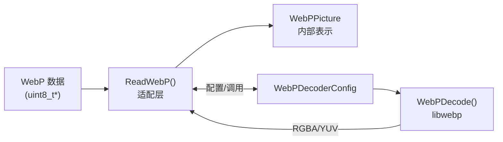

# webp_decode_picture_types 模块技术深度解析

## 开篇：这个模块解决什么问题？

想象你正在构建一个**图像转码流水线**——把各种格式的输入图片（PNG、JPEG、WebP、TIFF 等）统一转换成 WebP 格式输出。这个流水线的核心架构是：先解码输入图片为统一的内部表示，然后再编码为 WebP。

**`webp_decode_picture_types` 模块就是这个流水线中的"WebP 解码适配器"。**

它解决的具体问题是：**如何把外部的 WebP 图像数据桥接到内部编码器所需的 `WebPPicture` 格式**。这背后隐藏着几个复杂点：

1. **颜色空间迷宫**：WebP 内部可以是 YUV 或 ARGB 格式，而 `WebPPicture` 也有自己的颜色配置偏好。
2. **Alpha 通道的取舍**：WebP 可能带透明度，但下游编码器可能不需要，这会影响内存布局。
3. **元数据的"黑洞"**：目前模块**明确不处理** ICC/EXIF/XMP（代码里有 TODO 和警告），但接口为未来预留了可能性。
4. **资源的生命周期**：解码涉及分配临时缓冲区，谁负责分配？谁负责释放？

**核心设计洞察**：这个模块不是"WebP 解码器"——真正的解码逻辑在底层的 libwebp 库中。这个模块是**集成层（Integration Layer）**，它的职责是**将 libwebp 的输出适配到 FPGA 加速编码流水线所需的内部格式**。

---

## 架构与心智模型

### 模块在系统中的位置



### 心智模型：格式转换阀

想象一条工业流水线，不同站点的机器使用不同的"托盘"规格。WebP 解码器站点使用 libwebp 定义的"托盘"（`WebPDecBuffer`），而下游的 WebP 编码器站点使用另一种"托盘"（`WebPPicture`）。**本模块就是这两个站点之间的"转换阀"**——它接收 libwebp 的托盘，把内容转移（Import）到 `WebPPicture` 托盘中，然后释放原始托盘。

---

## 核心组件深度解析

### `ReadWebP` 函数

```c
int ReadWebP(const uint8_t* const data,
             size_t data_size,
             struct WebPPicture* const pic,
             int keep_alpha,
             struct Metadata* const metadata);
```

#### 参数与所有权模型

| 参数 | 方向 | 所有权 | 说明 |
|------|------|--------|------|
| `data` | 输入 | **借用** | 调用者提供只读视图，函数执行期间必须有效。函数不拥有或释放。 |
| `pic` | 输出 | **接管** | 调用者分配结构，函数通过 `WebPPictureImportRGBA/RGB` 接管内部像素数据所有权。调用者后续必须用 `WebPPictureFree` 释放。 |
| `keep_alpha` | 输入 | - | 是否保留 Alpha 通道（若 WebP 有 Alpha） |
| `metadata` | 输入/输出 | **借用** | 预留但未实现，传入非 NULL 会打印警告 |

#### 内存所有权转移机制

核心在于 `WebPPictureImportRGBA/RGB` 步骤：

1. **导入前**：`output_buffer->u.RGBA.rgba` 指向 libwebp 分配的像素内存。
2. **导入时**：`WebPPictureImportRGBA` 把像素数据复制/转移到 `pic` 的内部缓冲区。
3. **导入后**：`pic` 拥有独立像素缓冲区，`output_buffer` 由 `WebPFreeDecBuffer` 清理。

这是**防御性拷贝（Defensive Copying）**的典型模式，确保 `WebPPicture` 在后续变换中保持稳定。

#### 执行流程

```
1. WebPInitDecoderConfig(&config)           → 初始化配置
2. 【预留】metadata 提取（当前打印警告）      → 未实现
3. WebPGetFeatures(data, size, &config.input) → 解析比特流头部，获取 has_alpha
4. 计算 colorspace = (keep_alpha && has_alpha) ? MODE_RGBA : MODE_RGB
5. ExUtilDecodeWebP(...)                      → 执行解码到 output_buffer
6. 若解码成功：
   - 设置 pic->width/height
   - WebPPictureImportRGBA/RGB(pic, rgba, stride) → 转移像素所有权
7. 【统一清理】WebPFreeDecBuffer(output_buffer) → 释放临时缓冲区
8. 返回 ok (0 或 1)
```

---

## 错误处理策略

### 错误传播路径

| 检测点 | 错误类型 | 处理方式 | 返回值 |
|--------|----------|----------|--------|
| WebPInitDecoderConfig | 库版本不匹配 | 打印错误，立即返回 | 0 |
| WebPGetFeatures | 比特流解析失败 | 打印错误，立即返回 | 0 |
| ExUtilDecodeWebP | 解码失败 | 设置 status，继续到清理 | 0 |
| WebPPictureImport* | 内存分配失败 | ok=0，继续到清理 | 0 |

### 设计决策

**为什么选择返回码而非异常？**
1. C 语言兼容性（`extern "C"` 接口）
2. 跨语言绑定稳定性（Python/Java 通过 C 调用）
3. 单一出口的资源清理（`WebPFreeDecBuffer` 在 `return` 前统一调用）

---

## 设计决策与权衡

### 1. RGB/RGBA 强制转换（非 YUV）

**决策**：强制使用 `MODE_RGBA`/`MODE_RGB`，而非 `MODE_YUVA`/`MODE_YUV`。

**权衡**：
- **代价**：额外的颜色空间转换（如果输入是 YUV 编码的有损 WebP）
- **收益**：简化与 `WebPPicture` 的集成（`WebPPictureImportRGBA/RGB` 只接受 RGB 数据）
- **技术债**：代码注释中明确 TODO: 未来根据 `pic->use_argb` 优化使用 YUV 路径

### 2. 元数据提取的显式禁用

**决策**：`metadata` 参数被显式检查，非 NULL 时打印警告而非静默忽略。

**权衡**：
- **收益**：明确的契约——调用者知道元数据不会被提取，不会依赖未实现的功能
- **代价**：stderr 输出可能污染日志（但错误流通常与标准流分离）
- **扩展性**：为未来元数据提取预留了接口，无需 API 变更

### 3. 单一出口的资源清理

**决策**：所有路径（成功/失败）都经过统一的 `WebPFreeDecBuffer` 调用。

**权衡**：
- **收益**：防止泄漏，代码更易维护（清理逻辑集中在一处）
- **代价**：成功路径上可能多一次"空释放"（但 `WebPFreeDecBuffer` 内部会处理已转移的缓冲区）

---

## 依赖关系

### 本模块调用

| 依赖 | 来源 | 用途 |
|------|------|------|
| `WebPInitDecoderConfig` | libwebp | 初始化解码器配置 |
| `WebPGetFeatures` | libwebp | 解析 WebP 比特流特性 |
| `ExUtilDecodeWebP` | libwebp 示例工具 | 执行解码（封装了 `WebPDecode`） |
| `WebPPictureImportRGBA`/`RGB` | libwebp | 将像素数据转移到 WebPPicture |
| `WebPFreeDecBuffer` | libwebp | 释放解码缓冲区 |
| `ExUtilPrintWebPError` | libwebp 示例工具 | 格式化打印错误信息 |

### 调用本模块

本模块作为 **WebP 编码器主机流水线** 的解码后端，被上层模块调用：

- **父模块**：[webp_encoder_host_pipeline](codec-L2-demos-webpEnc-host-webp_encoder_host_pipeline.md) —— WebP 编码器的主机端流水线编排
- **同级模块**：
  - [png_decode_backend_types](codec-L2-demos-webpEnc-host-other_image_decode_backends-png_decode_backend_types.md) —— PNG 解码后端
  - [tiff_decode_backend_types](codec-L2-demos-webpEnc-host-other_image_decode_backends-tiff_decode_backend_types.md) —— TIFF 解码后端
  - [wic_decode_backend_types](codec-L2-demos-webpEnc-host-other_image_decode_backends-wic_decode_backend_types.md) —— Windows Imaging Component 解码后端

这些模块共同构成**多格式图像解码统一抽象层**，允许 WebP 编码器处理多种输入格式。

---

## 使用示例与最佳实践

### 基本使用模式

```c
#include "webpdec.h"
#include "webp/encode.h"
#include "webp/decode.h"

int decode_webp_file(const char* filename, WebPPicture* out_pic) {
    // 1. 读取文件到内存
    FILE* fp = fopen(filename, "rb");
    if (!fp) return 0;
    
    fseek(fp, 0, SEEK_END);
    size_t size = ftell(fp);
    fseek(fp, 0, SEEK_SET);
    
    uint8_t* data = malloc(size);
    if (!data || fread(data, 1, size, fp) != size) {
        free(data);
        fclose(fp);
        return 0;
    }
    fclose(fp);
    
    // 2. 初始化 WebPPicture（重要！）
    if (!WebPPictureInit(out_pic)) {
        free(data);
        return 0;
    }
    
    // 3. 调用 ReadWebP 进行解码
    // keep_alpha = 1 表示保留 Alpha 通道
    int ok = ReadWebP(data, size, out_pic, 1, NULL);
    
    // 4. 释放输入数据（pic 已经拥有自己的副本）
    free(data);
    
    if (!ok) {
        // 解码失败，清理 pic
        WebPPictureFree(out_pic);
        return 0;
    }
    
    // 成功！out_pic 现在包含解码后的图像
    // 调用者负责最终调用 WebPPictureFree(out_pic)
    return 1;
}
```

### 关键注意事项

```c
// ❌ 错误：忘记初始化 WebPPicture
WebPPicture pic;  // 未初始化，内容未定义
ReadWebP(data, size, &pic, 1, NULL);  // 危险！

// ✅ 正确：总是先初始化
WebPPicture pic;
if (!WebPPictureInit(&pic)) { /* 错误处理 */ }
ReadWebP(data, size, &pic, 1, NULL);

// ❌ 错误：重复使用 WebPPicture 而不清理
WebPPicture pic;
WebPPictureInit(&pic);
ReadWebP(data1, size1, &pic, 1, NULL);  // 第一次解码
// ... 使用 pic ...
ReadWebP(data2, size2, &pic, 1, NULL);  // ❌ 内存泄漏！第一次的像素没释放

// ✅ 正确：每次重新初始化或显式释放
WebPPicture pic;
WebPPictureInit(&pic);
ReadWebP(data1, size1, &pic, 1, NULL);
WebPPictureFree(&pic);  // 显式释放
WebPPictureInit(&pic);  // 重新初始化
ReadWebP(data2, size2, &pic, 1, NULL);
```

---

## 边缘情况与陷阱

### 1. 大图像内存分配失败

**场景**：解码超高分辨率 WebP（如 16384x16384）时，`WebPPictureImportRGBA` 内部 `malloc` 可能失败。

**表现**：`ReadWebP` 返回 0，但 `stderr` 可能没有任何输出（失败发生在导入阶段，错误未被打印）。

**应对**：调用者应检查返回值，而不是依赖 stderr。

### 2. 动图（Animated WebP）

**陷阱**：`ReadWebP` 只解码第一帧。如果输入是动图，调用者可能期望得到所有帧，但实际只得到第一帧的静态图像。

**现状**：代码中没有对 `has_animation` 的检查或警告。

### 3. keep_alpha 与 use_argb 的交互

**复杂场景**：调用者可能设置 `pic->use_argb = 1` 期望 ARGB 格式，但 `ReadWebP` 强制使用 RGBA 输出，然后通过 `WebPPictureImportRGBA` 导入。libwebp 的导入函数内部可能根据 `use_argb` 进行格式转换，但这是隐式行为。

**潜在问题**：如果 `use_argb` 和实际的 RGBA 数据不匹配，可能导致颜色通道错位。

### 4. 元数据参数的"静默失败"

**陷阱**：调用者传入 `metadata != NULL` 期望获取元数据，但函数只打印警告到 stderr，不返回错误，也不填充数据。调用者可能误以为获取成功。

**当前行为**：`fprintf(stderr, "Warning: metadata extraction from WebP is unsupported.\n")`。

### 5. 线程安全与重入

**现状**：`ReadWebP` 本身是无状态的，理论上线程安全。但：
- `stderr` 的并发写入可能产生交错输出。
- 如果多个线程使用同一个 `WebPPicture`（错误用法），会有数据竞争。

**建议**：每个线程使用独立的 `WebPPicture` 实例。

---

## 性能考量

### 热点分析

| 操作 | 复杂度 | 性能影响 | 优化建议 |
|------|--------|----------|----------|
| `WebPGetFeatures` | O(1) 头部解析 | 可忽略 | - |
| `ExUtilDecodeWebP` | O(width * height) | **主要热点** | 使用硬件加速的 libwebp |
| `WebPPictureImportRGBA` | O(width * height) 内存拷贝 | **次要热点** | 零拷贝优化需修改架构 |
| `WebPFreeDecBuffer` | O(1) | 可忽略 | - |

### 内存分配模式

```
单次解码的内存分配链：
1. libwebp 内部：分配解码输出缓冲区（width * height * 4 bytes，RGBA）
2. WebPPictureImportRGBA：分配 WebPPicture 内部缓冲区（同样大小，复制）
3. WebPFreeDecBuffer：释放 libwebp 的缓冲区

净结果：峰值内存 ≈ 2 * width * height * 4 bytes
最终内存：width * height * 4 bytes（在 WebPPicture 中）
```

**潜在的零拷贝优化**：如果 `WebPPicture` 能直接接管 `output_buffer` 的所有权而不复制，可以节省 50% 的内存拷贝。但这需要修改 libwebp 的接口或 `WebPPicture` 的实现。

---

## 设计决策总结

| 决策 | 选择 | 替代方案 | 权衡理由 |
|------|------|----------|----------|
| 颜色空间 | 强制 RGB/RGBA | 根据输入选择 YUV | 简化与 `WebPPicture` 的集成，代价是可能的格式转换开销 |
| 元数据 | 显式禁用（警告） | 静默忽略 / 实现提取 | 明确的契约优于意外的静默失败 |
| 错误处理 | 返回码 + stderr | 异常 / 回调 | C 接口兼容性，跨语言绑定友好 |
| 资源清理 | 单一出口释放 | 多路径各自清理 | 防止泄漏，代码更易维护 |
| Alpha 处理 | 运行时参数 `keep_alpha` | 总是保留 / 总是丢弃 | 灵活性：下游可能不需要 Alpha |

---

## 相关模块参考

- **父模块**：[webp_encoder_host_pipeline](codec-L2-demos-webpEnc-host-webp_encoder_host_pipeline.md) —— WebP 编码器主机流水线编排
- **同级解码后端**：
  - [png_decode_backend_types](codec-L2-demos-webpEnc-host-other_image_decode_backends-png_decode_backend_types.md) —— PNG 解码适配
  - [tiff_decode_backend_types](codec-L2-demos-webpEnc-host-other_image_decode_backends-tiff_decode_backend_types.md) —— TIFF 解码适配
  - [wic_decode_backend_types](codec-L2-demos-webpEnc-host-other_image_decode_backends-wic_decode_backend_types.md) —— Windows Imaging Component 解码适配
