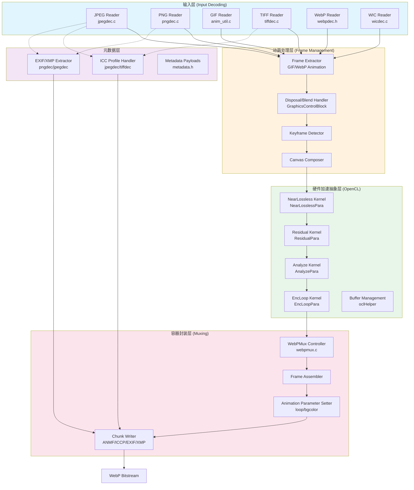

# WebP Encoder Host Pipeline 技术深潜

## 一句话概括

这是一个**硬件加速的 WebP 编码器主机端管道**，它像一条多格式输入的"影像加工流水线"——从 JPEG/PNG/GIF 等多种格式输入，经过 CPU 预处理，最终通过 OpenCL 内核将计算密集型编码任务卸载到 FPGA/加速器硬件上，输出标准的 WebP 图像或动画。

---

## 问题空间：为什么需要这个模块？

### 背景痛点

传统的软件 WebP 编码（如 libwebp）虽然功能完善，但在处理高分辨率图像或批量转换时面临瓶颈：
- **计算密集**：VP8 编码的预测、变换、量化步骤需要大量 SIMD 运算
- **内存带宽限制**：大图像在 CPU 缓存层次间搬运效率低
- **实时性要求**：视频转码、云缩略图服务需要亚秒级延迟

### 设计目标

本模块旨在构建一个**异构计算架构**的 WebP 编码器：
1. **主机端（Host）** 负责 I/O、格式解析、元数据管理、帧调度（本模块的主要职责）
2. **设备端（Device/Kernels）** 通过 OpenCL 在 FPGA/ASIC 上执行像素级并行计算（NearLossless、Residual、Analyze、EncLoop 等阶段）

### 替代方案权衡

| 方案 | 优点 | 缺点 | 未选择原因 |
|------|------|------|-----------|
| 纯软件优化（SIMD） | 可移植性好，部署简单 | 受限于 CPU 功耗和指令集 | 无法满足高吞吐加速器需求 |
| CUDA/GPU 方案 | 生态成熟，适合大批量 | 延迟较高，不适合小图像；功耗大 | FPGA 在确定性延迟和能效比上更优 |
| 专用 ASIC 芯片 | 极致性能 | 灵活性差，算法固化的风险 | 当前阶段需要 FPGA 的可重构性 |

---

## 心智模型：如何理解这个系统？

想象一个**现代化的印刷厂流水线**：

### 类比解释

- **原料仓库（Decoding Backends）**：接收各种格式的"原稿"（JPEG 照片、PNG 图标、GIF 动图），统一解码成内部 RGBA 格式
- **排版车间（Animation & Frame Handling）**：对于动图，负责拆解帧、处理时间轴、计算帧间差异（disposal/blend 方法），生成一序列待编码的静态帧
- **调色与质检（Metadata & Utilities）**：提取 ICC 色彩配置文件、EXIF 元数据，使用秒表监控各环节耗时
- **高速印刷机（Kernel Encoding Pipeline）**：这是核心加速器，通过 OpenCL 内核并行处理：
  - *NearLossless*：近无损预处理，调整像素以减少视觉差异
  - *Residual*：计算残差图像
  - *Analyze*：宏块分析，决定编码模式
  - *EncLoop*：主编码循环，包含预测、变换、量化、熵编码
- **装订封装（Container Muxing）**：将压缩后的帧封装进 WebP 容器，组装动画参数（循环次数、背景色），嵌入 ICC/EXIF 元数据

### 关键抽象概念

| 概念 | 对应代码实体 | 职责 |
|------|-------------|------|
| **DecodedFrame** | `anim_util.h` | 承载一帧解码后的 RGBA 位图，包含持续时间、关键帧标记 |
| **AnimatedImage** | `anim_util.h` | 管理整个动画，持有帧数组、画布尺寸、循环计数、背景色 |
| **OpenCL Parameter Structures** | `create_kernel.h` | 主机与设备间的数据契约，定义每个内核所需的输入输出缓冲区布局 |
| **WebPMux** | `webpmux.c` | WebP 容器格式的"编辑器"，支持添加/删除帧、设置元数据块 |
| **Metadata Payloads** | `metadata.h` | 通用字节缓冲区，用于承载 ICC、EXIF、XMP 等原始数据 |

---

## 架构总览与数据流



### 数据流详解

**阶段 1：输入解码（多格式适配）**
- 输入层实现了**策略模式**：每个解码器（JPEG/PNG/GIF/TIFF/WebP/WIC）统一输出到 `WebPPicture` 或 `DecodedFrame` 结构
- **关键决策**：GIF 和 WebP 动画在输入层就被识别并送入动画处理分支，静态图直接进入编码路径
- **元数据提取**：JPEG 和 TIFF 提取 ICC 色彩配置文件；PNG 和 JPEG 提取 EXIF/XMP；这些元数据沿并行路径流动，最终注入容器

**阶段 2：动画帧管理（状态机）**
- **核心挑战**：GIF 的复杂处置（Disposal）和混合（Blend）方法需要重建每一帧的完整画布状态
- **实现策略**：`GraphicsControlBlock` 解析每帧控制信息，`AnimatedImage` 维护帧数组，`DecodedFrame` 存储重建后的 RGBA 位图
- **关键帧优化**：系统识别关键帧（Key Frame），对于连续帧之间的差异仅编码差异区域，这由硬件内核高效处理

**阶段 3：硬件加速编码（OpenCL 流水线）**
- **分层架构**：主机端通过 `create_kernel.h` 中定义的参数结构（`NearLosslessPara`, `AnalyzePara`, `EncLoopPara` 等）与设备端通信
- **四阶段流水线**：
  1. **NearLossless**：预处理阶段，应用局部调整以减少视觉损失，同时保持高压缩率
  2. **Residual**：计算原始图像与预测图像之间的残差
  3. **Analyze**：宏块级分析，为每个 16x16 宏块选择最佳编码模式（I16x16, I4x4, UV 等）
  4. **EncLoop**：主编码循环，执行实际预测、DCT/HT 变换、量化、熵编码（令牌化）和比特流打包
- **内存管理**：使用 `cl_mem` 缓冲区对象管理主机与设备间的数据传输，支持零拷贝（zero-copy）优化

**阶段 4：容器封装（Muxing）**
- **WebPMux 引擎**：`webpmux.c` 提供容器级别的操作，支持 RIFF 容器规范的所有特性
- **动画组装**：将硬件编码器输出的逐帧比特流组装为 `ANMF` 块，设置循环计数和背景色
- **元数据注入**：将之前提取的 ICC (`ICCP`)、EXIF (`EXIF`)、XMP (`XMP `) 块注入容器
- **合规性**：确保输出符合 WebP 规范，处理字节序、对齐、块大小限制等细节

---

## 关键设计决策与权衡

### 1. 硬件 vs 软件编码的边界划分

**决策**：将最计算密集的编码循环（预测、变换、量化、熵编码）卸载到 FPGA/ASIC 内核，而保留 I/O、格式解析、动画状态机、容器封装在主机 CPU 端。

**权衡分析**：
- **优势**：FPGA 可提供确定性的低延迟和极高的并行度（每个时钟周期处理多个像素），同时保持比 GPU 更低的功耗
- **代价**：增加了系统复杂性，需要管理 OpenCL 上下文、内存缓冲区、内核编译、主机-设备同步
- **风险**：如果硬件内核与主机端数据布局假设不一致，调试难度极高（无 printf 可用）

**设计缓解**：`create_kernel.h` 中定义了严格的参数结构体（`EncLoopPara`, `AnalyzePara` 等），作为主机与设备间的契约，确保布局对齐。

### 2. 多格式输入的抽象策略

**决策**：采用**适配器模式**，每个解码器（JPEG/PNG/GIF...）独立实现，但统一输出到 `WebPPicture`（单帧）或 `DecodedFrame`（动画）。

**权衡分析**：
- **优势**：新增格式支持无需改动下游编码逻辑；每个解码器可针对特定格式优化（如 JPEG 的 ICC 提取、PNG 的渐进式解码）
- **代价**：存在内存拷贝开销（每个解码器分配独立缓冲区）；元数据提取逻辑在多个文件中重复（JPEG 和 TIFF 都提取 ICC）
- **架构债务**：GIF 解码与动画状态机紧密耦合在 `anim_util.c` 中，与其他格式的静态图路径分叉较早，增加了理解成本

### 3. 动画处理的帧状态机复杂度

**决策**：完全重构 GIF/WebP 动画的每一帧为完整 RGBA 位图（`DecodedFrame`），在主机端完成 disposal/blend 计算，然后逐帧送入硬件编码器。

**权衡分析**：
- **优势**：极大简化了硬件内核设计——内核只需处理静态帧编码，无需理解 GIF 的复杂 disposal 逻辑；支持增量编码优化（关键帧检测）
- **代价**：内存占用高（每帧都是全尺寸 RGBA，无压缩）；主机 CPU 需要执行大量像素级 memcpy 和 alpha 混合计算
- **优化空间**：`anim_util.c` 中的 `CopyFrameRectangle` 和 `ZeroFillFrameRect` 是热点函数，未来可考虑向量化（SIMD）优化

### 4. 元数据处理的流式 vs 全量加载

**决策**：对于 JPEG 的 ICC 和 EXIF、PNG 的元数据块，采用**全量加载**策略——在解码阶段完整提取并存储在内存（`MetadataPayload`），在 muxing 阶段一次性注入输出。

**权衡分析**：
- **优势**：实现简单，易于管理内存所有权；确保元数据完整性（不会因流式截断而丢失）
- **代价**：峰值内存占用增加（原始图像数据 + 元数据同时存在）；对于超大 ICC 配置文件或海量 EXIF 数据，可能造成不必要的内存压力
- **约束**：当前设计假设元数据大小适中，未实现流式分块注入，这在极端场景下（如医学影像的超大 ICC）可能成为瓶颈

### 5. OpenCL 内核的参数传递机制

**决策**：使用**平面 C 结构体**（`NearLosslessPara`, `EncLoopPara` 等）作为主机与内核间的参数传递机制，结构体中包含 `cl_mem` 句柄和尺寸参数，而非使用 OpenCL 的细粒度 `clSetKernelArg` 逐个设置。

**权衡分析**：
- **优势**：代码可读性强，参数集中管理；便于版本控制（修改结构体定义即可同步主机和设备代码）；减少 OpenCL API 调用次数
- **代价**：需要手动维护主机端结构体与设备端结构体的内存布局一致性（对齐、填充、字节序）；`cl_mem` 作为指针在 64 位和 32 位系统间传递时需谨慎处理
- **关键风险**：`create_kernel.h` 中定义的结构体是**主机与硬件内核间的二进制契约**。如果内核编译器对结构体填充（padding）的处理与主机端编译器不同，将导致数据解释错误，且极难调试（硬件内核通常无 printf 输出）

---

## 新贡献者必读：陷阱与暗礁

### 1. 内存所有权地狱（Memory Ownership Hell）

**陷阱**：`DecodedFrame` 中的 `rgba` 指针指向的内存由 `AllocateFrames` 统一分配，但 `ClearAnimatedImage` 负责释放。然而，在动画处理过程中，`CopyCanvas` 和 `CopyFrameRectangle` 会创建临时引用，如果此时发生错误跳转，极易造成重复释放或泄漏。

**安全守则**：
- 始终遵循**谁分配谁释放**原则。在 `anim_util.c` 中，`AllocateFrames` 分配的 `raw_mem` 只能由 `ClearAnimatedImage` 释放
- 注意 `ReadAnimatedGIF` 中的错误处理路径（`goto End`），确保每个路径都正确调用 `DGifCloseFile` 和 `ClearAnimatedImage`

### 2. GIF Disposal 方法的认知陷阱

**陷阱**：GIF 的 `DISPOSE_PREVIOUS`（处置方法 3）实现极其复杂。在 `anim_util.c` 的 `ReadAnimatedGIF` 中，当遇到需要恢复到"前一帧之前"的状态时，代码需要递归回溯查找最近的非 `DISPOSE_PREVIOUS` 帧。很多开发者误以为只需保留前一帧，实际上可能需要回溯多帧。

**调试建议**：
- 处理 GIF 时，始终使用 `dump_frames` 功能将每一帧输出为 PAM 文件，目视检查透明度混合是否正确
- 特别注意 `ZeroFillCanvas` 和 `CopyFrameRectangle` 的调用时机，它们决定了像素是保留、清零还是恢复

### 3. OpenCL 结构体对齐的静默失败

**陷阱**：`create_kernel.h` 中定义的参数结构体（如 `EncLoopPara`）包含数十个 `cl_mem` 句柄和尺寸参数。如果主机编译器（如 GCC）和设备端 OpenCL 编译器（如 Xilinx xocc）对结构体的内存对齐规则理解不同，内核将读取到错误的内存地址，导致静默的数据损坏或内核崩溃。

**防范措施**：
- 始终使用 `packed` 属性或显式填充字段确保结构体布局一致。例如：
  ```c
  typedef struct {
      cl_mem input_argb;
      cl_int width;
      cl_int height;
      cl_int pad[2]; // 显式填充到 64 字节对齐
  } NearLosslessPara;
  ```
- 在主机端使用 `sizeof()` 和 `offsetof()` 断言验证结构体布局与设备端预期一致

### 4. 元数据所有权的生命周期盲区

**陷阱**：在 `jpegdec.c` 和 `pngdec.c` 中，提取的 ICC 配置文件和 EXIF 数据存储在 `MetadataPayload` 结构体中，该结构体使用简单的 `malloc` 管理。当 `WebPMux` 最终将这些数据写入输出文件时，需要确保内存仍然有效，且所有权清晰。

**常见错误**：
- 在 `ReadJPEG` 返回后释放了 `metadata` 结构体，但后续 `webpmux` 操作仍然试图访问已释放的 ICC 数据
- 混淆了 `WebPData`（通常由库内部管理）与 `MetadataPayload`（由调用者管理）的所有权模型

**最佳实践**：
- 遵循 `MetadataInit` / `MetadataFree` 的配对调用
- 在将 `MetadataPayload` 移交给 `WebPMux` 之前，使用 `WebPData` 进行显式拷贝，避免悬空指针

### 5. 跨平台计时器的精度陷阱

**陷阱**：`stopwatch.h` 提供了跨平台的计时功能，但在 Windows 上使用 `QueryPerformanceCounter`，在 Linux 上使用 `gettimeofday`。后者在系统时间被 NTP 调整时可能出现倒退（负值），导致性能测量错误。

**建议**：
- 对于关键的性能基准测试，优先使用 `CLOCK_MONOTONIC` 替代 `gettimeofday`，或使用 C++11 的 `std::steady_clock`
- 在分析报告中始终注明计时器类型和潜在误差范围

---

## 子模块导航

本模块按功能划分为以下子系统，每个子模块有独立的详细文档：

| 子模块 | 核心文件 | 职责描述 | 文档链接 |
|--------|---------|---------|----------|
| **Animation & GIF Handling** | `anim_util.c/h`, `gifdec.h` | GIF/WebP 动画解析、帧间处置与混合、关键帧检测 | [animation_and_gif_frame_handling.md](codec_acceleration_and_demos-webp_encoder_host_pipeline-animation_and_gif_frame_handling.md) |
| **Hardware Kernel Interface** | `create_kernel.h` | OpenCL 内核参数定义、主机-设备内存契约、编码流水线配置 | [kernel_encoding_parameter_models.md](codec_acceleration_and_demos-webp_encoder_host_pipeline-kernel_encoding_parameter_models.md) |
| **JPEG Decode & ICC Context** | `jpegdec.c/h` | JPEG 解码、ICC 色彩配置文件提取、EXIF 元数据解析 | [jpeg_decode_and_icc_context.md](codec_acceleration_and_demos-webp_encoder_host_pipeline-jpeg_decode_and_icc_context.md) |
| **Other Image Decode Backends** | `pngdec.c/h`, `tiffdec.c/h`, `wicdec.c/h`, `webpdec.h` | PNG、TIFF、Windows WIC、WebP 输入解码，元数据提取 | [other_image_decode_backends.md](codec_acceleration_and_demos-webp_encoder_host_pipeline-other_image_decode_backends.md) |
| **Container Mux & Feature Selection** | `webpmux.c` | WebP 容器组装、动画帧多路复用、元数据块注入 | [container_mux_and_feature_selection.md](codec_acceleration_and_demos-webp_encoder_host_pipeline-container_mux_and_feature_selection.md) |
| **Shared Metadata & Timing Utilities** | `metadata.h`, `stopwatch.h` | 通用元数据载荷、跨平台性能计时 | [shared_metadata_and_timing_utilities.md](codec_acceleration_and_demos-webp_encoder_host_pipeline-shared_metadata_and_timing_utilities.md) |

---

## 核心依赖关系

本模块位于编码加速演示层（`codec_acceleration_and_demos`），依赖以下外部模块：

- **硬件内核层**：[webp_hardware_kernel_types](../webp_hardware_kernel_types/webp_hardware_kernel_types.md) - 提供实际的 FPGA/OpenCL 内核实现
- **基础编码库**：`src/enc`, `src/dec` - Google libwebp 核心编解码算法
- **OpenCL 运行时**：`src/enc/kernel/oclHelper` - Xilinx/厂商特定的 OpenCL 封装

---

## 文档导航总结

本文档系统采用**分层架构**：

1. **本页面（主文档）**：提供模块的整体架构概览、设计哲学、数据流全景，以及跨子系统的依赖关系
2. **子模块文档**：每个子模块有独立的深度解析文档，包含：
   - 详细的 API 契约与内存所有权模型
   - 具体的数据结构字段解析
   - 关键函数的实现细节
   - 平台特定的注意事项

**建议阅读路径**：
- 新团队成员：先通读本主文档建立整体认知，再根据具体任务深入相关子模块
- 调试特定问题：直接跳转到对应子模块（如动画问题 → Animation & GIF Handling，硬件接口问题 → Hardware Kernel Interface）

---

*文档版本：基于代码快照 v1.0*  
*维护者建议：修改 `create_kernel.h` 中的参数结构体时，务必同步更新设备端内核代码，并进行跨平台对齐验证。*