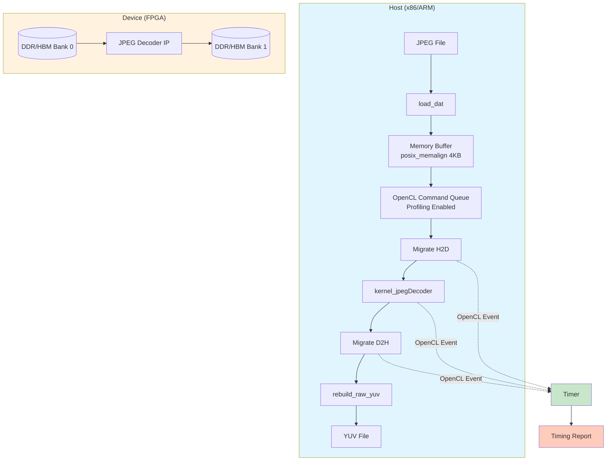

# JPEG Decoder Host Timing Support 模块深度解析

## 概述：为什么需要这个模块？

想象你正在调试一个 FPGA 加速的 JPEG 解码器。你上传了一张图片，等待，然后得到了解码后的 YUV 数据。但整个过程花了多久？是 10 毫秒还是 100 毫秒？时间消耗在主机端的数据准备上，还是 FPGA 核的计算上？又或者是数据在 PCIe 总线上的传输时间？

**`jpeg_decoder_host_timing_support` 模块的存在就是为了回答这些问题。**

这不是一个生产环境的解码服务，而是一个**精密的时序测量仪器**。它像一台高速摄影机，以微秒级精度捕捉 JPEG 解码全链路中的每一个关键时间点：从主机加载 JPEG 文件，到数据迁移到 FPGA 设备内存，再到内核执行完毕，最后数据回传到主机。

该模块的核心设计洞察在于：**在异构计算（Host + FPGA）中，端到端（E2E）时间和内核执行时间是两个完全不同的指标**。E2E 时间包含了所有主机端开销、PCIe 延迟和内存迁移成本；而内核执行时间仅反映 FPGA 硬件的实际计算能力。混淆这两者会导致严重的性能误判。

---

## 架构与心智模型

### 核心抽象：时序事件的追踪链

将时序测量想象成一条**流水线检查站（Pipeline Checkpoint）**。数据包（JPEG 图像）从入口进入，经过一系列处理阶段，每个阶段都有一个时间戳记录器。

模块的核心抽象是**事件（Event）**和**时间差（Diff）**：
- **Event**: OpenCL 事件对象，代表一个命令（迁移、内核执行）的完成状态，并携带高精度时间戳。
- **Diff**: 两个时间点之间的微秒级差值，是性能分析的基本单位。

### 双模式运行架构

模块支持两种互斥的运行模式，这决定了时序测量的实现方式：

1. **HLS 仿真模式 (`_HLS_TEST_`)**: 纯软件仿真，使用 `gettimeofday` 进行主机端 wall-clock 计时。适用于算法验证，不涉及真实硬件。
2. **FPGA 硬件模式 (默认)**: 使用 Xilinx Runtime (XRT) 和 OpenCL 进行异构计算，依赖 OpenCL Profiling API 获取设备端精确时序。



### 内存模型：对齐与银行

在 FPGA 加速中，内存不是均质的。该模块显式处理两种内存拓扑：

- **DDR 模式**: 使用 `XCL_MEM_DDR_BANK0/1` 区分不同的 DDR 内存控制器。
- **HBM 模式**: 使用 `XCL_BANK(0/1/2)` 访问高带宽内存（High Bandwidth Memory）的不同伪通道（Pseudo Channel）。

**关键约束**：所有用于 DMA（直接内存访问）的主机缓冲区必须 **4096 字节对齐**（页对齐）。模块使用 `posix_memalign` 确保这一要求，未对齐的内存会导致 DMA 失败或性能骤降。

---

## 核心组件深度解析

### 1. 时序测量基础设施

#### `struct timeval` 与 `diff()`

虽然代码中直接使用了 POSIX 的 `timeval` 结构，但核心逻辑在于 `diff()` 函数：

```cpp
unsigned long diff(const struct timeval* newTime, const struct timeval* oldTime) {
    return (newTime->tv_sec - oldTime->tv_sec) * 1000000 + (newTime->tv_usec - oldTime->tv_usec);
}
```

**设计意图**：
- 将秒和微秒统一转换为**微秒（us）**整数，避免浮点运算带来的精度损失和性能开销。
- 在 HLS 仿真模式下，这是唯一的时序来源；在 FPGA 模式下，它用于测量 E2E（端到端）时间，与 OpenCL 设备时间形成对比。

#### OpenCL Profiling 事件链

在 FPGA 模式下，模块设置了一个复杂的**事件依赖图**（Event Dependency Graph）：

```cpp
// 伪代码示意事件链构建
for (int i = 0; i < num_runs; ++i) {
    // Write (H2D) depends on previous Read (D2H) except first iteration
    q.enqueueMigrateMemObjects(ob_in, 0, (i>0 ? &events_read[i-1] : nullptr), &events_write[i][0]);
    
    // Kernel depends on Write
    q.enqueueTask(kernel_jpegDecoder, &events_write[i], &events_kernel[i][0]);
    
    // Read (D2H) depends on Kernel
    q.enqueueMigrateMemObjects(ob_out, 1, &events_kernel[i], &events_read[i][0]);
}
```

**关键设计决策**：
- **流水线重叠（Pipelining）**: 第 $i$ 次迭代的写操作（H2D）可以与前一次迭代 $i-1$ 的读操作（D2H）重叠，通过事件依赖 `&events_read[i-1]` 实现，最大化 PCIe 带宽利用率。
- **精确计时**: 每个命令（Write/Kernel/Read）都有独立的 `cl::Event` 对象，通过 `getProfilingInfo(CL_PROFILING_COMMAND_START/END)` 获取纳秒级时间戳。

### 2. 内存管理与数据对齐

#### `aligned_alloc<T>()` - DMA 就绪内存

```cpp
template <typename T>
T* aligned_alloc(std::size_t num) {
    void* ptr = nullptr;
    if (posix_memalign(&ptr, 4096, num * sizeof(T))) { // 4096 = 4KB page size
        throw std::bad_alloc();
    }
    return reinterpret_cast<T*>(ptr);
}
```

**为何 4096 字节？**
- Xilinx XRT（Xilinx Runtime）在进行 DMA 传输时，要求主机内存缓冲区必须页对齐。未对齐的地址会导致额外的拷贝（bounce buffer）或直接报错。
- 抛出 `std::bad_alloc` 而不是返回 `nullptr`，符合 C++ RAII 惯用法，强制调用者处理分配失败（通过异常机制）。

#### HBM vs DDR 内存银行配置

代码通过条件编译支持两种硬件内存架构：

```cpp
#ifndef USE_HBM
    // DDR 模式：使用 DDR Bank 0/1
    mext_in[0].flags = XCL_MEM_DDR_BANK0; // JPEG input
    mext_in[1].flags = XCL_MEM_DDR_BANK1; // YUV output
#else
    // HBM 模式：使用伪通道 0/1/2
    mext_in[0].flags = XCL_BANK0; 
    mext_in[1].flags = XCL_BANK1;
    mext_in[2].flags = XCL_BANK2; // info 结构体单独银行
#endif
```

**设计考量**：
- **分离读写通道**: 将输入（JPEG）和输出（YUV）放在不同的内存银行（Bank），避免访问冲突，最大化有效带宽。
- **HBM 的高扇出**: HBM 拥有 32 个伪通道，允许更细粒度的银行划分，减少争用。

### 3. 数据重建与后处理

#### `rebuild_raw_yuv()` - MCU 到平面 YUV 的转换

FPGA 解码器输出的是**宏块单元（MCU - Minimum Coded Unit）**格式，但标准的视频处理流水线通常需要**平面（Planar）YUV** 格式（YYYY...UUUU...VVVV）。该函数执行这个关键的格式转换。

```cpp
void rebuild_raw_yuv(std::string file_name,
                     xf::codec::bas_info* bas_info,
                     int hls_bc[MAX_NUM_COLOR],
                     ap_uint<64>* yuv_mcu_pointer) {
    // ... 文件操作 ...
    
    // 第一遍：将 64-bit 打包的 MCU 数据解包为字节
    for (int b = 0; b < (int)(bas_info->all_blocks); b++) {
        for (int i = 0; i < 8; i++) {
            for (int j = 0; j < 8; j++) {
                // 从 64-bit ap_uint 中提取 8-bit 像素值
                yuv_mcu_pointer_pix[cnt] = yuv_mcu_pointer[cnt_row](8 * (j + 1) - 1, 8 * j);
                cnt++;
            }
            cnt_row++;
        }
    }
    
    // 第二遍：MCU 顺序到平面 YUV 的重新排列
    // 处理不同的色度子采样格式：C420, C422, C444
    while (n_mcu < (int)(bas_info->hls_mcuc)) {
        for (int cmp = 0; cmp < MAX_NUM_COLOR; cmp++) {
            for (int mbs = 0; mbs < bas_info->hls_mbs[cmp]; mbs++) {
                // 将 8x8 块写入平面缓冲区，考虑色度子采样的位置计算
                // ... 复杂的 dpos 位置计算逻辑 ...
            }
        }
    }
}
```

**关键复杂度来源**：

1. **色度子采样（Chroma Subsampling）**: JPEG 支持 4:4:4（无子采样）、4:2:2（水平减半）、4:2:0（水平和垂直都减半）。代码中 `C420` 和 `C422` 分支处理复杂的 MCU 到平面映射逻辑。

2. **内存布局转换**: FPGA 输出的是**交错 MCU**（YUV 数据按 8x8 块顺序存储），而输出需要**平面格式**（所有 Y 在一起，所有 U 在一起，所有 V 在一起）。这需要两次遍历：第一次解包 64-bit 数据，第二次重新排列。

3. **地址计算**: `dpos`（destination position）的更新逻辑极其复杂，因为它必须处理不同色度格式的块排列模式。例如，在 4:2:0 中，一个 16x16 的宏块包含 4 个 Y 块但只有 1 个 U 块和 1 个 V 块。

---

## 数据流全景分析

让我们追踪一次完整的解码调用，理解数据是如何在模块中流动的：

### Phase 1: 初始化与内存分配 (Host Side)

```
main() 
  ├── load_dat() 读取 JPEG 文件到 jpeg_pointer
  │     └── posix_memalign(4096) 确保 DMA 对齐
  ├── aligned_alloc() 为 yuv_mcu_pointer (输出) 和 infos (元数据) 分配对齐内存
  └── gettimeofday(&startE2E, 0) 记录 E2E 计时起点
```

**关键契约**：`load_dat` 分配的 `jpeg_pointer` 必须在后续被 `free` 释放。缓冲区大小受 `MAX_DEC_PIX` 限制，防止巨大 JPEG 导致 OOM。

### Phase 2: OpenCL 运行时设置 (仅 FPGA 模式)

```
main() - FPGA 分支
  ├── xcl::get_xil_devices() 发现 Xilinx 设备
  ├── cl::Context / cl::CommandQueue 创建上下文和队列 (启用 CL_QUEUE_PROFILING_ENABLE)
  ├── xcl::import_binary_file() 加载 xclbin (FPGA 比特流)
  ├── cl::Kernel kernel_jpegDecoder 创建内核对象
  ├── cl_mem_ext_ptr_t 配置内存扩展指针 (指定 DDR Bank 或 HBM Bank)
  └── cl::Buffer 创建缓冲区对象 (使用 CL_MEM_EXT_PTR_XILINX | CL_MEM_USE_HOST_PTR)
```

**架构角色**：这是典型的 **XRT (Xilinx Runtime) 应用模式**。模块在此处充当**异构计算的编排器（Orchestrator）**，管理主机与设备之间的内存一致性、命令依赖和事件同步。

### Phase 3: 执行流水线与事件依赖

```
main() - 执行循环 (num_runs = 10 次迭代)
  ├── 迭代 i:
  │     ├── enqueueMigrateMemObjects(H2D) 主机到设备传输
  │     │     └── 依赖: events_read[i-1] (流水线：本次写等上次读完成)
  │     ├── enqueueTask(kernel_jpegDecoder) 内核执行
  │     │     └── 依赖: events_write[i] (内核等写完成)
  │     └── enqueueMigrateMemObjects(D2H) 设备到主机传输
  │           └── 依赖: events_kernel[i] (读等内核完成)
  └── q.finish() 等待所有命令完成
```

**关键设计模式**：**双缓冲流水线（Double Buffering / Pipelining）**。通过让第 $i$ 次迭代的 H2D 传输与第 $i-1$ 次迭代的 D2H 传输重叠，隐藏 PCIe 传输延迟。这要求主机缓冲区在多次迭代间被复用（或被足够多的独立缓冲区支持）。

### Phase 4: 时序数据提取与报告

```
main() - 计时分析
  ├── events_write[0].getProfilingInfo(START/END) 计算首次 H2D 时间
  ├── events_read[0].getProfilingInfo(START/END) 计算首次 D2H 时间
  ├── 循环 i: events_kernel[i].getProfilingInfo() 计算每次内核执行时间
  ├── 平均内核时间 = sum(exec_times) / num_runs
  └── diff(&endE2E, &startE2E) 计算端到端时间
```

**数据对比价值**：
- **Write/Read Time**: 反映 PCIe 总线带宽和延迟。
- **Kernel Time**: 反映 FPGA 实现效率（纯计算时间，无主机开销）。
- **E2E Time**: 反映用户感知的总延迟，包含所有主机端处理（如 `rebuild_raw_yuv` 的 CPU 后处理）。

### Phase 5: 数据重建与后处理

```
main() - 后处理阶段
  ├── rebuild_infos() 从 FPGA 输出的 infos 缓冲区解析元数据
  │     └── 填充 img_info, cmp_info, bas_info 结构体
  └── rebuild_raw_yuv() 将 MCU 格式数据转换为标准 YUV 文件
        ├── 第一遍: 解包 64-bit ap_uint 数据到字节数组
        └── 第二遍: MCU 重排为平面 YUV (处理 C420/C422/C444)
```

**架构角色**：`rebuild_raw_yuv` 充当**格式转换器（Transformer）**，将硬件友好的块状存储（MCU）转换为主机软件友好的平面存储。这通常是性能瓶颈所在（CPU 密集型内存操作），因此 E2E 时间往往远大于内核时间。

---

## 设计决策与权衡

### 1. 双模式编译：HLS 仿真 vs FPGA 执行

**选择**：通过宏 `_HLS_TEST_` 在编译期选择执行路径。

**权衡分析**：
- **优势**：
  - **代码复用**：同一套主机逻辑（如 `rebuild_raw_yuv`）可用于纯软件算法验证和硬件加速测试。
  - **快速迭代**：HLS 仿真无需 FPGA 硬件即可调试数据流。
- **代价**：
  - **条件编译复杂性**：`#ifdef` 散布在代码中，增加了维护难度和视觉噪音。
  - **行为差异风险**：HLS 仿真使用 `malloc`，而 FPGA 模式使用 `aligned_alloc`，内存对齐差异可能导致难以复现的 Bug。

**替代方案**：运行时动态选择（通过参数），但会增加二进制体积和运行时开销。

### 2. 内存对齐策略：RAII vs 原始指针

**选择**：使用 `posix_memalign` + 原始指针 + 手动 `free`，而非 C++ 智能指针。

**权衡分析**：
- **优势**：
  - **显式控制**：OpenCL/XRT 的 C API 本身使用原始指针，保持风格一致。
  - **性能**：避免 `shared_ptr` 的原子操作开销（虽然在此上下文中可忽略，但符合 HLS 代码的零开销抽象哲学）。
- **代价**：
  - **内存泄漏风险**：`main` 函数末尾有对应的 `free` 调用，但如果在中间路径提前 `return`（如 `load_dat` 失败后的 `return err`），则 `jpeg_pointer` 等会泄漏。
  - **异常不安全**：如果 `rebuild_raw_yuv` 抛出异常（虽然当前实现没有），`free` 不会被调用。

**架构建议**：生产代码应使用 `std::unique_ptr<T, custom_deleter>` 管理对齐内存，确保异常安全。

### 3. 时序精度选择：OpenCL Profiling vs CPU 时钟

**选择**：使用 OpenCL Profiling API（基于设备时钟）测量内核时间，使用 `gettimeofday`（CPU  wall-clock）测量 E2E 时间。

**权衡分析**：
- **精度差异**：
  - OpenCL Profiling 提供**纳秒级**精度（虽然代码转换为微秒显示），且测量的是设备端的实际执行时间，不受主机 OS 调度影响。
  - `gettimeofday` 精度通常为微秒级，且受进程调度、中断、CPU 频率切换（C-States）影响，不适合测量短于 1ms 的纯计算时间。
- **盲区**：
  - OpenCL Profiling 无法捕捉主机端的 `rebuild_raw_yuv` 处理时间（这是纯 CPU 操作，不涉及 OpenCL 队列）。
  - 因此 E2E 时间（`diff(&endE2E, &startE2E)`）与 OpenCL 时间之和的差值，正是主机后处理的开销。

### 4. 流水线深度：单次执行 vs 多次迭代平均

**选择**：默认执行 `num_runs = 10` 次，报告平均内核时间。

**权衡分析**：
- **统计显著性**：单次执行可能受冷启动效应（Cold Start）影响：第一次运行需要分配设备内存、加载 FPGA 比特流（如果未预加载）、预热缓存。平均 10 次可平滑这些异常值。
- **内存约束**：代码中 `yuv_mcu_pointer` 和 `infos` 在多次迭代间被复用（通过 OpenCL 的 `CL_MEM_USE_HOST_PTR`），不重新分配，节省了大量 `malloc/free` 开销。
- **局限性**：代码固定为 10 次，无法通过命令行参数调整，缺乏灵活性。

---

## 关键实现细节与陷阱

### 1. 危险的类型别名：`ap_uint<64>*` 的字节操作

在 `rebuild_raw_yuv` 中，FPGA 输出被声明为 `ap_uint<64>*`（64 位无符号整数数组），但实际进行的是字节级操作：

```cpp
// yuv_mcu_pointer 是 ap_uint<64>*，但 fwrite 按 char 写入
fwrite(yuv_mcu_pointer, sizeof(char), bas_info->all_blocks * 64, f);
```

**陷阱**：`ap_uint<64>` 是 Xilinx 的任意精度整数类型，通常按大端或小端（取决于 FPGA 内核实现）存储。直接在主机端将其当作字节数组解释，如果主机和 FPGA 的字节序（Endianness）不一致，会导致数据错乱。

**安全做法**：应通过显式的位域提取（如代码中 `(8 * (j + 1) - 1, 8 * j)` 提取 8 位）进行解包，而不是直接内存别名。

### 2. 内存泄漏路径分析

虽然 `main` 末尾有 `free` 调用，但存在提前返回导致的泄漏：

```cpp
int err = load_dat(jpeg_pointer, JPEGFile, size);
if (err) {
    printf("Alloc buf failed!, size:%d Bytes\n", size);
    return err; // 泄漏：jpeg_pointer 已分配但未释放
}
```

**修复建议**：使用 `std::unique_ptr` 或 `goto cleanup` 模式确保所有路径都经过释放逻辑。

### 3. 隐式的同步点：`q.finish()`

代码在提交所有 10 次迭代后调用 `q.finish()`：

```cpp
// 提交所有任务...
q.finish(); // 阻塞，直到队列中所有命令完成
```

**性能影响**：这意味着主机在 FPGA 执行期间处于**忙等待（或阻塞）**状态，无法做其他有用工作。对于纯测试工具这是可接受的，但生产代码应使用异步事件回调或轮询。

### 4. `MAX_DEC_PIX` 与缓冲区溢出风险

`load_dat` 函数检查 `n > MAX_DEC_PIX`，但没有检查 `size` 参数与 `MAX_DEC_PIX` 的关系。如果传入的 `MAX_DEC_PIX` 宏定义小于实际 JPEG 文件大小，会触发早期返回，但错误消息可能误导（显示 "read n bytes > MAX_DEC_PIX"）。

**建议**：动态计算所需缓冲区大小，或使用 `std::vector` 的 `resize`。

---

## 使用指南与最佳实践

### 编译与运行

```bash
# FPGA 模式 (默认)
g++ -std=c++11 test_decoder.cpp -o test_decoder \
    -I${XILINX_XRT}/include -L${XILINX_XRT}/lib -lOpenCL -lpthread
./test_decoder -xclbin /path/to/jpegDecoder.xclbin -JPEGFile /path/to/image.jpg

# HLS 仿真模式
g++ -D_HLS_TEST_ -std=c++11 test_decoder.cpp -o test_decoder_hls
./test_decoder_hls -JPEGFile /path/to/image.jpg
```

### 解释输出报告

典型的输出包含三个关键指标：

```
INFO: Data transfer from host to device: 120 us      # PCIe 写入延迟
INFO: Data transfer from device to host: 85 us       # PCIe 读取延迟  
INFO: Average kernel execution per run: 450 us       # FPGA 纯计算时间
INFO: Average E2E per run: 800 us                    # 用户感知总延迟
```

**性能分析公式**：
- **PCIe 传输瓶颈**: 如果 `Write Time + Read Time` 接近 `E2E Time`，说明应用受限于 PCIe 带宽。
- **主机后处理开销**: `E2E - max(Write, Kernel, Read)` 的差值反映了 `rebuild_raw_yuv` 的 CPU 处理时间。
- **内核效率**: 如果 `Kernel Time` 远大于理论计算时间，可能存在内存争用或内核逻辑低效。

### 扩展与定制

**添加新的时序测量点**：

如果需要测量 `rebuild_raw_yuv` 的耗时，可以添加：

```cpp
struct timeval start_rebuild, end_rebuild;
gettimeofday(&start_rebuild, 0);
rebuild_raw_yuv(JPEGFile, &bas_info, hls_bc, yuv_mcu_pointer);
gettimeofday(&end_rebuild, 0);
unsigned long rebuild_time = diff(&end_rebuild, &start_rebuild);
std::cout << "INFO: YUV rebuild time: " << rebuild_time << " us\n";
```

**适配新的内存架构**：

如果目标平台有 HBM2e 或 DDR5，需要调整 `mext_in` 的 `flags`：

```cpp
// 示例：扩展到 4 个 HBM 伪通道
std::vector<cl_mem_ext_ptr_t> mext_in(4);
for (int i = 0; i < 4; ++i) {
    mext_in[i].flags = XCL_BANK(i); // 或 XCL_MEM_DDR_BANKi
    // ... obj 和 param 设置
}
```

---

## 总结：模块的架构角色

`jpeg_decoder_host_timing_support` 在这个加速库中扮演**性能基准测试与集成验证（Performance Benchmarking & Integration Validation）**的关键角色。

| 维度 | 角色描述 |
|------|---------|
| **时序精度** | 作为**微秒级计时器**，区分 PCIe 传输、内核计算和主机后处理的耗时，是性能优化的眼睛。 |
| **集成胶水** | 作为**异构计算协调者**，弥合 C++ 主机逻辑与 FPGA 内核之间的鸿沟，处理内存对齐、银行配置和 OpenCL 生命周期。 |
| **数据转换器** | 作为**格式适配器**，将 FPGA 友好的 MCU 数据转换为行业标准 YUV，确保解码器输出可被后续处理链路消费。 |
| **验证工具** | 作为**回归测试载体**，通过 HLS 仿真模式和 FPGA 模式的双模式支持，允许纯软件验证算法正确性，再部署到硬件。 |

对于新加入团队的开发者，理解这个模块的关键在于认识到：**它不仅仅是一个测试文件，而是一个精心设计的测量仪器**。每一个 `posix_memalign` 调用、每一个 `cl::Event` 依赖、每一个微秒级的时间差计算，都是为了在异构计算的复杂性中，精确地分离出真正的性能瓶颈所在。

当你需要优化 JPEG 解码器的吞吐量时，这个模块提供的 `Data transfer` vs `Kernel execution` vs `E2E` 数据，将是你决策是否需要在 FPGA 中增加缓冲区、是否使用 HBM、或是否优化主机端后处理算法的关键依据。
