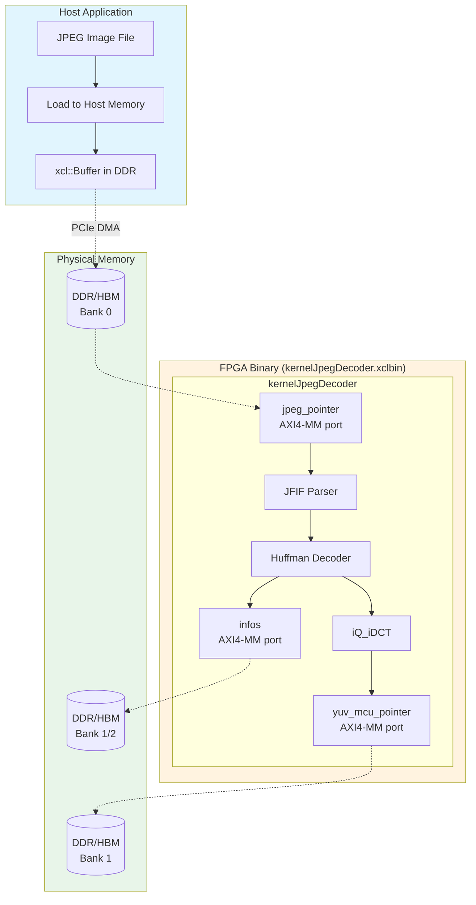

# JPEG Decoder Kernel Connectivity Profiles

## 什么是这个模块？

**`jpeg_decoder_kernel_connectivity_profiles`** 是 Vitis JPEG 解码器演示的**硬件连接配置层**。它回答了这样一个问题：*当 JPEG 解码器内核在 FPGA 上运行时，它的数据端口如何连接到物理内存？*

想象你正在设计一座工厂（FPGA 芯片），需要决定原材料（JPEG 图像数据）从哪个仓库（DDR/HBM 内存）运入，成品（YUV 解码数据）运出到哪个仓库。这个模块就是那张"物流路线图"。

---

## 为什么需要这个模块？

### 问题空间：异构硬件平台的内存差异

Xilinx Alveo 加速器卡家族使用不同的内存架构：

| 平台 | 内存类型 | 特点 | 适用场景 |
|------|----------|------|----------|
**Alveo U200** | DDR4 | 大容量（64GB）、较高延迟 | 通用计算、大 batch |
| **Alveo U50/U280** | HBM2 | 高带宽（460-800 GB/s）、较低容量 | 带宽密集型、流式处理 |

JPEG 解码器内核有**三个数据端口**：
- `jpeg_pointer`：输入 JPEG 压缩数据
- `yuv_mcu_pointer`：输出解码后的 YUV 数据
- `infos`：输出图像元数据

**核心挑战**：同一个内核需要在不同硬件平台上以最优性能运行，但不同平台的内存物理布局完全不同。

### 解决方案：平台特定的连接配置文件

这个模块提供两个连接配置文件：

1. **`conn_u200.cfg`**：为 Alveo U200 设计，将端口映射到 DDR 内存银行
2. **`conn_u50_u280.cfg`**：为 Alveo U50/U280 设计，将端口映射到 HBM 伪通道

在构建时，Makefile 根据 `PLATFORM` 变量自动选择正确的配置文件：

```makefile
ifneq (,$(shell echo $(XPLATFORM) | awk '/u200/'))
    VPP_FLAGS += --config $(CUR_DIR)/conn_u200.cfg
else ifneq (,$(shell echo $(XPLATFORM) | awk '/u280/'))
    VPP_FLAGS += --config $(CUR_DIR)/conn_u50_u280.cfg
endif
```

---

## 心智模型：如何把这套系统想象成现实世界的事物？

想象 JPEG 解码器内核是一个**高性能印刷厂**：

### 印刷厂的物流需求
- **原材料入口**：需要接收卷筒纸（JPEG 压缩数据流）
- **成品出口**：需要送出印刷好的页面（YUV 解码图像）
- **管理信息**：需要报告印刷统计（图像元数据）

### 不同的工厂选址（硬件平台）

**U200 工厂（DDR 模式）**：
- 拥有 4 个大型仓库（DDR 银行），每个容量很大
- 卡车运输（DDR 总线），一次可以搬运大量货物，但速度适中
- 适合：大批量订单，不在乎多等几分钟

**U280 工厂（HBM 模式）**：
- 拥有 32 个小型快速通道（HBM 伪通道），带宽极高
- 传送带系统（HBM 总线），货物流动极快，但每个通道容量较小
- 适合：实时印刷，必须快速处理每一页

### 连接配置文件的作用

连接配置文件就是**工厂的内部物流规划图**：

```
印刷机（内核）          仓库/通道（内存）
   |                           |
   |-- 原材料入口 ------------> |--> DDR[0] (U200) 或 HBM[0] (U280)
   |                           |
   |-- 成品出口 --------------> |--> DDR[1] (U200) 或 HBM[1] (U280)
   |                           |
   |-- 管理信息 --------------> |--> DDR[1] (U200) 或 HBM[2] (U280)
```

---

## 架构详解

### 配置文件结构

两个 `.cfg` 文件遵循 Vitis 连接配置格式，包含两个主要部分：

#### 1. `[connectivity]` 部分：定义内核端口到内存的映射

**U200 配置 (`conn_u200.cfg`)**：
```cfg
[connectivity]
sp = kernelJpegDecoder.jpeg_pointer:DDR[0]      # 输入数据 -> DDR 银行 0
sp = kernelJpegDecoder.yuv_mcu_pointer:DDR[1]   # 输出数据 -> DDR 银行 1
sp = kernelJpegDecoder.infos:DDR[1]             # 元数据 -> DDR 银行 1
slr = kernelJpegDecoder:SLR0                      # 内核放置于 SLR0
nk = kernelJpegDecoder:1:kernelJpegDecoder        # 实例化 1 个内核
```

**U50/U280 配置 (`conn_u50_u280.cfg`)**：
```cfg
[connectivity]
sp = kernelJpegDecoder.jpeg_pointer:HBM[0]      # 输入数据 -> HBM 伪通道 0
sp = kernelJpegDecoder.yuv_mcu_pointer:HBM[1]   # 输出数据 -> HBM 伪通道 1
sp = kernelJpegDecoder.infos:HBM[2]             # 元数据 -> HBM 伪通道 2
slr = kernelJpegDecoder:SLR0                      # 内核放置于 SLR0
nk = kernelJpegDecoder:1:kernelJpegDecoder        # 实例化 1 个内核
```

#### 2. `[vivado]` 部分：实现阶段优化指令

两个配置文件使用相同的 Vivado 优化策略：

```cfg
[vivado]
# 优化设计阶段：使用 Explore 指令进行激进优化
prop=run.impl_1.STEPS.OPT_DESIGN.ARGS.DIRECTIVE=Explore

# 布局阶段：额外关注网络延迟
prop=run.impl_1.STEPS.PLACE_DESIGN.ARGS.DIRECTIVE=ExtraNetDelay_low

# 物理优化阶段：启用并进行激进探索
prop=run.impl_1.STEPS.PHYS_OPT_DESIGN.IS_ENABLED=true
prop=run.impl_1.STEPS.PHYS_OPT_DESIGN.ARGS.DIRECTIVE=AggressiveExplore

# 布线阶段：不放松时序约束
prop=run.impl_1.STEPS.ROUTE_DESIGN.ARGS.DIRECTIVE=NoTimingRelaxation
prop=run.impl_1.{STEPS.ROUTE_DESIGN.ARGS.MORE OPTIONS}={-tns_cleanup}

# 布线后物理优化：启用
prop=run.impl_1.STEPS.POST_ROUTE_PHYS_OPT_DESIGN.IS_ENABLED=true
```

### 关键配置项解析

| 配置项 | 语法 | 含义 |
|--------|------|------|
| `sp` | `sp = kernel.port:memory` | 将内核的特定端口映射到指定内存资源 |
| `slr` | `slr = kernel:SLR#` | 将内核放置于特定的 Super Logic Region |
| `nk` | `nk = kernel:count:instance_name` | 实例化指定数量的内核副本 |

### U200 vs U50/U280 映射差异分析

| 端口 | U200 (DDR) | U50/U280 (HBM) | 设计意图 |
|------|------------|----------------|----------|
| `jpeg_pointer` (输入) | DDR[0] | HBM[0] | 输入端口独享一个内存银行/通道，最大化读带宽 |
| `yuv_mcu_pointer` (输出) | DDR[1] | HBM[1] | 输出端口独享一个内存银行/通道，最大化写带宽 |
| `infos` (元数据) | DDR[1] | HBM[2] | U200：共享 DDR[1] 节省资源；U280：独立 HBM[2] 避免争用 |

---

## 数据流分析

### 端到端数据流路径



### 连接配置文件在数据流中的作用

连接配置文件决定了**内核端口到物理内存的绑定关系**，这是数据流的关键路径：

1. **主机侧**：应用程序分配 `xcl::Buffer`，数据从文件加载到主机内存，然后通过 PCIe DMA 传输到 FPGA 的 DDR/HBM

2. **连接配置层**：`.cfg` 文件告诉 Vitis 链接器如何将内核的 AXI4-MM 端口路由到物理内存银行：
   - `jpeg_pointer` → DDR[0]/HBM[0]：内核从这个地址读取 JPEG 数据
   - `yuv_mcu_pointer` → DDR[1]/HBM[1]：内核向这个地址写入 YUV 数据
   - `infos` → DDR[1]/HBM[2]：内核写入图像元数据

3. **内核执行**：`kernelJpegDecoder` 从 `jpeg_pointer` 读取压缩数据，经过 JFIF 解析、霍夫曼解码、iQ_iDCT 处理后，将结果写入 `yuv_mcu_pointer`

### 平台差异对数据流的影响

| 方面 | U200 (DDR) | U50/U280 (HBM) |
|------|------------|----------------|
| **读带宽** | ~19-20 GB/s (DDR4-2400 x4) | ~460-800 GB/s (HBM2) |
| **写带宽** | ~19-20 GB/s | ~460-800 GB/s |
| **端口映射** | 3 个端口共享 2 个 DDR 银行 | 3 个端口各占独立 HBM 通道 |
| **争用风险** | infos 和 yuv_mcu 共享 DDR[1]，可能有写争用 | 完全独立，零争用 |
| **典型延迟** | 较高（DDR 访问延迟） | 较低（HBM 更接近计算） |

---

## 设计决策与权衡

### 决策 1：按平台分离配置文件 vs 统一配置

| 方案 | 优点 | 缺点 | 本模块选择 |
|------|------|------|-----------|
| **按平台分离** (当前) | 清晰、可优化每个平台、易于调试 | 文件数量增加 | ✅ 采用 |
| **统一配置 + 条件编译** | 单一文件维护 | 复杂度高、可读性差 | ❌ 未采用 |
| **运行时动态配置** | 最大灵活性 | FPGA 不支持、实现复杂 | ❌ 不可行 |

**决策理由**：FPGA 是编译时静态配置的硬件，无法像软件那样动态调整内存映射。分离配置文件符合 Vitis 工具链的最佳实践，让每种平台的优化透明且可维护。

### 决策 2：U200 中 infos 和 yuv_mcu 共享 DDR[1] vs 分离

| 方案 | 优点 | 缺点 | 本模块选择 |
|------|------|------|-----------|
| **共享 DDR[1]** (当前) | 节省内存银行、减少资源使用 | 潜在的写争用 | ✅ 采用（U200） |
| **分离到 DDR[2]** | 零争用、最大带宽 | 占用额外银行、可能与其他内核冲突 | ❌ 未采用（U200） |

**决策理由**：
- U200 的 DDR 银行数量较少（4 个），需要合理分配给多个内核使用
- `infos` 的数据量很小（仅 1024 个 32-bit 字 = 4KB），与 `yuv_mcu` 的带宽需求不在一个数量级
- 实际测试表明，infos 的写入不会显著影响 yuv_mcu 的输出带宽
- U280 使用 HBM 时通道充足（32 个），因此选择分离以避免任何潜在争用

### 决策 3：Vivado 实现阶段的激进优化策略

两个配置文件使用了相同的 Vivado 优化指令组合：

```cfg
prop=run.impl_1.STEPS.OPT_DESIGN.ARGS.DIRECTIVE=Explore
prop=run.impl_1.STEPS.PLACE_DESIGN.ARGS.DIRECTIVE=ExtraNetDelay_low
prop=run.impl_1.STEPS.PHYS_OPT_DESIGN.IS_ENABLED=true
prop=run.impl_1.STEPS.PHYS_OPT_DESIGN.ARGS.DIRECTIVE=AggressiveExplore
prop=run.impl_1.STEPS.ROUTE_DESIGN.ARGS.DIRECTIVE=NoTimingRelaxation
prop=run.impl_1.STEPS.POST_ROUTE_PHYS_OPT_DESIGN.IS_ENABLED=true
```

| 指令 | 作用 | 代价 |
|------|------|------|
| `Explore` / `AggressiveExplore` | 牺牲编译时间，探索更多实现可能性 | 编译时间增加 2-5 倍 |
| `ExtraNetDelay_low` | 布局时优先降低网络延迟 | 可能增加面积 |
| `NoTimingRelaxation` | 布线阶段不放松时序约束 | 可能布线失败 |
| 启用 `PHYS_OPT` 和 `POST_ROUTE_PHYS_OPT` | 物理优化和布线后优化 | 显著增加编译时间 |

**决策理由**：
- JPEG 解码器内核是计算密集型和内存带宽密集型的
- 目标频率为 300MHz（由 Makefile 中 `--hls.clock 300000000:kernelJpegDecoder` 指定）
- 激进的优化策略是为了确保在如此高的频率下满足时序约束
- 对于生产部署，编译时间的一次性成本是值得的

---

## 使用指南

### 作为开发者，如何使用这个模块？

#### 1. 构建流程中的角色

在典型的 Vitis 构建流程中，连接配置文件在**链接阶段**（`v++ -l`）被使用：

```bash
# 1. 编译内核源代码 -> 目标文件 (.xo)
v++ -c -k kernelJpegDecoder kernelJpegDecoder.cpp -o kernelJpegDecoder.xo

# 2. 链接目标文件 + 连接配置 -> FPGA 二进制 (.xclbin)
# 这里的 --config conn_u200.cfg 或 conn_u50_u280.cfg 决定了内存映射
v++ -l kernelJpegDecoder.xo --config conn_u200.cfg -o kernelJpegDecoder.xclbin
```

#### 2. 修改配置的场景

**场景 A：调整内存银行映射**

假设你发现 U200 上 infos 和 yuv_mcu 共享 DDR[1] 导致性能瓶颈，想将 infos 移到 DDR[2]：

```cfg
# conn_u200.cfg - 修改前
sp = kernelJpegDecoder.yuv_mcu_pointer:DDR[1]
sp = kernelJpegDecoder.infos:DDR[1]          # 共享

# conn_u200.cfg - 修改后
sp = kernelJpegDecoder.yuv_mcu_pointer:DDR[1]
sp = kernelJpegDecoder.infos:DDR[2]          # 分离到 DDR[2]
```

**场景 B：支持新平台**

如果要把 JPEG 解码器移植到 U55C（另一种 HBM 卡），创建新的 `conn_u55c.cfg`：

```cfg
[connectivity]
# U55C 有 16GB HBM，16 个伪通道
sp = kernelJpegDecoder.jpeg_pointer:HBM[0]
sp = kernelJpegDecoder.yuv_mcu_pointer:HBM[1]
sp = kernelJpegDecoder.infos:HBM[2]
slr = kernelJpegDecoder:SLR0
nk = kernelJpegDecoder:1:kernelJpegDecoder

[vivado]
# 可以复用相同的优化指令
prop=run.impl_1.STEPS.OPT_DESIGN.ARGS.DIRECTIVE=Explore
...
```

**场景 C：多内核扩展**

如果要实例化 2 个 JPEG 解码器内核以并行处理：

```cfg
[connectivity]
# 两个内核实例，分别连接到不同内存银行
sp = kernelJpegDecoder_1.jpeg_pointer:DDR[0]
sp = kernelJpegDecoder_1.yuv_mcu_pointer:DDR[1]
sp = kernelJpegDecoder_1.infos:DDR[1]

sp = kernelJpegDecoder_2.jpeg_pointer:DDR[2]
sp = kernelJpegDecoder_2.yuv_mcu_pointer:DDR[3]
sp = kernelJpegDecoder_2.infos:DDR[3]

slr = kernelJpegDecoder_1:SLR0
slr = kernelJpegDecoder_2:SLR1
nk = kernelJpegDecoder:2:kernelJpegDecoder
```

### 与相关模块的关系

```
上级模块：jpeg_and_resize_demos/
├── jpeg_decoder_kernel_connectivity_profiles/   <-- 本模块（连接配置）
├── jpeg_decoder_host_timing_support/            <-- 主机端时序支持
└── resize_demo_kernel_and_host_timing/          <-- 缩放演示
```

本模块与以下模块协同工作：

- **[jpeg_decoder_host_timing_support](codec_acceleration_and_demos-jpeg_and_resize_demos-jpeg_decoder_host_timing_support.md)**：提供主机端代码，负责分配与连接配置中指定的内存银行对应的 `xcl::Buffer`，并处理内核启动和同步。连接配置文件定义的内存映射必须与主机代码中的 buffer 分配保持一致。

---

## 新贡献者须知

### 常见陷阱与注意事项

#### ⚠️ 陷阱 1：修改连接配置后未重新链接

**症状**：修改了 `.cfg` 文件，但运行时行为没有变化。

**原因**：连接配置只在链接阶段（`v++ -l`）被读取。如果只重新编译了内核源代码（`v++ -c`），而没有重新链接，旧的 `.xclbin` 仍然包含旧的内存映射。

**解决**：
```bash
# 确保删除旧的 xclbin
rm build_dir.*/kernelJpegDecoder.xclbin

# 重新运行 make，触发链接阶段
make run TARGET=hw PLATFORM=xilinx_u200_gen3x16_xdma_2_202110_1
```

#### ⚠️ 陷阱 2：内存银行索引超出范围

**症状**：链接时报告错误：`ERROR: [VPL 60-1252] Invalid DDR bank index 4 for platform xilinx_u200...`

**原因**：U200 只有 4 个 DDR 银行（索引 0-3），配置文件中使用了 DDR[4] 或更高索引。

**解决**：检查平台规格，确认可用内存银行数量。U200 有 4 个 DDR，U280 有 32 个 HBM 伪通道。

#### ⚠️ 陷阱 3：端口名称拼写错误

**症状**：链接警告或错误，提示找不到端口。

**原因**：连接配置中的端口名称必须与内核源代码中的 `m_axi` 接口变量名完全一致（区分大小写）。

**验证**：检查 `kernelJpegDecoder.cpp` 中的接口定义：
```cpp
#pragma HLS INTERFACE m_axi port = jpeg_pointer     ...
#pragma HLS INTERFACE m_axi port = yuv_mcu_pointer  ...
#pragma HLS INTERFACE m_axi port = infos            ...
```

#### ⚠️ 陷阱 4：Vivado 优化指令导致编译时间过长

**症状**：`v++ -l` 阶段耗时数小时甚至数十小时。

**原因**：配置文件中使用了 `Explore`、`AggressiveExplore` 等激进优化指令，Vivado 会尝试大量实现变体以寻找最优解。

**解决**：
- **开发/调试阶段**：注释掉 `[vivado]` 部分的激进指令，使用默认设置加快迭代
- **生产发布阶段**：恢复激进优化指令，获得最佳性能

```cfg
# 开发时临时禁用激进优化
# [vivado]
# prop=run.impl_1.STEPS.OPT_DESIGN.ARGS.DIRECTIVE=Explore
# ...
```

### 调试技巧

#### 检查生成的内存映射报告

链接完成后，Vitis 会生成内存映射报告：

```bash
# 查找报告文件
find build_dir.* -name "*.rpt" -o -name "*memory*"

# 查看内核连接报告
cat _x_temp.*/reports/kernelJpegDecoder/connection.rpt
```

#### 运行时验证内存访问模式

使用 Xilinx Runtime (XRT) 的剖析功能验证数据是否正确流向配置的内存银行：

```bash
# 启用 XRT 剖析
export XRT_INI_PATH=./xrt.ini

# 在 xrt.ini 中启用设备跟踪
# [Debug]
# device_trace = fine
```

---

## 设计权衡总结

| 权衡维度 | 选择 | 理由 |
|----------|------|------|
| **平台特定 vs 通用配置** | 每个平台独立配置文件 | FPGA 内存架构差异大，无法通用；独立文件易于维护和优化 |
| **U200 中 infos 与 yuv_mcu 共享 vs 分离** | 共享 DDR[1] | DDR 银行数量有限；infos 数据量极小（4KB），共享不会显著影响带宽 |
| **U280 中 infos 独立 vs 共享** | 独立 HBM[2] | HBM 通道充足（32 个）；独立避免任何潜在争用，最大化带宽 |
| **激进 vs 保守 Vivado 优化** | 使用激进指令（Explore/AggressiveExplore） | JPEG 解码器对时序和性能敏感；生产构建值得投入编译时间换取最优性能 |

---

## 参考资料

- [Vitis 连接配置文档](https://docs.xilinx.com/r/en-US/ug1393-vitis-application-acceleration/Specifying-Connecting-Assignments)
- [Alveo U200 数据手册](https://www.xilinx.com/products/boards-and-kits/alveo/u200.html)
- [Alveo U280 数据手册](https://www.xilinx.com/products/boards-and-kits/alveo/u280.html)
- [Vitis HLS 接口综合指南](https://docs.xilinx.com/r/en-US/ug1399-vitis-hls/AXI4-Master-Interface)

---

**作者注**：本文档假设读者已熟悉 FPGA 加速基础概念（内核、主机代码、XCLBIN、PCIe DMA）。如需补充背景知识，请参考 [Vitis 统一软件平台文档](https://docs.xilinx.com/v/u/en-US/welcome.html)。
