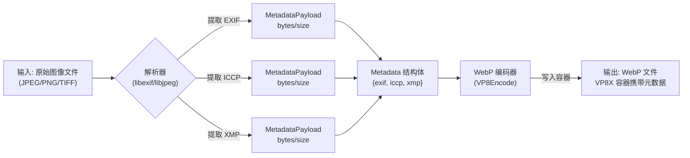
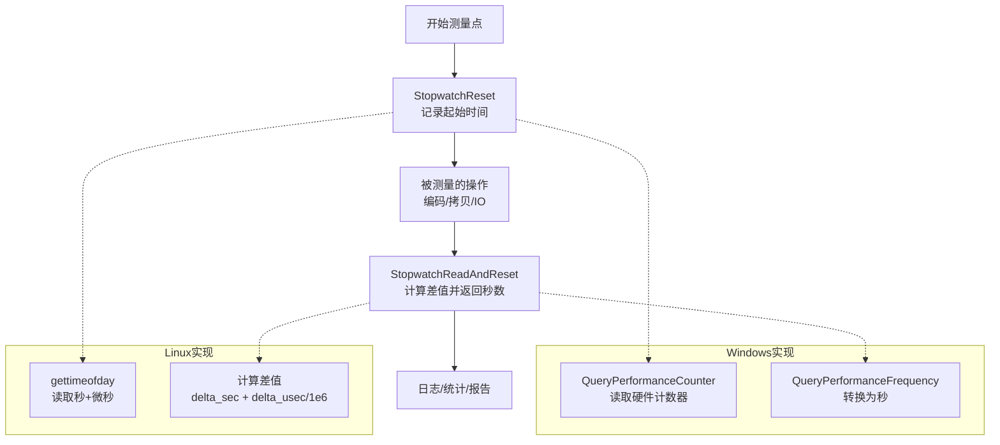
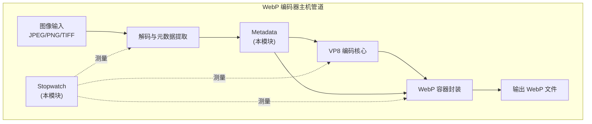

# shared_metadata_and_timing_utilities 模块深度解析

## 一句话概括

这个模块是 WebP 编码器主机端的基础设施层，提供**图像元数据的统一容器**和**跨平台高精度计时**两项能力。它解决了编码管道中「如何无损携带 EXIF/ICC/XMP 等附属数据」以及「如何在 Windows/Linux 上获得一致的微秒级性能测量」这两个看似无关、实则都是**底层基础设施**的问题。

---

## 1. 这个模块解决什么问题？

### 1.1 元数据管理的痛点

在图像编码器中，原始图像往往携带三类重要的元数据：

- **EXIF** (Exchangeable Image File Format): 包含拍摄参数（相机型号、光圈、ISO、GPS 位置等）
- **ICC Profile** (International Color Consortium): 色彩空间定义，决定图像如何被正确渲染
- **XMP** (Extensible Metadata Platform): 可扩展的元数据平台，支持版权信息、编辑历史等

**没有统一抽象时，每个编码器都要处理以下问题：**
- 如何分配/释放变长元数据缓冲区？
- 如何区分「空元数据」和「零长度元数据」？
- 如何在编码过程中安全地传递这些指针而不产生悬空引用？

### 1.2 性能计时的痛点

图像编码是计算密集型任务，编码器需要精确测量各个阶段的耗时（内核执行时间、内存拷贝时间、预处理时间等）。但不同平台的计时 API 差异巨大：

| 平台 | 高精度计时 API | 精度 | 特点 |
|------|---------------|------|------|
| Windows | `QueryPerformanceCounter` | ~1μs | 基于硬件计数器，需配合 `QueryPerformanceFrequency` 转换为秒 |
| Linux/Unix | `gettimeofday` | ~1μs | 传统 POSIX API，已被 `clock_gettime` 取代但仍广泛使用 |

**如果没有统一抽象：** 业务代码需要到处写 `#ifdef _WIN32`，测试和基准代码的可移植性极差。

---

## 2. 心智模型：如何理解这个模块？

### 2.1 类比：元数据系统就像一个「文件柜」

想象一个有三层抽屉的文件柜：

```
┌─────────────────────────────────────┐
│  Metadata (文件柜本体)              │
├─────────┬─────────┬─────────────────┤
│ EXIF    │ ICCP    │ XMP             │  ← 三个抽屉 (MetadataPayload)
│ 抽屉    │ 抽屉    │ 抽屉            │
├─────────┴─────────┴─────────────────┤
│ 每个抽屉内部:                        │
│   bytes → 指向实际文件内容的指针      │
│   size  → 文件的字节长度             │
└─────────────────────────────────────┘
```

**关键洞察：**
- `MetadataPayload` 只是「信封」——它本身不包含数据，只记录数据的地址和长度
- 三个元数据类型地位平等，但彼此独立——你可以只有 EXIF 而没有 ICCP
- 「空抽屉」的语义是 `bytes == NULL && size == 0`，与「零长度但已分配」不同

### 2.2 类比：计时系统就像一个「秒表」

```
┌────────────────────────────────────────────┐
│  Stopwatch (秒表抽象)                       │
│                                            │
│  外观统一:  reset() + read_and_reset()     │
│                                            │
│  内部实现因平台而异:                         │
│  ┌─────────────┐    ┌─────────────────┐     │
│  │ Windows     │    │ Linux/Unix      │     │
│  │ ─────────── │    │ ─────────────── │     │
│  │ LARGE_INT   │    │ struct timeval  │     │
│  │ (64位计数器) │    │ (秒 + 微秒)      │     │
│  │             │    │                 │     │
│  │ QPC() API   │    │ gettimeofday()  │     │
│  └─────────────┘    └─────────────────┘     │
└────────────────────────────────────────────┘
```

**关键洞察：**
- `Stopwatch` 是一个「编译期多态」的设计——通过 `#ifdef` 选择实现，而非运行期虚函数
- 测量的是「 wall-clock time」(真实经过时间)，而非 CPU 时间——这对于测量 I/O 和内核执行时间更合适
- 设计上支持「lap time」模式（`read_and_reset` 返回间隔并重置），而非累计计时

---

## 3. 数据流与控制流

### 3.1 元数据生命周期流程



**关键控制点：**

1. **分配策略：** 元数据缓冲区由调用方（如 `MetadataCopy` 或解析器代码）使用 `malloc` 分配，所有权立即转移给 `MetadataPayload`
2. **生命周期管理：** `MetadataFree` 会遍历三个 `MetadataPayload`，对每一个非空 `bytes` 调用 `free`，实现集中清理
3. **零拷贝考量：** 当前设计假设元数据会被多次使用（如预览、编码、保存），因此采用「指针+长度」而非「内联数组」，允许共享同一份底层数据

### 3.2 计时器使用流程



**关键控制点：**

1. **双模式设计：** Windows 路径使用 `LARGE_INTEGER` 和 QPC API；Unix 路径使用 `struct timeval` 和 `gettimeofday`——两种类型的内存布局完全不同，但通过 `typedef` 在编译期选择
2. **测量模式：** `StopwatchReadAndReset` 设计为「读取并归零」，支持连续的 lap 测量，而非累计计时。如果需要累计，调用方需自行累加返回值
3. **精度与开销权衡：** Windows 的 QPC 精度通常在微秒级以下，但有一定的读取开销；`gettimeofday` 在大多数 Linux 系统上也是微秒级，且通过 VDSO 实现用户态快速路径，开销更低

---

## 4. 设计决策与权衡

### 4.1 元数据设计：为什么不用 `std::vector` 或 `std::string`？

这是一个 C 模块（`extern "C"` 可见），但即使是 C++ 项目，这种设计也有深意：

| 方案 | 优点 | 缺点 | 本模块的选择 |
|------|------|------|-------------|
| `uint8_t*` + `size_t` (当前) | 零开销、可共享底层数据、与 C API 兼容 | 手动内存管理风险 | ✅ 选中 |
| `std::vector<uint8_t>` | 自动内存管理、RAII | 需要 C++ 运行时、不易与 C 代码互操作、深拷贝语义 | ❌ 不适用 |
| `std::unique_ptr<uint8_t[]>` | 独占所有权、自动释放 | 所有权单一，难以共享、需要 C++ | ❌ 不适用 |
| 内联固定大小数组 | 无堆分配、缓存友好 | 浪费内存（元数据大小差异大）、最大尺寸限制 | ❌ 不适用 |

**权衡的核心是「跨语言边界」和「零拷贝」：** 这个模块位于编码器主机端，需要与底层的 C 库（如 libexif、libjpeg）和上层的 C++ 业务代码同时交互。裸指针 + 长度是最通用的「最小公分母」。

### 4.2 计时器设计：为什么用 `#ifdef` 而不是策略模式？

```c
// 当前设计：编译期多态
#if defined _WIN32 && !defined __GNUC__
typedef LARGE_INTEGER Stopwatch;
// ... Windows 实现
#else
typedef struct timeval Stopwatch;
// ... Unix 实现
#endif
```

| 方案 | 运行时开销 | 代码复杂度 | 扩展性 | 本模块选择 |
|------|-----------|-----------|--------|-----------|
| `#ifdef` 条件编译 | 零开销 | 简单，集中在一个头文件 | 差（修改需重编译） | ✅ 选中 |
| 策略模式（虚函数/函数指针） | 一次间接跳转 | 需抽象基类 + 多态 | 好（运行时可切换） | ❌ 不适用 |
| 模板/CRTP | 零开销 | 复杂，C 不支持 | 中等 | ❌ 不适用 |

**权衡的核心是「性能敏感场景」和「工具类定位」：** 计时器被用于测量编码性能，本身需要在极轻量的开销下工作。这是一个「叶节点」工具模块，不会频繁扩展新平台，用 `#ifdef` 是最务实的选择。

### 4.3 内存管理：谁拥有 `bytes` 指针？

```c
typedef struct MetadataPayload {
    uint8_t* bytes;  // 谁分配？谁释放？
    size_t size;
} MetadataPayload;
```

**所有权规则（必须严格遵守）：**

1. **分配阶段：** `MetadataCopy` 内部使用 `malloc` 分配内存，成功后所有权转移给调用方
2. **持有阶段：** `Metadata` 结构体及其嵌套的 `MetadataPayload` 拥有 `bytes` 指针的生命周期管理权
3. **释放阶段：** 必须调用 `MetadataFree`（或 `MetadataPayloadDelete`）来释放，内部使用 `free`

**危险模式（新手易犯）：**

```c
// ❌ 错误：栈上数据赋给指针，会导致悬空指针或非法释放
uint8_t stack_data[100];
metadata.exif.bytes = stack_data;  // 灾难！

// ❌ 错误：重复释放（double free）
MetadataPayloadCopy(src, &dst);
MetadataFree(&dst);
MetadataFree(&dst);  // 未定义行为！

// ✅ 正确：使用提供的 API 管理生命周期
MetadataCopy(data, len, &payload);
// ... 使用 payload ...
MetadataPayloadDelete(&payload);  // 配对释放
```

---

## 5. 新贡献者须知：陷阱与最佳实践

### 5.1 内存管理检查清单

| 检查项 | 危险信号 | 正确做法 |
|--------|---------|---------|
| 指针来源 | 栈地址、字符串字面量 | 必须是 `malloc`/`calloc` 分配 |
| 所有权交接 | 模糊或共享所有权 | 明确转移给 `MetadataPayload` |
| 释放路径 | 直接 `free(payload.bytes)` | 使用 `MetadataPayloadDelete` 或 `MetadataFree` |
| 二次释放防护 | 调用 `free` 后置空指针 | 当前实现不自动置空，调用方需注意 |

### 5.2 计时器使用最佳实践

```c
// ✅ 正确：测量单次操作
Stopwatch sw;
StopwatchReset(&sw);
VP8Encode(...);  // 被测量的操作
double seconds = StopwatchReadAndReset(&sw);
LOG("编码耗时: %.3f ms", seconds * 1000);

// ✅ 正确：连续测量多个阶段（lap timing）
Stopwatch sw;
StopwatchReset(&sw);
do_preprocess();
double t1 = StopwatchReadAndReset(&sw);  // 阶段1耗时

do_encode();
double t2 = StopwatchReadAndReset(&sw);  // 阶段2耗时

do_postprocess();
double t3 = StopwatchReadAndReset(&sw);  // 阶段3耗时

// ❌ 错误：在循环内频繁重置导致累积误差
Stopwatch sw;
for (int i = 0; i < 1000; i++) {
    StopwatchReset(&sw);  // 每次迭代重置，无法测量总时间
    process_chunk(i);
}

// ✅ 正确：测量循环总时间
Stopwatch sw;
StopwatchReset(&sw);
for (int i = 0; i < 1000; i++) {
    process_chunk(i);
}
double total = StopwatchReadAndReset(&sw);
```

### 5.3 平台差异注意事项

**Windows 路径：**
- 使用 `QueryPerformanceCounter` (QPC)，基于硬件高性能计数器
- 精度通常在微秒甚至纳秒级，取决于 CPU 主频
- 注意：QPC 在早期的多核 CPU 上可能存在跨核心同步问题，现代 CPU 已修复

**Unix 路径：**
- 使用 `gettimeofday`，返回秒 + 微秒
- 精度受系统时钟分辨率限制，通常约 1-10 微秒
- 注意：`gettimeofday` 受系统时间调整影响（NTP 同步、管理员手动修改），不适合测量经过时间（elapsed time）
- **改进建议：** 现代代码应考虑使用 `clock_gettime(CLOCK_MONOTONIC, ...)`，它不受系统时间跳变影响

### 5.4 隐式契约与不变式

**Metadata 的不变式：**

```c
// 不变式1: 如果 bytes != NULL，则 size 必须 > 0
// （空元数据表示为 bytes=NULL, size=0，而非分配零字节）
assert((payload.bytes == NULL && payload.size == 0) ||
       (payload.bytes != NULL && payload.size > 0));

// 不变式2: bytes 指向的内存必须由 malloc/calloc 分配
// （不能使用栈地址、全局数据区地址、或 mmap 分配的地址）
// 这个不变式无法在运行时检查，是契约的一部分
```

**Stopwatch 的不变式：**

```c
// 不变式: 必须先调用 StopwatchReset 后才能调用 StopwatchReadAndReset
// （首次调用 ReadAndReset 前未 Reset 会导致读取垃圾值）
Stopwatch sw;
// ❌ 错误：未初始化就读取
double t = StopwatchReadAndReset(&sw);  // 未定义行为！

// ✅ 正确：先初始化
StopwatchReset(&sw);
// ... 稍后 ...
double t = StopwatchReadAndReset(&sw);  // 正确
```

---

## 6. 架构定位与依赖关系

### 6.1 在系统中的位置



### 6.2 上游依赖（本模块依赖谁）

| 依赖 | 用途 | 说明 |
|------|------|------|
| `<webp/types.h>` | 基础类型定义 (`uint8_t`, `size_t`, `WEBP_INLINE`) | 来自 libwebp 核心库 |
| `<windows.h>` (Win) | `LARGE_INTEGER`, `QueryPerformanceCounter` | 平台特定头文件 |
| `<sys/time.h>` (Unix) | `struct timeval`, `gettimeofday` | POSIX 标准头文件 |
| `<stddef.h>` | `offsetof` 宏 | 标准 C 库 |
| `<string.h>` | `memcpy` | 标准 C 库 |

### 6.3 下游依赖（谁依赖本模块）

本模块位于 `webp_encoder_host_pipeline` 子树下，预期被以下模块使用：

- **图像解码后端** ([other_image_decode_backends](codec_acceleration_and_demos-jpeg_and_resize_demos-jxl_and_pik_encoder_acceleration-webp_encoder_host_pipeline-other_image_decode_backends.md)): 从源图像提取元数据时构造 `Metadata`
- **编码器主机管道** ([webp_encoder_host_pipeline](codec_acceleration_and_demos-jpeg_and_resize_demos-jxl_and_pik_encoder_acceleration-webp_encoder_host_pipeline.md)): 在编码过程中携带元数据，最终写入 WebP 容器
- **动画与 GIF 帧处理** ([animation_and_gif_frame_handling](codec_acceleration_and_demos-jpeg_and_resize_demos-jxl_and_pik_encoder_acceleration-webp_encoder_host_pipeline-animation_and_gif_frame_handling.md)): 每帧可能携带独立的元数据

---

## 7. 关键 API 参考

### 7.1 Metadata API

```c
// 初始化：将所有 payload 置为空 (bytes=NULL, size=0)
void MetadataInit(Metadata* const metadata);

// 删除单个 payload：释放 bytes 内存，重置为 NULL/0
void MetadataPayloadDelete(MetadataPayload* const payload);

// 释放整个 Metadata：遍历三个 payload 并删除
void MetadataFree(Metadata* const metadata);

// 拷贝元数据内容：分配新内存，复制内容，存入 payload
// 返回 0 表示成功，非零表示分配失败
int MetadataCopy(const char* metadata, size_t metadata_len, 
                 MetadataPayload* const payload);
```

### 7.2 Stopwatch API

```c
// 重置计时器：记录当前时间为起始点
static WEBP_INLINE void StopwatchReset(Stopwatch* watch);

// 读取经过时间（秒）并重置计时器
// 返回值：自上次 Reset 以来经过的秒数（浮点）
static WEBP_INLINE double StopwatchReadAndReset(Stopwatch* watch);
```

**重要：** `Stopwatch` 是 `typedef` 的别名，实际类型取决于平台。不要尝试直接访问其内部字段——始终使用提供的 API。

---

## 8. 总结：设计哲学

这个模块体现了**最小有效抽象**的设计哲学：

1. **不做过多假设：** `MetadataPayload` 只是一个「指针+长度」，不假设数据格式（EXIF 是 TIFF 格式、ICC 是配置文件、XMP 是 XML），这些留给上层解析

2. **显式优于隐式：** 内存管理完全显式（`Init`/`Copy`/`Free`），不使用 RAII 或隐式析构，因为这是一个 C 兼容层，可能被纯 C 代码调用

3. **平台差异局部化：** `Stopwatch` 的平台差异被完全封装在头文件的 `#ifdef` 块中，对调用者完全透明——这是「编译期多态」的典型应用

4. **零开销抽象：** 没有虚函数、没有运行时类型信息、没有异常——一切都是确定性的零开销设计

---

## 9. 延伸阅读与相关模块

- **元数据规范参考:**
  - [EXIF 2.3 规范](https://www.cipa.jp/std/documents/e/DC-008-2012_E.pdf)
  - [ICC.1:2010 色彩配置文件规范](https://www.color.org/icc_specs2.xalter)
  - [Adobe XMP 规范](https://github.com/adobe/XMP-Toolkit-SDK)

- **相关模块文档:**
  - [其他图像解码后端](codec_acceleration_and_demos-jpeg_and_resize_demos-jxl_and_pik_encoder_acceleration-webp_encoder_host_pipeline-other_image_decode_backends.md) - 元数据的主要来源
  - [WebP 编码器主机管道概览](codec_acceleration_and_demos-jpeg_and_resize_demos-jxl_and_pik_encoder_acceleration-webp_encoder_host_pipeline.md) - 本模块在整个管道中的角色
  - [容器复用与特性选择](codec_acceleration_and_demos-jpeg_and_resize_demos-jxl_and_pik_encoder_acceleration-webp_encoder_host_pipeline-container_mux_and_feature_selection.md) - 元数据如何被打包进 WebP 容器
