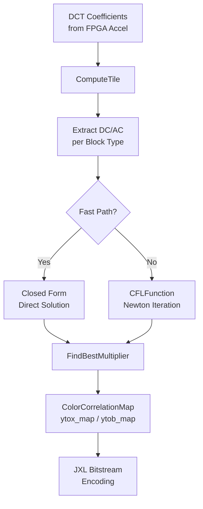

# Chroma from Luma Modeling (CfL) 模块深度解析

## 概述：为什么需要这个模块？

想象你正在压缩一张彩色照片。传统的做法是将 RGB 三个通道分别进行 DCT 变换后独立编码。但这里有个问题：**亮度（Luma）和色度（Chroma）之间往往存在强相关性**——明亮的区域可能偏向某种色调，阴影部分则可能有不同的色彩倾向。

**Chroma from Luma (CfL)** 是一种利用这种相关性的预测技术。与其独立编码色度通道，不如尝试用亮度通道来"猜测"色度值，只编码预测误差（残差）。CfL 的核心优化问题是：**找到一个最佳的线性系数 `x`，使得 `chroma ≈ x * luma + base`**。

这个模块就是负责解决这个优化问题的加速实现。它位于 JPEG XL 编码器的核心路径上，直接决定了色度预测的精度，进而影响压缩率。

---

## 架构与数据流



### 核心组件职责

| 组件 | 职责 | 关键算法 |
|------|------|----------|
| `CFLFunction` | 目标函数及其导数计算 | SIMD 向量化残差求和 |
| `FindBestMultiplier` | 求解最优相关系数 | Fast: 闭式解 / Slow: Newton-Raphson |
| `ComputeTile` | 分块处理图像，管理 DCT 系数内存布局 | 多尺度 DCT (8x8~32x32) 处理 |
| `InitDCStorage` | DC 系数缓冲区管理 | Highway SIMD 对齐分配 |

---

## 核心机制详解

### 1. 优化问题的数学直觉

CfL 试图最小化以下目标函数（简化版）：

$$f(x) = \frac{1}{3} \sum_{i} ((|r_i(x)| + 1)^2 - 1) + \lambda x^2 n$$

其中：
- $r_i(x) = a_i x + b_i$ 是第 $i$ 个像素的色度残差
- $a_i$ 是亮度分量（经过颜色因子缩放）
- $b_i$ 是基准偏移量
- $\lambda$ (`distance_mul`) 是正则化系数，防止过拟合
- 第二项 $x^2$ 惩罚过大的相关系数，鼓励保守预测

**关键洞察**：这是一个光滑的凸优化问题，可以使用梯度下降或牛顿法高效求解。

### 2. CFLFunction：向量化残差计算

`CFLFunction::Compute` 是这个模块的计算核心。它使用 **Google Highway** 库实现 SIMD 向量化，同时支持 x86 (SSE/AVX2/AVX-512)、ARM NEON 等架构。

```cpp
// 伪代码：核心计算逻辑
for (size_t i = 0; i < num; i += Lanes(df)) {
    // 加载亮度系数
    auto a = inv_color_factor * Load(df, values_m + i);
    // 加载基准偏移
    auto b = base_v * Load(df, values_m + i) - Load(df, values_s + i);
    // 计算残差: v = a*x + b
    auto v = a * x_v + b;
    // 计算导数（符号函数处理）
    auto d = coeffx2 * (Abs(v) + one) * a;
    d = IfThenElse(v < zero, zero - d, d);  // 符号修正
    // 阈值截断：忽略过大的残差
    fd_v += IfThenElse(Abs(v) >= thres, zero, d);
}
```

**设计细节**：
- **阈值处理** (`kThres = 100.0f`)：忽略绝对值超过 100 的残差，防止 outliers 主导优化
- **符号处理**：使用 `IfThenElse` 替代分支，保持 SIMD 效率
- **内存对齐**：`JXL_RESTRICT` 和 `HWY_ALIGN` 提示编译器进行激进优化

### 3. FindBestMultiplier：双路径求解策略

这是模块的关键决策点，体现了 **性能与精度的权衡**：

#### Fast Path（快速路径）
当 `fast=true` 时，使用**闭式解**（Closed-form Solution）：

$$x = -\frac{\sum a_i b_i}{\sum a_i^2 + \frac{n \lambda}{2}}$$

推导思路：假设残差函数是简单的二次型，直接令导数为零求解。这是一个 $O(n)$ 的向量运算，极快。

#### Slow Path（精确路径）
当 `fast=false` 时，使用 **Newton-Raphson 迭代**：

```cpp
for (size_t i = 0; i < 20; i++) {
    float df = fn.Compute(x, eps, &dfpeps, &dfmeps);  // 一阶导
    float ddf = (dfpeps - dfmeps) / (2 * eps);       // 二阶导（数值近似）
    float step = df / ddf;
    x -= std::min(kClamp, std::max(-kClamp, step));  // 步长裁剪
    if (std::abs(step) < 3e-3) break;
}
```

**设计考量**：
- **导数近似**：使用中心差分 `(f(x+ε) - f(x-ε)) / 2ε` 近似二阶导，避免解析求导的复杂性
- **步长限制** (`kClamp = 20.0f`)：防止 Newton 法在初始阶段震荡
- **提前终止**：当步长小于 0.003 时认为收敛

### 4. ComputeTile：多尺度 DCT 系数管理

这是与硬件加速器（FPGA）接口的关键函数。它处理从 FPGA 接收的预计算 DCT 系数，而非自己进行 DCT 变换。

**DCT 策略映射**：
代码中 `acs.RawStrategy()` 映射到不同的 DCT 尺寸：
- 0: DCT 8x8（最常用）
- 1: IDT (Integer Discrete Transform)
- 2: DCT 2x2
- 3: DCT 4x4
- 4: DCT 16x16（覆盖 2x2 个 8x8 块）
- 5: DCT 32x32（覆盖 4x4 个 8x8 块）

**内存布局复杂性**：
对于大 DCT（16x16, 32x32），系数需要重新索引：
```cpp
// 16x16 DCT: 一个块覆盖 2x2 个 8x8 位置
dc_y[i * xs + j] = dc16x16[1][4 * (y / 2 * (tile_xsize / 16) + x / 2) + i * 2 + j];
```
这要求调用者（FPGA 侧）和 CPU 侧对 tile 尺寸、步长有严格一致的约定。

---

## 设计决策与权衡

### 1. SIMD 抽象层选择：Highway vs. 原生 intrinsics

**决策**：使用 Google Highway 而非手写 SSE/AVX/NEON 代码。

**权衡**：
- **收益**：一次编写，多平台运行（x86, ARM, RISC-V）；自动利用最新指令集（AVX-512, SVE）
- **代价**：抽象层增加，对编译器优化要求更高；某些特定模式可能不如手写 intrinsics 高效
- **风险**：Highway 库的版本兼容性，构建系统复杂度

**为什么在这里合理**：CfL 计算是简单的逐元素向量运算（加载-计算-存储），正好是 Highway 的甜点场景，不需要复杂的 shuffle 或水平运算。

### 2. Fast vs. Slow Path 的动态选择

**决策**：通过 `bool fast` 参数在编译期/运行期选择算法，而非固定实现。

**权衡**：
- **收益**：单一代码库同时支持"草稿质量"（快速编码）和"出版质量"（慢速优化）；便于调试（可用 fast 路径验证逻辑）
- **代价**：代码分支增加，测试矩阵翻倍；fast 路径的近似误差可能导致视觉质量下降，需要仔细调校阈值

**架构洞察**：这体现了编码器设计的经典分层——**速度层（Speed Tier）** 架构。CfL 计算是编码器最热的循环之一，能够根据质量/速度预算动态降级，是满足实时性要求的关键。

### 3. 硬件加速器耦合：FPGA 预计算 DCT

**决策**：由外部 FPGA 提供预计算的 DCT 系数，而非 CPU 现场计算。

**权衡**：
- **收益**：极大降低 CPU 负载，使 CPU 专注于编码决策（如 CfL 系数优化）；DCT 是高度规则的计算，适合 FPGA 流水线并行
- **代价**：**紧耦合的接口契约**——CPU 和 FPGA 必须对 tile 尺寸、步长、内存布局有完全一致的理解；调试困难（需要跨硬件/软件边界定位问题）；数据搬运开销（PCIe/DMA 带宽可能成为瓶颈）

**设计模式**：这是 **Compute Offloading（计算卸载）** 模式。`ComputeTile` 函数实际上是一个 **适配器（Adapter）**，将 FPGA 的"原始数据视图"转换为 CPU 算法期望的"逻辑块视图"。那些 `acs.RawStrategy()` 的 switch-case 就是在处理不同 DCT 尺寸下的索引重映射。

### 4. 数值稳定性与阈值设计

**决策**：在 `CFLFunction` 中设置 `kThres = 100.0f` 截断大残差，使用 `kClamp = 20.0f` 限制 Newton 步长。

**权衡**：
- **收益**：防止 outliers（如传感器噪声、边界伪影）扭曲 CfL 模型；避免 Newton 法在病态曲率区域震荡发散
- **代价**：引入**非光滑性**（hard threshold）可能导致优化收敛到次优解；阈值选择依赖经验，可能需要针对不同内容调优

**工程洞察**：这些常数是 **Magic Numbers**，反映了真实世界图像统计特性。100.0f 的阈值暗示了 JPEG XL 内部使用的色度值动态范围（可能是经过颜色变换后的 XYB 空间）。这种"硬截断"是一种**鲁棒统计（Robust Statistics）** 技术，类似 Huber 损失或 Tukey 双权重，但实现更简单（不需要平滑过渡）。

---

## 依赖关系与接口契约

### 上游调用者

本模块被 [jxl_and_pik_encoder_acceleration](codec_acceleration_and_demos-jxl_and_pik_encoder_acceleration.md) 的上层编码器逻辑调用：

1. **`CfLHeuristics::Init`**：在编码开始时分配 DC 值存储
2. **`CfLHeuristics::ComputeTile`**：对每个图像块（tile）计算 CfL 系数
3. **`CfLHeuristics::ComputeDC`**：在整帧级别计算 DC 分量的 CfL 系数

### 下游依赖

本模块依赖以下外部组件：

- **[ac_strategy_and_dct_transform_selection](codec_acceleration_and_demos-jxl_and_pik_encoder_acceleration-ac_strategy_and_dct_transform_selection.md)**：提供 `AcStrategy` 类型，决定使用哪种 DCT 尺寸（8x8, 16x16, 32x32 等）
- **Highway SIMD 库**：提供跨平台的 SIMD 抽象（`hwy/highway.h`）
- **lib/jxl 核心库**：提供 `Image3F`, `DequantMatrices`, `Quantizer` 等类型定义

### 数据契约（与 FPGA 的接口）

这是本模块最关键但也最容易出错的接口。`ComputeTile` 函数接收来自 FPGA 的预计算 DCT 系数，这些参数的类型和布局必须严格匹配：

```cpp
// FPGA 提供的 DCT 系数缓冲区（每个通道 3 个平面：Y, X, B）
std::vector<std::vector<float>>& dct8x8;    // 8x8 DCT 系数
std::vector<std::vector<float>>& dct16x16; // 16x16 DCT 系数
std::vector<std::vector<float>>& dct32x32; // 32x32 DCT 系数
// ... 其他尺寸

// DC 系数（每个块一个 DC 值）
std::vector<std::vector<float>>& dc8x8;
// ... 其他尺寸
```

**契约要求**：
1. **维度对齐**：`tile_xsize` 和 `tile_ysize` 必须向上对齐到 64 像素边界（`(xsize + 63) / 64 * 64`）
2. **索引映射**：对于 16x16 DCT，每个块覆盖 2x2 个 8x8 位置；对于 32x32，覆盖 4x4 个 8x8 位置。索引计算必须与 FPGA 侧完全一致
3. **通道顺序**：向量索引 `[0]` 对应 X 通道（Cb），`[1]` 对应 Y 通道（Luma），`[2]` 对应 B 通道（Cr）

---

## 使用指南与最佳实践

### 初始化流程

```cpp
// 1. 创建 CfLHeuristics 实例并初始化
CfLHeuristics cfl;
cfl.Init(opsin_image);  // 分配内部缓冲区

// 2. 对每个 tile 并行计算 CfL 系数
for (const Rect& tile : tiles) {
    cfl.ComputeTile(
        tile, opsin, dequant, ac_strategy, quantizer, 
        fast_mode, thread_id, &color_map,
        xsize, ysize,
        dctIDT, dct2x2, dct4x4, dct8x8, dct16x16, dct32x32,
        dcIDT, dc2x2, dc4x4, dc8x8, dc16x16, dc32x32
    );
}

// 3. 计算整帧 DC 分量的 CfL
cfl.ComputeDC(fast_mode, &color_map);
```

### 性能调优参数

| 参数 | 作用 | 建议值 |
|------|------|--------|
| `fast` (bool) | 使用快速闭式解（true）或精确牛顿迭代（false） | 实时编码=true，归档质量=false |
| `kDistanceMultiplierAC` | AC 分量的正则化强度 | 1e-3f（固定） |
| `kDistanceMultiplierDC` | DC 分量的正则化强度 | 1e-5f（固定，更弱） |
| `kThres` | 残差截断阈值 | 100.0f（过滤 outliers） |

### 常见陷阱与注意事项

#### 1. SIMD 对齐要求

所有传递给 `CFLFunction` 的指针必须对齐到 SIMD 向量宽度（通常是 32 字节或 64 字节）。虽然代码使用 `JXL_RESTRICT` 和 `HWY_ALIGN` 提示，但如果输入数据来自未对齐的内存，会导致崩溃或性能骤降。

**检查方法**：
```cpp
JXL_ASSERT(reinterpret_cast<uintptr_t>(values_m) % HWY_ALIGN == 0);
```

#### 2. Newton 迭代的数值稳定性

`slow` 路径使用有限差分近似 Hessian：
```cpp
float ddf = (dfpeps - dfmeps) / (2 * eps);
```

当残差函数接近线性时（`dfpeps ≈ dfmeps`），这会放大浮点舍入误差。`kClamp = 20.0f` 的步长限制是为了防止在此情况下步长爆炸。

**调试建议**：如果遇到收敛失败（返回 `NaN` 或极大值），检查输入数据是否存在全零块或恒定值块。

#### 3. FPGA 数据版本同步

`ComputeTile` 对 `acs.RawStrategy()` 的 switch-case 假设 FPGA 和 CPU 对 DCT 块索引的计算方式完全一致。如果 FPGA 固件更新改变了 tile 填充（padding）策略或索引顺序，CPU 侧的系数提取会错位，导致视觉上出现块状伪影（blocky artifacts）。

**版本控制建议**：在 FPGA 位流（bitstream）和 CPU 代码之间维护一个版本哈希，启动时校验。

#### 4. 颜色空间混淆

代码中使用了 `kYToBRatio` 和 `kDefaultColorFactor` 等常数，这些假设输入是 **XYB 颜色空间**（JPEG XL 的内部表示），而非 YCbCr。

**切勿**将此模块直接用于 YCbCr 数据，颜色相关性假设完全不同，会导致严重的色度漂移。

---

## 扩展与修改指南

### 添加新的 DCT 尺寸支持

当前支持 8x8, 16x16, 32x32 以及变体（IDT, 2x2, 4x4）。要添加 64x64 支持：

1. **在 `ComputeTile` 中添加新的分支**：
```cpp
else if (acs.RawStrategy() == 6) {  // 假设 6 代表 64x64
    for (int i = 0; i < 64 * 64; i++) {
        block_y[i] = dct64x64[1][64*64*(y/8*(tile_xsize/64) + x/8) + i];
    }
}
```

2. **更新 DC 提取逻辑**：64x64 覆盖 8x8 个基础块，需要双重嵌套循环。

3. **内存布局对齐**：确保 `dct64x64` 向 FPGA 传递时，`tile_xsize` 对齐到 128 像素（64 的倍数）。

### 调整优化目标函数

如果想修改 CfL 的优化目标（例如使用 Huber 损失替代平方损失）：

1. **修改 `CFLFunction::Compute`**：
```cpp
// 当前：二次损失 (|v| + 1)^2 - 1
// 改为 Huber 损失：
auto huber = IfThenElse(av <= kDelta, 
    av * av * 0.5f,  // 二次区
    kDelta * (av - 0.5f * kDelta));  // 线性区
```

2. **注意导数连续性**：Huber 损失在 `|v| = kDelta` 处导数连续，适合 Newton 法，但需调整 `kThres` 与之匹配。

3. **性能影响**：Huber 损失的分支（二次 vs 线性）会降低 SIMD 效率，因为 `IfThenElse` 需要计算两边然后选择。

---

## 总结

`chroma_from_luma_modeling` 是 JPEG XL 编码器中**计算密度最高、数值精度最敏感**的模块之一。它的设计体现了几个关键工程原则：

1. **算法与硬件协同设计**：优化问题的选择（凸优化、可导目标）既考虑了压缩效率，也考虑了 FPGA 实现的可行性。

2. **性能分层**：通过 `fast/slow` 双路径，在单一代码库中同时支持实时流式编码和归档级质量，避免了维护两套实现。

3. **跨平台 SIMD 抽象**：Highway 的使用确保了对新指令集的自动适配，降低了长期维护成本。

对于新加入的开发者，理解这个模块的关键是把握 **"预测即优化"** 的核心思想：编码器不是在"猜测"色度值，而是在求解一个精心设计的优化问题，而硬件加速使得这个求解过程足够快，能够融入实际的编码流程。
