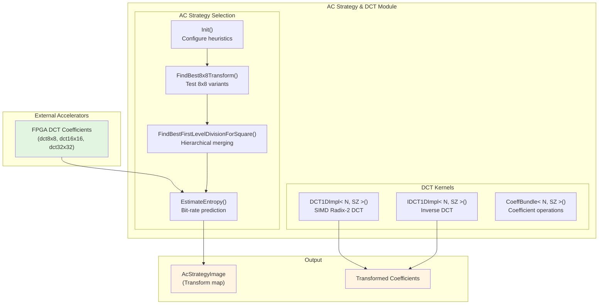

# AC Strategy and DCT Transform Selection

This module serves as the **mathematical engine and decision-making brain** for the JPEG XL encoder's transform pipeline. It bridges high-level compression strategy with low-level computational kernels, determining *which* frequency transforms to apply to image regions, and providing heavily optimized SIMD implementations of those transforms.

Think of this module as a **"frequency domain optimizer"**: for every 8×8 pixel block in an image, it must decide whether to use a small 8×8 DCT, merge neighboring blocks into larger 16×16 or 32×32 transforms, or use specialized transforms like AFV (Adaptive Filter Variance) or IDT (Identity). These decisions directly determine the compression efficiency and visual quality of the encoded image.

The module consists of two tightly coupled subsystems:

1. **DCT SIMD Kernels** (`acc_dct-inl.h`): A template-metaprogrammed, SIMD-optimized implementation of the Discrete Cosine Transform and its inverse, using recursive radix-2 algorithms and the Highway portable SIMD library.

2. **AC Strategy Selection** (`acc_enc_ac_strategy.cpp`): A heuristic search algorithm that hierarchically merges small transform blocks into larger ones based on entropy (bit-rate) estimation, balancing compression efficiency against encoding speed.

## Key Design Decisions

### 1. **Hierarchical Bottom-Up Transform Merging**
The AC strategy selection uses a **greedy hierarchical merging** approach rather than exhaustive search or dynamic programming. Starting with 8×8 blocks (the fundamental unit), it attempts to merge 2×2 groups of blocks into larger transforms (16×16, then 32×32, etc.) only if the estimated entropy (bit-rate) decreases.

**Tradeoff**: This approach is $O(N \log N)$ in the number of blocks, making it feasible for real-time encoding, but it may miss globally optimal transform configurations that would require $O(2^N)$ search. The heuristic assumes that transform boundaries align well with 8×8 boundaries, which holds for most natural images.

### 2. **Pre-computed vs. On-Demand DCT**
The module relies on **pre-computed DCT coefficients** supplied by external FPGA accelerators (evidenced by the `dct8x8`, `dct16x16`, `dct32x32` input vectors) for entropy estimation, but provides its own **on-demand SIMD DCT kernels** for the actual encoding pipeline.

**Tradeoff**: This dual approach allows the strategy selection to evaluate transform options quickly using pre-computed data (avoiding redundant DCT calculations), while maintaining software fallback capability for the actual transformation of pixel data. However, it requires careful memory management to ensure the pre-computed buffers remain valid and aligned during the strategy selection phase.

### 3. **SIMD Abstraction via Highway Templates**
The DCT implementation uses **template metaprogramming** with the Highway portable SIMD library (`hwy/highway.h`) rather than platform-specific intrinsics (SSE, AVX, NEON). The `DCT1DImpl<N, SZ>` and `CoeffBundle<N, SZ>` templates recursively instantiate optimized code for different transform sizes (N) and SIMD lane counts (SZ).

**Tradeoff**: This approach achieves near-assembly performance while maintaining portability across x86, ARM, and other architectures. However, the heavy use of C++ templates increases compile times and binary size due to code duplication for each (N, SZ) instantiation. The recursive template instantiation also limits the maximum transform size to compile-time constants (typically powers of 2 up to 256).

## Sub-Module Summaries

### DCT SIMD Kernels ([acc_dct-inl.h](codec_acceleration_and_demos-jxl_and_pik_encoder_acceleration-host_acceleration_timing_and_phase_profiling-ac_strategy_and_dct_transform_selection-dct_simd_kernels.md))

Provides heavily optimized 1D and 2D Discrete Cosine Transform implementations using recursive radix-2 algorithms and portable SIMD vectorization. This sub-module contains template-based implementations of the **Lowest Complexity Self Recursive Radix-2 DCT II/III algorithms**, optimized for power-of-two transform sizes from 8 to 256.

Key abstractions include:
- **`FV<SZ>`**: Type alias for float vectors with `SZ` lanes, using Highway's `HWY_CAPPED` or `HWY_FULL` types
- **`CoeffBundle<N, SZ>`**: Encapsulates coefficient operations including reversal, butterfly operations (B and BTranspose), and matrix transposition for the DCT algorithm
- **`DCT1DImpl<N, SZ>`**: Recursive template implementing 1D DCT via divide-and-conquer decomposition into smaller DCTs

The implementation uses **in-place algorithms** with scratch buffers, requiring `HWY_ALIGN` aligned memory for SIMD loads/stores. It handles both standard square transforms (8×8, 16×16) and rectangular transforms (8×16, 16×32) through wrapper templates `ComputeScaledDCT` and `ComputeTransposedScaledDCT`.

### AC Strategy Selection ([acc_enc_ac_strategy.cpp](codec_acceleration_and_demos-jxl_and_pik_encoder_acceleration-host_acceleration_timing_and_phase_profiling-ac_strategy_and_dct_transform_selection-ac_strategy_heuristics.md))

Implements the **adaptive coefficient strategy selection** heuristic for the JPEG XL encoder. This sub-module decides which frequency transform (DCT size and type) to apply to each 8×8 pixel block or merged group of blocks in the input image. The goal is to minimize the encoded bit-rate while maintaining visual quality.

The selection process uses a **hierarchical bottom-up merging strategy**:
1. **Initialization**: Start with 8×8 blocks and evaluate all available 8×8 transform types (DCT8, DCT4×4, DCT2×2, IDT, AFV, etc.)
2. **Entropy Estimation**: For each candidate transform, predict the bit-rate using `EstimateEntropy()`, which combines quantized coefficient statistics with masking heuristics
3. **Hierarchical Merging**: Attempt to merge 2×2 groups of blocks into larger transforms (16×16, 32×32) only if the estimated entropy decreases, using `FindBestFirstLevelDivisionForSquare()`

Key data structures:
- **`MergeTry`**: Configuration for a merge attempt, specifying transform type, priority, and entropy multiplier
- **`TransformTry8x8`**: Configuration for 8×8 transform evaluation with speed tier limits and entropy adjustments
- **`ACSConfig`**: Bundle of quantization tables, masking fields, and source image pointers for entropy estimation

The module interacts with **external FPGA accelerators** that provide pre-computed DCT coefficients for entropy estimation, but can fall back to software DCT implementations for the final encoding pass.

## Cross-Module Dependencies

### Upstream Dependencies (What this module needs)

- **[codec_acceleration_and_demos-jxl_and_pik_encoder_acceleration-chroma_from_luma_modeling](../codec_acceleration_and_demos-jxl_and_pik_encoder_acceleration-chroma_from_luma_modeling.md)**: The AC strategy selection reads chroma-from-luma (CfL) correlation factors (`cmap_factors`) from the CfL modeling module to adjust entropy estimates for chroma planes.

- **[codec_acceleration_and_demos-jxl_and_pik_encoder_acceleration-histogram_cluster_pair_structures](../codec_acceleration_and_demos-jxl_and_pik_encoder_acceleration-histogram_cluster_pair_structures.md)**: Uses entropy coding context models from the histogram module during `EstimateEntropy()` to predict bit-rates accurately.

- **FPGA/Accelerator Drivers (implied)**: The `EstimateEntropy()` function reads pre-computed DCT coefficients from external hardware accelerators via the `dct8x8`, `dct16x16`, `dct32x32` vectors passed to `ProcessRectACS()`.

### Downstream Dependencies (What needs this module)

- **[codec_acceleration_and_demos-jxl_and_pik_encoder_acceleration-host_acceleration_timing_and_phase_profiling-lossy_encode_compute_host_timing](../codec_acceleration_and_demos-jxl_and_pik_encoder_acceleration-host_acceleration_timing_and_phase_profiling-lossy_encode_compute_host_timing.md)**: The AC strategy decisions and DCT transforms are timed and profiled during the lossy encoding phase.

- **Quantization Module (implied)**: The `AcStrategyImage` produced by this module guides the quantizer in determining which quantization matrices to apply to different transform sizes.

- **Bitstream Writer (implied)**: The transform sizes and types selected by this module are encoded into the JPEG XL bitstream so the decoder knows which inverse transforms to apply.

## Operational Considerations

### Memory Alignment Requirements
The DCT kernels require **16-byte or 64-byte aligned memory** (depending on SIMD width) for `HWY_ALIGN` buffers. The `EstimateEntropy()` function uses `hwy::AllocateAligned<float>()` to ensure proper alignment for scratch buffers.

### Thread Safety
The module is **not thread-safe** for the strategy selection phase (`ProcessRectACS()`), as it modifies the shared `AcStrategyImage` and uses scratch buffers. However, the DCT kernels (`DCT1D`, `IDCT1D`) are **stateless and thread-safe**, operating only on their input/output buffers.

### Speed Tiers
The module respects JPEG XL's "speed tier" settings (`cparams.speed_tier`):
- **kCheetah/Falcon**: Skips strategy selection entirely, uses DCT8 everywhere
- **kHare**: Limits transform exploration, disables non-aligned merging
- **kTortoise**: Full exploration including 64×64 transforms and AFV variants

### Debugging and Visualization
When `WantDebugOutput()` returns true, the module generates visualizations of the AC strategy decisions using `DumpAcStrategy()`, which creates color-coded images showing which transform size was selected for each block (e.g., yellow for DCT8, green for DCT16, cyan for DCT32).