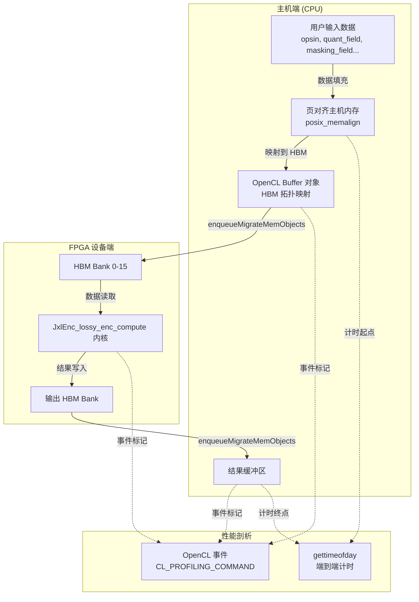

# lossy_encode_compute_host_timing 模块深度解析

## 概述

想象你正在指挥一场复杂的交响乐演出，但乐手们分散在两个不同的城市——一部分在 CPU 所在的"本地排练厅"，另一部分在 FPGA 芯片上的"远程演奏厅"。`lossy_encode_compute_host_timing` 模块就是那个站在中间的指挥家，它负责确保乐谱（数据）准确、高效地在两个场地之间传递，同时精确记录每个环节耗时，让你知道演出瓶颈到底在哪里。

这个模块是 JPEG XL（JXL）有损编码加速 pipeline 的**主机端 orchestrator**。它不直接执行繁重的图像编码计算，而是负责：

1. **内存编排**：在主机侧分配页对齐内存，映射到 FPGA 的 HBM（高带宽内存）特定 bank
2. **数据搬运**：通过 OpenCL 队列将输入数据（opsin 通道、量化场、掩码场等）从主机 DRAM 传输到 FPGA HBM
3. **内核调度**：启动 FPGA 内核 `JxlEnc_lossy_enc_compute` 执行实际的编码计算
4. **结果回收**：将输出数据（AC 系数、DC 分量、编码策略等）从 FPGA 传回主机
5. **性能剖析**：使用 OpenCL 事件和 `gettimeofday` 精确测量 H2D 传输、内核执行、D2H 传输和端到端耗时

这个模块体现了异构计算中典型的"主机-加速器"分层架构：CPU 负责控制流和 I/O，FPGA 负责数据并行计算。理解它的关键在于把握**内存拓扑映射**（HBM bank 分配）和**异步流水线**（数据传输与计算重叠）这两个核心概念。

---

## 架构设计

### 整体数据流图



### 组件角色说明

#### 1. 内存管理层

这一层负责解决异构计算中最棘手的问题：**指针在不同地址空间中的含义完全不同**。主机侧的指针指向 DRAM，FPGA 侧的指针指向 HBM，两者不能直接互通。

- **`posix_memalign` 分配器**：确保主机缓冲区按 4096 字节页边界对齐，这是 Xilinx FPGA 进行 DMA 传输的硬性要求。未对齐的内存会导致数据传输失败或性能骤降。
  
- **HBM 拓扑映射**：通过 `cl_mem_ext_ptr_t` 和 `XCL_MEM_TOPOLOGY` 标志，将每个 OpenCL buffer 显式绑定到特定的 HBM bank（0-15）。这不是可选的优化，而是正确性要求——内核代码期望特定数据位于特定 HBM bank。

#### 2. 数据传输层

这一层实现了**异步流水线**，允许数据传输与计算重叠，隐藏延迟。

- **三阶段事件链**：
  1. `events_write`：H2D 传输完成事件
  2. `events_kernel`：内核执行完成事件（依赖 `events_write`）
  3. `events_read`：D2H 传输完成事件（依赖 `events_kernel`）

- **依赖链构建**：通过 `&events_write` 传递给 `enqueueTask`，确保内核只在数据传输完成后启动；通过 `&events_kernel` 传递给 `enqueueMigrateMemObjects`，确保结果回传只在内核完成后启动。

#### 3. 内核控制层

这一层是 FPGA 的"遥控器"。

- **内核对象创建**：从 xclbin 文件中加载编译好的 FPGA 比特流，创建 `cl::Kernel` 对象。每个内核参数通过 `setArg` 绑定到对应的 OpenCL buffer。

- **队列配置**：使用 `CL_QUEUE_PROFILING_ENABLE` 启用 OpenCL 事件计时，`CL_QUEUE_OUT_OF_ORDER_EXEC_MODE_ENABLE` 允许命令乱序执行（配合事件依赖实现流水线）。

#### 4. 性能剖析层

这一层回答了"时间花在哪里"的关键问题。

- **OpenCL 事件计时**：通过 `CL_PROFILING_COMMAND_START/END` 获取设备端精确时间戳（纳秒级），分别测量 H2D、内核、D2H 三个阶段。

- **端到端计时**：使用 `gettimeofday` 测量主机侧感知总时间，包含 OpenCL 运行时开销、驱动 overhead 等，与设备端计时对比可识别"隐藏开销"。

---

## 核心组件详解

### `struct timeval` 计时结构

虽然代码中直接使用 `struct timeval`（来自 `<sys/time.h>`），但它承载了关键的时间测量职责。

**作用**：捕获主机侧的墙上时钟时间（wall-clock time），用于测量端到端延迟。

**使用模式**：
```cpp
struct timeval start_time;
gettimeofday(&start_time, 0);  // 起点
// ... FPGA 执行 ...
struct timeval end_time;
gettimeofday(&end_time, 0);    // 终点
unsigned long e2e_time = diff(&end_time, &start_time);  // 微秒级差值
```

**设计权衡**：选择 `gettimeofday` 而非 `std::chrono` 或 `clock_gettime(CLOCK_MONOTONIC)`，可能是因为：
1. 与现有 C 风格代码库保持一致性
2. 跨平台兼容性（尽管这是 Xilinx 特定代码）
3. 微秒级精度已满足需求，无需纳秒级 `CLOCK_MONOTONIC`

**潜在风险**：`gettimeofday` 受系统时间调整影响（NTP 跳变），若系统时间回调，可能导致负值。生产环境建议使用 `CLOCK_MONOTONIC`。

### `hls_lossy_enc_compute_wrapper` 函数

这是模块的核心 orchestrator，一个长达 400+ 行的函数，协调了 FPGA 加速的完整生命周期。

#### 函数签名解析

```cpp
void hls_lossy_enc_compute_wrapper(
    std::string xclbinPath,          // FPGA 比特流文件路径
    int config[MAX_NUM_CONFIG],      // 整数配置数组（mm15）
    float config_fl[MAX_NUM_CONFIG], // 浮点配置数组（mm16）
    float* hls_opsin_1,              // Opsin 通道 1（mm1）
    float* hls_opsin_2,              // Opsin 通道 2（mm2）
    float* hls_opsin_3,              // Opsin 通道 3（mm3）
    float* hls_quant_field,          // 量化场（mm4）
    float* hls_masking_field,        // 掩码场（mm5）
    float* aq_map_f,                 // 自适应量化映射（mm6）
    int8_t* cmap_axi,                // 颜色映射输出（mm7）
    int* ac_coef_axiout,             // AC 系数输出（mm8）
    uint8_t* strategy_all,           // 编码策略输出（mm9）
    int* raw_quant_field_i,          // 原始量化场输出（mm10）
    uint32_t* hls_order,             // 扫描顺序输出（mm11）
    float* hls_dc8x8,                // 8x8 DC 分量输出（mm12）
    float* hls_dc16x16,              // 16x16 DC 分量输出（mm13）
    float* hls_dc32x32               // 32x32 DC 分量输出（mm14）
);
```

**参数设计洞察**：
- **分离的整数/浮点配置数组**：`config` 和 `config_fl` 分开传递，反映了硬件内核可能使用不同的 AXI 接口宽度或存储体（bank）来优化访问模式。
- **明确的内存接口编号**（mm1-mm16）：注释中的 "mm" 编号对应硬件 RTL 中的 AXI 内存映射接口，这是硬件/软件协同设计的痕迹——软件必须严格匹配硬件的端口分配。
- **分离的 Opsin 通道**：三个独立的 `float*` 而非一个 `float[3][]`，可能是因为硬件流水线需要独立的流式输入，避免 bank conflict。

#### 执行阶段详解

**阶段 1：FPGA 环境初始化（HLS_TEST 保护块外）**

```cpp
#ifndef HLS_TEST
// OpenCL 上下文创建、设备选择、xclbin 加载...
```

- **平台发现**：`xcl::get_xil_devices()` 自动发现 Xilinx FPGA 设备，选择第一个可用设备。
- **上下文与队列**：创建 OpenCL 上下文和乱序执行队列（`CL_QUEUE_OUT_OF_ORDER_EXEC_MODE_ENABLE`），允许数据传输与计算重叠。
- **日志记录**：使用 `xf::common::utils_sw::Logger` 记录 OpenCL API 错误，便于调试驱动或比特流问题。

**阶段 2：主机内存分配**

```cpp
float* hb_hls_opsin_1 = aligned_alloc<float>(ALL_PIXEL);
```

- **对齐要求**：`posix_memalign(&ptr, 4096, ...)` 确保 4KB 页对齐，这是 Xilinx DMA 引擎的硬性要求。未对齐内存会导致 `enqueueMigrateMemObjects` 失败或静默数据损坏。
- **命名约定**：`hb_` 前缀表示 "Host Buffer"，与后续的 `db_`（Device Buffer）区分。

**阶段 3：HBM 拓扑映射**

```cpp
mext_o[2] = {(((unsigned int)(0)) | XCL_MEM_TOPOLOGY), hb_hls_opsin_1, 0};
// ...
db_hls_opsin_1 = cl::Buffer(context, CL_MEM_EXT_PTR_XILINX | CL_MEM_USE_HOST_PTR | CL_MEM_READ_WRITE,
                            sizeof(float) * ALL_PIXEL, &mext_o[2]);
```

- **显式 Bank 绑定**：`XCL_MEM_TOPOLOGY` 标志与 bank 编号（0-15）结合，强制将 buffer 分配到特定 HBM bank。这允许硬件 RTL 设计中假设特定数据在特定物理内存 bank，优化并行访问。
- **零拷贝**：`CL_MEM_USE_HOST_PTR` 使用主机页对齐内存作为后备存储，避免额外的设备内存分配和数据拷贝，只要访问模式符合要求（顺序访问、突发长度对齐）。

**阶段 4：内核参数绑定与启动**

```cpp
hls_lossy_enc_compute[i].setArg(0, db_config);
// ... 16 个参数 ...
q.enqueueMigrateMemObjects(ob_in, 0, nullptr, &events_write[0]);
q.enqueueTask(hls_lossy_enc_compute[0], &events_write, &events_kernel[0]);
q.enqueueMigrateMemObjects(ob_out, 1, &events_kernel, &events_read[0]);
q.finish();
```

- **三阶段流水线**：
  1. **H2D**：`enqueueMigrateMemObjects(ob_in, 0, ...)` 将输入数据从主机 DRAM 迁移到 FPGA HBM（方向 0 = 主机到设备）。
  2. **计算**：`enqueueTask` 启动内核，显式依赖 `events_write` 确保数据到达后才执行。
  3. **D2H**：`enqueueMigrateMemObjects(ob_out, 1, ...)` 将结果从 HBM 迁回主机（方向 1 = 设备到主机），依赖 `events_kernel` 确保计算完成。

- **乱序队列优化**：虽然示例中使用 `q.finish()` 阻塞等待完成，但事件依赖机制允许在更复杂的 pipeline 中实现数据传输与计算的重叠。\n\n**阶段 5：性能计时**\n\n```cpp\n// 设备端精确计时（OpenCL Profiling）\nevents_write[0].getProfilingInfo(CL_PROFILING_COMMAND_START, &timeStart);\nevents_write[0].getProfilingInfo(CL_PROFILING_COMMAND_END, &timeEnd);\n\n// 主机端端到端计时\ndiff(&end_time, &start_time);\n```\n\n- **双层计时架构**：\n  - **设备层**：OpenCL 事件提供纳秒级精度的内核执行和设备内存传输时间，排除驱动开销。\n  - **主机层**：`gettimeofday` 测量主机侧感知总时间，包含驱动调度、API 调用开销等，与设备层计时对比可识别\"隐藏开销\"。\n\n---\n\n## 依赖关系分析\n\n### 向上依赖（调用本模块的组件）\n\n本模块是 JPEG XL 编码加速 pipeline 的底层执行单元，预期被上层编排代码调用：\n\n- **[host_acceleration_timing_and_phase_profiling](codec_acceleration_and_demos-jxl_and_pik_encoder_acceleration-host_acceleration_timing_and_phase_profiling.md)**：本模块的父模块，包含更上层的 JPEG XL 编码阶段协调逻辑，负责将整个编码流程拆分为多个阶段（如预处理、有损计算、熵编码等），并在适当时机调用本模块执行有损计算阶段。\n\n- **上层 C++ 应用代码**：直接使用 `hls_lossy_enc_compute_wrapper` 函数的调用者，负责准备输入图像数据（转换为 opsin 空间）、管理图像分块（tile）调度、以及处理输出后的熵编码和码流封装。\n\n### 向下依赖（本模块调用的组件）\n\n本模块依赖 Xilinx 特定的 OpenCL 运行时和工具库：\n\n- **Xilinx OpenCL 扩展（`xcl2.hpp`）**：提供 `xcl::get_xil_devices()`、`xcl::import_binary_file()` 等函数，封装了 Xilinx FPGA 设备发现和比特流加载的复杂性。\n\n- **Xilinx 日志工具（`xf_utils_sw/logger.hpp`）**：提供 `xf::common::utils_sw::Logger` 类，用于统一记录 OpenCL API 调用错误，简化调试流程。\n\n- **OpenCL 标准库（`<CL/cl.hpp>` 或 `<CL/opencl.hpp>`）**：提供 `cl::Context`、`cl::CommandQueue`、`cl::Buffer`、`cl::Kernel` 等核心类，是异构计算的工业标准 API。\n\n- **系统调用（`<sys/time.h>`）**：提供 `gettimeofday` 和 `struct timeval`，用于主机端端到端计时。\n\n- **条件编译的纯软件后端**：当定义 `HLS_TEST` 宏时，模块调用 `hls_lossy_enc_compute()` 纯软件函数而非 FPGA 内核，这是 HLS（高层次综合）开发流程中的常见模式，允许在没有硬件的情况下验证算法正确性。\n\n---\n\n## 设计决策与权衡\n\n### 1. HBM Bank 显式映射 vs. 自动内存分配\n\n**决策**：代码显式将每个 buffer 映射到特定的 HBM bank（0-15），使用 `XCL_MEM_TOPOLOGY` 标志。\n\n**权衡分析**：\n- **优点**：\n  - 硬件设计者可精确控制数据物理位置，优化并行访问模式，避免 bank conflict\n  - 保证 RTL 设计的可预测性，简化时序收敛\n- **代价**：\n  - 软件与硬件强耦合，bank 分配变更需要同时修改 RTL 和主机代码\n  - 可移植性降低，不同 FPGA 平台（如 HBM 通道数不同）需要专门适配\n\n**替代方案**：使用自动内存分配（`CL_MEM_READ_WRITE` 不带拓扑标志），让 Xilinx OpenCL 运行时自动选择 bank。这在原型验证阶段更灵活，但会牺牲极致性能。\n\n### 2. 页对齐主机内存 vs. 设备端内存拷贝\n\n**决策**：使用 `posix_memalign` 分配页对齐主机内存，并通过 `CL_MEM_USE_HOST_PTR` 创建零拷贝 buffer。\n\n**权衡分析**：\n- **优点**：\n  - 避免数据在主机 DRAM 和设备 HBM 之间的额外拷贝，减少内存带宽压力\n  - 适合流式数据访问模式，DMA 引擎可直接从主机内存读取\n- **代价**：\n  - 访问模式受限：主机内存必须通过 DMA 以突发（burst）方式访问，随机访问效率极低\n  - 主机内存必须保持锁定，可能被内核长时间占用，影响主机其他应用\n\n**替代方案**：使用 `CL_MEM_ALLOC_HOST_PTR` 或纯设备内存（不带 `CL_MEM_USE_HOST_PTR`），让数据显式在主机和设备之间拷贝。这在需要多次设备访问同一数据时更高效，因为数据可留在设备 HBM 中。\n\n### 3. 同步 vs. 异步执行模型\n\n**决策**：代码使用 `q.finish()` 阻塞等待所有命令完成，但通过事件依赖链（`events_write` -> `events_kernel` -> `events_read`）构建了隐式流水线。\n\n**权衡分析**：\n- **优点**：\n  - 同步模型简单可靠，避免复杂的竞态条件和回调地狱\n  - 事件链仍允许底层驱动优化命令调度，实现数据传输与计算重叠\n- **代价**：\n  - 主机线程阻塞，CPU 利用率低，无法在等待 FPGA 时执行其他任务\n  - 无法轻松实现多批次（batching）流水线，即在前一批数据处理的同时传输下一批数据\n\n**替代方案**：使用纯异步模型，通过 `cl::Event::setCallback` 注册完成回调，或使用 `clWaitForEvents` 选择性等待特定事件。这在需要高吞吐量的生产系统中更常见，但代码复杂度显著增加。\n\n### 4. HLS_TEST 条件编译 vs. 运行时后端选择\n\n**决策**：使用 `#ifndef HLS_TEST` 宏在编译时选择 FPGA 路径或纯软件路径。\n\n**权衡分析**：\n- **优点**：\n  - 零运行时开销，编译后代码路径确定，无分支预测惩罚\n  - 可在无 FPGA 硬件的环境中进行算法功能验证\n- **代价**：\n  - 需要维护两个独立的编译流程（带/不带 FPGA 支持）\n  - 无法在同一进程中动态切换后端（如根据 FPGA 可用性自动选择）\n\n**替代方案**：使用运行时后端注册表（如工厂模式），在初始化时根据 `xcl::get_xil_devices()` 结果动态选择 FPGA 或软件实现。这增加了灵活性，但引入了虚函数调用等微小开销。\n\n---\n\n## 使用指南与最佳实践\n\n### 基本调用模式\n\n```cpp
// 1. 准备输入数据（示例：从图像转换得到 opsin 空间表示）
float* opsin_1 = new float[width * height];
float* opsin_2 = new float[width * height];
float* opsin_3 = new float[width * height];
// ... 填充数据 ...

// 2. 准备配置参数
int config[MAX_NUM_CONFIG] = {/* 图像尺寸、量化参数等 */};
float config_fl[MAX_NUM_CONFIG] = {/* 浮点配置 */};

// 3. 准备输出缓冲区
int8_t* cmap_axi = new int8_t[TILE_W * TILE_H * 2];
int* ac_coef_axiout = new int[ALL_PIXEL];
// ... 其他输出缓冲区 ...

// 4. 调用 wrapper 执行 FPGA 加速
hls_lossy_enc_compute_wrapper(
    "jxl_enc_lossy_compute.xclbin",  // FPGA 比特流路径
    config, config_fl,
    opsin_1, opsin_2, opsin_3,
    quant_field, masking_field, aq_map_f,
    cmap_axi, ac_coef_axiout, strategy_all,
    raw_quant_field_i, hls_order,
    hls_dc8x8, hls_dc16x16, hls_dc32x32
);

// 5. 处理输出结果（示例：熵编码）
// ... 使用 ac_coef_axiout, strategy_all 等进行后续编码 ...

// 6. 清理资源
delete[] opsin_1; delete[] opsin_2; delete[] opsin_3;
delete[] cmap_axi; delete[] ac_coef_axiout;
// ... 清理其他缓冲区 ...
```

### 性能优化建议\n\n#### 1. 批处理（Batching）优化\n\n对于多图像或视频帧处理，避免逐帧调用 `hls_lossy_enc_compute_wrapper`。考虑以下策略：\n\n- **双缓冲（Double Buffering）**：准备两组主机 buffer，在 FPGA 处理第 N 帧时，CPU 填充第 N+1 帧数据\n- **Ping-Pong 缓冲**：利用 OpenCL 的乱序队列特性，在单个队列中提交多个独立的迁移+执行+回传命令链，每个链通过独立的事件集合跟踪\n\n#### 2. HBM Bank 冲突避免\n\n当前实现已显式映射每个 buffer 到特定 HBM bank。在扩展或修改时，遵循以下原则：\n\n- **避免 Bank 热点**：不要将多个高带宽 buffer 映射到同一个 bank，这会串行化访问\n- **匹配 RTL 设计**：任何 bank 映射变更必须与 FPGA RTL 中的 AXI 接口分配同步修改\n- **考虑 Bank 交错**：对于超大数据集，考虑在单个 buffer 内使用 bank 交错访问模式（需 RTL 支持）\n\n#### 3. 传输粒度优化\n\n`enqueueMigrateMemObjects` 的传输粒度直接影响性能：\n\n- **最小传输单元**：Xilinx DMA 引擎通常对 4KB 对齐的传输效率最高，避免传输小于 4KB 的数据块\n- **合并传输**：如果多个小 buffer 的逻辑地址连续，考虑在主机侧预先将它们合并为单个更大的 buffer，减少 DMA 启动开销\n\n### 调试与故障排查\n\n#### 1. 启用详细日志\n\n```cpp\n// 在调用 wrapper 前设置环境变量（bash）\nexport XCL_EMULATION_MODE=hw_emu  # 启用硬件仿真模式\nexport XRT_DEBUG=true            # 启用 XRT 运行时调试\n```\n\n#### 2. 常见错误及解决\n\n| 错误症状 | 可能原因 | 解决方案 |\n|---------|---------|---------|\n| `CL_OUT_OF_RESOURCES` | HBM bank 分配冲突或 buffer 过大 | 检查 `mext_o` 中的 bank 编号是否与 RTL 匹配，减小传输粒度 |\n| `CL_INVALID_BUFFER_SIZE` | 未对齐的内存地址或超出版本限制 | 确保使用 `posix_memalign(4096, ...)` 分配内存 |\n| 内核启动后无输出 | 输入数据未正确填充或 HBM 映射错误 | 在 `enqueueMigrateMemObjects` 后添加 `q.flush()` 和 `clFinish()` 强制同步，检查输入数据完整性 |\n| 计时结果为 0 或异常大 | OpenCL 事件未正确同步或设备未就绪 | 确保 `CL_QUEUE_PROFILING_ENABLE` 已设置，检查 `xclbin` 文件路径正确性 |\n\n#### 3. HLS_TEST 模式开发流程\n\n当没有 FPGA 硬件时，使用 `HLS_TEST` 模式进行算法验证：\n\n```bash\n# 编译时定义 HLS_TEST 宏\ng++ -D HLS_TEST -I/path/to/hls/include host_lossy_enc_compute.cpp hls_lossy_enc_compute.cpp -o test_host\n\n# 运行纯软件版本\n./test_host\n```\n\n**关键注意事项**：\n- `HLS_TEST` 模式调用的是纯软件实现的 `hls_lossy_enc_compute()` 函数，该函数必须在 `hls_lossy_enc_compute.cpp` 或其他链接单元中提供定义\n- 纯软件实现的输出应与 FPGA 版本逐位一致（bit-exact），这是验证 FPGA 实现正确性的基础\n- 输入数据规模（`ALL_PIXEL`, `BLOCK8_W` 等）在两种模式下必须一致，通常这些常量定义在共享的头文件中\n\n---\n\n## 设计权衡与替代方案\n\n### 1. HBM Bank 显式映射 vs. 自动内存分配\n\n**决策**：代码显式将每个 buffer 映射到特定的 HBM bank（0-15），使用 `XCL_MEM_TOPOLOGY` 标志。\n\n**权衡分析**：\n- **优点**：\n  - 硬件设计者可精确控制数据物理位置，优化并行访问模式，避免 bank conflict\n  - 保证 RTL 设计的可预测性，简化时序收敛\n- **代价**：\n  - 软件与硬件强耦合，bank 分配变更需要同时修改 RTL 和主机代码\n  - 可移植性降低，不同 FPGA 平台（如 HBM 通道数不同）需要专门适配\n\n**替代方案**：使用自动内存分配（`CL_MEM_READ_WRITE` 不带拓扑标志），让 Xilinx OpenCL 运行时自动选择 bank。这在原型验证阶段更灵活，但会牺牲极致性能。\n\n### 2. 页对齐主机内存 vs. 设备端内存拷贝\n\n**决策**：使用 `posix_memalign` 分配页对齐主机内存，并通过 `CL_MEM_USE_HOST_PTR` 创建零拷贝 buffer。\n\n**权衡分析**：\n- **优点**：\n  - 避免数据在主机 DRAM 和设备 HBM 之间的额外拷贝，减少内存带宽压力\n  - 适合流式数据访问模式，DMA 引擎可直接从主机内存读取\n- **代价**：\n  - 访问模式受限：主机内存必须通过 DMA 以突发（burst）方式访问，随机访问效率极低\n  - 主机内存必须保持锁定，可能被内核长时间占用，影响主机
其他应用

**替代方案**：使用 `CL_MEM_ALLOC_HOST_PTR` 或纯设备内存（不带 `CL_MEM_USE_HOST_PTR`），让数据显式在主机和设备之间拷贝。这在需要多次设备访问同一数据时更高效，因为数据可留在设备 HBM 中。

### 3. 同步 vs. 异步执行模型

**决策**：代码使用 `q.finish()` 阻塞等待所有命令完成，但通过事件依赖链（`events_write` -> `events_kernel` -> `events_read`）构建了隐式流水线。

**权衡分析**：
- **优点**：
  - 同步模型简单可靠，避免复杂的竞态条件和回调地狱
  - 事件链仍允许底层驱动优化命令调度，实现数据传输与计算重叠
- **代价**：
  - 主机线程阻塞，CPU 利用率低，无法在等待 FPGA 时执行其他任务
  - 无法轻松实现多批次（batching）流水线，即在前一批数据处理的同时传输下一批数据

**替代方案**：使用纯异步模型，通过 `cl::Event::setCallback` 注册完成回调，或使用 `clWaitForEvents` 选择性等待特定事件。这在需要高吞吐量的生产系统中更常见，但代码复杂度显著增加。

### 4. HLS_TEST 条件编译 vs. 运行时后端选择

**决策**：使用 `#ifndef HLS_TEST` 宏在编译时选择 FPGA 路径或纯软件路径。

**权衡分析**：
- **优点**：
  - 零运行时开销，编译后代码路径确定，无分支预测惩罚
  - 可在无 FPGA 硬件的环境中进行算法功能验证
- **代价**：
  - 需要维护两个独立的编译流程（带/不带 FPGA 支持）
  - 无法在同一进程中动态切换后端（如根据 FPGA 可用性自动选择）

**替代方案**：使用运行时后端注册表（如工厂模式），在初始化时根据 `xcl::get_xil_devices()` 结果动态选择 FPGA 或软件实现。这增加了灵活性，但引入了虚函数调用等微小开销。

---

## 边缘情况与注意事项

### 1. 内存对齐陷阱

**问题**：未对齐的内存地址是异构计算中最常见的错误源。如果传递给 `posix_memalign` 的对齐参数不是 4096 的倍数，或者分配的内存大小不是对齐参数的整数倍，Xilinx DMA 引擎可能静默失败或产生数据损坏。

**预防措施**：
- 始终使用 `posix_memalign(&ptr, 4096, size)` 而非 `malloc`
- 确保分配的内存大小向上对齐到 4096 字节边界：`aligned_size = ((size + 4095) / 4096) * 4096`
- 使用 `assert(reinterpret_cast<uintptr_t>(ptr) % 4096 == 0)` 在调试构建中验证对齐

### 2. HBM Bank 越界访问

**问题**：硬件 RTL 设计时假设特定数据在特定的 HBM bank。如果软件映射的 bank 编号与 RTL 期望的不一致，内核可能读取错误的数据或写入错误的地址，导致静默的数据损坏而非显式的崩溃。

**预防措施**：
- 维护一份软件/硬件接口文档，明确每个 buffer 对应的 bank 编号和 AXI 接口名称
- 在 FPGA 比特流中嵌入版本信息，主机代码启动时验证比特流版本与软件版本匹配
- 对于关键应用，在内核代码中添加校验和或魔术数字（magic number）检查，在数据读取时验证来源正确性

### 3. OpenCL 事件资源泄漏

**问题**：虽然 `cl::Event` 对象在 C++ 包装器中会自动管理底层 OpenCL 事件对象的引用计数，但如果在循环中频繁创建事件而不让 `cl::Event` 对象离开作用域，可能导致 OpenCL 运行时资源的累积消耗。

**预防措施**：
- 重用 `cl::Event` 对象而非每次迭代创建新的：在循环外声明 `std::vector<cl::Event> events(1)`，循环内重复使用
- 对于长时间运行的应用，定期调用 `clReleaseContext` 和重新初始化（如果业务允许），释放累积的 OpenCL 运行时资源
- 监控 `/proc/meminfo` 中的 `AnonPages` 和 `Shmem`，如果发现持续增长，调查是否存在 OpenCL 资源泄漏

### 4. 精度损失与数值稳定性

**问题**：FPGA 实现通常使用定点数或降低精度的浮点数以节省资源，这与纯软件实现的高精度浮点运算可能存在数值差异。对于图像编码这类对误差敏感的应用，微小的数值差异可能导致编码效率下降或视觉质量变化。

**预防措施**：
- 建立黄金参考（golden reference）：使用高精度软件实现生成参考输出，FPGA 实现的输出应与参考输出在允许的误差范围内匹配
- 定义误差容忍度：对于 opsin 转换和量化步骤，定义相对误差上限（如 0.1%）和绝对误差上限（如 1e-4）
- 在 HLS 开发阶段使用 `ap_fixed` 或 `half`（FP16）类型进行仿真，评估精度损失对编码质量的影响，必要时增加位宽

### 5. 并发安全与多线程访问

**问题**：`hls_lossy_enc_compute_wrapper` 函数当前实现未考虑线程安全。如果在多线程环境中同时调用该函数，可能导致 OpenCL 上下文竞争、HBM 内存访问冲突或数据竞争。

**预防措施**：
- **单线程串行化**：最简单的方案是在调用 wrapper 的代码路径上加互斥锁（`std::mutex`），确保同时只有一个线程执行 FPGA 操作
- **上下文隔离**：为每个线程创建独立的 OpenCL 上下文（`cl::Context`）和命令队列，每个上下文加载独立的 FPGA 比特流实例。这需要 FPGA 有足够资源容纳多个内核实例
- **流水线工作线程**：使用单一线程（工作线程）专门处理所有 FPGA 请求，其他线程通过队列向该工作线程提交任务。这是生产环境常见的做法，结合了简单性和性能

---

## 总结

`lossy_encode_compute_host_timing` 模块是连接主机 CPU 与 FPGA 加速器的桥梁，它体现了异构计算系统设计的核心挑战：**如何高效地在不同地址空间、不同计算模型之间搬运数据，同时提供精确的性能洞察**。

理解这个模块的关键要点：

1. **内存是异构计算的第一性原理**：代码中大量的复杂性（页对齐、HBM bank 映射、零拷贝 buffer）都服务于一个目标——让数据在 CPU 和 FPGA 之间高效流动。理解内存拓扑比理解计算逻辑更重要。

2. **同步是性能的天敌，异步是复杂性的来源**：事件链（`events_write` -> `events_kernel` -> `events_read`）的设计精妙之处在于，它在保持代码可读性（同步风格）的同时，允许底层实现异步优化。这是系统软件设计的经典权衡。

3. **可观测性不是锦上添花，而是必需**：双层计时架构（OpenCL 事件 + `gettimeofday`）表明，在异构系统中，"性能"不是一个数字，而是需要拆解的多个维度。理解"设备时间"和"主机时间"的差异，是优化的前提。

4. **硬件/软件协同设计不是理念，而是实践**：HBM bank 映射、AXI 接口编号（mm1-mm16）、分离的整数/浮点配置数组——这些细节表明，这个模块的代码不是孤立编写的，而是与 FPGA RTL 设计紧密协作的产物。在异构计算中，软硬件边界是模糊的。

对于新加入团队的开发者，建议的学习路径是：
1. 首先理解 OpenCL 的基本概念（上下文、队列、buffer、内核）和 Xilinx 扩展（HBM 拓扑、零拷贝）
2. 阅读 `hls_lossy_enc_compute_wrapper` 函数的完整代码，跟踪数据流（从输入到 HBM、到内核、回到输出）
3. 使用 `HLS_TEST` 模式在没有硬件的情况下调试和验证理解
4. 尝试修改简单的参数（如调整 buffer 大小、变更 bank 映射）并观察错误，加深对约束条件的理解
5. 最终目标是能够独立设计类似的 FPGA 主机接口，或优化现有 pipeline 的性能瓶颈

这个模块虽然只是一个"胶水层"，但它体现了异构计算系统设计的精髓：**在约束条件下（硬件接口、内存带宽、时序要求）找到最优的数据流动路径**。掌握这些技能，不仅是理解这个模块的关键，也是成为异构计算系统工程师的必经之路。